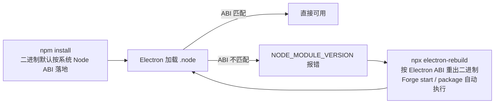

import { Meta } from '@storybook/addon-docs/blocks';

<Meta id="native-modules" title="进阶主题/原生模块" name="Docs" />

# 原生模块

原生模块（native addon）是 C/C++ 源码编译出的 `.node` 二进制，编译那一刻就绑定了目标平台、架构和运行时的 ABI。Electron 内置一份自己的 Node.js，ABI 与系统里安装的 Node 通常不同号——「npm install 装完就能 require」的默认因此不总成立。本课给出一套判断与修复路径：读报错里的 `NODE_MODULE_VERSION` 定位两边 ABI，用 `@electron/rebuild` 重构建对齐，分清 prebuild 生态里哪些模块免修、哪些必须重建，以及 Forge 在 start 与 package 里自动替你做了什么。编写 addon 本身（N-API、node-gyp）属于 addon 开发主题，本课只在边界处给入口。



| 回查项 | 值 |
| --- | --- |
| 诊断依据 | require 时的 `NODE_MODULE_VERSION` 报错；运行时 `process.versions.modules` |
| 修复命令 | `npx electron-rebuild -f -w <模块名>`（包：`@electron/rebuild`） |
| Forge 自动重建 | `electron-forge start` 与 `package` 时执行；make、publish 经级联 package 同样经过 |
| 定制入口 | forge.config 顶层 `rebuildConfig`，选项直通 `@electron/rebuild` |
| 打包解包 | `AutoUnpackNativesPlugin` 自动把原生模块解出 asar（8.1 已讲） |
| 免重建判据 | 模块用 N-API 编写且预编译产物随包分发（如 sharp） |

## 快速上手

沿用「[接入 TypeScript](?path=/docs/typescript-setup--docs)」一课的 my-ts-app 项目；原生模块直接进 `dependencies`——8.1 的裁剪规则在原生模块上没有例外。

```bash
cd my-ts-app

# 1. 安装一个典型的下载式原生模块
npm install better-sqlite3
npm install -D @types/better-sqlite3   # 若当前版本已自带类型声明可跳过
```

```ts
// src/main.ts（节选）：主进程加载并使用原生模块
import Database from 'better-sqlite3';

const db = new Database(':memory:');
db.exec('CREATE TABLE logs (message TEXT)');
db.prepare('INSERT INTO logs (message) VALUES (?)').run('hello from main');
const row = db.prepare('SELECT count(*) AS n FROM logs').get() as { n: number };

console.log('[native] Electron 内置 Node 的 ABI =', process.versions.modules);
console.log('[native] 查询行数 =', row.n);
```

```bash
# 2. 直接启动——Forge 在启动前自动重构建原生依赖
npm run start

# 3. 对照另一边：系统 Node 的 ABI 编号
node -p process.versions.modules

# 4. 互斥实验：此刻 node_modules 里的二进制已对齐 Electron
node -e "require('better-sqlite3')"
# 两个运行时 ABI 不同号时，这里抛出 NODE_MODULE_VERSION 报错
```

两个观察点：

- **第 2 步能直接跑通不是模块碰巧兼容**——`electron-forge start` 在启动前用 `@electron/rebuild` 把原生依赖对齐 Electron 的 ABI（Forge 项目不需要手动跑，见「Forge 下的自动处理」）；若绕过 Forge 用 `npx electron .` 直启一个刚装好依赖的项目，第 4 步的报错就会提前出现在 Electron 里；
- **第 4 步是本课的核心证据**——`npm install` 时下载的是系统 Node 运行时的二进制，start 后已被换成 Electron 运行时的产物，同一个 `.node` 文件同一时刻只服务一个运行时；若两边编号恰好相同（系统与内置 Node 同大版本），第 4 步不会报错——这本身就是「巧合可用」的现场证据，换一个 Node 或 Electron 大版本即复现。

## ABI：为什么原生模块会坏

native addon 在编译时面向某一版 Node.js 的 C++ 接口生成，接口随 Node 大版本演进，兼容性用编号管理——`NODE_MODULE_VERSION`，每条 Node 大版本线一个值。这个编号在编译时烙进二进制，运行时 `process.dlopen` 加载 `.node` 时核对，对不上立即报错。所以一个原生模块能否加载取决于两件事：平台与架构一致、运行时 ABI 一致；本课要解决的是第二件。

问题出在 Electron 不用你系统的 Node：它内置一份自己的 Node.js，且不是原样复刻——官方教程举的例子是，Electron 的 Node 链接 Chromium 的 BoringSSL 而不是 OpenSSL。这份内置 Node 有自己的 ABI，与你系统 Node 的编号通常不同，于是按系统 Node 落地的二进制进了 Electron 就可能对不上号。

### 报错里的两个数字

mismatch 的报错形态固定，两条数字就是全部诊断信息：

```text
Uncaught Error: The module '.../better_sqlite3.node'
was compiled against a different Node.js version using
NODE_MODULE_VERSION 127. This version of Node.js requires
NODE_MODULE_VERSION 137.
Please try re-compiling or re-installing the module (for instance,
using `npm rebuild` or `npm install`).
```

（数字为示例，以实际报错为准。）

- `compiled against 127`：二进制里烙的 ABI——它当前是给谁编的；
- `requires 137`：当前运行时（Electron）要的 ABI。

两边编号随时可查：系统 Node 用 `node -p process.versions.modules`；Electron 内置 Node 在主进程里读 `process.versions.modules`（快速上手第 2 步打印的就是它）。判断句：**`compiled against` 的数字等于系统 Node 的编号，说明二进制还没对齐 Electron，重构建；两个数字本来就相等，则模块可用，不需要动**。

一种值得知道的巧合：系统 Node 与 Electron 内置 Node 恰好同大版本时编号相同，模块装完直接能用。这是巧合不是兼容保障——Electron 换内置 Node 的节奏与升级系统 Node 无关，下一次升级就会打破，届时报错原样出现。

### N-API：跨运行时的例外

`NODE_MODULE_VERSION` 的约束只作用于传统 V8 接口的 addon。用 N-API（Node API）编写的模块面向一套刻意保持稳定的 ABI：同一份二进制可以直接在不同 Node 版本之间、以及 Node 与 Electron 之间加载，条件只剩平台与架构一致。这让「N-API + 预编译产物随包分发」成为免重建的判据，下一节展开。

边界一句：如何用 N-API 或 node-gyp 编写 addon、`binding.gyp` 怎么配置，属于 addon 开发主题，不在本课范围；本课处理的是「装别人发布的模块」这一侧。

## 用 @electron/rebuild 重构建

`@electron/rebuild` 把 node_modules 里的原生模块针对**项目当前安装的 Electron 版本**重新构建：读取 electron 包确定目标 ABI；对下载式模块先按 electron 运行时再取一次预编译产物，取不到才下载 Electron 头文件从源码编译。Forge 项目由 start 与 package 自动调用（见「Forge 下的自动处理」）；需要手动跑的场景：绕过 Forge 直接 `electron .` 调试、非 Forge 项目、CI 里想在构建前固定 ABI、自动重建失败后定点重试。

```bash
npm install --save-dev @electron/rebuild

npx electron-rebuild                        # 重建整个依赖树的原生模块
npx electron-rebuild -f -w better-sqlite3   # 强制重建单个模块（排错第一动作）
```

常用参数：

| 参数 | 作用 | 备注 |
| --- | --- | --- |
| `-f, --force` | 强制重新构建 | 已构建过也重来；排查「改了没生效」 |
| `-w, --which-module` | 只构建指定模块 | 可给多个 |
| `-o, --only` | 只构建列出的模块、忽略其余 | 设置后 `--types` 不再生效 |
| `-t, --types` | 重建哪些依赖类型 | 默认 `prod,optional`，devDependencies 需显式追加 |
| `-a, --arch` | 覆盖目标架构 | Forge 打包场景由 Forge 内部接管 |
| `-v, --version` | 指定目标 Electron 版本 | 默认读项目里的 electron 包 |
| `--build-from-source` | 跳过预编译下载，强制源码编译 | 怀疑预编译产物有问题时用 |
| `-m, --module-dir` | 指定 node_modules 位置 | monorepo 场景 |
| `-b, --debug` | 输出调试信息 | 下载与编译失败时的第一手线索 |

与 `npm rebuild` 的区别——这也是 mismatch 能不能修好的分水岭：

| | `npm rebuild` | `npx electron-rebuild` |
| --- | --- | --- |
| 目标运行时 | 执行它的系统 Node | 项目 Electron 内置 Node |
| 头文件来源 | 系统 Node | 自动下载 Electron 头文件 |
| 下载式模块取哪种产物 | 默认 node 运行时 | 先按 electron 运行时下载 |
| 能否修复 mismatch | 不能——把二进制又对齐回系统 Node | 能 |

报错文案里建议的 `npm rebuild` 是给纯 Node 环境的建议；在 Electron 场景跑它，错误会原样重现。

两条底层手动路径留作回查（`@electron/rebuild` 内部就是它们的自动化，日常不需要）：

```bash
# 环境变量法：让安装脚本走 Electron 头文件（npm_config_* 逐项传参）
npm_config_runtime=electron npm_config_disturl=https://electronjs.org/headers \
npm_config_target=<electron版本> HOME=~/.electron-gyp npm install

# node-gyp 直调：进入模块目录，指定目标版本、架构与头文件地址
HOME=~/.electron-gyp node-gyp rebuild \
  --target=<electron版本> --arch=x64 --dist-url=https://electronjs.org/headers
```

## prebuild：能直接用的与不能用的

预编译产物解决的是「源码编译慢、要装工具链」，不天然解决 ABI 匹配——除非作者提供了 Electron 运行时的产物。生态里两种分发形态，在 Electron 里的行为不同：

**下载式（`prebuild-install`，老牌的 `node-pre-gyp` 同理）。** 模块的 install 脚本在 `npm install` 时从发布页下载平台二进制，默认按 **node 运行时**取——拉下来的 `.node` 烙的是系统 Node 的 ABI，进 Electron 依然 mismatch。better-sqlite3 是这一类的代表。`electron-rebuild` 会再执行一次下载、把运行时参数换成 electron：发布过对应产物就直接下载（快，不编译），没发布过就回退源码编译（需要工具链）。

**随包分发（`prebuildify` 及其变体，如 sharp 的 `@img/sharp-*` 平台包）。** 预编译产物直接打进 npm 包或作为平台可选依赖一起安装，模块用 N-API 编写、不绑定 `NODE_MODULE_VERSION`，Electron 里通常免重建直接可用。sharp 官方文档明确：预编译二进制配合 Node-API v9 兼容运行时即可使用，没有重编译步骤。边界仍是 8.1 那条——`.node` 必须解出 asar（Forge 由 `AutoUnpackNativesPlugin` 自动做）；sharp 文档另记了一个 Linux 平台已知问题（Electron 的 Linux 二进制动态链接系统 glib 并泄漏符号，可能触发 GLib 断言失败），遇到时先考虑平台因素。

| 分发形态 | 代表 | npm install 后在 Electron 里 | electron-rebuild 的动作 |
| --- | --- | --- | --- |
| 纯源码包 | —— | 按系统 Node 编译，mismatch（缺工具链则安装即失败） | 下载 Electron 头文件，源码编译 |
| 下载式 prebuild-install / node-pre-gyp | better-sqlite3 | 拿到 node 运行时二进制，mismatch | 先按 electron 运行时下载，没有产物回退编译 |
| 随包分发 + N-API | sharp | 通常直接可用 | 无需执行 |

拿到一个陌生模块时的判断顺序：

```bash
# 看 install/build 脚本：有 prebuild-install / node-pre-gyp 是下载式，只有 node-gyp rebuild 必须本地编译
node -p "JSON.stringify(require('./node_modules/better-sqlite3/package.json').scripts)"
```

再看模块文档是否声明支持 Electron、是否基于 N-API；拿不准就直接 `npx electron-rebuild`——它对三种形态都是安全动作，有预编译下载预编译，没有就编译。

## Forge 下的自动处理

8.1 讲了打包侧的解包：`AutoUnpackNativesPlugin` 自动把原生模块追加进 `asar.unpack`。本课补齐另一半——ABI 重建在 Forge 链路里同样自动发生：

- **`electron-forge start`**：启动前调用 `@electron/rebuild` 把原生依赖对齐 Electron ABI——这就是 Forge 项目「装完直接 start 就能用」的原因；
- **`electron-forge package`**：按打包目标重建，交叉构建时按目标 arch 重建（见「[多平台构建](?path=/docs/cross-platform-builds--docs)」）；make、publish 经级联 package 同样经过这一步。

定制入口是 forge.config 顶层的 `rebuildConfig`，选项直通 `@electron/rebuild`（vite-typescript 模板里已有一行空的 `rebuildConfig: {}`）：

```ts
// forge.config.mts（节选）
const config: ForgeConfig = {
  rebuildConfig: {
    force: true,                      // 每次构建都强制重建
    onlyModules: ['better-sqlite3'],  // 只重建指定模块
    // buildPath、electronVersion 由 Forge 预置；arch 由 Forge 按打包目标覆盖
  },
  // ...
};
```

分工记忆：**ABI 匹配归 rebuild（start/package 自动，`rebuildConfig` 定制），文件落地归解包（`AutoUnpackNativesPlugin`）**——同一条打包链路里先后发生的两件事。报错时先分清缺的是哪一半：加载时报 `NODE_MODULE_VERSION` 是 ABI 没对上（本课处理）；报 `.node` ENOENT 是解包没落地（处理见「[打包](?path=/docs/packaging--docs)」一课的常见问题）。

Forge 项目不需要往 postinstall 里塞 `electron-rebuild`——start 已覆盖 dev 场景；真正需要的是绕过 forge 命令、直接跑 `electron .` 的项目。

## 最佳实践

- **把「能不能在 Electron 里跑」提前到选型。** 优先选 N-API + 预编译随包分发的模块；只能选下载式或纯源码模块时，确认它发布过对应 Electron 大版本的产物，或接受本地编译的工具链成本（环境准备见「[安装](?path=/docs/install--docs)」）。
- **排错第一动作固定为 `npx electron-rebuild -f`。** 官方排错清单第一条；先排除 ABI 因素，再查平台架构、Windows 延迟加载与工具链。
- **升级 Electron 大版本后统一重建一次。** 内置 Node 换代 ABI 就变，对全部原生模块跑 `electron-rebuild -f`，不混用升级前后的二进制。
- **CI 里显式重建。** 构建流程绕过 forge 命令（直接调 packager 或手动组装）时，在 install 之后加 `npx electron-rebuild -f`，不依赖隐式时机。
- **原生模块永远进 `dependencies`。** 8.1 的裁剪规则在这里代价更高：重建默认只处理 `prod,optional`，落在 devDependencies 的原生模块不但不进包，连重建都轮不到。

## 常见问题

- require 时报 `was compiled against a different Node.js version using NODE_MODULE_VERSION A. This version of Node.js requires NODE_MODULE_VERSION B`
  读两个数字：A 是二进制烙的 ABI，B 是当前运行时要的 ABI；`node -p process.versions.modules` 若等于 A，说明二进制还没对齐 Electron，执行 `npx electron-rebuild -f -w <模块名>`。重建时下载 404 会自动回退源码编译，再失败通常是工具链问题（见「[安装](?path=/docs/install--docs)」课）。
- 按报错文案跑了 `npm rebuild`，错误原样出现
  `npm rebuild` 面向系统 Node 重新执行安装脚本，产物仍是系统 Node 的 ABI——那条建议只对纯 Node 环境成立。Electron 里改用 `@electron/rebuild`（底层手动路径见「用 @electron/rebuild 重构建」一节末尾）。
- Forge 项目 dev 正常，打包产物拿到别的机器报 mismatch
  先核对重建的目标架构：package 按打包目标重建（交叉构建见「[多平台构建](?path=/docs/cross-platform-builds--docs)」课），拿宿主 arch 的直觉去跑目标 arch 的产物必然错位；再核对包里实际加载的二进制——解包目录 `app.asar.unpacked` 下的 `.node` 才是运行时读的那份。模块完全没被重建时，检查它是否在 `dependencies`。
- Windows 上报 `Module did not self-register` 或 `The specified procedure could not be found`
  这不是 ABI 数字问题，而是模块没按 Windows/Electron 的要求做延迟加载（`win_delay_load_hook`）。先升级模块版本（新版本通常已处理）；仍复现则向模块仓库反馈，判断依据是官方教程的 Windows 链接要求（链接 Electron 的 node.lib、`/DELAYLOAD:node.exe`、hook 目标直接链进最终 DLL）。
- 升级 Electron 大版本后，原本正常的模块又开始报 mismatch
  预期内行为：内置 Node 换代，ABI 变了。对全部原生模块执行 `npx electron-rebuild -f`；下载式模块若作者尚未发布新版本的 Electron 产物，会自动回退源码编译，或暂时锁旧版本过渡。
- 源码编译阶段 `gyp ERR!` 失败
  先看错误头部：找不到编译器或 Python 是平台构建环境不全（见「[安装](?path=/docs/install--docs)」课）；工具链齐全仍失败，多半是模块与当前 Node/Electron 版本不兼容，换模块版本或向其仓库反馈。

## 总结回顾

摘要：

原生模块是编译产物，编译时绑定了平台、架构与运行时 ABI（`NODE_MODULE_VERSION`）；Electron 内置自己的 Node.js（链接 Chromium 的 BoringSSL 而非 OpenSSL），ABI 与系统 Node 通常不同号，于是 npm install 按系统 Node 落地的二进制在 Electron 里加载即报错，报错里的两个数字就是两边的 ABI，`process.versions.modules` 随时可查。修复统一走 `@electron/rebuild`：按 Electron 的 ABI 先尝试下载 electron 运行时的预编译产物、下载不到再源码编译；`npm rebuild` 只对齐系统 Node，修不好这个错。prebuild 生态缓解的是编译成本：下载式（prebuild-install、node-pre-gyp）默认只给 node 运行时的产物，仍要重建；N-API + 随包分发（prebuildify、sharp 的平台包）通常免重建。Forge 项目里这条链路基本自动化——start 与 package 时自动重建（`rebuildConfig` 定制），解包交给 `AutoUnpackNativesPlugin`，两件事分别管 ABI 与文件落地。

一句话：

> 原生模块坏在 ABI 对不上：读报错里两个数字定位差异，`npx electron-rebuild` 把二进制对齐到 Electron，Forge 的 start 与 package 会自动替你做。

知识要点：

- `NODE_MODULE_VERSION` 是什么？报错里的两个数字和 `process.versions.modules` 分别怎么读？
- 为什么 npm install 装好的模块在 Electron 里可能加载失败？什么情况下碰巧能用？
- `npx electron-rebuild` 何时需要手动跑？常用参数有哪些？
- `npm rebuild` 与 `electron-rebuild` 的本质区别是什么？
- 下载式与随包分发的预编译模块在 Electron 里行为差在哪？拿到新模块怎么判断属于哪类？
- Forge 在哪些环节自动重建原生模块？`rebuildConfig` 管什么、Forge 预置了什么？
- ABI 重建与 asar 解包在打包链路里如何分工？

## 参考资料

- [Electron 教程：Using Native Node Modules](https://www.electronjs.org/docs/latest/tutorial/using-native-node-modules)（ABI 差异与 BoringSSL 示例、mismatch 报错形态、@electron/rebuild 推荐、npm 环境变量与 node-gyp 手动路径、win_delay_load_hook、排错清单）
- [@electron/rebuild（GitHub README）](https://github.com/electron/rebuild)（CLI 参数、对 prebuild-install 模块先下载后编译的策略、与 npm rebuild 的区别、Forge 与 Packager 集成）
- [Electron Forge：Configuration Overview](https://www.electronforge.io/config/configuration)（`rebuildConfig` 直通 @electron/rebuild、package 与 start 期间生效、arch 由 Forge 覆盖）
- [Electron Forge：Auto Unpack Native Modules Plugin](https://www.electronforge.io/config/plugins/auto-unpack-natives)（打包侧自动解包，与 8.1 呼应）
- [sharp：Installation](https://sharp.pixelplumbing.com/install)（N-API v9 预编译在 Electron 直接可用、asar 解包要求、Linux glib 已知问题）
