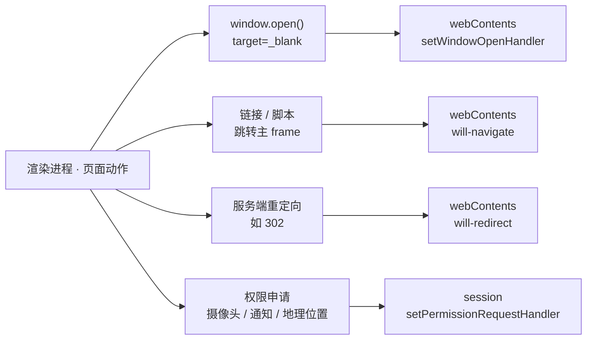

import { Canvas, Controls, Meta } from '@storybook/addon-docs/blocks';

import * as NavigationStories from './navigation-control.stories';

<Meta of={NavigationStories} name="Docs" />

# 导航与弹窗控制

「[安全清单](?path=/docs/security--docs)」把清单第 13、14 条和权限第 5 条指到了本课，「[webContents](?path=/docs/webcontents--docs)」把 `will-navigate` 的白名单策略留给了本课，「[session 与存储](?path=/docs/session--docs)」把权限入口指到了本课，「[打开外部资源](?path=/docs/shell--docs)」演完了「拦下 → 转交」链路的最后一环——本课把这些线索收拢，讲「拦」的全貌。核心判断一句话：**页面要"越界"只有三条通路——开新窗口、当前窗口跳转、申请权限；三个口子全部收口在主进程，而三个默认行为全是放行。**不挂拦截代码时：页面点外链就在应用里开出一个新 `BrowserWindow`，跳转直接生效，摄像头申请自动同意——"没写拦截"不是一个中性状态。读完你应能预测：任一页面动作走哪个口子、默认走向哪里；挂上 handler 加白名单后，拦下的东西去哪；为什么只堵一个口子照样漏。



| 页面动作 | 口子 | 挂在哪 | 默认行为（不设防） |
| --- | --- | --- | --- |
| `window.open()` / `target="_blank"` / 表单 `target="_blank"` | `setWindowOpenHandler` | webContents（按页面） | 应用内创建新 `BrowserWindow` |
| 用户或页面跳转主 frame | `will-navigate` | webContents（按页面） | 放行 |
| 服务端重定向（如 302） | `will-redirect` | webContents（按页面） | 放行 |
| 摄像头、通知、地理位置等申请 | `setPermissionRequestHandler` | session（按会话） | 自动同意全部请求 |

## 快速上手

沿用前面课程用 Forge 创建的项目（`src/index.js` + `src/preload.js` + `src/index.html`），给主进程补上三个 handler，跑通「点外链 → 进系统浏览器；跳站外 → 页面不动；申请摄像头 → 被拒」的最小闭环。

1. 在 `src/index.js` 顶部放白名单工具（判断只有这一份，三处复用）：

   ```js
   // 本地 loadFile 应用的最小策略：file: 协议（应用自己的页面）放行。
   // file: 的 origin 是不透明值没法比 origin，上线换 https / 自定义协议后，
   // 把判断改成比较 new URL(rawUrl).origin（写法见「导航拦截」一节）。
   function isAllowedOrigin(rawUrl) {
     try {
       return new URL(rawUrl).protocol === 'file:';
     } catch {
       return false; // 解析失败：一律拒绝
     }
   }

   function isSafeForExternalOpen(rawUrl) {
     try {
       const url = new URL(rawUrl);
       return url.protocol === 'https:' || url.protocol === 'http:';
     } catch {
       return false;
     }
   }
   ```

2. 在 `app.whenReady()` 之前挂两个 webContents 口子（全局兜底写法，机制见「全局兜底」）：

   ```js
   const { shell } = require('electron');

   app.on('web-contents-created', (_event, contents) => {
     // 口子一：应用内不开外部内容的新窗口，http(s) 目标转交系统默认浏览器
     contents.setWindowOpenHandler(({ url }) => {
       if (isSafeForExternalOpen(url)) setImmediate(() => shell.openExternal(url));
       return { action: 'deny' };
     });
     // 口子二：白名单外的跳转与 302 重定向一并拦下
     contents.on('will-navigate', (event, url) => {
       if (!isAllowedOrigin(url)) event.preventDefault();
     });
     contents.on('will-redirect', (event, url) => {
       if (!isAllowedOrigin(url)) event.preventDefault();
     });
   });
   ```

3. 在 `app.whenReady().then(...)` 里挂权限口子（`defaultSession` 在 ready 之后才可用）：

   ```js
   const { session } = require('electron');

   session.defaultSession.setPermissionRequestHandler(
     (_webContents, permission, callback, details) => {
       console.log('[权限申请]', permission, details.requestingUrl);
       callback(permission === 'notifications'); // 通知放行，摄像头等一律拒绝
     },
   );
   ```

主进程改动要在运行 `npm start` 的终端输入 `rs` 重启（规则见「[第一次运行](?path=/docs/first-run--docs)」）。在页面里放一个 `target="_blank"` 的外链、一段 `location.href = 'https://electronjs.org'` 和一个通知 / 摄像头申请按钮，核对三个观察点：

- 点外链 → 系统默认浏览器开出新标签，应用内没有新窗口，页面脚本不因 deny 抛错；
- 执行跳转代码 → 页面停在原地，主进程也不会收到任何加载事件；
- 点申请按钮 → 终端打出 `[权限申请] media ...` 且页面被拒；换成通知申请则放行。

完整参考实现（含 `setPermissionCheckHandler`、`requestingUrl` 来源核对与日志）在本课目录的 `navigation-main.js`。

## 三个口子

三个口子按**页面动作的形态**分工，不按危险程度：要新容器走 `setWindowOpenHandler`，要换内容走 `will-navigate`（重定向由 `will-redirect` 补口），要系统能力走权限 handler。挂载位置也不同——前三个事件都长在 `webContents` 上（每个页面一个口子），权限长在 `session` 上（每个会话一个口子）。这个差别决定了兜底要挂两处，也是"设了拦截却不生效"的主要来源。三个默认值同方向：**不设防就是全放行**，所以安全策略必须三个 handler 一起上，缺一个就留一条通路。

下面的推演把三条通路摆在一起：左侧选页面动作，打开对应口子的挂载开关并设置白名单，核对判定流程与走向。任意组合，核对正文断言。

<Canvas of={NavigationStories.Interactive} />
<Controls of={NavigationStories.Interactive} />

| 操作 | 可观察证据 |
| --- | --- |
| 保持默认（三个口子都不挂） | 三类动作全部落在「默认放行」：新窗真开、导航生效、摄像头授予 |
| 挂上 setWindowOpenHandler，白名单开 | 走向变「deny + 转交系统默认浏览器」——拦下了，且有去处 |
| 挂上 will-navigate，白名单关 | `preventDefault()`，页面留在原地 |
| 切到「锚点 / hash 跳转」 | 不经任何口子——页内导航不受这三类拦截影响 |
| 切到「302 重定向」 | 把关的是 `will-redirect`：只挂 `will-navigate` 的白名单挡不住重定向 |

## 窗口打开：setWindowOpenHandler

渲染端请求创建新窗口有四个入口：`window.open()`、`target="_blank"` 的链接、shift+点击链接、`target="_blank"` 的表单提交。四者都会在窗口创建之前经过你注册的 window open handler——官方对它的定位是 *"final say and full privilege"*：主进程在这里拿到最终决定权，`{ action: 'deny' }` 直接取消创建。创建真的发生之后，webContents 会发 `did-create-window` 事件；被 deny 的请求不触发它，所以它可以当"新窗落地"的确认信号用。

deny 不是终点。官方安全清单第 14 条的示例就是「deny + 转交」——应用内不开外部内容的新窗口，http(s) 目标校验后交给系统默认浏览器：

```js
const { shell } = require('electron');

contents.setWindowOpenHandler(({ url }) => {
  if (isSafeForExternalOpen(url)) {
    // 官方写法：setImmediate 让拦截先返回，再发起打开
    setImmediate(() => shell.openExternal(url));
  }
  return { action: 'deny' };
});
```

分工沿用「[打开外部资源](?path=/docs/shell--docs)」的表述：**handler 负责拦，shell 是放行后的去处**。`isSafeForExternalOpen` 的协议白名单写法也在那一课（`new URL()` 解析后比 `protocol`，不做字符串开头匹配）。

handler 的返回值决定新窗口怎么开：

| 返回字段 | 作用 |
| --- | --- |
| `action` | `'deny'` 取消创建；`'allow'` 放行，由 Electron 替页面创建窗口 |
| `overrideBrowserWindowOptions` | 覆盖新窗口的 `BrowserWindowConstructorOptions`，比页面传的 features 字符串更有力 |
| `outlivesOpener` | 默认 `false`：父窗口关闭会带走新窗；`true` 时新窗独立存活 |
| `allowPermissions` | 默认 `false`；放行新窗口发起的权限申请（较新版本引入的字段，语义以 webContents API 页为准） |

`action: 'allow'` 的正当场景是应用内确实要新窗：播放器小窗、独立工具窗。此时用 `overrideBrowserWindowOptions` 收紧选项，并记住优先级链：**features 字符串 < 父窗口安全相关的 webPreferences < handler 返回的选项**——页面从 features 里传特权项（如 `nodeIntegration`）是无效的，被父窗口限制的安全项不能被页面放宽。

handler 收到的 `details` 里有 `url`、`frameName`、`features`、`disposition`（`default` / `foreground-tab` / `background-tab` / `new-window` / `other`）、`referrer` 与可选的 `postBody`，按 `disposition` 可以区分"像标签页的开法"和"像新窗的开法"。

### 全局兜底：web-contents-created

handler 挂在 `webContents` 上——**每个页面一个口子**。`<webview>` 标签、`WebContentsView` 的视图各有自己的 webContents，只给主窗口挂，管不到它们开窗。官方清单的写法是挂一次、管全部：

```js
app.on('web-contents-created', (_event, contents) => {
  contents.setWindowOpenHandler(({ url }) => {
    if (isSafeForExternalOpen(url)) {
      setImmediate(() => shell.openExternal(url));
    }
    return { action: 'deny' };
  });
});
```

webview 的两条边界（清单第 11、12 条的落点）：`<webview>` 不写 `allowpopups` 属性时本来就不能开新窗——需要弹窗能力的嵌入内容必须显式给属性，按最小授权原则能不给就不给；页面代码还能自己创建 webview 标签，所以创建前要用 `will-attach-webview` 核对 `webPreferences` 与 `src`，不可信来源直接 `event.preventDefault()`。嵌入方式本身的完整机制见「[嵌入网页](?path=/docs/web-embeds--docs)」。

## 导航拦截：will-navigate

「[webContents](?path=/docs/webcontents--docs)」一课已讲清它的触发边界：`will-navigate` 在"用户或页面想在主 frame 上发起导航"时触发——点链接、改 `location`；程序化导航（`loadURL`、`back`）与页内导航（锚点、hash）都不触发；`preventDefault()` 拦下后不产生任何加载事件，URL 不变。本节把它变成白名单策略。官方安全清单第 13 条的写法是解析 URL、比较 `origin`：

```js
app.on('web-contents-created', (_event, contents) => {
  contents.on('will-navigate', (event, url) => {
    const parsedUrl = new URL(url);
    if (parsedUrl.origin !== TRUSTED_ORIGIN) {
      event.preventDefault();
    }
  });
});
```

其中 `TRUSTED_ORIGIN` 是应用自己的线上 origin（完整白名单工具见快速上手与本课目录的 `navigation-main.js`）。判断写法的要点与「打开外部资源」一课同款：**比较 `origin`，不做字符串开头匹配**——`startsWith('https://example.com')` 挡不住 `https://example.com.attacker.com`；解析失败（不是合法 URL）一律拦下。旧的事件签名把 `url` 放在位置参数上，文档已标记废弃，新写法从 `event.details` 取 `url` / `isMainFrame` / `frame`。

| 不触发 will-navigate 的场景 | 它的去向 |
| --- | --- |
| 程序化导航（`loadURL` / `back`） | 应用自己的代码，把关放在调用之前 |
| 页内导航（锚点、hash、`pushState`） | `did-navigate-in-page` 事件 |
| `window.open()` / `target="_blank"` | `setWindowOpenHandler`（本课第一个口子） |
| 子 frame 的导航 | `will-frame-navigate` 事件（按需挂载） |

### will-redirect：重定向的口子

服务端重定向（如 302）发生在**同一次导航的中途**——`did-start-navigation` 之后，不会再触发一遍 `will-navigate`。所以白名单策略必须补第二个监听：初始 URL 可信的页面被 302 带到恶意域，只挂 `will-navigate` 就漏了。对 `will-redirect` 调 `preventDefault()`，取消的是**整个导航**，不只是重定向这一跳：

```js
contents.on('will-redirect', (event, url) => {
  if (!isAllowedOrigin(url)) {
    event.preventDefault(); // 整个导航一起取消
  }
});
```

同族的 `did-redirect-navigation` 只是重定向后的通知事件，拦不了——把把关留给 `will-redirect`。

## 权限请求：session 权限 handler

权限侧的默认行为是全清单最反直觉的一条，官方原话：*"By default, Electron will automatically approve all permission requests unless the developer has manually configured a custom handler"*——不设 handler，摄像头、麦克风、地理位置、通知的申请一律自动同意。「安全清单」一课给过最小示例，本节给完整机制。权限 handler 挂在 **session** 上（会话分区见「[session 与存储](?path=/docs/session--docs)」）：`session.defaultSession` 只管没有分区的窗口，`session.fromPartition(...)` 创建的分区会话要各自再设——这是"设了 handler 却不生效"的常见来源。`defaultSession` 在 app ready 之后才可用。

```js
const { session } = require('electron');

app.whenReady().then(() => {
  session.defaultSession.setPermissionRequestHandler(
    (webContents, permission, callback, details) => {
      const allowed =
        permission === 'notifications' && isAllowedOrigin(details.requestingUrl);
      callback(allowed); // callback(true) 放行，callback(false) 拒绝
    },
  );
});
```

三个要点：`callback` 必须调用——漏调的分支会让请求悬挂，页面既不弹窗也不被拒（通行行为）；不想要 handler 时用 `setPermissionRequestHandler(null)` 清除；来源核对用 `details.requestingUrl`——官方注记明确，请求来自子 frame 时 `webContents` 只代表顶层页面，核来源要靠 `requestingUrl` 而不是拿 `webContents` 的 URL 猜。

常用 `permission` 取值（全量清单见参考资料）：

| permission | 对应能力 |
| --- | --- |
| `media` | 摄像头 / 麦克风——用 `details.mediaTypes` 区分设备 |
| `notifications` | 系统通知 |
| `geolocation` | 地理位置 |
| `clipboard-read` / `clipboard-sanitized-write` | 读 / 写剪贴板 |
| `fullscreen` / `automatic-fullscreen` | 进入全屏 / 无用户手势全屏 |
| `pointerLock` | 鼠标指针锁定 |
| `display-capture` | 屏幕捕获 |
| `mediaKeySystem` | DRM 保护内容 |
| `fileSystem` | File System API 读写（`details.filePath` / `fileAccessType`） |
| `openExternal` | 页面请求在外部程序打开链接 |

### setPermissionCheckHandler：检查侧

官方注记解释了为什么权限要设两个 handler：*"Most web APIs do a permission check and then make a permission request if the check is denied"*——多数 Web API 先做一次同步检查，被拒后才发正式申请。只设 request handler，页面在检查阶段就拿到的结果可能与你的授权意图不一致，所以要完整控制必须成对设置。check handler 同步返回 boolean：

```js
session.defaultSession.setPermissionCheckHandler(
  (_webContents, permission, requestingOrigin) => {
    if (permission === 'notifications') {
      return requestingOrigin === TRUSTED_ORIGIN;
    }
    return false;
  },
);
```

两条边界：`webContents` 参数可能为 `null`——service worker、通知检查这类非文档场景没有对应页面，此时按 `requestingOrigin` 判断；`isMainFrame` 对 `fileSystem` 请求恒为 `false`（Chromium 限制，官方注记）。

## 最佳实践

- **三个口子一起堵。** 只堵一个有两种典型漏法：只挂 `will-navigate`，`target="_blank"` 链接照样开新窗；只挂 `setWindowOpenHandler`，当前窗口跳转与 302 重定向照样生效。安全策略三处一起上，缺一个就留一条通路。
- **全局兜底挂 `web-contents-created`，差异化再按窗口细化。** 统一挂载覆盖 webview 与 `WebContentsView` 的视图；个别窗口确需放宽（如允许应用内新窗）时，再在该窗口的 webContents 上细化策略。
- **deny 要有去处。** 新窗拦下后 http(s) 目标转交 `shell.openExternal`（衔接「打开外部资源」），权限拒绝时让页面拿到反馈——静默拒绝在用户看来是"按钮坏了"。
- **白名单判断收口一份。** `isAllowedOrigin`（比 `origin`）与 `isSafeForExternalOpen`（比 `protocol`）各写一份、三处复用，不要在 handler 里现写 `startsWith`。
- **权限按会话逐一设置，request 与 check 成对上。** `defaultSession` 只管默认会话，分区会话要各自挂 handler；多数 Web API 先 check 后 request，两个 handler 的结论要一致。

## 常见问题

- 挂了 `setWindowOpenHandler`，点链接还是开出了新窗口
  handler 挂在单个窗口的 webContents 上，管不到其他 webContents——`<webview>`、`WebContentsView` 的视图各有一个口子。把挂载移到 `app.on('web-contents-created')`；webview 还要检查有没有写 `allowpopups` 属性。
- 只拦了 `will-navigate`，点 `target="_blank"` 的链接还是跳出去了
  `window.open()` 与 `target="_blank"` 不走 `will-navigate`，归 `setWindowOpenHandler` 管——两个口子的分工见开场参考表。
- 页面申请权限后一直没有回应，既不弹窗也不拒绝
  handler 里有分支没有调用 `callback`。`callback(true/false)` 必须在每个分支都落到，漏调的请求会悬挂。检查 `permission` 判断是否覆盖了所有取值（未知取值落 `callback(false)`）。
- `media` 权限分不清页面要的是摄像头还是麦克风
  看 `details.mediaTypes`（request handler）/ `details.mediaType`（check handler），按设备类型分别放行；不要见到 `media` 就 `callback(true)`。
- `allow` 放行的新窗口，选项没按 `overrideBrowserWindowOptions` 生效
  优先级链是 features 字符串 < 父窗口安全相关 webPreferences < handler 选项——与父窗口配置冲突的安全项（如被关掉的 `nodeIntegration`）不能被放宽；确认要覆盖的不是这类被限制项。

## 总结回顾

摘要：

本课把页面"越界"的三条通路收拢成一套拦截机制：开新窗口走 `webContents.setWindowOpenHandler`（官方定位 final say，`{ action: 'deny' }` 取消创建，`overrideBrowserWindowOptions` 覆盖新窗选项且优先级高于 features 字符串，`did-create-window` 是创建成功的确认信号）；当前窗口跳转走 `will-navigate` 白名单（解析 URL 比 `origin`，程序化导航与页内导航不触发）；服务端重定向走 `will-redirect` 补口（发生在同一次导航中途，`preventDefault()` 取消整个导航）；权限申请走 `session.setPermissionRequestHandler`（`callback(true/false)` 必须调用，来源核对靠 `details.requestingUrl`，与 `setPermissionCheckHandler` 成对设置应对先 check 后 request 的 Web API）。三个默认行为同方向——不设防就是全放行；handler 按 webContents 挂载，全局兜底用 `app.on('web-contents-created')`；权限按 session 挂载，分区会话要逐一设置。拦下不等于扔掉：http(s) 新窗转交 `shell.openExternal`，「handler 负责拦，shell 是放行后的去处」。

一句话：

> 页面越界只有三条通路，口子全在主进程，默认行为全是放行——安全清单的答案就是三个 handler 一起挂上。

知识要点：

- 页面发起的哪些动作走哪个口子？三个默认行为分别是什么、挂载位置有何不同？
- `setWindowOpenHandler` 的返回值有哪些字段？deny 之后怎样把 http(s) 目标交给系统浏览器？
- 新窗口选项的优先级链是什么？页面从 features 传特权项为什么无效？
- 怎么用 `web-contents-created` 做全局兜底？webview 开新窗受什么属性约束、创建前用什么事件核对？
- `will-navigate` 覆盖与不覆盖哪些导航？重定向的把关为什么必须用 `will-redirect`？
- 权限 handler 挂在哪个对象上？分区会话为什么会漏防？request 与 check handler 为什么成对设置？

## 参考资料

- [Electron API：window.open](https://www.electronjs.org/docs/latest/api/window-open)
  `window.open` 与新窗口创建机制、handler *"final say and full privilege"* 的定位、`{ action: 'deny' }` 取消创建、`overrideBrowserWindowOptions` 与 `outlivesOpener` 的语义、features 字符串 < 父窗口安全 webPreferences < handler 选项的优先级、渲染端特权 features 被忽略的注记。
- [Electron API：webContents](https://www.electronjs.org/docs/latest/api/web-contents)
  `setWindowOpenHandler` 触发条件（四个入口）与 `details` 参数、`did-create-window` 在 deny 时不触发的注记、`will-navigate` *"a user or the page wants to start navigation on the main frame"* 与程序化 / 页内导航不触发的原文、`will-redirect` 的触发时机与 *"prevent the navigation (not just the redirect)"*、`did-redirect-navigation` 不可拦、`will-frame-navigate`。
- [Electron API：session](https://www.electronjs.org/docs/latest/api/session)
  `setPermissionRequestHandler` 的 handler 签名与 `callback(true/false)` 语义、子 frame 用 `requestingUrl` 核来源的注记、`setPermissionCheckHandler` 的同步语义与 `webContents` 可为 `null` 的注记、*"Most web APIs do a permission check and then make a permission request"* 的成对设置依据、`permission` 全量取值清单、`fileSystem` 的 `isMainFrame` 限制。
- [Electron 教程：Security](https://www.electronjs.org/docs/latest/tutorial/security)
  第 13 条 `will-navigate` + `new URL().origin` 白名单官方写法与 `startsWith` 可被 `https://example.com.attacker.com` 骗过的原话、第 14 条 `setWindowOpenHandler` deny + `setImmediate` + `shell.openExternal` 官方示例、第 5 条权限默认自动同意的原文与 `setPermissionRequestHandler` 推荐写法、第 11/12 条 webview `allowpopups` 与 `will-attach-webview` 的边界。
