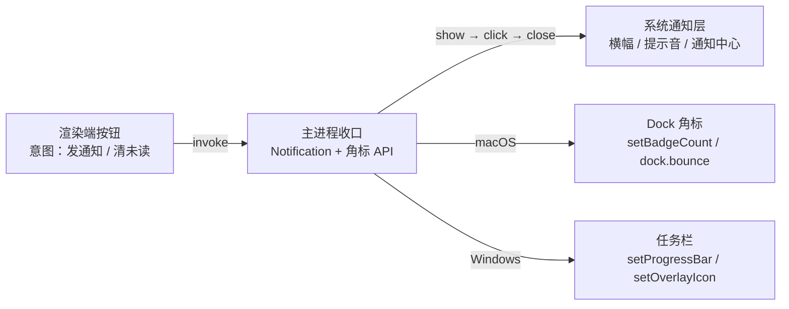

import { Canvas, Controls, Meta } from '@storybook/addon-docs/blocks';

import * as NotificationsStories from './notifications.stories';

<Meta of={NotificationsStories} name="Docs" />

# 通知与角标

把「有新消息」送达用户有两类动作：**通知**把消息推到系统层，以横幅、提示音和通知中心呈现，用户不看你应用时也能被触达；**角标**不打扰任何人，只在 macOS Dock 图标或任务栏上画一个待处理标记（红点数字、进度条、覆盖图标）。两者都是主进程能力——`Notification` 是主进程模块，Dock 与任务栏 API 也都从主进程调用；渲染端按钮经 IPC 触发是惯例（沿用「[双向调用](?path=/docs/ipc-invoke--docs)」的 invoke/handle 桥）。读完你应该能预测：`Notification.isSupported()` 为 `false` 时该直接降级而不是构造对象；构造出来的通知**不调用 `show()` 就不会显示**；点击通知**不会自动聚焦窗口**，恢复窗口是你在 `click` 回调里自己做的事；macOS 未签名的二进制会触发 `failed` 事件；Windows 上没设 AppUserModelID 通知可能根本不出现。



| 回查项 | 值 | 备注 |
| --- | --- | --- |
| 模块进程 | `Notification`、`app.dock` 都在主进程 | 渲染端经 IPC 触发，惯例见「[预加载脚本](?path=/docs/preload--docs)」 |
| 支持检测 | `Notification.isSupported()` → boolean | 为 `false` 时降级，不构造不 `show()` |
| 最小发法 | `new Notification({ title, body }).show()` | 构造不显示，必须显式 `show()` |
| 点击交互 | `notification.on('click', …)` | 不自动聚焦窗口，要自己 `win.show()` |
| 生命周期事件 | `show` / `click` / `close` / `reply` / `action` / `failed` | `close` 不保证触发；Windows 上带 `reason` |
| macOS 角标 | `app.setBadgeCount([count])` | 仅 Linux / macOS；`0` 隐藏；省略 `count` 显示白点 |
| macOS 弹跳 | `app.dock.bounce([type])` → id | 默认 `informational`；应用聚焦时返回 `-1` |
| Windows 任务栏 | `win.setProgressBar()` / `win.setOverlayIcon()` | 进度条与 16×16 覆盖图标 |
| Windows 通知前提 | 开始菜单快捷方式 + AppUserModelID | Squirrel 打包自动设置；开发时要自己调 `app.setAppUserModelId()` |
| macOS 签名 | 未签名二进制触发 `failed` 事件 | 官方标注：需要代码签名，见「[签名与公证](?path=/docs/code-signing--docs)」 |

## 快速上手

沿用前面课程用 Forge 创建的项目（`src/index.js` + `src/preload.js` + `src/index.html`），三步接通「点按钮 → 系统通知弹出 → 点通知窗口到前台」。完整参考实现（含未读角标与 Windows 分支）在本课目录的 `notify-main.js` 与 `notify-preload.js`。

1. 在 `src/index.js` 收口通知——它是主进程模块：

   ```js
   const { app, BrowserWindow, Notification, ipcMain } = require('electron');

   ipcMain.handle('notify:send', (_event, { title, body }) => {
     // 不支持桌面通知的系统直接降级，不构造对象
     if (!Notification.isSupported()) {
       return { ok: false, reason: 'UNSUPPORTED' };
     }
     const notification = new Notification({ title, body });
     // 点击不会自动聚焦窗口：恢复窗口是回调里自己做的事
     notification.on('click', () => {
       BrowserWindow.getAllWindows()[0]?.show();
     });
     notification.show();
     return { ok: true };
   });
   ```

2. 在 `src/preload.js` 包装成具名动词（原则见「[预加载脚本](?path=/docs/preload--docs)」）：

   ```js
   contextBridge.exposeInMainWorld('notify', {
     send: (body) => ipcRenderer.invoke('notify:send', { title: '新消息', body }),
   });
   ```

3. 在 `src/index.html` 的 `</body>` 之前调用：

   ```html
   <script>
     const button = document.createElement('button');
     button.textContent = '发一条通知';
     document.body.append(button);
     button.addEventListener('click', async () => {
       const result = await window.notify.send('报表导出完成');
       if (!result.ok) console.warn('当前系统不支持桌面通知');
     });
   </script>
   ```

主进程改动要在运行 `npm start` 的终端输入 `rs` 重启（规则见「[第一次运行](?path=/docs/first-run--docs)」）。核对两个观察点：

- 点按钮 → 系统横幅弹出（macOS 会进通知中心）；
- 点横幅 → 窗口到前台——这不是系统送的，是第 1 步 `click` 回调里那行 `show()` 起的作用；把那行删掉再试，点了横幅窗口纹丝不动。

macOS 下在开发模式直接运行时，若通知不弹且主进程收到 `failed` 事件，是签名问题而非代码问题，见「常见问题」。

## 发通知

`Notification` 是主进程模块：`new Notification(options)` 构造对象，`.show()` 才推送到系统，之后你的代码通过事件回调和系统行为打交道——用户点横幅是 `click`，横幅消失是 `close`，带回复输入的通知收到文字是 `reply`。`show()` 重复调用会先收起先前那条，再以相同属性新建一条。开始之前先问一句 `Notification.isSupported()`：不支持桌面通知的系统（例如老版 Windows）返回 `false`，此时应降级为角标或日志，而不是构造对象。

下面的模拟把一次通知的完整事件流画出来：点「发通知」模拟渲染端经 IPC 触发，横幅出现后点横幅本体或点右上角 ×，观察事件顺序和窗口状态。

<Canvas of={NotificationsStories.Interactive} />
<Controls of={NotificationsStories.Interactive} />

| 操作 | 可观察证据 |
| --- | --- |
| 点「发通知」 | 事件日志出现 `1 show`，右侧横幅出现；此时窗口仍在后台 |
| 点横幅本体 | 日志追加 `2 click`；勾选「click 里调 win.show()」时窗口转为前台聚焦、日志多一条 `3 win.show()`；不勾选时窗口留在后台 |
| 点横幅右上角 × | 日志追加 `close`，横幅标记为已关闭 |
| 打开 Show code | 看到该 Canvas 实际执行的 `notification-sim.ts`（macOS 横幅样式模拟） |

### 构造选项与平台差异

`new Notification(options)` 的 options 是本课最主要的回查面，平台标注直接决定「这个选项在你用户的机器上有没有效」：

| options | 作用 | 平台 |
| --- | --- | --- |
| `title` | 通知标题 | 通用 |
| `body` | 正文 | 通用；macOS 正文上限 256 字节，超长截断 |
| `subtitle` | 标题下方的小字 | macOS |
| `silent` | 是否不发系统提示音 | 通用 |
| `icon` | 通知图标 | 通用；传本地图标文件路径或 `NativeImage` |
| `sound` | 自定义提示音文件名 | macOS |
| `hasReply` | 附带行内回复输入框 | macOS / Windows |
| `replyPlaceholder` | 回复输入框的占位文字 | macOS / Windows |
| `actions` | 附加操作按钮（`NotificationAction[]`） | macOS / Windows；配合 `action` 事件 |
| `closeButtonText` | 关闭按钮文字，空串用系统默认 | macOS |
| `timeoutType` | `'default'` 常规超时 / `'never'` 常驻不自动消失 | Linux / Windows |
| `urgency` | `'normal'` / `'critical'` / `'low'` 优先级 | Linux / Windows |
| `toastXml` | 完全自定义的 toast XML，**取代以上所有属性** | Windows |
| `id` | 通知标识，缺省随机 UUID | macOS / Windows |
| `groupId` / `groupTitle` | 通知分组显示 | macOS / Windows（`groupTitle` 仅 Windows） |

两组容易误用的边界：`actions` 只是往横幅上放按钮，点了之后发生什么完全由你监听的 `action` 事件决定（回调给 `details.actionIndex`）；`toastXml` 一旦给出，Windows 上其他选项全部失效——它不是微调，是整条替换。另外主进程还有一套通知中心历史管理（`Notification.getHistory()` / `remove(id)` / `removeAll()`），需要「撤回已发通知」时查 API 文档。

### 事件与点击交互

```js
const notification = new Notification({
  title: '新消息',
  body: '报表导出完成',
  hasReply: true, // macOS / Windows：横幅带回复框
});

notification.on('show', () => console.log('已展示'));
notification.on('click', () => {
  // 系统不会替你聚焦窗口：恢复窗口、清角标都在这里自己做
  win.show();
});
notification.on('reply', (_event, details) => {
  console.log('用户回复了：', details.reply);
});
notification.on('action', (_event, details) => {
  console.log('用户点了第', details.actionIndex, '个 action 按钮');
});
notification.on('close', (event, reason) => {
  // reason 仅 Windows：'userCanceled' | 'applicationHidden' | 'timedOut'
});
notification.on('failed', (_event, error) => {
  console.error('通知展示失败：', error); // macOS 未签名等场景会走到这里
});
notification.show();
```

事件是这个模块的主线，三条边界贴着记：`close` **不保证触发**（系统可能直接收走通知），别把「已读」逻辑挂在 `close` 上；`reply` 与 `action` 的回调参数在近版本改为 details 对象（`details.reply` / `details.actionIndex`），旧的位置参数已弃用，升级 Electron 时留意；`failed` 的 `error` 来自 `show()` 的执行，macOS 未签名二进制会在这里报错——生产环境把 `failed` 落到日志，别让通知静默失败。

主动收起一条通知用 `notification.close()`（Windows 上还会顺手把它从操作中心移除）；给同一条通知补充信息时直接再调 `show()`，旧行会以相同属性重建。

### 渲染端 Web Notification

渲染进程里 Web 平台自带的 `Notification` 也能弹通知：

```js
// 渲染端页面主世界：Web Notifications API
const notification = new Notification('新消息', { body: '导出完成' });
notification.onclick = () => window.focus();
```

官方教程对两条路径的定位是：需要另一侧的 API 时走 IPC。差异在能力与归属——Web 版没有 `hasReply` / `actions` / `toastXml` 这些 Electron 扩展，`onclick` 等回调也只落在渲染端，主进程不知道通知被点过（想同步未读角标还得再发一条 IPC）。所以惯例保持简单：**正式通知一律主进程发**，渲染端 Web 版只适合原型验证。

## 角标

角标和通知回答不同的问题：通知是「推一条消息」，角标是「在 Dock / 任务栏上标一个待处理状态」——没有声音、没有横幅，用户瞥一眼图标就知道有几件事没看。三个平台三套机制：macOS 是 Dock 图标上的红点数字与弹跳，Windows 是任务栏按钮上的进度条与 16×16 覆盖图标，Linux 靠桌面环境是否支持 D-Bus 接口。另一种「常驻而不打扰」的形态——常驻系统托盘的图标——见「[托盘](?path=/docs/tray--docs)」，本课只讲图标上的状态标记。共同纪律只有一条：**角标是状态视图，计数的真相收口在主进程一处**——未读数加减、清零、刷新都在同一个函数里，UI 只是它的投影。

下面的模拟并排画出三个平台各自的视觉位置，用 Controls 调整输入，看每个 API 各改哪一处：

<Canvas of={NotificationsStories.Badges} />
<Controls of={NotificationsStories.Badges} />

| 操作 | 可观察证据 |
| --- | --- |
| 调整 badgeCount | Dock 图标右上角红点数字同步变化，调到 0 红点消失 |
| bounce 选 `informational` / `critical` | 图标倾斜示意弹跳，下方标注两种类型的停止条件差异 |
| progress 选 `0.6` / `indeterminate` | 任务栏按钮下沿出现 60% 进度条 / 斜纹（真实系统为滚动动画） |
| 打开 overlay | 任务栏按钮右下角叠出一个小圆点 |
| 打开 Show code | 看到该 Canvas 实际执行的 `badge-sim.ts` |

### macOS Dock：badge 与弹跳

```js
// app.setBadgeCount：红点数字，仅 Linux / macOS，返回是否成功
app.setBadgeCount(3);   // Dock 图标显示红点 3
app.setBadgeCount(0);   // 0 隐藏红点
app.setBadgeCount();    // 省略参数：显示不带数字的白点（语义是「有未知条数」）
app.getBadgeCount();    // 读回当前值（macOS）

// app.dock 弹跳：请求用户注意，仅 macOS
if (app.dock) {
  const id = app.dock.bounce('informational'); // 默认值，弹约 1 秒
  // app.dock.bounce('critical'); // 持续弹，直到应用激活或 cancelBounce(id)
  // app.dock.cancelBounce(id);  // 主动取消
}
```

两条边界贴着记：`app.dock` 只在 macOS 存在（其他平台是 `undefined`，直接调用会抛错，先判平台或判存在性）；`dock.bounce` 只在应用**未聚焦**时有意义，应用聚焦中调用返回 `-1`——拿到 id 后先判 `-1` 再留着 `cancelBounce` 用。另外 `informational` 虽然只弹一秒，请求本身保持活跃到应用激活或被取消，想干净收尾就保留 id。`setBadgeCount` 在 macOS 上需要通知权限才生效；需要非数字角标（如文字「NEW」）时用字符串形态的 `app.dock.setBadge('NEW')`，数字一律走 `setBadgeCount`。

### Windows 任务栏：进度与覆盖图标

Windows 没有 Dock 红点，「角标」落在任务栏按钮上，两个 API 各管一件事：

```js
// 进度条：贴在任务栏按钮下沿
win.setProgressBar(0.6);        // 有效范围 [0, 1.0]
win.setProgressBar(1.5);        // > 1 进入不确定态（滚动动画）
win.setProgressBar(-1);         // < 0 移除进度条
win.setProgressBar(0.5, { mode: 'paused' }); // mode 仅 Windows：none / normal / indeterminate / error / paused

// 覆盖图标：任务栏按钮右下角叠一枚 16×16 图标
win.setOverlayIcon(icon, '3 条未读'); // 第二个参数给屏幕阅读器的描述
win.setOverlayIcon(null, '');         // 传 null 清除
```

语义分工清楚：进度条表达「有任务在进行」（下载、同步），覆盖图标表达「有待处理」（未读数、状态点）。做未读角标时用覆盖图标，别拿进度条凑——用户对任务栏进度条有「进度」的既定预期。同类的关注类 API 还有 `win.flashFrame(flag)`：闪烁窗口以吸引注意，Electron 31 起 macOS 上会持续闪烁 Dock 图标，与 `dock.bounce` 二选一即可，别叠加着用。

### Linux 与能力检测

Linux 的两条链路都依赖桌面环境：通知走 `libnotify`，凡是遵循 Desktop Notifications Specification 的环境（GNOME、KDE、Cinnamon、Enlightenment、Unity）都能收；`setBadgeCount` 与进度条走 LauncherEntry D-Bus 接口，且要求应用的 `.desktop` 文件名与 `app.setDesktopName` 设置一致，不支持的桌面环境静默无效，不确定态在 Linux 不支持。

所以能力检测按层做，别按平台名猜：通知支持与否问 `Notification.isSupported()`；Dock API 存在与否判 `app.dock`；平台分支用 `process.platform === 'darwin'` / `'win32'`。守住的回报是同一份代码在三台机器上都不报错、各取所能。

## 最佳实践

- **通知与角标都在主进程收口。** 渲染端只表达「发一条通知」的意图，经具名通道触发；`isSupported`、签名、平台分支、未读计数这些细节不出主进程（通道设计见「[双向调用](?path=/docs/ipc-invoke--docs)」）。
- **发之前先问 `isSupported()`，显示失败看 `failed`。** 不支持的系统降级为角标或日志；生产环境监听 `failed` 落日志，尤其 macOS 未签名会走到这里。
- **点击通知 = 用户已注意。** `click` 回调里做两件事：`win.show()` 恢复窗口、清零未读角标；窗口不聚焦、红点不清零是最常见的「功能做了但没闭环」。
- **未读数只留一份真相。** 加一、清零、刷新角标收口在主进程同一个函数，macOS 写 Dock 红点、Windows 写覆盖图标，UI 永远投影它而不是各自记账。
- **克制使用强提醒。** `critical` 弹跳、`urgency: 'critical'`、`timeoutType: 'never'` 都属于「不点不消失」的强提醒，只留给真正紧急的场景；普通消息默认行为即可。

## 常见问题

- 通知弹出来了，点横幅窗口却没反应
  `click` 不会自动聚焦窗口——在回调里自己调 `win.show()`。自检方法：把回调删掉再点一次，行为不变就说明你本来就没监听 `click`。
- Windows 上通知不显示，或发送者显示成 "Electron"
  缺 AppUserModelID。开发模式在主进程调 `app.setAppUserModelId(process.execPath)`；用 Squirrel 打包后 Electron 会自动设置正确的值，无需手动。
- macOS 开发模式下通知不弹，主进程收到 `failed` 事件
  官方标注通知需要代码签名，未签名的二进制会触发 `failed` 且不进通知中心。代码本身没问题，打包签名后验证即可（流程见「[签名与公证](?path=/docs/code-signing--docs)」）。
- `app.setBadgeCount(3)` 在 Windows 上没有任何效果
  它只覆盖 Linux / macOS。Windows 的「角标」是任务栏层的：未读用 `win.setOverlayIcon(icon, description)`，进行中任务用 `win.setProgressBar(value)`。
- `app.dock.bounce()` 返回 `-1`
  应用当前处于聚焦状态，弹跳只对「不在前台的窗口」有意义。拿到返回值先判 `-1` 再保存 id。
- Dock 弹跳停不下来，或弹了一下之后行为怪异
  `critical` 持续弹到应用激活或 `cancelBounce(id)`；`informational` 只弹约一秒，但请求保持活跃到激活或取消——保留返回的 id，需要时主动 `cancelBounce(id)` 收尾。

## 总结回顾

摘要：

通知与角标是两类动作：通知把消息推到系统层，角标在 Dock / 任务栏上标状态。`Notification` 是主进程模块——`isSupported()` 先行，`new Notification(options)` 构造后必须 `show()`，事件是主线：`show` / `click` / `close`（不保证触发，Windows 带 `reason`）/ `reply` / `action` / `failed`；点击不自动聚焦窗口，`win.show()` 与清角标都是你在 `click` 回调里自己做的事。构造选项大量平台限定：`hasReply` / `actions`（macOS / Windows）、`timeoutType` / `urgency`（Linux / Windows）、`toastXml` 整条替换 Windows 通知；渲染端 Web Notification 缺少这些扩展，正式通知一律主进程发。角标侧，macOS 用 `app.setBadgeCount()`（0 隐藏、省略参数显示白点）与 `app.dock.bounce()`（`informational` 弹一秒、`critical` 持续到激活或取消，聚焦时返回 `-1`）；Windows 用 `win.setProgressBar()` 与 16×16 的 `win.setOverlayIcon()`；Linux 依赖 libnotify 与 LauncherEntry D-Bus。未读数的真相收口在主进程一处，三端 UI 只是投影。

一句话：

> 通知是推给系统层的一段事件流，角标是画在 Dock / 任务栏上的状态视图；两者都是主进程能力，渲染端经 IPC 触发，而「点击通知恢复窗口、清零角标」永远是你在回调里自己做的事。

知识要点：

- `Notification` 在哪个进程？渲染端怎么触发一条通知？
- 构造之后通知为什么没显示？`show()` 重复调用会怎样？
- `click` 事件会自动聚焦窗口吗？标准做法是什么？
- `close` 事件保证触发吗？Windows 上它的 `reason` 有哪些取值？
- `actions` 加的按钮点击后发生什么？Windows 想完全自定义通知用什么选项？
- 渲染端 Web Notification 与主进程 `Notification` 差在哪？惯例选哪条路？
- macOS Dock 红点怎么设置、怎么隐藏？省略 `count` 参数会怎样？
- `dock.bounce` 的两种类型分别什么时候停？返回 `-1` 说明什么？
- Windows 任务栏上的「角标」用哪两个 API？各自怎么清除？
- Linux 上通知与角标各依赖什么？能力检测按哪几层做？

## 参考资料

- [Electron API：Notification](https://www.electronjs.org/docs/latest/api/notification)
  全部构造选项与平台标注、`show()` / `close()` 语义与重复调用行为、六种事件的回调签名、`isSupported()`、macOS 代码签名要求与未签名触发 `failed` 的原文、通知中心历史管理方法。
- [Electron 教程：Notifications](https://www.electronjs.org/docs/latest/tutorial/notifications)
  三平台通知链路概览、Windows 开始菜单快捷方式与 AppUserModelID 要求、Squirrel 自动设置与开发模式手动 `app.setAppUserModelId(process.execPath)`、macOS 256 字节截断、渲染端 Web Notifications API 的定位。
- [Electron API：Dock](https://www.electronjs.org/docs/latest/api/dock)
  `dock.bounce` 两种类型的停止条件与聚焦时返回 `-1`、`cancelBounce`、`setBadge` / `getBadge` 字符串角标、Dock 类仅 macOS 且不从 electron 模块导出的说明。
- [Electron API：app](https://www.electronjs.org/docs/latest/api/app)
  `setBadgeCount` 的平台标注（Linux / macOS）、省略 `count` 显示白点、返回值、Linux `.desktop` 文件名匹配与 LauncherEntry D-Bus 依赖、`getBadgeCount` 与 `app.dock` 属性说明。
- [Electron API：BrowserWindow](https://www.electronjs.org/docs/latest/api/browser-window)
  `setProgressBar` 的取值范围、负值移除、大于 1 进入不确定态与 `mode` 取值、Linux 无不确定态；`setOverlayIcon` 的 16×16 覆盖与 `null` 清除；`flashFrame` 的行为。
