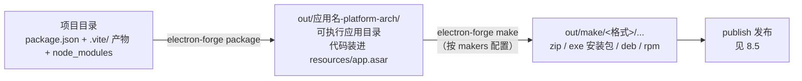

import { Meta } from '@storybook/addon-docs/blocks';

<Meta id="packaging" title="打包与发布/打包" name="Docs" />

# 打包

打包解决一个问题：把"开发机上能跑的项目"变成"用户手里能安装或解压的东西"。Electron Forge 把这件事分成两层：`package` 产出**可执行应用目录**——一份带着 Electron 本体、能直接双击运行的完整应用，但它不是分发格式；`make` 在 package 产物之上产出**可分发安装包**——dmg、zip、exe 安装器、deb、rpm 这些真正发给用户的文件。决定这份包里有什么、长什么样的，是三个开关：依赖裁剪只带 `dependencies`、asar 把代码归档成单文件、`packagerConfig` 把打包选项直通给底层的 `@electron/packager`。

读完你应能预测：在「[接入 TypeScript](?path=/docs/typescript-setup--docs)」一课的 vite-typescript 项目里跑 `npm run package`，`out/my-app-darwin-arm64/` 下会出现可直接打开的 `.app`；接着跑 `npm run make`，`out/make/zip/darwin/arm64/` 下会出现一个 zip；打进包里的只有 `dependencies`，你的全部源码收在 `resources/app.asar` 这一个归档文件里。



| 回查项 | 值 | 备注 |
| --- | --- | --- |
| package 产物 | `out/<应用名>-<platform>-<arch>/` | 可执行 bundle，**不是**分发格式 |
| make 产物 | `out/make/` | 安装包与压缩包，格式由 `makers` 决定 |
| 默认目标 | 当前机器的 platform 与 arch | 命令行 `--platform`、`--arch` 可指定 |
| 依赖裁剪 | `prune` 默认 `true` | 遍历 node_modules 剔除 `devDependencies` |
| asar | packager 自身默认 `false`，模板设 `asar: true` | 代码归档为单文件，只读 |
| asar 解包 | `asar.unpack` / `asar.unpackDir` | 原生模块由 `plugin-auto-unpack-natives` 自动加 |
| 配置入口 | `forge.config` 的 `packagerConfig` | 字段直通 `@electron/packager` 选项 |
| 不可覆盖项 | `dir`、`arch`、`platform`、`out`、`electronVersion` | Forge 内部设定，写在 `packagerConfig` 里无效 |

## 快速上手

沿用「[接入 TypeScript](?path=/docs/typescript-setup--docs)」一课的 vite-typescript 项目；每条命令后标注可观察结果。

```bash
# 1. （无项目时）创建工程化课程同款项目
npx create-electron-app@latest my-app --template=vite-typescript
cd my-app

# 2. 产出可执行应用目录
npm run package
ls out            # my-app-darwin-arm64（macOS 上；结构见下一节）
open out/my-app-darwin-arm64/*.app   # 直接启动，验证"能跑"

# 3. 在 package 之上生成分发格式
npm run make
ls -R out/make    # zip/darwin/arm64/my-app-darwin-arm64-1.0.0.zip
```

两个观察点：

- **第 2 步的日志先出现 Vite 构建行再打包**——Vite 插件接管了 `.vite/` 产物的构建（7.1 已讲），package 只是消费这些产物；
- **第 3 步没有重新手写打包逻辑**——make 默认先自动执行一次 package（级联），再交给配置里的 makers 产分发格式；模板在 macOS 上只配了 zip（darwin），所以 `out/make` 下只有 zip。

## package：应用目录

`electron-forge package` 调用 `@electron/packager` 完成三件事：把官方预编译的 Electron 本体复制成一份目标平台的可执行 bundle（macOS 是 `.app`，Windows 是带 `.exe` 的目录）；把你的项目代码连同生产依赖装进包里的 asar 归档；顺手处理平台细节——按 Electron ABI 重编译原生模块、应用图标、macOS 签名与公证（签名留给「[签名与公证](?path=/docs/code-signing--docs)」一课）。产物落在 `out/` 下，以 `<应用名>-<platform>-<arch>` 命名。

macOS 与 Windows 的产物内部结构（Linux 与 Windows 同构，可执行文件无 `.app` 外壳）：

```text
out/my-app-darwin-arm64/           # Windows: out/my-app-win32-x64/
└─ my-app.app                      # └─ my-app.exe          # 可执行文件
   └─ Contents/                    #    resources/
      ├─ MacOS/my-app              #       ├─ app.asar
      ├─ Info.plist                #       └─ app.asar.unpacked/
      ├─ Frameworks/               #    locales/ *.dll ...
      └─ Resources/
         ├─ app.asar               # 你的代码与生产依赖（单文件归档）
         └─ app.asar.unpacked/     # 被解包出来的文件（有原生模块时存在）
```

`app.asar` 里装的是项目目录的快照：`package.json`、`.vite/` 构建产物、`node_modules` 里剩下的生产依赖，以及未被排除的源码与配置。Electron 启动打包应用时，正是读这份归档里 `package.json` 的 `main` 找到 `.vite/build/main.cjs`——7.1 讲的"`main` 指向产物"在打包后依然成立。想看归档内容可用 `npx @electron/asar list out/my-app-darwin-arm64/*.app/Contents/Resources/app.asar`。

边界三条：默认只打当前平台与架构，交叉构建在「[多平台构建](?path=/docs/cross-platform-builds--docs)」一课；`overwrite` 默认 `false`，`out/` 下已存在同名目录时会跳过，重复打包要么先删掉旧产物、要么在配置里设 `overwrite: true`；`packagerConfig` 里写 `dir`、`out`、`electronVersion` 这类字段无效，它们由 Forge 内部接管。

## make：分发格式

`electron-forge make` 接收 package 的产物，交给配置里 `makers` 数组中的各个 maker，产出真正分发给用户的安装包或压缩包，落在 `out/make/` 下。命令级联：make 默认先自动跑一遍 package，连续调格式时可用 `--skip-package` 跳过重打包；`--targets` 可临时指定只跑某几个 maker。

产物路径按 `out/make/<格式>/...` 组织。两个代表性产物（zip 的归档名是 `<包目录名>-<版本号>.zip`；Squirrel 一次产出三个文件）：

```text
out/make/
├─ zip/
│  └─ darwin/arm64/
│     └─ my-app-darwin-arm64-1.0.0.zip    # macOS 的 zip 里是完整 .app
└─ squirrel.windows/
   └─ x64/
      ├─ my-app-1.0.0 Setup.exe           # 主安装器
      ├─ my-app-1.0.0-full.nupkg          # 自动更新用的 NuGet 包
      └─ RELEASES                         # 更新元数据
```

每个 maker 只在它支持的平台与 `platforms` 列表内运行：模板配置里 `new MakerZIP({}, ['darwin'])` 限定 zip 只在 macOS 产出，`MakerSquirrel` 默认平台是 win32，且只能在 Windows（或装了 mono 与 wine 的 Linux）上执行。所以"在 macOS 上跑 `npm run make` 只得到 zip"是预期行为，不是漏配；deb、rpm 要在 Linux 上产出。各平台的安装包矩阵与 CI 交叉构建见「[多平台构建](?path=/docs/cross-platform-builds--docs)」，zip 与 Squirrel 产物如何在自动更新链路中被消费见「[自动更新](?path=/docs/auto-update--docs)」。

## 依赖裁剪

打进包里的依赖范围由一条规则决定：**`prune` 默认 `true`，`@electron/packager` 会遍历 node_modules 依赖树，把 `package.json` 里声明在 `devDependencies` 的包从产物中剔除**。可核对证据：在项目里装一个只出现在 `devDependencies` 的包（如 `lodash`），打包后 `npx @electron/asar list <app.asar> | grep lodash` 查不到；挪进 `dependencies` 重打，就能查到。

推论与边界：

- **Forge 全套工具链天然不进包**——`electron`、各 `@electron-forge/*` 包、Vite、TypeScript 全是 devDependencies，这就是 1.2 课程说"工具链全部是开发依赖"的回报；
- **判据是"运行时会不会被 require"，不是"开发机要不要装"**——主进程或预加载产物运行时引用的包必须在 `dependencies`；
- **Vite 模板下多数依赖已被打进 `.vite/` 产物**，构建期就消化掉了；但没有被 bundle 收编、运行时仍从 node_modules 加载的依赖，同样必须声明在 `dependencies`，否则打包后 `Cannot find module`；
- prune 之外还有一道固定排除：`out/` 目录、打包临时目录、`.git`、`node_modules/.bin` 永远不进包；`packagerConfig.ignore` 可以追加正则排除项（匹配文件绝对路径，不支持 glob）。

## asar

asar 是 Electron 定制的归档格式（可以理解为"把一个目录拼成一个文件，保留随机读取能力"），`packagerConfig.asar: true` 时项目代码被打进 `resources/app.asar`。三个收益：规避 Windows 长路径问题、加速 `require`、避免源码被粗略翻看——注意它**不是加密**，字符串工具仍能从归档里读出文本。运行时 Electron 对 `fs` 模块与 `require` 打了补丁，Chromium 侧的 `file:` 协议同样适配，归档在代码里表现为一个普通目录：`__dirname` 指向 asar 内部，`fs.readFileSync` 直接读得通。需要绕过虚拟化时（例如对文件做真实校验和），用 `original-fs` 模块或设 `process.noAsar = true`。

### 读取限制

归档只读，由此产生一串可预期的行为差异：

- **所有能写文件的 Node API 在 asar 路径上失效**——归档不可修改，`fs.writeFile`、`fs.unlink` 等报错；要写文件写到 `app.getPath('userData')` 等真实目录；
- **`cwd` 不能设在归档内**，子进程工作目录指向 asar 路径会出错；
- **`fs.stat` 的结果是猜的**——只有文件大小与类型可信，时间戳等元数据不可靠；
- **部分 API 走"临时解包"**——`fs.open`、`child_process.execFile`、`process.dlopen` 会先把目标文件解到临时目录再操作，既损失性能，也可能触发杀毒软件误报；
- **执行归档内的二进制只有 `execFile` 可靠**——`exec` 与 `spawn` 接受的是命令字符串，Electron 无法可靠判断它是否引用了 asar 内的文件，不在 asar 里放可执行文件、或用下节方式解包。

### native 模块与解包

`.node` 原生模块必须以真实文件形式被操作系统加载（`process.dlopen`），无法从归档内直接读出，所以必须**解包**：`asar` 支持对象写法，`unpack` / `unpackDir` 指定匹配的文件落到包内旁边的 `app.asar.unpacked/` 目录，与 `app.asar` 一起分发。代码里访问解包文件时，把路径中的 `app.asar` 替换为 `app.asar.unpacked`：

```ts
// 解包文件的落点在 asar 旁边，路径需要手动改写
const nativePath = someNativeBindingPath.replace(
  'app.asar',
  'app.asar.unpacked',
);
```

模板已经在 `plugins` 里配了 `AutoUnpackNativesPlugin`：它自动把 node_modules 里的全部原生模块追加进 `asar.unpack`，日常项目不需要手写解包规则。原生模块的 ABI 重编译在打包时自动发生（`rebuildConfig`），完整链路见「[原生模块](?path=/docs/native-modules--docs)」一课。

一层安全增强顺带了解：**asar 完整性校验**。开启 `EnableEmbeddedAsarIntegrityValidation` 这个 Electron fuse 后，Electron 运行时会校验 app.asar 的哈希，不匹配立即退出，防止分发包被篡改。Forge 与 packager 在 `asar` 开启时自动完成哈希写入（Forge 7.4.0 起），模板的 `FusesPlugin` 已包含相关开关；完整防线要配合签名才成立，见「[签名与公证](?path=/docs/code-signing--docs)」。

## packagerConfig 常用字段

`packagerConfig` 的字段**逐字直通 `@electron/packager`**，语义以其 API 文档为准。常用字段速查：

| 字段 | 类型与典型值 | 作用与默认 |
| --- | --- | --- |
| `asar` | `true` 或 `{ unpack, unpackDir }` | 归档源码；packager 默认 `false`，模板已设 `true` |
| `name` | `'My App'` | 应用显示名，命名产物目录与 `.app`；默认取 `productName || name` |
| `appBundleId` | `'com.yourco.my-app'` | macOS 的 CFBundleIdentifier；不设时为 `com.example.<应用名>` 占位值 |
| `executableName` | `'my-app'` | 可执行文件名，默认同应用名；显示名含空格/中文时建议显式设置 |
| `icon` | `'./assets/icon'` | macOS 用 `.icns`、Windows 用 `.ico`，扩展名可省略自动补全；Linux 不支持 |
| `ignore` | 正则或正则数组（`RegExp`） | 追加排除项，正则匹配文件绝对路径，不支持 glob |
| `extraResource` | `string | string[]` | 追加到应用资源目录的外部文件（macOS 落在 `Contents/Resources/`），运行时用 `process.resourcesPath` 定位 |
| `overwrite` | `true` | 覆盖已存在的产物目录，默认 `false` |
| `appCopyright` | `'Copyright © 2026 ...'` | 版权信息，映射到 Windows 的 LegalCopyright 与 macOS 的 NSHumanReadableCopyright |

签名类字段（`osxSign`、`osxNotarize`、`windowsSign`）同在 `packagerConfig` 里配置，本课不展开，见「[签名与公证](?path=/docs/code-signing--docs)」；定制打包流程的钩子（`beforeCopy`、`afterPrune` 等）挂在 Forge 配置顶层的 `hooks`。一份带注释的完整配置示例在本课示例文件 `forge.config.mts` 中。

## 最佳实践

- **按"是否随包分发"划分两类依赖。** 运行时 import 的装 `dependencies`，只有构建期用的装 `devDependencies`；这条判据同时决定了裁剪结果和包体积，比"开发机要不要装"可靠得多。
- **用 `ignore` 给 asar 瘦身。** packager 默认拷贝整个项目目录（prune 与固定排除之外），Vite 模板下 `src/`、`vite.*.config.mts`、`forge.config.mts` 这些构建期文件也会进 asar；被 bundle 收编后它们对运行无用，可用 `ignore` 排除，改完先跑一次应用再分发。
- **重复打包统一处理旧产物。** CI 与本地脚本里固定 `overwrite: true`，或打包前清空 `out/`；混着旧版本产物排查问题时极易误判。
- **保持 `forge.config` 单一入口。** `packagerConfig` 的每个字段都有 `@electron/packager` 文档背书，不要绕开配置手写 packager 命令，两套来源迟早打架。
- **electron-builder 是 Forge 之外的主流替代**：它把多平台安装包与差分更新收进一份集中配置，适合不想引入 Forge 全家桶的项目；本手册以 Forge 为主线，不展开对比（入口见 `RESOURCES.md` 工具区）。

## 常见问题

- `npm run make` 报 `Couldn't find packaged app at: out/...`，或某个 maker 被跳过
  make 消费的是 `out/` 下既有的 package 产物：先确认 package 步骤成功、没在两次命令之间清掉 `out/`、`--arch` 与产物目录一致；maker 被跳过则是平台约束——Squirrel 只能在 Windows（或 Linux 加 mono 与 wine）上执行，rpm 只能在 Linux 上执行，deb 需要 dpkg 与 fakeroot（macOS 装齐后也能构建，边界矩阵见「多平台构建」），本机只产本机平台是预期行为。
- 打包后运行报 `Cannot find module 'xxx'`，开发时一切正常
  该包多半声明在 `devDependencies`，被默认开启的 prune 剔除了。把它移进 `dependencies`，重新 `npm install` 再打包；判据是"运行时是否被 require"，与"开发时是否使用"无关。
- 打包后 `child_process` 调外部命令失败，开发时正常
  asar 内的可执行文件只有 `execFile` 能可靠执行，`spawn`/`exec` 不行。把二进制文件用 `packagerConfig.extraResource` 放进应用资源目录，运行时用 `process.resourcesPath` 拼真实路径执行；`.node` 原生模块则交给 `AutoUnpackNativesPlugin` 解包。
- 代码按 `__dirname` 找 `.node` 文件报 ENOENT，但打包前明明存在
  解包的文件在归档旁边而不是归档里：真实路径是把路径中的 `app.asar` 替换为 `app.asar.unpacked`（如 `.../Resources/app.asar.unpacked/node_modules/...`），按这个改写后再加载。
- `out/` 下混着多个旧版本产物目录，或打包提示目录已存在
  `overwrite` 默认 `false`，已存在的产物目录会被跳过。设 `packagerConfig.overwrite: true`，或在脚本里先删 `out/`；排查"改了配置不生效"时先怀疑这一条。

## 总结回顾

摘要：

打包分两层：`electron-forge package` 用 `@electron/packager` 产出 `out/<应用名>-<platform>-<arch>/` 下的可执行应用目录——Electron 本体加一个装着你全部代码与生产依赖的 `resources/app.asar`，能直接运行但不是分发格式；`electron-forge make` 级联执行 package 后，把产物交给 `makers` 生成 `out/make/` 下的安装包与压缩包，每个 maker 只在自己支持的平台上运行。包的内容由依赖裁剪决定：`prune` 默认 `true`，只有 `dependencies` 进包，Forge 工具链因为全是 devDependencies 天然被排除。asar 带来 Windows 长路径、require 提速与源码遮蔽三个收益，代价是归档只读：写 API 失效、`stat` 不可全信、二进制只有 `execFile` 能跑、原生模块必须经 `app.asar.unpacked` 解包（模板由 `AutoUnpackNativesPlugin` 自动完成）。这些行为全部收敛在 `packagerConfig` 一个配置块里，字段直通 `@electron/packager`。

一句话：

> package 产的是"跑得起来的应用目录"，make 才产"给用户的安装包"；包里有什么由 prune 与 asar 决定，怎么打包全部写在 `packagerConfig`。

知识要点：

- `npm run package` 与 `npm run make` 的产物分别落在哪个目录？形态差在哪？
- `app.asar` 在三大平台的什么位置？Electron 启动打包应用时从里面读什么？
- 哪些依赖会进包？为什么 Forge 工具链天然不进包？
- asar 的三个收益是什么？哪些 Node API 行为在归档路径上会变？
- 原生模块为什么必须解包？`app.asar.unpacked` 与代码里的路径改写怎么配合？
- `packagerConfig` 的常用字段有哪些？哪些字段写了也无效？
- electron-builder 与 Forge 的定位差异是什么？

## 参考资料

- [Electron Forge：Build Lifecycle](https://www.electronforge.io/core-concepts/build-lifecycle)（package → make → publish 级联、`out/` 与 `out/make/` 产物位置、默认只打主机平台）
- [Electron Forge：CLI](https://www.electronforge.io/cli)（`package` 与 `make` 命令选项：`--platform`、`--arch`、`--targets`、`--skip-package`；node_modules 需真实落盘）
- [Electron Forge：Configuration Overview](https://www.electronforge.io/config/configuration)（`packagerConfig` 直通 packager、不可覆盖的 `dir`/`arch`/`platform`/`out`/`electronVersion`、`outDir`）
- [@electron/packager：Options API](https://electron.github.io/packager/main/interfaces/Options.html)（`prune` 默认 `true`、`asar` 与 `unpack`/`unpackDir`、`ignore` 绝对路径匹配、`name`/`icon`/`overwrite` 默认值）
- [Electron 教程：ASAR Archives](https://www.electronjs.org/docs/latest/tutorial/asar-archives)（归档收益、`fs`/`require` 虚拟化、`original-fs` 与 `process.noAsar`、只读限制与临时解包行为）
- [Electron 教程：ASAR Integrity](https://www.electronjs.org/docs/latest/tutorial/asar-integrity)（完整性 fuse、`EnableEmbeddedAsarIntegrityValidation`、Forge 自动写入哈希的版本条件）
- [Electron Forge：Auto Unpack Native Modules Plugin](https://www.electronforge.io/config/plugins/auto-unpack-natives)（自动把原生模块加进 `asar.unpack`）
- [Electron Forge：Fuses Plugin](https://www.electronforge.io/config/plugins/fuses)（打包时写入 Electron fuse 的配置入口）
- [Electron Forge：ZIP Maker](https://www.electronforge.io/config/makers/zip)（zip 分发包与 macOS 更新清单）
- [Electron Forge：Squirrel.Windows Maker](https://www.electronforge.io/config/makers/squirrel.windows)（三个产物文件、mono/wine 平台要求）
- [electron-builder（GitHub）](https://github.com/electron-userland/electron-builder)（替代方案的定位入口，本手册不展开）
