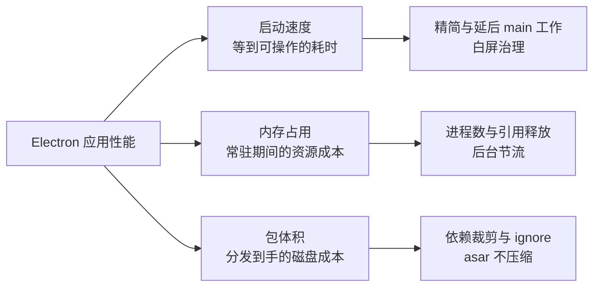

import { Meta } from '@storybook/addon-docs/blocks';

<Meta id="performance" title="进阶主题/性能" name="Docs" />

# 性能

Electron 应用的性能由三个互相独立的维度决定：**启动速度**（用户等到能操作的时间）、**内存占用**（常驻期间的资源成本）、**包体积**（分发到用户手里的磁盘成本）。三者瓶颈不同、手段不同、测量方式也不同——启动慢查 main 进程关键路径，内存高数进程与引用，包太大查依赖；混在一起谈只会得到"少用 Electron"这类无用结论。三个维度共享同一条下限：「认识 Electron」一课讲过的固定代价——Chromium 与 Node.js 带来的体积和基础内存，这部分无法靠配置消除。性能优化的实质是**不在这条下限之上再叠加浪费**。官方性能教程把入口原则写成一句话："Measure, Measure, Measure"——先测出基线，再动手优化，否则连"改好了没有"都无法回答。

读完你应能预测：给 main 进程加一组启动计时后，控制台会依次打出 ready、ready-to-show 两个耗时；开第二个窗口后 `app.getAppMetrics()` 的列表多出一条 `Tab` 条目，销毁窗口并清掉引用后它消失；`du -sh` 量出的包体积里 Electron 本体占大头，而你能压缩的只有自己的依赖部分。



| 维度 | 瓶颈来源 | 首要手段 | 测量入口 |
| --- | --- | --- | --- |
| 启动速度 | 固定初始化 + main 关键路径上的工作量 | 精简与延后初始化、白屏治理 | 启动计时埋点、DevTools Performance |
| 内存占用 | 进程数量与常驻引用 | 及时销毁、释放引用、后台节流 | `app.getAppMetrics()`、系统监视器 |
| 包体积 | Electron 本体 + dependencies + asar 内容 | 依赖裁剪、`ignore` 排除 | `du -sh`、`@electron/asar list` |

## 快速上手

三个维度各拿一个基线读数。沿用「[接入 TypeScript](?path=/docs/typescript-setup--docs)」一课的 vite-typescript 项目，完整埋点示例在本课示例文件 `startup-timing.ts` 中。

**1. 启动计时**——在 main 进程关键节点记录耗时（`performance` 是 Node.js 全局对象）：

```ts
import { app, BrowserWindow } from 'electron';

const t0 = performance.now();
void app.whenReady().then(() => {
  console.log('ready', Math.round(performance.now() - t0), 'ms');
  const win = new BrowserWindow({ show: false });
  win.once('ready-to-show', () => {
    console.log('ready-to-show', Math.round(performance.now() - t0), 'ms');
    win.show();
  });
  void win.loadFile('index.html'); // 路径以所用模板为准
});
```

可观察证据：终端依次打出 `ready <毫秒> ms` 与 `ready-to-show <毫秒> ms`；两个读数的差值就是"渲染端加载并画出首帧"的耗时。

**2. 进程与内存清单**——打印应用的进程家族构成：

```ts
setInterval(() => {
  for (const m of app.getAppMetrics()) {
    console.log(m.type.padEnd(8), `pid=${m.pid}`, `内存≈${m.memory.workingSetSize} KB`);
  }
}, 5000);
```

可观察证据：每 5 秒打印一组进程清单，至少含 `Browser`（主进程）、`Tab`（渲染进程在 metrics 里的名字）、`GPU` 三类；再开一个窗口，`Tab` 行多一条，关掉后消失。

**3. 体积盘点**——量化打包产物里 Electron 本体与你的代码各占多少：

```bash
npm run package
du -sh out/my-app-darwin-arm64/*.app     # 产物总体积（Electron 本体占大头）
npx @electron/asar list out/my-app-darwin-arm64/*.app/Contents/Resources/app.asar | wc -l
```

可观察证据：总体积通常在 200 MB 量级（macOS，单架构）；asar 清单条目数反映你带进包的文件量——优化空间就在这一半，不在 Electron 本体那一半。

## 启动速度

启动是一条固定顺序的时间线：**Electron 本体初始化（固定代价）→ 执行你的 main 代码 → app ready → 创建窗口 → 渲染端加载 → ready-to-show → show（可交互）**。第一段无法优化；可优化的只有中间"你的代码让它做了什么"。官方 checklist 与本课的对应关系：不加甄别地引入模块、过早加载运行代码、阻塞主进程、无谓 polyfill、不打包代码、保留默认菜单，落在精简与延后两节；无谓或阻塞的网络请求压的是渲染端首帧，落在白屏治理一节；"阻塞渲染进程"属于运行时流畅度（卡顿掉帧），超出本课三个维度的边界，用 DevTools Performance 面板排查（连接方式见「[调试](?path=/docs/debugging--docs)」）。

### 精简 main 进程

main 进程在窗口出现之前执行的所有代码都在关键路径上：顶部的 `require`、同步的文件读写、重型初始化，每一项都直接推迟 `ready`。四类手段：

- **按需加载模块（lazy-load）。** 官方原则是 "just in time"——资源在使用时才分配，而不是应用启动时全部分配。大模块不在文件顶部 `require`，挪到真正调用它的函数里：

  ```ts
  // 顶部 require：启动就付钱，哪怕这次运行用不到
  import { heavyParser } from 'foo-parser';

  // 用时 require：第一次调用才付，之后走模块缓存
  function getParsedFiles() {
    const { heavyParser } = require('foo-parser');
    return heavyParser(files);
  }
  ```

- **先审计再引入依赖。** 官方给出单模块成本测法：`node --cpu-prof --heap-prof -e "require('request')"` 生成 .cpuprofile / .heapprofile，直接量出"引这个包要花多少启动时间与内存"。官方实测例子：`request` 加载耗时近半秒，而 `node-fetch` 不到 50 ms——为 Linux 服务器写的知名模块未必适合 Electron。
- **不需要默认菜单时在 ready 前调用 `Menu.setApplicationMenu(null)`。** 官方 checklist 明确列出这一条对启动有收益（菜单 API 本身见「[菜单](?path=/docs/menus--docs)」）。
- **代码已打包、面向现代浏览器。** Vite 把依赖打进 `.vite/` 产物（7.1 / 「[打包](?path=/docs/packaging--docs)」已讲），减少了运行时 `require` 开销——这是 checklist 里 "Bundle your code" 一条；同理渲染端目标是现代 Chromium，旧浏览器 polyfill 属于无谓负担，不要引入。

另一条红线贯穿启动与运行全程：**不要阻塞主进程**。同步 IPC（`ipcMain.on` 配合渲染端 `sendSync`）、`@electron/remote`、同步版 `fs` 都会让所有窗口共同的调度者停摆；长任务挪去 worker 线程或 utility process（「进程模型」已讲边界，本课不重复）。

### 延后初始化

精简是"不做不该做的"，延后是"不现在做"。更新检查、统计上报、日志初始化、次要窗口——这些都不影响首帧，放在关键路径上纯属浪费。安排在首个窗口显示之后再启动：

```ts
mainWindow.once('ready-to-show', () => {
  mainWindow.show();
  // 用户已经看到界面，现在才轮到这些非关键任务
  setImmediate(() => {
    checkForUpdates(); // 自动更新检查（见「自动更新」）
    initTelemetry();   // 统计上报
  });
});
```

### 白屏治理：show 与 ready-to-show

「[创建窗口](?path=/docs/windows--docs)」一课已讲这对组合的写法与排查，这里补上性能视角的一句判断：**`show: false` + `ready-to-show` 不减少加载时间，只推迟可见时刻**——用户从"看到白屏"变成"看到完整首帧"，改善的是感知速度而非真实速度。压真实速度要靠前面两节的精简与延后，外加给首屏减负：首屏渲染前发起的阻塞网络请求与同步脚本都压在加载路径上，能延后的延后、能并行的并行。压感知的兜底手段是给 `backgroundColor` 设一个接近页面的底色。边界：`ready-to-show` 只保证首帧已绘制，超重页面可以用 `did-finish-load` 或渲染端主动通知作为更严格的显示门槛。

预创建是这对组合的进阶用法：应用启动早期就 `new BrowserWindow({ show: false })` 把窗口备好，用户触发时直接 `show()`，几乎零延迟。代价是隐藏窗口连同整个渲染进程常驻内存——这是把启动时间换内存的决策，下一维度给出量法。

### 后台加载与节流陷阱

预创建或 `show: false` 预加载的窗口有一个反直觉的坑：**隐藏页面的定时器与动画默认被 Chromium 节流**（`backgroundThrottling` 默认 `true`，同时影响 Page Visibility API）。如果你的预加载靠 `setTimeout` / `setInterval` 推进初始化，它会被节流拖慢，"提前准备了"变成"准备得更慢"。需要全速预加载时，在创建选项里设 `backgroundThrottling: false`，或运行时对单个 `webContents` 调 `setBackgroundThrottling(false)`。这个开关的完整行为、默认值与代价在「内存占用」的后台节流一节展开。

### 测量与 profiling

- **埋点法**（快速上手的第 1 步）回答"哪个阶段慢"：`ready` 与 `ready-to-show` 读数的差值大 → 渲染端加载慢（查首屏代码量与网络请求）；`ready` 本身就大 → main 关键路径慢（查模块加载与同步工作）。
- **模块成本**：`node --cpu-prof --heap-prof -e "require('pkg')"` 单独量一个包的加载开销，启动回归时用它定位新引入的依赖。
- **profiling 简述**：渲染端用 DevTools Performance 面板录火焰图（7.2 已讲连接方式）；多进程协同的问题用 Chrome Tracing 工具看全局时间线；两者的分析都以埋点读数为锚点——先有数字，再看图。

## 内存占用

多进程模型（1.4 已讲职责边界）决定了内存的构成与下限：**主进程一份 + 每个窗口一个渲染进程 + GPU 进程 + 按需的 utility 进程**，每一份都带着 Chromium 的基础内存。「认识 Electron」讲过这份固定代价为什么大；本课的优化思路只有三条：**少开不用的进程（窗口）、不留不再使用的引用、控制后台窗口的活跃度**。

### 内存构成与观测

`app.getAppMetrics()` 返回 `ProcessMetric[]`，是主进程视角的进程家族清单，回查要点：

| 字段 | 含义 | 要点 |
| --- | --- | --- |
| `type` | 进程类型 | `Browser` 主进程；**渲染进程叫 `Tab`**；`GPU`、`Utility`、`Zygote` 等按需出现 |
| `pid` | 进程 id | 操作系统可能复用 pid，官方建议配合 `creationTime` 唯一标识 |
| `memory.workingSetSize` | 进程工作集 | 单位 KB；多进程各占一份，总和才是应用常驻内存 |
| `cpu.percentCPUUsage` | CPU 占用 | 自上次调用 `getAppMetrics()` 以来的平均值，不是瞬时值 |
| `creationTime` | 进程创建时间 | 距 epoch 的毫秒数 |

可观察证据：快速上手第 2 步的清单里，开第二个窗口 `Tab` 行 +1、销毁后 -1——这同时证明了两件事：内存下限随窗口数线性上涨；窗口销毁确实释放了进程。系统侧的对照物是 macOS 活动监视器（Windows 任务管理器）里的同名进程组。

### 窗口销毁与引用释放

**关窗行为是内存决策。** macOS 上「应用生命周期」一课讲过 `window-all-closed` 不退出的惯例，托盘常驻应用更是刻意让"关窗"只隐藏——`hide()` 复用的窗口保留整个渲染进程与页面状态，恢复快但常驻内存；`destroy()`（或 `close` 后随 `closed` 销毁）释放进程，再次打开要重建。按窗口的重要性分别选边，别全局一刀切。

选定释放后，剩下的工作是**别把对象留在内存里**。典型残留点：

```ts
const windows = new Map<string, BrowserWindow>(); // 多窗口注册表（「多窗口」一课的模式）

function createSettingsWindow() {
  if (windows.has('settings')) return windows.get('settings')!.focus();
  const win = new BrowserWindow({ show: false /* ... */ });
  win.once('closed', () => windows.delete('settings')); // 不删的话，Map 持有已销毁实例
  windows.set('settings', win);
}
```

同类残留还有：挂在已销毁窗口 `webContents` 上的监听器、不再使用的 `ipcMain.handle`、渲染端卸载时未释放的视频流（WebRTC `MediaStream`）与 Blob URL——它们让垃圾回收器无物可收。两个判断依据：`getAppMetrics()` 里 `Tab` 条目消失说明进程已释放；进程释放了但系统内存没降是正常现象，GC 与 OS 归还有滞后，看趋势别看瞬时值。

### 后台节流 setBackgroundThrottling

后台节流是 Chromium 给你的默认省资源机制：`backgroundThrottling` 默认 `true`，页面不可见时动画与定时器被降频，Page Visibility API 同步报 `hidden`。它是"内存/资源"与"后台响应"之间的开关：

- **保持默认（`true`）**：后台窗口安静，CPU 与电量友好。绝大多数窗口的正确选择。
- **关闭（`setBackgroundThrottling(false)` 或构造选项 `backgroundThrottling: false`）**：页面表现得像一直在前台——隐藏也全速跑定时器与动画，整窗持续绘制换帧。只给确实需要后台活跃的页面开：音乐播放进度、下载动画、桌面歌词。

三个边界：Electron 28 起对一个 `webContents` 关闭节流会影响宿主窗口内的**所有** webContents（「webContents」一课已讲，设开关前想清楚范围）；关闭后 Page Visibility API 报 `visible`，页面里依赖 `visibilitychange` 的暂停逻辑会失效；「后台加载与节流陷阱」一节的全速预加载正是这个开关在启动场景的应用。

## 包体积

安装包的体积构成一句话算完：**Electron 本体（固定代价，约 200 MB 量级的解压体积）+ 你的代码与 dependencies（收在 app.asar）+ 平台运行时文件**。「认识 Electron」讲过本体为什么大、「打包」一课讲过裁剪与 asar 机制——本课补上性能视角的判据、一个历史结构的现状核实，以及压缩的极限在哪。

### 依赖的体积判据

8.1 的结论直接复用：`prune` 默认 `true`，只有 `dependencies` 进包；判据是"运行时会不会被 require"，不是"开发时要不要装"。体积视角再补两条杠杆：

- **bundle 优先于拷贝。** 被 Vite 打进 `.vite/` 产物的依赖不占 node_modules 的空间，也不进 asar 的 node_modules 目录——能收编的依赖就不必留在 `dependencies` 里再拷一份。
- **`ignore` 排除构建期文件。** `src/`、`vite.*.config.mts`、`forge.config.mts` 这些文件默认也会进 asar，对运行无用；排除方式见「打包」一课的最佳实践。

### 双 package.json 模式

历史结构：项目根放一份 devDependencies 为主的 package.json，应用代码放进 `app/` 子目录并配一份只有生产依赖的 package.json，让打包器只看后者——electron-react-boilerplate 是这个模式的著名载体。**现状：它是遗留结构。** `@electron/packager` 的文档已经完全不提这种结构——prune 默认沿依赖树剔除 devDependencies，判据自然成立；electron-builder 文档对它的定位是"支持但不强制"；Forge 的文档没有这个概念。当前答案就是单 package.json + prune + bundler，多出来的那份 package.json 只增加路径与心智负担。

### ASAR 与压缩极限

对体积而言，asar 常被误解：它把目录拼成单个归档（8.1 已讲机制），收益是文件数收敛与 require 提速，**不是压缩**——归档里的文件原样拼接，装进 asar 不会变小。体积的真正杠杆按效果排序：

1. **少带依赖**——依赖判据 + bundle 收编，这是唯一的大头；
2. **`ignore` 排除无用文件**——构建期文件、文档、测试；
3. **产物架构**——universal 包（arm64 + x64 双二进制）体积约翻倍，按需产出单架构包（见「多平台构建」）。

最后一道压缩发生在分发格式层：zip、dmg 等安装包由 maker 在外层压缩 asar 与运行时文件——这是你拿到的最终数字，与 `du -sh` 量到的解压体积不是一回事。

## 最佳实践

- **每个维度先测基线再优化。** 启动用埋点读数、内存用 `getAppMetrics()` 清单、体积用 `du -sh` 对照——"Measure, Measure, Measure" 不是口号：没有基线，优化与回归都无从证明。
- **启动关键路径只留首帧必需。** 逐项问"窗口出现前它必须发生吗"：不是的，要么精简掉（lazy-load、删依赖、`setApplicationMenu(null)`），要么延后到首个 `ready-to-show` 之后。
- **关窗行为按窗口角色定，不当全局开关。** 高频复用的窗口（主窗口、搜索面板）可以 `hide()` 常驻换恢复速度；低频或重资源窗口走销毁释放，注册表与监听同步清理。
- **节流保持默认，只为后台活跃页面破例。** 关闭 `backgroundThrottling` 的每个理由（预加载、后台动画）都该配上"不开会怎样"的反证，否则它就是常驻的 CPU 税。
- **体积上限在"带了什么"，不在压缩。** bundle 收编、依赖判据、`ignore` 决定了 asar 内容；asar 本身不压缩，不要指望归档格式省体积。
- **不对抗固定代价。** Electron 本体的体积与基础内存是选型成本，优化的目标是别再叠加，而不是消除下限。

## 常见问题

- 隐藏窗口里的 `setInterval` 变慢、动画停了，显示后恢复
  后台节流在起作用：页面不可见时定时器与动画被降频（`backgroundThrottling` 默认 `true`）。确认需要后台全速后用 `setBackgroundThrottling(false)` 关闭；注意 Electron 28 起该设置作用于宿主窗口内所有 webContents，且关闭后 Page Visibility API 报 `visible`，页面里依赖 `visibilitychange` 的暂停逻辑会跟着失效。
- 窗口关了，内存占用却没有下降
  先分辨三种"关"：`hide()` 只是隐藏，整个渲染进程还在——这是复用不是泄漏；`close`/`destroy` 后进程该消失，若 `getAppMetrics()` 里 `Tab` 条目还在，查是否注册表（Map）持有了实例、或 `closed` 回调没清引用；进程已消失但系统水位没降是 GC 与 OS 归还的滞后，看趋势。
- 主进程一忙，所有窗口一起卡
  主进程是所有窗口共同的调度者，被阻塞时界面、IPC 全部排队。典型元凶：同步 IPC（`sendSync`）、`@electron/remote`、主进程里的同步大文件读写。处理：IO 换异步版，重活挪 worker 线程或 utility process（1.4 已讲边界）；用 `getAppMetrics()` 里 `Browser` 条目的 `cpu.percentCPUUsage` 确认嫌疑。
- 打包体积远超预期
  按杠杆顺序排查：`npx @electron/asar list` 看是不是带了大依赖（该 bundle 收编的收编、该挪 devDependencies 的挪）；看 `ignore` 有没有排除构建期与文档文件；看产物是不是 universal 双架构。注意 asar 不压缩、安装包的外层压缩由 maker 完成，别拿归档体积直接下结论。
- 某次升级后启动明显变慢，不知道改了什么
  回到埋点：对比 `ready` 与 `ready-to-show` 两组读数定位阶段——`ready` 变慢多半是新依赖在文件顶部被 `require`，用 `node --cpu-prof --heap-prof -e "require('新包')"` 单独验明正身；`ready-to-show` 变慢则查渲染端首屏新增的同步脚本与网络请求。

## 总结回顾

摘要：

Electron 的性能拆成三个独立维度谈。启动速度的瓶颈在 main 进程关键路径：本体初始化是固定代价，可做的是精简（lazy-load、依赖审计、`setApplicationMenu(null)`、bundle 与去 polyfill）与延后（更新检查、上报、次要窗口放到首个 `ready-to-show` 之后），配 `show: false` + `ready-to-show` 治白屏、留心隐藏窗口的节流陷阱；测量靠埋点读数、`node --cpu-prof --heap-prof` 与 DevTools。内存占用的下限由多进程模型决定：主进程 + 每窗一个渲染进程（metrics 里叫 `Tab`）+ GPU + utility，`app.getAppMetrics()` 是主进程视角的清单；优化靠按窗口角色选 hide 复用或销毁释放、清掉注册表与监听等残留引用，以及把 `backgroundThrottling`（默认 `true`，Electron 28 起按宿主窗口整体生效）当作内存与后台响应之间的显式取舍。包体积等于固定本体加你自己带进去的东西：依赖判据与 bundle 收编是大头，`ignore` 收尾，双 package.json 是遗留结构——prune 已让它失去必要；asar 不压缩，最后一道压缩在 maker 产分发格式时发生。

一句话：

> 性能优化不消除 Electron 的固定代价，只消除叠加浪费：启动只做首帧必需的事，内存不留不再使用的进程与引用，包里不带运行时用不到的依赖。

知识要点：

- 三个性能维度各自的瓶颈、首要手段与测量入口是什么？
- 启动时间线的固定段在哪？哪些 main 进程行为在为它加时？
- lazy-load 与延后初始化分别解决什么？哪些任务适合延到首个 `ready-to-show` 之后？
- `show: false` + `ready-to-show` 改善的是真实速度还是感知速度？预创建窗口的代价是什么？
- 隐藏窗口的定时器为什么变慢？`backgroundThrottling` 的默认值、Electron 28 的范围变化与关闭代价？
- `app.getAppMetrics()` 返回什么？渲染进程在其中的类型名是什么？
- 关窗的三种语义（hide / close / destroy）与内存的关系？常见的引用残留点有哪些？
- 包体积的构成是什么？为什么 asar 不是压缩？双 package.json 为什么成了遗留结构？

## 参考资料

- [Electron 教程：Performance](https://www.electronjs.org/docs/latest/tutorial/performance)（"Measure, Measure, Measure" 原则、checklist 八条：模块审计与 `node --cpu-prof --heap-prof`、"just in time" 加载示例、阻塞主进程、bundle、`Menu.setApplicationMenu(null)` 的启动收益、Chrome Tracing）
- [Electron API：BrowserWindow](https://www.electronjs.org/docs/latest/api/browser-window)（`backgroundThrottling` 选项默认 `true`、任一 webContents 关闭节流则整窗持续绘制换帧的注记）
- [Electron API：webContents](https://www.electronjs.org/docs/latest/api/web-contents)（`setBackgroundThrottling` / `getBackgroundThrottling` 语义、Electron 28 起作用范围覆盖宿主窗口内所有 webContents）
- [Electron API：app](https://www.electronjs.org/docs/latest/api/app)（`getAppMetrics()` 返回 `ProcessMetric[]`、CPU 指标为自上次调用以来的平均值）
- [Electron API 结构：ProcessMetric](https://www.electronjs.org/docs/latest/api/structures/process-metric)（`pid` / `type`（渲染进程为 `Tab`）/ `creationTime` / `memory` 字段定义与 pid 复用注记）
- [Electron 教程：ASAR Archives](https://www.electronjs.org/docs/latest/tutorial/asar-archives)（归档收益、临时解包 API 的额外开销）
- [@electron/packager README](https://github.com/electron/packager)（`prune` 默认 `true`、文档不再提及双 package.json 结构）
- [electron-builder：Two package.json structure](https://www.electron.build/tutorials/two-package-structure)（"支持但不强制"的官方定位）
- [electron-react-boilerplate](https://github.com/electron-react-boilerplate/electron-react-boilerplate)（双 package.json 模式的著名社区载体）
