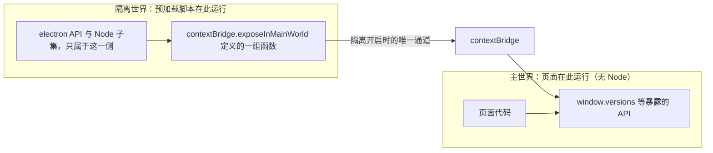

import { Canvas, Controls, Meta } from '@storybook/addon-docs/blocks';

import * as PreloadStories from './preload.stories';

<Meta of={PreloadStories} name="Docs" />

# 预加载脚本

「[进程模型](?path=/docs/process-model--docs)」一课给出了职责边界：渲染进程只管渲染页面、默认没有 Node 权限，系统能力在主进程一侧。本课聚焦这条边上的关键角色——预加载脚本（preload script）：一段运行在渲染进程里、在页面内容开始加载之前执行的代码，是全应用唯一同时认识 `electron`/Node 和页面 `window` 的地方。它解决一个矛盾：页面需要系统能力，但把 Node 直接交给页面，等于把整台机器交给任意网页代码——所以能力必须经它包装成一小份受控的 API 再交出去。

默认配置下两个开关决定它的工作方式：**上下文隔离**（contextIsolation，Electron 12 起默认开启）把预加载脚本与页面分进两个世界；**沙箱**（sandbox，Electron 20 起默认开启）把它能碰到的 Node 限制成一份白名单子集。`contextBridge` 则是两个世界之间唯一被承认的通道。读完你应该能预测：在预加载脚本里用 `contextBridge` 暴露的 API 页面拿得到，直接挂到 `window` 上的拿不到。



| 回查项 | 值 | 备注 |
| --- | --- | --- |
| 执行时机 | 页面内容开始加载之前 | 每次页面加载、刷新都重新执行 |
| 接线位置 | `webPreferences.preload` | Forge 模板已接好 `src/preload.js` |
| 暴露 API | `contextBridge.exposeInMainWorld(apiKey, api)` | 页面经 `window[apiKey]` 调用 |
| 上下文隔离 | 默认开启（Electron 12 起） | 直接挂 `window` 的值页面拿不到 |
| 渲染进程沙箱 | 默认开启（Electron 20 起） | 预加载脚本只有 Node 子集 |
| 可用的 electron 模块 | `contextBridge`、`ipcRenderer`、`webFrame`、`nativeImage`、`webUtils`、`crashReporter` | 沙箱下 `require('electron')` 的全部 |
| 可用的 Node 模块 | `events`、`timers`、`url` | 其余 `require` 直接失败 |
| 过桥值规则 | 函数被代理；其余值拷贝并冻结 | Symbol 丢弃、原型不随行 |
| 自检属性 | `process.contextIsolated` / `process.sandboxed` | 在预加载脚本里读到 `true` |

## 快速上手

沿用「安装」一课创建的项目（`src/index.js` 已接好预加载脚本），把模板空壳填成一个真实的暴露面，全程约 5 分钟。

1. 把 `src/preload.js` 的内容替换为：

   ```js
   const { contextBridge } = require('electron');

   // 直接挂 window 的值只存在于预加载脚本自己的世界，页面拿不到
   window.debugToken = { from: 'preload' };

   contextBridge.exposeInMainWorld('versions', {
     node: () => process.versions.node,
     chrome: () => process.versions.chrome,
     electron: () => process.versions.electron,
   });
   ```

2. 在 `src/index.html` 的 `</body>` 之前加一段页面脚本：


   ```html
   <script>
     // 页面主世界：能拿到 versions，拿不到 debugToken 与 process
     const info = document.createElement('p');
     info.textContent = `Electron ${window.versions.electron()} · Node ${window.versions.node()}`;
     document.body.append(info);
     console.log('页面主世界的 typeof process：', typeof process);
   </script>
   ```

3. 运行 `npm start`；应用已在运行时，在窗口内按 `Cmd+R`（Windows/Linux 为 `Ctrl+R`）刷新即可——预加载脚本随页面加载重新执行。然后核对三个观察点：

   - 窗口正文出现版本行：`versions` 经桥进入主世界，页面调用成功；
   - DevTools 控制台打印 `页面主世界的 typeof process： undefined`：Node 留在隔离世界；
   - 控制台输入 `typeof window.debugToken` 得到 `'undefined'`：直接赋值没有过桥。

预加载脚本自己的 `console.log` 也打在同一块 DevTools 控制台里——两个世界共用一个控制台，靠打印内容区分来源。

## 执行时机与接线

预加载脚本是「在渲染进程中、页面内容开始加载之前执行」的代码，这是官方教程给出的定义。它比页面任何脚本都早，所以页面脚本一开始运行，暴露面就已经在 `window` 上，不需要等待任何事件。

### 执行时机

每次页面加载都会重新执行：首次加载、窗口内刷新、代码里 `loadFile` / `loadURL` 导航，都让预加载脚本从头跑一遍。落到日常开发，这条规则与「[第一次运行](?path=/docs/first-run--docs)」一课的生效规则严丝合缝：

- **改 `src/preload.js` 的内容**：属于页面一侧，刷新窗口（`Cmd+R`）即可生效，快速上手第 3 步就是证据；
- **改接线本身**（给新窗口配置 `preload`、改路径）：属于主进程代码，要 `rs` 重启。

每个 `BrowserWindow` 各自接线、各自执行，多窗口时暴露面按窗口配置，多窗口管理见「[多窗口](?path=/docs/multi-window--docs)」一课。

### 接线：webPreferences.preload

接线发生在主进程创建窗口时，Forge 模板的 `src/index.js` 已经写好，无需改动：

```js
const mainWindow = new BrowserWindow({
  width: 800,
  height: 600,
  webPreferences: {
    // 用 path.join(__dirname, ...) 拼出绝对路径，模板写法照抄即可
    preload: path.join(__dirname, 'preload.js'),
  },
});
```

`webPreferences.preload` 指向脚本文件，模板用 `__dirname` 拼接是固定写法——相对路径的解析基准随加载方式变化，照模板用绝对路径可以少一类诡异问题。

## 运行环境

预加载脚本运行在渲染进程，但沙箱默认开启（Electron 20 起）把它关进一个受限环境：它拿到的 Node 是一份白名单 polyfill，不是完整 Node。在沙箱开启的默认配置下，它能用到的东西就是下表：

| 能力 | 可用项 | 说明 |
| --- | --- | --- |
| `require('electron')` | `contextBridge`、`ipcRenderer`、`webFrame`、`nativeImage`、`webUtils`、`crashReporter` | 渲染端 API 子集，本课的主角都在这里 |
| Node 模块 | `events`、`timers`、`url`（含 `node:` 前缀写法） | 其余模块的 `require` 直接失败 |
| Node 全局 | `Buffer`、`process`、`setImmediate` 等 | 快速上手里的 `process.versions` 就来自这里 |
| 完整 Node（`fs`、`path` 等） | 不可用 | 关沙箱才能拿到，取舍属于「[安全清单](?path=/docs/security--docs)」一课 |

两个自检属性可以在预加载脚本里直接确认环境，刷新窗口后到 DevTools 控制台核对输出：

```js
// 在 src/preload.js 里临时加一行
console.log('sandboxed:', process.sandboxed, 'contextIsolated:', process.contextIsolated);
// → sandboxed: true contextIsolated: true
```

一个工程边界紧贴着这张表：沙箱的 `require` 加载不了项目里的其他文件，预加载脚本想拆模块、想用 TypeScript，都得先上打包器（工程化阶段处理）；入门阶段一个 `src/preload.js` 单文件足够。`events` / `timers` / `url` 加上 electron 渲染端模块，已经覆盖暴露面所需的全部接线逻辑。

## 上下文隔离与 contextBridge

上下文隔离开启时（默认），预加载脚本运行在一个独立的**隔离世界**（isolated world）里：它看到的 `window` 和页面脚本看到的 `window` 是两个对象，页面碰不到隔离世界里的任何东西。隔离的动机在官方教程里说得很直白：防止页面代码触到预加载脚本的特权能力。`contextBridge` 是两个世界之间唯一被承认的通道——它把指定的 API 安全地送到页面主世界。

### 直接赋值为什么到不了页面

同一个 `window` 名字，两种写法，页面侧结果完全不同：

```js
// 直接挂 window：写法成立，但值留在隔离世界
window.myAPI = { desktop: true };
// 页面控制台：window.myAPI → undefined

// contextBridge：值过桥进入主世界
const { contextBridge } = require('electron');
contextBridge.exposeInMainWorld('myAPI', { desktop: true });
// 页面控制台：window.myAPI → { desktop: true }
```

下面的模拟把两个世界画在两侧：左侧是预加载脚本写入的东西，右侧是页面主世界实际能看到的读数。切换暴露方式与隔离开关，四种组合各有结论。

<Canvas of={PreloadStories.Interactive} />
<Controls of={PreloadStories.Interactive} />

| 操作 | 可观察证据 |
| --- | --- |
| 保持默认（contextBridge + 隔离开启） | `typeof window.versions` 读数为 `'object'` |
| 暴露方式切到「直接挂 window」 | `window.versions` 变 `'undefined'`，`window.debugToken` 同样不可见 |
| 关闭上下文隔离 | 两个值都可见，同时出现「已连通」警示 |
| 任意组合 | `typeof process` 恒为 `'undefined'`：页面永远没有 Node |

组合结论收进一张回查表：

| 暴露方式 | 隔离开启（默认） | 隔离关闭 |
| --- | --- | --- |
| `contextBridge.exposeInMainWorld` | 页面可见 | 页面可见（但隔离已失去意义） |
| 直接挂 `window` | 页面不可见 | 页面可见（对象可被页面改写） |

### exposeInMainWorld 的用法

```js
contextBridge.exposeInMainWorld(apiKey, api);
```

- `apiKey`：字符串，API 以 `window[apiKey]` 的形式挂进主世界——`'versions'` 就是 `window.versions`；
- `api`：要暴露的值，标准形态是**一组函数**（可附常量数据）。函数是唯一被「代理」而非拷贝的类型：页面拿到可调用的引用，执行发生在隔离世界一侧。

这里的 "main world" 指**页面的主世界**，与主进程无关——命名是历史遗留，最容易望文生义的地方。`exposeInMainWorld` 本身运行在渲染进程的预加载脚本里，把东西送进页面主世界；与主进程通信是另一条线（见下方边界句）。

返回 `Promise` 的函数是异步能力的标准形态，因为真正干活的位置多半在主进程。暴露面函数体内能用的，就是上一节的隔离世界全套：`ipcRenderer`、Node 子集。也就是说，**暴露面函数是页面能点名的入口，实现细节可以完全藏在隔离世界与主进程里**。`ipcRenderer` 的通道语义与请求响应模式在「[双向调用](?path=/docs/ipc-invoke--docs)」一课展开，本课只需要知道函数内部可以调用它。

## 暴露面设计

暴露面是页面能点名的全部入口，设计问题只有两个：值怎么过桥、面开多大。

### 桥对值的三条规则

| 规则 | 行为 | 实践含义 |
| --- | --- | --- |
| 函数被代理 | 页面拿到可调用引用，执行留在隔离世界 | 用函数表达行为，页面调用不越界 |
| 其余值拷贝并冻结 | 过桥即复制，两侧改动互不影响 | 每次返回新数据，别指望共享可变状态 |
| 原型不随行 | 自定义类实例过桥变普通对象；`Symbol` 直接丢弃 | 边界上只流动普通对象与函数 |

三条规则都出自 `contextBridge` API 文档的类型支持表；`Error` 也按拷贝处理，自定义属性会丢失。落到判断上：暴露面边界上只流动「普通数据 + 函数」，其他类型的行为都不可依赖。

### 最小暴露面：包装而非透传

反面写法是把通信能力整包交出：

```js
// 反面：不过滤地交出 powerful API，任何页面代码都能发任意消息
contextBridge.exposeInMainWorld('ipc', ipcRenderer);
contextBridge.exposeInMainWorld('myAPI', { send: ipcRenderer.send });
```

Electron 29 起这不再只是风格问题：`ipcRenderer` 本体过桥，页面侧拿到的是**空对象**——硬限制。官方给出的理由是安全：不加过滤地交出通信能力，等于允许任意代码发任意消息。

正面写法是一个能力一个具名函数：

```js
// 正面：白名单式包装，页面只知道这几个函数，不知道背后是什么
contextBridge.exposeInMainWorld('prefs', {
  load: () => ipcRenderer.invoke('load-preferences'),
});
```

判断句：**暴露面是白名单，不是转发器。**页面需要「读偏好设置」这个能力，而不是「发消息」这个权力；能力的粒度由预加载脚本定义，这正是它存在的意义。

## 最佳实践

- **接口在预加载脚本，能力在主进程。** 沙箱虽然给了少量 Node 能力，文件读写、耗时任务仍放主进程，预加载脚本只定义接口形状、返回普通数据。判断依据：暴露面的每个函数都成为页面的永久公共入口，能力越靠近主进程，页面能间接触发的面越小。
- **apiKey 少而按能力域分组。** 一个应用通常只要两三个 key（如 `versions`、`prefs`、`desktop`）；页面侧用 `window.versions?.electron?.()` 这类存在性判断兜底，预加载脚本失败或未接线时页面不至于直接抛错。
- **单文件起步，拆分先上打包器。** 沙箱的 `require` 加载不了本地文件，预加载脚本要拆模块或换 TypeScript 时再引入打包链（工程化课程展开）；在那之前 `src/preload.js` 一个文件完全够用。

## 常见问题

- 页面控制台里 `window.xxx` 是 `undefined`，明明在预加载脚本里赋值了
  改用 `contextBridge.exposeInMainWorld` 暴露。依据：上下文隔离默认开启，预加载脚本的 `window` 与页面的 `window` 是两个对象，直接赋值只存在于隔离世界（对照证据见「直接赋值为什么到不了页面」）。
- 预加载脚本里 `require('fs')` 或 `require('./helper')` 直接报错
  沙箱默认开启，`require` 只认 `events`、`timers`、`url` 与 `electron` 渲染端模块。把系统能力移到主进程、经暴露的函数调用；确需完整 Node 的开关取舍见「[安全清单](?path=/docs/security--docs)」一课，拆文件需要打包器。
- 暴露出去的 `ipcRenderer` 在页面里是空对象
  Electron 29 起 `ipcRenderer` 本体不能过 `contextBridge`。改为最小包装：一个能力一个具名函数（见「最小暴露面」）。
- 页面拿到的对象调不了方法，或修改它的属性不生效
  桥的拷贝规则所致：函数以外的值过桥即拷贝并冻结、原型不随行。把行为放进暴露面的函数里，数据按普通对象传递（规则表见「桥对值的三条规则」）。

## 总结回顾

摘要：

预加载脚本是渲染进程里、页面内容开始加载之前执行的一段特权代码，每次页面加载都重新执行，由主进程创建窗口时的 `webPreferences.preload` 接线。沙箱（默认开启）让它只拿到 `electron` 渲染端 API 子集与少量 Node polyfill；上下文隔离（默认开启）把它和页面分进两个世界——直接挂 `window` 的值到不了页面，`contextBridge.exposeInMainWorld(apiKey, api)` 是唯一被承认的通道。桥对值有明确规则：函数被代理、其余值拷贝并冻结、原型不随行；`ipcRenderer` 自 Electron 29 起不能过桥，只能按能力包装成具名函数。因此暴露面按白名单设计：一个能力一个函数、数据用普通对象、能力本身留在主进程。

一句话：

> 预加载脚本是隔离世界与页面之间唯一的设计位置：`contextBridge` 定义暴露面，暴露面之外的能力页面一概不可见。

知识要点：

- 预加载脚本何时执行？改了它之后如何让它生效？
- 沙箱开启时预加载脚本里能用哪些模块？怎么在代码里自检沙箱与隔离状态？
- 为什么预加载脚本里直接挂 `window` 的值页面拿不到？哪种写法能过桥？
- `exposeInMainWorld(apiKey, api)` 两个参数各是什么？页面从哪里调用？
- 桥对函数、普通值、原型分别怎么处理？
- 为什么不能把 `ipcRenderer` 整包暴露？正确的包装形态是什么？

## 参考资料

- [Electron 教程：进程模型](https://www.electronjs.org/docs/latest/tutorial/process-model)（预加载脚本的官方定义、执行时机，以及直接赋值失效与 contextBridge 的对照示例）
- [Electron 教程：上下文隔离](https://www.electronjs.org/docs/latest/tutorial/context-isolation)（隔离的定义、Electron 12 起默认开启、推荐的 contextBridge 暴露写法）
- [Electron API：contextBridge](https://www.electronjs.org/docs/latest/api/context-bridge)（`exposeInMainWorld` 签名与主世界术语、过桥值类型表、Electron 29 起 `ipcRenderer` 过桥限制）
- [Electron 教程：进程沙箱](https://www.electronjs.org/docs/latest/tutorial/sandbox)（沙箱默认开启，预加载脚本的 Node polyfill 与 electron 模块清单）
- [Electron API：process](https://www.electronjs.org/docs/latest/api/process)（`process.contextIsolated` 与 `process.sandboxed` 自检属性的定义）
