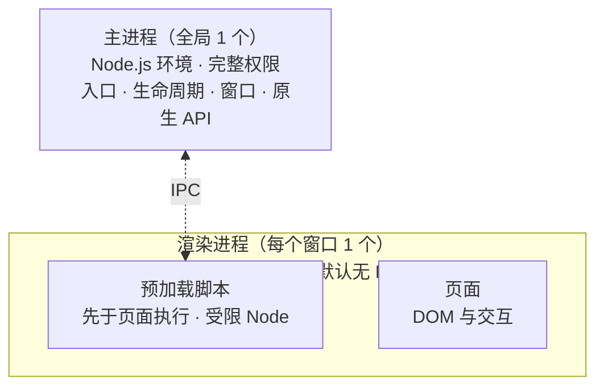

import { Canvas, Controls, Meta } from '@storybook/addon-docs/blocks';
import * as ProcessModel from './process-model.stories';

<Meta of={ProcessModel} name="Docs" />

# 进程模型

这一课把[认识 Electron](?path=/docs/what-is-electron--docs)里的运行结构预览升级为完整模型：Electron 应用运行起来不是一个进程，而是一个进程家族——恰好 1 个主进程、每个窗口 1 个渲染进程、每窗口 1 份预加载脚本。[第一次运行](?path=/docs/first-run--docs)按「窗口里的页面 / `src/index.js`」分过改动生效的界线，本课解释这条界线的来源：**职责边界就是权限边界**——主进程握有全部系统能力，渲染页面默认无权，预加载脚本是中间那个受控的桥。读完你应该能预测：渲染端要一个系统能力时，请求经过哪些环节、被谁执行、结果怎么回来；也能判断一段新代码该放进哪个进程。



| 成员 | 数量 | 运行环境 | 职责 | Node.js 权限 |
| --- | --- | --- | --- | --- |
| 主进程 | 全局 1 个 | Node.js | 应用入口、生命周期、窗口、原生 API | 完整 |
| 渲染进程 | 每个窗口 1 个 | Chromium | 渲染页面、处理交互 | 无（默认） |
| 预加载脚本 | 每个窗口 1 份 | 渲染进程内，先于页面执行 | 暴露受控接口、转发请求 | 受限 |
| utility process | 按需 0 个或多个 | Node.js | 主进程派生的子任务 | 完整 |

## 进程家族

Electron 直接继承 Chromium 的多进程架构：Chromium 用「每个标签页一个进程」把单个页面的崩溃与挂起隔离在进程内，Electron 把同样的模型用在自己的窗口上。但它在这之上多了一层自己的规则——**权限阶梯**：主进程（完整 Node.js）→ 预加载脚本（受限 require）→ 渲染页面（无）。为什么把渲染端压到最底层？因为窗口里跑的代码按不可信内容对待——它可能是远程网页，也可能包含不可信输入，特权因此收口在主进程。渲染进程历史上曾默认带完整 Node.js 环境，这个默认因安全原因早已禁用。

数量与生命周期绑定是家族关系的另一半：

- `BrowserWindow` 每个实例对应一个渲染进程（`BrowserView` 等网页嵌入同样各占一个）。
- 窗口销毁时，对应渲染进程随之终止——它里面的所有 JS 状态一起消失。
- 主进程退出，应用才真正结束。「第一次运行」里 macOS 关窗后 Forge 不退出，正是因为主进程还在等待再次激活。

### 主进程

**这是什么。** 全局唯一的应用入口与总调度。`package.json` 的 `main` 字段指向的文件（Forge 模板里是 `src/index.js`）就是主进程，运行在完整 Node.js 环境中：可以 `require` 任何模块、调用全部 Node API。

**用来做什么。** 三类职责对应三组模块：

- 应用生命周期：`app` 模块的 `ready`、`window-all-closed` 等事件（[应用生命周期](?path=/docs/app-lifecycle--docs)课展开）；
- 窗口管理：`BrowserWindow` 创建、控制、销毁窗口；
- 原生 API：菜单、对话框、托盘这类系统级能力。

```js
// src/index.js —— 主进程：完整 Node.js 环境，全局唯一
const { app, BrowserWindow } = require('electron');
const path = require('node:path');

app.whenReady().then(() => {
  // 每个 BrowserWindow 实例对应一个渲染进程
  const win = new BrowserWindow({ width: 800, height: 600 });
  win.loadFile(path.join(__dirname, 'index.html'));
});
```

**可观察证据。** 主进程的 `console.log` 落在运行 `npm start` 的终端——「第一次运行」已验证过这条通路。同一证据也解释了那条生效规则：`src/index.js` 的改动必须 `rs` 重启才生效，因为它不属于任何窗口的页面。

**边界。** 主进程是所有窗口共同的调度者，耗时任务会拖累整个应用（见最佳实践）。多数 Electron API 只在单一进程可用，用前先查官方文档中该 API 标注的所属进程。

### 渲染进程

**这是什么。** 每个 `BrowserWindow` 实例对应一个，运行 Chromium，职责是把页面渲染出来、处理交互。写的就是 Web 代码：HTML 入口、CSS 样式、`<script>` 逻辑；npm 包要用打包器引入——渲染端没有 `require`。

**权限。** 默认没有任何 Node.js API。这不是遗漏，而是安全模型的核心决定：页面代码可以自由使用 CPU 与内存，但读写文件、起子进程这类特权操作必须委托给主进程。

**可观察证据。** 沿用现有项目，`npm start` 起应用，在窗口 DevTools 的 Console 里输入：

```js
require('node:os')
// Uncaught ReferenceError: require is not defined
```

同一行代码放进 `src/index.js` 就能运行——两个环境的权限差异，一行就能核对。

**边界。** 渲染进程随窗口关闭而终止，它持有的状态没有跨窗口生命周期。多窗口的创建与组织见[多窗口](?path=/docs/multi-window--docs)课。

### 预加载脚本

**这是什么。** 运行在渲染进程里、**先于页面内容执行**的脚本，由 `BrowserWindow` 的 `webPreferences.preload` 指定（Forge 模板已在 `createWindow` 里接好这一行）：

```js
new BrowserWindow({
  webPreferences: {
    preload: path.join(__dirname, 'preload.js'), // 必须是绝对路径
  },
});
```

它的角色不是自己干活，而是渲染进程里唯一带受控特权的环节：把能安全暴露的能力递给页面，把页面的系统能力请求转发给主进程。

**两个关键行为。**

- **先于页面执行。** preload 跑完，页面才开始加载；它暴露的接口在页面任何代码运行前就可用。
- **受限 require。** 渲染进程默认沙盒（Electron 20 起），preload 只能加载少数模块：`electron` 的渲染端模块（`contextBridge`、`ipcRenderer`、`webFrame` 等）加 `events`、`timers`、`url` 三个 Node 内置模块。受限环境不能用 CommonJS 把 preload 拆成多个文件，需要拆分时用打包器。

**为什么不能直接挂 window。** 上下文隔离（`contextIsolation`，Electron 12 起默认开启）让 preload 与页面各有一个独立的 `window`——preload 里写 `window.myAPI = {...}`，页面读到的是 `undefined`，而且不报错。正道是 `contextBridge.exposeInMainWorld`，把白名单式接口安全递进页面世界；完整写法与接口设计规则见[预加载脚本](?path=/docs/preload--docs)课。

**可观察证据。** 在 `src/preload.js` 里加 `console.log('preload 先跑')`，在页面脚本里加 `console.log('页面后跑')`，刷新窗口：DevTools Console 里 preload 的输出在前。这也解释了「第一次运行」的另一条规则——`preload.js` 改动刷新窗口即生效，因为它随每次页面加载重新执行。

### Utility process

**这是什么。** 主进程用 `UtilityProcess` API 派生的子进程，运行完整 Node.js 环境，适合承接三类任务：不可信的服务、CPU 密集计算、易崩溃的组件——崩了只损失这个子进程，主进程与其他窗口无恙。与 Node.js 原生 `child_process.fork` 的关键差别：utility process 能用 MessagePort 与渲染进程直连通道，官方建议 Electron 内部场景优先用它。

入门阶段只需要知道「耗时重活有专门去处」；真正用到时再查官方 UtilityProcess 指南（见参考资料）。

## 进程间的数据流

**为什么有边界就有桥。** 渲染进程管界面、主进程管系统，页面又按不可信对待——三条规则叠加的结果是：渲染端自己碰不了系统能力，任何特权操作都必须「向上」委托给主进程。这条委托链就是 Electron 应用的标准数据流：

页面调用 preload 暴露的接口 → preload 用 `ipcRenderer` 发出请求 → 主进程 `ipcMain` 接住并执行系统能力 → 结果沿原路返回页面。

三端各几行就能看到全貌（通道细节在[IPC 概念](?path=/docs/ipc-basics--docs)与[双向调用](?path=/docs/ipc-invoke--docs)课展开，这里只看形状）：

```js
// src/preload.js —— 只把「读这一个文件」的能力暴露给页面
const { contextBridge, ipcRenderer } = require('electron');

contextBridge.exposeInMainWorld('electronAPI', {
  readFile: () => ipcRenderer.invoke('read-file'),
});
```

```js
// src/index.js —— 主进程接住请求，执行系统能力
const { ipcMain } = require('electron');
const fs = require('node:fs/promises');

ipcMain.handle('read-file', () => fs.readFile('/tmp/note.txt', 'utf8'));
```

```js
// 渲染端页面脚本 —— 只认识 window.electronAPI，不知道 IPC 的存在
const text = await window.electronAPI.readFile();
```

注意页面侧的形状：没有 `require`、没有 `ipcRenderer`，它能调用的只有桥暴露的方法名。特权收口，在数据流上就是这个样子。

下面的沙盘把两条路径的命运并排呈现（真实 Electron 无法在浏览器里运行，这是对消息流向的模拟；真实环境的核对见各小节的可观察证据）：

<Canvas of={ProcessModel.Flow} />

<Controls of={ProcessModel.Flow} />

| 读者操作 | 可观察证据 |
| --- | --- |
| 切换「渲染端请求」为「直接 require」 | 消息停在渲染进程边界，日志出现 ReferenceError，IPC 通道未被触达 |
| 切换为「经 preload 桥请求主进程」 | 消息依次流经页面 → 预加载脚本 → IPC 通道 → 主进程，结果沿原路返回页面 |
| 打开 Show code | 看到该 Canvas 实际执行的 `process-flow.ts` |

**边界。** 链路走异步（`invoke` 返回 Promise），不要用同步的 `ipcRenderer.sendSync`——它会冻结渲染进程，直到主进程应答。通道命名、错误处理、双向与推送模式由 [IPC 概念](?path=/docs/ipc-basics--docs)起的通信课程展开。

## 最佳实践

- **先问权限，再问阻塞。** 决定一段代码放哪个进程：需要文件、网络底层、原生 API 的，放主进程；纯界面与交互的，放渲染端；渲染端需要前者的，经桥加 IPC 请求。主进程里的耗时重活（大文件哈希、压缩、解析）再挪一层——utility process 或 worker 线程，别让所有窗口共同的调度者停摆。
- **桥接口按能力设计，不按权限设计。** 给页面暴露 `readFile()` 这样的具体动作，而不是把 `ipcRenderer` 本体递出去——后者等于把主进程的全部消息权交给不可信代码。取舍细节见[安全清单](?path=/docs/security--docs)课。

## 常见问题

- 跟旧教程写，渲染端能直接 `require`，新项目里却报 `require is not defined`
  把系统能力移到主进程、经 preload 桥暴露（写法见上方数据流一节），不要开旧开关。判断依据：Electron 5 起 `nodeIntegration` 默认 `false`，Electron 20 起渲染进程默认沙盒——旧教程跑得通是因为显式关闭了安全默认，代价是页面代码获得完整 Node 权限，新代码不应沿用。
- `webPreferences.preload` 写了相对路径（如 `'./preload.js'`），预加载脚本不生效且没有任何报错
  改成绝对路径：`path.join(__dirname, 'preload.js')`。官方要求 preload 传绝对路径，相对路径会让脚本静默不执行；排查时先在 preload 首行加一句 `console.log` 确认是否执行，再核对路径。

## 总结回顾

摘要：

Electron 应用运行时是一个进程家族：恰好 1 个主进程（Node.js 环境，承担应用入口、生命周期、窗口与原生 API），每个窗口 1 个渲染进程（Chromium 环境，默认没有任何 Node 权限），每窗口 1 份预加载脚本（跑在渲染进程内、先于页面执行、只有受限 require），外加按需派生的 utility process。职责边界就是权限边界：页面代码按不可信对待，特权收口在主进程，preload 用 contextBridge 把白名单能力递给页面。渲染端要系统能力时的标准数据流是：页面调用桥接口 → `ipcRenderer` 发请求 → 主进程 `ipcMain` 执行 → 结果原路返回。耗时重活不留主进程，挪去 utility process 或 worker 线程。

一句话：

> 职责边界就是权限边界：主进程握有全部系统能力，渲染页面默认无权，预加载脚本是受控的桥——每一次系统能力请求都必须经桥与 IPC 到主进程，再原路返回。

知识要点：

- 应用运行时有哪几类进程成员？各自的数量、运行环境与默认 Node 权限是什么？
- 为什么渲染进程默认没有 Node 权限？窗口与渲染进程的生命周期如何绑定？
- 预加载脚本跑在哪个进程里、什么时机执行、默认能 require 哪些东西？
- 为什么在 preload 里直接挂 window，页面读到的是 undefined？正道是什么？
- 渲染端请求系统能力的标准链路经过哪几步？为什么说特权收口在主进程？
- 主进程里的耗时任务应该放到哪里？

## 参考资料

- [Electron 教程：进程模型](https://www.electronjs.org/docs/latest/tutorial/process-model)
  主进程、渲染进程、预加载脚本与 utility process 的官方定义与职责边界。
- [Electron 教程：进程沙盒](https://www.electronjs.org/docs/latest/tutorial/sandbox)
  渲染进程默认沙盒（Electron 20 起）与 preload 受限 require 的模块清单。
- [Electron 教程：上下文隔离](https://www.electronjs.org/docs/latest/tutorial/context-isolation)
  preload 与页面各自的 `window`、`contextBridge.exposeInMainWorld` 的暴露方式。
- [Electron API：WebPreferences](https://www.electronjs.org/docs/latest/api/structures/web-preferences)
  `preload` 的绝对路径要求与「先于页面其他脚本执行」的行为定义。
- [Electron API：utilityProcess](https://www.electronjs.org/docs/latest/api/utility-process)
  utility process 的派生方式、Node.js 环境与 `child_process.fork` 的对比。
- [Electron 5.0.0 发布公告](https://www.electronjs.org/blog/electron-5-0)
  `nodeIntegration` 默认值改为 `false` 的官方出处。
