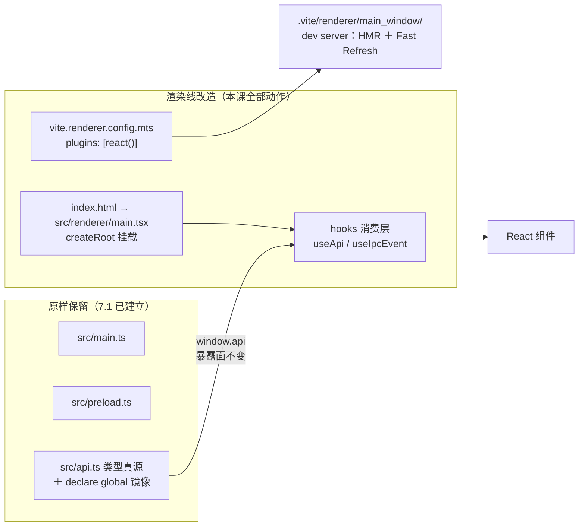

import { Meta } from '@storybook/addon-docs/blocks';

<Meta id="react-integration" title="框架集成/React 集成" name="Docs" />

# React 集成

本课在「[接入 TypeScript](?path=/docs/typescript-setup--docs)」的 vite-ts 骨架上接入 React，完成一套 React + Vite + Electron 工程的完整搭建与 IPC 封装。核心判断先行：**React 只落在三条构建线中的渲染线一条上。**主进程、预加载脚本与 `window.api` 的三点一线类型纪律（类型真源、`satisfies` 对账、`declare global` 消费）原样不动；全部接入动作收敛为四处——渲染线 Vite 配置挂 `@vitejs/plugin-react`、入口从 `renderer.ts` 换成 `main.tsx`（`createRoot`）、tsconfig 按端拆分、`window.api` 的消费方式 hook 化。通信结构不变，变的只是渲染端消费通信的方式。React 语言本身不是本课内容，只标注衔接点。

想要现成起点，[electron-react-boilerplate](https://github.com/electron-react-boilerplate/electron-react-boilerplate) 提供另一种整套工程组织（webpack 一系），可作对照参考；本课沿「[集成模式](?path=/docs/integration-overview--docs)」中 Forge Vite 插件这条路线做最小接入，与 7.1 连续。

读完你应能预测：改一个组件文件保存，窗口即时更新且组件 state 保留（Fast Refresh）；改主进程代码，应用不会自动重启（7.1 的规则未变）；打包后路由必须用 hash，因为页面从 `file://` 加载。



| 回查项 | 值 | 备注 |
| --- | --- | --- |
| 运行时依赖 | `npm install react react-dom` | 只被渲染线消费 |
| 构建期依赖 | `npm install -D @vitejs/plugin-react @types/react @types/react-dom` | 插件与类型声明 |
| 渲染线插件 | `plugins: [react()]` | 只写在 `vite.renderer.config.mts`，另两条线不挂 |
| 入口 | `index.html` 的 script 指向 `/src/renderer/main.tsx` | `renderer.ts` 删除，`createRoot` 挂载 |
| jsx 配置 | `"jsx": "react-jsx"` | 与 DOM lib 一起放 `tsconfig.web.json` |
| 路由 | `HashRouter` | 打包后从 `file://` 加载，hash 不发给服务器 |
| hook 封装 | `useApi`（invoke 状态机）＋ `useIpcEvent`（推送订阅） | 完整实现在本课目录 |
| 不动的部分 | main、preload、`src/api.ts`、dev/prod 加载分流 | 7.1 规则全部沿用 |

## 快速上手

沿用 7.1 的 vite-typescript 工程，四步把 React 跑起来。先纠正一个容易误解的说法：「依赖装哪端」指的是构建线的消费归属——工程只有一份 `package.json`、一个 `node_modules`，不存在按端分目录安装。

1. 安装依赖：运行时进 dependencies，插件与类型进 devDependencies：

```bash
npm install react react-dom
npm install -D @vitejs/plugin-react @types/react @types/react-dom
```

2. 渲染线挂插件。7.1 模板里 `vite.renderer.config.mts` 是空的 `defineConfig({})`，接入 React 只改这一处（完整文件见本课目录 `vite.renderer.config.mts`）：

```ts
// vite.renderer.config.mts
import react from '@vitejs/plugin-react';
import { defineConfig } from 'vite';

export default defineConfig({
  plugins: [react()],
});
```

3. 入口换成 `main.tsx`。顺手把渲染端代码收进 `src/renderer/`（下一节拆 tsconfig 时 include 就互不干扰）：`index.html` 加挂载点、script 指向新入口，删除 `src/renderer.ts`，样式文件随入口挪进 `src/renderer/`：

```html
<body>
  <div id="root"></div>
  <script type="module" src="/src/renderer/main.tsx"></script>
</body>
```

```tsx
// src/renderer/main.tsx
import { StrictMode } from 'react';
import { createRoot } from 'react-dom/client';
import { App } from './App';

// 非空断言：模板 HTML 保证 #root 存在
createRoot(document.getElementById('root')!).render(
  <StrictMode>
    <App />
  </StrictMode>,
);
```

```tsx
// src/renderer/App.tsx：最小组件，先跑通闭环
import { useState } from 'react';

export function App() {
  const [count, setCount] = useState(0);
  return (
    <main>
      {/* 改这行文案保存：文字热替换，数字不重置（Fast Refresh 保留 state） */}
      <p>Fast Refresh 计数：{count}</p>
      <button onClick={() => setCount(count + 1)}>+1</button>
    </main>
  );
}
```

4. tsconfig 补 jsx 配置：最小做法是在现有共用 tsconfig 的 `compilerOptions` 里加 `"jsx": "react-jsx"`——该选项只影响 `.tsx` 文件，对 main、preload 无副作用；规范的按端拆分见下一节。

`npm start`，三个观察点：

- **窗口内容来自 React**：`#root` 挂载点里渲染出按钮与计数，`index.html` → `main.tsx` → `createRoot` → `App` 链路生效；
- **改 `App.tsx` 文案保存**：窗口文字即时更新，点了几次攒下的计数不重置——`react()` 带来的 Fast Refresh 在工作；
- **改 `src/main.ts` 保存**：窗口无变化也不重启——主进程的生效规则仍是 7.1 的 watch 重建 + 终端输入 `rs` 手动重启。

## 依赖装在哪一端

分三类回答。**React 本体（`react`、`react-dom`）只被渲染线 import。**Vite 构建渲染端时把依赖整体打进 `.vite/renderer/` 产物，运行时窗口不读 `node_modules` 里的 React——所以放 dependencies 是 Web 惯例，放 devDependencies 则打包出的 asar 不背一份用不到的源码，两种都能跑，选一种保持一致。唯一不能做的是把它们 import 进 main 或 preload：主进程与预加载里没有 React 的运行场景。

**插件与类型是构建期/类型期依赖。**`@vitejs/plugin-react` 是 Vite 官方的 React 插件，提供 automatic JSX runtime 转换与开发期 Fast Refresh；`@types/react`、`@types/react-dom` 供给 `tsc`。三者都在 devDependencies，且只挂在渲染线——`vite.main.config.mts`、`vite.preload.config.mts` 不处理 tsx，挂了没有意义。

**preload 的类型接线不受影响。**`import type` 编译期擦除、`satisfies Api` 对账这些 7.1 的结论不因 React 改变——桥的那一端没人动它。

边界收口：真正与「端」有关的依赖判断发生在主进程一侧——运行时 npm 包（数据库驱动、原生模块）才牵出 external 标记与 asar 裁剪，归「打包」「原生模块」两课；React 全在渲染线，不碰这层。

## 渲染线改造

三处改动构成渲染线的全部工作量。Forge 的 Vite 插件对渲染线的定位是遵循与非 Electron Vite 项目相同的标准——渲染线就是一个标准 Vite 工程，框架按 Vite 惯例接入，Electron 侧不掺和；Electron 侧的既有约束（`base` 强制 `./`、dev/prod 加载分流）继续有效。

### vite.renderer.config.mts：挂插件

快速上手已给出完整文件，这里补三条边界：模板默认值就是空的 `defineConfig({})`，只需加 `plugins: [react()]`；不要把 `base` 覆盖回 `/`（7.1 的 `file://` 纪律）；插件不改变渲染线的产物路径与魔法常量，`MAIN_WINDOW_VITE_DEV_SERVER_URL` 的分流原样工作——开发时渲染端照旧走 dev server 的 `loadURL`，打包走 `loadFile`。

### 入口换成 main.tsx

`index.html` 仍是渲染线入口，变化只有两处：`<body>` 里加 `<div id="root"></div>` 挂载点，script 的 `src` 从 `/src/renderer.ts` 改为 `/src/renderer/main.tsx`。旧入口 `renderer.ts` 删除，它原来的 `import './index.css'` 移到 `main.tsx` 或 `App.tsx` 里。

`main.tsx` 是整页级的入口：`createRoot` 是 React 18 起的统一挂载 API，`StrictMode` 在开发期对渲染与 effect 做双执行检查——它正是后面 `useIpcEvent` 订阅对称性的试金石。组件层的代码从 `App.tsx` 开始，HMR 的粒度划分见「路由与热更新」。

### tsconfig 拆分：node 与 web 两份

7.1 留下的预告在此兑现：「渲染端引入框架之后，DOM lib、jsx 配置这些前端诉求会和主进程的 Node 端诉求互相干扰，届时拆分」。渲染端代码收进 `src/renderer/` 后，两份配置的 include 互不干扰；根 `tsconfig.json` 只留公共选项，被两份 extends：

```jsonc
// tsconfig.json——公共选项（沿用 7.1 的共用配置），本身不再直接包含文件
{
  "compilerOptions": {
    "target": "ESNext",
    "module": "preserve",
    "moduleResolution": "bundler",
    "allowJs": true,
    "skipLibCheck": true,
    "esModuleInterop": true,
    "noImplicitAny": true,
    "sourceMap": true,
    "resolveJsonModule": true,
    "noEmit": true
  },
  "files": [],
  "references": [
    { "path": "./tsconfig.node.json" },
    { "path": "./tsconfig.web.json" }
  ]
}
```

```jsonc
// tsconfig.node.json——主进程、预加载、构建配置
{
  "extends": "./tsconfig.json",
  "include": [
    "src/main.ts",
    "src/preload.ts",
    "src/api.ts",
    "src/api.d.ts",
    "src/declarations.d.ts",
    "*.mts"
  ]
}
```

```jsonc
// tsconfig.web.json——渲染端（React）
{
  "extends": "./tsconfig.json",
  "compilerOptions": {
    "lib": ["ESNext", "DOM", "DOM.Iterable"],
    "jsx": "react-jsx",
    "types": ["vite/client"]
  },
  "include": ["src/renderer", "src/api.ts", "src/api.d.ts"]
}
```

三个要点：`"jsx": "react-jsx"` 启用自动 JSX runtime，`.tsx` 文件里不必再 `import React`；`"types": ["vite/client"]` 供给 `import.meta.env` 与资源模块声明（顺带覆盖 `*.css` 导入），这正是 Vite 官方 react-ts 模板的写法；`src/api.ts` 与 `src/api.d.ts` 两份配置都 include——桥的类型真源本来就该两侧可见。typecheck 脚本各跑一次：

```jsonc
// package.json
{
  "scripts": {
    "typecheck": "tsc --noEmit -p tsconfig.node.json && tsc --noEmit -p tsconfig.web.json"
  }
}
```

## window.api 的 React 化

桥的结构不动：`src/api.ts` 仍是类型真源，preload 仍是实现端，渲染端仍只认 `window.api` 的具名能力。React 带来的变化在消费层——3.2 的请求响应与 3.3 的推送订阅，分别封装成两个 hook，把 IPC 语义接进组件生命周期。

先看真源的唯一演进：为演示推送方向，`Api` 接口加一个订阅成员 `onTick`（完整文件见本课目录 `api.ts`），preload 补上对应实现，`satisfies` 继续对账：

```ts
// src/preload.ts：真源加了 onTick，实现端补一个成员（主进程侧配一个
// setInterval 调 webContents.send('tick', ...) 即可演示，3.3 的规则原样适用）
import { contextBridge, ipcRenderer } from 'electron';
import type { Api } from './api';

const api = {
  readAppInfo: () => ipcRenderer.invoke('app:info'),
  ping: (message: string) => ipcRenderer.invoke('app:ping', message),
  // 推送成员：listener 进、取消订阅函数出
  onTick: (listener) => {
    const handler = (_event, payload) => listener(payload);
    ipcRenderer.on('tick', handler);
    return () => ipcRenderer.removeListener('tick', handler);
  },
} satisfies Api;

contextBridge.exposeInMainWorld('api', api);
```

### useApi：invoke 的请求状态机

`invoke` 返回 Promise，组件需要的是状态而不是 Promise——`useApi(load, deps)` 把两者接起来：挂载与 deps 变化时调用 `load`，结果落进 `{ data, loading, error }` 三态（完整实现见本课目录 `use-api.ts`）：

```ts
export function useApi<T>(
  load: () => Promise<T>,
  deps: DependencyList,
): ApiState<T> {
  const [state, setState] = useState<ApiState<T>>({ data: null, loading: true, error: null });

  useEffect(() => {
    let cancelled = false; // 过期标志：卸载或 deps 再变后，旧结果不再落地
    setState((prev) => ({ ...prev, loading: true, error: null }));
    load().then(
      (data) => { if (!cancelled) setState({ data, loading: false, error: null }); },
      (err: unknown) => { if (!cancelled) setState({ data: null, loading: false, error: toError(err) }); },
    );
    return () => { cancelled = true; };
  }, deps);

  return state;
}
```

组件里一行接入，`info.data` 的类型就是 `api.ts` 里的 `AppInfo`——7.1 的 `declare global` 镜像让 hook 全程类型安全：

```tsx
const info = useApi(() => window.api.readAppInfo(), []);
// info.loading → info.data: AppInfo | null → info.error: Error | null
```

`cancelled` 标志是本 hook 的关键机制：组件卸载或 deps 再变后，慢到的旧响应不再落地，避免「离开页面后 setState」与「旧参数覆盖新参数」两类错乱。它只做最小闭环——缓存、去重、失效重验这类请求管理是「状态管理」一课的话题，第三方库（React Query 等）解决的是同一层的问题，本课先不引入。

### useIpcEvent：推送订阅的 hook 化

3.3 给桥定下的惯例——订阅函数 listener 进、取消订阅函数出——恰好就是 `useEffect` cleanup 的形状：挂载时订阅，卸载时退订。`useIpcEvent` 把这对纪律钉进一个 hook（完整实现见本课目录 `use-ipc-event.ts`）：

```ts
export function useIpcEvent<P>(
  subscribe: (listener: (payload: P) => void) => () => void,
  handler: (payload: P) => void,
): void {
  // 最新 handler 存 ref：避免把 handler 写进依赖导致每帧重订阅
  const handlerRef = useRef(handler);
  useEffect(() => { handlerRef.current = handler; });

  useEffect(() => {
    // 返回值就是 3.3 约定的取消订阅函数：React 把它当 cleanup，卸载时调用
    return subscribe((payload) => handlerRef.current(payload));
  }, [subscribe]);
}
```

组件里传入桥上的订阅方法与处理函数即可：

```tsx
const [count, setCount] = useState(0);
useIpcEvent(window.api.onTick, (payload) => setCount(payload.count));
```

三个设计点：**订阅只建立一次**——`subscribe` 是 `window.api` 上的稳定方法引用，不随渲染变化，handler 每帧更新只进 ref，回调永远调用最新一帧的闭包；**StrictMode 下对称安全**——开发期的双执行变成「订阅 → 退订 → 订阅」，退订函数的存在让监听器不会叠加，这正是把订阅纪律 hook 化的收益：规则写在 hook 里，组件想忘都忘不掉；**组件体里不再裸调 `window.api.on*`**——渲染期直接调用订阅会每帧叠加监听器，是 3.3 那个坑在 React 下的形态。

边界一条：推送只负责「之后有更新」，初始快照仍用拉的——`useApi` 拉当前状态、`useIpcEvent` 接增量，3.3 的时序结论原样迁移成了 React 下的组合套路。

## 路由与热更新

### 路由选 hash

多页面 React 应用需要前端路由，这里有一个 Electron 特有的判断：**打包后页面从 `file://` 加载，路由必须用 hash。**`BrowserRouter` 的 location 放在 URL 路径里，路径式刷新与深链依赖服务器把任意路径回退到 `index.html`——打包后的 Electron 没有服务器接应，这条路走不通。`HashRouter` 把 location 存进 URL 的 hash 部分，hash 不发给服务器，`file://` 下天然可用；dev server 阶段两者都能跑，所以这个问题只在打包后暴露，容易被开发期的正常表现掩盖。安装（同样只服务渲染线）与接入：

```bash
npm install react-router-dom
```

```tsx
import { HashRouter, Route, Routes } from 'react-router-dom';

createRoot(document.getElementById('root')!).render(
  <StrictMode>
    <HashRouter>
      <Routes>
        <Route path="/" element={<App />} />
        <Route path="/settings" element={<SettingsPage />} />
      </Routes>
    </HashRouter>
  </StrictMode>,
);
```

路由状态属于渲染端；需要与主进程状态联动的部分（比如按路由切换窗口行为），边界在「状态管理」一课。

### 热更新的边界

渲染端在开发期走 Forge 插件的 Vite dev server，天然有完整 HMR；`react()` 在其上加了 Fast Refresh：组件文件改动热替换，**组件 state 保留**。整页刷新（state 丢失）仍会发生，常见触发有两类：改的是 `main.tsx` 这类入口文件；组件文件里混入了非组件导出（常量、工具函数）——把非组件导出挪到单独模块即可。

React 不改变 7.1 定下的另两条线：main 改动 watch 重建但默认不自动重启（终端输入 `rs`，或插件配置 `hotRestart: true`）；preload 重建后插件向渲染端发 full-reload，随页面加载重新执行。

## 最佳实践

- **渲染端代码收进 `src/renderer/`，与 tsconfig 拆分一起做。**两份 include 互不干扰，`tsc` 各查各的端；拖着不拆，jsx、DOM lib 与 Node 类型会继续在共用配置里互相将就。
- **桥的纪律跨框架不变。**hook 只是消费层：通道名与 `event` 对象仍不出桥，组件代码只出现 `window.api` 的具名能力——换框架换的是消费方式，不是通信结构。
- **初始用拉、增量用推。**`useApi` 拉快照、`useIpcEvent` 接增量；让初始状态也走推送等于要求时序完美，3.3 的教训在 React 下同样成立。
- **订阅逻辑只出现在 hook 里。**组件体渲染期裸调 `window.api.on*` 会每帧叠加监听器；订阅、退订与最新 handler 的处理都收敛进 `useIpcEvent`。
- **依赖归属按构建线想。**渲染线的包全进产物、运行时不读 `node_modules`；主进程运行时依赖才涉及 external 与 asar 裁剪（「打包」「原生模块」两课）。

## 常见问题

- 装完依赖启动，窗口白屏，Forge 终端报 `Failed to resolve import "react-dom/client"` 一类错误
  先看终端再看书本：Vite 的报错先于窗口出现。逐项确认 `react` 与 `react-dom` 已安装、`vite.renderer.config.mts` 挂了 `react()`、`index.html` 的 script 指向真实存在的入口文件。
- `tsc` 报 `Cannot find module 'react'`，或 JSX 处报 `Cannot use JSX unless the '--jsx' flag is provided`
  类型侧没接上。确认 `@types/react` 已安装、tsx 文件落在 `tsconfig.web.json` 的 include 范围内、`"jsx": "react-jsx"` 已配置；沿用单份共用 tsconfig 的就把 jsx 加进共用配置。
- 开发时路由正常，打包后刷新或重启应用白屏
  用了 `BrowserRouter`。打包后从 `file://` 加载，路径式 location 没有服务器接应；改用 `HashRouter`（见「路由选 hash」）。
- 推送一条触发多次处理，或组件越用越卡
  订阅叠加：组件体里裸调订阅 API 且没有退订，每渲染一次订阅一次。处理动作：订阅收敛进 `useIpcEvent`（挂载订阅、卸载退订），不在渲染期直接调用订阅。
- 改了组件却整页刷新，state 丢了
  Fast Refresh 的边界：该文件除组件外还导出了别的东西，或改的是 `main.tsx` 级入口。把非组件导出挪到单独模块，组件文件只导出组件。

## 总结回顾

摘要：

在 7.1 的 vite-ts 骨架上接入 React，是渲染线的单端改造：`vite.renderer.config.mts` 挂上 `@vitejs/plugin-react`（automatic JSX runtime ＋ Fast Refresh），入口从 `renderer.ts` 换成 `src/renderer/main.tsx` 的 `createRoot`，tsconfig 兑现 7.1 的预告拆成 node/web 两份（web 侧配 `"jsx": "react-jsx"`、DOM lib 与 `vite/client` 类型）。依赖按构建线归属：React 本体全进渲染产物、运行时不读 `node_modules`，插件与类型进 devDependencies，preload 的 `import type` 擦除与 `satisfies` 对账不受影响。IPC 封装在消费层 hook 化：`useApi` 把 invoke 接成 `{ data, loading, error }` 三态并用 `cancelled` 标志丢弃过期结果，`useIpcEvent` 把 3.3 的「listener 进、取消函数出」接成 useEffect 的订阅/退订，StrictMode 双执行下也对称安全。路由打包后必须用 `HashRouter`——`file://` 下没有服务器接应路径式 location；热更新上 React 只增强渲染端（组件改动保 state），main 与 preload 的生效规则仍是 7.1 的那条。

一句话：

> React 接入是渲染线的单端改造——构建线挂插件、入口换 `createRoot`、类型配置拆 web/node，而 `window.api` 的三点一线纪律原样不动，只是消费方式 hook 化。

知识要点：

- React 相关依赖装在哪、被哪条构建线消费？为什么运行时不读 `node_modules`？
- 接入 React 一共改了哪几处？哪些文件与纪律原样不动？
- tsconfig 为什么这时拆？两份各管什么？`"jsx": "react-jsx"` 与 `vite/client` 配在哪份？
- `useApi` 怎么把 invoke 接成组件状态？`cancelled` 标志防的是什么？
- `useIpcEvent` 与 3.3 的取消订阅惯例怎么对应？为什么订阅只建立一次、StrictMode 下也安全？
- 打包后路由为什么必须用 `HashRouter`？为什么开发期发现不了？
- 哪些改动触发整页刷新而不是 Fast Refresh？

## 参考资料

- [Electron Forge：Vite Plugin](https://www.electronforge.io/config/plugins/vite)（渲染线遵循标准 Vite 工程、`base` 强制 `./`、dev server 常量与加载分流）
- [Vite 指南：使用插件](https://vite.dev/guide/using-plugins)（插件进 devDependencies 与 `plugins` 数组的接入方式）
- [@vitejs/plugin-react](https://github.com/vitejs/vite-plugin-react)（`react()` 用法、Fast Refresh 与 automatic JSX runtime）
- [Vite 官方 react-ts 模板的 tsconfig.app.json](https://github.com/vitejs/vite/blob/main/packages/create-vite/template-react-ts/tsconfig.app.json)（`"jsx": "react-jsx"`、DOM lib 与 `"types": ["vite/client"]` 的组合出处）
- [React Router：HashRouter](https://reactrouter.com/api/declarative-routers/HashRouter)（location 存进 hash 部分、不发给服务器）
- [React：createRoot](https://react.dev/reference/react-dom/client/createRoot)（入口挂载 API）
- [React：StrictMode](https://react.dev/reference/react/StrictMode)（开发期渲染与 effect 双执行的行为依据）
- [electron-react-boilerplate](https://github.com/electron-react-boilerplate/electron-react-boilerplate)（另一种工程组织的对照起点）
