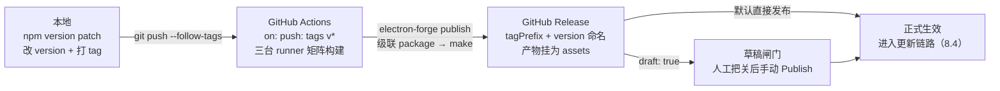

import { Meta } from '@storybook/addon-docs/blocks';

<Meta id="release" title="打包与发布/发布流程" name="Docs" />

# 发布流程

发布流程把前四课收拢成一条可重复的流水线，回答一个问题：从哪个动作开始，到哪个状态结束。核心模型是三个坐标：**版本是主键**——package.json 的 `version` 派生出产物文件名、系统元数据、更新比较基准和 Release tag，一次发布对应一个永不复用的版本号；**tag 是开关**——推一个 `v*` tag 触发 CI，CI 里的 `electron-forge publish` 级联 package → make → 上传；**Release 是登记处**——GitHub Releases 页是产物的事实来源，也是「[自动更新](?path=/docs/auto-update--docs)」更新链路的输入。`draft` 与 `prerelease` 两道闸门，决定"上传完成"和"对用户生效"之间隔几步。

读完你应能预测：`npm version patch && git push --follow-tags` 之后，Actions 页出现三个平台的 job，各自构建并把宿主产物上传到同一个 Release；Releases 页出现以 `v` + 版本号命名的新 Release。配置了 `draft: true` 时，它先以草稿形式存在，手动点 Publish 后才对更新链路生效。



| 回查项 | 值 | 备注 |
| --- | --- | --- |
| 版本主键 | package.json `version` | 必须是合法 semver，且更新链路要求严格递增（8.4） |
| 版本 → 系统元数据 | macOS `CFBundleShortVersionString` / Windows `ProductVersion` | packager 的 `appVersion` 默认取 `version` |
| 升版打标 | `npm version patch\|minor\|major\|prerelease` | 改 version + git commit + git tag 一步完成 |
| 发布命令 | `npx electron-forge publish` | 级联 package → make → 上传产物 |
| Release tag | `tagPrefix`（默认 `'v'`）+ `version` | 由 version 派生，不读你推的 git tag |
| 认证 | `GITHUB_TOKEN` + `permissions: contents: write` | 8.4 已讲 |
| 草稿闸门 | `draft: true` | 手动 Publish 前不进更新链路 |
| 预发布标记 | `prerelease: true` | 稳定渠道不收 |
| 重复发布 | `force: true` | 覆盖已有 Release 的同名产物 |
| 完整发布工作流 | 本课示例文件 `release.yml` | 触发、矩阵、publish 一条龙 |

## 快速上手

前提：「[接入 TypeScript](?path=/docs/typescript-setup--docs)」一课的 vite-typescript 项目；publishers 已按本课 `forge.config.mts` 配置（首次需安装 `@electron-forge/publisher-github`），仓库根目录已有 `release.yml`。认证零配置：`GITHUB_TOKEN` 在 Actions 中自动可用，workflow 里声明 `permissions: contents: write` 即可（8.4 已讲）。

```bash
npm version patch        # 1.2.2 → 1.2.3：改 package.json + git commit + git tag v1.2.3
git push --follow-tags   # 推提交和 tag；tag 是发布开关
# Actions 页出现三平台 job；跑完后 Releases 页出现 v1.2.3，挂着各平台产物
```

三个观察点：

- **Release 的名字是 `v1.2.3`**——`tagPrefix`（默认 `v`）+ package.json 的 `version`，不是随便哪个 git tag；
- **三台 runner 各自上传宿主产物到同一个 Release**——publishers 默认发布所有平台产物，Release 靠同一个 tag 聚合；
- **这条链路跑完即满足更新服务的输入条件**——产物在 Releases、tag 为合法 SemVer、非 draft 非 prerelease（8.4 的条件清单），「[自动更新](?path=/docs/auto-update--docs)」的验证闭环从这里开始。

## 版本号

semver 在桌面应用里的含义比在库世界里更重：`主.次.补丁` 是对用户的升级承诺——主版本允许破坏性变更（含 Electron 大版本升级带来的行为变化）、次版本加功能、补丁只修错。更新链路对它有两个硬性要求（8.4 已建立）：tag 必须是合法 semver；版本必须严格递增，相同或更低的版本不会触发更新。所以版本号不是备注字段，是发布主键。

### version 的去向

package.json 的 `version` 一处声明、四处生效：

| 去向 | 表现形式 | 谁写入 |
| --- | --- | --- |
| 产物文件名 | `my-app-darwin-arm64-1.2.3.zip`、`my-app-1.2.3-full.nupkg` | make（8.1 已见） |
| 系统元数据 | macOS `CFBundleShortVersionString`、Windows `ProductVersion` | package 步：packager 的 `appVersion` 默认取 `version` |
| 运行时 | `app.getVersion()` 的返回值，8.4 的 feed URL 就用它 | Electron 读包内 package.json |
| Release tag | `v1.2.3` | publish：`tagPrefix` + `version` |

`buildVersion` 是第二个相关字段：默认同 `appVersion`，写入 macOS `CFBundleVersion` 与 Windows `FileVersion`，日常应用不需要动它——两个版本号都保持"来自 package.json 的 `version`"这条单一来源即可。由此得出两条纪律：改版本只改 `version` 字段（或直接用 npm version），不在代码里硬编码；开发模式下 `app.getVersion()` 读的是项目根的 package.json，打包应用里读的是包内那份，两边一致才不会出现"界面显示的版本和更新链路认的版本对不上"。

### npm version：升版与打标一步完成

```bash
npm version patch                     # 1.2.2 → 1.2.3；git log 多一条 "v1.2.3"，同名 annotated tag
npm version prerelease --preid=beta   # 1.2.2 → 1.2.3-beta.0；再跑一次 → 1.2.3-beta.1
git push --follow-tags                # 推提交 + annotated tag
```

前提：工作区干净——有未提交改动时 `npm version` 直接拒绝执行。为什么用 `npm version` 而不是手改 version 手打 tag：publish 生成的 Release 名由 `tagPrefix` + `version` 派生，**不看**你推的 git tag；手打 tag 忘了升 version，Release 会以 version 命名并在仓库里另建一个新 tag，版本历史从此分叉。`npm version` 同时改 version 和打同名 tag，让两套命名天然一致——这是 tag 驱动发布的地基。

## 发布流水线

### forge publish 与 publishers

`electron-forge publish` 是构建级联的终点：package → make → 把 `out/make/` 下的产物交给 `publishers` 数组上传。8.4 从更新链路视角讲过它的位置与认证；本课补全发布动作侧的全部选项。publisher-github 的发布侧配置：

| 选项 | 默认 | 作用 |
| --- | --- | --- |
| `repository` | 必填 | 目标仓库的 owner 与 name |
| `draft` | 不开启 | 创建草稿 Release，见下一节 |
| `prerelease` | 不开启 | 标记为预发布，见下一节 |
| `tagPrefix` | `'v'` | 与 `version` 拼成 Release 的 tag |
| `generateReleaseNotes` | 不开启 | 让 GitHub 按两次发布间的 PR 自动生成 release notes |
| `force` | 不开启 | 同版本重发时覆盖已有 Release 的同名产物 |
| `authToken` | 环境变量 `GITHUB_TOKEN` | 对仓库有写权限的 token（8.4 已讲） |

完整带注释的配置见本课示例文件 `forge.config.mts`。三平台产物进同一个 Release 的机制：每台 runner 的 publish 按同一规则（`tagPrefix` + `version`）算出同一个 Release，各自上传宿主产物——Release 是按 tag 聚合的，不是某台 runner 独扛。

### release.yml：tag 触发的发布工作流

完整工作流见本课示例文件 `release.yml`，骨架：

```yaml
on:
  push:
    tags: ['v*']        # 唯一发布开关：推 tag 才发版
permissions:
  contents: write       # publisher 用 GITHUB_TOKEN 创建 Release（8.4 已讲）
jobs:
  publish:
    strategy:
      fail-fast: false  # 一个平台失败不连坐其他平台
      matrix:
        os: [macos-latest, ubuntu-latest, windows-latest]
    runs-on: ${{ matrix.os }}
    steps:
      - uses: actions/checkout@v4
      - uses: actions/setup-node@v4
        with: { node-version: 24, cache: npm }
      - run: npm install
      - if: runner.os == 'Linux'
        run: sudo apt-get update && sudo apt-get install -y rpm
      - run: npx electron-forge publish   # 级联 package → make → 上传
```

与「[多平台构建](?path=/docs/cross-platform-builds--docs)」`build.yml` 的分工：build.yml 面向日常构建——产物收进 Actions artifacts，矩阵骨架、maker 宿主约束与 runner 依赖都在那课；release.yml 面向正式发布——产物直达 GitHub Releases。矩阵部分两者一致（三台 runner、Node 24、Linux 补 rpm 工具链），差别只在触发条件与最后一步。

触发模型要说破一个直觉：**Forge 没有"打 tag 自动发布"的内置配置**——触发完全由 CI 的 `on: push: tags` 承担，`publish` 只负责"把当前 version 的产物传上去"。想自动化的部分全部写在 workflow 里，想把关的部分留给人，见下节闸门。

## 草稿与预发布

上传完成不等于对用户生效，两道闸门各挡一路：

- **`draft: true` → 草稿。** Release 已创建、产物已挂上，但在 Releases 页对公众不可见，更新服务也不认——8.4 的规则是只把非 draft、非 prerelease 的版本当作可更新版本。用途是发布前最后一道人工把关：下载产物抽查、装一遍、核对版本号与 release notes，然后在 GitHub 上手动点 Publish。点完才进更新链路，已安装的应用在下一轮轮询收到。
- **`prerelease: true` → 预发布。** Release 正式可见，但带 pre-release 标记，稳定渠道的更新服务不把它推给用户；配合 semver prerelease 后缀（`1.3.0-beta.0`）构成 beta 渠道的原料，见下节。

两道闸门可以叠加：beta 发布常配 `prerelease: true`，正式发布常配 `draft: true`。`generateReleaseNotes: true` 让 GitHub 自动汇总两次发布之间的 PR 作为 release notes，正式发布前人工补写重点即可。

## 发布检查清单

按流水线顺序过一遍，任何一项不过都停在闸门前：

1. **CI 全绿**——三平台 job 各自成功（`fail-fast: false` 让失败日志互不干扰），某个平台的产物缺席就是发布不齐全；
2. **版本与 tag 一致**——Release 的 tag 等于 `tagPrefix` + package.json 的 `version`，git tag 与之相同（`npm version` 保证）；
3. **产物齐全**——对照 8.1 / 8.2 的产物清单：macOS zip（主分发另有 dmg）、Windows Setup.exe 与 `-full.nupkg` 加 `RELEASES`、Linux deb/rpm；
4. **签名生效**——macOS 已签名公证（「[签名与公证](?path=/docs/code-signing--docs)」），Windows 安装器已签名；未签名的 macOS 包发出去后，更新链路也是坏的；
5. **草稿把关**——下载产物人工安装验证，核对 release notes 与版本号；
6. **Publish 后验证更新 feed**——按 8.4 的闭环：已安装旧版的应用在下一轮检查中收到新版本。

## 多渠道

渠道的本质是"不同人群的应用指向不同的更新源"。stable / beta 的最小实现分三层：

- **版本层**：beta 版用 prerelease 后缀，`npm version prerelease --preid=beta` 生成 `1.3.0-beta.0`、`1.3.0-beta.1`；semver 比较下 `1.3.0-beta.1` 小于 `1.3.0`，所以正式版发布后，beta 用户也会"升"到正式版；
- **Release 层**：publisher 配 `prerelease: true`，GitHub 显示 pre-release 标记，与正式发布在 Releases 页肉眼可分；
- **更新源层**：这是渠道真正的分界——update.electronjs.org 只服务稳定渠道（非 draft 非 prerelease，8.4），纯它做不出 beta 渠道。beta 用户的 feed 指向另一个源：自建静态存储按渠道分目录放产物，或自建服务器按渠道路由，两种形态见 8.4 的自建方案。

边界一句：渠道切换靠版本号语义自然完成（beta 等 `1.3.0` 正式版发布即回 stable）；真正的降级不在更新链路语义内，通常需要应用自己实现或重装。

## 最佳实践

- **发布后版本号永不复用。** 产物不可变是 Release 作为事实来源的前提；发现问题改代码、递增版本重发，不做版本回退。同版本重传只用于补传自己刚发的 Release（`force: true`）。
- **draft 常开。** 正式发布默认 `draft: true`，把"CI 完成"和"对用户生效"之间留一道人工闸门；哪怕团队自动化程度很高，至少在草稿上核对签名与产物清单再点 Publish。
- **发布开关只有 tag。** 日常构建（build.yml）与正式发布（release.yml）分开触发，主分支推送永不发版；紧急修复走"递增版本号的补丁版"，这是 semver 主键语义的直接推论。
- **release notes 起步靠 `generateReleaseNotes`，重点靠手写。** 自动汇总覆盖"改了什么"，面向用户的行为变化、已知问题与升级注意点仍要人工补写——它是发布里唯一直接写给用户读的文字。

## 常见问题

- 推了 tag，Release 的名字却和 tag 对不上，仓库里还多了个没打过的 tag
  Release tag 由 `tagPrefix` + package.json 的 `version` 派生，不读你推的 git tag；两者不一致时 GitHub 会按 Release 的名字另建新 tag。用 `npm version` 升版打标保证一致；已经错位的，删掉错误 tag 与 Release、修正 version 后重发。
- 同一个版本号重复 publish 失败，提示产物已存在
  更新链路要求版本严格递增（8.4），同版本重发只适用于补传场景：给 publisher 配 `force: true` 覆盖已有 Release 的同名产物；除此之外一律递增版本重新走流程。
- 配了 `draft: true`，CI 显示发布成功，已装用户却收不到更新
  预期行为：草稿 Release 不进更新链路（8.4 只认非 draft）。到 Releases 页完成人工把关后点 Publish，用户端下一轮轮询即生效。
- `git push --follow-tags` 之后 Actions 没有启动
  `--follow-tags` 只推 annotated tag；手工 `git tag v1.2.3` 默认打的是 lightweight tag，推不上去。用 `npm version`（默认打 annotated tag）打标，或 `git push origin v1.2.3` 显式推。

## 总结回顾

摘要：

发布流程把版本号变成一条可重复的流水线。package.json 的 `version` 是发布主键，向四处生效：产物文件名（make）、系统元数据（package 步把默认取 `version` 的 `appVersion` 写进 macOS `CFBundleShortVersionString` 与 Windows `ProductVersion`）、运行时 `app.getVersion()`、以及 Release tag（publish 用 `tagPrefix` 默认 `v` 加 `version` 拼出）。`npm version` 一步完成升版、提交与 annotated tag，保证 git tag 与 Release tag 天然一致。推 `v*` tag 触发 release.yml 的三平台矩阵，每台 runner 跑 `electron-forge publish`——级联 package → make，把 `out/make/` 产物按同一个 Release 名上传；publisher-github 的 `draft`、`prerelease`、`tagPrefix`、`generateReleaseNotes`、`force` 控制发布形态。draft 与 prerelease 是"上传完成"与"对用户生效"之间的两道闸门；多渠道靠 prerelease 后缀加独立更新源实现，update.electronjs.org 只服务稳定渠道。

一句话：

> 版本是主键、tag 是开关、Release 是登记处——发布自动化的全部内容，就是让这三者严格一致。

知识要点：

- package.json 的 `version` 会出现在哪四个地方？各由哪一步写入？
- 为什么 Release tag 可能与 git tag 不一致？`npm version` 怎么消除这种不一致？
- `electron-forge publish` 的级联链路是什么？三平台产物怎么进同一个 Release？
- publisher-github 的发布侧选项有哪些？各自管什么？
- draft 与 prerelease 分别挡住了什么？何时、由谁解除？
- 发布检查清单按什么顺序过？更新 feed 的验证闭环归属哪一课？
- beta 渠道的最小实现分哪三层？update.electronjs.org 的渠道边界在哪？

## 参考资料

- [Electron Forge：Publishers](https://www.electronforge.io/config/publishers)（publish 与 make/package 的级联关系、publishers 配置结构、默认发布所有平台产物）
- [Electron Forge：GitHub Publisher](https://www.electronforge.io/config/publishers/github)（publisher-github 的配置入口与 repository、prerelease 示例）
- [PublisherGitHubConfig API](https://js.electronforge.io/interfaces/_electron_forge_publisher_github.PublisherGitHubConfig.html)（`draft`、`prerelease`、`tagPrefix` 默认 `'v'`、`generateReleaseNotes`、`force`、`authToken` 的选项定义）
- [@electron/packager：Options API](https://electron.github.io/packager/main/interfaces/Options.html)（`appVersion` 默认取 package.json `version` 并映射 `CFBundleShortVersionString` / `ProductVersion`，`buildVersion` 映射 `CFBundleVersion` / `FileVersion`）
- [Electron 教程：Updating Applications](https://www.electronjs.org/docs/latest/tutorial/updates)（draft / prerelease 版本不进更新链路的规则来源，8.4 已引）
- [npm version 文档](https://docs.npmjs.com/cli/commands/npm-version)（升版、提交与 annotated tag、`--preid` 预发布后缀）
- [GitHub Actions：触发工作流的事件](https://docs.github.com/en/actions/writing-workflows/choosing-when-your-workflow-runs/events-that-trigger-workflows)（`on: push: tags` 的 tag 触发语法）
- [git push 文档](https://git-scm.com/docs/git-push)（`--follow-tags` 只推 annotated tag 的行为）
