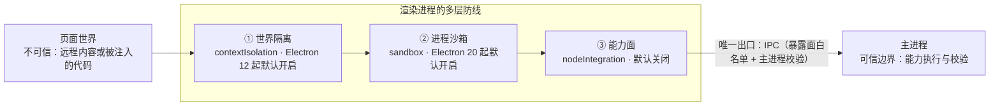

import { Canvas, Controls, Meta } from '@storybook/addon-docs/blocks';

import * as SecurityStories from './security.stories';

<Meta of={SecurityStories} name="Docs" />

# 安全清单

「[预加载脚本](?path=/docs/preload--docs)」把「关沙箱才能拿完整 Node」的取舍推给了本课，「[IPC 概念](?path=/docs/ipc-basics--docs)」把开关取舍推给了本课，「[打开外部资源](?path=/docs/shell--docs)」引用了清单第 13/14/15 条——本课把这些线索收拢，讲安全阶段的总纲。Electron 官方在教程里维护着一份 20 条的 Security 清单，它建立在一条判断上：**渲染端不可信**。渲染进程跑的是网页代码——远程内容可能不可信、自己的页面也可能被注入——所以一切机制都按「页面代码终将跑上恶意代码」来设计。清单的核心是三大开关：`contextIsolation`、`sandbox`、`nodeIntegration`，它们的默认值是官方多年教训换来的推荐值。读完你应该能预测：动其中任何一个默认值，代价都是明确的，而且会牵连沙箱一起失效；以及发布前按什么顺序给项目做安全自查。



| 回查项 | webPreferences 键 | 默认值 | 默认自 | 偏离的直接代价 |
| --- | --- | --- | --- | --- |
| 上下文隔离 | `contextIsolation` | `true` | Electron 12 | 预加载与页面合并为一个世界；该进程沙箱被一并强制关闭 |
| 进程沙箱 | `sandbox` | `true` | Electron 20 | 渲染进程初始化完整 Node；Chromium 沙箱防线消失 |
| Node 集成 | `nodeIntegration` | `false` | 官方建议自 Electron 5.0.0 起即默认行为 | 渲染进程引入完整 Node；该进程沙箱自动关闭 |

联锁规则一句话：**实际生效的沙箱 = `contextIsolation` 开 && `nodeIntegration` 关 && `sandbox` 未关**——前两个键任何一个偏离默认值，`sandbox: true` 都保不住沙箱（联动细节见「开关联动」）。

## 快速上手

给当前项目（「安装」一课用 Forge 创建的 `src/index.js` + `src/preload.js` + `src/index.html`）做一次 5 分钟安全自查，三步确认它处于官方默认的安全基线。

1. 在 `src/preload.js` 里加一行自检，保存后刷新窗口（`Cmd+R`，Windows/Linux 为 `Ctrl+R`——预加载脚本随页面加载重新执行）：

   ```js
   console.log('沙箱:', process.sandboxed, '上下文隔离:', process.contextIsolated);
   // 期望：沙箱: true 上下文隔离: true —— 两个自检属性都为 true 才在基线上
   ```

2. 打开窗口 DevTools 控制台，核对页面世界两侧的读数：

   ```js
   typeof require // → 'undefined'：页面世界没有 Node
   typeof process  // → 'undefined'
   ```

3. 打开 `src/index.js` 对照三条底线：`webPreferences` 里没有 `contextIsolation: false`、没有 `sandbox: false`、没有 `nodeIntegration: true`——一个都没出现，就是基线。

三步全过，项目就在官方默认的安全基线上；哪一步不过，对应小节讲清了代价与修法。

## 渲染端不可信

先建立威胁模型，后面的每条清单才有理由。浏览器里，页面代码被关在标签页沙箱中，能造成的伤害有限；Electron 的渲染进程跑的同样是网页代码，但它身边站着 Node——一旦页面世界拿到 Node 能力，读写任意文件、发起任意网络请求、执行任意命令都随之而来：那不叫「页面被黑」，叫「机器沦陷」。所以 Electron 的安全模型从出发点就假定**渲染端不可信**：无论加载的是远程内容还是自己的页面，都按「可能被注入（XSS、依赖投毒）」来设防。

官方也坦承 Electron 补不齐 Chrome 的防线：没有 Safe Browsing、证书透明度这类集中式安全设施，也无法像浏览器那样直接给用户推送安全更新——所以清单第 16 条「使用当前版本的 Electron」不是客套，升级本身就是防线的一部分（当前稳定版基准见「[认识 Electron](?path=/docs/what-is-electron--docs)」）。

20 条清单不是并列的 20 个待办，而是分层防线：世界隔离挡住页面触碰预加载能力，进程沙箱挡住对系统资源的访问，无 Node 集成挡住系统能力本身，IPC 校验与暴露面白名单挡住能力越界，导航、弹窗与权限控制挡住不可信内容进门（见「[导航与弹窗控制](?path=/docs/navigation-control--docs)」），签名与 fuses 挡住分发环节（属「[签名与公证](?path=/docs/code-signing--docs)」）。设计的目标是纵深：任何一层被绕过，还有下一层。

## 三大开关

三个开关都是 `webPreferences` 的字段，按窗口配置。官方清单把它们列为第 2、3、4 条，并各自注明「该建议即 Electron 的默认行为」——默认值不是随手给的，是推荐值本身。所以本课要回答的不是「怎么配」，而是「偏离默认值要付什么代价」；此外三者联锁，动其中两个会牵连第三个（推演见「开关联动」）。

### contextIsolation：上下文隔离

官方定义（webPreferences 文档）：*"Whether to run Electron APIs and the specified preload script in a separate JavaScript context."*——预加载脚本与 Electron 内部逻辑跑在一个独立的 JS 上下文里，与页面分开。Electron 12 起默认 `true`；「预加载脚本」一课的两个世界、`contextBridge` 的唯一通道地位，都是它给的。

关掉它的三个连锁，代价逐级升高：

1. **两个世界合并为一个全局作用域**：预加载挂到 `window` 的东西页面直接可见、可改写（preload 课的对照实验就是证据）；
2. **Node 原语可被页面触及**：官方原文 *"to truly enforce strong isolation and prevent the use of Node primitives contextIsolation must also be used"*——经典攻击是原型污染：页面篡改共享的 `Object` / `Array` 原型，预加载代码一调用内置方法，Node 能力就泄漏出去；
3. **该进程沙箱被强制关闭**：官方原文明确 *"regardless of the default, sandbox: false or globally enabled sandboxing!"*——即使显式写了 `sandbox: true`、即使全局开了沙箱，关隔离就是关沙箱。

```js
// 反面示例：关掉上下文隔离——预加载与页面共享全局作用域，且沙箱被一并强制关闭
new BrowserWindow({
  webPreferences: { contextIsolation: false },
});
```

边界：关掉它不会让 `contextBridge` 失效（桥本来就能用），只是让「不经过桥也能到达页面」成为可能；正确的暴露方式见「[预加载脚本](?path=/docs/preload--docs)」。

### sandbox：进程沙箱

把渲染进程关进 Chromium 的 OS 级沙箱。官方对沙箱的定位：*"limits the harm that malicious code can cause by limiting access to most system resources"*——沙箱内的进程只能自由使用 CPU 与内存，碰文件系统、改系统状态、起子进程都必须经 IPC 委托主进程。Electron 20 起默认 `true`。代价是渲染进程没有 Node 环境，预加载只有 polyfill 的 `require`（可用模块清单见「[预加载脚本](?path=/docs/preload--docs)」的运行环境表）。

关掉它的代价：渲染进程启动时初始化完整 Node，Chromium 这道进程级防线消失。官方对无沙箱进程的措辞很重：*"Loading, reading or processing any untrusted content in an unsandboxed process, including the main process, is not advised."*——注意连主进程都被点名：主进程本来就不在沙箱里，所以不可信内容也不该丢给主进程去加载、处理。

```js
// 反面示例：关掉进程沙箱——渲染进程初始化完整 Node，进程级防线消失
new BrowserWindow({
  webPreferences: { sandbox: false },
});
```

边界：`app.enableSandbox()` 可以在 app ready 之前把沙箱变成全局强制，并覆盖个别窗口的 `sandbox: false`；命令行参数 `--no-sandbox` 官方只建议在测试中用。确需完整 Node 的任务放主进程，而不是关沙箱。

### nodeIntegration：Node 集成

渲染进程引入完整 Node——这是 Electron 早期「像写桌面页面一样写应用」的遗产。默认 `false`，而且清单第 2 条注明这条建议自 Electron 5.0.0 起就是默认行为。官方对加载远程内容的渲染进程的措辞是全清单最重的级别：*"It is paramount that you do not enable Node.js integration in any renderer that loads remote content."*

打开它的代价：渲染进程从页面一侧持有 Node，并且**该进程沙箱自动关闭**——官方原文 *"The sandbox will automatically be disabled when nodeIntegration is set to true."*

```js
// 反面示例：为在渲染端用 fs 而打开 nodeIntegration——沙箱同时被自动关闭
new BrowserWindow({
  webPreferences: { nodeIntegration: true },
});
```

需求拆开看就清楚了：要的不是「渲染端有 Node」，而是「某个能力可被调用」。能力放主进程、经 IPC 暴露，能力面从「整台机器」缩到「一个 handler」：

```js
// 正面：能力收口主进程，渲染端经 IPC 调用（请求响应模式见「双向调用」）
ipcMain.handle('config:load', () => fs.readFileSync(configPath, 'utf8'));
```

边界：同族的 `nodeIntegrationInWorker` 默认同样是 `false`，理由相同——不要为 web worker 顺手打开。

### 开关联动：动一个默认值的连锁

三条联动规则都出自官方文档，不是推测：

| 动作 | 连锁后果 |
| --- | --- |
| `nodeIntegration: true` | 该进程沙箱自动关闭 |
| `contextIsolation: false` | 该进程沙箱被强制关闭——即使 `sandbox: true` 或 `app.enableSandbox()` |
| `sandbox: true` | 渲染进程没有 Node 环境（`nodeIntegration` 的 Node 也拿不到） |

下面的推演把三个开关摆在一起：左边是 `webPreferences` 的配置值，右边是该配置下渲染进程实际生效的能力面。任意切换，核对联动与判定。

<Canvas of={SecurityStories.Interactive} />
<Controls of={SecurityStories.Interactive} />

| 操作 | 可观察证据 |
| --- | --- |
| 保持默认（开/开/关） | 判定为「安全基线」；页面无 require，预加载只有 Node 子集 |
| 打开 Node 集成 | 联动区出现「沙箱自动关闭」，判定转「高危配置」 |
| 只关闭上下文隔离（沙箱开关仍为开） | 沙箱读数变「失效（被牵连关闭）」——写了 `sandbox: true` 也保不住 |
| 只关闭进程沙箱 | 预加载 Node 从「子集」变「完整 Node」，判定转「防线削弱」 |
| 关隔离 + 开 Node 集成 | 页面主世界 require 直接可用——官方 paramount 禁令针对的就是这个组合 |

联动的规律一句话：凡是想让渲染进程多拿一点能力（Node、共享世界），Electron 都会先把沙箱拆掉——「图省事」的代价从来不止一项。

## 清单其余条款

三大开关之外的 17 条大多「保持默认即安全」，不必逐条展开。先给全部 20 条的落点表（回查用），再单独讲三个最值得警觉的默认值陷阱。

| # | 清单条目 | 一句话要点 | 落点 |
| --- | --- | --- | --- |
| 1 | 只加载安全内容 | 应用外的资源一律走 HTTPS，不用明文 HTTP | 「webSecurity 与实验开关」 |
| 2 | 远程内容不开启 Node 集成 | 即 `nodeIntegration`（默认关闭） | 「三大开关」 |
| 3 | 启用上下文隔离 | Electron 12 起默认开启 | 「三大开关」 |
| 4 | 启用进程沙箱 | Electron 20 起默认开启 | 「三大开关」 |
| 5 | 处理远程内容的权限请求 | **默认全放行**，应设 `setPermissionRequestHandler` | 「权限请求默认全放行」；拦截细节见「[导航与弹窗控制](?path=/docs/navigation-control--docs)」 |
| 6 | 不要关闭 webSecurity | 关掉 = 同源策略失效 + 强制放行不安全内容 | 「webSecurity 与实验开关」 |
| 7 | 定义 Content Security Policy | 防 XSS 与数据注入的一道附加层 | 「CSP 与版本」 |
| 8 | 不启用 allowRunningInsecureContent | 不让 https 页面加载 http 脚本/样式（默认关闭） | 「webSecurity 与实验开关」 |
| 9 | 不启用 experimentalFeatures | 不引进未定型的 Chromium 实验特性（默认关闭） | 「webSecurity 与实验开关」 |
| 10 | 不用 enableBlinkFeatures | 不定点打开实验性 Blink 特性（默认关闭） | 「webSecurity 与实验开关」 |
| 11 | WebView 不用 allowpopups | 嵌入内容不得自行弹新窗口 | 「[导航与弹窗控制](?path=/docs/navigation-control--docs)」 |
| 12 | 创建前核对 WebView 选项 | 嵌入内容不可信，选项按白名单核对 | 「[导航与弹窗控制](?path=/docs/navigation-control--docs)」 |
| 13 | 限制导航 | 不需要导航就整体禁止；字符串开头比较可被骗 | 「[导航与弹窗控制](?path=/docs/navigation-control--docs)」；origin 判断写法见「[打开外部资源](?path=/docs/shell--docs)」 |
| 14 | 限制新窗口创建 | `setWindowOpenHandler` 一票否决 | 「[导航与弹窗控制](?path=/docs/navigation-control--docs)」；deny + 转交示例见「[打开外部资源](?path=/docs/shell--docs)」 |
| 15 | openExternal 不碰不可信内容 | 可被利用执行任意命令，先过协议白名单 | 「[打开外部资源](?path=/docs/shell--docs)」 |
| 16 | 使用当前版本的 Electron | 无 Chrome 式无感安全更新，升级即防线 | 「CSP 与版本」 |
| 17 | 校验所有 IPC 消息的 sender | 通道没有身份门禁，handler 先验来源 | 「[IPC 概念](?path=/docs/ipc-basics--docs)」的安全边界 |
| 18 | 少用 file://，优先自定义协议 | file:// 与自定义协议的组合更可控 | 「[自定义协议](?path=/docs/custom-protocol--docs)」 |
| 19 | 检查可改的 fuses | 分发侧加固（如关闭 runAsNode），打包阶段处理 | 「[签名与公证](?path=/docs/code-signing--docs)」 |
| 20 | 不向不可信内容暴露 Electron API | 暴露面是白名单，不是转发器 | 「[预加载脚本](?path=/docs/preload--docs)」的暴露面设计 |

### webSecurity 与实验开关

`webSecurity: false` 的代价官方文档一句话说全：*"it will disable the same-origin policy … and set allowRunningInsecureContent to true"*——同源策略是 Web 平台最后的安全底座，关掉它页面可以自由互读，同时不安全内容（https 页面加载 http 脚本）也被一并放行。它的上游是清单第 1 条：应用外的资源一律走 HTTPS——先不把不安全内容引进来，才轮得到这些开关兜底。有人关它通常是为了本地开发时跨域取数据图省事；修法是把数据请求收口主进程（Node 侧没有同源限制），或走自定义协议服务本地资源。

```js
// 反面示例：生产应用禁用 webSecurity——同源策略失效，且强制放行不安全内容
new BrowserWindow({
  webPreferences: { webSecurity: false },
});
```

第 8/9/10 条与它同属一类：`allowRunningInsecureContent`、`experimentalFeatures`、`enableBlinkFeatures` 默认都关着，偏离只发生在「图方便」的时刻——而这三者放行的，恰是混合内容与未定型的 Chromium 特性。

### 权限请求默认全放行

这是权限侧最反直觉的默认值，官方原文：*"By default, Electron will automatically approve all permission requests unless the developer has manually configured a custom handler"*——摄像头、麦克风、地理位置、通知……只要页面发起权限请求，Electron 默认一律同意。窗口会加载远程内容时，这是必须主动堵上的口子，用 `setPermissionRequestHandler` 按白名单放行：

```js
// 主进程：权限白名单——放行通知，其余一律拒绝（完整机制见「导航与弹窗控制」）
session.defaultSession.setPermissionRequestHandler((_wc, permission, callback) => {
  callback(permission === 'notifications');
});
```

### CSP 与版本

CSP 在官方清单里的定位：*"an additional layer of protection against cross-site-scripting attacks and data injection attacks"*—— XSS 已经发生时，它是挡住注入脚本的最后一层。落到 Electron 里就是一行策略（官方推荐形态），用 meta 标签或响应头（`session` 的 `webRequest.onHeadersReceived`）都可设置：

```html
<meta http-equiv="Content-Security-Policy" content="script-src 'self' https://apis.example.com">
```

版本（第 16 条）是唯一一条「不做就随时间贬值」的防线：每个 Electron 稳定版都带着新版 Chromium 的安全修复，而 Electron 无法像 Chrome 那样无感推送——所以升级不是功能动作，是安全动作。

## 最佳实践

- **默认值即基线，偏离要说明理由。** 三大开关保持默认；需求是「能力」不是「权限」——fs、系统调用收口主进程，渲染端经 IPC 调用，而不是开 `nodeIntegration` 或关沙箱。
- **按内容来源决定清单的适用强度。** 纯本地内容的窗口，底线是保持默认值；会加载远程内容的窗口，权限 handler、导航与新窗拦截、CSP、sender 校验全部要上（拦截细节见「[导航与弹窗控制](?path=/docs/navigation-control--docs)」）。
- **纵深防御，不赌单层。** 隔离、沙箱、暴露面白名单、sender 校验互为备份——「我已经开了沙箱，所以……」式的推理不成立：任何单层都可能被新漏洞绕过，设计时假设每一层都会失守一次。
- **把自查放进发布流程。** 快速上手的三个检查点写进 code review 清单；DevTools 里的安全警告清零再发布。
- **紧跟稳定版。** Electron 不能直接给用户推安全更新，每个稳定版携带的 Chromium 修复只能靠升级带走——升级是安全动作的一部分。

## 常见问题

- 渲染端要读写文件，顺手把 `nodeIntegration` 打开了？
  收回来。打开它该进程沙箱会自动关闭，渲染进程变成持有完整 Node 的无沙箱进程。把 fs 调用放主进程、经 IPC 暴露（写法见「nodeIntegration」小节），能力面从「整台机器」缩到「一个 handler」。
- 显式写了 `sandbox: true`，自检 `process.sandboxed` 却是 `false`？
  查同窗口的 `contextIsolation` 与 `nodeIntegration`：前者为 `false` 会无视一切沙箱设置强制关沙箱，后者为 `true` 会自动关沙箱。沙箱要真正生效，三个开关必须都站在默认值一侧（规则见「开关联动」）。
- 升级 Electron 后，原来能跑的 preload 里 `require('fs')` 突然报错？
  Electron 20 起沙箱默认开启（12 起上下文隔离默认开启），旧项目恰好依赖旧默认值。按「[预加载脚本](?path=/docs/preload--docs)」的运行环境表把能力移到主进程，不要把 `sandbox` 改回去「修」它。
- 上下文隔离已经开了，为什么主进程还要校验 IPC sender？
  隔离挡的是「页面触碰预加载世界」，不挡「页面调用暴露面发消息」——IPC 通道没有身份门禁，任何 web frame 都能发消息。防线各管一段：隔离在世界之间，校验在主进程一侧（见「[IPC 概念](?path=/docs/ipc-basics--docs)」的安全边界）。
- DevTools 控制台出现 "Electron Security Warning" 黄色警告？
  这是官方在开发阶段打印的清单提醒（如未定义 CSP、关闭了某个默认值），逐条对应本课的落点表处理后即消失；发布前把它清零。

## 总结回顾

摘要：

本课以官方 20 条 Security 清单为骨架，把 Electron 的安全模型压缩成一条判断：渲染端不可信。三大开关是清单的核心：`contextIsolation`（Electron 12 起默认开启）把预加载脚本与页面分进两个世界；`sandbox`（Electron 20 起默认开启）把渲染进程关进 Chromium 沙箱，预加载只拿 polyfill 的 Node 子集；`nodeIntegration` 默认关闭，官方建议自 Electron 5.0.0 起就是默认行为。三者联锁：打开 `nodeIntegration` 或关闭 `contextIsolation`，都会把该进程的沙箱一并拆掉——即使显式写了 `sandbox: true` 也保不住。其余条款大多「保持默认即安全」：`webSecurity` 别为跨域图省事、权限请求默认全放行要设 handler、CSP 与紧跟稳定版是零成本防线；IPC sender 校验、openExternal 白名单、暴露面白名单在前面课程各就各位，导航弹窗拦截与签名 fuses 分别属于「导航与弹窗控制」与「签名与公证」。

一句话：

> 渲染端不可信是模型的出发点，三大开关的默认值就是官方给出的答案——偏离默认值要么付出明确代价，要么把沙箱一起拖下水。

知识要点：

- 三大开关的默认值各是什么？分别从哪个 Electron 版本开始成为默认？
- 关闭 `contextIsolation` 的三个连锁后果是什么？
- 打开 `nodeIntegration` 为什么连沙箱也一起丢？渲染端需要 fs 时的正确路径是什么？
- 为什么 `sandbox: true` 保不住被牵连的沙箱？沙箱与隔离的两个自检属性是什么？
- 权限请求的默认行为是什么？用哪个 API 收口？
- 清单 20 条中，哪些本课展开？其余分别落在哪些课？

## 参考资料

- [Electron 教程：Security](https://www.electronjs.org/docs/latest/tutorial/security)
  20 条清单的编号与英文原题；三大开关「该建议即默认行为」的版本声明（5.0.0 / 12.0.0 / 20.0.0）；`nodeIntegration` 的 paramount 原话；`webSecurity` 禁用后果、权限默认全放行、CSP 推荐形态、openExternal 与导航条目的原文。
- [Electron 教程：上下文隔离](https://www.electronjs.org/docs/latest/tutorial/context-isolation)
  Electron 12 起默认开启；隔离世界与直接赋值失效的对照；*"prevent the use of Node primitives"* 的强隔离条件。
- [Electron 教程：进程沙箱](https://www.electronjs.org/docs/latest/tutorial/sandbox)
  Electron 20 起默认开启；预加载 polyfill `require` 的模块清单；`nodeIntegration` 自动关沙箱、关闭隔离无视一切沙箱设置的两条联动原文；`app.enableSandbox()` 与 `--no-sandbox` 的适用边界；无沙箱进程处理不可信内容的告诫。
- [Electron API：webPreferences](https://www.electronjs.org/docs/latest/api/structures/web-preferences)
  `contextIsolation` / `sandbox` / `nodeIntegration` / `webSecurity` / `allowRunningInsecureContent` / `experimentalFeatures` / `nodeIntegrationInWorker` 的定义与默认值；*"The sandbox will automatically be disabled when nodeIntegration is set to true"* 的联动声明。
