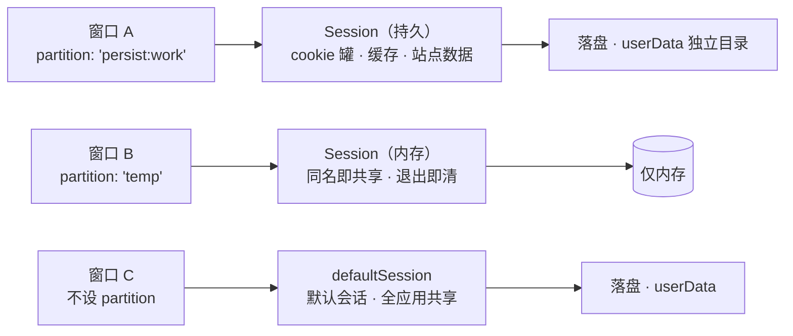

import { Canvas, Controls, Meta } from '@storybook/addon-docs/blocks';
import * as SessionCourse from './session.stories';

<Meta of={SessionCourse} name="Docs" />

# session 与存储

窗口背后还有一层「浏览器档案」：cookies、HTTP 缓存、localStorage / IndexedDB 这些数据不挂在窗口上，而是挂在**会话（session）**上。同一个会话可以被多个窗口共用，也可以用 partition 字符串拆成互不相干的几份。本课建立三个判断：**数据挂在会话上**——给窗口换分区后登录态「消失」，是隔离在生效，不是数据丢了；**`persist:` 前缀决定落盘**——带前缀的分区写磁盘、重启仍在，无前缀的分区只存内存、退出即清；**清理按层选择**——`clearCache` 只清缓存，站点数据与全量重置各有入口。读完你应能预测：给窗口换个 partition 会发生什么；cookies 怎么查、写、删；应用自己的数据该放在哪。



partition 的三种写法先收进一张参考表（默认值与官方文档核对，完整语义见参考资料）：

| partition 写法 | 得到的会话 | 数据落盘 | 重启后 |
| --- | --- | --- | --- |
| 不设 / `''` | `defaultSession`，全应用共享 | `userData` | 还在 |
| `'persist:work'` | 独立持久会话，同名分区共享 | 独立目录 | 还在 |
| `'temp'`（无 `persist:` 前缀） | 独立内存会话，同名分区共享 | 无 | 消失 |

本课管会话与存储本身；页面加载与导航事件见[webContents](?path=/docs/webcontents--docs)，在会话上注册自定义协议见[自定义协议](?path=/docs/custom-protocol--docs)。

## 快速上手

沿用「[安装](?path=/docs/install--docs)」以来一直在用的 Forge 项目，把窗口放进 `persist:work` 分区，写一条 cookie，用重启验证它真的落了盘，全程约 5 分钟。

打开 `src/index.js`，改成下面这样（`session` 要加进 `require('electron')` 的解构里）：

```js
const { app, BrowserWindow, session } = require('electron');
const path = require('node:path');

const createWindow = () => {
  const mainWindow = new BrowserWindow({
    width: 900,
    height: 620,
    webPreferences: {
      preload: path.join(__dirname, 'preload.js'),
      partition: 'persist:work', // 本课新增：窗口进入持久分区
    },
  });
  mainWindow.loadFile(path.join(__dirname, 'index.html'));
};

app.whenReady().then(async () => {
  // 相同 partition 返回同一个会话：这里拿到的就是窗口用的那份档案
  const ses = session.fromPartition('persist:work');

  // 每次启动先读：第一次读不到，重启后能读到上一次写入的那条
  const kept = await ses.cookies.get({ name: 'course' });
  console.log('上次留下的 cookie：', kept.map((c) => `${c.name}=${c.value}`));

  await ses.cookies.set({
    url: 'https://electronjs.org',
    name: 'course',
    value: 'persisted',
    // 有过期时间才是持久 cookie；省略 expirationDate 得到会话 cookie，重启即没
    expirationDate: Math.floor(Date.now() / 1000) + 3600,
  });

  createWindow();
});
```

`src/index.js` 属主进程，改完要在运行 start 的终端输入 `rs` 重启（见「[第一次运行](?path=/docs/first-run--docs)」）。逐次核对终端：

```text
# 第一次运行
上次留下的 cookie： []

# 重启之后
上次留下的 cookie： [ 'course=persisted' ]
```

重启后读到的是**上一次运行**写入的那条——落盘生效。对照实验：把两处 `'persist:work'` 都改成 `'temp'`，重启几次每次都是 `[]`——内存分区退出即清。改回即恢复。完整分区对照见本课目录的 `partition-windows.js`。

## 会话与分区

一个会话就是一整套浏览器档案：cookie 罐、HTTP 缓存、localStorage、IndexedDB、Service Worker 等站点数据都挂在它名下。这些数据不挂在窗口上，窗口只是「使用某个会话」的门面——会话的生命周期独立于任何单个窗口，关掉窗口档案还在，换掉窗口（分区）档案就换了一份。

`session` 模块只能在主进程使用；`Session` 类不从 `electron` 模块导出，拿到实例只有三个入口：

| 入口 | 用途 |
| --- | --- |
| `session.fromPartition(partition)` | 按分区字符串取会话，相同字符串返回同一个实例 |
| `session.defaultSession` | 取默认会话，`app` ready 之后才可用 |
| `win.webContents.session` | 只读：读出某个窗口实际在用的会话 |

**默认会话**是所有不设 partition 的窗口共享的那份档案。把它当「公共区域」看待：在默认会话上种 cookie、挂监听、设代理，影响的是全应用所有未分区窗口——想为某个业务单独定制时，先分一个区，再动会话。

### partition 分区

分区字符串的语义只有一条规则：**`persist:` 前缀决定落盘，分区名决定身份**。由此推出三条行为：

- **同名共享。** 窗口 A、窗口 B、主进程三处写 `'persist:work'`，`fromPartition` 返回的是同一个实例——一份 cookie 罐、一份站点数据。
- **带 `persist:` 前缀落盘。** 持久会话各有独立目录，重启后 cookie、登录态、localStorage 都还在。
- **无前缀只存内存。** `'temp'` 这样的内存会话行为与持久会话完全一致（同名也共享、也能种 cookie），只是不写磁盘：应用退出即全部消失，适合「访客」「无痕」窗口。

两个边界：`fromPartition` 的第二个参数 `options`（如 `cache: false`）只对**从未被用过**的分区生效，分区存在后再传会被忽略；另外 `session.fromPath(绝对路径)` 可以直接指定落盘位置创建持久会话，路径不是绝对路径会抛错，常规场景用 `persist:` 前缀就够。

下面的沙盘把这套规则并排呈现（真实 Electron 无法在浏览器里运行，这是对分区身份与落盘规则的模拟；真实代码见本课目录的 `partition-windows.js`）：

<Canvas of={SessionCourse.Interactive} />
<Controls of={SessionCourse.Interactive} />

| 读者操作 | 可观察证据 |
| --- | --- |
| A、B 都选 `persist:work` | 两扇窗口连进同一个罐，读数「共享 cookie 罐：是」 |
| 把 B 改成 `persist:play` | 出现第二个罐，「共享」变「否」——不同名分区互不相通 |
| 任一窗口选 `temp` | 对应罐标「仅内存 · 退出即清」 |
| 任一窗口选 默认会话 | 进入 `defaultSession`，落盘 userData、全应用共享 |
| 打开 Show code | 看到该 Canvas 实际执行的 `partition-sim.ts` |

`Session` 上还有一批成员，本课覆盖主线，其余给出处：

| 成员 | 职责 | 去向 |
| --- | --- | --- |
| `fromPartition` / `defaultSession` | 会话身份与落盘 | 本课「partition 分区」 |
| `cookies` | cookie 罐读写 | 本课「cookies」 |
| `clearCache` / `clearStorageData` / `clearData` | 清理 | 本课「清理缓存与站点数据」 |
| `setProxy` / `resolveProxy` | 会话代理 | 本课「代理与请求拦截」 |
| `webRequest` | 请求拦截 | 本课「代理与请求拦截」 |
| `getStoragePath` / `flushStorageData` | 落盘位置与落盘时机 | 本课「数据落在哪里」 |
| `protocol`（`protocol.handle`） | 注册自定义协议、服务本地资源 | 「自定义协议」课 |
| `setPermissionRequestHandler` / `setPermissionCheckHandler` | 决定摄像头、通知等权限请求放行与否 | [导航与弹窗控制](?path=/docs/navigation-control--docs) |
| `will-download` / `downloadURL` | 会话级下载入口 | 本手册暂不展开，需要控制下载时从这里入手 |
| `spellCheckerEnabled`、`extensions`、`serviceWorkers` | 拼写检查、扩展、SW 管理 | 高级主题，入门阶段不展开 |

## cookies

`ses.cookies` 是这个会话 cookie 罐的遥控器：查、写、删都是主进程侧的 `Promise` API。cookie 挂在会话上，所以分区隔离的第一道直观体验就在这里——`persist:work` 里 `get` 不到默认会话的 cookie，反之亦然。

### 查、写、删

```js
const { session } = require('electron');
const jar = session.fromPartition('persist:work').cookies;

// 查：filter 字段全部可选（url / name / domain / path / secure / session / httpOnly）
const kept = await jar.get({ name: 'course' });        // 按名字
const site = await jar.get({ url: 'https://electronjs.org' }); // 按站点
const all = await jar.get({});                          // 全部

// 写：url 必填，无效地址直接 reject
await jar.set({
  url: 'https://electronjs.org',
  name: 'token',
  value: 'secret',
  domain: '.electronjs.org', // 自动规范化为前导点：子域名也带上
  secure: true,
  httpOnly: true,
  expirationDate: Math.floor(Date.now() / 1000) + 7 * 24 * 3600,
});

// 删：url + name 定位一条
await jar.remove('https://electronjs.org', 'token');
```

`set` 的字段与默认值（与官方文档核对）：

| 字段 | 默认 | 说明 |
| --- | --- | --- |
| `url` | 必填 | cookie 挂在它对应的域下；无效地址（含 `file://` 这类无域名的）reject |
| `name` / `value` | `''` | |
| `domain` | `''` | 省略只对 `url` 的 host 生效；传入会被规范化为前导点，覆盖子域名 |
| `path` | `''` | |
| `secure` | `false` | `sameSite` 为 `no_restriction` 时默认 `true` |
| `httpOnly` | `false` | |
| `sameSite` | `'lax'` | |
| `expirationDate` | 省略 | UNIX 秒；**省略即会话 cookie**：只存内存，重启即没 |

可观察证据：`get` 返回的 `Cookie[]` 带 `session`（是否为会话 cookie）、`hostOnly`、`expirationDate` 字段，可直接核对刚才的写入。快速上手已经验证过持久 cookie 重启仍在；把 `expirationDate` 去掉再重启，`get` 就读不到了——会话 cookie 不跨重启，这是「记住登录态」必须带过期时间的原因。完整对照见本课目录的 `cookies-main.js`。

### 写盘时机与变化监听

cookie 落盘不是即时的：**每 30 秒或累计 512 次操作才写一次盘**。强杀进程可能丢掉最后一段；要确保落盘（比如刚写完登录凭据就退出）调用 `jar.flushStore()`。

cookie 罐还提供变化事件，适合监听登录态：

```js
jar.on('changed', (_event, cookie, cause, removed) => {
  // cause: explicit / overwrite / expired / evicted 等
  if (cookie.name === 'token' && removed) {
    /* 登录态失效，引导重新登录 */
  }
});
```

## 清理缓存与站点数据

清理按层选：HTTP 缓存、站点数据、全量各有入口，都是会话实例方法——清的只是「这个会话」的数据，其他分区不受影响。

### clearCache 与 clearStorageData

```js
const ses = session.fromPartition('persist:work');

// 只清 HTTP 缓存（页面资源副本），不动 cookie 与 localStorage
await ses.clearCache();

// 清站点数据：可按 origin 与类型限定；不传 options 则全部清掉
await ses.clearStorageData({
  origin: 'https://electronjs.org', // 按 scheme://host:port 形式给出
  storages: ['cookies', 'localstorage', 'indexdb'],
});
```

`storages` 可取值：

| 取值 | 对应数据 |
| --- | --- |
| `'cookies'` | cookie |
| `'localstorage'` | localStorage |
| `'indexdb'` | IndexedDB |
| `'cachestorage'` | Cache API（Service Worker 缓存） |
| `'serviceworkers'` | Service Worker |
| `'filesystem'` | FileSystem API |
| `'shadercache'` | 着色器缓存 |

可观察证据：清理前后 `cookies.get({})` 的数量对照——`clearCache` 后不变，`clearStorageData` 指定 `'cookies'` 后归零，本课目录的 `session-cleanup.js` 跑一遍就能看到；被清了 localStorage 的页面重载后回到初始状态。

### 更细与更全的清理

| 方法 | 清什么 |
| --- | --- |
| `clearCache()` | HTTP 缓存（页面资源副本） |
| `clearStorageData([options])` | 站点数据，可按 origin 与类型限定 |
| `clearData([options])` | 全量：`dataTypes` 含 cache、cookies、downloads、indexedDB、localStorage、serviceWorkers 等，可按 origins / excludeOrigins 限定；按 origin 清 cookie 时会清到可注册域级别 |
| `clearAuthCache()` | HTTP 认证缓存 |
| `clearCodeCaches(options)` | V8 代码缓存 |
| `flushStorageData()` | 把未落盘的 DOMStorage 数据立即写盘 |

## 数据落在哪里

应用专属的可写目录是 `app.getPath('userData')`——默认是系统应用数据目录（appData）下以应用名命名的子目录，macOS 上即 `~/Library/Application Support/应用名`。会话数据就落在这棵目录里：

- **默认会话**的数据直接放在 `userData` 下；
- **每个 `persist:` 分区**有独立目录，通行布局是 `userData/Partitions/<分区名>`；
- 确切位置不用猜：`ses.getStoragePath()` 直接返回绝对路径，内存分区返回 `null`（没有目录可写）。

localStorage、IndexedDB、cookie 文件都在会话目录里，由此得到两个实用结论：备份、迁移用户网页数据 = 退出应用后搬目录；「换分区保留数据」没有官方 API，本质也是搬目录。另外 DOMStorage 落盘有延迟（Chromium 异步批量写），关键时机调 `ses.flushStorageData()`，正常退出流程会写。

一条边界要划清：**应用自身的业务数据（设置项、用户文档）不要塞进 localStorage**。它属于「网页档案」，跟着会话走，还可能被 `clearStorageData` 一起清掉；应用数据的地盘是主进程往 `userData` 写文件（文件读写见[文件与对话框](?path=/docs/dialog-files--docs)，两边归属的完整取舍见[状态管理](?path=/docs/state-management--docs)）。

## 代理与请求拦截

这两个都是会话级全局设置：改的是「这个会话里所有窗口、所有请求」的行为。也因此有一条共同纪律——**赶在窗口发请求之前设置**。

### setProxy

```js
const ses = session.fromPartition('persist:work');

await ses.setProxy({
  mode: 'fixed_servers',
  proxyRules: 'http=127.0.0.1:8888,direct://',
  proxyBypassRules: 'localhost,127.0.0.1,<local>',
});

await ses.setProxy({ mode: 'direct' }); // 恢复直连
```

`config` 字段（格式与官方文档核对）：

| 字段 | 说明 |
| --- | --- |
| `mode` | `direct`（直连）/ `auto_detect`（WPAD 自动发现）/ `pac_script` / `fixed_servers` / `system`（系统代理）；给了 `pacScript` 默认 `pac_script`，否则给了 `proxyRules` 默认 `fixed_servers` |
| `proxyRules` | 协议=代理地址，分号分隔：`http=127.0.0.1:8888;ftp=foopy2`；**逗号是故障转移**（前一个失败换后一个） |
| `proxyBypassRules` | 逗号分隔的例外规则，支持通配与 `<local>`（本地地址） |
| `pacScript` | PAC 脚本 URL |

边界两条：换代理后旧连接可能被连接池复用，需要立即生效时调 `ses.closeAllConnections()`；验证代理是否生效的第一入口是 `resolveProxy(url)`，它返回该 URL 实际会走的代理。完整对照见本课目录的 `session-proxy.js`。

### webRequest 拦截请求

`webRequest` 挂在会话上，是「观察和改写这个会话所有网络流量」的代表能力：

```js
ses.webRequest.onBeforeRequest(
  { urls: ['*://ads.example.com/*'] },
  (details, callback) => {
    console.log('拦截：', details.url, `(${details.resourceType})`);
    callback({ cancel: true }); // 或 { redirectURL: 'https://...' } 改道
  },
);
```

- `filter.urls` 是 URL 匹配模式数组（`'*://*.example.com/*'`、`'<all_urls>'`），省略 filter 匹配所有请求；`details.resourceType` 区分 mainFrame、script、image、xhr 等。
- `callback` 必须调用：`cancel: true` 取消请求，`redirectURL` 把请求改道。
- **每个事件只有最后附加的监听器生效**（官方明示）：第二个注册同一事件的模块会静默顶掉第一个——多段逻辑要合并进同一个监听器。
- 同族成员：`onBeforeSendHeaders` 改请求头（callback 传 `requestHeaders`），`onHeadersReceived` 改响应头（注入 CSP 常用）。完整事件清单见参考资料。

完整对照见本课目录的 `web-request-hooks.js`。

## 最佳实践

- **多身份用 `persist:` 分区，不在默认会话里切换登录。** 每个业务域（多账户、自动化窗口、访客模式）一个分区：`persist:xxx` 跨重启保留，无前缀的内存分区当「无痕模式」用。默认会话当公共区域，不塞任何单一业务的登录态——改它影响所有未分区窗口。
- **清理按层选择，能限定 origin 就限定。** 只想省流量清缓存用 `clearCache`；「退出登录」用 `clearStorageData` 指定 `storages: ['cookies', 'localstorage']`；「重置网页状态」才 `clearData` 全清。全清是最伤用户的操作，别当成常规手段。
- **会话级配置赶在请求发生之前。** `webRequest` 监听与 `setProxy` 都在窗口 `loadFile` / `loadURL` 之前注册；`webRequest` 每个事件只有一个监听器生效，多处逻辑合并到一个监听器里，避免静默互相顶掉。
- **应用数据与网页档案分开放。** localStorage、IndexedDB 属于网页档案，跟着会话走、可能被清理 API 波及；应用设置等业务数据由主进程写 `userData` 下的文件，清站点数据时不受影响。

## 常见问题

- 给窗口换了 partition，登录态和页面数据「全丢了」
  这是隔离在生效，不是数据丢了：每个分区是独立档案，原分区的数据原样保留。处理：换回原分区即可找回；确需迁移只能搬会话目录（见「数据落在哪里」）或重新登录。
- 内存分区里写的 cookie / localStorage，重启后全没了
  没有 `persist:` 前缀的分区是内存会话，退出即清，设计如此。要跨重启，把分区名改成 `persist:` 开头，并保证应用正常退出（强杀可能丢未落盘的尾巴）。
- `cookies.set` 的 Promise reject 了
  先查 `url`：必填且必须是有效 http(s) 地址，`file://` 这类无域名地址不能种 cookie；再用 `get({ url })` 用同一个地址试查。`domain` 还必须覆盖 `url` 的 host，否则写入不生效。
- 明明注册了 `onBeforeRequest`，请求却没被拦
  每个事件只有最后附加的监听器生效——应用里其他模块（或模板代码）再注册过一次，就把你的顶掉了。处理：全局搜索同一事件名，把逻辑合并进一个监听器；并确认注册发生在窗口发起请求之前。
- localStorage 明明写成功了，偶发重启后丢失
  DOMStorage 是异步批量落盘，强杀或崩溃可能丢最后一段。处理：关键时机调 `ses.flushStorageData()`；真正重要的业务数据不存 localStorage（见「数据落在哪里」）。
- `clearCache` 清完，页面还是「有旧数据」
  `clearCache` 只清 HTTP 缓存；localStorage、IndexedDB 属于站点数据，要 `clearStorageData`（或 `clearData`），清完重载页面再验证。

## 总结回顾

摘要：

会话（session）是窗口背后的浏览器档案：cookie 罐、HTTP 缓存、localStorage、IndexedDB 都挂在会话上，窗口只是使用它的门面。`session` 模块只能在主进程用，`Session` 实例经 `fromPartition`、`defaultSession` 或 `webContents.session` 获得；不设分区的窗口共享默认会话，分区字符串用 `persist:` 前缀区分落盘（持久会话，独立目录）与内存（退出即清），同名分区共享同一份档案。cookies 经 `get`/`set`/`remove` 管理，`url` 必填，`expirationDate` 省略即会话 cookie，落盘每 30 秒或 512 次操作一次、`flushStore` 可立即写盘，`changed` 事件监听变化。清理分层：`clearCache` 只清 HTTP 缓存，`clearStorageData` 按 origin 与类型清站点数据，`clearData` 全量。数据落在 `userData`（默认会话）或分区的独立目录，确切位置用 `getStoragePath()` 读；应用自身业务数据不进 localStorage，由主进程写 `userData` 文件。`setProxy` 与 `webRequest` 是会话级全局设置，必须赶在窗口发请求之前配置，且 `webRequest` 每个事件只有最后一个监听器生效。

一句话：

> cookies、缓存与站点数据挂在会话上而不是窗口上：`persist:` 前缀决定落盘，同名分区共享同一份档案。

知识要点：

- session 是什么？窗口通过什么与它绑定？默认会话被谁共享？
- partition 的三种写法分别得到什么会话？`persist:` 前缀改变什么？
- cookies 怎么查、写、删？`expirationDate` 省略时 cookie 的寿命是什么？
- cookie 的落盘时机是什么？怎么立即写盘？怎么监听变化？
- `clearCache` 与 `clearStorageData` 各清什么？`storages` 能指定哪些类型？
- `persist:` 分区的数据落在哪个目录？怎么读到确切位置？
- `webRequest` 每个事件允许几个监听器？注册时机要注意什么？

## 参考资料

- [Electron API：session](https://www.electronjs.org/docs/latest/api/session)
  本课事实主来源：`fromPartition` 的 `persist:` 前缀规则与内存会话、`defaultSession`、`fromPath`、`clearCache` / `clearStorageData` / `clearData` 的签名与 `storages` 清单、`setProxy` 与 `setPermissionRequestHandler`、`getStoragePath` / `flushStorageData`。
- [Electron API：Cookies](https://www.electronjs.org/docs/latest/api/cookies)
  `get` / `set` / `remove` 语义、`set` 字段默认值（`url` 必填、`domain` 前导点规范化、`expirationDate` 省略即会话 cookie）、`flushStore` 的写盘时机（30 秒或 512 次操作）、`changed` 事件。
- [Electron API：ProxyConfig](https://www.electronjs.org/docs/latest/api/structures/proxy-config)
  `mode` 取值与默认推断、`proxyRules` 与 `proxyBypassRules` 的格式。
- [Electron API：WebRequest](https://www.electronjs.org/docs/latest/api/web-request)
  `onBeforeRequest` 的 filter 与 callback（cancel / redirectURL）、`resourceType` 清单、「每个事件只保留最后一个监听器」的规则。
- [Electron API：app](https://www.electronjs.org/docs/latest/api/app)
  `app.getPath('userData')` 的默认位置（appData 目录下以应用名命名的子目录）。
