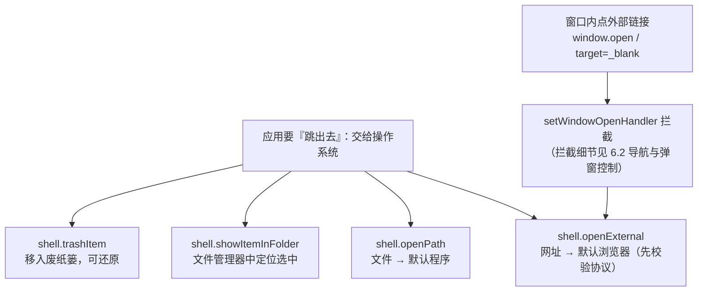

import { Meta } from '@storybook/addon-docs/blocks';

<Meta id="shell" title="原生能力/打开外部资源" name="Docs" />

# 打开外部资源

应用总有"跳出去"的时刻：点帮助文档要去浏览器、下载完成要打开文件、"删除"其实想给用户留条退路。这些动作在 Electron 里都归 `shell` 模块——它不自己实现"打开"，而是**把目标（URL 或路径）委托给操作系统**：网址交给默认浏览器、文件交给默认关联程序、删除交给系统的废纸篓。委托带来两条必须自己守住的纪律：一是安全——`shell.openExternal` 会把收到的字符串原样交给系统解释，官方安全清单明文警告不可信内容"可被利用执行任意命令"，所以**进入 openExternal 的 URL 要先过协议白名单**；二是判定——四个核心方法的"成败"表达形态各不相同（有的空串是成功、有的 reject 是失败、有的干脆没有返回值），判错写法就是静默失败。读完你应能预测：把用户提供的 `javascript:` 或 `file://` 字符串直接交给 openExternal 有多危险；`openPath` 返回空字符串意味着什么；同一份下载完成的文件，"打开"和"在文件夹中显示"分别调谁；窗口里点外部链接开出的新窗口，怎样转交给系统默认浏览器。



关键回查项（完整语义见正文与参考资料）：

| 回查项 | 方法 | 返回 | 一句话用途 |
| --- | --- | --- | --- |
| 模块进程 | 主进程 + 渲染进程 | — | **沙箱渲染进程不可用**；默认配置即沙箱，惯例经 IPC 收口主进程 |
| 打开网址 | `shell.openExternal(url[, options])` | `Promise<void>` | 交给默认浏览器 / 协议处理程序；**先过协议白名单** |
| 打开文件 | `shell.openPath(path)` | `Promise<string>` | 用默认程序打开；resolve 空串 = 成功，非空 = 错误信息 |
| 显示所在文件夹 | `shell.showItemInFolder(fullPath)` | `void`（同步） | 文件管理器中定位并选中该项 |
| 移入废纸篓 | `shell.trashItem(path)` | `Promise<void>` | 删除走系统废纸篓，可还原；失败 reject |
| 提示音 | `shell.beep()` | `void` | 播放系统提示音 |
| Windows 快捷方式 | `shell.writeShortcutLink()` / `readShortcutLink()` | `boolean` / `ShortcutDetails` | 读写 `.lnk` 文件，仅 Windows |

## 快速上手

沿用前面课程用 Forge 创建的项目（`src/index.js` + `src/preload.js` + `src/index.html`），三步接通「点按钮 → 默认浏览器打开官网 → 传危险字符串被拒绝」。完整参考实现（含 openPath / showItemInFolder / trashItem 与外部链接转交）在本课目录的 `shell-main.js` 与 `shell-preload.js`。

1. 在 `src/index.js` 收口并校验——校验只有这一份，且在可信边界内：

   ```js
   const { shell, ipcMain } = require('electron');

   // 安全清单第 15 条：不要用 openExternal 打开不可信内容。
   // 渲染端 / 用户提供的字符串，先解析协议，只放行 http/https。
   function isSafeForExternalOpen(raw) {
     try {
       const url = new URL(raw);
       return url.protocol === 'https:' || url.protocol === 'http:';
     } catch {
       return false; // 解析失败：不是合法 URL，一律拒绝
     }
   }

   ipcMain.handle('shell:open-external', (_event, raw) => {
     if (!isSafeForExternalOpen(raw)) {
       return { ok: false, reason: '不支持的协议，已拒绝打开' };
     }
     return shell.openExternal(raw).then(() => ({ ok: true }));
   });
   ```

2. 在 `src/preload.js` 包装成具名动词（原则见「[预加载脚本](?path=/docs/preload--docs)」）：

   ```js
   contextBridge.exposeInMainWorld('shellBridge', {
     open: (url) => ipcRenderer.invoke('shell:open-external', url),
   });
   ```

3. 在 `src/index.html` 的 `</body>` 之前放两个按钮：

   ```html
   <script>
     const open = (url) =>
       window.shellBridge.open(url).then((result) => {
         if (!result.ok) console.warn(`已拒绝：${url} —— ${result.reason}`);
       });
     const safe = document.createElement('button');
     safe.textContent = '打开 Electron 官网';
     safe.addEventListener('click', () => open('https://www.electronjs.org'));
     const danger = document.createElement('button');
     danger.textContent = '尝试打开 file:///etc/hosts';
     danger.addEventListener('click', () => open('file:///etc/hosts'));
     document.body.append(safe, danger);
   </script>
   ```

主进程改动要在运行 `npm start` 的终端输入 `rs` 重启（规则见「[第一次运行](?path=/docs/first-run--docs)」）。核对两个观察点：

- 点「打开 Electron 官网」→ 默认浏览器弹出 electronjs.org 标签页：URL 过了白名单后被委托给系统，用哪个浏览器、要不要切前台都由系统决定；
- 点「尝试打开 file:///etc/hosts」→ 浏览器纹丝不动，渲染端 DevTools 控制台打出「已拒绝」：协议不在白名单，`openExternal` 根本没被调用。

## shell：把"打开"交给操作系统

`shell` 的方法共享同一个形态：**给系统一个目标，由系统完成动作**。这个模型带来三个直接后果，写代码前先建立预期：

- **结果由用户的系统决定。** 同一行 `openExternal` 在不同机器上可能进 Chrome、Safari 或国产浏览器；`openPath` 打开的 PDF 用什么阅读器也是用户配的。应用只负责把目标递出去，不挑执行者。
- **返回不等于"用户看完了"。** 这些方法把目标交出去很快就返回，`showItemInFolder` 更是同步、无返回值。不要把"promise resolve 了"理解成"打开成功且用户已看到"。
- **成败判定形态不统一。** `openPath` 用 resolve 空串表示成功；`openExternal` / `trashItem` 失败走 reject；`showItemInFolder` 没有任何错误反馈。每个成员的判定写法见各小节。

进程归属上，官方标注是 Main + Renderer（non-sandboxed only），页面原文写明 *"While the shell module can be used in the renderer process, it will not function in a sandboxed renderer."*——而 Electron 从 20 起默认给渲染进程开沙箱，所以"直接在渲染端调 shell"在默认配置下本来就不工作。惯例保持简单：**shell 意图一律经 preload + IPC 收口主进程**（进程与通道设计见「[进程模型](?path=/docs/process-model--docs)」「[IPC 概念](?path=/docs/ipc-basics--docs)」）。

表中后三行是只服务特殊场景的成员：`beep()` 播放系统提示音，无参数无返回；`writeShortcutLink(shortcutPath[, operation], options)` 写 `.lnk` 快捷方式，`operation` 取 `create`（默认，不存在则新建）/ `update`（只更新给定字段，要求已存在）/ `replace`（整体覆盖，要求已存在），`readShortcutLink(shortcutPath)` 读回 `ShortcutDetails`，出错直接抛异常——需要桌面快捷方式集成时查参考资料，本课不展开。

### 打开网址 openExternal

`shell.openExternal(url)` 把 URL 交给操作系统，系统按**协议**路由到默认处理程序：`https:` / `http:` 进默认浏览器，`mailto:` 进邮件客户端，自定义协议进注册了它的应用。反方向的注册——让自己的应用能被外部唤起——见「[深链与单实例](?path=/docs/deep-links--docs)」。

```js
const { shell } = require('electron'); // 主进程

await shell.openExternal('https://www.electronjs.org');
```

可选 `options` 两个平台各有一个（完整清单见参考资料）：

| options | 平台 | 默认值 | 作用 |
| --- | --- | --- | --- |
| `activate` | macOS | `true` | 是否把打开的应用带到前台 |
| `workingDirectory` | Windows | — | 打开操作的工作目录 |
| `logUsage` | Windows | `false` | 标记为用户主动启动，供系统统计常用程序 |

**URL 校验是调用前的必做动作。** openExternal 的输入不限于网页地址——系统按协议路由，`file:`、`smb:` 乃至安装过的自定义协议都可能被解释成启动某个程序。官方安全清单第 15 条的原话是 *"When openExternal is used with untrusted content, it can be leveraged to execute arbitrary commands."*，反面示例就是 `shell.openExternal(USER_CONTROLLED_DATA_HERE)`。唯一防线在调用前——解析协议、白名单放行：

```js
// 校验怎么写：用 new URL() 解析后比较 protocol
function isSafeForExternalOpen(raw) {
  try {
    const url = new URL(raw);
    return url.protocol === 'https:' || url.protocol === 'http:';
  } catch {
    return false;
  }
}
```

判断写法的要点：**不要做字符串开头匹配**——`raw.startsWith('https://example.com')` 挡不住 `https://example.com.attacker.com`（这个坑出自安全清单第 13 条讲导航的段落，这里是同一个判断）；需要进一步限定域名时比较 `parsedUrl.origin`。可观察证据见快速上手的两个按钮：`https://` 放行进浏览器，`file:///etc/hosts` 被拒且不触碰 openExternal。

两条边界：URL 在 Windows 上最长 2081 字符；协议没有注册任何处理程序时，常见结果是 promise reject 或系统弹"选择应用"，用户机器上的处理程序你无法预知，失败分支要接住。

### 打开文件 openPath

`shell.openPath(path)` 用系统默认关联程序打开一个文件——这回答的是"交给别人看"，而应用内读取、解析文件是「[文件与对话框](?path=/docs/dialog-files--docs)」加 Node fs 的领域。它是 Electron 里少见的"用 resolve 传错误"的 API：

```js
const error = await shell.openPath(exportedFile);
if (error) {
  console.error('打开失败：', error); // 非空字符串 = 错误信息
}
```

**空字符串才是成功，非空就是错误信息**——它不抛错也不 reject，判错写法（`try/catch` 或不判返回值）会让失败静默。可观察证据：对一个不存在的路径调用，控制台打出 resolve 回来的错误文本而不是异常栈。路径是目录时同样交给系统处理，macOS 上通常在 Finder 中展开该目录（文档未明文，按通行行为表述）。

与 `showItemInFolder` 的区分证据放在一起看：下载完成的通知上通常并排两个动作——「打开」走 `openPath`，文件进关联程序（PDF 阅读器、图片查看器），用户看到**内容**；「在文件夹中显示」走 `showItemInFolder`，文件管理器弹出、目标文件被选中，用户看到**位置**。两者操作同一个文件、结果不同。

### 在文件夹中显示 showItemInFolder

`shell.showItemInFolder(fullPath)` 在文件管理器中显示该项，官方措辞是 *"if possible, select the file"*——显示并尽量选中。它是同步方法、没有返回值，也没有任何错误反馈，路径不存在时的行为依系统而定。所以适合的场景是**路径可信且刚验证过**：刚导出的报表、刚下载完成的文件——调用前你自己掌握着"这个文件刚被我写出来"的事实，出错兜底也由你顺手做。

```js
const path = require('node:path');
const { shell } = require('electron'); // 主进程

shell.showItemInFolder(path.resolve(app.getPath('downloads'), 'report.csv'));
```

两条边界：参数名 `fullPath` 就是提醒——传完整绝对路径，别拿相对路径赌工作目录；它是"锦上添花"型动作，别把关键流程的成败押在它的执行结果上，它没有结果可押。

### 移入废纸篓 trashItem

`shell.trashItem(path)` 把文件移入系统废纸篓（macOS 废纸篓 / Windows 回收站 / Linux 桌面环境的回收位置），**可还原**。删除用户产生的数据时，它是默认选择而不是 `fs.unlink`：unlink 不可逆，误删没有退路；trashItem 留了废纸篓这层安全垫。

```js
const path = require('node:path');
const { shell } = require('electron'); // 主进程

try {
  // 官方提示：路径使用平台默认分隔符，拼接时用 path.resolve 兜底
  await shell.trashItem(path.resolve(userDataPath, 'old-export.csv'));
} catch (error) {
  console.error('移入废纸篓失败：', error); // 失败以 reject 表达
}
```

三条边界：路径要用平台默认分隔符（尤其手动拼 Windows 路径时），官方建议 `path.resolve` 生成绝对路径；目标不存在等错误以 reject 出现，用 `try/catch` 接住；废纸篓的物理清理、跨卷移动由系统负责，应用不追踪"文件现在在废纸篓的哪里"。

## 外部链接：window.open 的去处

渲染端 `window.open` 与 `target="_blank"` 的链接会请求创建新窗口。Electron 的默认行为是在底层为它配一个新的 `BrowserWindow`——这就是"应用里点个外链，又开出一个自己的窗口"的来源。webContents 在创建新窗口前会先经过你注册的 window open handler，官方文档说它 *"has final say"*——主进程在这里有一票否决权，`{ action: 'deny' }` 直接取消这次创建。

放行的去处就是本课主角——拦截之后转交 `shell.openExternal`：

```js
// 主进程：应用内不开外部内容的新窗口，http(s) 目标交给系统默认浏览器
win.webContents.setWindowOpenHandler(({ url }) => {
  if (isSafeForExternalOpen(url)) {
    // 官方安全清单第 14 条的示例写法：setImmediate 让拦截先返回，再发起打开
    setImmediate(() => shell.openExternal(url));
  }
  return { action: 'deny' };
});
```

分工边界一句话：**handler 负责"拦"，shell 负责"放行的去处"**。`setWindowOpenHandler` 的完整签名与返回值、`will-navigate` 导航拦截、权限请求——这些"拦"的机制全貌见「[导航与弹窗控制](?path=/docs/navigation-control--docs)」；本课给的是链路的最后一环：页面点链接 → handler 拦下（应用内不再开新窗口）→ 校验协议 → `openExternal` 交给默认浏览器。

## 最佳实践

- **渲染端的 shell 意图一律经 IPC 收口主进程。** 沙箱渲染进程里 shell 本来就不可用（默认配置即沙箱）；收口同时让 URL 校验只有一份、且落在可信边界内（通道设计见「[双向调用](?path=/docs/ipc-invoke--docs)」）。
- **进入 openExternal 的 URL 先过协议白名单（http / https）。** 用 `new URL()` 解析后比 `protocol` / `origin`，不做字符串开头匹配；解析失败一律拒绝。
- **删除用户数据默认 `trashItem`，不用 `fs.unlink`。** 可还原是删除类操作的安全垫；unlink 留给应用自己的临时文件这类可再生产物。
- **「打开」与「在文件夹中显示」各司其职。** 下载 / 导出完成的两个动作分别绑 `openPath` 与 `showItemInFolder`，别用一个方法硬凑两种结果。
- **应用内不开外部内容的新窗口。** `setWindowOpenHandler` 一律 `{ action: 'deny' }`，http(s) 目标校验后转交 `shell.openExternal`（拦截机制见「导航与弹窗控制」）。

## 常见问题

- `openPath` 明明失败了（文件不存在），代码却没有报错
  它不抛错也不 reject——失败信息以 resolve 值返回。用 `const error = await shell.openPath(p); if (error) ...` 判定，空串才是成功。
- 测试 `openExternal` 时系统弹"选择应用程序"，或打开了意料之外的程序
  该协议在用户机器上没有默认处理程序，或 URL 未校验被系统按别的协议解释了。处理：只放行 http / https 白名单，失败分支接住 reject；自定义协议要有注册的处理方（反向注册见「[深链与单实例](?path=/docs/deep-links--docs)」）。
- 应用里点外部链接，开出了一个又一个 Electron 窗口
  `window.open` 的默认行为是在应用内创建新 `BrowserWindow`。注册 `setWindowOpenHandler`：一律 `return { action: 'deny' }`，http(s) 目标校验后转交 `shell.openExternal`（见「外部链接」）。
- 渲染进程里调 shell 方法没有任何反应
  沙箱渲染进程不支持 shell（官方原文 *"it will not function in a sandboxed renderer"*），而 Electron 默认开启沙箱。把调用挪到主进程，渲染端经 preload + IPC 触发。
- `trashItem` 报错或行为异常
  常见原因是路径不存在或分隔符形态不对（尤其手动拼 Windows 路径时）。用 `path.resolve` 生成绝对路径再传入；错误在 promise reject 里，用 `try/catch` 接住。

## 总结回顾

摘要：

shell 的模型是"把'打开'委托给操作系统"：`openExternal` 递 URL、`openPath` 递文件路径、`showItemInFolder` 递定位目标、`trashItem` 递待删项，用哪个浏览器、哪个程序、废纸篓长什么样都由用户的系统决定；返回只代表目标已交出，不代表用户看完了。委托的两道关要自己守：安全上，`openExternal` 前必须用 `new URL()` 解析协议、白名单放行 http/https（安全清单第 15 条：不可信内容可被利用执行任意命令；第 13 条的 `startsWith` 坑同样适用），`openExternal` 还支持 `activate`（macOS）、`workingDirectory` / `logUsage`（Windows）；判定上，`openPath` 用 resolve 空串表示成功、失败返回错误信息文本，`trashItem` 失败走 reject、路径要用平台分隔符，`showItemInFolder` 同步且无任何错误反馈，三者形态各不相同。进程归属是 Main + Renderer（non-sandboxed only），沙箱渲染端不可用，惯例经 IPC 收口主进程。窗口内的外部链接默认会在应用内开出新的 `BrowserWindow`，惯例是 `setWindowOpenHandler` 一律 deny、http(s) 目标校验后 `setImmediate(() => shell.openExternal(url))` 转交默认浏览器——"拦"的全貌在导航与弹窗控制，本课是放行后的去处。

一句话：

> shell 只负责把目标交给操作系统，选哪个程序由用户的系统决定；你能守住的是两道关——进 openExternal 的 URL 先过协议白名单，每个方法的成败判定形态逐个核对。

知识要点：

- shell 的"委托"模型意味着什么？返回值能说明什么、不能说明什么？
- 为什么 openExternal 必须校验 URL？官方安全清单怎么表述这个风险？校验怎么写、为什么不比字符串开头？
- openExternal 有哪些 options？Windows 上 URL 有什么限制？
- openPath 的返回值怎么判成功？它与 showItemInFolder 在"下载完成"场景各对应哪个动作？
- trashItem 与 fs.unlink 怎么取舍？路径有什么要求？失败从哪里读？
- 渲染端能直接调 shell 吗？沙箱约束和惯例的收口方式是什么？
- 窗口内点外部链接的默认行为是什么？转交默认浏览器的链路有哪几步？拦截机制在哪门课？

## 参考资料

- [Electron API：shell](https://www.electronjs.org/docs/latest/api/shell)
  Process 标注（Main, Renderer non-sandboxed only）与沙箱渲染端不可用的原文、`openExternal` 签名 / options（`activate` / `workingDirectory` / `logUsage`）/ Windows 2081 字符上限、`openPath` 的 `Promise<string>` 返回语义、`showItemInFolder` 的 "if possible, select the file"、`trashItem` 的平台废纸篓与 `path.resolve` 提示、`beep`、`writeShortcutLink` 的 `operation` 取值与 `readShortcutLink` 抛异常。
- [Electron 教程：Security](https://www.electronjs.org/docs/latest/tutorial/security)
  第 15 条 "Do not use shell.openExternal with untrusted content"（可被利用执行任意命令）与正反示例、第 14 条 "Disable or limit creation of new windows" 的 `setWindowOpenHandler` + `setImmediate` + `shell.openExternal` 官方示例、第 13 条用 URL 解析比较 `origin`（`startsWith` 挡不住 `https://example.com.attacker.com`）。
- [Electron API：window.open](https://www.electronjs.org/docs/latest/api/window-open)
  `window.open` 与 `BrowserWindow` 的配对关系、`setWindowOpenHandler` *"has final say"* 的定位、`{ action: 'deny' }` 取消窗口创建的语义。
