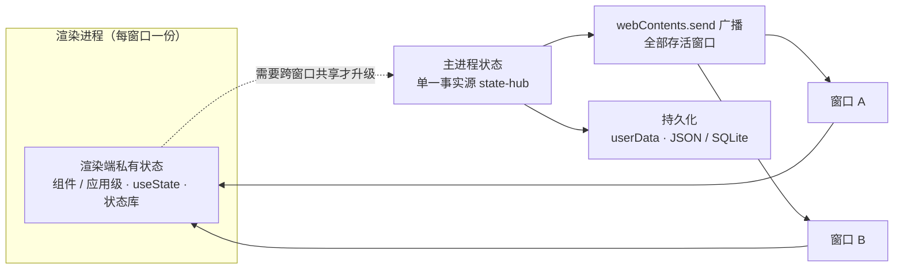

import { Canvas, Controls, Meta } from '@storybook/addon-docs/blocks';

import * as StateStories from './state-management.stories';

<Meta of={StateStories} name="Docs" />

# 状态管理

「[React 集成](?path=/docs/react-integration--docs)」和「[Vue 集成](?path=/docs/vue-integration--docs)」把工程与 IPC 封装搭好了，本课回答它们留下的问题：应用的状态放在哪、怎么同步、怎么活过重启。Electron 应用里「状态管理」没有统一库的答案——每个窗口是独立进程，窗口背后还有一个主进程，同一份状态天然可能散在三处。所以先做分类再做选择：**按「谁产生、谁消费、活多久」给每份状态找归属**，归属定了，管理方式只剩两三种。

三个判断先行：

- **单窗口内的状态是普通前端问题。**组件 state、应用级状态库都在渲染进程内部运转，Electron 不改变它们的任何规则。
- **需要跨窗口共享「当前值」的状态，收敛到主进程成为单一事实源。**框架的任何共享机制都跨不过进程边界；主进程经 `webContents.send` 广播变更，「[主进程推送](?path=/docs/ipc-push--docs)」的时序结论在这里全部适用。
- **要活过重启的状态，由主进程落到 `userData`。**localStorage 是网页档案，不是应用数据的地盘（「[session 与存储](?path=/docs/session--docs)」已定下这条边界）。

读完你应能预测：窗口 A 改了状态而窗口 B 没反应，问题出在哪个归属；窗口刷新后状态为什么「倒退」、靠什么接住；重启之后哪些状态应该在、哪些丢了是正常的。



| 归属 | 典型状态 | 放在哪 | 怎么同步 | 重启后 |
| --- | --- | --- | --- | --- |
| 渲染端私有 | 表单草稿、选中项、侧栏折叠 | 组件或渲染端状态库 | 不需要跨进程 | 丢失（也不该保留） |
| 主进程持有（内存） | 任务进度、实时连接、进行中的会话 | 主进程 state-hub | invoke 拉快照 + send 广播 | 丢失（要保留见下一行） |
| 主进程持有（持久） | 登录态、应用配置、用户偏好、业务数据 | 主进程状态 + userData 落盘 | 同上，变更时写盘 | 保留 |

## 快速上手

沿用「[React 集成](?path=/docs/react-integration--docs)」的 React + Vite 工程（Vue 读者用 9.3 的工程对应替换消费层，主进程侧与框架无关），给主进程加一个持有「昵称」状态的 state-hub，用两个窗口验证「改一处、处处同步」，全程约 10 分钟。

1. 新建 `src/state-hub.ts`（完整文件见本课目录 `state-hub.ts`）：

   ```ts
   import { BrowserWindow, ipcMain } from 'electron';
   import type { AppState } from './api';

   // 主进程持有的状态：所有窗口共享的唯一事实源
   let state: AppState = { nickname: '未命名' };

   // 广播：遍历存活窗口逐个 send（getAllWindows 是框架维护的存活清单）
   function broadcastState(): void {
     for (const win of BrowserWindow.getAllWindows()) {
       win.webContents.send('state:changed', state);
     }
   }

   export function initStateHub(): void {
     ipcMain.handle('state:get', (): AppState => state); // 读：返回快照
     // 写：唯一写者，改完立即广播新值
     ipcMain.handle('state:set-nickname', (_event, nickname: string): AppState => {
       state = { ...state, nickname };
       broadcastState();
       return state;
     });
   }
   ```

2. 主进程接线 `src/main.ts`（窗口创建的其余部分保持模板原样）：

   ```ts
   import { initStateHub, pushStateSnapshot } from './state-hub';

   app.whenReady().then(() => {
     initStateHub(); // 注册两个 handle

     createWindow();
     // 验证用：临时开两个窗口（正式的多窗口管理见「多窗口」一课）
     createWindow();
   });

   // createWindow 内、加载调用之前加一行：
   //   win.webContents.on('did-finish-load', () => pushStateSnapshot(win));
   ```

3. `src/api.ts` 类型真源加成员，`src/preload.ts` 实现端补齐（`satisfies` 对账不变；订阅惯例同 3.3：listener 进、取消订阅函数出）：

   ```ts
   // src/api.ts
   export interface AppState {
     nickname: string;
   }

   export interface Api {
     // ……原有成员
     getState: () => Promise<AppState>;
     setNickname: (nickname: string) => Promise<AppState>;
     onStateChanged: (listener: (state: AppState) => void) => () => void;
   }
   ```

   ```ts
   // src/preload.ts
   getState: () => ipcRenderer.invoke('state:get'),
   setNickname: (nickname: string) => ipcRenderer.invoke('state:set-nickname', nickname),
   onStateChanged: (listener) => {
     const handler = (_event, state: AppState) => listener(state);
     ipcRenderer.on('state:changed', handler);
     return () => ipcRenderer.removeListener('state:changed', handler);
   },
   ```

4. 渲染端一个组件，初始拉快照、增量订广播（`useIpcEvent` 是 9.2 的 hook）：

   ```tsx
   // src/renderer/StateCard.tsx
   import { useEffect, useState } from 'react';

   import type { AppState } from '../api';
   import { useIpcEvent } from './use-ipc-event';

   export function StateCard() {
     const [state, setState] = useState<AppState>({ nickname: '…' });

     // 初始快照用拉的：挂载时拉一次
     useEffect(() => {
       window.api.getState().then(setState);
     }, []);

     // 之后的增量用推的：广播到达就覆盖本地副本
     useIpcEvent(window.api.onStateChanged, setState);

     return (
       <section>
         <p>当前昵称：{state.nickname}</p>
         {/* 修改只发意图：写动作收敛在主进程 */}
         <button onClick={() => window.api.setNickname(`用户-${Date.now() % 1000}`)}>
           换一个昵称
         </button>
       </section>
     );
   }
   ```

`npm start`，三个观察点：

- 任一窗口点「换一个昵称」，**两个窗口同时更新**——`state:changed` 广播到了每个存活窗口；
- 刷新其中一个窗口（`Cmd+R`）：昵称**不回退**到「未命名」——`did-finish-load` 补推的快照接住了刷新后的窗口；
- 重启应用：昵称回到「未命名」——状态至今只在内存里，活过重启是「持久化」一节的事。

## 状态放在哪一侧

归属用三个问题判定，按顺序问：**谁产生它**——事件源只在页面里（输入、选中、滚动），还是在主进程一侧或系统（定时器、下载、网络、生命周期）？**谁消费它**——只有当前窗口关心，还是任何窗口都该答得上「现在是多少」？**活多久**——比页面短、跨刷新跨窗口，还是跨重启？三问的答案组合直接落到开场表的某一行的「放哪」一列。两个容易误判的位置单独说明。

### 渲染端私有状态

产生与消费都发生在同一窗口页面内的状态——表单草稿、选中项、输入框即时校验、侧栏折叠——就是普通前端问题：组件级用 `useState`，应用级用状态库（Zustand、Pinia）。状态库解决的是渲染端内部的组织与共享问题，属前端主题，本手册不展开；它们不感知进程边界，Electron 也不改变其任何规则。

Electron 只加两条边界：

- **「全局」store 只是单窗口全局。**每个窗口是独立渲染进程、各自加载一份打包产物，模块级单例在每个窗口各有一份实例——两个窗口的 Zustand/Pinia store 互不相通。这不是 bug，是「[进程模型](?path=/docs/process-model--docs)」的必然结果。
- **刷新即丢。**页面上下文随导航重建，一切内存状态归零。要跨刷新或跨重启，升级为主进程状态与持久化话题（下两节）。

第一条约束可以立刻核对：下面的沙盘把同步方式切到「渲染端私有」，无论窗口 A 改多少次，窗口 B 永远停在 0。

### 跨窗口共享收敛主进程

真正需要跨窗口共享的状态只有两条路：

- **渲染端互发。**「[渲染进程间通信](?path=/docs/ipc-between-renderers--docs)」的窗口间通道（主进程中转 / MessagePort）传递的是**一次性事件**：没有「当前值」的概念，新加入或刷新后的窗口拿不到历史，每扇窗口各自维护的副本必然漂移。
- **收敛主进程。**把「当前值」放进主进程，读走 `invoke`、变更走广播（下一节）。

选择标准一句话：**事件可以直发，状态要收敛。**「保存完成」「有新版本」这类一次性通知走窗口直发没问题；凡是带「当前值」语义、任何窗口都该答得上「现在是多少」的状态，收敛到主进程单一事实源。

## 单一事实源

主进程状态不需要框架，就是一个普通模块：`let state` 持有数据、两个 `handle` 分管读与写、一次 `send` 广播。把快速上手的具体例子抽象成通式：

```ts
// 单一事实源的最小骨架（完整实现见本课目录 state-hub.ts）
let state = loadInitialState();            // 主进程持有，模块内唯一可写
ipcMain.handle('state:get', () => state);  // 读：返回快照
ipcMain.handle('state:set', (_e, patch) => {
  state = applyPatch(state, patch);
  broadcast('state:changed', state);       // 写：改完立即广播新值
  return state;
});
```

形态简单，纪律有三条，缺一条都会退化成多副本漂移：

| 纪律 | 内容 | 防的问题 |
| --- | --- | --- |
| 唯一写者 | 改状态的代码只在主进程，渲染端只发意图（`invoke`） | 双写者互相覆盖；主进程单线程，写逻辑串行进入，冲突天然消失 |
| 广播带值不带指令 | payload 是变更后的状态，不是「把 X 改成 Y」的命令；窗口收到就覆盖本地副本 | 命令式消息要每扇窗口自己重放，重放遗漏或顺序错乱都造成漂移 |
| 渲染端副本只读 | 窗口里那份数据永远是副本，界面操作只产生修改意图 | 窗口改了本地副本却没人广播，其他窗口与重启后的世界对不上 |

广播是状态的默认形态：主题、语言、登录用户这类全员关心的值，一次变更全员到达。只与单一窗口相关的东西（该窗口自己的草稿）本来就不该进主进程；确有「只通知某一个窗口」的状态变更，用「[主进程推送](?path=/docs/ipc-push--docs)」的定向 `send` 照写即可，不与本节的广播冲突。

## 快照与广播

广播 fire-and-forget、不排队、无送达保证（3.3 的结论原样适用）：它只负责「**之后有更新**」，回答不了「**当前是多少**」。所以主进程状态的同步永远是两件事的组合：**初始快照 + 增量广播**。

### 初始快照与增量订阅

渲染端的标准形态就两行：

```tsx
useEffect(() => { window.api.getState().then(setState); }, []); // 初始快照：拉
useIpcEvent(window.api.onStateChanged, setState);               // 增量：订
```

Vue 侧同构：`onMounted` 拉快照，composable 订阅（9.3 的对应物）。为什么初始必须拉：让快照也走广播，等于要求「订阅先于一切推送」的时序完美——晚开的窗口、刷新的窗口、崩溃后重建的窗口都会错过历史广播。拉取没有时序要求，什么时候进来了什么时候拉，这正是 3.3 「初始用拉、增量用推」在状态语境下的样子。

### 迟到窗口与刷新

三种迟到者——晚开的窗口、刷新的窗口、崩溃恢复的窗口——错过增量是同一个原因：广播不补发。接法也统一：**页面每次加载完成，主进程补推一次快照**。`did-finish-load` 门控在状态同步里的身份就是「快照补推」：

```ts
win.webContents.on('did-finish-load', () => pushStateSnapshot(win));
```

每次导航完成都会再触发，刷新场景免费覆盖；页面异步初始化复杂时改用就绪信号——页面订阅完成后 `invoke` 一声，主进程收到再补推（3.3 的做法三）。下面的沙盘把三种同步方式并排呈现（真实 Electron 无法在浏览器里运行，这里模拟的是同步规则的时序结果）：

<Canvas of={StateStories.Interactive} />
<Controls of={StateStories.Interactive} />

| 操作 | 可观察证据 |
| --- | --- |
| 同步方式切「渲染端私有」 | 窗口 B 永远是 0，读数「两窗口一致：否」 |
| 切「广播（无快照）」，B 从不刷新 | 两窗口一致，B 的值来源是「启动以来的广播」 |
| 同模式下把「窗口 B 重新加载」切到「第 2 次修改后」 | B 落后 2 次——刷新丢掉了之前的广播，且没有任何机制补齐 |
| 切「快照 + 广播」 | B 任意时刻加入都追平，来源读数变为「刷新后先拉快照，再接广播」 |
| 打开 Show code | 看到该 Canvas 实际执行的 `state-sync-sim.ts` |

## 持久化

重启后仍在的状态由主进程负责落盘。先分数据，再选容器：

| 数据 | 例子 | 容器 | 特点 |
| --- | --- | --- | --- |
| UI 偏好 | 主题、窗口大小、侧栏折叠 | userData 下的 JSON（electron-store） | 小、键值、丢了无碍；写穿或防抖 |
| 应用配置 | 服务地址、快捷键映射 | 同上，配 schema 校验与默认值 | 小、需要默认值与版本迁移 |
| 业务数据 | 任务列表、下载记录、账号数据 | SQLite（或主进程托管的结构化文件） | 可查询、量大、需要事务 |

落盘位置都是「[session 与存储](?path=/docs/session--docs)」定下的 `app.getPath('userData')`（macOS 即 `~/Library/Application Support/应用名`）——那里本来就是应用数据的地盘。

**容器一：JSON 文件（手写或 electron-store）。**手写就是 `fs` 读写一个 JSON，最小依赖。不想自己处理原子性与校验，用 [electron-store](https://github.com/sindresorhus/electron-store)：默认把数据存在 `userData/config.json`，`get` / `set` / `onDidChange` 直接可用，支持 JSON Schema 校验、默认值与迁移；值必须 JSON 可序列化。它的边界官方写得直白：这不是数据库，每次变更都重写整个文件，数据到 1MB 量级就会变慢，大数据换 SQLite。它是原生 ESM 包，主进程直接 `import`。

**容器二：SQLite。**结构化、可查询、有事务的业务数据用它；常用的 better-sqlite3 属原生模块，打包与重构建的处理见「[原生模块](?path=/docs/native-modules--docs)」一课。

**写盘时机。**用户显式动作（改设置）写穿即可；连续变化（窗口位置、未发送的草稿）防抖，或在 `app` 的 `before-quit` / `will-quit` 里做最后落盘——崩溃不保证走到退出流程，重要数据别攒到退出才写。

一条边界 5.2 已立，这里只收口：localStorage、IndexedDB 是网页档案，跟会话分区走、可能被 `clearStorageData` 一并清掉——应用数据不进 localStorage。

可观察证据：快速上手的观察点 3（重启回「未命名」）就是「只在内存」的对照；给 state-hub 换成 electron-store 读写，重启后昵称保留——同一个示例立刻变成持久状态。

## 最佳实践

- **能放渲染端的不上 IPC。**选中项、输入草稿、折叠状态这些只在单窗口内存活的状态留在状态库；把整个 store 搬进主进程，等于让每次按键都跨一次进程，把前端问题变成通信问题。主进程只持业务事实与跨窗口状态。
- **事件直发，状态收敛。**一次性通知走窗口直发（3.4 的通道）；带「当前值」语义的状态一律收敛主进程。判断标准就一句：任何窗口都该答得上「现在是多少」的，是状态。
- **广播带值，小状态全量、大集合加版本。**广播的是变更后的值，窗口无条件覆盖本地副本；列表级的大状态改用增量字段加版本号防乱序，避免一条迟到消息把新数据覆盖回旧值。
- **持久化收敛主进程单写者。**渲染端不直接写文件；偏好与配置用 electron-store 或 JSON 写穿，业务数据 SQLite。多窗口各自写同一份文件是典型的双写者问题，收敛到主进程后天然消失。

## 常见问题

- 窗口 A 改了状态，窗口 B 纹丝不动
  状态是渲染端私有（或只对 A 定向推送），B 根本不在更新路径上。处理：把「任何窗口都该看到」的状态收敛进主进程 state-hub，用 `getAllWindows()` 广播（见「单一事实源」）；沙盘的「渲染端私有」模式可以核对同一现象。
- 刷新后窗口的状态「倒退」成旧值
  只有广播没有快照：刷新丢掉了之前收到的所有广播，之后只接增量。处理：`did-finish-load` 补推快照，或窗口加载完成后主动 `invoke` 拉一次（见「迟到窗口与刷新」）；沙盘「广播（无快照）」加刷新就是该现象。
- 重启后状态全丢了
  状态停在内存，从没落过盘。处理：变更时写 `userData`（electron-store 或 JSON），启动时读回来当初始状态；localStorage 不是替代方案（见下一条）。
- 存进 localStorage 的设置偶发消失，或换了个会话分区就没了
  localStorage 属于网页档案：跟会话分区走，可能被 `clearStorageData` 一并清掉。处理：应用配置迁到主进程的 `userData` 存储（「[session 与存储](?path=/docs/session--docs)」的「数据落在哪里」）。
- 两个窗口先后改同一个值，后提交的丢了
  双写者：窗口各自持有可写副本并各自写盘。处理：写动作收敛到主进程——渲染端只 `invoke` 意图，主进程单线程串行落地，副本次次经广播覆盖（见「单一事实源」的三条纪律）。

## 总结回顾

摘要：

Electron 应用的状态先按「谁产生、谁消费、活多久」找归属。单窗口内产生与消费的是渲染端私有状态，组件 state 与状态库照常工作，但「全局单例」只在单窗口内成立、刷新即丢；需要跨窗口共享「当前值」的状态收敛到主进程单一事实源——渲染端只发意图，主进程是唯一写者，改完经 `webContents.send` 把变更后的值广播给全部存活窗口，窗口的副本只读；同步靠「初始快照拉 + 增量广播订」，晚开、刷新、崩溃恢复的窗口由 `did-finish-load` 补推快照接住；要活过重启的再由主进程落 `userData`——偏好与配置用 JSON / electron-store，业务数据 SQLite，写盘动作收敛在主进程，localStorage 是网页档案、不是应用数据的地盘。

一句话：

> 先给状态找归属——单窗口的留在渲染端，跨窗口的收敛主进程，跨重启的落到 userData；事件可以直发，状态要收敛。

知识要点：

- 归属三问是什么？三类形态分别放在哪、怎么同步？
- 为什么渲染端状态库的「全局单例」跨不过窗口边界？
- 单一事实源的三条纪律是什么？写冲突为什么会消失？
- 广播为什么必须配初始快照？三种迟到窗口靠什么接住？
- 广播消息该带「变更后的值」还是「操作指令」？为什么？
- UI 偏好、应用配置、业务数据分别用什么容器持久化？落在哪个目录？
- electron-store 的默认位置与适用边界是什么？
- 为什么应用数据不进 localStorage？

## 参考资料

- [Electron API：webContents](https://www.electronjs.org/docs/latest/api/web-contents)（`send` 的单向推送语义：无响应、不排队、无送达保证）
- [Electron API：BrowserWindow](https://www.electronjs.org/docs/latest/api/browser-window)（`getAllWindows()` 返回全部存活窗口）
- [Electron API：ipcMain](https://www.electronjs.org/docs/latest/api/ipc-main)（`handle` 的请求响应语义）
- [Electron API：app](https://www.electronjs.org/docs/latest/api/app)（`getPath('userData')` 的默认位置、`before-quit` / `will-quit` 事件）
- [electron-store](https://github.com/sindresorhus/electron-store)（默认存 `userData/config.json`、`get` / `set` / `onDidChange`、值须 JSON 可序列化、「不是数据库」的适用边界与 1MB 量级提示、原生 ESM）
- [Zustand](https://github.com/pmndrs/zustand)（渲染端状态库代表，属前端主题）
- [Pinia](https://pinia.vuejs.org/zh/)（Vue 官方状态库，属前端主题）
