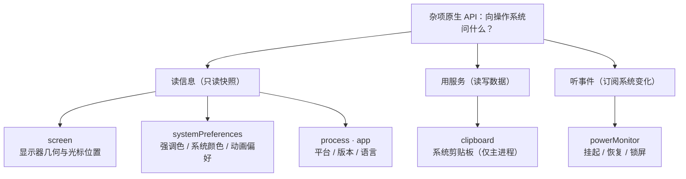

import { Canvas, Meta } from '@storybook/addon-docs/blocks';

import * as SystemApisStories from './system-apis.stories';

<Meta of={SystemApisStories} name="Docs" />

# 系统信息与剪贴板

本课聚合 Electron 里一组"杂项"原生 API：`clipboard` 用系统剪贴板服务读写数据，`screen` 问显示器的几何与变化，`systemPreferences` 读系统偏好（强调色、系统颜色、动画偏好），`powerMonitor` 订阅挂起/恢复等系统级事件，`process` 与 `app` 提供平台、版本、语言等只读快照。它们彼此独立，但共享同一个判断入口：**先看官方文档的 Process 标注再决定代码写在哪端**——`clipboard`、`screen`、`systemPreferences`、`powerMonitor` 都标注为主进程模块，`screen` 还明文要求等 app `ready` 之后才能用；渲染进程要用，就走 preload + IPC 让主进程代劳。剪贴板的核心模型是「一块剪贴板、多种格式并存：write 整体替换、read 按格式取用」；screen 的核心模型是「坐标是 DIP、`bounds` 之外还有 `workArea`、显示器会消失」。读完你应能预测：writeHTML 之后 `readText()` 返回什么、外接显示器拔掉后恢复的窗口会不会跑到屏幕外、系统强调色怎么拿、深色模式该问谁、系统睡眠再唤醒时应用从哪里知道。



关键回查项（完整语义见正文与参考资料）：

| 回查项 | 进程归属 | 何时可用 | 一句话用途 |
| --- | --- | --- | --- |
| `clipboard` | 仅主进程 | 任意时刻 | 读写系统剪贴板：多格式并存，write 整体替换 |
| `screen` | 仅主进程 | `ready` 之后 | 显示器枚举与几何、光标位置、显示器变化事件 |
| `systemPreferences` | 主进程 | 任意时刻 | 强调色、系统颜色、动画偏好（深色模式走 nativeTheme） |
| `powerMonitor` | 仅主进程 | `ready` 之后 | 挂起/恢复、电源、锁屏等系统级事件 |
| `process` | 主进程 + 渲染进程 | 任意时刻 | 只读快照：platform / arch / versions / type 等 |

## 快速上手

沿用前面课程用 Forge 创建的项目（`src/index.js` + `src/index.html`，见「[安装](?path=/docs/install--docs)」）。把下面四段代码放进 `app.whenReady().then(...)` 里——`screen` 与 `powerMonitor` 都要求 ready（进程归属见「[进程模型](?path=/docs/process-model--docs)」）：

```js
// src/index.js —— app.whenReady() 内
const { app, clipboard, screen, powerMonitor } = require('electron');

app.whenReady().then(() => {
  // ① 只读快照：平台与运行时版本
  console.log('[进程]', process.platform, process.arch, 'Electron', process.versions.electron);
  console.log('[系统] OS 版本:', process.getSystemVersion());

  // ② 屏幕：主显示器信息
  const primary = screen.getPrimaryDisplay();
  console.log('[屏幕]', screen.getAllDisplays().length, '块显示器，主屏缩放', primary.scaleFactor);

  // ③ 剪贴板：写入并读回
  clipboard.writeText('来自 Electron 的文本');
  console.log('[剪贴板]', clipboard.readText());

  // ④ 电源：系统从睡眠恢复时刷新外部数据
  powerMonitor.on('resume', () => console.log('[电源] 系统已恢复，刷新外部数据'));
});
```

1. 在运行 start 的终端输入 `rs` 重启（主进程改动，规则见「[第一次运行](?path=/docs/first-run--docs)」）。
2. 逐项核对：

   - **终端打出四段信息**——`darwin arm64`（或 `win32 x64` 等）、OS 版本、显示器数量与缩放、剪贴板读回的文本：只读信息在 `ready` 之后一次就能问全；
   - **到别的应用里 `Cmd+V`**（Windows/Linux 为 `Ctrl+V`）——粘出「来自 Electron 的文本」：剪贴板是全系统共享的，同进程读回只验证写入，跨应用粘贴才是真正的可观察证据；
   - **合盖再开**（或触发系统睡眠）——终端出现 `[电源] 系统已恢复`：powerMonitor 的 `resume` 来自系统级挂起/恢复，不是应用自己的事件。

## 剪贴板 clipboard

### 概念与归属：主进程里的一块系统共享剪贴板

系统剪贴板是操作系统提供、所有应用共享的一块数据区。Electron 的 `clipboard` 模块官方定位是 modeled after the W3C Clipboard API（仿 W3C 剪贴板建模），但归属要注意：现行官方文档对它的 Process 标注是**仅主进程**。渲染进程要用剪贴板，两条路——Web 标准的 `navigator.clipboard`，或经 IPC 让主进程代劳（见本节「必要边界」）。

模型一句话：**一块剪贴板、多种格式并存**。`write` 系列可以带文本、HTML、RTF、图片、书签的任意组合；每次写入**整体替换**之前的全部内容；每种格式配对一个 `read` 方法，读不存在的格式返回空。判断「写了读不到」的问题，几乎都出在把"一块剪贴板"当成了"一个字符串"。

### 最小表达：writeText / readText 往返

```js
const { clipboard } = require('electron'); // 主进程

clipboard.writeText('周报 v2：系统信息与剪贴板');
clipboard.readText(); // => '周报 v2：系统信息与剪贴板'
```

写多种格式用 `write` 载荷，字段与读取一一对应（完整载荷见参考资料 clipboard API）：

| `write` 载荷字段 | 写入的格式 | 对应读取 | 读取返回 |
| --- | --- | --- | --- |
| `text` | `text/plain` | `readText()` | 字符串；缺格式为 `''` |
| `html` | `text/html` | `readHTML()` | 字符串；缺格式为 `''` |
| `rtf` | `text/rtf` | `readRTF()` | 字符串；缺格式为 `''` |
| `image` | 位图 | `readImage()` | `NativeImage` 实例，用 `isEmpty()` 判断有无 |
| `bookmark`（`{ title, url }`） | 书签 | `readBookmark()` | `{ title, url }` |
| — | 清空 | `clear()` | — |

两个元信息方法：`availableFormats()` 列出当前存有的全部格式（如 `text/html`、`text/plain`），`has(format)` 判断某个格式在不在。

### 可观察证据：多格式模型（本页模拟）

下面的模拟在浏览器里复现这套规则（真实 Electron 无法在浏览器运行）：左列是写入操作，右列是读取操作，中间是剪贴板存储的可视化，读数区实时显示三个读取 API 的返回值。

<Canvas of={SystemApisStories.Interactive} />

| 操作 | 可观察证据 |
| --- | --- |
| 点 `write({ html })`，再点 `readText()` | `readText()` 返回 `''`（text/plain 未写入）：格式之间不自动转换 |
| 点 `readHTML()` | 返回写入的 HTML：read 按格式取用 |
| 点 `write({ text, html })` | 两种格式并存，`availableFormats()` 同时列出 |
| 再点 `writeText('周报 v2')` | 只剩 text/plain：write 整体替换，上一次的 html 被换掉 |
| 点 `clear()` | 存储清空，所有读取返回空 |
| 打开 Show code | 看到该 Canvas 实际执行的 `clipboard-sim.ts` |

### 必要边界：渲染端、Linux selection 与敏感数据

渲染端两条路怎么选：

- **跨应用的系统剪贴板数据**（读用户复制的内容、写出去给别的应用用）——主进程 `clipboard` 是权威实现；渲染端经 preload + IPC 代劳，通道与动词设计见「[预加载脚本](?path=/docs/preload--docs)」与「[IPC 概念](?path=/docs/ipc-basics--docs)」；
- **页面内的纯 Web 剪贴板交互**（复制页面选区）——渲染端可直接用 `navigator.clipboard`。边界：它受 Chromium 权限模型约束——`writeText` 在文档聚焦时通常可用，`readText` 常见结果是返回空串或抛 NotAllowedError，除非用 `session.setPermissionRequestHandler` 放行 `clipboard-read` 权限（此细节按 Chromium 通行行为表述，官方 clipboard 文档未展开）。

其余三条：

- **Linux X11 的 primary selection**——X11 有"选中即复制"的副剪贴板，读写方法可选传 `type: 'selection'`；`clipboard` / `selection` 两块独立，Windows/macOS 无此概念；
- **图片走 NativeImage**——`writeImage(nativeImage)` / `readImage()`；`nativeImage.createFromPath` / `fromDataURL` 负责构造，`toDataURL` / `toPNG` 负责转出；
- **剪贴板是全系统共享的**——别把敏感数据留在里面，用完 `clear()`（快速上手第 ③ 步若换成密码，这就是必做动作）。

## 屏幕 screen

### 概念与归属：ready 之后才能问的显示器几何

`screen` 回答"显示器长什么样、光标在哪、显示器什么时候变了"。官方明文：This module cannot be used until the `ready` event is emitted——`ready` 之前调用不可用，所以查询与监听一律放进 `app.whenReady().then(...)`（见快速上手的位置约定）。能力分两类：

- **查询**——`getAllDisplays()` 全部显示器、`getPrimaryDisplay()` 主显示器、`getCursorScreenPoint()` 光标位置、`getDisplayNearestPoint(point)` 离点最近的显示器、`getDisplayMatching(rect)` 与矩形相交面积最大的显示器；
- **订阅**——`display-added` / `display-removed` / `display-metrics-changed`，显示器插拔与指标变化时触发（见本节末尾）。

### Display 对象：bounds 与 workArea

每个 `Display` 是一个描述显示器的普通对象，高频字段（完整清单见参考资料 Display Object）：

| 字段 | 含义 | 要点 |
| --- | --- | --- |
| `id` | 显示器标识 | 跨事件稳定，用于识别"同一块屏" |
| `label` | 显示器名称 | 系统给的可读名字 |
| `bounds` | 显示器矩形 | **DIP 单位**，含系统区域 |
| `size` | 显示器尺寸 | 同 `bounds` 的宽高 |
| `workArea` | 可视工作区 | 去掉任务栏 / Dock / 菜单栏后的可用矩形 |
| `workAreaSize` | 工作区尺寸 | 同 `workArea` 的宽高 |
| `scaleFactor` | 缩放比 | 物理像素 / DIP；视网膜屏上 > 1 |
| `rotation` | 旋转角 | `0` / `90` / `180` / `270` |
| `internal` | 是否内建屏 | 区分笔记本屏与外接屏 |
| `touchSupport` | 触控支持 | `available` / `unavailable` / `unknown` |

最重要的判断：**`bounds` 是含系统区域的整块屏幕，`workArea` 才是应用窗口该待的地方**。窗口摆放一律对 `workArea` 计算，别对 `bounds`。

### 最小表达：找回窗口该在的显示器（恢复窗口位置）

「记住窗口位置、下次启动恢复」是 screen 的经典场景，标准动作两步：用保存的 bounds 找回显示器，再把 bounds 夹进该显示器的工作区：

```js
// app.whenReady() 内；saved 是上次退出时存下的 { x, y, width, height }
function restoreBounds(saved) {
  // 第 1 步：与旧矩形相交面积最大的显示器，就是它"原来"所在的屏
  const display = screen.getDisplayMatching(saved);
  // 第 2 步：夹进该显示器的工作区——显示器可能被拔掉、改过分辨率
  const area = display.workArea;
  const width = Math.min(saved.width, area.width);
  const height = Math.min(saved.height, area.height);
  const x = Math.min(Math.max(saved.x, area.x), area.x + area.width - width);
  const y = Math.min(Math.max(saved.y, area.y), area.y + area.height - height);
  return { x, y, width, height };
}
```

可观察证据：把窗口挪到副屏、退出重开——窗口回到副屏原位；**拔掉副屏再重开**——`getDisplayMatching` 落到主屏、尺寸位置被夹进主屏工作区，窗口不会漂到屏幕外。没有第 2 步的夹取，就是"窗口恢复到看不见的地方"这个经典 bug 的来源。

### 显示器变化事件

显示器配置是动态的：外接屏插拔、改缩放比、改分辨率都会触发事件：

```js
// app.whenReady() 内
screen.on('display-added', (_event, display) => {
  console.log('[屏幕] 接入显示器', display.id, display.bounds);
});
screen.on('display-removed', (_event, display) => {
  console.log('[屏幕] 移除显示器', display.id);
});
screen.on('display-metrics-changed', (_event, display, changedMetrics) => {
  // changedMetrics 形如 ['bounds'] 或 ['displayScaleFactor']
  console.log('[屏幕] 指标变化', display.id, changedMetrics);
});
```

可观察证据：插拔外接显示器、在系统设置里改缩放，运行 start 的终端逐条打出事件与变化的指标名；保存窗口位置的应用在这里监听 `display-removed` 重新夹取窗口。

### 必要边界：DIP 坐标与屏幕捕获的归属

- **坐标统一是 DIP**——screen 的所有位置尺寸与 BrowserWindow 的 bounds 同一坐标系；物理像素 = DIP × `scaleFactor`，视网膜屏上别把 `bounds.width` 当像素数。DIP 与物理像素的换算方法见参考资料 screen API；
- **屏幕内容捕获不在这里**——`desktopCapturer` 是另一套 API，见「[屏幕捕获](?path=/docs/desktop-capture--docs)」；`systemPreferences.getMediaAccessStatus` 相关的摄像头/麦克风授权也在那门课的范畴。

## 系统偏好与进程信息

### systemPreferences：强调色、系统颜色与动画偏好

`systemPreferences` 读系统级偏好状态，主进程模块。常用成员：

| 成员 | 平台 | 用途 |
| --- | --- | --- |
| `getAccentColor()` | 全平台 | 系统强调色，十六进制色值字符串；配 `accent-color-changed` 事件（Windows/Linux）跟随变化 |
| `getColor(color)` | Windows / macOS | 命名系统色；配 `color-changed` 事件（Windows） |
| `getSystemColor(color)` | macOS | macOS 命名系统色 |
| `getAnimationSettings()` | 全平台 | 系统"减弱动态效果"类动画偏好，语义对应 Web 的 prefers-reduced-motion |

macOS 还有一组深度集成成员：`getUserDefault` / `setUserDefault` 读写系统 defaults、`subscribeNotification` / `postNotification` 挂 NSNotificationCenter 回调、`getEffectiveAppearance()` 读外观设置——需要平台级集成时查参考资料，本课不展开。

判断一条：**深色模式不走这里**。跨平台的深浅色判断用 `nativeTheme.shouldUseDarkColors`，见「[深色模式](?path=/docs/dark-mode--docs)」；网上老代码里的 `systemPreferences.isDarkMode` 在现行文档中已不存在，搜到别照抄。

### process：平台、版本与本进程快照

`process` 是 Node.js process 对象的 Electron 扩展，主进程与渲染进程都有，随时可读。高频成员：

| 成员 | 含义 | 典型用途 |
| --- | --- | --- |
| `process.platform` | `'darwin'` / `'win32'` / `'linux'` | 平台分支（菜单模板里的 `isMac` 就是它） |
| `process.arch` | `'arm64'` / `'x64'` 等 | 原生依赖 / 二进制分支 |
| `process.type` | `'browser'` / `'renderer'` / `'worker'` / `'utility'` | 判断这段代码跑在哪个进程 |
| `process.versions.electron` / `.chrome` / `.node` | 三层运行时版本 | 诊断日志、按版本开关特性 |
| `process.getSystemVersion()` | 操作系统版本字符串 | 诊断日志（快速上手 ① 用过） |
| `process.resourcesPath` | 资源目录 | 定位随包资源 |
| `process.getProcessMemoryInfo()` / `getCPUUsage()` | 内存 / CPU 读数 | 自建性能面板、诊断上报 |

两点边界：沙箱渲染进程只暴露 `process` 的一个小子集，诊断类成员（内存、CPU）别指望在渲染端调；进程归属的完整地图见「[进程模型](?path=/docs/process-model--docs)」。`app` 模块上还有应用视角的系统信息——`app.getLocale()` / `app.getLocaleCountryCode()` 给界面语言与地区（i18n 初始化用），崩溃与日志场景的系统环境采集见「[日志与崩溃收集](?path=/docs/logging-crashes--docs)」。

## 电源与系统事件 powerMonitor

### 概念与归属：订阅"整个系统"发生了什么

`powerMonitor` 是主进程的事件源，回答"系统级发生了什么"：挂起、恢复、电源切换、锁屏。官方示例把监听注册放在 `app.whenReady()` 之后——按 ready 后可用对待，位置约定与 screen 一致。它与「[应用生命周期](?path=/docs/app-lifecycle--docs)」里 app 自己的事件分工明确：`powerMonitor` 说的是**整个操作系统**的状态，不是本应用的。

### 最小表达：挂起前保存、恢复后刷新

```js
// app.whenReady() 内
const { powerMonitor } = require('electron');

powerMonitor.on('suspend', () => saveDraft());        // 系统即将睡眠（合盖等）
powerMonitor.on('resume', () => refreshRemoteData()); // 系统从睡眠恢复
powerMonitor.on('lock-screen', () => blurSensitiveUI()); // 锁屏时遮罩敏感内容
powerMonitor.on('unlock-screen', () => restoreUI());
```

可观察证据：快速上手第 ④ 步——合盖再开（或触发系统睡眠）终端出现 `[电源] 系统已恢复`。`resume` 里最值得做的是刷新易过期资源：网络连接、登录态、服务端数据、系统时钟都可能在睡眠期间过期。

### 事件与方法回查表

| 名称 | 触发 | 平台 |
| --- | --- | --- |
| `suspend` / `resume` | 系统即将挂起 / 从挂起恢复 | 全平台 |
| `on-ac` / `on-battery` | 接通 / 断开外部电源 | macOS / Windows |
| `shutdown` | 系统即将关机或重启 | Linux / macOS |
| `lock-screen` / `unlock-screen` | 锁屏 / 解锁 | macOS / Windows |
| `user-did-become-active` / `user-did-resign-active` | 会话活跃 / 失活 | macOS |
| `thermal-state-change` / `speed-limit-change` | 热状态变化 / 系统降速 | macOS（speed-limit-change 亦 Windows） |
| `getSystemIdleState(idleThreshold)` | 闲置判定，返回 `'active'` / `'idle'` / `'locked'` / `'unknown'` | — |
| `getSystemIdleTime()` | 系统闲置秒数 | — |
| `isOnBatteryPower()` | 当前是否用电池供电 | — |

### 必要边界：锁屏不是挂起，系统事件不是应用事件

- **三组状态别混**——挂起（`suspend`/`resume`）是系统睡眠；锁屏（`lock-screen`/`unlock-screen`）是会话锁定，睡眠不触发；关机（`shutdown`）另有事件。测试 `resume` 要真的让系统睡下去，只锁屏是等不来的；
- **平台限定看表**——`on-ac` / `on-battery` 与锁屏事件不在 Linux 上触发，Linux 的电源管理走不同的系统机制；
- **应用内事件不在其上**——窗口关闭、应用退出是 app 与窗口的事件（见「[应用生命周期](?path=/docs/app-lifecycle--docs)」），`powerMonitor` 只管系统级。

## 最佳实践

- **先看 Process 标注，再决定代码写在哪端。** `clipboard` / `screen` / `systemPreferences` / `powerMonitor` 都是主进程模块；渲染端需要时经 preload + IPC 代劳，别为省事开 nodeIntegration。
- **查询系统状态一律放进 `app.whenReady().then(...)`。** `screen` 是明文约束，`powerMonitor` 按官方示例对待；统一放 ready 之后最省心。
- **剪贴板 text 与 html 一起写。** `clipboard.write({ text, html })` 让接收方（编辑器、聊天框、文档）按需取格式；只写 html 的代码在纯文本接收方那里等于什么都没写。
- **恢复窗口位置用 `getDisplayMatching` + `workArea` 夹取。** 显示器会消失、分辨率会变，裸恢复旧坐标就是"窗口跑到屏幕外"的 bug。
- **`resume` 里刷新易过期资源。** 网络、登录态、服务端数据、时钟都可能在睡眠期间过期，恢复后重新拉一遍再继续。
- **敏感数据用完清剪贴板。** 剪贴板是全系统共享的，密码、令牌类内容写出去后尽快 `clipboard.clear()`。

## 常见问题

- `clipboard.writeHTML(...)` 之后 `readText()` 返回空字符串
  剪贴板按格式存取、格式间不自动转换：只写了 text/html，text/plain 就是空的。要两种都可用就 `clipboard.write({ text, html })` 一起写（对照本页模拟）。
- `screen.getPrimaryDisplay()` 报错，或 `powerMonitor` 收不到事件
  调用发生在 `ready` 之前。把查询与监听挪进 `app.whenReady().then(...)`（screen 是官方明文约束）。
- 恢复窗口位置时窗口跑到屏幕外
  保存的 bounds 对应的显示器可能已被拔掉或改了分辨率。用 `screen.getDisplayMatching(saved)` 找回显示器，再把 bounds 夹进该显示器的 `workArea`（见「最小表达」）。
- 渲染进程里 `require('electron').clipboard` 拿不到，或 `navigator.clipboard.readText()` 返回空串、抛 NotAllowedError
  前者是沙箱约束——`clipboard` 是主进程模块，渲染端经 preload + IPC 代劳；后者是 Chromium 权限模型在把关，需要时用 `session.setPermissionRequestHandler` 放行 `clipboard-read`。
- `suspend` / `resume` 一直不触发
  这组事件对应系统级睡眠与唤醒；锁屏触发的是 `lock-screen` / `unlock-screen`，是另一组事件。测试要真的让系统睡眠（合盖或系统菜单睡眠）。
- 深色模式判断该用哪个 API
  跨平台用 `nativeTheme.shouldUseDarkColors`，见「[深色模式](?path=/docs/dark-mode--docs)」；`systemPreferences` 管强调色、系统颜色、动画偏好，老代码里的 `systemPreferences.isDarkMode` 已不存在。
- 想给窗口/系统加"打开链接、打开文件"之类的动作
  那是 `shell` 的范畴，见「[打开外部资源](?path=/docs/shell--docs)」；系统通知与角标见「[通知与角标](?path=/docs/notifications--docs)」。

## 总结回顾

摘要：

本课的杂项 API 共用一个判断入口——官方文档的 Process 标注：`clipboard` / `screen` / `systemPreferences` / `powerMonitor` 都是主进程模块，`screen` 明文要求 `ready` 之后可用，`powerMonitor` 按官方示例同样放在 `ready` 后，渲染端要用的答案是 preload + IPC。剪贴板的模型是「一块系统共享剪贴板、多种格式并存」：`write` 载荷（text / html / rtf / image / bookmark）整体替换全部内容，`readText` / `readHTML` / `readRTF` / `readImage` / `readBookmark` 按格式取用、缺格式返回空，`availableFormats()` 与 `has()` 查元信息，`clear()` 清空。screen 在 `ready` 后提供显示器查询（`getAllDisplays` / `getPrimaryDisplay` / `getCursorScreenPoint` / `getDisplayNearestPoint` / `getDisplayMatching`）与插拔事件；`Display` 的关键区分是 `bounds`（整块屏）与 `workArea`（应用可摆区），坐标是 DIP；恢复窗口位置的标准动作是 `getDisplayMatching` + `workArea` 夹取。systemPreferences 读强调色、系统颜色与动画偏好，深色模式另走 nativeTheme。`process` 给平台、架构、三层版本与诊断读数的只读快照，`process.type` 标明代码跑在哪个进程。powerMonitor 订阅系统级电源与会话事件（`suspend` / `resume` / `on-ac` / `on-battery` / `lock-screen` / `shutdown`），挂起、锁屏、关机三组状态互不等价。

一句话：

> 杂项 API 先看 Process 标注再落代码——剪贴板多格式并存、write 整体替换、read 按格式取用；屏幕问 ready 之后的 workArea；深色模式问 nativeTheme；系统事件交给 powerMonitor。

知识要点：

- 五组模块各自属于哪个进程？哪些必须等 app `ready`？渲染端要用时怎么走？
- 剪贴板的多格式模型是什么？`write` 载荷字段与 `read*` 方法怎么对应？为什么 writeHTML 之后 readText 是空？
- `availableFormats()`、`has()`、`clear()` 各在什么场景用？Linux 的 `type: 'selection'` 是什么？
- `Display` 的 `bounds` 与 `workArea` 差在哪？恢复窗口位置的标准两步是什么？显示器插拔监听哪个事件？
- `systemPreferences` 能读哪些偏好？深色模式为什么不去问它？
- `process` 有哪些只读快照？`process.type` 与 `process.getSystemVersion()` 各什么用？
- `powerMonitor` 的挂起、锁屏、电源事件怎么区分？`resume` 之后通常做什么？
- 系统事件与应用事件的边界在哪里？屏幕捕获、打开外部资源、通知分别属于哪门课？

## 参考资料

- [Electron API：clipboard](https://www.electronjs.org/docs/latest/api/clipboard)
  Process 标注（仅主进程）、全部读写方法与 `write` 载荷字段、多格式语义（缺格式返回空）、`availableFormats()` / `has()` / `clear()`、Linux `type: 'selection'`、仿 W3C Clipboard API 的官方定位。
- [Electron API：screen](https://www.electronjs.org/docs/latest/api/screen)
  "cannot be used until the `ready` event" 原文、查询方法（getAllDisplays / getPrimaryDisplay / getCursorScreenPoint / getDisplayNearestPoint / getDisplayMatching）、显示器事件与 `changedMetrics`、DIP 换算方法。
- [Display Object](https://www.electronjs.org/docs/latest/api/structures/display)
  `bounds` / `workArea` / `scaleFactor` / `rotation` / `internal` / `label` 等字段定义与 DIP 单位说明。
- [Electron API：systemPreferences](https://www.electronjs.org/docs/latest/api/system-preferences)
  `getAccentColor()` / `getColor()` / `getSystemColor()` / `getAnimationSettings()`、`accent-color-changed` / `color-changed` 事件、macOS 专属成员（defaults、NotificationCenter、effectiveAppearance）清单。
- [Electron API：powerMonitor](https://www.electronjs.org/docs/latest/api/power-monitor)
  事件清单与平台限定（suspend / resume / on-ac / on-battery / shutdown / lock-screen 等）、`getSystemIdleState()` / `getSystemIdleTime()` / `isOnBatteryPower()`、官方 `whenReady` 示例位置。
- [Electron API：process](https://www.electronjs.org/docs/latest/api/process)
  `process.type` 取值、`versions`、`getSystemVersion()`、`resourcesPath`、内存 / CPU 诊断方法与沙箱渲染端的子集说明。
- [Electron API：app](https://www.electronjs.org/docs/latest/api/app)
  `app.getLocale()` / `app.getLocaleCountryCode()` 等应用侧系统信息方法。
