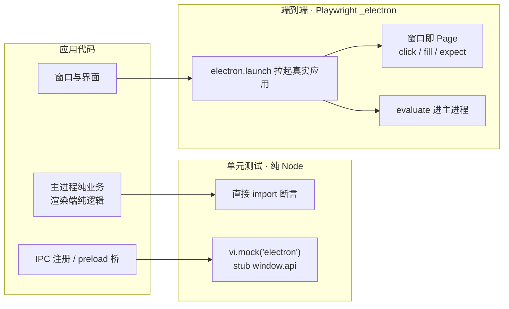

import { Meta } from '@storybook/addon-docs/blocks';

<Meta id="testing" title="工程化/测试" name="Docs" />

# 测试

Electron 应用的测试分层跟着进程边界走：**能在纯 Node 里复现的逻辑，用单元测试直接测，`electron` 模块和 `window.api` 是这一层被 mock 的边界；必须有真实进程才能回答的问题（桥是否接通、窗口交互、原生对话框、IPC 全链路），交给 Playwright 的 `_electron` 拉起真实应用来测**——它自己启动 Electron 进程，第一个窗口在 Playwright 眼里就是普通页面，主进程状态可以用 `evaluate` 钻进去断言。两条链路工具独立、配置独立、可并存。

本课沿用「[接入 TypeScript](?path=/docs/typescript-setup--docs)」的 Forge + Vite + TS 工程：`package.json` 的 `main` 指向 `.vite/build/main.cjs`，`window.api` 按 `Api` 接口命名。被测进程的日志落点与启动排查规律见「[调试](?path=/docs/debugging--docs)」，进程归属的判断依据见「[进程模型](?path=/docs/process-model--docs)」。读完你应能预测：单测文件跑在纯 Node 里，直接 `import 'electron'` 会挂、mock 后通过；`electron.launch({ args: ['.'] })` 拉起的是构建产物而非 dev server；`firstWindow()` 返回的 Page 能直接 `click` / `expect`；测试里点「打开文件」弹不出系统对话框，要先把它替换成固定返回值。



| 层 | 回答什么问题 | 工具 | 入口 |
| --- | --- | --- | --- |
| 单元测试 | 函数逻辑对不对 | Vitest（或 Jest） | `import` 被测模块；mock `electron` 与 `window.api` |
| 端到端 | 真应用能不能用：桥、窗口、原生交互、全链路 | Playwright `_electron` | `electron.launch()` → `firstWindow()` / `evaluate()` |

## 快速上手

最小闭环：装依赖、写一个 6 行的 e2e、跑起来看到「窗口真的打开了」。

```bash
# runner 与 _electron 都在 @playwright/test 里（它依赖 playwright 包）
npm i -D @playwright/test
```

```ts
// tests/app.spec.ts —— 被测应用必须能独立启动（vite-ts 工程见「被测应用用哪个产物」）
import { expect, test, _electron as electron } from '@playwright/test';

test('窗口能打开并显示标题', async () => {
  const electronApp = await electron.launch({ args: ['.'] });
  const window = await electronApp.firstWindow();
  await expect(window).toHaveTitle('我的应用');
  await electronApp.close();
});
```

```bash
npx playwright test
```

三个观察点：

- 输出里该用例 passed——期间有一个真实的 Electron 进程被拉起（macOS 的 Dock 会闪现应用图标），`close()` 后退出；
- 没有写任何配置也能跑：runner 默认按 `.*(test|spec)\.(js|ts|mjs)` 递归发现用例，TypeScript 原生支持；
- 把 `args` 改成一个不存在的目录再跑，`launch` 阶段就超时失败——launch 的对象是进程本身，不是页面 URL。

## 单元测试

分界标准一句话：**这件事在纯 Node 里能否复现？**能复现的进单测——快（毫秒级）、稳（无窗口、无时序）、断言精确；Electron 运行时注入的东西（`electron` 模块、`window.api`、真实 IPC 通道）在这一层一律是 mock 边界，mock 不了的说明该进 e2e。框架选型一笔带过：Vitest 与 Jest 都能胜任，示例栈与 Vite 同源，选 Vitest 可直接复用转译与配置；差异属通用测试框架主题，本课不展开。Electron 官方也没有指定单元测试方案——官方的自动化测试教程只覆盖端到端。

### 纯逻辑抽离

单测存在的前提不是测试框架，而是代码形状：`ipcMain.handle` 回调里的业务抽成不 `import electron` 的纯函数（输入输出都是普通值），通道注册的 wiring 留在主进程入口（`ipcMain.handle` 的写法见「[双向调用](?path=/docs/ipc-invoke--docs)」）。先抽离，单测才存在。

```ts
// src/services/notes.ts —— 纯业务：不 import electron，输入输出都是普通值
export interface Note {
  id: number;
  text: string;
}

export function addNote(notes: Note[], draft: string): Note[] {
  const text = draft.trim();
  if (!text) return notes; // 空白草稿不产生新记录
  return [...notes, { id: notes.length + 1, text }];
}
```

```ts
// 主进程入口里只留 wiring，业务全部委托出去
ipcMain.handle('notes:add', (_event, draft: string) => addNote(notes, draft));
```

可观察证据：`npx vitest run` 秒级通过，全程没有启动任何应用进程；完整测试见本课示例文件 `main-logic.test.ts`。

### mock electron 模块

wiring 这一层想测（「谁把哪个业务注册到了哪个通道」）时，绕不开 `electron` 模块——它是 Electron 运行时注入的，纯 Node 测试环境里根本不存在，直接 `import` 就挂。处理方式是按需顶替：`vi.mock('electron', 工厂)` 只 mock 被测单元用到的成员，且该调用会被提升到文件顶部、先于 import 生效。

```ts
// main-logic.test.ts（节选，完整版见本课示例文件）
import { describe, expect, it, vi } from 'vitest';

// vi.mock 会提升到顶部：被测模块 import 'electron' 时拿到的就是这份替身
const handlers = new Map<string, () => unknown>();
vi.mock('electron', () => ({
  ipcMain: {
    handle: (channel: string, fn: () => unknown) => handlers.set(channel, fn),
  },
}));

describe('registerNoteHandlers：IPC 薄层', () => {
  it('把业务注册到约定通道', () => {
    registerNoteHandlers();
    expect(handlers.has('notes:add')).toBe(true);
  });
});
```

边界：mock 只验证「注册关系」对不对，不验证 Electron 本身的行为——`ipcMain.handle` 真的能被 `ipcRenderer.invoke` 调到吗，那是 e2e 层的问题。

### preload 桥的契约

渲染端逻辑依赖 `window.api`（命名与类型真源见「[接入 TypeScript](?path=/docs/typescript-setup--docs)」）。单测里用一份 stub 顶替 preload 的暴露面，验证「渲染端怎么用桥」：什么时候调、传什么参数、怎么消费返回值。桥的真实行为（`contextBridge` 是否暴露成功、`invoke` 是否到达主进程）不在这一层，由 e2e 兜底。

```ts
// bridge-contract.test.ts（节选，完整版见本课示例文件）
// 前置：Vitest 配 jsdom 环境，此时 window 即全局对象，stubGlobal 的 api 就是 window.api
test('loadAppInfo 调用 readAppInfo 并原样消费返回值', async () => {
  const readAppInfo = vi.fn().mockResolvedValue({
    electron: '44.0.0', node: '24.0.0', platform: 'darwin',
  });
  vi.stubGlobal('api', { readAppInfo });

  const info = await loadAppInfo();

  expect(readAppInfo).toHaveBeenCalledOnce();
  expect(info.platform).toBe('darwin');
});
```

stub 的形状对齐 7.1 的 `Api` 接口——类型层已经用 `satisfies` 对账过暴露面，这里的 stub 让调用方逻辑在无 Electron 环境下可测。

## 端到端测试

Playwright 的 `_electron` 是官方标记为实验性的 Electron 支持：**应用进程由 Playwright 自己拉起**——没有 `webServer`，也没有给「启动命令」留参数；它接管进程后，把每个 `BrowserWindow` 当作普通 Page 暴露，于是窗口交互、断言、截图与浏览器测试同一套写法。官方支持的 Electron 版本下限很低（v14+），当前工程无需操心。替代品还有 WebdriverIO 与 Selenium（官方教程并列介绍），本课只走 Playwright 线。

### electron.launch

```ts
import { _electron as electron } from 'playwright';

const electronApp = await electron.launch({ args: ['.'] });
```

`args: ['.']` 表示启动当前目录的应用，入口由 `package.json` 的 `main` 定位（vite-ts 工程即 `.vite/build/main.cjs`）。核心选项与默认值：

| 选项 | 默认 | 说明 |
| --- | --- | --- |
| `args` | —— | 传给应用本身的参数；通常就是主脚本或应用目录 |
| `executablePath` | `node_modules/.bin/electron` | 换用其他 Electron（如打包产物的可执行文件）时指定 |
| `cwd` | —— | 启动被测应用的目录 |
| `env` | `process.env` | 给被测进程注入环境变量（如测试模式开关） |
| `timeout` | `30000` | launch 超时毫秒数，`0` 表示不超时 |

两条边界：一是**没有 `command` 选项**——`playwright.config` 里出现的 `command` 属于 `webServer`（浏览器测试起 dev server 用的），对 Electron 无效；二是官方 API 页记录的已知问题——应用禁用了 fuse `EnableNodeCliInspectArguments`（Forge 的 fuse 配置项）时，launch 会一直等到超时。

### 操作窗口与断言

`firstWindow()` 等到第一个窗口打开，返回 Page——此后全是普通 Playwright 用法：

```ts
const window = await electronApp.firstWindow();
await window.getByRole('button', { name: '新建' }).click();
await expect(window.getByText('未命名笔记')).toBeVisible();
```

窗口家族的其余成员：`windows()` 列出当前所有已开窗口；点按钮新开窗口的场景，先挂 `waitForEvent('window')` 再触发；需要调 `BrowserWindow` 原生方法时，`browserWindow(page)` 从 Page 反查原生窗口句柄。页面侧的 `window.on('console', ...)` 与浏览器一致。

可观察证据：跑本课示例 `app.spec.ts`，报告逐步呈现每个动作的通过状态；失败回放的截图与快照靠下一节的 tracing。窗口打不开时先确认不是白屏（见常见问题第一条）。

### 主进程内省

`evaluate(pageFunction)` 在**主进程里**执行，函数参数就是主进程 `require('electron')` 的结果——用它断言界面背后的主进程状态：

```ts
const version = await electronApp.evaluate(({ app }) => app.getVersion());
const appPath = await electronApp.evaluate(({ app }) => app.getAppPath());
```

配套成员：`evaluateHandle` 返回 JSHandle（要传引用时用）；`process()` 返回主进程的 ChildProcess（看 pid、发信号）；`electronApp.on('console', ...)` 收主进程的 console 输出，`on('window')` / `on('close')` 对应窗口与应用生命周期事件。主进程没有窗口内 DevTools，测试期用 `on('console')` 监听它的输出是顺手的排查手段——调试通道地图见「[调试](?path=/docs/debugging--docs)」。

### stub 原生对话框

原生对话框（`showOpenDialog` / `showSaveDialog` / `showMessageBox`）在主进程里执行，Playwright **不会拦截**它们——e2e 里点「打开文件」会真的弹出系统对话框，自动化操作不了。官方给的办法：用 `evaluate` 在测试里把 dialog 方法替换成固定返回值，再触发按钮：

```ts
await electronApp.evaluate(({ dialog }, paths) => {
  dialog.showOpenDialog = async () => ({ canceled: false, filePaths: paths });
}, ['/tmp/demo-notes.txt']);

await window.getByRole('button', { name: '打开' }).click();
await expect(window.locator('#file-path')).toHaveText('/tmp/demo-notes.txt');
```

同步变体（`showOpenDialogSync` 等）同理。边界：这验证的是「拿到路径之后」的应用逻辑，不是对话框本身。

### tracing 回放

失败回放靠 tracing：它记录每个动作的截图与 DOM 快照。Electron 的 context 由 launch 创建，通过 `electronApp.context()` 拿到后手动控制：

```ts
const context = electronApp.context();
await context.tracing.start({ screenshots: true, snapshots: true });
// ……测试动作……
await context.tracing.stop({ path: 'test-results/trace.zip' });
```

```bash
npx playwright show-trace test-results/trace.zip
```

Trace Viewer 里按时间线逐步回放：每步的前后 DOM 快照、截图与 network 记录都能展开。浏览器测试通常在 config 里配 `use.trace` 自动开关；Electron 场景 context 不归 runner 管，手动 start/stop 更直接。

## 测试配置与 CI

### playwright.config

e2e 用 `@playwright/test` 的 runner，配置放项目根的 `playwright.config.ts`；单元测试用 Vitest 自己的配置。两套命令在 `package.json` 里并存：

```ts
// playwright.config.ts —— 只管 e2e；完整示例见本课示例文件
import { defineConfig } from '@playwright/test';

export default defineConfig({
  testDir: './tests/e2e',
  timeout: 60_000, // 真实应用比浏览器测试慢，放宽单用例预算
  retries: process.env.CI ? 1 : 0,
});
```

这里不配 `webServer`：`electron.launch` 自己拉起被测应用，没有 dev server 要等。

### 被测应用用哪个产物

launch 拉起的是「Electron 可执行文件 + `package.json` 的 `main`」，所以 e2e 的质量取决于产物从哪来。vite-ts 工程有一条必须分清的边界：

- 跑过一次 `npm start` 就有 `.vite/build/main.cjs`，但那是 **watch 语义**的构建——里面的 dev server 常量指向当时已关闭的 dev server，独立启动时窗口白屏（分流逻辑见「接入 TypeScript」）；
- e2e 的正确前置是**打包语义**的构建：`npx electron-forge package` 会以打包语义重新构建（dev server 常量为 undefined，走 `loadFile` 分支），launch 这份产物；
- 想连带验证打包结果，也可以把 `executablePath` 指向 `out/` 下打包出的可执行文件；
- 纯 JS / 无构建工程没有这一层问题，`args: ['.']` 直接可用。

### CI 与 xvfb

Linux CI 机器没有显示服务器，而有窗口的 Electron 应用无法在无 X 环境下启动，用 `xvfb-run` 包一层（Playwright 官方 Docker 镜像与 GitHub Action 已预装 Xvfb）：

```bash
xvfb-run npx playwright test
```

macOS 与 Windows runner 直接跑。CI 上的失败日志、崩溃报告收集在「[日志与崩溃收集](?path=/docs/logging-crashes--docs)」一课。

## 最佳实践

- **先分好层再写测试。** 能在纯 Node 里复现的进单测；e2e 留给桥接通、窗口交互、原生能力这些链路级问题——e2e 慢且脆，数量少而精。
- **e2e 永远指向打包语义的构建产物。** 不要对 dev server 或 watch 产物做断言，避免「测试全绿、打包白屏」的盲区。
- **每个用例独立 launch / close。** 状态隔离靠新进程，不靠用例执行顺序；用 `beforeEach` / `afterEach` 收口（见 `app.spec.ts`）。
- **原生能力 stub，不测真实系统 UI。** 对话框、菜单弹窗用 `evaluate` 替换或直调，测试只对「拿到输入之后的应用行为」负责。
- **断言穿透到主进程。** 界面读数之外，用 `evaluate` 核对主进程状态，防止「界面恰好没刷新」的假阴性。

## 常见问题

- `firstWindow()` 超时，或窗口白屏但测试进程一直活着
  先确认被测产物是打包语义构建：vite-ts 工程拿 `npm start` 留下的 watch 产物独立启动时，dev server 常量指向已关闭的 server，窗口白屏、`firstWindow()` 等不到可交互页面。重新 `npx electron-forge package` 再跑。仍无窗口时，在 `launch` 的 `args` 里临时加 `--enable-logging` 看启动期报错（日志落点规律见「调试」一课）。
- `electron.launch` 直接超时，应用压根没起来
  官方记录的已知原因之一：应用禁用了 fuse `EnableNodeCliInspectArguments`（Playwright 靠它接管进程），检查 forge.config 里的 fuse 配置。另外核对 `executablePath`——给了错误路径会一直等到超时才报错。
- e2e 里点「打开文件」弹出了真实系统对话框，测试卡住
  原生对话框不被 Playwright 拦截。在触发按钮前先用 `evaluate` 把 `dialog.showOpenDialog` 替换成固定返回值（见「stub 原生对话框」）；卡住时手动关掉弹窗即可让测试进程恢复。
- 单测里 `import { app } from 'electron'` 报错，或拿到 undefined
  `electron` 模块由 Electron 运行时注入，纯 Node 测试环境里不存在，必须 `vi.mock('electron', ...)` 顶替。这通常同时说明被测单元没做好纯逻辑抽离——能抽的先抽离，wiring 才需要 mock。
- 本地能过，Linux CI 上全挂
  无显示服务器。用 `xvfb-run npx playwright test` 包一层；官方 Docker 镜像与 GitHub Action 已预装 Xvfb。Docker 里如遇沙箱报错，通行做法是给 `args` 追加 `--no-sandbox`。

## 总结回顾

摘要：

Electron 应用的测试按进程边界分两层。单元测试跑在纯 Node 里：主进程业务抽成不 import electron 的纯函数直接断言，IPC 注册这类 wiring 用 `vi.mock('electron')` 顶替运行时模块后测「谁注册到了哪个通道」，渲染端逻辑用 stub 顶替 `window.api` 验证对桥的调用契约；Vitest 与 Jest 皆可，示例栈选 Vitest。端到端用 Playwright 的 `_electron`：`electron.launch({ args: ['.'] })` 由 Playwright 自己拉起真实进程（没有 `webServer`，也没有 `command` 选项），`firstWindow()` 返回普通 Page 做 click/fill/expect，`evaluate` 钻进主进程断言状态，原生对话框拦不到、要用 `evaluate` 替换成固定返回值，失败回放靠 `context().tracing` 加 Trace Viewer。配置上 e2e 归 `playwright.config.ts`、单测归 Vitest；被测产物必须是打包语义的构建（`npx electron-forge package`），watch 产物会让窗口白屏；Linux CI 用 `xvfb-run` 提供显示环境。

一句话：

> 测试分层跟着进程边界走：能在纯 Node 里复现的进单测（`electron` 与 `window.api` 是 mock 边界），必须真进程才能回答的交给 `_electron` 拉起的真实应用——窗口是 Page，主进程用 `evaluate` 钻进去断言。

知识要点：

- 判断一个测试放单元层还是 e2e 层的标准是什么？
- 单测里 `electron` 模块和 `window.api` 分别怎么处理，各验证到哪一层为止？
- `electron.launch({ args: ['.'] })` 启动的是哪个进程，入口由什么决定？它与 `forge start` 是什么关系？
- `firstWindow()` 返回什么？怎么断言主进程内部状态？
- 原生对话框为什么拦不到，e2e 里怎么处理？
- e2e 为什么不能用 `npm start` 留下的产物，正确的前置构建是什么？
- Linux CI 上跑 Electron 测试要加什么？

## 参考资料

- [Playwright API — Electron 类](https://playwright.dev/docs/api/class-electron)
  `electron.launch` 全部选项与默认值、原生对话框不被拦截的官方说明与 stub 建议、fuse 已知问题。
- [Playwright API — ElectronApplication 类](https://playwright.dev/docs/api/class-electronapplication)
  `firstWindow` / `windows` / `evaluate` / `process` / `browserWindow` 与 `window`、`console`、`close` 事件的权威定义。
- [Playwright API — Tracing 类](https://playwright.dev/docs/api/class-tracing)
  `tracing.start` / `stop` 的选项与 Trace Viewer 回放入口。
- [Electron 官方教程 — 自动化测试](https://www.electronjs.org/docs/latest/tutorial/automated-testing)
  `_electron` 的官方示例（`launch({ args: ['.'] })`、`evaluate`）与端到端框架选项。
- [Playwright — 持续集成](https://playwright.dev/docs/ci)
  Linux agent 的 Xvfb 要求与 `xvfb-run npx playwright test`。
- [Electron Forge CLI](https://www.electronforge.io/cli)
  `electron-forge package` 的构建与打包行为（e2e 前置产物的来源）。
