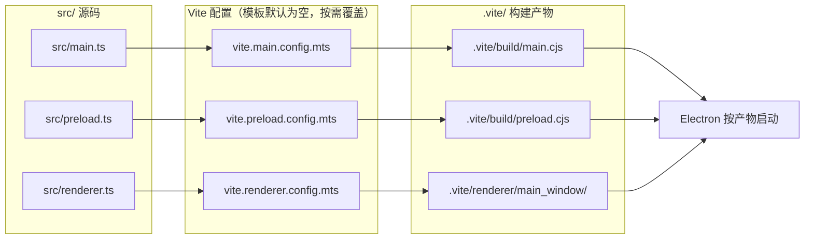

import { Meta } from '@storybook/addon-docs/blocks';

<Meta id="typescript-setup" title="工程化/接入 TypeScript" name="Docs" />

# 接入 TypeScript

从本课起，示例栈从纯 JavaScript 切换为 TypeScript + Vite。核心判断先行：在 Electron 里接入 TypeScript 不是把 `.js` 改成 `.ts`——base 模板零构建，文件即产物；换成 Forge 的 vite-typescript 模板后，main、preload、renderer 变成三条互相独立的 Vite 构建线，Electron 实际加载的是 `.vite/` 下的构建产物。类型系统同样分端：主进程与预加载脚本的类型由 `electron` 包自带声明直接覆盖；渲染进程拿不到 Electron API，`window.api` 的类型是 contextBridge 暴露面的镜像，必须手工声明并随暴露面一起维护。

读完你应能预测：`npm start` 时 Forge 先把源码构建进 `.vite/` 再启动 Electron；`package.json` 的 `main` 指向构建产物而非源码；预加载脚本无论怎么写都会被打包成单个 `.cjs` 文件；渲染进程代码里用 `window.api` 需要一份 d.ts 声明，漏了它 `tsc` 就报 `TS2339`。



| 回查项 | 值 | 备注 |
| --- | --- | --- |
| 脚手架命令 | `npx create-electron-app@latest my-app --template=vite-typescript` | Forge 8，模板名无空格 |
| 主进程 `main` 字段 | `.vite/build/main.cjs` | 指向构建产物，不是 `src/main.ts` |
| 产物目录 | `.vite/build/`（main、preload）＋ `.vite/renderer/<名字>/` | 生成物，加入 `.gitignore` |
| 预加载产物 | `.vite/build/preload.cjs` | 插件固定输出 CJS 单文件 |
| 渲染端加载 | 开发 `loadURL(MAIN_WINDOW_VITE_DEV_SERVER_URL)`；打包 `loadFile(...)` | 常量由插件在构建期注入 |
| 类型声明入口 | `src/declarations.d.ts` | 引用插件自带的 `forge-vite-env` 类型 |
| 类型检查 | `npm run typecheck`（`tsc --noEmit`） | 转译交给 Vite，tsc 只管类型 |
| 插件状态 | `@electron-forge/plugin-vite` 自 Forge 7.5.0 标注 experimental | 小版本可能带破坏性变更，升级看 release notes |

## 快速上手

从零到可运行的 TypeScript 工程只需一条命令；重要的是确认你理解启动过程中发生了什么。

```bash
# 1. 用 vite-typescript 模板创建项目（名字换成你自己的）
npx create-electron-app@latest my-ts-app --template=vite-typescript
cd my-ts-app

# 2. 启动
npm start

# 3. 类型检查：无输出即通过
npm run typecheck
```

三个观察点：

- **启动日志先出现构建任务行**（"Building main process and preload bundles..."一类），窗口在其后才弹出——Forge 先构建再启动，`npm start` 不再是直接 `electron .`；
- 另开终端查看产物：`ls .vite/build` 得到 `main.cjs` 和 `preload.cjs`，`ls .vite/renderer` 得到 `main_window`——Electron 加载的就是这些文件；
- 新建一个 `src/anything.ts` 写一行类型错误，`npm run typecheck` 立刻报错——类型检查与运行是两条独立通道，改类型错误不需要重启应用。

## 三端构建线

三条构建线的注册处只有一个：`forge.config.mts` 里 `VitePlugin` 的 `config`。它分两组——`build` 数组声明**可执行进程**的入口（main、preload、worker 等），每项的 `entry` 是对应 Vite 配置里 `build.lib.entry` 的别名；`renderer` 数组声明**页面**，每项的 `name` 决定魔法常量前缀和产物目录名。三份 `vite.*.config.mts` 模板默认全是空的 `defineConfig({})`——插件已经内置了合理默认（输出目录、CJS 格式、外部依赖表），你只在需要覆盖时才填内容。

```ts
// forge.config.mts（vite-typescript 模板产物，节选；完整版见本课示例文件）
import { VitePlugin } from '@electron-forge/plugin-vite';

const config: ForgeConfig = {
  // ...
  plugins: [
    new VitePlugin({
      // build：每个可执行进程一个入口
      build: [
        { entry: 'src/main.ts', config: 'vite.main.config.mts', target: 'main' },
        { entry: 'src/preload.ts', config: 'vite.preload.config.mts', target: 'preload' },
      ],
      // renderer：每个页面一项，name 决定 MAIN_WINDOW_VITE_* 前缀
      renderer: [
        { name: 'main_window', config: 'vite.renderer.config.mts' },
      ],
    }),
  ],
};
```

已经有了 base 模板项目（`src/index.js` 那套）时，不必推倒重来：装上 `@electron-forge/plugin-vite`，按下表把文件挪到位，就是一次完整迁移。反过来读这张表，就是模板替你做了什么。

| base 模板 | vite-typescript 模板 | 说明 |
| --- | --- | --- |
| `src/index.js` | 删除，换 `src/main.ts` | 主进程入口改走构建 |
| `src/preload.js` | 删除，换 `src/preload.ts` | 产物变成 `.vite/build/preload.cjs` |
| `src/index.html` | 移到项目根目录 `index.html` | 注入 `<script type="module" src="/src/renderer.ts">`，移除 stylesheet link |
| `src/index.css` | 保留原位 | 改由 `src/renderer.ts` 里 `import './index.css'` 引入 |
| `forge.config.js` | 删除，换 `forge.config.mts` | Forge 自 7.8.1 起原生加载 TS 配置（经 jiti） |
| —— | 新增 `vite.main/preload/renderer.config.mts` | 三条构建线的配置入口，默认为空 |
| —— | 新增 `tsconfig.json`、`src/declarations.d.ts` | 类型检查与插件常量声明 |
| `main: "./src/index.js"` | `main: ".vite/build/main.cjs"` | Electron 启动的是产物 |

边界两条：插件构建时先并行跑所有 renderer 目标，再跑 main 与 preload 目标，工程很大导致内存吃紧时可在插件配置里加 `concurrent` 限制并行数（Forge 7.9.0 起）；`forge.config.mts` 里的强类型来自 `@electron-forge/shared-types` 包的 `ForgeConfig`，maker、plugin 用 `new MakerZIP()` 这类构造器写法才能拿到各自的选项类型。

### 主进程

入口 `src/main.ts`，经 `vite.main.config.mts` 构建为 `.vite/build/main.cjs`。三件事理解这一端：

**`package.json` 的 `main` 指向产物。** Electron 启动时加载的是 `.vite/build/main.cjs`，改源码不生效、产物没生成都从这里排查。后缀 `.cjs` 是刻意的：即使项目以后在 `package.json` 写了 `"type": "module"`，Electron 仍会把产物当 CommonJS 解析。老工程把 `main` 指到旧值 `.vite/build/main.js` 时，插件会给出明确报错，提示把 `main` 与 preload 路径一起改成 `.cjs`。

**`electron` 和 Node 内置模块不打包。** 插件把 `electron` 与全部内置模块标记为 external，打进产物的只有你自己的代码；`require('electron')` 在运行时直连 Electron 本体。

**dev 与 prod 的行为差异由插件收口。** 开发模式（`forge start`）下 main 与 preload 的产物以 watch 方式重建，改完源码构建立即更新；但 main 的改动默认**不会**自动重启应用——想让它自动重启，在插件配置里加 `hotRestart: true`（默认 `false`），否则用老办法：在 Forge 的终端输入 `rs` 手动重启；打包（`package` / `make`）时才做 minify。主进程代码里最显眼的 TS 特征是两个"魔法常量"：

```ts
// src/main.ts（模板产物节选）
const createWindow = () => {
  const mainWindow = new BrowserWindow({
    width: 800,
    height: 600,
    webPreferences: {
      // 产物在 .vite/build/，preload 与 main 同目录
      preload: path.join(__dirname, 'preload.cjs'),
    },
  });

  // 开发：常量是插件 dev server 的 URL，走 loadURL，渲染端享受 HMR；
  // 打包：常量被替换为 undefined，走 loadFile 分支
  if (MAIN_WINDOW_VITE_DEV_SERVER_URL) {
    mainWindow.loadURL(MAIN_WINDOW_VITE_DEV_SERVER_URL);
  } else {
    mainWindow.loadFile(
      path.join(__dirname, `../renderer/${MAIN_WINDOW_VITE_NAME}/index.html`),
    );
  }
};
```

### 预加载脚本

入口 `src/preload.ts`，产物固定为 `.vite/build/preload.cjs`——**单个 CJS 文件，无论你怎么配置**。插件的内置默认把 preload 的输出格式硬定为 `cjs`、关闭代码切分，这是替你执行 Electron 的约束，不是可选项：

- 渲染进程沙箱默认开启（Electron 20 起），**沙箱化预加载脚本不能用 ESM**——这是 Electron 官方文档写死的支持矩阵；
- ESM 预加载脚本有额外条件：不沙箱 + `.mjs` 后缀，且预加载脚本无视 `package.json` 的 `"type": "module"`；
- 约束交给了插件，你照常写 `import { contextBridge, ipcRenderer } from 'electron'`，构建期由插件转成沙箱可加载的 CJS。

开发期的热行为与 main 不同：preload 重建后插件向各渲染端 dev server 发 full-reload（页面整体刷新，不用重启应用），因为预加载脚本随页面加载重新执行——这与「[预加载脚本](?path=/docs/preload--docs)」一课的生效规则一致。

preload 的内容本身在本课只关心类型接线，暴露面示例见下一节；沙箱下能用到什么，边界在「[安全清单](?path=/docs/security--docs)」一课。

### 渲染端

渲染端没有 `entry` 字段，入口是根目录的 `index.html`——模板把它从 `src/` 挪到项目根，注入 `<script type="module" src="/src/renderer.ts">`，页面逻辑从 `src/renderer.ts` 开始，样式改由它 `import './index.css'` 引入。

加载路径在 main.ts 里分流（上一节的 `if/else`）：开发时插件为每个 renderer 起一个 Vite dev server，`MAIN_WINDOW_VITE_DEV_SERVER_URL` 指向它，渲染端获得完整 HMR；打包时常量为 undefined，走 `loadFile` 加载 `.vite/renderer/main_window/index.html`。常量名由 renderer 的 `name` 变换而来——大写、连字符转下划线：`main_window` 生成 `MAIN_WINDOW_VITE_DEV_SERVER_URL` 与 `MAIN_WINDOW_VITE_NAME`，多页面时各有一组。

一条高权重约束：插件强制渲染端构建的 Vite `base` 为 `./`。打包后的页面从 `file://` 加载，根相对 URL（如 `/logo.png`）在 dev server 下能工作，打包后却指向文件系统根，窗口会加载成白屏。引用资源用相对路径，或走 `import.meta.env.BASE_URL` 拼接；不要把 `base` 覆盖回 `/`。

## 类型声明

类型来源分三层，每层管一端：

**electron 包自带声明，覆盖 main 与 preload。** `electron` 包自带完整的 `electron.d.ts`，并且依赖 `@types/node`——所以 `import { app, BrowserWindow } from 'electron'` 拿到全量类型，`process`、`__dirname`、`path` 等 Node 全局也一并可用，不需要再装 `@types/electron` 之类的包。

**插件常量，靠一行引用声明。** 模板的 `src/declarations.d.ts` 只有两行，第一行把插件自带的类型定义接进编译：

```ts
/// <reference types="@electron-forge/plugin-vite/forge-vite-env" />
declare module '*.css';
```

这行引用让 `MAIN_WINDOW_VITE_DEV_SERVER_URL`、`MAIN_WINDOW_VITE_NAME` 在 TS 看来是存在的全局常量。手动迁移漏了这个文件时，兜底写法是自己在 d.ts 里 `declare const MAIN_WINDOW_VITE_DEV_SERVER_URL: string;`。注意运行期语义：打包构建时该常量被替换为 `undefined`，模板代码靠 truthiness 分流，不要把类型上的 `string` 当成运行期保证。

**`window.api` 是手工声明的镜像，需要单一真源。** 渲染进程的世界里没有 `electron` 模块，`window.api` 只是 preload 经 contextBridge 挂上去的普通对象，它的类型全靠你声明。推荐三点一线的模式，类型定义一处、两端消费：

```ts
// src/api.ts —— 类型真源：暴露面演进时只改这里
export interface AppInfo {
  electron: string;
  node: string;
  platform: string;
}

export interface Api {
  readAppInfo(): Promise<AppInfo>;
  ping(message: string): Promise<string>;
}
```

```ts
// src/preload.ts —— 实现端：satisfies 让暴露面与真源在编译期对账
import { contextBridge, ipcRenderer } from 'electron';
import type { Api } from './api';

const api = {
  readAppInfo: () => ipcRenderer.invoke('app:info'),
  ping: (message: string) => ipcRenderer.invoke('app:ping', message),
} satisfies Api;

contextBridge.exposeInMainWorld('api', api);
```

```ts
// src/api.d.ts —— 消费端：把 Api 挂上全局 Window
import type { Api } from './api';

declare global {
  interface Window {
    api: Api;
  }
}

export {};
```

之后渲染端代码 `const info = await window.api.readAppInfo()` 拿到的就是完整的 `AppInfo` 类型。两个关键点：`import type` 在编译期擦除，preload 引的是类型不是运行时代码，不会破坏沙箱；`satisfies` 校验实现不满足类型真源时直接报错，比事后在渲染端发现 `window.api` 上少了方法便宜得多。通道两侧的主进程 `ipcMain.handle` 写法见「[双向调用](?path=/docs/ipc-invoke--docs)」一课。

## tsconfig 拆分还是共用

模板默认**一份 tsconfig 管三端**：

```jsonc
{
  "compilerOptions": {
    "target": "ESNext",
    "module": "preserve",
    "moduleResolution": "bundler",
    "allowJs": true,
    "skipLibCheck": true,
    "esModuleInterop": true,
    "noImplicitAny": true,
    "sourceMap": true,
    "resolveJsonModule": true
  },
  "include": ["src/**/*", "*.ts", "*.mts"]
}
```

单份可行的原因藏在 `module: "preserve"` 与 `moduleResolution: "bundler"` 里：`tsc` 在这个工程里只做类型检查（`typecheck` 脚本是 `tsc --noEmit`），真正的转译和模块格式由 Vite 决定——所以三端都能用 ESM 写法，不必为"preload 产物是 CJS"在 tsconfig 里做文章。

什么时候拆：渲染端引入 React/Vue（9.x 的内容）之后，DOM lib、jsx 配置、路径别名这些前端诉求会和主进程的 Node 端诉求互相干扰，届时拆成 `tsconfig.node.json`（main、preload、forge 配置）与 `tsconfig.web.json`（渲染端）两份，`typecheck` 脚本各跑一次 `tsc -p`。判断标准：**共用是默认，拆分是渲染端框架化的结果，不是接入 TypeScript 的前提。**

## 最佳实践

- **新项目直接用模板，已有项目按映射表迁移。** `--template=vite-typescript` 生成的布局就是插件默认行为的最佳注解；手动迁移时逐行对照「三端构建线」一节的映射表，漏掉 `declarations.d.ts` 或 `index.html` 挪位是最常见的两个坑。
- **暴露面类型单一真源。** `Api` 接口定义在 `src/api.ts` 一处，preload 用 `satisfies` 对账、渲染端经 `declare global` 消费；IPC 通道加参数、改返回值时类型改动收敛在一个文件里。
- **`.vite/` 加入 `.gitignore`。** 它是每次启动都重建的生成物，进版本库只会制造冲突与体积；需要回查产物结构时跑一次 `npm start` 就有。
- **覆盖构建行为只改 `vite.*.config.mts`。** 原生模块要在 `vite.main.config.mts` 里标 external（`build.rollupOptions.external`），不要绕过插件手写 Vite 命令，保持 Forge 对构建与打包的统一收口。

## 常见问题

- 打包后窗口白屏，开发时一切正常
  先查资源引用方式：根相对 URL（`/logo.png`、`/assets/...`）在 dev server 下能用，打包后从 `file://` 加载就指向文件系统根。改成相对路径或用 `import.meta.env.BASE_URL` 拼接；确认没有在配置里把 Vite `base` 覆盖回 `/`。其次是确认 `main.ts` 的加载分支走的是 `loadFile` 且路径含 `MAIN_WINDOW_VITE_NAME`。
- 启动报错找不到 `.vite/build/main.js`，或插件提示更新 `main` 字段
  老工程还在用旧产物名。把 `package.json` 的 `main` 改成 `.vite/build/main.cjs`，同时把主进程里 `webPreferences.preload` 的路径改成 `preload.cjs`——插件现在统一输出 `.cjs` 后缀。
- 想把预加载脚本写成 ESM，或运行时报 `require is not defined` 一类错误
  预加载脚本的 CJS 输出是沙箱约束的产物，不是配置偏好：沙箱化预加载脚本不支持 ESM，插件把 preload 的输出格式硬定为 CJS 单文件。照常写 ESM 语法的源码（`import ... from 'electron'`），构建由插件处理；真需要 ESM 预加载的前提是不沙箱加 `.mjs` 后缀，那是安全模型的取舍，见「[安全清单](?path=/docs/security--docs)」一课。
- `tsc` 报 `TS2304: Cannot find name 'MAIN_WINDOW_VITE_DEV_SERVER_URL'`
  缺声明。确认项目里有 `src/declarations.d.ts` 且首行是 `/// <reference types="@electron-forge/plugin-vite/forge-vite-env" />`，同时该文件落在 tsconfig 的 `include` 范围内；手动迁移的项目最容易漏。
- 渲染端访问 `window.api` 报 `TS2339: Property 'api' does not exist on type 'Window'`
  全局声明没生效。检查 `api.d.ts` 是否在 tsconfig `include` 范围内、`declare global` 是否写在模块内部（文件里有 `import`/`export` 即可），别把声明写进会被 Vite 单独编译、不参与 tsc 检查的文件。

## 总结回顾

摘要：

接入 TypeScript 把工程从"文件即产物"重排为"三条构建线加一层手工类型边界"：`forge.config.mts` 里 `VitePlugin` 的 `build` 数组把 `src/main.ts`、`src/preload.ts` 构建为 `.vite/build/` 下的 `.cjs` 产物，`renderer` 数组把根目录 `index.html` 背后的 `src/renderer.ts` 构建为 `.vite/renderer/main_window/`，`package.json` 的 `main` 因此指向构建产物。预加载脚本被插件固定输出为 CJS 单文件，这是沙箱下"预加载不能用 ESM"约束的执行；渲染端开发走 dev server 的 `loadURL`、打包走 `loadFile`，由插件注入的魔法常量分流，资源引用必须相对路径。类型三层：electron 包自带声明覆盖两端、插件常量靠 `declarations.d.ts` 一行引用、`window.api` 用"真源接口 + satisfies 实现 + declare global 消费"三点一线手工维护。tsconfig 默认一份共管三端，拆分留给渲染端框架化之后。

一句话：

> Electron 的 TypeScript 接入，本质是给三个独立构建的进程端各配一条 Vite 构建线，再为渲染进程手工维护一份 contextBridge 暴露面的类型镜像。

知识要点：

- vite-typescript 模板比 base 模板多了哪些文件？`src/index.html` 去了哪里？
- `package.json` 的 `main` 为什么是 `.vite/build/main.cjs` 而不是源码路径？
- `MAIN_WINDOW_VITE_DEV_SERVER_URL` 从哪来、何时是 undefined、名字由什么决定？
- 预加载脚本为什么必然产出 `.cjs` 单文件？沙箱和 ESM 的约束写在哪？
- `window.api` 的类型为什么渲染进程拿不到现成的？三点一线的模式怎么落地？
- 模板的单份 tsconfig 为什么可行？什么时候该拆？
- 打包后白屏的第一排查动作是什么？

## 参考资料

- [Electron Forge：Vite Plugin](https://www.electronforge.io/config/plugins/vite)（插件配置结构、`main` 字段指向、魔法常量与 TypeScript 声明、`base` 强制 `./`、`concurrent` 选项）
- [Electron Forge：Vite + TypeScript 模板](https://www.electronforge.io/templates/vite-+-typescript)（`--template=vite-typescript` 命令与 experimental 状态说明）
- [Electron Forge：TypeScript 配置](https://www.electronforge.io/config/typescript-configuration)（`forge.config.ts` 原生加载、`ForgeConfig` 类型与构造器语法）
- [Electron 教程：ESM](https://www.electronjs.org/docs/latest/tutorial/esm)（沙箱预加载不支持 ESM、`.mjs` 后缀与 `"type": "module"` 的边界）
- [@electron-forge/plugin-vite（npm）](https://www.npmjs.com/package/@electron-forge/plugin-vite)（版本与 `forge-vite-env` 类型入口，本课产物行为的发布版依据）
- [electron/forge：vite 模板源码](https://github.com/electron/forge/tree/main/packages/template/vite)（模板生成布局与插件内置 Vite 默认值的一手出处）
