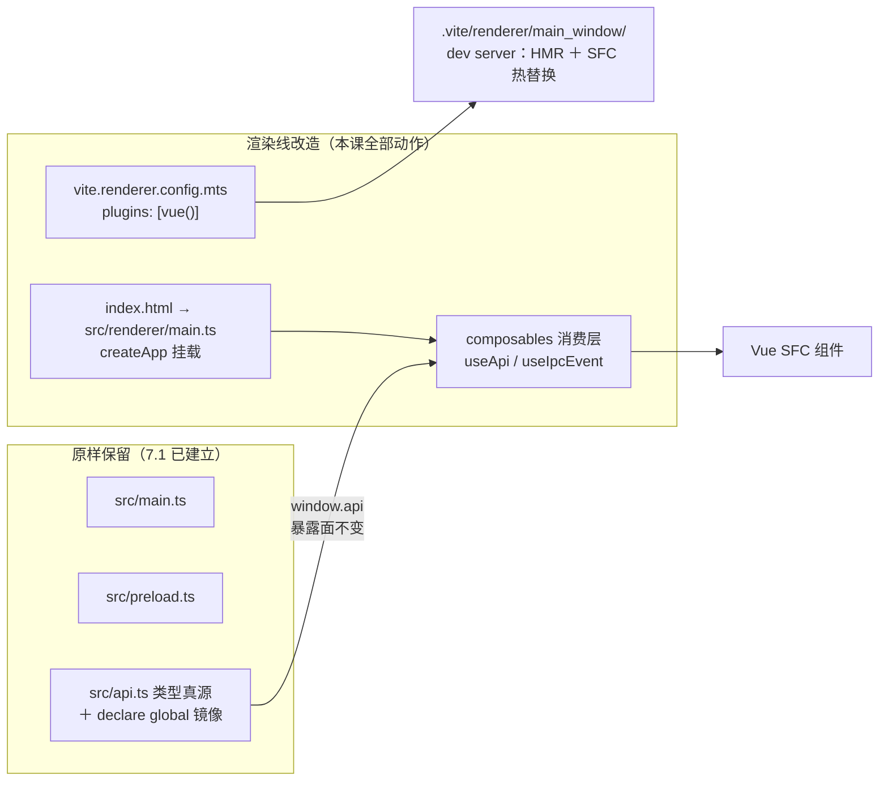

import { Meta } from '@storybook/addon-docs/blocks';

<Meta id="vue-integration" title="框架集成/Vue 集成" name="Docs" />

# Vue 集成

本课在「[接入 TypeScript](?path=/docs/typescript-setup--docs)」的 vite-ts 骨架上接入 Vue，完成一套 Vue + Vite + Electron 工程的完整搭建与 IPC 封装。核心判断先行：**Vue 同样只落在三条构建线中的渲染线一条上。**主进程、预加载脚本与 `window.api` 的三点一线类型纪律（类型真源、`satisfies` 对账、`declare global` 消费）原样不动；全部接入动作收敛为四处——渲染线 Vite 配置挂 `@vitejs/plugin-vue`、入口从 `renderer.ts` 换成 `src/renderer/main.ts`（`createApp`）、tsconfig 按端拆分且渲染线的类型检查交给 `vue-tsc`、`window.api` 的消费方式 composable 化。

本课与「[React 集成](?path=/docs/react-integration--docs)」平行：结构、桥与 IPC 语义完全同构，可以对照着读；真正的差异集中在三处——SFC 的类型接入（`vue-tsc` 与编辑器扩展）、Vue 的 setup 只执行一次带来的订阅简化、以及 DevTools 在 Electron 里的接入方式。Vue 语言本身不是本课内容，只标注衔接点。

想要现成起点，官方脚手架 create-vue（`npm create vue@latest`）给的是一套纯前端侧的 Vue + Vite 工程，不含 Electron 主进程与 Forge 工具链，仍然需要手工并进 Forge 工程；本课沿「[集成模式](?path=/docs/integration-overview--docs)」中 Forge Vite 插件这条路线做最小接入，与 7.1 连续。

读完你应能预测：改一个 `.vue` 文件保存，窗口即时更新且组件状态保留（SFC HMR）；改主进程代码，应用不会自动重启（7.1 的规则未变）；打包后路由必须用 hash，因为页面从 `file://` 加载。



| 回查项 | 值 | 备注 |
| --- | --- | --- |
| 运行时依赖 | `npm install vue` | 只被渲染线消费 |
| 构建期依赖 | `npm install -D @vitejs/plugin-vue vue-tsc` | 插件与类型检查工具 |
| 渲染线插件 | `plugins: [vue()]` | 只写在 `vite.renderer.config.mts`，另两条线不挂 |
| 入口 | `index.html` 的 script 指向 `/src/renderer/main.ts` | `renderer.ts` 删除，`createApp` 挂载到 `#app` |
| 渲染线类型检查 | `vue-tsc --noEmit -p tsconfig.web.json` | 纯 `tsc` 不认识 `.vue` 导入 |
| 路由 | `createWebHashHistory` | 打包后从 `file://` 加载，hash 不发给服务器 |
| composable 封装 | `useApi`（invoke 状态）＋ `useIpcEvent`（推送订阅） | 完整实现在本课目录 |
| DevTools 接入 | `vite-plugin-vue-devtools`（推荐） | 浏览器扩展形态要走 `loadExtension` |
| 不动的部分 | main、preload、`src/api.ts`、dev/prod 加载分流 | 7.1 规则全部沿用 |

## 快速上手

沿用 7.1 的 vite-typescript 工程，四步把 Vue 跑起来。先纠正一个容易误解的说法：「依赖装哪端」指的是构建线的消费归属——工程只有一份 `package.json`、一个 `node_modules`，不存在按端分目录安装。

1. 安装依赖：运行时进 dependencies，插件与类型检查工具进 devDependencies：

```bash
npm install vue
npm install -D @vitejs/plugin-vue vue-tsc
```

2. 渲染线挂插件。7.1 模板里 `vite.renderer.config.mts` 是空的 `defineConfig({})`，接入 Vue 只改这一处（完整文件见本课目录 `vite.renderer.config.mts`）：

```ts
// vite.renderer.config.mts
import vue from '@vitejs/plugin-vue';
import { defineConfig } from 'vite';

export default defineConfig({
  plugins: [vue()],
});
```

3. 入口换成 `main.ts`。顺手把渲染端代码收进 `src/renderer/`（下一节拆 tsconfig 时 include 就互不干扰）：`index.html` 加挂载点、script 指向新入口，删除 `src/renderer.ts`，样式文件随入口挪进 `src/renderer/`。注意从此有两份 `main.ts`——`src/main.ts` 是主进程，`src/renderer/main.ts` 是渲染线入口，同名文件各管各的构建线：

```html
<body>
  <div id="app"></div>
  <script type="module" src="/src/renderer/main.ts"></script>
</body>
```

```ts
// src/renderer/main.ts
import { createApp } from 'vue';

import App from './App.vue';

createApp(App).mount('#app');
```

```vue
<!-- src/renderer/App.vue：最小组件，先跑通闭环 -->
<script setup lang="ts">
import { ref } from 'vue';

const count = ref(0);
</script>

<template>
  <main>
    <!-- 改这行文案保存：文字热替换，数字不重置（SFC HMR 保留状态） -->
    <p>SFC HMR 计数：{{ count }}</p>
    <button @click="count++">+1</button>
  </main>
</template>
```

4. 渲染线的类型检查交给 `vue-tsc`——它是包了一层 `.vue` 支持的 `tsc`，而 Vite 开发服务器只做转译、不查类型。最小验证直接跑 `npx vue-tsc --noEmit`，规范的按端拆分见下一节。

`npm start`，三个观察点：

- **窗口内容来自 Vue**：`#app` 挂载点里渲染出按钮与计数，`index.html` → `main.ts` → `createApp` → `App.vue` 链路生效；
- **改 `App.vue` 文案保存**：窗口文字即时更新，点了几次攒下的计数不重置——`vue()` 带来的 SFC HMR 在工作；
- **改 `src/main.ts` 保存**：窗口无变化也不重启——主进程的生效规则仍是 7.1 的 watch 重建 + 终端输入 `rs` 手动重启。

## 依赖装在哪一端

分三类回答。**Vue 本体（`vue`）只被渲染线 import。**Vite 构建渲染端时把依赖整体打进 `.vite/renderer/` 产物，运行时窗口不读 `node_modules` 里的 Vue——所以放 dependencies 是 Web 惯例，放 devDependencies 则打包出的 asar 不背一份用不到的源码，两种都能跑，选一种保持一致。唯一不能做的是把它 import 进 main 或 preload：主进程与预加载里没有 Vue 的运行场景。

**插件与类型检查工具是构建期/类型期依赖。**`@vitejs/plugin-vue` 是 Vite 官方的 Vue 插件（仅支持 Vue 3），负责把 `.vue` 单文件组件编译成 JavaScript——模板编译发生在构建期——并注入 SFC HMR 所需的代码；`vue-tsc` 供给命令行类型检查。两者都在 devDependencies，且只挂在渲染线——`vite.main.config.mts`、`vite.preload.config.mts` 不处理 `.vue`，挂了没有意义。

**preload 的类型接线不受影响。**`import type` 编译期擦除、`satisfies Api` 对账这些 7.1 的结论不因 Vue 改变——桥的那一端没人动它。

顺带一个与「依赖」直接相关的产物结论：Vite 默认用 runtime-only 版的 `vue` 构建——SFC 模板已经预编译成渲染函数，运行时不再携带模板编译器，这正是省体积的默认行为；需要运行时编译字符串模板的例外见「常见问题」。

边界收口：真正与「端」有关的依赖判断发生在主进程一侧——运行时 npm 包（数据库驱动、原生模块）才牵出 external 标记与 asar 裁剪，归「打包」「原生模块」两课；Vue 全在渲染线，不碰这层。

## 渲染线改造

三处改动构成渲染线的全部工作量。Forge 的 Vite 插件对渲染线的定位是遵循与非 Electron Vite 项目相同的标准——渲染线就是一个标准 Vite 工程，框架按 Vite 惯例接入，Electron 侧不掺和；Electron 侧的既有约束（`base` 强制 `./`、dev/prod 加载分流）继续有效。

### vite.renderer.config.mts：挂插件

快速上手已给出完整文件，这里补三条边界：模板默认值就是空的 `defineConfig({})`，只需加 `plugins: [vue()]`；不要把 `base` 覆盖回 `/`（7.1 的 `file://` 纪律）；插件不改变渲染线的产物路径与魔法常量，`MAIN_WINDOW_VITE_DEV_SERVER_URL` 的分流原样工作——开发时渲染端照旧走 dev server 的 `loadURL`，打包走 `loadFile`。

### 入口换成 main.ts 与 SFC

`index.html` 仍是渲染线入口，变化只有两处：`<body>` 里加 `<div id="app"></div>` 挂载点，script 的 `src` 从 `/src/renderer.ts` 改为 `/src/renderer/main.ts`。旧入口 `renderer.ts` 删除，它原来的 `import './index.css'` 移到 `main.ts` 或 `App.vue` 的 `<style>` 里。

`main.ts` 是整页级的入口：`createApp(App).mount('#app')` 是 Vue 3 的统一挂载方式。组件层的代码从 `App.vue` 开始——单文件组件把模板、逻辑、样式分块写在一个 `.vue` 文件里：`<template>` 编译成渲染函数（构建期完成），`<script setup lang="ts">` 是组合式 API 的语法糖，`<style>` 归组件样式。与 React 的 tsx 对照：React 把组件写成返回 JSX 的函数，Vue 把逻辑与模板拆在两个块里，`<script setup>` 中顶层声明的变量与函数直接在模板里可见。

### tsconfig 拆分与 vue-tsc

7.1 留下的预告在此兑现：「渲染端引入框架之后，DOM lib、前端模块这些诉求会和主进程的 Node 端诉求互相干扰，届时拆分」。渲染端代码收进 `src/renderer/` 后，两份配置的 include 互不干扰；根 `tsconfig.json` 只留公共选项，被两份 extends。拆分结构与 React 课相同，web 侧的选项换成 Vue 的诉求：

```jsonc
// tsconfig.json——公共选项（沿用 7.1 的共用配置），本身不再直接包含文件
{
  "compilerOptions": {
    "target": "ESNext",
    "module": "preserve",
    "moduleResolution": "bundler",
    "allowJs": true,
    "skipLibCheck": true,
    "esModuleInterop": true,
    "noImplicitAny": true,
    "sourceMap": true,
    "resolveJsonModule": true,
    "noEmit": true
  },
  "files": [],
  "references": [
    { "path": "./tsconfig.node.json" },
    { "path": "./tsconfig.web.json" }
  ]
}
```

```jsonc
// tsconfig.node.json——主进程、预加载、构建配置
{
  "extends": "./tsconfig.json",
  "include": [
    "src/main.ts",
    "src/preload.ts",
    "src/api.ts",
    "src/api.d.ts",
    "src/declarations.d.ts",
    "*.mts"
  ]
}
```

```jsonc
// tsconfig.web.json——渲染端（Vue）
{
  "extends": "./tsconfig.json",
  "compilerOptions": {
    "lib": ["ESNext", "DOM", "DOM.Iterable"],
    "types": ["vite/client"]
  },
  "include": ["src/renderer/**/*.ts", "src/renderer/**/*.vue", "src/api.ts", "src/api.d.ts"]
}
```

Vue 在 tsconfig 上与 React 的三点差异：

- **web 侧没有 jsx 这类选项。**`<script setup lang="ts">` 不需要额外的 compilerOptions，模板不是 TSX。
- **include 显式列出 `.vue`。**TypeScript 的 include 规则默认只收 `.ts`、`.tsx`、`.d.ts`，写成目录形式的 `src/renderer` 不会把 `.vue` 收进检查范围，所以要写成 `src/renderer/**/*.vue` 这样的显式模式。
- **web 段的检查命令换成 `vue-tsc`。**`vue-tsc` 就是 `tsc` 包了一层 `.vue` 支持，参数用法一致；node 段仍是 `tsc`：

```jsonc
// package.json
{
  "scripts": {
    "typecheck": "tsc --noEmit -p tsconfig.node.json && vue-tsc --noEmit -p tsconfig.web.json"
  }
}
```

两个配套点：编辑器装 Vue - Official 扩展（原名 Volar）才能在 `.vue` 里得到类型与补全——它与 `vue-tsc` 是同一套语言能力，一个进编辑器、一个进命令行；Vite 开发服务器只做转译、不查类型，类型错误只会在 `vue-tsc` 或编辑器里出现，构建不会替你拦截。

若坚持用纯 `tsc` 检查 web 线，只能给 `.vue` 手写模块声明 shim（`declare module '*.vue'`）——代价是所有 SFC 退化成通用组件类型，模板与 props 的检查全部失效，等于放弃 SFC 类型，不推荐。

## window.api 的 Vue 化

桥的结构不动：`src/api.ts` 仍是类型真源，preload 仍是实现端，渲染端仍只认 `window.api` 的具名能力。Vue 带来的变化在消费层——3.2 的请求响应与 3.3 的推送订阅，分别封装成两个 composable，把 IPC 语义接进组件的 setup 与生命周期。

先看真源的唯一演进：为演示推送方向，`Api` 接口加一个订阅成员 `onTick`（完整文件见本课目录 `api.ts`），preload 补上对应实现，`satisfies` 继续对账——这段与 React 课逐字同源，因为桥的这端没人动它：

```ts
// src/preload.ts：真源加了 onTick，实现端补一个成员（主进程侧配一个
// setInterval 调 webContents.send('tick', ...) 即可演示，3.3 的规则原样适用）
import { contextBridge, ipcRenderer } from 'electron';
import type { Api } from './api';

const api = {
  readAppInfo: () => ipcRenderer.invoke('app:info'),
  ping: (message: string) => ipcRenderer.invoke('app:ping', message),
  // 推送成员：listener 进、取消订阅函数出
  onTick: (listener) => {
    const handler = (_event, payload) => listener(payload);
    ipcRenderer.on('tick', handler);
    return () => ipcRenderer.removeListener('tick', handler);
  },
} satisfies Api;

contextBridge.exposeInMainWorld('api', api);
```

### useApi：invoke 的响应式三态

`invoke` 返回 Promise，组件需要的是响应式状态而不是 Promise——`useApi(load, watchSources)` 把两者接起来：挂载时执行 `load`，`watchSources` 变化时重跑，结果落进 `data`、`loading`、`error` 三个 Ref（完整实现见本课目录 `use-api.ts`）：

```ts
export function useApi<T>(
  load: () => Promise<T>,
  watchSources: WatchSource[] = [],
): ApiState<T> {
  // IPC 载荷是过桥的普通对象：shallowRef 整体替换即可，不做深层响应化
  const data = shallowRef<T | null>(null);
  const loading = ref(true);
  const error = ref<Error | null>(null);

  watch(
    watchSources,
    (_n, _o, onCleanup) => {
      let cancelled = false; // 过期标志：重跑或作用域销毁后，旧结果不再落地
      onCleanup(() => { cancelled = true; });
      loading.value = true;
      error.value = null;
      load().then(
        (result) => { if (!cancelled) { data.value = result; loading.value = false; } },
        (err: unknown) => { if (!cancelled) { error.value = toError(err); loading.value = false; } },
      );
    },
    { immediate: true }, // 挂载即执行首次请求
  );

  return { data, loading, error };
}
```

组件里解构接入（完整组件见本课目录 `App.vue`）。解构出来的是 Ref：`<script setup>` 里用 `.value`，模板里自动解包——`info` 的类型就是 `api.ts` 里的 `AppInfo`，7.1 的 `declare global` 镜像让 composable 全程类型安全：

```ts
const { data: info, loading, error } = useApi(() => window.api.readAppInfo());
// 模板里 v-if="loading"、{{ info.electron }} 直接可用
```

三个设计点：**过期结果用 `onCleanup` 丢弃**——9.2 手写的 `cancelled` 标志在 Vue 里是 watch 的原生回调位，重跑前与作用域销毁时都会执行，慢到的旧响应不再落地；**`data` 用 `shallowRef`**——IPC 载荷是结构化克隆过来的普通对象，整体替换即可，不必为它建深层响应式代理，大对象时差距明显；**重跑时机交给 `watchSources`**——与 React 的 deps 数组同构，但传的是响应源（ref、getter），依赖追踪由响应式系统完成。

边界一条：这里只做最小闭环——缓存、去重、失效重验这类请求管理是「状态管理」一课的话题，本课不引入。

### useIpcEvent：推送订阅进 composable

3.3 给桥定下的惯例——订阅函数 listener 进、取消订阅函数出——在 Vue 里对应 `onScopeDispose` 的清理时机。`useIpcEvent` 的完整实现只有两行核心（完整文件见本课目录 `use-ipc-event.ts`）：

```ts
export function useIpcEvent<P>(
  subscribe: (listener: (payload: P) => void) => () => void,
  handler: (payload: P) => void,
): void {
  const unsubscribe = subscribe(handler);
  onScopeDispose(unsubscribe); // 组件 setup 上下文中，卸载时退订
}
```

组件里传入桥上的订阅方法与处理函数：

```ts
const count = ref(0);
useIpcEvent(window.api.onTick, (payload) => { count.value = payload.count; });
```

比 React 版少掉的全部机制，都源于执行模型的差异：**setup 只执行一次**——handler 不随「重渲染」重建，没有过期闭包问题，9.2 的 `handlerRef` 保活技巧在这里没有存在的对象；**没有 StrictMode 双执行**——Vue 开发期不会刻意重复执行 setup，订阅天然就是一次；**订阅即时生效**——不等 `onMounted`，早于首次挂载的推送也不会漏。9.2 把订阅接进 `useEffect` 是因为 React 的副作用必须挂在 effect 生命周期上；Vue 的 composable 在 setup 里同步执行、靠 `onScopeDispose` 约定清理时机，两者是各自框架下的「正确形状」。

边界两条：composable 要在 setup 上下文中调用，离开组件直接调用时 `onScopeDispose` 挂不上清理、退订不会发生——这正是「订阅逻辑只出现在 composable 里」的原因：纪律写在 composable 里，组件想忘都忘不掉；推送只负责「之后有更新」，初始快照仍用拉的——`useApi` 拉当前状态、`useIpcEvent` 接增量，3.3 的时序结论原样迁移成了 Vue 下的组合套路。

## 路由与热更新

### 路由选 hash

多页面 Vue 应用需要前端路由，这里有一个 Electron 特有的判断：**打包后页面从 `file://` 加载，路由必须用 hash。**`createWebHistory` 的 location 放在 URL 路径里，路径式刷新与深链依赖服务器把任意路径回退到 `index.html`——打包后的 Electron 没有服务器接应，这条路走不通。`createWebHashHistory` 把 location 存进 URL 的 hash 部分，hash 不发给服务器，`file://` 下天然可用；dev server 阶段两者都能跑，所以这个问题只在打包后暴露，容易被开发期的正常表现掩盖。安装（同样只服务渲染线）与接入：

```bash
npm install vue-router
```

```ts
import { createApp } from 'vue';
import { createRouter, createWebHashHistory } from 'vue-router';

import App from './App.vue';

const router = createRouter({
  history: createWebHashHistory(),
  routes: [
    { path: '/', component: App },
    // { path: '/settings', component: SettingsPage },
  ],
});

createApp(App).use(router).mount('#app');
```

路由状态属于渲染端；需要与主进程状态联动的部分（比如按路由切换窗口行为），边界在「状态管理」一课。

### 热更新的边界

渲染端在开发期走 Forge 插件的 Vite dev server，天然有完整 HMR；`vue()` 在其上加了 SFC 级的热替换：`.vue` 文件的模板与样式改动即时生效，**组件状态保留**；`<script>` 改动会触发组件重载，状态通常也能保留。整页刷新（状态丢失）仍会发生，常见触发有两类：改的是 `main.ts` 这类入口文件；改的是纯 `.ts` 文件（composables、工具模块）——改动沿导入链向上冒泡到没有 HMR 边界的入口，只能整页刷新。想保状态就把逻辑留在 `.vue` 内，或接受刷新。

Vue 不改变 7.1 定下的另两条线：main 改动 watch 重建但默认不自动重启（终端输入 `rs`，或插件配置 `hotRestart: true`）；preload 重建后插件向渲染端发 full-reload，随页面加载重新执行。

## Vue DevTools

调试组件树、状态与路由时，Vue DevTools 有两条接入路径，Electron 里各有一处特有细节：

**Vite 插件形态（推荐）。**`npm install -D vite-plugin-vue-devtools`，渲染线挂 `plugins: [vue(), vueDevTools()]`——开发期把 DevTools 面板直接注入窗口内，不经过 Electron 的扩展机制，是 Electron 下最省事的路径。它只服务开发期；新版本对 Vite 版本有配套要求，装上后按其 README 核对。

**浏览器扩展形态。**官方教程的做法是在 Chrome 里装好扩展，再到 Chrome 的扩展目录里找到源码文件夹，把这个路径传给 `session.defaultSession.loadExtension()`。Electron 特有的约束：**每次启动都要重新加载**，扩展不会在会话间持久化；只支持 `chrome.*` API 的一个子集（Vue.js devtools 在官方测试可用的名单里）。这条路只用于开发期，生产构建不要带。

另有独立 Electron 应用形态的 DevTools，可与运行中的目标应用连线。无论哪种形态，7.2 调试课的渲染端 DevTools（Elements、Console）照常可用，互不冲突。

## 最佳实践

- **渲染端代码收进 `src/renderer/`，与 tsconfig 拆分一起做。**两份 include 互不干扰，`tsc` 查 Node 端、`vue-tsc` 查渲染端各管各的；拖着不拆，DOM lib 与 Node 类型会继续在共用配置里互相将就。
- **桥的纪律跨框架不变。**composable 只是消费层：通道名与 `event` 对象仍不出桥，组件代码只出现 `window.api` 的具名能力——换框架换的是消费方式，不是通信结构。
- **初始用拉、增量用推。**`useApi` 拉快照、`useIpcEvent` 接增量；让初始状态也走推送等于要求时序完美，3.3 的教训在 Vue 下同样成立。
- **订阅逻辑只出现在 composable 里。**组件体外裸调 `window.api.on*` 没有清理时机，监听器只会越积越多；订阅、退订的配对收敛进 `useIpcEvent`。
- **web 线类型检查交 `vue-tsc`，不要退回纯 `tsc` 加 shim。**shim 让所有 SFC 退化成通用组件类型，模板与 props 检查全部失效。
- **依赖归属按构建线想。**渲染线的包全进产物、运行时不读 `node_modules`；主进程运行时依赖才涉及 external 与 asar 裁剪（「打包」「原生模块」两课）。

## 常见问题

- 装完依赖启动，窗口白屏，Forge 终端报 `Failed to resolve import "vue"` 一类错误
  先看终端再看书本：Vite 的报错先于窗口出现。逐项确认 `vue` 已安装、`vite.renderer.config.mts` 挂了 `vue()`、`index.html` 的 script 指向真实存在的入口文件。
- `tsc` 或编辑器报 `Cannot find module './App.vue'`
  `.vue` 导入没人认识：typecheck 的 web 段用 `vue-tsc` 而不是 `tsc`；编辑器装 Vue - Official 扩展。坚持纯 `tsc` 才需要 `declare module '*.vue'` shim，代价见「tsconfig 拆分与 vue-tsc」。
- 控制台警告 `Component provided template option but runtime compilation is not supported`
  字符串模板撞上了 runtime-only 构建：Vite 默认在构建期把 SFC 模板编译掉，运行时版本不带编译器。把模板写进 `.vue` 的 `<template>`；确需运行时模板再考虑带编译器的构建别名，通常不该走到这一步。
- 推送一条触发多次处理，或组件越用越卡
  订阅叠加：绕过 composable 在别处裸调订阅 API 且没有退订，每调用一次订阅一次。处理动作：订阅收敛进 `useIpcEvent`（setup 订阅、作用域销毁退订）。
- 开发时路由正常，打包后刷新或重启应用白屏
  用了 `createWebHistory`。打包后从 `file://` 加载，路径式 location 没有服务器接应；改用 `createWebHashHistory`（见「路由选 hash」）。
- 改了 composables 里一行代码，整页刷新，页面状态全丢
  SFC HMR 的边界：HMR 边界在 `.vue` 文件上，纯 `.ts` 改动沿导入链冒泡到入口，只能整页刷新。这是正常行为不是 bug；频繁调试的 composable 逻辑可临时搬进 `.vue` 观察状态。

## 总结回顾

摘要：

在 7.1 的 vite-ts 骨架上接入 Vue，与 React 课同构，是渲染线的单端改造：`vite.renderer.config.mts` 挂上 `@vitejs/plugin-vue`（构建期把 SFC 编译成渲染函数＋注入 SFC HMR），入口从 `renderer.ts` 换成 `src/renderer/main.ts` 的 `createApp`，tsconfig 拆成 node/web 两份且 web 段的类型检查交给 `vue-tsc`（include 显式列出 `.vue`，编辑器配 Vue - Official 扩展）。依赖按构建线归属：`vue` 本体全进渲染产物、运行时不读 `node_modules`，插件与类型工具进 devDependencies，preload 的 `import type` 擦除与 `satisfies` 对账不受影响。IPC 封装在消费层 composable 化：`useApi` 把 invoke 接成 `data` / `loading` / `error` 三个 Ref，用 watch 的 `onCleanup` 丢弃过期结果、`shallowRef` 避免深层响应化；`useIpcEvent` 把 3.3 的「listener 进、取消函数出」接进 `onScopeDispose`——setup 只执行一次，React 版的 `handlerRef` 与 StrictMode 顾虑在 Vue 里没有对应的坑。路由打包后必须用 `createWebHashHistory`——`file://` 下没有服务器接应路径式 location；热更新上 Vue 只增强渲染端（SFC 改动保状态，纯 `.ts` 改动整页刷新），main 与 preload 的生效规则仍是 7.1 的那条。DevTools 推荐走 `vite-plugin-vue-devtools` 插件形态，浏览器扩展需 `loadExtension` 且不持久化。

一句话：

> Vue 接入与 React 同为渲染线的单端改造——挂 `vue()` 插件、入口换 `createApp`、类型检查换 `vue-tsc`，而 `window.api` 的三点一线纪律原样不动，只是消费方式从 hook 换成 composable。

知识要点：

- Vue 相关依赖装在哪、被哪条构建线消费？runtime-only 构建意味着什么？
- 接入 Vue 一共改了哪几处？哪些文件与纪律原样不动？
- 渲染线的类型检查为什么必须换 `vue-tsc`？`.vue` 文件在 include 与编辑器两侧各要什么配置？
- `useApi` 怎么把 invoke 接成响应式状态？`onCleanup` 与 `shallowRef` 各防什么？
- `useIpcEvent` 与 3.3 的取消订阅惯例怎么对应？为什么比 React 版少掉 `handlerRef` 与 StrictMode 顾虑？
- 打包后路由为什么必须用 `createWebHashHistory`？为什么开发期发现不了？
- 哪些改动触发整页刷新而不是 SFC 热替换？
- Vue DevTools 两条接入路径各是什么？浏览器扩展形态在 Electron 里有什么特有约束？

## 参考资料

- [Electron Forge：Vite Plugin](https://www.electronforge.io/config/plugins/vite)（渲染线遵循标准 Vite 工程、`base` 强制 `./`、dev server 常量与加载分流）
- [Vite 指南：使用插件](https://vite.dev/guide/using-plugins)（插件进 devDependencies 与 `plugins` 数组的接入方式）
- [@vitejs/plugin-vue](https://github.com/vitejs/vite-plugin-vue)（`vue()` 用法、SFC 经 `vue/compiler-sfc` 编译、仅支持 Vue 3）
- [Vue 官方文档：工具链（Tooling）](https://vuejs.org/guide/scaling-up/tooling)（Vite 的 SFC 支持、构建期预编译模板与 runtime-only 构建、Vue DevTools 三种形态）
- [Vue 官方文档：TypeScript 支持](https://vuejs.org/guide/typescript/overview)（`vue-tsc` 是包了 `.vue` 支持的 `tsc`、Vite 只转译不查类型、Vue - Official 扩展）
- [Vue Router：history 模式](https://router.vuejs.org/guide/essentials/history-mode)（hash 不发给服务器、无需服务器配置；`createWebHistory` 需要回退配置）
- [Vue DevTools：Vite 插件](https://devtools.vuejs.org/guide/vite-plugin)（`vite-plugin-vue-devtools` 安装与 `plugins: [vueDevTools()]`、仅开发期）
- [Electron：DevTools 扩展教程](https://www.electronjs.org/docs/latest/tutorial/devtools-extension)（`session.loadExtension`、每次启动需重新加载、`chrome.*` 子集与已测扩展名单）
- [create-vue](https://github.com/vuejs/create-vue)（官方脚手架：纯前端侧 Vue + Vite 工程的对照起点）
