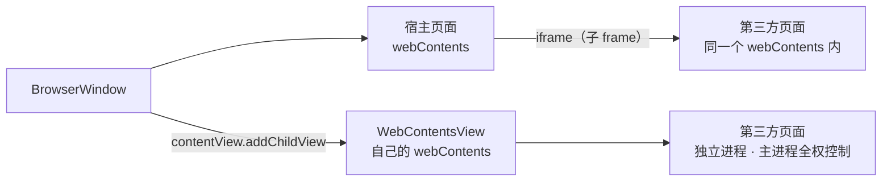

import { Canvas, Controls, Meta } from '@storybook/addon-docs/blocks';

import * as WebEmbedsStories from './web-embeds.stories';

<Meta of={WebEmbedsStories} name="Docs" />

# 嵌入网页

「[webContents](?path=/docs/webcontents--docs)」一课把窗口里的"页面这一层"补全，但装进去的一直是自己的页面。本课解决另一半：**把别人的网页装进你的窗口**。Electron 里有三种放法——写在页面 HTML 里的 `iframe`、主进程创建的 `WebContentsView`，以及只配进历史的 `<webview>`。

先建立本课最重要的判断：**选嵌入方式，本质是在选这段第三方页面"活在谁的世界里"。** `iframe` 活在宿主页面的世界里：它是宿主 webContents 的子 frame，能不能显示由站点方的响应头决定，宿主 JS 能不能读由同源策略决定。`WebContentsView` 活在自己的世界里：独立 webContents、独立进程，只归主进程管，宿主页面完全不知道它存在。读完你应能预测：同一个拒绝被嵌的站点，`iframe` 白屏而 `WebContentsView` 照常显示；主进程能读跨源 `iframe` 的内容，宿主页面 JS 不能。



| 回查项 | `iframe` | `WebContentsView` | `<webview>` |
| --- | --- | --- | --- |
| 页面活在哪 | 宿主 webContents 的子 frame | 独立 webContents、独立进程 | OOPIF guest frame（历史） |
| 宿主页面能看到吗 | 在 DOM 里；跨源内容读不到 | 完全不可见 | 在 DOM 里 |
| 主进程控制入口 | `webContents.mainFrame.frames` | 自己的 `webContents` | （标签式 API） |
| 状态 | 标准能力 | 当前推荐 | 官方不建议使用 |

本课管嵌入方式本身；嵌入视图的会话分区见「[session 与存储](?path=/docs/session--docs)」，加载与导航事件见「[webContents](?path=/docs/webcontents--docs)」，拦截导航与新窗口见「[导航与弹窗控制](?path=/docs/navigation-control--docs)」。

## 快速上手

沿用「[安装](?path=/docs/install--docs)」一课创建的 Forge 项目，用 `WebContentsView` 把官网嵌进窗口底部，四个调用走完"创建 → 挂载 → 加载 → 布局"，需要联网。

打开 `src/index.js`，把 `WebContentsView` 加进 `require('electron')` 的解构，在 `createWindow` 里 `loadFile` 之后新增四行：

```js
const createWindow = () => {
  const win = new BrowserWindow({ width: 960, height: 640 });
  win.loadFile(path.join(__dirname, 'index.html'));

  // 本课新增：创建独立视图 → 挂上窗口 → 加载远程页面 → 摆好位置
  const embed = new WebContentsView();
  win.contentView.addChildView(embed);
  embed.webContents.loadURL('https://www.electronjs.org');
  embed.setBounds({ x: 0, y: 440, width: 960, height: 200 });
};
```

改的是主进程代码，运行中的终端输入 `rs` 重启（见「[第一次运行](?path=/docs/first-run--docs)」）。核对三个观察点：

1. 窗口底部出现官网页面——视图叠在宿主页面之上，宿主 `index.html` 里没有任何对应元素。
2. 打开宿主页面的 DevTools 审查元素，找不到这个嵌入区——它不是 DOM 的一部分，「挂载与布局」一节展开这条边界。
3. 拖拽窗口大小，嵌入区不跟随——bounds 是静态的，这是 WebContentsView 一节要处理的第一个问题。

完整参考实现（独立会话、resize 跟随、视图内导航拦截）在本课目录的 `webcontents-view.js`。

## 三种嵌入方式

无论选哪种，都是回答同一组问题——这段页面**跑在哪**（进程、崩溃、卡顿归谁），**宿主页面看得见吗**（数据边界），**谁控制它**（加载、布局、会话归谁管）。三种方式给出三组答案，下面的模拟把答案和"站点方拒绝嵌入"的后果并排呈现（真实 Electron 无法在浏览器里运行，这是对官方语义的模拟；各项判定的依据见对应小节）：

<Canvas of={WebEmbedsStories.Interactive} />
<Controls of={WebEmbedsStories.Interactive} />

| 读者操作 | 可观察证据 |
| --- | --- |
| 保持默认（iframe + X-Frame-Options: DENY） | 判定为 ERR_BLOCKED_BY_RESPONSE（-27），被拒 |
| 同一响应换 WebContentsView | 照常显示——嵌入许可头不约束顶层加载 |
| iframe + 允许嵌入 | 正常显示，但宿主 JS 仍读不到跨源内容 |
| 切到 webview（历史） | 需 `webviewTag: true` 才渲染，官方不建议使用 |

嵌入许可的判定矩阵（回查用，细节见「嵌入被拒」一节）：

| 目标站点响应 | `iframe` | `WebContentsView` |
| --- | --- | --- |
| 允许嵌入 | 正常显示（子 frame） | 正常显示（顶层加载） |
| `X-Frame-Options: DENY` / `SAMEORIGIN` | 拒绝 · ERR_BLOCKED_BY_RESPONSE（-27） | 照常显示 |
| `CSP: frame-ancestors` 拒绝 | 拒绝 · 同 -27 | 照常显示 |

一句话选型：**要当布局的一部分且站点允许 → `iframe`；要完整独立的页面（或站点拒绝被嵌）→ `WebContentsView`；`<webview>` 新代码不写。**

## iframe：页面内嵌

`iframe` 是标准 HTML 标签，写在宿主页面里就能用，不需要任何 Electron API——也因此它的能力与限制就是浏览器 iframe 的能力与限制，Electron 没有给它开后门：

```html
<iframe src="https://www.electronjs.org" style="width: 100%; height: 320px"></iframe>
```

完整宿主页示例见本课目录的 `iframe-host.html`。

### 同源与跨源

同源策略是宿主与嵌入内容之间的墙：**跨源 `iframe` 显示得出来，但宿主 JS 一根手指都伸不进去**——`iframe.contentDocument` 是 `null`，cookie、DOM、JS 变量全不可见。判断标准只有一条：两边 origin（协议 + 域名 + 端口）一致才算同源。这是浏览器安全模型的默认行为；`webSecurity: false` 能拆掉这堵墙，等于放弃「[安全清单](?path=/docs/security--docs)」里最重要的防线，不要当作常规手段。

可观察证据：跨源时宿主页面读 `contentDocument` 得到 `null`；同一时刻主进程经 `mainFrame.frames` 却能列出该 frame、读到它的 `url` 与 `origin`（「主进程操作子 frame」一节可复现）——同源策略只约束页面 JS 之间，不约束主进程。

子 frame 与宿主共用 webContents，所以 webContents 课的事件语义在这里都有下文：`did-fail-load` 的 `isMainFrame` 区分主/子 frame，子 frame 的失败从这里过；`did-navigate` 等导航事件只报主 frame；`executeJavaScript` 也只打主 frame——要进子 frame 得用 WebFrameMain（本节第三小节）。

### 嵌入被拒：X-Frame-Options 与 CSP

能不能显示，决定权在站点方。两种响应头表达"拒绝被嵌"：

| 响应头 | 语义 |
| --- | --- |
| `X-Frame-Options: DENY` | 任何页面都不许嵌我 |
| `X-Frame-Options: SAMEORIGIN` | 只许同源页面嵌我 |
| `Content-Security-Policy: frame-ancestors` `'none'` / `'self'` / 源列表 | CSP 版嵌入许可，表达力更强（可按源放行），现代站点优先用它 |

被拒的表现：frame 区域一片空白（Chromium 在 frame 里渲染错误页），宿主页面控制台报 `Refused to display ... in a frame`，Chromium 错误码 **ERR_BLOCKED_BY_RESPONSE（-27）**——官方注释：响应携带了未被满足的要求（X-Frame-Options、CSP ancestor 检查等）。

两条不直观的边界：

- **宿主页面几乎探测不到。** 被拒后 frame 里加载的是错误页，宿主侧 `iframe.onload` 与页面 `load` 照常触发（Chromium 通行行为）；页面 JS 拿不到响应头，跨源也读不进 frame。可靠的信号在主进程：`did-fail-load` 且 `isMainFrame` 为 `false`、`errorCode` 为 -27。
- **约束的是"被嵌入"，不是"被访问"。** 同一个地址用 `loadURL` 顶层加载完全不受这些头管辖——这正是 `WebContentsView` 能显示它们的原因。

出路按场景选：产品里想嵌的第三方整站被拒——尊重对方意愿，要么 `shell.openExternal` 交给默认浏览器（见「[打开外部资源](?path=/docs/shell--docs)」），要么改用 `WebContentsView`（在自家窗口里顶层浏览）；做"内嵌浏览器"类工具——`WebContentsView` 是正解；自用工具非要 `iframe`——`session.webRequest.onHeadersReceived` 能改写响应头强行放行（拦截原理见「[session 与存储](?path=/docs/session--docs)」），这违背站点方的嵌入意愿，不要进发布产品。

### 主进程操作子 frame：WebFrameMain

主进程不受同源策略限制：经 `WebFrameMain` 可以观察和操作宿主页面里的每一个 frame，跨源也不例外。

```js
const { webFrameMain } = require('electron');

win.webContents.on('did-finish-load', async () => {
  const { mainFrame } = win.webContents; // frame 树顶层
  console.log('主 frame：', mainFrame.url);

  for (const frame of mainFrame.frames) { // 直接子 frame
    console.log('子 frame：', frame.url, '· origin:', frame.origin);
    // 在该 frame 的页面世界执行代码——跨源也能拿到返回值
    const title = await frame.executeJavaScript('document.title');
    console.log('子 frame 标题：', title);
  }
});
```

入口与成员速查（与官方文档核对）：

| 入口 / 成员 | 说明 |
| --- | --- |
| `webContents.mainFrame` | 页面 frame 树的顶层 |
| `mainFrame.frames` | 直接子 frame（`WebFrameMain[]`） |
| `mainFrame.framesInSubtree` | 子树内全部 frame，含自身 |
| `webFrameMain.fromId(processId, routingId)` | 用导航事件的 `frameProcessId` / `frameRoutingId` 找回 frame；查无返回 `undefined` |
| `frame.url` / `frame.origin` / `frame.name` | 当前地址 / 源 / frame 名 |
| `frame.parent` / `frame.top` | 父 frame / 树顶；顶层 frame 的 `parent` 为 `null` |
| `frame.executeJavaScript(code[, userGesture])` | 在该 frame 执行代码，返回 `Promise` |
| `frame.reload()` / `frame.send()` / `frame.postMessage()` | 重载 frame、向 frame 推送消息 |
| `frame.isDestroyed()` / `frame.detached` | frame 随导航或进程退出销毁 / 脱离，跨回调使用前先判 |

边界：frame 不是稳定引用——页面一导航旧 frame 随时销毁；拿着 frame 跨回调用之前 `isDestroyed()`，事件处理里优先用事件参数的 `frameProcessId` / `frameRoutingId` 即时 `fromId`。

完整对照见本课目录的 `webframe-main.js`（同源策略与主进程权限并排验证）。

## WebContentsView：独立视图

`WebContentsView` 是主进程创建的原生视图，内含一个完整的 webContents。它不是页面里的元素，而是**叠在窗口内容之上的独立图层**：宿主页面的 CSS、DOM、JS 碰不到它，它也看不见宿主页面。它是 BrowserView 的继任者——BrowserView 自 Electron 29 起文档标注废弃："The BrowserView class is deprecated, and replaced by the new WebContentsView class"，老代码的迁移方向就是它。

### 挂载与布局

三个调用走完挂载与布局（官方示例写法；`contentView` 是窗口的内容视图，`BrowserWindow` 继承自 BaseWindow）：

```js
const { app, BrowserWindow, WebContentsView } = require('electron');

app.whenReady().then(() => {
  const win = new BrowserWindow({ width: 960, height: 640 });
  win.loadFile('index.html');

  const embed = new WebContentsView();
  win.contentView.addChildView(embed); // 挂到内容视图上
  embed.webContents.loadURL('https://www.electronjs.org');
  embed.setBounds({ x: 0, y: 440, width: 960, height: 200 }); // 相对父容器的坐标
});
```

两条必须记住的布局规则：

- **bounds 是静态的。** `setBounds` 只在调用那一刻生效，窗口缩放不会自动跟随——监听窗口 `resize` 重算（完整实现见本课目录 `webcontents-view.js`）。
- **后加的在上层。** `children` 的顺序即层叠顺序；把已有的 view 再次 `addChildView` 会把它提到最上层。

View 基类上的其余布局成员一行带过：`setBackgroundColor(color)` 打底色（避免远程页面加载前闪透）、`setVisible(false)` 隐藏、`setBorderRadius(radius)` 圆角、`setBackgroundBlur(radius)` 背景模糊（需先设带透明度的背景色才可见）。

边界：文档明示本模块在 `app` 的 `ready` 事件之前不能使用——放在 `createWindow` 里没有问题；Electron 内置类不允许用户代码子类化。

### 进程、会话与控制

独立 webContents 意味着「[webContents](?path=/docs/webcontents--docs)」一课的能力直接继承：自己的加载时间线（`did-finish-load` 各走各的）、自己的导航事件（`will-navigate`、`setWindowOpenHandler` 按视图单独挂）、自己的崩溃感知（`render-process-gone`）。控制它就是控制一个页面，只是遥控器整个在主进程手里。

会话经构造参数指定（分区语义见「[session 与存储](?path=/docs/session--docs)」）：

```js
const embed = new WebContentsView({
  webPreferences: {
    partition: 'persist:embed', // 独立会话：cookie、登录态不混入宿主窗口
    preload: path.join(__dirname, 'embed-preload.js'),
  },
});
```

隔离边界一句话：**宿主页面与嵌入视图之间没有任何通道**——不在同一个 DOM、不在同一个 JS 世界、互相不可见；数据交换必须经主进程转手（IPC 链路见「[双向调用](?path=/docs/ipc-invoke--docs)」）。嵌入许可头（X-Frame-Options / frame-ancestors）对它无效：约束的是"被嵌入 frame"，这里每次都是顶层加载。

两个实用点：点击视图区域后键盘输入一般自动跟随，遇到焦点不跟随的场合显式调 `embed.webContents.focus()`（通行行为，文档未单列）；调试嵌入页用 `embed.webContents.openDevTools({ mode: 'detach' })` 独立窗口打开，视图内停靠渲染不完整（通行做法）。

## webview：历史方案

`<webview>` 是 Electron 特有标签：写在页面里像 `iframe`，主进程却能拿到它独立的 webContents——曾长期是嵌入第三方页面的主流方案。官方文档如今在页面开头给出警告：webview 基于 Chromium 的 webview、正经历大幅架构变动，**"目前建议不要使用 webview 标签，并考虑替代方案"**——点名的替代就是 `iframe` 与 `WebContentsView`（或干脆不嵌）。它默认关闭：`webPreferences.webviewTag: true` 才会渲染；即便启用，底层是 OOPIF（进程外 iframe），行为如跨域 iframe，嵌入许可头对它同样生效。

本课对它只作历史说明、不展开 API。老代码的迁移方向：删标签，在主进程 `new WebContentsView()` + `addChildView` + `setBounds`；新代码没有理由再写它。

## 最佳实践

- **外部网站默认不嵌。** 用户要"打开官网/帮助页"，`shell.openExternal` 是默认答案（见「[打开外部资源](?path=/docs/shell--docs)」）；真有站内嵌需求（内嵌浏览器、客服组件、邮件正文）才进本课。被 XFO 拒绝时，换 `WebContentsView` 是"在我窗口里浏览这个站点"，可以；剥响应头强行 `iframe` 是"伪装成我页面的一部分"，不要。
- **选型记一条线。** 要当布局的一部分（卡片、预览、小部件）且站点允许 → `iframe`；要完整独立页面、独立会话、主进程控制，或站点拒绝被嵌 → `WebContentsView`；`<webview>` 只在维护老代码时认识它。
- **给嵌入视图独立 partition。** `persist:` 前缀的独立分区让 cookie、登录态与宿主窗口互不沾染，清理也能单独清（见「[session 与存储](?path=/docs/session--docs)」）；共用默认会话会把站点登录态串进宿主页面。
- **WebContentsView 的布局自己管。** bounds 不自动跟随窗口缩放，挂上 `resize` 重算；视图挂在窗口的 `contentView` 上，生命周期跟着窗口走。

## 常见问题

- iframe 区域白屏，控制台报 `Refused to display ... in a frame`
  站点方拒绝被嵌入（X-Frame-Options 或 CSP frame-ancestors），不是代码写错。处理三选一：改用 `WebContentsView`（顶层加载不受这些头约束）、`shell.openExternal` 交给默认浏览器、自用工具经 `onHeadersReceived` 剥头（别进发布产品）。
- iframe 明明加载失败，宿主页面的 `load` 事件却照常触发，页面 JS 判断不了
  被拒后 frame 里加载的是错误页，也是一次正常加载（Chromium 通行行为）；页面侧拿不到响应头，跨源读不进 frame。可靠信号在主进程：`did-fail-load` 且 `isMainFrame` 为 `false`、`errorCode` -27（ERR_BLOCKED_BY_RESPONSE）。
- WebContentsView 盖住了窗口里的按钮；窗口缩放后嵌入区大小没跟上
  同一个原因的两面：它是叠在页面之上的原生图层，DOM 层级管不到；bounds 只在 `setBounds` 调用时生效。处理：布局时给嵌入区留好位置，监听窗口 `resize` 重算 bounds。
- 点击嵌入视图后键盘输入没反应
  焦点没跟过去。点击后显式调 `embed.webContents.focus()`（通行行为，文档未单列）。
- 老项目里 `<webview>` 渲染不出来
  它默认关闭：`webPreferences.webviewTag: true` 才启用；且官方文档已明确不建议使用。新代码直接迁到 `WebContentsView`：删标签、主进程创建视图 + `addChildView` + `setBounds`。
- 想读跨源 iframe 里的内容，`contentDocument` 拿不到
  同源策略在起作用，页面侧无解。主进程不受限：`win.webContents.mainFrame.frames` 找到该 frame，`frame.executeJavaScript(...)` 取值（见「主进程操作子 frame」）。

## 总结回顾

摘要：

在窗口里嵌入第三方网页有三种放法，分界线是"这段页面活在谁的世界里"。`iframe` 写在宿主页面 HTML 里、与宿主共用 webContents：显示与否由站点方的嵌入许可头（X-Frame-Options / CSP frame-ancestors）决定，被拒以 ERR_BLOCKED_BY_RESPONSE（-27）收场，且宿主页面几乎探测不到——`load` 照常触发，信号在主进程 `did-fail-load`（`isMainFrame` 为 `false`）；宿主 JS 受同源策略约束读不到跨源内容，主进程经 `WebFrameMain`（`mainFrame` / `frames` / `fromId` / `executeJavaScript`）不受限，但 frame 随导航销毁，跨回调使用前要判活。`WebContentsView` 是主进程创建的独立视图（BrowserView 自 Electron 29 废弃，由它取代）：`contentView.addChildView` 挂载、`setBounds` 布局（静态，resize 时重算、后加在上层）、`webPreferences.partition` 独立会话、与宿主页面零通道、嵌入许可头管不到顶层加载。`<webview>` 官方明确不建议使用、默认关闭，只作历史说明。选型一条线：布局的一部分且站点允许用 `iframe`；完整独立页面、独立会话、主进程控制或站点拒绝被嵌用 `WebContentsView`。

一句话：

> 选嵌入方式，本质是在选第三方页面活在谁的世界里——`iframe` 活在宿主页面的世界里，受同源策略与站点方嵌入许可头管辖；`WebContentsView` 活在自己的世界里，只归主进程管。

知识要点：

- 三种嵌入方式分别把页面放在谁的世界里？宿主页面各自能看到什么？
- `X-Frame-Options` 与 CSP `frame-ancestors` 各表达什么？被拒时 Chromium 错误码是什么？
- 为什么 iframe 被拒宿主页面探测不到？可靠的信号在哪里？
- 主进程怎么枚举子 frame、怎么在跨源 frame 里执行代码？宿主页面 JS 为什么不行？
- WebContentsView 的挂载三步是什么？bounds 与窗口缩放是什么关系？
- 怎么给嵌入视图独立会话？宿主页面与嵌入视图之间怎么传数据？
- `<webview>` 的现状是什么？迁移方向是哪里？

## 参考资料

- [Electron API：WebContentsView](https://www.electronjs.org/docs/latest/api/web-contents-view)
  本课事实主来源：构造参数（`webPreferences` / 采纳既有 `webContents`）、只读属性 `view.webContents`、官方 `contentView.addChildView` + `setBounds` 示例、"app ready 之前不可用"注记。
- [Electron API：View](https://www.electronjs.org/docs/latest/api/view)
  `addChildView(view[, index])`、`children`、`setBounds` 相对父容器、重复添加置顶、`setBackgroundColor` / `setVisible` / `setBorderRadius` / `setBackgroundBlur`（模糊需带透明度的背景色）。
- [Electron API：BrowserView](https://www.electronjs.org/docs/latest/api/browser-view)
  废弃注记（Electron 29 起）："The BrowserView class is deprecated, and replaced by the new WebContentsView class"。
- [Electron API：webview tag](https://www.electronjs.org/docs/latest/api/webview-tag)
  "建议不要使用 webview 标签并考虑替代方案"的官方警告与替代清单、`webviewTag` 默认关闭、OOPIF 行为如跨域 iframe。
- [Electron API：WebFrameMain](https://www.electronjs.org/docs/latest/api/web-frame-main)
  `mainFrame` / `frames` / `framesInSubtree` / `fromId` / `executeJavaScript` / `url` / `origin` / `parent` / `isDestroyed` / `detached` 等成员语义。
- [MDN：X-Frame-Options](https://developer.mozilla.org/en-US/docs/Web/HTTP/Headers/X-Frame-Options)
  `DENY` / `SAMEORIGIN` 语义。
- [MDN：CSP frame-ancestors](https://developer.mozilla.org/en-US/docs/Web/HTTP/Headers/Content-Security-Policy/frame-ancestors)
  指令语义：按源控制谁可以嵌入当前页面。
- [Chromium 网络错误码表](https://raw.githubusercontent.com/chromium/chromium/main/net/base/net_error_list.h)
  `ERR_BLOCKED_BY_RESPONSE`（-27）的官方注释：响应携带未被满足的要求（X-Frame-Options、CSP ancestor 检查等）。
