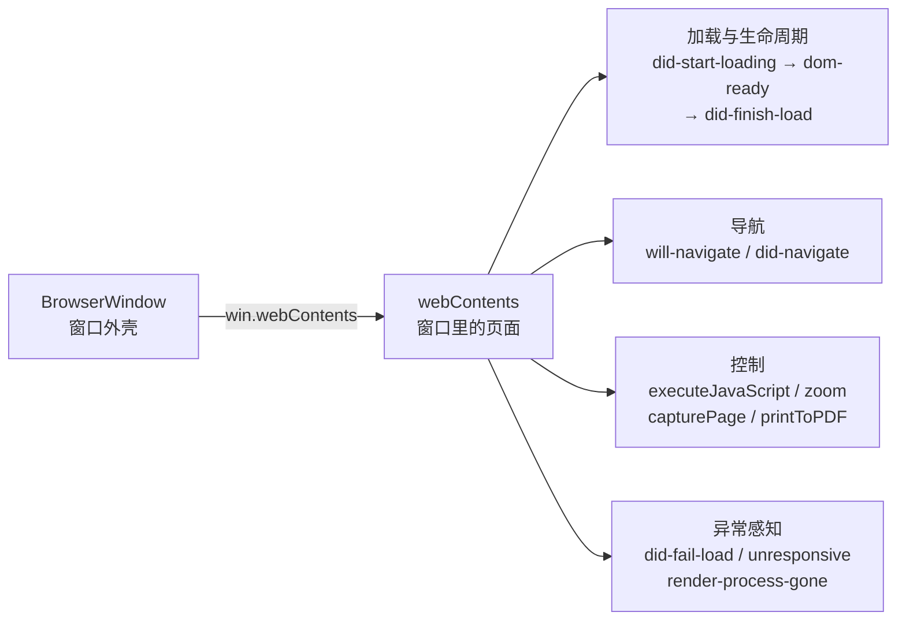

import { Canvas, Controls, Meta } from '@storybook/addon-docs/blocks';

import * as WebContentsStories from './webcontents.stories';

<Meta of={WebContentsStories} name="Docs" />

# webContents

「[创建窗口](?path=/docs/windows--docs)」一课说过：`new BrowserWindow()` 造的是外壳，`loadFile` / `loadURL` 装的是内容。本课把"内容这一层"补全——窗口里的页面在主进程手里对应一个 `webContents` 对象：页面加载到哪一步了、用户想跳去哪、往页面里执行一段代码、调缩放、截图、存 PDF、感知页面崩溃，全都从它出发。

先建立本课最重要的判断：**`BrowserWindow` 管窗口外壳，`webContents` 管窗口里的页面。**主进程代码里凡是 `win.webContents.` 前缀的调用，操作的都是页面而不是窗口。读完你应能预测：在 `did-finish-load` 里 `executeJavaScript` 能改写页面；用户点外链时 `will-navigate` 先于一切加载事件出现，`preventDefault()` 能让事件流当场终止；`errorCode` 为 -3 的 `did-fail-load` 不是真正的加载失败。



| 回查项 | 值 / 时机 |
| --- | --- |
| 拿到对象 | `win.webContents`（窗口实例属性，主进程最常见的入口） |
| 全局视角 | `webContents.getAllWebContents()`（含 webview、DevTools 的实例） |
| 加载开始 | `did-start-loading`（spinner 转起） |
| DOM 就绪 | `dom-ready`（顶层文档加载完成） |
| 加载完成 | `did-finish-load`（onload 已分发；每次导航、刷新都会再触发） |
| 加载失败 | `did-fail-load`（`errorCode` / `errorDescription` / `validatedURL` / `isMainFrame`） |
| 用户导航开始 | `will-navigate`（`preventDefault()` 可拦截；程序化 `loadURL` 不触发） |
| 导航完成 | `did-navigate`（`url`、`httpResponseCode`，非 HTTP 为 -1） |
| 页内导航 | `did-navigate-in-page`（锚点、hash，页面不重载） |
| 执行页面代码 | `executeJavaScript(code)` → `Promise<any>`，等页面停止加载后才执行 |
| 缩放 | `setZoomLevel(0)` = 100%，每级 ±20%（scale = 1.2^level） |
| 截图 / 存 PDF | `capturePage()` → `Promise<NativeImage>`；`printToPDF()` → `Promise<Buffer>` |
| 崩溃感知 | `render-process-gone`（「[主进程推送](?path=/docs/ipc-push--docs)」已讲） |

## 快速上手

沿用「[安装](?path=/docs/install--docs)」一课创建的 Forge 项目，在 `src/index.js` 的 `createWindow` 里、`loadFile` 那一行**之前**插入下面的监听（挂晚了会错过 `did-start-loading`）：

```js
const { webContents } = mainWindow;

webContents.on('did-start-loading', () => console.log('[加载] 开始'));
webContents.on('dom-ready', () => console.log('[加载] DOM 就绪'));
webContents.on('did-finish-load', () => {
  console.log('[加载] 完成（onload 已分发）');
  // 从主进程执行一段页面代码：改写窗口标题
  webContents.executeJavaScript("document.title = '由主进程改写'");
});
webContents.on('did-fail-load', (_event, code, desc, url, isMainFrame) => {
  if (isMainFrame) console.error('[加载] 失败', code, desc, url);
});
webContents.on('did-stop-loading', () => console.log('[加载] 结束'));
```

改的是主进程代码，应用在运行时要在终端输入 `rs` 重启（见「[第一次运行](?path=/docs/first-run--docs)」）。重启后核对四个观察点：

1. 终端按 `[加载] 开始 → DOM 就绪 → 完成 → 结束` 打印——这就是一次加载的时间线（`did-start-loading` → `dom-ready` → `did-finish-load` → `did-stop-loading`），输出打在终端而不是页面 DevTools。
2. 窗口标题变成「由主进程改写」——主进程在页面世界里执行了代码，`executeJavaScript` 的最小证据。
3. 按 Cmd/Ctrl+R 刷新：整条时间线再走一遍——`did-finish-load` 每次加载都会触发（3.3 推送门控的根据）。
4. 把 `loadFile` 的文件名故意改错再重启：终端打出 `[加载] 失败`（带 errorCode）且没有「完成」一行；同时终端**不会**出现 unhandled rejection——`loadFile` 的 Promise 已自动挂了 noop rejection handler，失败只体现在事件里（验证完改回）。

完整参考实现（含导航事件监听）在本课目录的 `page-console.js`。

## 拿到 webContents

主进程里最常见的入口是窗口实例的属性 `win.webContents`。但实例数量不等于窗口数量：`<webview>` 标签、打开的 DevTools 各自有自己的 webContents，需要全局视角时用模块上的类方法（`webContents` 既是模块名也是实例名，注意区分）：

```js
const { webContents } = require('electron'); // 模块：提供类方法
const wc = mainWindow.webContents;           // 实例：这一窗口里的页面

// 类方法：全局视角
webContents.getAllWebContents();     // 应用里所有实例（含 webview、DevTools）
webContents.getFocusedWebContents(); // 当前聚焦的实例；没有则 null
webContents.fromId(wc.id);           // 按 id 找回；找不到返回 undefined
```

两个使用判断：**广播前想清楚范围**——`getAllWebContents()` 的结果里混着 DevTools 等非页面实例，逐个 `send` / `executeJavaScript` 前要过滤；**跨模块传递存 id 不存实例**——实例随窗口销毁失效，id 用 `fromId` 查不到只会返回 `undefined`，不会拿着悬空对象调用。

实例属性速查：

| 实例属性 | 含义与边界 |
| --- | --- |
| `id` | 应用内唯一的数字 id，跨模块传递用它 |
| `session` | 该页面使用的会话；分区、cookie、缓存见「[session 与存储](?path=/docs/session--docs)」 |
| `mainFrame` | 页面 frame 树的顶层 WebFrameMain；子 frame 操作见「[嵌入网页](?path=/docs/web-embeds--docs)」 |
| `devToolsWebContents` | 配套 DevTools 的 webContents；文档提醒不要保存，DevTools 关闭后即失效 |

## 加载生命周期

一次加载就是 spinner 从转到停的一段区间。webContents 用两组事件描述它：一组报进度（`did-start-loading`、`dom-ready`、`did-finish-load`），一组报结果（`did-fail-load`、`did-stop-loading`）。「[主进程推送](?path=/docs/ipc-push--docs)」用 `did-finish-load` 做推送门控，本节把整条时间线补齐。

### 生命周期事件

| 事件 | 触发时机 | 典型用途 |
| --- | --- | --- |
| `did-start-loading` | spinner 转起，加载开始 | 显示加载状态、禁用按钮 |
| `dom-ready` | 顶层文档加载完成 | DOM 可操作的最早时机 |
| `did-finish-load` | 导航完成：onload 已分发、spinner 已停 | 推送门控（3.3）、`executeJavaScript` 的起点；每次导航、刷新都会再触发 |
| `did-fail-load` | 加载失败 | 错误页、重试 |
| `did-stop-loading` | spinner 停转——无论成败都会发 | 收尾清理 |

失败事件自带定位信息，`isMainFrame` 是第一个要看的参数——iframe 等子 frame 的失败也会发到这里：

```js
webContents.on('did-fail-load', (event, errorCode, errorDescription, validatedURL, isMainFrame) => {
  if (!isMainFrame) return; // 只关心主 frame 的失败
  console.error('主 frame 加载失败：', errorCode, errorDescription, validatedURL);
});
```

| 参数 | 含义 |
| --- | --- |
| `errorCode` | Chromium 网络错误码（-3 的特殊性见常见问题） |
| `errorDescription` | 错误名，如 `ERR_NAME_NOT_RESOLVED` |
| `validatedURL` | 校验后的目标地址 |
| `isMainFrame` | 是否主 frame；过滤子 frame 噪音 |

同族一行带过：`did-fail-provisional-load` 与它成对，专门在加载被取消（如调用了 `window.stop()`）时触发。

### 主动加载与重载

`loadFile` / `loadURL` 在「创建窗口」一课讲的是"装什么"，这里补返回值语义：**事件与 Promise 是同一条时间线的两种订阅方式**——Promise 在 `did-finish-load` 时 resolve、在 `did-fail-load` 时 reject。文档注明已自动附了 noop rejection handler，不写 `catch` 也不会报 unhandled rejection——代价是忘了处理时，失败静默地只出现在事件里。有 `beforeunload` 处理器的页面，除非处理 `will-prevent-unload`，加载会以 `did-fail-load` 收场。

只做一次的事可以直接 `await`（与监听 `did-finish-load` 等价，3.3 已讲）；持续监听仍走事件。

```js
webContents.reload();              // 正常重载
webContents.reloadIgnoringCache(); // 绕过缓存重载——"改了没生效"的第一动作
webContents.stop();                // 停止进行中的导航
```

### 一次加载的事件时间线

五种典型场景的事件序列与收场。模拟直接回答两个问题：事件按什么顺序展开；什么样的 `did-fail-load` 不是真失败。

<Canvas of={WebContentsStories.Interactive} />
<Controls of={WebContentsStories.Interactive} />

| 操作 | 可观察证据 |
| --- | --- |
| 保持默认（本地页面加载成功） | 时间线以 `did-finish-load` → `did-stop-loading` 收场 |
| 切到「远程地址加载失败」 | 以 `did-fail-load`（真实错误码）收场，没有 `did-finish-load` |
| 切到「加载中调用 stop()」 | 同样出现 `did-fail-load`，但错误码是 -3，收场是「中止」而非「失败」 |
| 切到「点击外链：拦截」 | 只有 `will-navigate` 一行，`preventDefault()` 之后事件流当场终止 |
| 切到「点击外链：放行」 | `will-navigate` 之后转入新页面的加载时间线 |

时间线是简化模型：省略 `did-start-navigation`、`did-frame-*` 等内部事件；相邻事件的先后顺序为通行观察，文档只定义各事件自身的语义。

## 导航事件

加载事件描述"这一次加载"，导航事件描述"页面要去哪、去了没"。两者交织在同一条时间线里：用户或页面发起的跳转先触发 `will-navigate`，放行后转入上一节的加载时间线；主进程调 `loadURL` 这类程序化导航则跳过 `will-navigate` 直接进入加载。

### will-navigate：拦截的唯一时机

`will-navigate` 在"用户或页面想在主 frame 上发起导航"时触发——点链接、改 `location`。两个不触发的场景文档写得很明确：**程序化导航**（`loadURL`、`back` 等 API 发起）；**页内导航**（点锚点、改 `location.hash`，走 `did-navigate-in-page`）。也就是说它是"对外来导航"把关的口子，不是所有导航的总闸：

```js
win.webContents.on('will-navigate', (event, url) => {
  // 只放行应用自己的页面，其余拦下（完整白名单策略见「导航与弹窗控制」）
  if (!url.startsWith('file://')) {
    event.preventDefault();
  }
});
```

`preventDefault()` 拦下后不产生任何加载事件，URL 不变（上面的模拟可复现）。`url` 位置参数在文档中已标记废弃，等价的新形式是事件对象上的 `event.details`（含 `url` / `isMainFrame` / `frame` 等）；旧写法仍可用，同一个项目里保持一致即可。两个边界：`window.open` 与 `target="_blank"` 开新窗口不走这里，归 `setWindowOpenHandler` 管（「[导航与弹窗控制](?path=/docs/navigation-control--docs)」）；标题改写事件 `page-title-updated` 同样挂在 webContents 上，「创建窗口」一课已讲。

### did-navigate 与页内导航

`did-navigate` 在主 frame 导航完成时触发——此时导航已提交、URL 已变，参数 `url` 与 `httpResponseCode`（非 HTTP 导航为 -1）。它适合记"当前页面在哪"这本账：导航历史、导航后重设缩放（见常见问题）。

`did-navigate-in-page` 在页内导航时触发——锚点、hashchange、`history.pushState`。URL 变了但页面不重载：SPA 路由通常落在这里，`did-finish-load` 不会再来一次。

```js
webContents.on('did-navigate', (_event, url, code) => {
  console.log('当前页面：', url, `HTTP ${code}`);
});
webContents.on('did-navigate-in-page', (_event, url) => {
  console.log('页内跳转：', url);
});
```

`will-redirect` 一行带过：服务端重定向（如 302）时触发；对它 `preventDefault()` 取消的是整个导航，不只是重定向。

## 主进程控制页面

拿到 webContents 后，主进程对页面有一整套直接控制手段。按"执行、外观、产物"分三组：`executeJavaScript` 往页面里执行代码，zoom 调页面缩放，`capturePage` / `printToPDF` 从页面拿图像和 PDF 产物；其余控制手段收进一张回查表。

### executeJavaScript

在页面的默认世界执行一段代码——与 DevTools 控制台同一个世界，能碰到页面自己的变量和 `contextBridge` 暴露的 API。`contextIsolation` 开着时，preload 跑在隔离世界（世界 id 999），要在那边执行得用 `executeJavaScriptInIsolatedWorld`。

返回 `Promise<any>`：**resolve 值就是代码最后一个表达式的求值结果**；代码求值为 rejected promise 时，Promise 以同一原因 reject。时机上文档写明：执行会挂起直到页面停止加载——加载中途调用不会丢，会等加载结束再执行。

```js
webContents.on('did-finish-load', async () => {
  // 改页面：一段语句即可
  await webContents.executeJavaScript("document.title = '由主进程改写'");

  // 取页面数据：最后一个表达式的值就是结果
  const items = await webContents.executeJavaScript(
    'document.querySelectorAll("li").length',
  );
  console.log('页面 li 数量：', items);
});
```

第二个参数 `userGesture` 传 `true` 相当于给了用户手势，`requestFullscreen` 这类需要手势的 API 才能成功。

### 缩放

两套刻度描述同一个状态：`setZoomLevel` 用级别——0 是原始大小，每 ±1 级 = ±20%（公式 scale = 1.2^level，范围钳制在约 25%–500%）；`setZoomFactor` 用倍数——百分比 ÷ 100，0.25–5.0 之外钳制。配套的 `zoomLevel` / `zoomFactor` 属性可读写当前值。

```js
webContents.setZoomLevel(1);    // 120%（1.2^1）
webContents.setZoomFactor(1.5); // 150%——同一状态的两种刻度，别各设各的
```

要紧的边界是传播范围：**Chromium 的缩放策略默认按同源记账**——同一域名的缩放级别在所有窗口间传播，导航到别的域名则按那个域记录的级别显示。想让每个 webContents 独立记账，用 `setZoomMode('isolated')`（Electron 44 起，另有 `default` / `manual` / `disabled`；`isolated` 与 `manual` 跨导航保持）。触控板捏合缩放由 `setVisualZoomLevelLimits(min, max)` 控制——Electron 里视觉缩放默认禁用。

### 截图与打印

```js
import { writeFile } from 'node:fs/promises';

// 截图：整个页面或指定矩形，返回 NativeImage
const image = await webContents.capturePage();
await writeFile('page.png', image.toPNG());

// 存 PDF：返回 Buffer，写文件即得
const pdf = await webContents.printToPDF({ printBackground: true });
await writeFile('page.pdf', pdf);
```

边界与细节：`capturePage` 的可见性语义是"窗口隐藏且捕获计数非零时，页面被视为可见"，`isBeingCaptured()` 报当前是否处于捕获中；`print([options], callback)` 唤起系统打印，callback 收 `success` 与 `failureReason`，`silent: true` 时静默用系统默认打印机；屏幕级（而非页面级）捕获归 `desktopCapturer`（「[屏幕捕获](?path=/docs/desktop-capture--docs)」）。

### 导航历史与其他控制

历史导航的新旧两套写法：`goBack` / `canGoBack` / `clearHistory` 这组实例方法自 Electron 32 起文档标记废弃，改用 `navigationHistory` 上的同名能力：

```js
const history = webContents.navigationHistory;
if (history.canGoBack()) history.goBack();
```

其余控制手段按目的回查：

| 目的 | 调用 | 要点 |
| --- | --- | --- |
| 打开 / 收起 DevTools | `openDevTools([options])` / `closeDevTools()` / `toggleDevTools()` | `mode` 默认沿用上次停靠状态 |
| 页面静音 | `setAudioMuted(true)` / `isAudioMuted()` | 只作用于这一个页面 |
| 覆盖 UA | `setUserAgent(ua)` | 只作用于本页面 |
| 剪贴板编辑命令 | `copy()` / `cut()` / `paste()` / `selectAll()` | 自定义右键菜单的执行端（菜单入口见「[菜单](?path=/docs/menus--docs)」） |
| 注入输入事件 | `sendInputEvent(input)` | 文档要求宿主窗口聚焦时才生效 |
| 后台节流开关 | `setBackgroundThrottling(false)` | 影响动画、定时器与 Page Visibility API，见常见问题 |

## 崩溃与无响应

页面这一层有两种"没了"：崩了（进程消失）和卡了（无响应），感知点都在 webContents 上。

`render-process-gone` 的事件语义、`details.reason` / `details.exitCode` 与"先停事件源再恢复"的处理动作，「[主进程推送](?path=/docs/ipc-push--docs)」一课已经讲过——那里把它当推送的接收方讲，这里把它放回事件全景：凡拿到 webContents 的地方（窗口页、webview）都用同一方式感知该页面的死亡，配合 `isDestroyed()` 判断实例生死。日志与崩溃收集的完整链路见「[日志与崩溃收集](?path=/docs/logging-crashes--docs)」。

卡死与恢复是另一对事件：

```js
webContents.on('unresponsive', () => console.warn('页面卡死了'));
webContents.on('responsive', () => console.info('页面恢复了'));
```

## 最佳实践

- **`executeJavaScript` 与 preload 暴露 API 分工。**一次性、主进程驱动的操作（初始化注入、抓页面数据、改标题）用 `executeJavaScript` 直给；页面需要长期、结构化调用的能力走 preload 白名单 + IPC（3.2 / 3.3 的链路）。业务逻辑长进 `executeJavaScript` 的字符串里，两端都难调试、也没有类型检查。
- **导航的两个口子都要管。**`will-navigate` 只拦"当前窗口的跳转"，`window.open` 与 `target="_blank"` 走 `setWindowOpenHandler`——只堵一个口子是导航安全最常见的疏漏（完整策略见「[导航与弹窗控制](?path=/docs/navigation-control--docs)」）。
- **缩放策略显式声明。**默认同源传播会让同域名的多个窗口共享缩放；多窗口应用需要各窗口独立缩放时，创建窗口后设 `setZoomMode('isolated')`，不要依赖默认值的传播行为。
- **失败处理优先挂在事件上。**`loadURL` 的 Promise 已自动挂 noop rejection handler，忘写 `await` / `catch` 时失败静默；统一监听 `did-fail-load` 做错误页与日志，Promise 只用在"加载完再做一件事"的一次性时序里。

## 常见问题

- 终端出现 `errorCode` 为 -3 的 `did-fail-load`，像是加载失败，页面其实正常
  -3 是 ERR_ABORTED：加载进行中又发起新导航、调用 `stop()` 或页面自己跳走，当前这次加载就以"中止"收场，Chromium 会发一个 errorCode 为 -3 的 `did-fail-load`（这是通行行为，文档页面未列出该码）。处理动作：按 `errorCode` 分类——-3 不弹错误页、只记日志，真正的失败（如 -105 域名解析失败）才走错误处理。事件序列可在本课「一次加载的事件时间线」模拟的 stop() 场景核对。
- `executeJavaScript` 的 Promise 一直不 resolve，或拿到的值不对
  前者看时机：执行要等页面停止加载，页面一直加载不完就轮不到你的代码——放到 `did-finish-load` 之后调用。后者看表达式：resolve 值是最后一个表达式的求值结果，取值要写成表达式或带 `return` 的函数体（`document.title` 有值，但 `function () { document.title }` 求值是 undefined）。
- `will-navigate` 拦不住跳转；反过来程序化 `loadURL` 也没触发它
  两面是同一个边界：`will-navigate` 只覆盖用户或页面发起的导航。处理动作：拦外部跳转监听 `will-navigate` + `preventDefault()`；拦新开窗口用 `setWindowOpenHandler`；程序化加载的把关放在调用 `loadURL` 之前（完整策略见「[导航与弹窗控制](?path=/docs/navigation-control--docs)」）。
- 给页面设了缩放，其他窗口同域名的页面也跟着变；导航到别的域名后缩放又"丢了"
  同源缩放策略：同域缩放级别在所有窗口间传播，跨域导航后按目标域记录的级别显示。处理动作：需要按窗口隔离时 `setZoomMode('isolated')`；需要固定比例时在 `did-navigate` 后重新设置。
- 窗口一隐藏，页面里的定时器和动画就变慢甚至停了
  后台节流：webContents 默认在页面不可见时节流动画与定时器，还影响 Page Visibility API。处理动作：依赖精确定时器的页面用 `setBackgroundThrottling(false)` 关闭；注意 Electron 28 起该设置作用于宿主窗口内的所有 webContents，关闭前想清楚范围。

## 总结回顾

摘要：

本课把窗口里的"页面这一层"补全。主进程通过 `win.webContents` 拿到页面遥控器，全局视角有 `getAllWebContents()` / `getFocusedWebContents()` / `fromId()`，跨模块传递存 id 不存实例。加载生命周期用一组事件描述 spinner 从转到停的区间：`did-start-loading` → `dom-ready` → `did-finish-load` → `did-stop-loading`，失败以 `did-fail-load`（`errorCode` / `errorDescription` / `isMainFrame`）收场；`loadURL` / `loadFile` 的 Promise 与事件是同一条时间线的两种订阅。导航事件管"页面要去哪"：`will-navigate` 是拦截用户与页面发起导航的口子（程序化 `loadURL` 与页内导航不触发），放行后 `did-navigate` / `did-navigate-in-page` 记账。控制手段上，`executeJavaScript` 在页面默认世界执行代码、返回最后一个表达式的值，缩放两套刻度且默认同源传播（`setZoomMode` 可改），`capturePage` / `printToPDF` 拿图像与 PDF 产物，历史导航走 `navigationHistory`，DevTools、静音、编辑命令各有落点。页面死亡与卡死分别由 `render-process-gone` 与 `unresponsive` / `responsive` 感知。

一句话：

> BrowserWindow 管窗口外壳，webContents 管窗口里的页面——加载、导航、执行、缩放、截图与崩溃感知，都从 `win.webContents` 出发。

知识要点：

- 主进程怎么拿到 webContents？`getAllWebContents()` 返回的不只是窗口页面，还有什么？
- 一次成功加载依次触发哪些生命周期事件？`did-finish-load` 为什么会反复触发？
- `did-fail-load` 有哪些参数？`errorCode` -3 说明什么？
- `will-navigate` 覆盖哪些导航、不覆盖哪些？拦截之后事件流怎样收场？
- `did-navigate` 与 `did-navigate-in-page` 的区别是什么？
- `executeJavaScript` 在哪个世界执行？返回值是什么、执行时机受什么约束？
- 缩放级别与缩放倍数怎么换算？"同源传播"是什么意思、怎么改成按窗口隔离？
- 截图、存 PDF 各用哪个方法？历史导航的新 API 是什么？
- 页面卡死与崩溃分别从哪个事件感知？

## 参考资料

- [Electron API：webContents](https://www.electronjs.org/docs/latest/api/web-contents)
  本课主要依据：类方法与各事件的参数、`did-finish-load` / `did-fail-load` 语义、`will-navigate` 不覆盖程序化与页内导航的注记、`executeJavaScript` 的返回值与挂起执行、`setZoomLevel` 的 1.2^level 公式与同源缩放注记、`setZoomMode` 各档含义、`capturePage` 可见性语义、`printToPDF` / `print` 返回值、历史方法的 `navigationHistory` 迁移、`setBackgroundThrottling` 影响范围。
- [Electron API：BrowserWindow](https://www.electronjs.org/docs/latest/api/browser-window)
  `win.webContents` 属性出处；`loadFile` / `loadURL` 的装内容视角见「创建窗口」一课。
- [Electron API：NativeImage](https://www.electronjs.org/docs/latest/api/native-image)
  `capturePage` 返回值的 `toPNG()` / `toDataURL()` 等图像操作。
- [Electron API：RenderProcessGoneDetails](https://www.electronjs.org/docs/latest/api/structures/render-process-gone-details)
  `reason` 取值与 `exitCode` 含义；处理动作见「主进程推送」一课。
