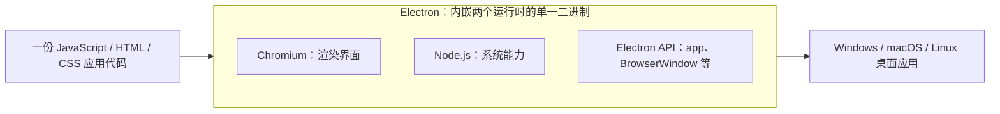
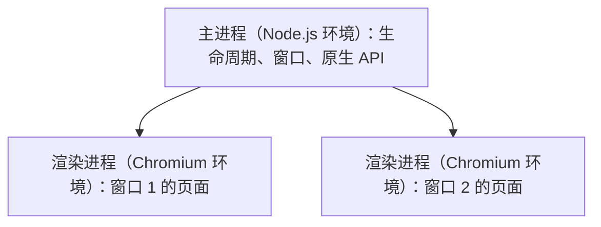

import { Meta } from '@storybook/addon-docs/blocks';

<Meta id="what-is-electron" title="起步/认识 Electron" name="Docs" />

# 认识 Electron

这一课建立对 Electron 的整体判断：它是什么、由什么组成、适合做什么、代价是什么。本课是概念课，不装环境、不写项目代码；读完你应该能判断自己的项目适不适合用 Electron，并说得出判断依据。

Electron 的全部价值来自一个组合：把 Chromium（渲染界面）和 Node.js（系统能力）嵌进同一个二进制。一份 JavaScript 代码因此既能画出网页级的界面，又能碰触文件系统、系统托盘这类桌面能力。



| 组成部分 | 负责什么 | 回查要点 |
| --- | --- | --- |
| Chromium | 把 HTML、CSS、JavaScript 渲染成界面 | 每个窗口一个渲染进程，默认没有 Node 权限 |
| Node.js | 文件、网络、系统信息与 npm 生态 | 主进程是完整的 Node.js 环境 |
| Electron API | 应用层接口（`app`、`BrowserWindow`、`shell` 等） | 多数 API 只在单一进程可用，用前先查归属 |

## Electron 是什么

官方定义：Electron 是一个用 JavaScript、HTML 和 CSS 构建桌面应用的框架；它把 Chromium 和 Node.js 嵌入自己的二进制，让一份 JavaScript 代码库能产出 Windows、macOS、Linux 三个平台的应用。项目开源，由 OpenJS Foundation 主导维护，随 Chromium 的升级节奏持续发布新版本。

理解这个定义，抓住三点：

- **它是运行时加框架，不是语言，也不是 UI 框架。** 写界面仍然用 Web 技术，可以继续搭配 React、Vue；Electron 负责的是把这些界面变成真正的桌面应用。
- **每个应用自带完整运行时。** Electron 应用不依赖、也不共享用户系统里安装的浏览器——Chromium 和 Node.js 都打包在应用内部。这是它体积与内存代价的根源，也是它跨平台表现一致的原因。
- **它处在 Web 应用与原生应用之间。** 三种形态的取舍：

| 形态 | 界面生产力 | 系统能力 | 代码复用 | 主要代价 |
| --- | --- | --- | --- | --- |
| 浏览器 Web 应用 | 高 | 基本没有 | 一次编写到处可访问 | 进不了文件系统、托盘、原生菜单 |
| 原生应用（Swift、Kotlin 等） | 中 | 完整 | 每平台一套代码 | 开发与维护成本高 |
| Electron | 高（Web 技术） | 完整（Node.js） | 一份代码三平台 | 自带运行时，体积与内存偏高 |

## 组合架构

Electron 把两个运行时装进同一个二进制，再在上面加一层自己的 API 把两者粘起来。三个部分的分工：

- **Chromium 管界面。** 带来 Blink 渲染引擎、V8 引擎和 DevTools——你在 Chrome 里调试网页的能力在 Electron 里原样可用，每个窗口就是一个独立的渲染环境。
- **Node.js 管系统能力。** `fs` 读写文件、`net` 建网络连接、`os` 读系统信息、`child_process` 起子进程，外加整个 npm 生态。
- **Electron API 管粘合。** `app` 管应用生命周期、`BrowserWindow` 开窗口、`shell` 和 `dialog` 等把界面与系统能力接通。用某个 API 前先确认它属于哪个进程，这是最常见的回查点。

版本是组合关系最直接的证据：每个 Electron 稳定版都锁定一组配套的内嵌版本。以 2026 年 10 月的稳定版为例，Electron 44 内嵌 Chromium 152 与 Node.js 24；具体对应关系可在 releases.electronjs.org 逐版查询。

「组合」到底带来什么，用同一段代码在两种环境里的命运看最清楚：

```js
// main.js —— 跑在 Electron 主进程（完整 Node.js 环境）
const { app } = require('electron');
const os = require('node:os');

app.whenReady().then(() => {
  // 这些系统信息浏览器页面拿不到，主进程直接可读
  console.log(`主机 ${os.hostname()}，${os.cpus().length} 核 CPU`);
});
```

同一行 `require('node:os')` 放进浏览器控制台会直接报错——浏览器没有模块加载器，也没有 Node 标准库。这就是组合的意义：Chromium 出界面，Node.js 出系统能力，一门语言打通两层。

### 运行结构预览：主进程与渲染进程

Electron 借用 Chromium 的多进程架构。应用启动后先有一个**主进程**（main process），运行在完整的 Node.js 环境：管理应用生命周期、创建窗口、调用原生 API。每开一个 `BrowserWindow` 就多一个**渲染进程**（renderer process），运行在 Chromium 环境里渲染页面 DOM。



| 进程 | 运行环境 | 职责 | 默认权限 |
| --- | --- | --- | --- |
| 主进程（全局 1 个） | Node.js | 生命周期、窗口、原生 API | 完整 Node API |
| 渲染进程（每窗口 1 个） | Chromium | 渲染页面 DOM | 默认没有 Node API |

渲染进程默认拿不到 Node API——需要系统能力时，由预加载脚本搭桥、经 IPC 向主进程请求，这条数据流是后面几课的主线。进程职责与通信的完整展开见[进程模型](?path=/docs/process-model--docs)。

## 适用场景

满足下面三个条件时，Electron 的收益最大：

1. **界面复杂度高。** 布局、状态、交互是应用的主要工作量，Web 技术栈在这里效率最高。
2. **需要系统能力或桌面形态。** 本地文件读写、托盘常驻、原生菜单、系统通知、离线独立运行——这些是浏览器 Web 应用给不了的。
3. **需要跨平台。** 一份代码覆盖 Windows、macOS、Linux。

反过来判断也一样成立：纯展示型内容直接做网站更轻；只面向单一平台、对体积和内存极致敏感的应用选原生更划算；要求运行时极小的桌面应用可以评估 Tauri（Rust 加系统 WebView，代价是各平台渲染表现不完全一致、生态较新）和 NW.js（同为 Chromium 加 Node.js 的组合，社区活跃度与生态不如 Electron）。

已经用 Electron 做出成品的典型应用，能看出它们各自取的是组合里的哪一段能力：

| 应用 | 用 Electron 做什么 | 取用的组合能力 |
| --- | --- | --- |
| VS Code | 编辑器界面加本地文件、集成终端、扩展系统 | Chromium 渲染 + Node.js 文件与子进程 |
| Slack、Discord | 聊天界面加通知、托盘、自动更新 | Chromium 渲染 + 原生系统集成 |
| Obsidian | 本地 Markdown 笔记库管理 | Node.js 文件系统 + Web 界面 |
| Figma 桌面版 | 大型 Web 设计工具的桌面形态 | 重 Web 应用桌面化 |
| GitHub Desktop | Git 图形客户端 | Node.js 调用文件系统与外部命令 |

这些收益的另一面是固定代价，做选型时必须一起称量：

- **体积与内存。** 每个应用自带一份完整运行时，安装包与内存占用显著高于原生应用。这是架构代价，只能缓解、不能消除。
- **持续升级义务。** Electron 随 Chromium 快速演进，长期停在旧版本会积累安全与兼容债务。

## 常见问题

- 「Electron 应用不就是网页套壳吗？」
  不完全是。套壳的只是 UI 渲染这一层；每个应用自带独立的 Chromium 实例（不共享系统浏览器，也不受其更新影响）和完整的 Node.js 环境，能做浏览器页面做不到的事：读写本地文件、托盘常驻、系统通知、开机自启。判断一个应用是不是「只是套壳」，看它有没有用上这些系统能力，而不是看界面是不是 HTML。
- 「为什么 Electron 应用体积大、内存占用高？能优化吗？」
  体积来自应用内打包的那份完整 Chromium 加 Node.js 运行时——架构如此，不可能像浏览器 Web 应用那样复用系统已装的浏览器。能优化的是增量：不把用不到的 npm 依赖打进包里、延迟加载重模块、控制同时打开的窗口数（多一个窗口就多一个渲染进程，这是 Chromium 多进程模型的正常开销）。依赖裁剪与 asar 的具体做法见[打包](?path=/docs/packaging--docs)。

## 总结回顾

摘要：

Electron 是一个用 JavaScript、HTML、CSS 构建跨平台桌面应用的框架，做法是把 Chromium 和 Node.js 嵌入同一个二进制：Chromium 负责把 Web 技术渲染成界面，Node.js 提供文件、网络等系统能力，Electron 自己的 API（`app`、`BrowserWindow` 等）把两者粘成应用。运行时由一个 Node.js 环境的主进程和每个窗口一个 Chromium 渲染进程组成，渲染进程默认没有 Node 权限，系统能力要经预加载与 IPC 向主进程请求。界面复杂、需要系统能力、又要三平台覆盖时，Electron 的收益最大；代价是每个应用自带完整运行时，体积与内存显著高于原生应用。

一句话：

> Electron 用「自带运行时」换「一份代码同时获得 Chromium 的界面能力和 Node.js 的系统能力」，选型时就是把这份代价和这三样收益放上天平。

知识要点：

- Electron 的官方定义是什么？它内嵌了哪两个运行时，各负责什么？
- 主进程和渲染进程分别运行在什么环境？渲染进程默认有没有 Node 权限？
- 哪三个条件同时满足时最适合选 Electron？主要代价是什么？
- VS Code、Slack、Obsidian 这些应用分别取用了 Electron 组合里的哪些能力？
- Electron 应用为什么不能复用系统里已安装的浏览器？

## 参考资料

- [Electron 官方文档：简介](https://www.electronjs.org/docs/latest/)
- [Electron 官方文档：进程模型](https://www.electronjs.org/docs/latest/tutorial/process-model)
- [Electron 版本发布](https://releases.electronjs.org/)
- [Electron 应用展示](https://www.electronjs.org/apps)
