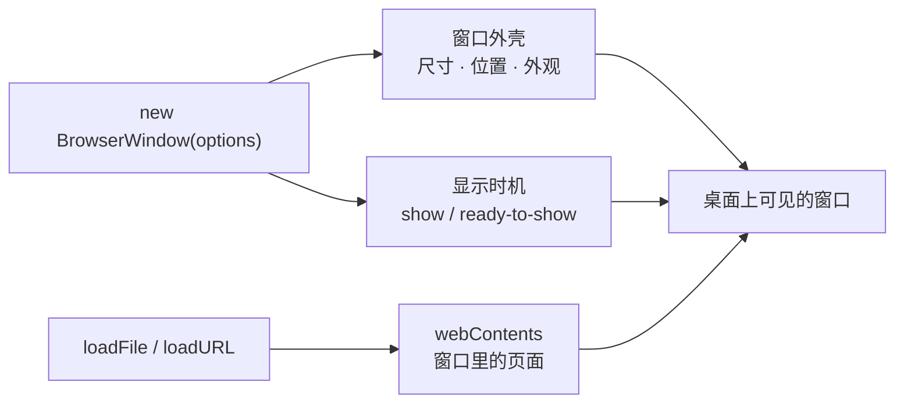

import { Meta } from '@storybook/addon-docs/blocks';

<Meta id="windows" title="窗口/创建窗口" name="Docs" />

# 创建窗口

这一课拆开 Forge 模板里的 `createWindow`：`new BrowserWindow(options)` 在主进程里创建一个窗口实例，`options` 决定窗口外壳（尺寸、位置、外观、显示时机），`loadFile` / `loadURL` 决定窗口里装什么内容。读完你应能预测：改某个 option 并重启后窗口会怎么变；窗口为什么先白闪一下、怎样让它带着内容出现；`preload` 该怎么接进来。

本课只管单个窗口的创建。窗口在哪个进程创建、一个窗口对应一个渲染进程，这套模型见[进程模型](?path=/docs/process-model--docs)；无边框与透明窗口见[无边框窗口](?path=/docs/frameless-windows--docs)，多窗口的引用管理与父子模态见[多窗口](?path=/docs/multi-window--docs)，`window-all-closed` 等生命周期事件见[应用生命周期](?path=/docs/app-lifecycle--docs)。



常用 options 及默认值（默认值与官方文档核对，完整清单见参考资料）：

| option | 默认值 | 说明 |
| --- | --- | --- |
| `width` / `height` | `800` / `600` | 初始尺寸（逻辑像素），默认指整个窗口 |
| `minWidth` / `minHeight` | `0`（不限制） | 最小尺寸，拖拽与 `setSize` 都受约束 |
| `maxWidth` / `maxHeight` | 无上限 | 最大尺寸 |
| `useContentSize` | `false` | `true` 时 `width`/`height` 指页面内容区，不含边框 |
| `resizable` | `true` | 是否允许拖拽调整大小 |
| `x` / `y` | 居中 | 初始位置，两者必须成对设置 |
| `center` | `false` | 强制在屏幕居中显示 |
| `show` | `true` | 创建即显示；`false` 时配合 `ready-to-show` 再显示 |
| `title` | `'Electron'` | 默认标题；页面加载后会被 HTML 的 `<title>` 覆盖 |
| `backgroundColor` | `#FFF` | 窗口底色，接受 CSS 颜色格式，显示前生效可遮白 |
| `autoHideMenuBar` | `false` | 仅 Windows/Linux：按 `Alt` 才显示窗口内菜单栏 |
| `fullscreen` | `false` | 以全屏状态启动 |
| `frame` | `true` | `false` 即无边框窗口，见「无边框窗口」 |
| `parent` / `modal` | `null` / `false` | 父子与模态窗口，见「多窗口」 |

## 快速上手

沿用前面课程用 Forge 创建的项目，打开 `src/index.js`，把 `createWindow` 换成下面这样（模板里 `openDevTools` 那行可先注释，观察更干净），完整参考实现在本课目录的 `create-window.js`：

```js
const createWindow = () => {
  const mainWindow = new BrowserWindow({
    width: 900,
    height: 620,
    minWidth: 640,
    minHeight: 400,
    show: false,
    autoHideMenuBar: true,
    webPreferences: {
      preload: path.join(__dirname, 'preload.js'),
    },
  });

  mainWindow.once('ready-to-show', () => {
    mainWindow.show();
  });

  mainWindow.loadFile(path.join(__dirname, 'index.html'));
};
```

改完后让改动生效：`src/index.js` 属于主进程，刷新窗口无效，要在运行 start 的终端输入 `rs` 重启应用（见「第一次运行」）。

重启后逐项核对可观察结果：

1. **窗口出现时内容已经就绪**——没有先白一块再出页面的闪烁，这是 `show: false` 加 `ready-to-show` 的效果。
2. **拖拽窗口边缘缩小**——宽缩到 640、高缩到 400 就停住，`minWidth`/`minHeight` 生效。
3. **Windows/Linux 上窗口内菜单栏消失**——按 `Alt` 呼出；macOS 菜单在屏幕顶部，本来就不在窗口里，此参数对它无效。

## 加载内容

`new BrowserWindow()` 创建的只是一个空白外壳，窗口里的东西要靠加载方法装入：`loadFile` 装应用自带的本地页面，`loadURL` 装一个网址。两个方法都返回 `Promise`：页面加载完成时 resolve，加载失败时 reject——这个 Promise 是判断"内容为什么没出来"的第一入口；页面加载完成后的导航、事件等内容侧机制见[webContents](?path=/docs/webcontents--docs)。

### loadFile

加载打包进应用的本地 HTML，是最常用的方式：

```js
mainWindow.loadFile(path.join(__dirname, 'index.html'));
```

路径解析规则是本节唯一的坑：**参数相对应用根目录（`package.json` 所在目录）解析，不是相对主脚本文件**。官方教程写 `win.loadFile('index.html')` 的前提是页面就放在项目根目录；Forge 模板的主脚本和页面都在 `src/` 下，所以模板用 `path.join(__dirname, 'index.html')` 拼出绝对路径，绕开"到底相对谁"的歧义。拿不准时照模板写法用 `__dirname` 拼，永远正确。

### loadURL

加载远程地址或 `file://` 协议的本地文件：

```js
mainWindow.loadURL('https://electronjs.org');
```

本地页面优先用 `loadFile`，语义更直接；`loadURL` 的典型用途是加载远程站点。要注意官方安全指南明确建议不要加载远程内容——远程页面能触碰 Electron 的能力面，风险与对策（拦截导航、限制权限）见[安全清单](?path=/docs/security--docs)与「导航与弹窗控制」。加载远程地址失败（断网、证书错误）会走 reject，终端能看到错误。

## 尺寸与位置

尺寸参数分两层：`width`/`height` 给初始值，`minWidth`/`minHeight`/`maxWidth`/`maxHeight` 给后续拖拽和 `setSize` 的约束范围。默认 `width`/`height` 指整个窗口（含标题栏和边框）；`useContentSize: true` 时改指页面内容区——需要精确控制视口大小时打开它。

```js
const mainWindow = new BrowserWindow({
  width: 900,
  height: 620,
  minWidth: 640,
  minHeight: 400,
  useContentSize: false, // true 时上面的数值按页面内容区计算
});
```

可观察证据：启动后拖拽窗口边缘，缩到 640×400 会被顶住；运行期用 `mainWindow.getSize()` 能读到当前尺寸，`setSize(720, 480)` 会把窗口改成新尺寸——低于最小尺寸约束时直接吸附到约束值。

位置的两个参数必须一起理解：`x`/`y` 设置窗口初始的屏幕位置，**两者必须成对设置**；都不设置时窗口默认居中。要运行期移动用 `mainWindow.setPosition(x, y)`，居中用 `mainWindow.center()`。多显示器环境下判断该放哪块屏幕需要 `screen` API，本课不展开。

`resizable: false` 把窗口固定为不可拖拽调整大小；需要彻底锁定尺寸时把它和 min/max 一起用。

## 显示与外观

外壳的"看起来如何、何时可见"都在创建时通过 options 一次性给定：显示时机靠 `show` 与 `ready-to-show` 配合，观感靠 `title`、`backgroundColor` 等参数。逐项如下。

### show 与 ready-to-show

默认 `show: true` 时，窗口创建立刻显示，而页面还在加载——用户先看到一块白屏，内容好了才跳出来，这就是"白闪"的来源。标准写法是先把窗口建成隐藏，等页面渲染完成再显示：

```js
const mainWindow = new BrowserWindow({
  show: false,
  // ...
});

mainWindow.once('ready-to-show', () => {
  mainWindow.show();
});
```

`ready-to-show` 的官方语义是"页面已渲染完成、可以无视觉闪烁地显示"，它在加载完成之后触发，所以这个写法同时依赖加载成功——排查思路见常见问题。想进一步压低闪烁感，给 `backgroundColor` 设一个接近页面的底色，窗口显形那刻就不会是刺眼的纯白。

### 标题、背景与图标

`title` 设的是窗口默认标题，默认值 `'Electron'`。它有一个必踩的行为：**页面加载后，HTML 的 `<title>` 会接管窗口标题**，`title` 参数只在页面未提供标题时生效。要强制固定标题，拦截标题更新事件：

```js
mainWindow.on('page-title-updated', (event) => {
  event.preventDefault(); // 阻止页面标题改写窗口标题
});
```

`backgroundColor` 接受 Hex、RGB、HSL 等 CSS 颜色格式，默认 `#FFF`；它在窗口显示前就生效，所以能当"加载底色"用。

`icon` 设置窗口图标，只作用于 Windows/Linux（Windows 建议用 `.ico`）；macOS 的应用图标由 app bundle 决定，运行期要改用 `app.dock.setIcon()`。Forge 模板不设置 `icon`，打包时的图标配置属于打包课程。

## webPreferences 与 preload

`webPreferences` 是创建窗口时给渲染环境下的配置单，只在创建时传入，创建后没有对应 setter——改配置意味着重建窗口。入门阶段只需要记两件事：怎么接 `preload`，以及三个安全相关参数的默认值。

```js
const mainWindow = new BrowserWindow({
  webPreferences: {
    preload: path.join(__dirname, 'preload.js'),
  },
});
```

`preload` 指定预加载脚本，**值必须是绝对路径**，传相对路径不会按你的预期工作——所以惯例一律 `path.join(__dirname, 'preload.js')`。预加载脚本怎么写、`contextBridge` 怎么暴露 API，见[预加载脚本](?path=/docs/preload--docs)。

| webPreferences 参数 | 默认值 | 含义 |
| --- | --- | --- |
| `nodeIntegration` | `false` | 渲染进程不开放完整 Node API |
| `contextIsolation` | `true` | 预加载脚本与页面运行在隔离的上下文 |
| `sandbox` | `true`（Electron 20 起） | 渲染进程沙箱化；`nodeIntegration: true` 时自动关闭 |

这三个默认值就是 Electron 的安全基线：渲染进程默认不可信。搜教程时常看到 `nodeIntegration: true` 的旧写法，那是在关掉基线，现代做法是通过 `preload` 与 IPC 通信，完整取舍见[安全清单](?path=/docs/security--docs)。

## 窗口对象与事件

`new BrowserWindow()` 返回的实例就是窗口的遥控器：方法操作外壳状态，`webContents` 属性操作窗口里的页面——注意 `openDevTools()` 不在窗口对象上，而在 `webContents` 上（模板里写的 `mainWindow.webContents.openDevTools()`）。

常用方法速查：

| 目的 | 调用 |
| --- | --- |
| 读 / 改整体尺寸 | `getSize()` / `setSize(w, h)` |
| 读 / 改内容区尺寸 | `getContentSize()` / `setContentSize(w, h)` |
| 读 / 改位置 | `getPosition()` / `setPosition(x, y)` |
| 居中 | `center()` |
| 显示 / 隐藏 | `show()` / `hide()` / `isVisible()` |
| 最小化 / 最大化 / 还原 | `minimize()` / `maximize()` / `unmaximize()` / `restore()` |
| 标题 | `setTitle(t)` / `getTitle()` |
| 换内容 | `loadFile()` / `loadURL()` |
| 关闭 | `close()`（页面可拦截）/ `destroy()`（强制，不触发 unload） |
| 打开 DevTools | `webContents.openDevTools()` |

常用事件：

| 事件 | 触发时机与要点 |
| --- | --- |
| `ready-to-show` | 页面渲染完成、可无闪烁显示；配合 `show: false` |
| `close` | 窗口将被关闭；`event.preventDefault()` 可取消关闭（做"确认退出"） |
| `closed` | 窗口已关闭，实例随之销毁；应在此移除对窗口的引用 |
| `page-title-updated` | 页面标题变化；`preventDefault()` 可阻止改写窗口标题 |
| `resize` / `move` | 尺寸或位置变化，保存窗口状态时使用 |
| `focus` / `blur` | 焦点变化 |

`closed` 是本节必须记住的事件：窗口关闭后实例立即销毁，官方文档明确要求收到该事件后移除引用、不再使用；再访问已销毁的实例会抛 `Object has been destroyed`。单窗口的惯例是模块级变量持有引用、`closed` 里置回 `null`：

```js
let mainWindow = null;

const createWindow = () => {
  mainWindow = new BrowserWindow({ /* ... */ });
  mainWindow.on('closed', () => {
    mainWindow = null;
  });
};
```

窗口全关之后应用退不退出、macOS 点 Dock 重建窗口，属于生命周期事件（`window-all-closed`、`activate`），见「应用生命周期」；多个窗口各自持有引用、统一管理，见「多窗口」。

## 最佳实践

- **默认用 `show: false` + `ready-to-show` 创建窗口。** 这是跨"创建、加载、显示"三步的组合取舍：代价是多写一个监听，换来窗口带着内容出现。配合 `backgroundColor` 设接近页面的底色，观感最稳；开发调试时想立即看窗口，临时改回 `show: true` 即可。
- **窗口内路径一律 `path.join(__dirname, ...)` 拼绝对路径。** `preload` 要求绝对路径，`loadFile` 按应用根目录解析相对路径——两者对"相对谁"的回答不同，统一用 `__dirname` 拼接可以同时绕开这两个歧义，Forge 模板正是这么写的。
- **保留窗口引用，`closed` 里置空。** 不保留引用，窗口可能被垃圾回收导致行为异常；不置空引用，关窗后再访问就抛 `Object has been destroyed`。单窗口一个模块级变量就够，规模上去后交给「多窗口」课程的引用管理。
- **不要用 `nodeIntegration: true` 求方便。** 渲染进程需要系统能力时，正路是 `preload` 暴露受限接口、经 IPC 请求主进程；打开 `nodeIntegration` 等于把完整 Node 交给页面里可能出现的任何代码，具体风险与迁移方式见「安全清单」。

## 常见问题

- `loadFile('index.html')` 启动后窗口空白，终端报 `ERR_FILE_NOT_FOUND`
  把路径改成 `path.join(__dirname, 'index.html')` 这类绝对路径。判断依据：`loadFile` 的相对路径按应用根目录（`package.json` 所在目录）解析，主脚本在 `src/` 下时写 `'index.html'` 会去找根目录下的 `index.html`，自然找不到。
- 加了 `show: false` + `ready-to-show` 后窗口一直不出现
  先看终端：`loadFile` / `loadURL` 失败会 reject 并把错误打在终端里，这类问题修好加载窗口自然出现。终端无报错时，检查 `ready-to-show` 监听是否注册在创建之后、`show()` 是否被提前的 `return` 跳过。定位技巧：把 `mainWindow.show()` 临时挪进 `app.whenReady()`，能出窗口说明显示逻辑没问题，把怀疑集中到加载环节。
- 定时器或事件回调里访问窗口对象，运行时抛 `Object has been destroyed`
  这说明回调触发时窗口已经关闭销毁。处理动作：在 `closed` 事件里把引用置回 `null`，回调入口先判 `if (!mainWindow || mainWindow.isDestroyed()) return;`。判断依据：窗口关闭即销毁实例，官方要求收到 `closed` 后移除引用；需要跨窗口存活的数据不要挂在窗口对象上。

## 总结回顾

摘要：

创建窗口就是在主进程里 `new BrowserWindow(options)`：`options` 决定外壳（尺寸与 min/max 约束、成对设置的 `x`/`y`、`title` 与 `backgroundColor` 等外观），`loadFile` / `loadURL` 把内容装进窗口的 `webContents`——前者相对应用根目录解析本地页面，后者装远程地址，两者都返回可判断成败的 Promise。默认创建即显示会造成白闪，标准写法是 `show: false` 等 `ready-to-show` 再显示。`webPreferences` 在创建时一次性给定渲染环境：`preload` 必须绝对路径，`nodeIntegration`/`contextIsolation`/`sandbox` 的默认值构成安全基线。窗口对象是遥控器，方法管外壳、`webContents` 管页面；`closed` 之后实例销毁，引用要置空。

一句话：

> 窗口分外壳与内容两层：`new BrowserWindow(options)` 造外壳并决定何时显示，`loadFile` / `loadURL` 装内容；默认创建即显示，生产写法是 `show: false` 等 `ready-to-show`。

知识要点：

- `BrowserWindow` 的 `options` 管什么，`loadFile` / `loadURL` 管什么，各自在创建流程的哪一步？
- `width` / `height` 的默认值是多少，默认指整个窗口还是页面内容区？`useContentSize` 改变什么？
- `loadFile` 的相对路径按什么解析？为什么 Forge 模板用 `path.join(__dirname, ...)`？
- 设了 `title` 窗口标题却显示成网页标题，是哪个机制在起作用？怎么固定标题？
- `show: false` + `ready-to-show` 解决什么问题？两者缺一个会发生什么？
- `webPreferences` 的三个安全默认值是什么？`preload` 路径有什么硬性要求？
- 窗口关闭后为什么不能再用窗口对象？单窗口的引用惯例是什么？

## 参考资料

- [Electron 文档 — BrowserWindow](https://www.electronjs.org/docs/latest/api/browser-window)
  本课 API 事实的主要来源：`loadFile` / `loadURL` 语义、`ready-to-show` 与 `closed` 等事件定义、实例方法清单、销毁后访问抛 `Object has been destroyed` 的说明。
- [Electron 文档 — BaseWindowOptions](https://www.electronjs.org/docs/latest/api/structures/base-window-options)
  全部窗口 options 的默认值出处（`width` 800、`height` 600、`show` true、`title` 'Electron'、`autoHideMenuBar` 仅 Linux/Windows 等）。
- [Electron 文档 — WebPreferences](https://www.electronjs.org/docs/latest/api/structures/web-preferences)
  `preload` 绝对路径要求与 `nodeIntegration` / `contextIsolation` / `sandbox` 默认值的事实来源。
- [Electron 教程 — First app](https://github.com/electron/electron/blob/main/docs/tutorial/tutorial-2-first-app.md)
  官方最小窗口创建示例：`new BrowserWindow({ width, height })` 加 `loadFile` 的基线写法。
