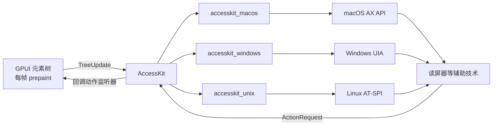

import { Meta } from '@storybook/addon-docs/blocks';

<Meta id="accessibility" title="工程化/无障碍" name="Docs" />

# 无障碍

无障碍（accessibility，常缩写为 a11y）指读屏器、盲文显示器、语音控制等辅助技术能够识别并操作你的界面。GPUI 通过集成 [AccessKit](https://accesskit.dev/) 解决这个问题：你在元素上声明角色与属性，GPUI 每帧把元素树转换成 AccessKit 的无障碍树推送给操作系统；辅助技术发起的操作请求，再以"无障碍动作"的形式回调回你的代码。这条链路完全自动，你不需要写任何平台相关的初始化。

版本口径（2026-10 核实）：**本课全部 API 仅 main 分支可用**。crates.io 上最新的 gpui 0.2.2 完全没有无障碍能力——其 Cargo.toml 没有 accesskit 依赖，源码里不存在 `role`、`aria_label` 等任何相关 API。main 分支依赖 `accesskit 0.24`，按平台接入 `accesskit_macos` / `accesskit_windows` / `accesskit_unix` 三个适配器，入口是尚未发布到 crates.io 的 `gpui_platform`。本文代码均在 zed 仓库 main 分支语境下编写。

官方提供了完整示例与指南，本课多处与之对照：

- 示例：zed 仓库内运行 `cargo run -p gpui --example a11y`
- 指南：`crates/gpui/src/_accessibility.rs` 模块文档，gpui.rs 的 examples 页以 "Accessibility guide" 链接它

| 我想要 | 用这一族 API | 前提 |
| --- | --- | --- |
| 让元素出现在无障碍树里 | `.id(..)` + `.role(Role::..)` | 两者缺一不可 |
| 命名元素、补充说明 | `.aria_label(..)` / `.aria_description(..)` | 有 id 和 role |
| 暴露开关、选中、展开等状态 | `.aria_toggled(..)` / `.aria_selected(..)` / `.aria_expanded(..)` | 同上 |
| 暴露数值、文本值、占位符 | `.aria_numeric_value(..)` 系列、`.aria_value(..)`、`.aria_placeholder(..)` | 同上 |
| 标记层级、集合位置、表格坐标 | `.aria_level(..)` / `.aria_position_in_set(..)` 等 | 同上 |
| 响应辅助技术触发的动作 | `.on_a11y_action(AccessibleAction::.., ..)` | 有 id |
| 让文本进入无障碍树 | `text!` 宏或 `Text::new`；`Text::new_inaccessible` 反之 | 无 |
| 把焦点接进无障碍树 | `.track_focus(&handle)` / `.focusable()`（见[焦点管理](?path=/docs/focus--docs)） | 有 id 才有节点 |
| 自定义元素接入 | 实现 `Element::a11y_role` / `write_a11y_info` / `a11y_synthetic_children` | 自定义 Element |
| 查询与调试 | `window.is_a11y_active()` / `is_a11y_enabled()` / `debug_a11y_tree_json()` | 无 |

## AccessKit 架构

GPUI 不直接和各平台无障碍系统打交道，而是接入 AccessKit 这个跨平台无障碍工具包，由它适配各系统：



每帧的数据流是单向推送：prepaint 阶段遍历元素树，凡是"有自己的 id 且 `a11y_role()` 返回 Some"的元素，都会生成一个 `accesskit::Node`（GPUI 自动把布局换算成带缩放因子的 bounds 写入节点），组装成一棵 `accesskit::TreeUpdate`；帧结束时交给平台适配器，适配器与上一帧做 diff，再把差异翻译成系统 API 调用通知读屏器。反过来，辅助技术的请求经适配器回到 `Window::handle_a11y_action` 分发。

无障碍树只对"当前确实有辅助技术接入"的窗口构建——a11y 未激活时每帧零额外开销；从无到有激活时会强制重绘一次，保证第一帧树是完整的。相关的查询 API：

| API | 含义 |
| --- | --- |
| `window.is_a11y_active()` | 本帧是否正在构建无障碍树（辅助技术已接入） |
| `window.is_a11y_enabled()` | 应用级是否允许无障碍；用 `Application::new_inaccessible` 创建的应用恒为 false，且不再调用任何 accesskit API |
| `window.debug_a11y_tree_json()` | 上一帧无障碍树的 JSON 调试输出 |

`is_a11y_active()` 的典型用法是门控"只有辅助技术才观察得到"的昂贵计算：平时跳过，激活后靠强制重绘自动补算。

## 让元素进入无障碍树

一个元素被上报进无障碍树要同时满足两个条件：

1. **有自己的 id。** 无障碍节点的 id 直接取自 `GlobalElementId` 的路径哈希——`GlobalElementId` 由元素自身 id 加上祖先 id 链组成，`GlobalElementId::accesskit_node_id()` 把这个 64 位哈希当作 `accesskit::NodeId`。没有自身 id 的元素没有全局 id，无法生成 `NodeId`，也就不会上报。
2. **有非 None 的角色。** `div` 默认 `a11y_role()` 返回 None，不上报；设置 `.role(Role::Button)` 后才成为树中的节点。`Role::GenericContainer` 会被显式过滤（等价于无角色的 HTML div），debug 构建下传它会直接断言失败。

`role` 和全部 `aria_*` 属性方法都定义在 `StatefulInteractiveElement` 上，所以**必须先 `.id()` 再设置无障碍属性**。`focusable()`、`on_a11y_action()` 同样如此。

```rust
// 最小可上报元素：id + role + label 三件套
div()
    .id("save-button")   // 产生全局 id，哈希后成为 accesskit::NodeId
    .role(Role::Button)  // 没有这一步，节点不会进入无障碍树
    .aria_label("保存")   // 读屏器播报“保存，按钮”
    .on_click(cx.listener(|_, _, _, cx| cx.notify()))
    .child(text!("保存")),
```

id 还决定"同一性"：跨帧保持相同全局 id 的节点被视作同一个节点，内容变化播报为"更新"；id 变了，读屏器只能理解为旧节点销毁、新节点出现，通常导致重复播报。所以 id 要稳定——这段逻辑放在文本一节展开，它是无障碍代码里最容易踩的坑。

## 标签与描述

- `aria_label`：元素的"名字"，读屏器最先播报的内容。控件有可见文字时，`text` 子节点会自带 Label 角色；父容器再设 `aria_label` 就会重复，二选一（见文本一节）。
- `aria_description`：补充说明，在名字、角色、值之后播报，适合副标题、提示语。
- `aria_keyshortcuts`：声明触发该元素的快捷键，如 `"cmd-s"`。
- `accessibility_id`：暴露给外部工具的稳定作者标识（`accesskit::Node::set_author_id`），AccessKit 在支持的平台上映射为 Windows UIA 的 `AutomationId`、macOS 的 `AXIdentifier` 等。注意它与 GPUI 元素 id 是两回事：GPUI 元素 id 只在进程内有意义，`accessibility_id` 会出现在进程外。

```rust
div()
    .id("font-size-input")
    .role(Role::SpinButton)
    .accessibility_id("settings.buffer-font-size") // 外部自动化脚本靠它定位
    .aria_label("缓冲区字号")                       // 名字
    .aria_description("编辑器内文本的大小")           // 补充说明
    .aria_keyshortcuts("cmd-=")                     // 快捷键提示
```

## 状态与数值属性

这组属性把控件的"当前状态"写进无障碍节点，全部对应 `accesskit::Node` 的 setter，由 `Interactivity::write_a11y_info` 在每帧上报时统一写入：

| 属性 | 方法 | 写入的 setter | 典型角色 |
| --- | --- | --- | --- |
| 开关态 | `aria_toggled(Toggled)` | `set_toggled` | Switch、CheckBox |
| 选中 | `aria_selected(bool)` | `set_selected` | ListItem、Tab |
| 展开 | `aria_expanded(bool)` | `set_expanded` | TreeItem、下拉 |
| 数值 | `aria_numeric_value(f64)` | `set_numeric_value` | SpinButton、Slider |
| 数值范围 | `aria_min_numeric_value` / `aria_max_numeric_value` | 对应 setter | 同上 |
| 步长 | `aria_numeric_value_step(f64)` | `set_numeric_value_step` | 同上 |
| 文本值 | `aria_value(impl Into<SharedString>)` | `set_value` | TextInput |
| 占位符 | `aria_placeholder(impl Into<SharedString>)` | `set_placeholder` | TextInput |
| 方向 | `aria_orientation(Orientation)` | `set_orientation` | Scrollbar、Slider |
| 层级 | `aria_level(usize)` | `set_level` | Heading |
| 集合位置 | `aria_position_in_set(usize)` / `aria_size_of_set(usize)` | 对应 setter | List 的项 |
| 表格坐标 | `aria_row_index` / `aria_column_index` / `aria_row_count` / `aria_column_count` | 对应 setter | 表格类角色 |

`Toggled` 是 accesskit 的三态枚举：`Toggled::True` / `Toggled::False` / `Toggled::Mixed`。

数值型的 SpinButton 官方示例（计数器，最小值 0）：

```rust
div()
    .id("counter")
    .focusable()
    .tab_stop(true)
    .role(Role::SpinButton)
    .aria_label(SharedString::from(format!("计数：{}", self.count)))
    .aria_numeric_value(self.count as f64)
    .aria_min_numeric_value(0.0)
    // 动作监听器见下一节
    .on_click(cx.listener(|this, _, _, cx| {
        this.count += 1;
        cx.notify();
    })),
```

集合型属性的官方示例（待办列表，`aria_position_in_set` 从 1 计数）：

```rust
div()
    .id("task-list")
    .role(Role::List)
    .aria_label("任务")
    .flex()
    .flex_col()
    .children(
        ["写代码", "跑测试", "发布"]
            .iter()
            .enumerate()
            .map(|(i, label)| {
                div()
                    .id(("task", i))            // 列表项 id 必须逐项不同
                    .role(Role::ListItem)
                    .aria_label(SharedString::from(*label))
                    .aria_position_in_set(i + 1) // 第几项
                    .aria_size_of_set(3)         // 共几项
                    .child(text!(format!("{}. {}", i + 1, label)))
            }),
    )
```

注意 `text!` 在 map 里只写了一次却安全：它的自动 id 虽然相同，但祖先 `.id(("task", i))` 逐项不同，拼出来的全局 id 仍然唯一。

## 无障碍动作

辅助技术不只"看"，还要"操作"：语音控制程序会说"按下这个按钮"，读屏器会把指令转成对特定节点的动作请求。这套动作是 accesskit 的 `accesskit::Action`，与 GPUI 的 `Action` trait（快捷键系统那套）完全无关；gpui 把它 re-export 为 `AccessibleAction`，同时 re-export 的还有 `Role`、`Toggled`、`Orientation`，以及整个 `gpui::accesskit` 模块（构造合成节点时要用）。

用 `.on_a11y_action(action, listener)` 响应动作。监听器签名是 `FnMut(Option<&accesskit::ActionData>, &mut Window, &mut App)`，没有事件泛型，所以不能直接用 `cx.listener`，官方示例用手动 downgrade 拿回实体：

```rust
.on_a11y_action(AccessibleAction::Increment, {
    let this = cx.entity().downgrade();
    move |_, _, cx| {
        this.update(cx, |this, cx| {
            this.count += 1;
            cx.notify();
        })
        .ok();
    }
})
.on_a11y_action(AccessibleAction::Decrement, {
    let this = cx.entity().downgrade();
    move |_, _, cx| {
        this.update(cx, |this, cx| {
            this.count = (this.count - 1).max(0);
            cx.notify();
        })
        .ok();
    }
})
```

三类动作有内建处理，不用你注册：

- `on_click` 会自动给节点注册 `AccessibleAction::Click` 能力，并接上你的点击处理器；反过来，若节点声明了 Click 能力却没有监听器，框架会兜底：取该节点的 bounds 中心，合成一对鼠标按下/抬起事件派发进窗口。
- 可聚焦元素（`.focusable()` 或 `.track_focus(..)`）自动获得 Focus 能力；辅助技术请求 Focus 时框架直接调 `window.focus(handle)`，Blur 同理。
- 键盘激活：聚焦的带 `on_click` 元素响应 Enter / Space，合成完整的点击按下与抬起——键盘用户和读屏器用户都能"按"按钮。

监听器的注册机制是每帧重建：帧首清空全部动作监听器，绘制过程中由各元素重新登记。所以不要在帧外长期保存监听器引用，让它们随 render 方法自然重建即可。

## 文本与 ID 稳定性

`text!` 宏创建的 `Text` 元素自带一个从**调用点源码位置**（`file!` / 行 / 列的哈希）派生的 id；有 id 的 `Text` 以 `Role::Label` 上报，文本内容写进节点的 value。这正是无障碍文本的正常形态，但派生规则带来两个必须记住的推论：

**推论一：迭代器里的 `text!` 是经典陷阱。** map 闭包里只写了一次 `text!(t)`，所有生成项共享同一个调用点 id，全局 id 全部重复。官方指南明确：release 构建下这些节点会被静默丢弃。

```rust
// 错误：所有项同一个自动 id，release 下静默丢节点
let items = todos.iter().map(|t| text!(t));

// 修复一：显式给每项一个 id
let items = todos
    .iter()
    .enumerate()
    .map(|(i, t)| text!(id = i, t));
// 等价写法：text!(t).with_id(i)

// 修复二：包一层有唯一 id 的 div，全局 id 随祖先区分
let items = todos
    .iter()
    .enumerate()
    .map(|(i, t)| div().id(i).child(text!(t)));
```

**推论二：id 换了等于节点换了。** 同一 UI 逻辑如果每帧生成不同 id，读屏器会不停播报"一个元素消失、另一个出现"。可见文本内容变化但 id 不变时，才会播报为内容更新。

另外两个手动控制手段：

- `Text::new(id, text)`：手动指定 id 的无障碍文本。
- `Text::new_inaccessible(text)`：显式创建**不进树**的文本。自定义组件里，想让父容器的 `aria_label` 独自承担命名、避免可见文字在树里重复时用它：

```rust
div()
    .id("close-button")
    .role(Role::Button)
    .aria_label("关闭") // 命名由 label 承担
    .child(Text::new_inaccessible("×")) // 可见的 “×” 不再重复上报
```

## 焦点与无障碍

[焦点管理](?path=/docs/focus--docs)一课的 `FocusHandle` 体系与无障碍树是打通的。带 `.track_focus(&handle)` 的元素在绘制时：若 a11y 激活，框架把它的无障碍节点登记为可聚焦（`set_focusable`）；若该 `FocusHandle` 当前正持有焦点，再把节点登记为树的焦点（`set_focus`）。每帧结束的 `TreeUpdate` 会带上焦点节点 id，平台适配器据此同步系统侧焦点。

两个衔接点容易出错：

- **focusable 但没有 id 的元素没有无障碍节点。** 焦点落在它上面时，读屏器只能退回去读整个窗口；框架会打一条专门的日志 `a11y: focused element has no accessibility node`，看到它就检查该元素是否缺 `.id()`（以及 role）。
- **容器代持焦点的组合控件**（如自绘列表：容器持有 `FocusHandle`，子项本身不可聚焦）用 `.aria_active_descendant()` 标记当前活跃的子项，读屏器焦点会落在子项节点而不是容器上——对应 Web ARIA 的 `aria-activedescendant` 模式。

Tab 顺序也是共享设施：`tab_index` / `tab_stop` 调节 Tab 键停靠点，`window.focus_next(cx)` / `focus_prev(cx)` 手动导航。官方 a11y 示例干脆自己绑定了 Tab / Shift-Tab 动作，在根元素上驱动焦点循环：

```rust
div()
    .id("root")
    .role(Role::Application)
    .aria_label("Accessibility Demo")
    .track_focus(&self.focus_handle) // 焦点从这里接入无障碍树
    .on_action(cx.listener(|_, _: &Tab, window, cx| window.focus_next(cx)))
    .on_action(cx.listener(|_, _: &TabPrev, window, cx| window.focus_prev(cx)))
```

## 自定义元素的无障碍

自定义 `Element` 通过三个 trait 钩子接入无障碍树，默认实现都是"不参与"：

- `a11y_role() -> Option<Role>`：返回 Some 才会上报。
- `write_a11y_info(&mut accesskit::Node)`：往节点写属性，仅在角色为 Some 时被调用。div 就是用它把 `aria_*` 属性写进节点的。
- `a11y_synthetic_children(..)`：**合成子节点**。有的元素在无障碍树里应当表现为多个节点——指南举的例子是一个自定义文本编辑器：自身以 `Role::TextInput` 上报，再注入若干 `Role::TextRun` 子节点表示文本内容。这些子节点不对应任何 GPUI 元素，在 prepaint 之后由 builder 回调注入：

```rust
impl Element for MyEditor {
    fn a11y_role(&self) -> Option<Role> {
        Some(Role::TextInput)
    }

    fn a11y_synthetic_children(
        &mut self,
        _prepaint: &mut Self::PrepaintState,
        builder: &mut A11ySubtreeBuilder,
    ) {
        let mut run = accesskit::Node::new(Role::TextRun);
        run.set_value(self.text.clone());
        // 每个字符的 UTF-8 长度，供读屏器按字符定位
        run.set_character_lengths(
            self.text.chars().map(|c| c.len_utf8() as u8).collect(),
        );
        // 用稳定 key 派生子节点 id，保证跨帧不变
        let run_id = builder.synthetic_node_id(0);
        builder.push_child(run_id, run);
        // builder.parent_node() 还能反改本元素自己的节点，
        // 例如写入光标所在的文本选区
    }
}
```

普通 div 也有闭包版：`.a11y_synthetic_children(|builder| ..)`，不用写自定义 Element 也能注入合成子树。

## Zed 中的实际使用

gpui 层提供上面全部机制；Zed 自己的采用情况（截至本课编写抓取的 main 快照）：

- **crates/ui 组件层已在用。** `toggle.rs` 给开关组件设 `.role(Role::Switch)` 并透传 `aria_label`；`context_menu.rs` 用 `Role::Menu` 加 `aria_label`；`tree_view_item.rs` 用 `Role::TreeItem`；`button_like.rs`、`disclosure.rs`、`dropdown_menu.rs`、`choice_card.rs` 都在设置 `aria_label`（disclosure 用折叠/展开文案作动态 label）。
- **crates/editor 内未检索到对这组 API 的直接调用。** 编辑器内部更细粒度的无障碍树（如经合成子节点暴露文本行）尚未落地。想看"元素如何正确暴露"的写法，现阶段参照 crates/ui 的组件与官方 `examples/a11y.rs` 即可。

这也印证了版本现实：这套 API 是 main 分支上的新能力，生态采用仍在推进中，API 细节可能继续变动，升级时以源码为准。

## 最佳实践

- **角色匹配真实交互，动作配齐再上线。** 声明 `Role::SpinButton` 或 `Role::Slider` 就必须配 `Increment` / `Decrement` 动作监听；开关类配 `aria_toggled`；否则读屏器会宣称一个做不到的能力。
- **id 策略优先于补救。** 列表项用 `("task", i)` 这类含索引的元组 id；迭代器里的 `text!` 必须显式 id 或用带唯一 id 的父节点包裹。id 一旦发布就当作稳定契约，改 id 就是改节点身份。
- **命名不重复。** 控件要么由可见文本（Label 子节点）命名，要么由 `aria_label` 命名并把可见文字换成 `Text::new_inaccessible`，不要两条都走。
- **用 `is_a11y_active()` 门控昂贵的无障碍专用计算。** 例如大列表的逐项描述拼接：平时跳过，激活后框架强制重绘自动补齐，无障碍开启的用户不丢数据，普通用户不付开销。
- **用工具验证而不是猜。** `window.debug_a11y_tree_json()` 直接导出上一帧的树；官方 `examples/a11y.rs` 覆盖了本课全部属性家族，改它来验证最省事。

## 常见问题

- 迭代器生成的列表项在读屏器里缺失，或 release 构建下行为与 debug 不一致
  检查是否在 map 里直接用了 `text!`：同一调用点派生同一 id，全局 id 重复，release 下静默丢节点。给每项 `text!(id = i, t)` 或外包 `div().id(i)`。
- 日志出现 `a11y: focused element has no accessibility node`
  某个可聚焦元素缺少自身 id（或 role），焦点落在它上面时读屏器只能读整个窗口。给它补 `.id(..).role(..)`。
- 在 gpui 0.2.2 里找不到 `role()`、`aria_label`、`on_a11y_action`
  正常现象：无障碍支持目前只在 main 分支，0.2.2 没有任何相关 API。体验完整能力需依赖 zed 仓库或尚未发布的 `gpui_platform`。
- `.role(Role::GenericContainer)` 设了没效果
  该角色被显式过滤出无障碍树（等价于无角色），debug 构建下还会断言失败。想上报就换具体角色，不想上报就不设。
- 声明了 `on_a11y_action` 但读屏器没触发
  先确认元素真的进了树（缺 id 或 role 时动作无从谈起），再确认动作类型匹配——节点只暴露注册过的动作，`Increment` 这类非内建动作必须有对应监听器。

## 总结回顾

摘要：

GPUI 在 main 分支上通过 AccessKit 提供程序化无障碍：每帧 prepaint 时，"有 id 且有角色"的元素被转成 accesskit 节点并组装成 `TreeUpdate`，经平台适配器推给读屏器；节点的 `NodeId` 由元素全局 id 的路径哈希派生，因此 id 的稳定性就是节点的身份。`role()` 与 `aria_*` 属性家族（命名、描述、状态、数值、集合与表格位置）都要求元素先 `.id()`；`on_a11y_action` 响应辅助技术的操作请求，`on_click`、可聚焦性自动注册 Click / Focus 能力并带框架兜底；`text!` 宏按调用点派生文本 id，迭代器中必须显式区分；`track_focus` 把 `FocusHandle` 体系接进树，自定义元素靠 `a11y_role` / `write_a11y_info` / `a11y_synthetic_children` 三钩子接入。crates.io 的 0.2.2 完全没有这些能力，Zed 的 ui 组件层已开始采用。

一句话：

> 无障碍树的节点身份就是元素 id——先给元素 id 和 role，再用 aria 属性补语义、动作补交互，id 稳定则读屏体验稳定。

知识要点：

- 一个元素进入无障碍树的条件是什么？`NodeId` 从哪来？
- `role` / `aria_*` / `on_a11y_action` / `focusable` 定义在哪个 trait 上，对元素的前提要求是什么？
- `on_click` 与可聚焦性分别自动注册哪些无障碍动作？哪些动作有框架兜底？
- `text!` 宏的 id 如何派生？迭代器里为什么会丢节点，怎么修？
- 焦点如何与无障碍树同步？焦点元素缺 id 时会怎样？
- 自定义 `Element` 用哪三个钩子接入？合成子节点解决什么问题？
- 本课 API 的版本边界在哪里？如何查询与调试无障碍树？

## 参考资料

- [Accessibility guide（官方无障碍指南，`crates/gpui/src/_accessibility.rs`）](https://github.com/zed-industries/zed/blob/main/crates/gpui/src/_accessibility.rs)
- [官方示例 `examples/a11y.rs`](https://github.com/zed-industries/zed/blob/main/crates/gpui/examples/a11y.rs)
- [`window/a11y.rs`（A11y 模块与架构文档）](https://github.com/zed-industries/zed/blob/main/crates/gpui/src/window/a11y.rs)
- [`elements/div.rs`（`role` / `aria_*` / `on_a11y_action` 定义与 `write_a11y_info`）](https://github.com/zed-industries/zed/blob/main/crates/gpui/src/elements/div.rs)
- [`elements/text.rs`（`text!` 宏、`Text::new` / `new_inaccessible` / `with_id`）](https://github.com/zed-industries/zed/blob/main/crates/gpui/src/elements/text.rs)
- [`element.rs`（`Element` 无障碍钩子与每帧遍历）](https://github.com/zed-industries/zed/blob/main/crates/gpui/src/element.rs)
- [`src/gpui.rs`（`AccessibleAction` / `Role` / `Toggled` / `accesskit` 的 re-export）](https://github.com/zed-industries/zed/blob/main/crates/gpui/src/gpui.rs)
- [zed 根 `Cargo.toml`（accesskit 及平台适配器依赖版本）](https://github.com/zed-industries/zed/blob/main/Cargo.toml)
- [crates/ui `toggle.rs`（Zed 组件层采用示例）](https://github.com/zed-industries/zed/blob/main/crates/ui/src/components/toggle.rs)
- [accesskit `Toggled` 枚举文档（0.24.0）](https://docs.rs/accesskit/0.24.0/accesskit/enum.Toggled.html)
- [gpui.rs examples 页（Accessibility guide 入口）](https://gpui.rs/examples)
- [crates.io 上的 gpui 版本记录](https://crates.io/crates/gpui)
