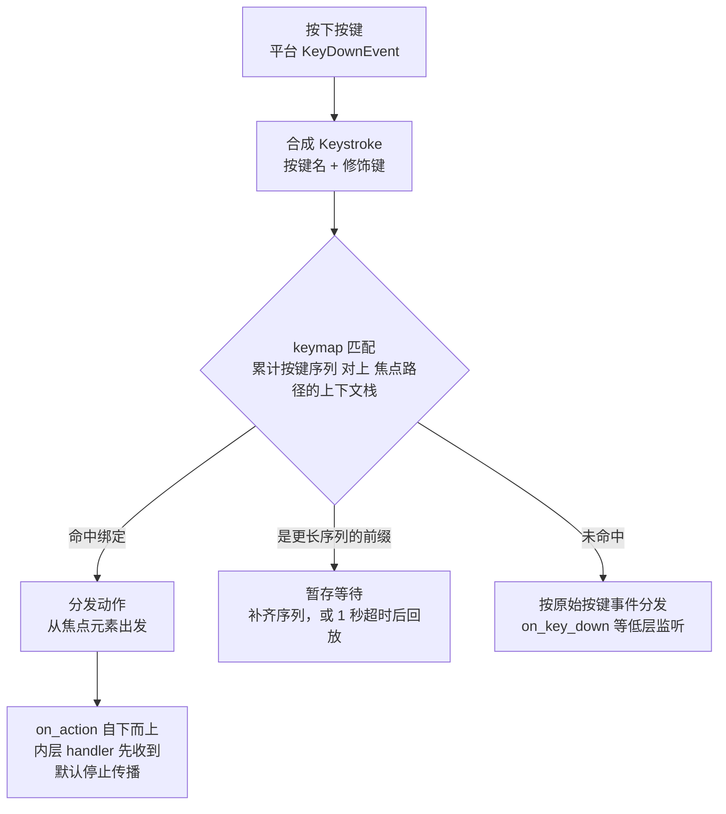

import { Meta } from '@storybook/addon-docs/blocks';

<Meta id="actions-and-keybindings" title="交互/动作与快捷键" name="Docs" />

# 动作与快捷键

GPUI 是键盘优先的框架。鼠标交互把回调直接挂在元素上（3.1 课），键盘交互则多走一层抽象：把功能包装成**动作**（action），再声明哪个按键在哪个**上下文**里触发它。动作是你可以自己定义的框架级事件——和 `MouseDown` 这类内置事件地位相同，能绑按键、能被菜单和命令面板复用、能在测试里手动分发。本课覆盖完整链路：定义动作（`actions!`）→ 注册绑定（`KeyBinding` / `bind_keys`）→ 声明上下文（`key_context`）→ 处理动作（`on_action`）→ 分发（`dispatch_action`）。读完你能预测：按下 `cmd-z` 时哪一层 handler 先收到、绑定写了却不生效时去查哪三个地方。

一次按键从敲下到触发 handler 的完整路径：



核心类型与宏回查表（详细语义见后文小节）：

| 名称 | 类别 | 作用 |
| --- | --- | --- |
| `actions!(editor, [Undo, Redo])` | 宏 | 批量定义单元结构体动作，自动注册 |
| `#[derive(Action)]` + `#[action(namespace = editor)]` | 派生宏 | 把带字段的结构体变成可带参数的动作 |
| `KeyBinding::new("cmd-z", Undo, Some("Editor"))` | 方法 | 把按键序列绑定到动作，第三个参数是上下文条件 |
| `cx.bind_keys([...])` | `App` 方法 | 注册一批绑定，通常在应用启动回调里调用 |
| `.key_context("Editor")` | 元素方法 | 给子树声明按键上下文名，供绑定匹配 |
| `.on_action(handler)` | 元素方法 | 挂动作处理器，Bubble 相位、自下而上 |
| `.capture_action(handler)` | 元素方法 | Capture 相位拦截动作，自上而下，先于内层 |
| `.on_boxed_action(&action, handler)` | 元素方法 | 按运行时值匹配动作，供组件库动态分发 |
| `window.dispatch_action(action, cx)` | `Window` 方法 | 对当前焦点元素分发一个动作 |
| `focus_handle.dispatch_action(...)` | `FocusHandle` 方法 | 对该焦点对应的元素分发动作 |
| `cx.on_action(handler)` | `App` 方法 | 全局动作监听，窗口内无人处理时兜底 |
| `Keystroke` | 结构体 | 一次按键：`key` + `modifiers` + `key_char` |
| `KeyContext` | 结构体 | 上下文标识集合：标识符与 key=value 对 |
| `NoAction` | 结构体 | 绑到某键上即解绑该键 |

以上均为 gpui 0.2.2 已发布的 API。两处版本差异如实标注：官方 `key_dispatch.md`（main 分支）用 `#[gpui::action]` 属性示意动作声明，但 0.2.2 与当前 main 的 gpui_macros 里实际可用的都是 `actions!` 与 `#[derive(Action)]`，本课按后者讲；入口方面，0.2.2 用 `Application::new().run(...)`，main 分支示例改用 `gpui_platform::application().run(...)`（未发布到 crates.io），`bind_keys` 的挂法两种入口相同。

## 定义动作：actions! 与 Action derive

动作是实现 `Action` trait 的类型。trait 本身很机械（`boxed_clone`、`name`、`build` 等样板），实际从不手写：单元动作用 `actions!` 宏，带参数的动作派生 `Action`。声明的同时动作会注册进全局表，keymap 和 JSON 键位文件按**完全限定名**（命名空间 + 类型名，如 `menu::MoveUp`）标识它——所以命名空间是动作身份的一部分。

### actions!：批量声明单元动作

无参数的功能（撤销、保存、切换面板）用单元结构体，`actions!` 一行生成一批并自动完成注册与 trait 实现：

```rust
// 第一个参数是命名空间；生成的动作在 keymap 中标识为 "counter::Increment" 等
actions!(counter, [Increment, Decrement]);
```

`actions!` 把每个名字展开为 `pub struct`，自动派生 `Clone`、`PartialEq`、`Default`、`Debug`、`Action` 并设好命名空间。命名空间可以省略（`actions!([Increment])`），但 Zed 键位体系要求动作带命名空间，建议总是显式给出。注意动作是**全局注册**的：两个动作若得到相同的完全限定名，`App` 创建时会 panic——跨 crate 复用动作名时靠命名空间区分。

### 带参数的动作：derive Action

动作需要携带数据（移动方向、替换选项）时，手写结构体并派生 `Action`，用 `#[action(...)]` 指定命名空间等选项：

```rust
use gpui::Action;

#[derive(Clone, PartialEq, serde::Deserialize, schemars::JsonSchema, Action)]
#[action(namespace = menu)]
pub struct Move {
    pub direction: Direction, // 方向枚举，随动作一起传递
    pub select: bool,
}
```

派生 `Action` 要求类型实现 `Clone` 和 `PartialEq`；默认还要求 `serde::Deserialize` 与 `schemars::JsonSchema`，因为带参数的动作要能从 JSON 键位文件构建——键位里写作 `["menu::Move", { "direction": "up", "select": false }]`，运行时由 `Action::build` 从 JSON 值还原。不想支持 JSON 时加 `#[action(no_json)]` 即可省去这两个 trait；`#[action(...)]` 还支持 `name = "..."`（覆盖动作名）、`no_register`（只实现不注册）、`deprecated_aliases` / `deprecated`（改名过渡）。确实要手写 `Action` impl 时，用 `register_action!(Paste)` 完成注册那一半。

## 注册绑定：KeyBinding 与 bind_keys

绑定回答"哪个按键序列在什么条件下触发哪个动作"。`KeyBinding::new` 的三个参数依次是按键序列、动作值、上下文条件；`bind_keys` 把一批绑定装进应用级 keymap，通常在启动回调里集中调用：

```rust
fn run_example() {
    Application::new().run(|cx: &mut App| {
        // 第三个参数 Some("Counter") 表示只在 Counter 上下文里生效；
        // 传 None 则全局生效（不受上下文限制）
        cx.bind_keys([
            KeyBinding::new("up", Increment, Some("Counter")),
            KeyBinding::new("down", Decrement, Some("Counter")),
        ]);
        // ...打开窗口
    });
}
```

`KeyBinding::new` 在解析失败时直接 panic（键名拼错、修饰符写错立刻暴露在启动阶段）。`bind_keys` 接受任何 `IntoIterator<Item = KeyBinding>`，重复调用可分批注册；keymap 内部记录注册顺序，因为顺序决定优先级（见本节末尾）。

**多键序列**用空格分隔，例如 VS Code 风格的 chord：

```rust
// 先按 cmd-k 再按 left，两个键都命中才触发 SplitLeft
KeyBinding::new("cmd-k left", SplitLeft, Some("Pane")),
```

单个键的写法由 `Keystroke::parse` 定义，语法是 `[secondary-][ctrl-][alt-][shift-][cmd-][fn-]key`。修饰符里最容易踩坑的两个：`platform` 在 macOS 上指 `cmd`，在 Windows 上是 `win`、Linux 上是 `super`；`secondary` 是语义化的"主修饰键"——macOS 上等价 `cmd`、其余平台等价 `ctrl`，想要跨平台的"复制键位"写 `secondary-c` 即可。`Modifiers` 结构体的字段 `control` / `alt` / `shift` / `platform` / `function` 与之一一对应。

**解绑**用 `NoAction`：把键绑到这个特殊动作上，当它是最高优先级匹配时该键就不触发任何动作：

```rust
// 在 Editor 上下文里废掉 cmd-k cmd-s（常见于要自定义 chord 的场景）
KeyBinding::new("cmd-k cmd-s", NoAction, Some("Editor")),
```

**优先级**由 `Keymap` 统一裁决，规则两条：上下文**越深越优先**（绑定发生在焦点路径的内层上下文时胜出，没有上下文条件的绑定视同最深上下文一层）；深度相同时**后注册的优先**（用户自定义绑定后注册，所以能覆盖内置绑定）。这正是 Zed 里 Editor 快捷键压过 Pane、Pane 压过 Workspace 的机制：

```rust
// 嵌套元素分别声明上下文：外层 div().key_context("Workspace")，
// 内层 div().key_context("Editor")，焦点落在 Editor 子树时，
// 上下文栈是 [Workspace, Editor]，两条绑定都能匹配；
// 但 Editor 层更深，第二个绑定胜出——同一个 cmd-s 只触发 Save
cx.bind_keys([
    KeyBinding::new("cmd-s", SaveAll, Some("Workspace")),
    KeyBinding::new("cmd-s", Save, Some("Editor")),
]);
```

## 声明上下文与处理动作：key_context 与 on_action

上下文与处理器都挂在元素上，二者分工：`key_context` 圈定"按键绑定在这里生效"，`on_action` 声明"动作到这里处理"。完整的挂法集中在 `render` 里：

```rust
impl Render for Counter {
    fn render(&mut self, _window: &mut Window, cx: &mut Context<Self>) -> impl IntoElement {
        div()
            .id("counter")
            .key_context("Counter")              // 声明上下文：子树内按键按 "Counter" 匹配
            .on_action(cx.listener(Self::increment)) // 处理 Increment 动作
            .on_action(cx.listener(Self::decrement)) // 处理 Decrement 动作
            .track_focus(&self.focus_handle)     // 让焦点可落在这棵子树（详见 3.3）
            // ...样式
    }
}

impl Counter {
    // cx.listener 适配出的方法签名：动作引用在最前，window 与实体 cx 在后
    fn increment(&mut self, _: &Increment, _window: &mut Window, cx: &mut Context<Self>) {
        self.count += 1;
        cx.notify();
    }

    fn decrement(&mut self, _: &Decrement, _window: &mut Window, cx: &mut Context<Self>) {
        self.count -= 1;
        cx.notify();
    }
}
```

原始监听器的签名是 `Fn(&A, &mut Window, &mut App)`，`cx.listener` 负责把它适配成实体方法（与 1.3 课同一套机制）。两个易混点直给：`.id()` 对 `on_action` 不是必需的（它不像 `on_click` 依赖有状态元素）；处理器挂在哪层 div 上，取决于你希望动作在这棵子树的哪一段被接住。

`key_context` 的匹配规则：绑定里的上下文条件会对**焦点路径上的上下文栈**逐层求值，标识符按字符串精确匹配。条件不只是单个名字，支持一组逻辑运算符：

```rust
// 绑定条件示例（KeyBinding::new 的第三个参数）
Some("Editor")                       // 上下文栈里出现 Editor 标识符即匹配
Some("Editor && vim_mode")           // 同时要有 vim_mode
Some("StatusBar && mode == visible") // 标识符 + key=value 键值对
Some("!terminal")                    // 取反；也支持 != 与 ||、括号组合
```

`key=value` 对来自 `KeyContext::set`（比如根据面板可见性 `set("mode", "visible")`），标识符来自 `key_context("名字")`。框架会在上下文里预置 `os` 键（值为 `macos` / `linux` / `windows` / `unknown`），平台差异化键位可直接写 `os == macos`。上下文名拼错不会报错，只是永远匹配不上——排查时先比对两边字符串。

动作监听家族回查：

| 方法 | 相位与方向 | 用途 |
| --- | --- | --- |
| `on_action(handler)` | Bubble，自下而上 | 常规处理：内层 handler 先收到，默认停止传播 |
| `capture_action(handler)` | Capture，自上而下 | 内层处理前拦截（如全局接管某动作的 vim 模式） |
| `on_boxed_action(&action, handler)` | 同 `on_action` | 动作类型运行时才确定时使用，回调收到 `&dyn Action` |
| `cx.on_action(handler)`（`App` 方法） | 全局，最后兜底 | 窗口内无人处理的动作统一到应用层 |

`key_context` 匹配的前提是该元素在焦点路径上：从根到**焦点元素**的祖先链上有这个上下文，绑定才可能命中——`track_focus` + `focus` 负责把焦点放进子树。焦点系统的完整规则（`FocusHandle`、Tab 导航）归 3.3 课，本课只需记住：**上下文和处理器必须在焦点的祖先链上**。

## 动作如何分发：从按键到 handler

把前几节的零件串成完整流程。按键敲下后（gpui 0.2.2 `window.rs` 的 `dispatch_key_event`）：

1. 窗口按需重绘上一帧残留的脏界面，保证分发布的元素树是新的；随后沿焦点元素取一条**分发路径**（根到焦点节点的链）。
2. 窗口先过一道内部按键拦截器（`dispatch_keystroke_interceptors`），被消费的按键到此为止；普通应用不接触这一层。
3. 进入 `dispatch_key` 匹配：把累计的按键序列对上 keymap 与焦点路径的上下文栈。序列**恰好命中**绑定则拿到动作；**是某个更长绑定的前缀**则进入等待（暂存为 pending input），窗口同时启动 1 秒定时器——超时仍等不到后续键，就把暂存的按键当作普通按键事件回放，界面不会永久卡住。
4. 命中绑定后执行 `dispatch_action_on_node`，动作沿分发路径走四段：全局动作监听的 Capture → 窗口内 `capture_action` 自上而下 → `on_action` 自下而上 → 全局动作监听的 Bubble。动作在 Bubble 相位**默认停止传播**：最内层匹配的 `on_action` 执行后分发即结束；想让动作继续上浮（父级补充处理），在 handler 里调用 `cx.propagate()`。
5. 未命中任何绑定的按键走原始按键事件：`on_key_down` 等低层监听按 Capture → Bubble 分发，随后是修饰键变化事件。也就是说**命中的绑定先于原始按键监听**，前者消费掉的事件不会落到后者。

手动分发与观察的三组入口：

```rust
// 测试与程序化触发：对某个焦点对应的元素分发动作（testing.rs 中的用法）
focus_handle.dispatch_action(&Increment, window, cx);

// 对窗口当前焦点元素分发：动作来自运行时值时用 Box<dyn Action>
window.dispatch_action(Box::new(Increment), cx);

// 模拟用户按键：完整走一遍"匹配 -> 分发"流程，返回是否被消费
window.dispatch_keystroke(Keystroke::parse("cmd-k").unwrap(), cx);

// 观察多键序列的等待状态：界面常显示"cmd-k ..."就靠它
let pending: Option<&[Keystroke]> = window.pending_input_keystrokes();
```

`FocusHandle::dispatch_action` 接 `&dyn Action`、直达该焦点对应的节点，是测试里验证动作链路的标准姿势；`Window::dispatch_action` 接 `Box<dyn Action>`、落在当前焦点上，适合命令面板这类"拿到动作值再执行"的场景；`dispatch_keystroke` 则不复记账路，连多键序列的 pending 行为都和真实按键一致。`App::on_action` 注册的全局监听在窗口内无人处理时最后执行，适合应用级兜底（如统一的动作日志）。

## 最佳实践

- **动作 vs 普通回调。** 局部、一次性的交互（按钮变色、切换一个开关）直接用 `on_click`，不必套动作。符合下列任一条件时做成动作：功能要绑键盘快捷键；同一功能有多个触发入口（菜单项、命令面板、按钮都调用同一个动作，处理逻辑只写一份）；希望在测试里不渲染真实输入就能触发（`dispatch_action`）；希望未来可被用户自定义键位或无障碍入口触发。动作把"功能本身"与"怎么触发"解耦，回调把两者焊死。
- **上下文按组件命名，按模式细化。** 主上下文名用组件名（`Editor`、`Counter`），可变状态用 key=value 对（`mode == visible`）而不是再造一堆上下文名；绑定条件尽量写窄（`Editor && vim_mode`），避免动作在无关界面里误触发。
- **绑定集中注册，动作就近定义。** 动作定义跟组件放一起（`actions!(counter, [...])` 写在 counter 模块），绑定统一在启动回调 `bind_keys`，一处可见全部键位；利用"后注册优先"让用户配置层覆盖默认绑定，用 `NoAction` 做定点禁用。

## 常见问题

- 绑定写了、按键却没反应
  按三个方向排查：上下文是否在焦点祖先链上（子树没有 `track_focus` 且 `focus` 过，或 `key_context` 挂在了焦点路径之外）；`key_context("Counter")` 与绑定里的 `Some("Counter")` 字符串是否完全一致（拼错不报错、只是匹配不上）；绑定是否被更内层的同键绑定抢先消费（用 `Keymap::bindings_for_input` 的优先级规则检查嵌套层级）。测试里可先 `focus_handle.dispatch_action(&Action, window, cx)` 验证处理器本身没问题，再排查按键匹配。
- 按下 `cmd-k` 之后界面像"卡住"了，后续按键行为诡异
  这是多键序列的等待状态：`cmd-k` 是更长绑定的前缀，窗口暂存它并等待下一键，期间的按键不会立即产生效果。1 秒内补齐序列则触发；超时后暂存按键自动回放为普通按键。需要界面提示时读 `window.pending_input_keystrokes()`。
- 启动时 panic，提示动作重复注册
  `actions!` 和 `#[derive(Action)]` 都会把动作注册进全局表，两个动作得到相同的完全限定名（同命名空间同名）就会在 `App` 创建时 panic。跨 crate 复用动作名时换命名空间；只是临时试验可用 `#[action(no_register)]` 跳过注册。
- `KeyBinding::new` 在启动时直接 panic
  按键序列字符串没通过 `Keystroke::parse`（修饰符名拼错、键名非法）。对照语法 `[secondary-][ctrl-][alt-][shift-][cmd-][fn-]key` 检查；`KeyBinding::new` 刻意在启动阶段 panic，让错误暴露得早而不是按键时静默失效。

## 总结回顾

摘要：

动作是用户自定义的框架级事件，键盘驱动的功能都做成动作：`actions!` 批量定义单元动作，带参数的动作派生 `Action` 并可用 `#[action(...)]` 配置命名空间与 JSON 支持，动作以完全限定名注册进全局表。绑定用 `KeyBinding::new(按键序列, 动作, 上下文条件)` 写好、`bind_keys` 注册进 keymap，序列用空格分隔，修饰符注意 `platform` 与 `secondary` 的跨平台语义，`NoAction` 解绑，优先级是上下文越深越优先、同深度后注册优先。元素侧 `key_context` 圈定匹配范围（支持 `&&` / `||` / `!` / `==` / `!=` 谓词），`on_action` 自下而上处理动作且默认停止传播（`cx.propagate()` 放行），`capture_action` 反向拦截；二者都必须落在焦点祖先链上才生效。分发时命中绑定先于原始按键事件，多键序列有暂存与 1 秒超时回放，手动分发可选 `FocusHandle::dispatch_action`、`Window::dispatch_action` 与 `dispatch_keystroke`。

一句话：

> 键盘快捷键 = 用 `actions!` 定义动作、用 `KeyBinding` 绑到"上下文 + 按键"、用 `key_context` + `on_action` 挂在焦点祖先链上接住分发——四件套缺一，绑定就静默失效。

知识要点：

- 动作与普通回调的取舍：哪些情况值得把功能包装成动作
- 从按键敲下到 handler 执行的完整链路，哪个环节决定绑定能否命中
- `actions!` 与 `#[derive(Action)]` 各适合什么场景，动作在 keymap 里如何标识
- `KeyBinding::new` 三个参数的含义，多键序列怎么写，如何解绑一个键
- `key_context` 的匹配规则与两条优先级，`on_action` 与 `capture_action` 的方向差异
- 动作 Bubble 相位的默认传播行为，怎么让它继续上浮
- 手动分发动作的三组入口分别适合什么场景
- 绑定不生效、序列等待、重名 panic、解析 panic 各自的判断与处理

## 参考资料

- [Key Dispatch（官方按键分发文档，main 分支 docs 目录）](https://raw.githubusercontent.com/zed-industries/zed/main/crates/gpui/docs/key_dispatch.md)
- [官方示例 testing.rs（actions!、bind_keys、key_context + on_action + track_focus、dispatch_action 测试用法）](https://github.com/zed-industries/zed/blob/main/crates/gpui/examples/testing.rs)
- [actions! 宏 - docs.rs/gpui 0.2.2](https://docs.rs/gpui/0.2.2/gpui/macro.actions.html)
- [Action trait 与 derive Action（#[action(...)] 全部选项）- docs.rs/gpui 0.2.2](https://docs.rs/gpui/0.2.2/gpui/trait.Action.html)
- [KeyBinding（new 的解析时机与查询方法）- docs.rs/gpui 0.2.2](https://docs.rs/gpui/0.2.2/gpui/struct.KeyBinding.html)
- [Keymap（bindings_for_input 的优先级规则）- docs.rs/gpui 0.2.2](https://docs.rs/gpui/0.2.2/gpui/struct.Keymap.html)
- [Keystroke（parse 语法与 key / key_char 字段；Modifiers 同模块）- docs.rs/gpui 0.2.2](https://docs.rs/gpui/0.2.2/gpui/struct.Keystroke.html)
- [KeyContext（标识符与 key=value 的解析格式）- docs.rs/gpui 0.2.2](https://docs.rs/gpui/0.2.2/gpui/struct.KeyContext.html)
- [NoAction（解绑语义）- docs.rs/gpui 0.2.2](https://docs.rs/gpui/0.2.2/gpui/struct.NoAction.html)
- [InteractiveElement（key_context、on_action、capture_action、on_boxed_action）- docs.rs/gpui 0.2.2](https://docs.rs/gpui/0.2.2/gpui/trait.InteractiveElement.html)
- [App（bind_keys、on_action、propagate / stop_propagation）- docs.rs/gpui 0.2.2](https://docs.rs/gpui/0.2.2/gpui/struct.App.html)
- [Window（dispatch_action、dispatch_keystroke、pending_input_keystrokes）- docs.rs/gpui 0.2.2](https://docs.rs/gpui/0.2.2/gpui/struct.Window.html)
- [FocusHandle（dispatch_action）- docs.rs/gpui 0.2.2](https://docs.rs/gpui/0.2.2/gpui/struct.FocusHandle.html)
- [gpui 0.2.2 源码 key_dispatch.rs（模块文档与 dispatch_key 匹配、pending 回放）](https://docs.rs/crate/gpui/0.2.2/source/src/key_dispatch.rs)
- [gpui 0.2.2 源码 window.rs（dispatch_key_event 与 dispatch_action_on_node 的四段相位）](https://docs.rs/crate/gpui/0.2.2/source/src/window.rs)
