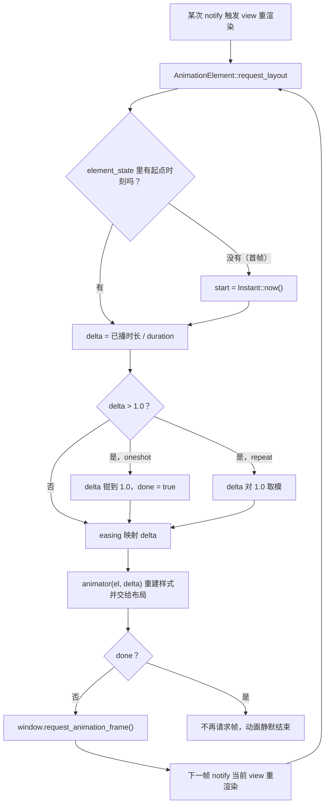

import { Meta } from '@storybook/addon-docs/blocks';

<Meta id="animation" title="实战能力/动画" name="Docs" />

# 动画

GPUI 没有独立的动画引擎，也没有动画线程。一个元素"动起来"，本质是**同一个元素在相邻两帧里样式不同**：框架把经过的时间折算成 0 到 1 之间的进度值 delta，你用一个闭包回答"进度为 delta 时元素长什么样"，框架负责每一帧来问一次。

给元素挂动画有两条路。**声明式**的 `with_animation` 把动画直接链在元素上：时间轴由 `Animation` 描述，动画元素自己逐帧请求重绘、逐帧重算样式，播完自动停，全程不占一个异步任务。**手动**逐帧则退回帧原语和 4.4 课的工具箱：`request_animation_frame` / `on_next_frame` 控制帧，`cx.spawn` 加 `Timer` 按真实时间推进状态。暂停、变速、中途改目标、多实体联动这些"进度不是单调时间函数"的需求，都走第二条路。

本课主线：先建立 `with_animation` 的模型与帧驱动机制，再过时长、循环、动画链与 easing 家族的选用，然后是手动逐帧的两种写法与选型判据，最后标注 main 分支新增的弹簧动画等 API。签名一律核对自 docs.rs 的 gpui 0.2.2；main 分支新增的 API 会单独标注。本课只讲动画本身；`notify` 驱动重渲染的模型归 1.3 课，`spawn` 与 `Task` 生命周期归 4.4 课。

## 动画 API 速查

| 成员 | 用途 | 关键点 |
| --- | --- | --- |
| `Animation::new(duration)` | 构造时间轴 | 默认只播一次，`linear` 缓动 |
| `Animation::repeat()` | 改为循环播放 | 进度对时长取模，永不结束 |
| `Animation::with_easing(f)` | 换缓动函数 | 输入、输出都是归一化进度 |
| `AnimationExt::with_animation(id, anim, animator)` | 动画挂上元素 | `animator: Fn(el, delta) -> el`，每帧调用 |
| `AnimationExt::with_animations(id, vec, animator)` | 串联多段动画 | `animator: Fn(el, ix, delta) -> el`，段间自动衔接 |
| `AnimationElement::map_element(f)` | 一次性变换被动画的元素 | 例如再包一层样式 |
| `Window::request_animation_frame()` | 请求下一帧重绘 | view 内调用等于下一帧 notify 该 view |
| `Window::on_next_frame(f)` / `Context::on_next_frame(window, f)` | 下一帧执行回调 | 当前帧渲染完成后立即运行 |
| `gpui::Timer::after(d)` | 手动逐帧的等待原语 | 配合 `cx.spawn` 循环使用（4.4 课） |

## Easing 函数速查

| 函数 | 形态 | 节奏 |
| --- | --- | --- |
| `linear` | 直接函数 | 匀速，`Animation::new` 的默认值 |
| `quadratic` | 直接函数 | 二次缓入，持续加速 |
| `ease_in_out` | 直接函数 | 两头慢、中间快 |
| `ease_out_quint()` | 工厂函数，注意括号 | 开局最快，减速停住 |
| `bounce(ease)` | 组合器 | 前半程去、后半程回 |
| `pulsating_between(min, max)` | 生成器 | 正弦呼吸，输出落在 `min..max` |

## `with_animation`：动画挂上元素

`with_animation` 是 `AnimationExt` trait 提供的扩展方法，任何 `IntoElement` 都能用。三个参数各管一件事：

```rust
// with_animation(id, animation, animator) 的三参数模型
el.with_animation(
    "my-anim",                    // 1. ElementId：动画进度状态的存取键
    Animation::new(Duration::from_secs(2)), // 2. 时间轴：多长、是否循环、什么节奏
    |el, delta| el.opacity(delta), // 3. 样式闭包：进度为 delta 时元素长什么样
)
```

- **id** 不只是调试标签。动画的起点时刻和当前段序号存在元素的 `element_state` 里，键就是 id（连同元素在树中的位置）。id 稳定，进度就跨渲染延续；id 换了，动画从头开始。
- **`Animation`** 是纯数据描述的时间轴：`duration` 决定多长，默认 `oneshot: true` 播一次、`linear` 缓动；`.repeat()` 改循环，`.with_easing(f)` 换节奏。
- **animator 闭包**签名是 `Fn(Self, f32) -> Self`：拿到上一帧的元素和本帧进度，返回改过样式的新元素。它必须是 delta 的纯函数——每帧被框架调用，不归你调度。

官方示例（0.2.2 可运行）是最短的完整示范——svg 图标循环旋转：

```rust
// 官方 examples/animation.rs（0.2.2）：svg 图标 2 秒一圈循环旋转
svg()
    .size_20()
    .overflow_hidden()
    .path(ARROW_CIRCLE_SVG)
    .text_color(gpui::black())
    .with_animation(
        "image_circle",                        // 进度状态的存取键
        Animation::new(Duration::from_secs(2)) // 时间轴：2 秒一圈
            .repeat()                          // 循环
            .with_easing(bounce(ease_in_out)), // 前半转过去、后半转回来
        |svg, delta| {
            // 每帧调用：delta 是 0..1 的动画进度，直接映射成旋转角
            svg.with_transformation(Transformation::rotate(percentage(delta)))
        },
    )
```

### 帧驱动：动画怎么自己跑起来

`with_animation` 返回的 `AnimationElement` 是一个普通 GPUI 元素，动画的全部调度逻辑都在它的 `request_layout` 里，不涉及任何任务或线程：



三点推论值得记住：

- **动画是"每帧 notify"的闭环。** `request_animation_frame` 的文档语义：让窗口在下一帧重绘，即使没有其他变化；在 view 内调用时，下一帧会 notify 该 view。于是重渲染、算 delta、再请求下一帧，循环往复——但 delta 按墙钟计算（首次渲染的 `Instant` 起算），所以 notify 的时机抖动不影响进度正确性。
- **播完自动停。** oneshot 动画走到 delta = 1.0 后不再请求帧，重绘频率回落到"有变化才渲染"，不需要任何清理代码。
- **其他 notify 不会重置进度。** 进度状态在 `element_state` 里跨渲染保留；别处改状态触发重渲染时，动画从当前进度继续，而不是从头播。

一个 0.2.2 的边界：`AnimationElement` 此时还没实现 `ParentElement`，`with_animation(...).child(...)` 编译不过——需要子元素就把它们放进被包裹的元素内部（`div().child(...)` 再挂动画）。main 分支已补上该实现，链式顺序自由了。

## 时长、循环与动画链

### 一次过渡

`Animation::new` 默认就是 oneshot：挂载后播一遍，停在 delta = 1.0 的终态。最常见的"入场过渡"只需要时长加一个缓动：

```rust
// 一次性过渡：挂载后 300ms 淡入，delta 从 0 走到 1，opacity 直接吃 delta
// ease_out_quint 让动画开局最快、随后减速停住，比匀速更利落
div()
    .child("淡入的提示条")
    .with_animation(
        "fade-in",
        Animation::new(Duration::from_millis(300)).with_easing(ease_out_quint()),
        |el, delta| el.opacity(delta),
    )
```

oneshot 是"从挂载时刻到终态"的一次性时间轴，只对"出现时播放"的场景成立；hover 变色这类"状态切换"的过渡请对照下面的手动模式或 main 分支的弹簧。

### 循环动画

`.repeat()` 之后进度对时长取模，动画永不结束。内置的 `pulsating_between` 专为循环呼吸设计：

```rust
// 呼吸灯：2 秒一个周期，不透明度在 0.3..1.0 之间正弦起伏
div()
    .size(px(32.0))
    .rounded_full()
    .bg(gpui::blue())
    .with_animation(
        "breathing",
        Animation::new(Duration::from_secs(2))
            .repeat()
            .with_easing(pulsating_between(0.3, 1.0)),
        |el, alpha| el.opacity(alpha),
    )
```

### 动画链

`with_animations` 接收一个 `Vec<Animation>`，按顺序自动衔接：前一段 delta 超过 1.0 时，起点时刻重置、段序号加一，animator 收到 `(el, 段序号, 本段delta)`。适合"多段编排"——比如先过冲再落位：

```rust
// 两段式弹跳入场：第一段快速放大到 40px（过冲），第二段缓缓回落到 32px
div()
    .child("Hi")
    .with_animations(
        "bounce-in",
        vec![
            Animation::new(Duration::from_millis(150)).with_easing(ease_out_quint()),
            Animation::new(Duration::from_millis(300)).with_easing(ease_in_out),
        ],
        |el, ix, delta| match ix {
            0 => el.size(px(24.0 + 16.0 * delta)), // 第一段：24px -> 40px
            _ => el.size(px(40.0 - 8.0 * delta)),  // 第二段：40px -> 32px
        },
    )
```

链中的每一段都保持默认的一次性配置，整条链才会顺序推进；哪一段配了 `.repeat()`，动画就会永远停在那一段循环。

## Easing 缓动函数

easing 是 `Fn(f32) -> f32`：把时间进度映射成值进度。`AnimationElement` 先按墙钟算出线性 delta，处理完超界（钳到 1.0 或取模），再把结果交给 easing——所以 easing 只决定"节奏"，不管"什么时候播、播多久"。

开场速查表里的六个成员按形态记：

- **直接函数**（`linear`、`quadratic`、`ease_in_out`）：本身就是 `fn(f32) -> f32`，直接传给 `with_easing`，也能作为 `bounce` 的原料。
- **工厂函数**（`ease_out_quint()`）：返回闭包，别漏了调用括号——`with_easing(ease_out_quint())` 才对，`with_easing(ease_out_quint)` 编译错误。
- **组合器**（`bounce(ease)`)：把任意 easing 变成"前半程正向、后半程反向"，官方旋转示例用 `bounce(ease_in_out)` 实现"转过去再转回来"。
- **生成器**（`pulsating_between(min, max)`）：按参数生成正弦呼吸闭包，输出落在你给的区间里。

自定义闭包同样直接：

```rust
// smoothstep：两端速度为零的平滑过渡，比 quadratic 更"匀"
let smoothstep = |t: f32| t * t * (3.0 - 2.0 * t);

div()
    .relative()
    .with_animation(
        "slide",
        Animation::new(Duration::from_millis(250)).with_easing(smoothstep),
        |el, delta| el.left(px(200.0 * delta)), // left 需配合 .relative()/.absolute() 生效
    )
```

**0.2.2 的硬边界：easing 输出必须落在 0..=1。** 源码在 easing 应用后有一条 `debug_assert`（消息为 `delta should always be between 0 and 1`），过冲型曲线（easeOutBack 之类输出会超过 1.0）在 debug 构建直接 panic，release 构建静默越界。想全用上过冲观感，要么把输出压回区间（例如 `0.5 + 0.5 * overshoot(t)`），要么用 main 分支的弹簧——main 已移除这条断言，`with_easing` 的文档明确允许物理缓动过冲。

## 手动逐帧动画

当进度写不成 delta 的纯函数——要暂停、变速、倒放、中途改目标、多实体联动——就需要自己持有状态、自己推进。0.2.2 有两种官方在用的写法。

### render 内推进 + `request_animation_frame`

官方 `examples/opacity.rs` 的写法：状态放实体字段，`render` 里前进一步，没播完就再请求下一帧：

```rust
// 官方 examples/opacity.rs（0.2.2 节选）：render 内推进状态，帧原语驱动
impl Render for HelloWorld {
    fn render(&mut self, window: &mut Window, cx: &mut Context<Self>) -> impl IntoElement {
        if self.animating {
            self.opacity += 0.005; // 每帧前进一步
            if self.opacity >= 1.0 {
                self.animating = false; // 播完：置结束标记，不再请求帧
                self.opacity = 1.0;
            } else {
                window.request_animation_frame(); // 请求下一帧继续
            }
        }
        // ……正常渲染，.opacity(self.opacity) 读状态……
    }
}
```

它和 `with_animation` 共用同一套帧机制：`request_animation_frame` 在下一帧 notify 当前 view，view 重渲染又走到这里。区别只在进度来源——从"墙钟推导"换成"自己累加"。代价也在这里：**每帧固定加 0.005，动画速度就和帧率绑死了**，120Hz 屏上比 60Hz 快一倍。官方示例没有除以帧时长，抄写时注意这一点。

### `spawn` + `Timer` 循环

按真实时间推进、与帧率解耦的手动模式，就是 4.4 课连招的直接应用——`spawn` 起主线程异步任务，循环里 `Timer` 等待、回实体改状态并 `cx.notify()`：

```rust
use gpui::{percentage, prelude::*, px, Timer};
use std::time::Duration;

// 演示：手动逐帧的进度条。进度由 Timer 循环按真实时间推进，
// 暂停就是让循环退出，播放再起新循环。
struct Player {
    progress: f32, // 0.0..1.0，自己持有的动画进度
    playing: bool,
}

impl Player {
    fn toggle(&mut self, cx: &mut Context<Self>) {
        self.playing = !self.playing;
        cx.notify(); // 按钮文字立即变化
        if !self.playing {
            return;
        }
        cx.spawn(async move |this, cx| {
            loop {
                Timer::after(Duration::from_millis(16)).await; // 约 60 步/秒
                let keep_going = this
                    .update(cx, |this, cx| {
                        this.progress = (this.progress + 1.0 / 120.0) % 1.0; // 2 秒一圈
                        cx.notify(); // 不调用就不会重渲染
                        this.playing // 用闭包返回值决定循环去留
                    })
                    .unwrap_or(false); // Err = 实体已释放（窗口关闭），退出
                if !keep_going {
                    break;
                }
            }
        })
        .detach();
    }
}

impl Render for Player {
    fn render(&mut self, _: &mut Window, cx: &mut Context<Self>) -> impl IntoElement {
        div()
            .size_full()
            .flex()
            .flex_col()
            .items_center()
            .justify_center()
            .gap_2()
            .child(format!("进度 {:.0}%", self.progress * 100.0))
            .child(
                div()
                    .w(px(200.0))
                    .h(px(8.0))
                    .rounded_full()
                    .overflow_hidden()
                    .bg(gpui::black().opacity(0.1))
                    .child(
                        div()
                            .w(percentage(self.progress))
                            .h_full()
                            .bg(gpui::blue()),
                    ),
            )
            .child(
                div()
                    .id("toggle")
                    .border_1()
                    .px_4()
                    .py_2()
                    .child(if self.playing { "暂停" } else { "播放" })
                    .on_click(cx.listener(|this, _, _, cx| this.toggle(cx))),
            )
    }
}
```

### 两种手动模式怎么选

- **帧原语模式**（render 内推进 + `request_animation_frame`）：与显示刷新同步，逻辑最短，适合"跟着帧走"的简单推进；速度受帧率影响，要匀速得自己除以帧间时长。`on_next_frame(window, f)` 是它的回调变体——下一帧执行一次性闭包，适合"渲染完再做一件事"。
- **Timer 模式**（`spawn` + `Timer::after` 循环）：按真实时间推进，与帧率解耦，天然支持暂停、变速、状态机；但 `Timer` 是调度提示不是精确时钟（4.4 课口径），间隔有抖动，且要自己管理 `Task` 生命周期。

选型判据一句话：**能写成"样式 = delta 的纯函数"就用 `with_animation`，写不成就上手动模式。**

## 弹簧动画（仅 main）

main 分支把动画库向物理模型扩了一步：弹簧不是时间轴，而是**有状态的运动**——位置和速度都随时间演化。这一节全部 API 仅 main 分支可用，0.2.2 没有。

```rust
// 仅 main 分支：弹簧驱动的圆点。点击改 target，圆点带着当前速度奔向新位置
// （官方 main 示例的提示语就是 "click rapidly to redirect momentum"）
div()
    .absolute()
    .size(px(24.0))
    .rounded_full()
    .bg(rgba(0x3b82f6ff))
    .with_spring(
        "spring-position",
        SpringAnimation::new(SpringConfig::new(170.0, 14.0, 1.0)) // 刚度、阻尼、质量
            .to(self.target_position)
            .with_epsilon(0.25), // 位移小于该值视为落定
        |el, left| el.left(left),
    )
```

要点按家族记：

- **`SpringConfig`** 是阻尼谐振子的三个物理参数（`stiffness`、`damping`、`mass`）：刚度越大回弹越快；阻尼比 ζ 小于 1 才会过冲，`config.canonical()` 能拿到自然频率与阻尼比。
- **`with_spring(id, animation, animator)`** 与 `with_animation` 同型，但 id 挂着的是"位置加速度"的状态——中途改 target 不从头开始，而是携带动量重定向，这是弹簧相对时间轴动画的本质差异。`SpringPlayback`（`Running`/`Paused`/`Stopped`/`Completed`/`Cancelled`）控制播放状态。
- **`AnimationPhase`** 是弹簧的通用输出目标：`.to(AnimationPhase(...))` 之后，animator 收到的相位值可用 `interpolate_between(区间, 起, 止)` 在任意实现了 `Interpolate` 的类型间插值——`f32`、`Pixels`、`Rems`、`Rgba`、`Hsla` 都实现了，所以颜色和尺寸都能弹簧化。
- **`sampled_easing(config, epsilon)`** 把弹簧预采样成 `(时长, easing 闭包)`，喂给传统的 `with_animation`——在 0.2.2 风格的 API 里获得弹簧观感，代价是失去中途重定向能力。

main 分支在调度上还有三个增量：`Animation::repeat_synced()` 让循环动画锁到全 `App` 共享的时钟，多个元素相位一致；`Animation::with_max_fps(n)` 限制动画的重渲染频率（改用 timer 驱动）；整个 `AnimationExt` 家族自动尊重 `App::reduce_motion`——系统开启"减弱动态效果"时，oneshot 直接渲染终态、循环渲染起始态，不再调度任何帧。后两点对 0.2.2 用户是"自己做"的功能清单。

## 最佳实践

- **能声明式不手动。** `with_animation` 零任务、帧率跟随显示刷新、播完自停、进度按墙钟计算不受重渲染干扰；手动模式留给暂停、变速、重定向、联动这些时间轴表达不了的需求。需要"弹簧观感但一次性播放"时，main 的 `sampled_easing` 能把弹簧变成 `with_easing` 的原料。
- **优先动绘制属性，少动布局属性。** `opacity`、`Transformation::rotate`/`scale` 这类绘制层属性每帧只重走绘制；每帧改 `width`/`height`/`margin` 会让整棵布局树反复重排。官方旋转示例用 `with_transformation` 而不是改尺寸，就是这个原因。
- **循环动画是持续成本。** 只要元素还在元素树上，循环动画每帧触发一次完整 view 重渲染；滚出视口或被遮挡都不会自动暂停。不需要时用条件渲染摘掉元素，main 分支可以用 `with_max_fps` 限频。
- **预留"减弱动态效果"。** main 分支动画自动响应 `App::reduce_motion`；0.2.2 需要自己做开关——例如全局配置加条件跳过动画，或直接渲染终态。

## 常见问题

- debug 构建运行到动画就 panic，消息是 `delta should always be between 0 and 1`
  这是 0.2.2 对 easing 输出区间的 `debug_assert` 被自定义缓动触发了——过冲型曲线（输出超过 1.0 或小于 0.0）在 debug 构建必崩。处理：把曲线输出压回 0..=1（如 `0.5 + 0.5 * x`），或改用 main 分支（已允许过冲）。release 构建不会 panic，但越界值会原样进入样式。
- `with_animation(...)` 之后链 `.child(...)` 编译报错
  0.2.2 的 `AnimationElement` 未实现 `ParentElement`，动画元素不能继续挂子元素。处理：把子元素放进被包裹的元素内部——`div().child(...)` 之后再挂 `with_animation`。main 分支已补上该实现。
- 动画进度"莫名从头开始"，或几个本该同步的循环动画相位不一致
  进度状态以 `with_animation` 的 id 连同元素在树中的位置为键存在 `element_state` 里；id 变了、或元素插入/删除导致位置变了，旧进度就找不回来。处理：给动画元素稳定的 id（列表行里尤其注意用行标识而不是索引做 id）。
- Timer 循环驱动的动画间隔不稳、看起来"卡"
  `Timer::after` 是调度提示，实际唤醒时间可能晚于请求值（4.4 课口径），叠加系统负载抖动会直接反映成动画卡顿。处理：对帧节奏敏感的动画改用 `with_animation`（跟 vsync 走），或改用 `request_animation_frame` 按帧推进并自行用墙钟换算速度。

## 总结回顾

摘要：

GPUI 的动画没有引擎：`with_animation` 把一个 `Animation` 时间轴和样式闭包 `animator(el, delta)` 挂在元素上，`AnimationElement` 在 `request_layout` 里按墙钟算出进度、应用 easing、重建样式，并在未播完时调用 `request_animation_frame` 让下一帧 notify 当前 view，形成"每帧重渲染"的自驱动闭环，oneshot 播完自动停止，repeat 对时长取模循环，`with_animations` 把多段时间轴顺序衔接。easing 家族六个成员分三种形态：直接函数、工厂函数（`ease_out_quint()`）、组合器与生成器（`bounce`、`pulsating_between`）；0.2.2 断言 easing 输出在 0..=1，过冲曲线在 debug 构建会 panic。进度写不成 delta 纯函数时转手动逐帧：官方 `opacity.rs` 在 render 内推进状态并请求下一帧（速度与帧率绑定），`spawn` + `Timer` 循环按真实时间推进并 `notify`（与帧率解耦但要管理 `Task`）。main 分支新增有状态的弹簧动画（`SpringConfig`/`SpringAnimation`/`with_spring`，支持携带动量重定向）、`AnimationPhase` 插值、`sampled_easing`、`repeat_synced`、`with_max_fps` 与自动尊重 `App::reduce_motion`。

一句话：

> GPUI 动画只有两种写法：把样式写成 delta 的纯函数交给 `with_animation` 自驱动，或者自己持有进度、用帧原语和 `Timer` 循环逐帧推进。

知识要点：

- `with_animation` 三个参数各管什么，animator 闭包何时被调用、收到什么、返回什么
- 帧驱动闭环怎么转：`request_animation_frame` 到 notify 到重渲染，动画为何播完自动停、其他 notify 为何不重置进度
- oneshot、`repeat`、`with_animations` 的行为差异，动画链中某段配 `repeat` 会发生什么
- 六个内置 easing 的形态（直接函数、工厂、组合器、生成器）与选用，0.2.2 对输出区间的断言
- 两种手动逐帧模式的差异：render 内推进加 `request_animation_frame` 与 `spawn` 加 `Timer` 循环，各自的速度基准和代价
- main 分支弹簧动画的本质（有状态、可重定向）与 `repeat_synced`、`with_max_fps`、`reduce_motion` 的归属

## 参考资料

- [Animation - docs.rs/gpui 0.2.2](https://docs.rs/gpui/0.2.2/gpui/struct.Animation.html)
- [AnimationExt（with_animation / with_animations）- docs.rs/gpui 0.2.2](https://docs.rs/gpui/0.2.2/gpui/trait.AnimationExt.html)
- [ease_in_out - docs.rs/gpui 0.2.2](https://docs.rs/gpui/0.2.2/gpui/fn.ease_in_out.html)
- [ease_out_quint - docs.rs/gpui 0.2.2](https://docs.rs/gpui/0.2.2/gpui/fn.ease_out_quint.html)
- [bounce - docs.rs/gpui 0.2.2](https://docs.rs/gpui/0.2.2/gpui/fn.bounce.html)
- [pulsating_between - docs.rs/gpui 0.2.2](https://docs.rs/gpui/0.2.2/gpui/fn.pulsating_between.html)
- [Window（on_next_frame / request_animation_frame 文档）- docs.rs/gpui 0.2.2](https://docs.rs/gpui/0.2.2/gpui/struct.Window.html)
- [gpui 0.2.2 源码 src/elements/animation.rs（AnimationElement 帧循环、easing 模块、debug_assert）](https://docs.rs/crate/gpui/0.2.2/source/src/elements/animation.rs)
- [gpui 0.2.2 源码 examples/animation.rs（svg 旋转官方示例）](https://docs.rs/crate/gpui/0.2.2/source/examples/animation.rs)
- [gpui 0.2.2 源码 examples/opacity.rs（render 内推进 + request_animation_frame）](https://docs.rs/crate/gpui/0.2.2/source/examples/opacity.rs)
- [zed main 分支 examples/animation.rs（with_spring、AnimationPhase、弹簧重定向演示）](https://github.com/zed-industries/zed/blob/main/crates/gpui/examples/animation.rs)
- [zed main 分支 src/elements/animation.rs（repeat_synced、with_max_fps、reduce_motion、ParentElement 差异）](https://github.com/zed-industries/zed/blob/main/crates/gpui/src/elements/animation.rs)
- [zed main 分支 src/spring.rs（SpringConfig、SpringAnimation、AnimationPhase、sampled_easing）](https://github.com/zed-industries/zed/blob/main/crates/gpui/src/spring.rs)
