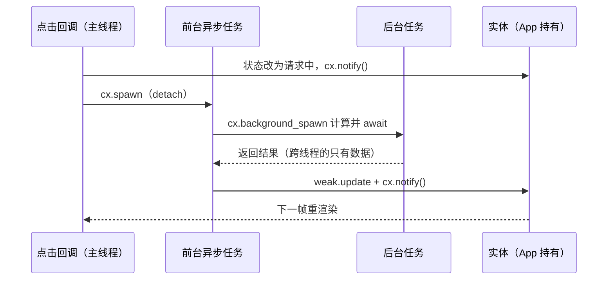

import { Meta } from '@storybook/addon-docs/blocks';

<Meta id="async-executor" title="架构核心/异步与执行器" name="Docs" />

# 异步与执行器

GPUI 的主线程同时承担三件事：平台事件循环、按键分发、每帧渲染。你写的任何一段同步代码——哪怕是按钮回调里一次 100ms 的文件读取——只要占着主线程，当前帧就出不去，界面随即冻结。所以"耗时工作不能在主线程上干"在 GPUI 里不是风格建议，而是框架成立的硬前提。

但"有异步"不等于"随便接一个 runtime"。spawn 出的 future 必须在正确的线程上被轮询：主线程任务碰不得线程池，后台任务更碰不了实体——GPUI 的所有实体数据都由主线程上的 `App` 持有。通用的 async runtime 不理解这套所有权模型，于是 GPUI 自带一对执行器（前台跑主线程、后台跑线程池）、一个任务句柄 `Task`，以及一组能在 `await` 之间存活的异步上下文，把线程约束和实体约束一起管起来。

本课的主线：先用一张 spawn 家族参考表回答"我该用哪个"，再拆开两个执行器的分工与 Send 约束、`Task` 的生命周期（核心结论：**drop 即取消，detach 才放生**），最后给出异步任务回到 UI 的完整通道与可复制例子。签名一律核对自 docs.rs 的 gpui 0.2.2；main 分支新增的 API 会单独标注。`Context` 类型本身的能力划分归 4.1 课，测试用确定性执行器归 6.1 课。

| 方法 | 在哪可用 | 跑在哪 | 约束 / 闭包收到什么 | 返回 |
| --- | --- | --- | --- | --- |
| `cx.spawn(f)` | `App` | 主线程 | `AsyncFnOnce(&mut AsyncApp) -> R` | `Task<R>` |
| `cx.spawn(f)` | `Context<T>` | 主线程 | `AsyncFnOnce(WeakEntity<T>, &mut AsyncApp) -> R` | `Task<R>` |
| `cx.spawn_in(window, f)` | `Context<T>` | 主线程 | `AsyncFnOnce(WeakEntity<T>, &mut AsyncWindowContext) -> R` | `Task<R>` |
| `window.spawn(cx, f)` | `&Window` + `&App` | 主线程 | `AsyncFnOnce(&mut AsyncWindowContext) -> R` | `Task<R>` |
| `cx.spawn(f)` | `AsyncApp` / `AsyncWindowContext` | 主线程 | 收 `&mut AsyncApp` / `&mut AsyncWindowContext` | `Task<R>` |
| `cx.background_spawn(f)` | 实现 `AppContext` 的四种上下文 | 后台线程池 | future 与输出都要 `Send + 'static` | `Task<R>` |
| `cx.background_executor().spawn(f)` | `BackgroundExecutor` | 后台线程池 | 同上 | `Task<R>` |
| `cx.foreground_executor().spawn(f)` | `ForegroundExecutor` | 主线程 | 只要求 `'static`，无 `Send` | `Task<R>` |
| `executor.timer(d)` | `BackgroundExecutor` | 定时后在后台队列完成 | — | `Task<()>` |
| `gpui::Timer::after(d)` | 任意 async 块内 | — | — | `impl Future<Output = ()>` |

表里每一行返回的都是 `Task<R>`，而 `Task` 的规矩是"**要么持有到底，要么 detach**"——拿到不处理，任务立即被取消（详见下文）。

## 前台与后台执行器

两个执行器的共同模型很薄：它们都只是"指向平台调度器的指针"，克隆廉价（内部一个 `Arc`）。源码是最好的说明：

```rust
// gpui 0.2.2 源码 src/executor.rs：执行器只是调度器的句柄
pub struct BackgroundExecutor {
    pub dispatcher: Arc<dyn PlatformDispatcher>,
}

pub struct ForegroundExecutor {
    pub dispatcher: Arc<dyn PlatformDispatcher>,
    not_send: PhantomData<Rc<()>>, // 故意 !Send：只能留在创建它的线程上用
}
```

分工一句话：**前台执行器把任务排进主线程队列**（macOS 上经 GCD 的 main queue，future 只在主线程被轮询）；**后台执行器把任务排进工作线程池**（macOS 上是 GCD 的全局并发队列，无顺序保证）。`BackgroundExecutor` 可以自由传给任意线程；`ForegroundExecutor` 连自己都是 `!Send` 的——类型系统直接禁止把它带离主线程。

### ForegroundExecutor：主线程任务

你极少直接调用它：`App::spawn`、`Context::spawn`、`AsyncApp::spawn` 在源码里全是对 `foreground_executor.spawn(...)` 的便捷封装。它的签名有个反直觉之处——**不要求 `Send`**：

```rust
// gpui 0.2.2 签名：future 只要求 'static，不要求 Send
pub fn spawn<R>(&self, future: impl Future<Output = R> + 'static) -> Task<R>
where
    R: 'static,
```

不要求 `Send` 的原因：future 永远只在主线程被轮询，从不需要跨线程。这是运行时保证，不只是口头约定——源码把每个前台任务包进一层 `Checked` 包装，轮询线程与 spawn 线程不一致就 panic（消息为 `local task polled by a thread that didn't spawn it`），专门拦截"从后台线程 spawn 前台任务"这类误用。

`App::spawn` 的闭包形态是主线程起任务的最短路径：

```rust
// App::spawn（0.2.2）：闭包拿到 &mut AsyncApp，任务在主线程轮询
pub fn spawn<AsyncFn, R>(&self, f: AsyncFn) -> Task<R>
where
    AsyncFn: AsyncFnOnce(&mut AsyncApp) -> R + 'static,
    R: 'static,
```

一个边界：`App::foreground_executor()` 在应用退出流程开始后会直接 panic（`Can't spawn on main thread after on_app_quit`）——退出开始后不再排新任务。

### BackgroundExecutor：线程池任务

后台签名是双重约束——future 和返回值都必须 `Send + 'static`：

```rust
// gpui 0.2.2 签名：future 与输出都要 Send + 'static
pub fn spawn<R>(&self, future: impl Future<Output = R> + Send + 'static) -> Task<R>
where
    R: Send + 'static,
```

原因直接：任务会在任意工作线程上创建、轮询、完成，跨线程搬运的一切都必须 `Send`。文档同时写明这是"a thread pool with no ordering guarantees"——两个后台任务的执行先后不可依赖，需要先后关系就用 `await` 串起来。

其余成员按用途记：

- `block(future)` / `block_with_timeout(d, future)`：阻塞当前线程直到 future 完成，后者超时返回 `Result<输出, 未完成的 future>`（文档建议优先用它）。主线程上 `block` 会冻结界面；future 若依赖主线程推进则死锁。留给非 UI 线程和特殊场景。
- `timer(d)` 与 `now()`：计时与取时，见下文「计时」小节；`now()` 替代 `Instant::now` 是为了测试里的假时钟。
- `spawn_labeled(label, f)` + `TaskLabel`：给任务打标签，目前只服务测试里的优先级控制。
- `scoped(scheduler)`：批量起一组后台任务并等它们全部完成。
- 测试口径：`test-support` feature 下 dispatcher 被换成确定性调度器，按 `SEED` 环境变量决定执行顺序，配套 `run_until_parked` / `advance_clock` 等方法——归 6.1 课。

## Task：任务句柄与生命周期

`Task<T>` 既是 future 也是句柄，它的生命周期规则就写在文档开头三条里：实现 `Future` 所以可以 `.await`；**Task 被 drop 则任务立即取消**；调用 `detach` 则任务继续跑完，但拿不到返回值。结构体上的 `#[must_use]` 就是为第三条服务的——拿到 `Task` 不处理，编译器直接警告。

三种结局：

```rust
// 结局一：await —— 句柄被持有到任务完成，拿到返回值
let data = cx.background_spawn(fetch_payload()).await;

// 结局二：detach —— 放生。任务继续跑完，返回值被丢弃
cx.spawn(async move |this, cx| {
    // ...回 UI 更新状态...
})
.detach(); // 少写这一行，任务在语句结束时被 drop，立即取消

// 结局三：drop —— 取消。future 随句柄一起被丢弃，不再被轮询
struct SearchView {
    hits: Vec<String>,
    // 把 Task 存进实体字段：下次赋值时旧句柄被 drop，旧任务自动取消
    pending: Option<Task<()>>,
}
```

第三种结局就是 GPUI 的取消机制——没有单独的 `cancel()` 方法，drop 句柄即取消。可取消任务的惯用写法：

```rust
// 搜索去抖：每次新请求覆盖旧句柄，旧的未完成任务被自动取消
fn search(&mut self, query: String, cx: &mut Context<Self>) {
    self.pending = Some(cx.spawn(async move |this, cx| {
        let hits = cx
            .background_spawn(async move { query_matches(query) })
            .await;
        this.update(cx, |this, cx| {
            this.hits = hits;
            cx.notify();
        })
        .ok();
    })); // 注意：这里不 detach —— detach 了就再也无法取消
}
```

两个补充成员：

- `Task::ready(val)`：不进调度器的"立即完成"任务，常用于让分支统一的函数保持异步返回类型（命中缓存时直接 `Task::ready(bytes.clone())`，未命中才 `background_spawn`）。
- `Task<Result<T, E>>::detach_and_log_err(cx: &App)`：detach 并在出错时带上 spawn 位置打日志。适合不关心成败的后台写入、上报类任务，省掉手写日志样板。

版本差异：以上均为 0.2.2 口径。main 分支上 `detach_and_log_err` 移进了 `TaskExt` trait（`Task<Result<T, E>>` 自动实现，需要引入 trait），并新增 `detach_and_log_err_with_backtrace`；两个执行器各加了 `spawn_with_priority`（后台支持 `Priority::RealtimeAudio` 专用实时线程），前台另有 `spawn_when_idle`。本课其余签名 main 与 0.2.2 一致。

## 异步任务与 UI 通信

4.1 课已经讲过异步上下文的存在理由：任务活过当前栈帧，借不出 `&mut App`，所以拿到的是内部持弱引用的 `AsyncApp` / `AsyncWindowContext`，`Context<T>::spawn` 干脆把实体的弱句柄一起递进来：

```rust
// Context<T>::spawn（0.2.2）：弱句柄 + 异步上下文，文档注明
// "The returned task must be held or detached."
pub fn spawn<AsyncFn, R>(&self, f: AsyncFn) -> Task<R>
where
    T: 'static,
    AsyncFn: AsyncFnOnce(WeakEntity<T>, &mut AsyncApp) -> R + 'static,
    R: 'static,
```

在执行器视角下，这里要补两个新事实。

**事实一：异步任务本身住在主线程，`AsyncApp` 进不了后台。** `cx.spawn` 系列产出的任务全部由前台执行器轮询——所谓"异步任务"，是主线程上一段可以在 `await` 处让出的代码。而 `AsyncApp` 内部是 `std::rc::Weak<AppCell>`（非原子引用计数），整个 `AsyncApp` 是 `!Send` 的——你想把它 clone 进 `background_spawn` 都过不了编译。后台计算能携带的只有 owned 数据和 `Entity` 句柄克隆（句柄内部只是 id 加引用计数，可跨线程）。

**事实二：所以"后台到 UI"的通道只有一条。** 后台任务把结果作为返回值交回来，由主线程上的异步任务 `await` 之后写入实体。`AsyncWindowContext::spawn` 的文档原话就是这条通道的官方定义："This is used for collecting the results of background tasks and updating the UI."（收集后台任务的结果并更新 UI。）

回 UI 的惯用法是三步连招：**弱句柄升级 → `update` 闭包改状态 → `cx.notify()`**：

```rust
impl ImageLoader {
    fn start(&mut self, cx: &mut Context<Self>) {
        cx.spawn(async move |this, cx| {
            // 重活外包给线程池；后台闭包只捕获 owned 数据
            let data = cx.background_spawn(fetch()).await;
            // 回 UI 世界：update 的同步闭包里才是 &mut Context<Self>
            let _ = this.update(cx, |this, cx| {
                this.data = data;
                cx.notify(); // 不调用就不会重渲染
            }); // Err = 实体已释放（窗口关闭/应用退出），正常终态
        })
        .detach();
    }
}
```

官方示例 image_gallery.rs 展示了同一通道的完整接力——后台解码图片、主线程等待、下一帧通知重渲染：

```rust
// 官方 image_gallery.rs（0.2.2 节选）：图片加载的后台-前台接力
let task = cx.background_executor().spawn(fut).shared(); // 后台解码
// 同一个 task 还被存进图片缓存，shared()（来自 futures crate）让多处能 await 同一份结果
window
    .spawn(cx, async move |cx| {
        _ = task.await; // 主线程上等后台结果
        cx.on_next_frame(move |_, cx| {
            cx.notify(entity); // 下一帧通知实体重渲染
        });
    })
    .detach();
```

把整条通道画出来——记住那句核心口径：**跨线程的只有数据，句柄和上下文都留在主线程**：



## 计时：timer 与 Timer

两个入口，覆盖两类需求：

```rust
// 入口一：BackgroundExecutor::timer —— 返回 Task<()>，到时完成
cx.background_executor()
    .timer(Duration::from_millis(300))
    .await; // 300ms 后继续

// 入口二：gpui::Timer —— gpui 对 smol::Timer 的原样再导出
Timer::after(Duration::from_secs(3)).await;
```

`timer` 的文档口径要记准："Returns a task that will complete after the given duration"，但"取决于其他并发任务，实际经过时间可能比请求的更长"——它是调度提示，不是精确时钟。

官方示例两个入口都在用：image_loading.rs 用 `background_executor().timer()` 给图片加载加一个最小展示时长；window.rs 用 `Timer::after` 在应用隐藏三秒后自动恢复。

smol 的依赖关系也在这说清：gpui 0.2.2 的 Cargo.toml 直接依赖 smol 2.0，并把 `smol::Timer` 原样再导出为 `gpui::Timer`；任务调度本体则是 async_task 加平台 dispatcher（macOS 上是 GCD）。**业务代码不需要为计时而直接依赖 smol**——`background_executor().timer()` 和 `gpui::Timer` 都是 gpui 自己的 API。但 `.shared()` 这类 Future 组合子 gpui 不再导出，需要时自行依赖 futures crate（官方 image_gallery.rs 就是这么做的）。

## 完整例子：后台取数更新界面

把本课所有机制串成一个可直接复制的最小应用：点击按钮发起"网络请求"（后台线程睡 2 秒模拟），期间界面立即显示请求中，完成后回到主线程更新文本。

```rust
use std::time::Duration;

use gpui::{
    div, prelude::*, App, Application, Context, Render, SharedString, Window,
    WindowOptions,
};

// 演示：点击按钮发起后台任务（模拟网络请求），完成后回到主线程更新界面文本。
// 主线：on_click -> cx.spawn -> background_spawn -> await -> weak.update + cx.notify()。
struct Fetcher {
    status: SharedString,
}

impl Fetcher {
    fn fetch(&mut self, cx: &mut Context<Self>) {
        // 1. 先同步改状态并 notify：按钮点击的当帧就能看到反馈
        self.status = "请求中…".into();
        cx.notify();

        // 2. cx.spawn：主线程异步任务，闭包拿到 (WeakEntity<Self>, &mut AsyncApp)
        cx.spawn(async move |this, cx| {
            // 3. 重活外包给线程池：闭包没有捕获任何上下文，满足 Send
            //    thread::sleep 在后台线程睡，主线程照常渲染
            let payload = cx
                .background_spawn(async {
                    std::thread::sleep(Duration::from_secs(2)); // 模拟阻塞型网络请求
                    "后台任务返回的数据".to_string()
                })
                .await;

            // 4. 回 UI：弱句柄升级 + update + notify
            //    Err 表示实体已释放（窗口关闭/应用退出），忽略是正确姿势
            let _ = this.update(cx, |this, cx| {
                this.status = payload.into();
                cx.notify(); // 不调用就不会重渲染
            });
        })
        .detach(); // 5. 放生：不 detach 会被立即取消
    }
}

impl Render for Fetcher {
    fn render(&mut self, _window: &mut Window, cx: &mut Context<Self>) -> impl IntoElement {
        div()
            .size_full()
            .flex()
            .flex_col()
            .items_center()
            .justify_center()
            .gap_3()
            .child(self.status.clone())
            .child(
                div()
                    .id("fetch-btn") // on_click 要求有 id 的 stateful 元素
                    .border_1()
                    .px_4()
                    .py_2()
                    .child("发起请求")
                    .on_click(cx.listener(|this, _event, _window, cx| {
                        this.fetch(cx);
                    })),
            )
    }
}

fn main() {
    // 0.2.2 发布版入口，见 1.1 课
    Application::new().run(|cx: &mut App| {
        cx.open_window(
            WindowOptions::default(),
            |_window, cx| cx.new(|_| Fetcher { status: "点击按钮发起请求".into() }),
        )
        .unwrap();
        cx.activate(true);
    });
}
```

对照正文要点读这个例子：第 1 步与第 4 步各调了一次 `cx.notify()`——一次是同步回调里让"请求中"立即可见，一次是异步任务回来后让结果可见；`update` 本身不触发重渲染，`notify` 才会。第 3 步的后台闭包里没有任何对 GPUI 状态的访问，这是它能通过 `Send` 检查的原因。

## 最佳实践

- **后台闭包零上下文、纯数据。** `background_spawn` 的 future 只捕获 owned 数据或 `Entity` 句柄克隆；一切需要触达 `App` 的逻辑留在主线程的 `await` 之后。`AsyncApp` 是 `!Send` 的，想带也带不进去。
- **要取消的任务持有句柄，不要 detach。** 把 `Task` 存进实体字段，新请求前覆盖旧句柄（搜索去抖、切换数据源）；一次性任务才 `detach` 放生，`Result` 型杂务用 `detach_and_log_err`。
- **需要窗口的任务绑定窗口。** 回 UI 时要 `&mut Window`，就用 `cx.spawn_in(window, ...)` 或 `window.spawn(cx, ...)`，闭包里 `cx.update(|window, cx| ...)` 一步到位，不走裸 `AsyncApp` 再摸回窗口。
- **`block` 只在非 UI 线程用。** 主线程 `block` 冻结界面；future 依赖主线程推进时直接死锁。需要同步等结果时优先 `block_with_timeout`，并尽量放在后台侧。

## 常见问题

- 任务"跑了一半就没了"，或编译警告 `unused Task` / `task is never used`
  spawn 返回的 `Task` 被 drop 就立即取消，`#[must_use]` 的警告正是在提醒这件事。处理：一次性任务补 `.detach()`，需要取消能力的任务把 `Task` 存进字段持有。判断依据：`Task` 文档原话 "If you drop a task it will be cancelled immediately."
- `background_spawn` 编译报 `Future is not Send`（或输出类型 `cannot be sent between threads`）
  后台 future 捕获了 `AsyncApp`、`Rc`、`&mut` 借用等非 `Send` 数据——注意 `AsyncApp` 本身就是 `!Send`（内部是 `std::rc::Weak`），连克隆都带不进后台。处理：后台闭包只捕获 owned 数据或 `Entity` 克隆，`await` 回主线程后再用异步上下文 `update`。
- 后台任务完成了，界面却没刷新
  在 `update` 闭包里改了数据但没调 `cx.notify()`——GPUI 不会因为数据变化自动重渲染。处理：同步闭包末尾补 `cx.notify()`；官方 image_gallery.rs 甚至在拿到结果后用 `on_next_frame` 显式通知。若连日志都没有，先确认任务没有被意外 drop（见第一条）。

## 总结回顾

摘要：

GPUI 自带执行器，因为主线程要跑事件循环与每帧渲染、不能被阻塞，而异步任务又必须遵守实体归 `App` 所有的约束——通用 runtime 替代不了。执行器是一对指向平台调度器的指针：`ForegroundExecutor` 把任务排进主线程队列，不要求 `Send`，并在运行时校验轮询线程；`BackgroundExecutor` 把任务排进后台线程池（macOS 上是 GCD 全局并发队列），future 与输出都必须 `Send + 'static`。spawn 家族统一返回 `Task<T>`：`await` 拿结果、`detach` 放生、drop 立即取消，没有独立的 cancel 方法。异步任务本身住在主线程，拿着 `!Send` 的 `AsyncApp`/`AsyncWindowContext` 与 `WeakEntity`；后台计算只能携带 owned 数据或 `Entity` 克隆，结果由主线程 `await` 后经 `weak.update` 加 `cx.notify()` 写回实体。计时用 `background_executor().timer()` 或 `gpui::Timer`（`smol::Timer` 的再导出），业务代码不必直接依赖 smol。

一句话：

> 后台算数据，前台改状态：跨线程的只有数据，回 UI 的路只有 weak.update 加 notify。

知识要点：

- spawn 家族每个方法在哪可用、跑在哪个线程、future 要不要 `Send`、返回什么
- `Task` 的三种结局（`await` / `detach` / drop）各自语义，为什么返回值必须被处理
- 为什么 `AsyncApp` 进不了后台任务，后台任务的合法载荷是什么
- "后台任务完成后更新界面"的完整通道：`background_spawn` → `await` → `weak.update` + `cx.notify()`
- 可取消任务怎么写：把 `Task` 存进字段，drop 旧句柄即取消
- 计时两个入口的区别，gpui 与 smol 的依赖关系
- 确定性测试执行器归 6.1 课，`Context` 类型能力矩阵归 4.1 课

## 参考资料

- [Task（drop 取消、detach、ready、detach_and_log_err）- docs.rs/gpui 0.2.2](https://docs.rs/gpui/0.2.2/gpui/struct.Task.html)
- [ForegroundExecutor（无 Send 约束与线程校验说明）- docs.rs/gpui 0.2.2](https://docs.rs/gpui/0.2.2/gpui/struct.ForegroundExecutor.html)
- [BackgroundExecutor（spawn、timer、block 系）- docs.rs/gpui 0.2.2](https://docs.rs/gpui/0.2.2/gpui/struct.BackgroundExecutor.html)
- [App（spawn、background_spawn、执行器访问）- docs.rs/gpui 0.2.2](https://docs.rs/gpui/0.2.2/gpui/struct.App.html)
- [Context（spawn、spawn_in 签名与弱句柄文档）- docs.rs/gpui 0.2.2](https://docs.rs/gpui/0.2.2/gpui/struct.Context.html)
- [Window（window.spawn）- docs.rs/gpui 0.2.2](https://docs.rs/gpui/0.2.2/gpui/struct.Window.html)
- [AsyncApp（执行器访问、update、spawn）- docs.rs/gpui 0.2.2](https://docs.rs/gpui/0.2.2/gpui/struct.AsyncApp.html)
- [AsyncWindowContext（spawn 的"收集后台结果更新 UI"文档）- docs.rs/gpui 0.2.2](https://docs.rs/gpui/0.2.2/gpui/struct.AsyncWindowContext.html)
- [AppContext trait（background_spawn 的四个实现）- docs.rs/gpui 0.2.2](https://docs.rs/gpui/0.2.2/gpui/trait.AppContext.html)
- [gpui 0.2.2 源码 src/executor.rs（Task 与两个执行器的实现、macOS dispatcher 行为）](https://docs.rs/crate/gpui/0.2.2/source/src/executor.rs)
- [gpui 0.2.2 源码 examples/image_gallery.rs（后台-前台接力模式与 shared/on_next_frame）](https://docs.rs/crate/gpui/0.2.2/source/examples/image_gallery.rs)
- [gpui 0.2.2 源码 examples/window.rs（window.spawn + Timer::after 用法）](https://docs.rs/crate/gpui/0.2.2/source/examples/window.rs)
- [gpui 0.2.2 源码 examples/image_loading.rs（background_executor().timer 用法）](https://docs.rs/crate/gpui/0.2.2/source/examples/image_loading.rs)
- [zed 仓库 main 分支 executor.rs（spawn_with_priority、spawn_when_idle、TaskExt 等版本差异）](https://github.com/zed-industries/zed/blob/main/crates/gpui/src/executor.rs)
