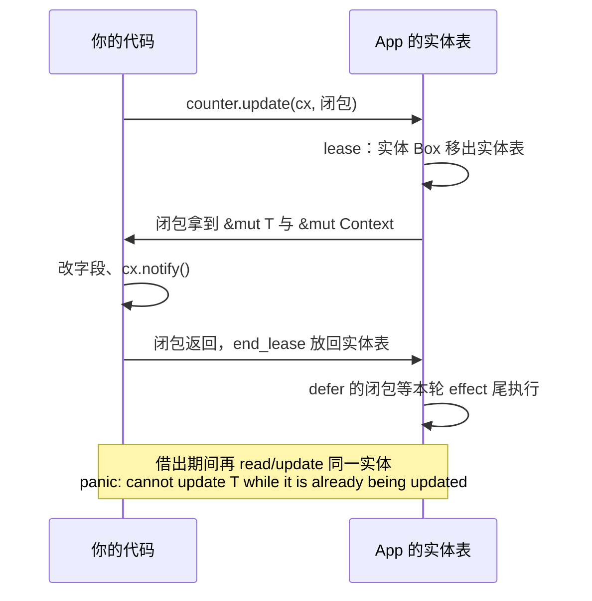

import { Meta } from '@storybook/addon-docs/blocks';

<Meta id="contexts" title="架构核心/Context 体系" name="Docs" />

# Context 体系

GPUI 程序里几乎每个函数签名都挂着最后一个参数 `cx`——它有时是 `&mut App`，有时是 `&mut Context<Self>`，异步回调里又变成 `AsyncApp`。这些上下文是 GPUI 交给你的**能力清单**：建实体、改实体、开窗口、发任务、读全局状态，全都只能通过 `cx` 完成，没有任何全局函数可以绕开它。

为什么设计成这样？两个事实推出一切。第一，**所有实体数据由唯一顶层对象 `App` 持有**——官方 crate 文档的原话是"every model or view in the application is actually owned by a single top-level object called the `App`"，你的结构体只是被托管的数据。第二，**你的代码全部是被框架回调的**：`render`、事件处理、观察回调、异步任务，调用时机和存活前提都由框架决定。Rust 的借用检查要求每个回调说清"此刻谁能借到什么、能借多久"，于是 GPUI 把 `App` 的能力按调用场景切片，分发成不同精度的上下文引用——每种上下文等于"一份能力清单 + 一个作用域"。

所以拿到任何 `cx`，先问两个问题：**我在哪个作用域里被调用**（决定是哪种上下文），**这个作用域能活多久**（决定能不能跨 `await`、要不要弱句柄）。本课给出每种上下文的出现场景、能力矩阵、互相升级的通道，以及借用规则的直观解释；签名一律核对自 docs.rs 的 gpui 0.2.2。`observe`/`subscribe` 的订阅细节归 4.2 课，任务与执行器归 4.4 课。

| 上下文 | 出现在哪里 | 能做什么 | 标志性方法 |
| --- | --- | --- | --- |
| `App` | `Application::run` 闭包、`cx.defer` 回调、App 版 `observe`/`subscribe` 回调 | 实体读写、开窗口、全局状态、任务、平台服务 | `cx.new` `cx.open_window` `cx.set_global` `cx.to_async()` |
| `Context<T>` | `render`、`cx.new` 与 `entity.update` 闭包、经 `cx.listener` 转发后的回调 | `App` 的全部能力 + 当前实体专属操作 | `cx.notify()` `cx.emit` `cx.listener` `cx.spawn` |
| `Window` | 与 `cx` 并排出现：`render` 参数、update 闭包参数 | 窗口状态：几何、焦点、输入、绘制 | `window.bounds()` `window.focus()` `window.to_async(cx)` |
| `AsyncApp` | `cx.spawn` 的 async 块、`cx.to_async()` 的返回值 | 跨 `await` 持有；操作可能失败（返回 `Result`） | `cx.update(\|cx\| ...)` `cx.update_entity` |
| `AsyncWindowContext` | `cx.spawn_in` 的 async 块 | `AsyncApp` + 绑定窗口 | `cx.update(\|window, cx\| ...)` `cx.update_root` |
| `TestAppContext` | `gpui::test` 测试（`test-support` feature） | 同异步上下文，但访问已消失的 App/窗口直接 panic | 见 6.1 课 |

## App、Context 与 Window

三个同步上下文的关系用一句话建模：**`App` 拥有一切，`Context<T>` 是 `App` 加上"当前实体"的标记，`Window` 是与上下文并列的窗口状态**。源码里 `Context<'a, T>` 的字段就是最好的注释：

```rust
// gpui 0.2.2 源码：Context 是 App 的包装，外加当前实体的弱句柄
pub struct Context<'a, T> {
    app: &'a mut App,
    entity_state: WeakEntity<T>,
}

// 并实现了 Deref / DerefMut 到 App
impl<'a, T> ops::Deref for Context<'a, T> {
    type Target = App;
    // ...
}
```

`Deref` 到 `App` 意味着**任何能传 `App` 引用的地方都能传 `Context<T>` 的引用**（官方 contexts.md 的原话："any function which can take an `App` reference can also take a `Context<T>` reference"），App 的方法在 `Context<T>` 上全部可用——这也解释了为什么视图方法里能直接 `cx.open_window(...)`。`Window` 则被官方 contexts.md 明确排除在上下文之外：它只管窗口自身状态，碰全局必须靠并排传入的 `cx`。

上下文之间不是孤立的，有两条升降级通道：向异步走用 `to_async` / `spawn` / `spawn_in`；从"外部句柄"回到同步上下文世界用 `WindowHandle::update` 一族。下面逐个展开。

### App：应用级根上下文

`&mut App` 是能力最全的上下文，出现在框架"没有特定实体背景"的调用点：`Application::new().run(|cx: &mut App| ...)` 的启动闭包、`cx.defer` 排队的回调、App 版 `observe`/`subscribe` 的回调、以及类型擦除的 `AnyWindowHandle::update` 闭包。能力按四组记：

| 能力组 | 代表方法（0.2.2） |
| --- | --- |
| 实体操作（`AppContext` trait 提供） | `cx.new` `cx.update_entity` `cx.read_entity` |
| 窗口管理 | `cx.open_window` `cx.update_window` `cx.read_window` `cx.windows()` `cx.active_window()` |
| 全局状态 | `cx.global::<G>()` `cx.global_mut::<G>()` `cx.set_global` `cx.remove_global` |
| 任务与平台服务 | `cx.spawn` `cx.defer` `cx.to_async()` `cx.background_spawn` `cx.write_to_clipboard` `cx.set_menus` `cx.http_client()` |

启动闭包是唯一"从零开始"的调用点，四组能力各来一行：

```rust
use gpui::{App, Application};

fn main() {
    // 0.2.2 发布版入口；git 口径为 application().run(...)，见 1.1 课
    Application::new().run(|cx: &mut App| {
        // 实体：创建托管状态
        let counter = cx.new(|cx| Counter::new(cx));
        // 窗口：开窗并挂根视图
        cx.open_window(Default::default(), |_window, cx| cx.new(|cx| Root::new(cx)))
            .unwrap();
        // 全局：注册应用级共享状态
        cx.set_global(Settings { theme: "dark".into() });
        // 任务：在主线程执行器上启动异步逻辑
        cx.spawn(async move |cx| {
            let _ = cx.update(|cx| counter.update(cx, |c, cx| c.tick(cx)));
        })
        .detach();
    });
}
```

`_ = ` 不是可有可无的装饰：启动闭包里 spawn 的任务可能晚于应用退出被轮询，异步操作返回 `Result`，忽略它属于正常终态（后文"常见问题"展开）。

### `Context<T>`：实体专属上下文

`&mut Context<T>` 出现在"框架知道当前正在操作哪个实体"的调用点：`Render::render`、`cx.new` 的构造闭包、`entity.update(cx, |t, cx| ...)` 的更新闭包、以及经 `cx.listener` 转发后的事件回调。它在 App 能力之上叠加实体专属方法，按类记：

- **变更与事件**：`cx.notify()` 通知观察者本实体已变化（无参数版本——它内部就是 `app.notify(自己的 entity_id)`，而 `App::notify` 需要显式传 `EntityId`）；`cx.emit(event)` 发出类型化事件，要求 `T: EventEmitter<Evt>`。
- **句柄**：`cx.entity()` 拿强句柄 `Entity<T>`，`cx.weak_entity()` 拿弱句柄，`cx.entity_id()` 拿标识。
- **观察与订阅**：`cx.observe` / `cx.subscribe`（含盯住自己的 `observe_self` / `subscribe_self`，以及绑定窗口的 `observe_in` / `subscribe_in` / `on_release_in` 等变体），生命周期回调 `on_release` / `on_drop` / `shutdown`。订阅语义与 `Subscription` 归 4.2 课，这里只需知道入口都在 `Context<T>` 上。
- **回调桥接**：`cx.listener` / `cx.processor`，把"需要实体状态"的闭包适配成框架要的"只有 App"的闭包（机制见「借用与作用域」）。
- **任务**：`cx.spawn`（async 块收到 `WeakEntity<T>` 和 `&mut AsyncApp`）、`cx.spawn_in`（收到 `WeakEntity<T>` 和 `&mut AsyncWindowContext`）、`cx.defer_in`（延迟到窗口的下一轮）、`cx.on_next_frame(window, ...)`（下一帧执行）。
- **焦点回调族**：`on_focus` / `on_blur` / `on_focus_lost` 等，全部要求带上 `&mut Window`。

一个视图方法里的典型片段：

```rust
impl Counter {
    fn tick(&mut self, cx: &mut Context<Self>) {
        self.count += 1;
        cx.notify(); // 实体专属：通知"我变了"
        cx.emit(CounterEvent::Ticked); // 实体专属：发类型化事件
    }
}
```

注意 `Context<T>` 虽然带着"当前实体"的标记，但它**同样能操作别的实体**：`cx.new`、`counter.update(cx, ...)` 走的都是继承自 App 的能力。"专属"指的只是新增了那批以当前实体为主语的方法，不是限制了视野。

### Window：窗口状态，不是上下文

官方 contexts.md 对 `Window` 的定位很直白：它不是 context，只提供窗口自身状态的访问；因为有根视图可读改，碰全局时必须再传一个 `&mut App`（或能解引用到它的上下文）。这个定位直接写在签名形态里——窗口方法把 `cx` 当参数带着走：

```rust
// 三个典型的 Window 方法签名（docs.rs 0.2.2）：cx 是显式参数
pub fn observe<T: 'static>(
    &mut self,
    observed: &Entity<T>,
    cx: &mut App, // 碰全局？把 App 递进来
    on_notify: impl FnMut(Entity<T>, &mut Window, &mut App) + 'static,
) -> Subscription

pub fn defer(&self, cx: &mut App, f: impl FnOnce(&mut Window, &mut App) + 'static);

pub fn dispatch_action(&mut self, action: Box<dyn Action>, cx: &mut App);
```

`render` 的签名就是这对搭档的样板：`fn render(&mut self, window: &mut Window, cx: &mut Context<Self>) -> impl IntoElement`。`&mut self` 与 `cx` 能同时存在，是因为 `cx` 里没有实体数据本身——数据在 `App` 的实体表里，`self` 只是此刻被借出的那份。

窗口自身的能力：几何（`bounds` / `viewport_size` / `scale_factor` / `rem_size`）、焦点（`focus` / `focused(cx)` / `blur`）、输入状态（`mouse_position` / `modifiers`）、光标（`set_cursor_style`）、绘制支撑（`text_system`、`with_element_state`——元素状态归 4.3 课）。异步化入口也在这里：`window.to_async(cx)` 得到 `AsyncWindowContext`，`window.spawn(cx, f)` 直接带窗口起任务。

从外部回到上下文世界走句柄的 `update` 一族——这是"在 App 层操作某个窗口"的标准门：

```rust
// WindowHandle<V>::update：闭包拿到具体视图类型的窗口上下文（docs.rs 0.2.2）
pub fn update<C, R>(
    &self,
    cx: &mut C, // 任何 AppContext：App、Context<T>、AsyncApp... 都能当入口
    update: impl FnOnce(&mut V, &mut Window, &mut Context<'_, V>) -> R,
) -> Result<R>
where
    C: AppContext,

// AnyWindowHandle::update：类型擦除版，闭包拿到 AnyView
pub fn update<C, R>(
    self,
    cx: &mut C,
    update: impl FnOnce(AnyView, &mut Window, &mut App) -> R,
) -> Result<R>
where
    C: AppContext,
```

两个 `update` 的约束都是 `C: AppContext` 而不是具体类型，所以从 `&mut App`、`&mut Context<T>` 甚至 `&mut AsyncApp`（失败时得 `Err`）都能发起。`AnyWindowHandle` 与 `WindowHandle<V>` 之间用 `downcast::<V>()` 互转。

## AsyncApp 与 AsyncWindowContext

异步上下文的存在理由有两层。**编译层**：`cx.spawn` 的 async 块要作为 `'static` future 被执行器持有，而 `&mut App` 是从框架栈帧借出来的引用，活不过当前调用栈，塞不进 future。**运行层**：future 执行时应用可能已退出、窗口可能已关闭，框架不能保证那些状态还在。于是 GPUI 给你的是一个**owned 且可克隆**的 `AsyncApp`，内部持有对 `App` 的弱引用——源码里每个方法的起手式都是 `self.app.upgrade().context("app was released")`，升级失败就返回 `Err`。这也是官方 contexts.md 说的"异步上下文的调用是可失败的（fallible），因为上下文可能比窗口甚至应用活得更久"。

三个获取入口，对应三种绑定强度：

| 入口 | async 块收到什么 |
| --- | --- |
| `cx.to_async()`（`App` 或其解引用上调用） | 只有 `AsyncApp` |
| `cx.spawn(async move \|weak, cx\| ...)` | `WeakEntity<T>` + `&mut AsyncApp` |
| `cx.spawn_in(window, ...)` / `window.spawn(cx, ...)` | `WeakEntity<T>` + `&mut AsyncWindowContext` |

`AsyncWindowContext` 的源码结构就是"异步应用上下文 + 窗口句柄"，并 `Deref` 到 `AsyncApp`——所以异步窗口上下文能用 `AsyncApp` 的一切方法，再叠加窗口侧的增强。

能力对照：`AsyncApp` 上的实体与窗口操作是 `AppContext` trait 的可失败版本（`new` / `update_entity` / `read_entity` / `update_window` / `read_window` / `read_global` 等），外加两件特有工具——`cx.update(|cx: &mut App| ...)` 是**回到同步世界的万能门**（闭包里恢复完整的同步 `App` 能力），以及 `open_window` / `subscribe` / `spawn` 这些直接可失败版本。`AsyncWindowContext` 再加 `window_handle()`、`update(|window, cx| ...)`、`update_root(...)`、`on_next_frame`、`prompt`。

同一个"改状态并通知"的任务，两个世界的写法对照：

```rust
// 同步世界：闭包直接拿到 &mut T 和 &mut Context<T>
counter.update(cx, |counter, cx| {
    counter.count += 1;
    cx.notify();
});

// 异步世界：update_entity 返回 Result，同步闭包嵌在中间
counter.update(&mut async_cx, |counter, cx| {
    counter.count += 1;
    cx.notify();
})?; // Err 表示实体已释放（App 已退出）
```

闭包内部完全一样，变的只是外层返回值多了一层 `Result`——这正是下一节 `AppContext` 关联类型的意义。`Task` 的组合、取消与前后台执行器归 4.4 课。

## AppContext 与 VisualContext

前面反复出现"这个方法在任何上下文上都可用"，靠的是两个 trait。`AppContext` 是实体与窗口操作的**最小公约**（0.2.2 上共 10 个方法）：`new` / `reserve_entity` / `insert_entity` / `update_entity` / `as_mut` / `read_entity` / `update_window` / `read_window` / `background_spawn` / `read_global`。关键在它的关联类型 `type Result<T>`——同一套方法签名，成败由实现者决定：

| 实现者（docs.rs 0.2.2） | `Result<T>` | 含义 |
| --- | --- | --- |
| `App`、`Context<T>` | `T` | 同步世界：操作不会失败，直接返回值 |
| `AsyncApp`、`AsyncWindowContext` | `Result<T, Error>` | 异步世界：状态可能已消失，返回 `Result` |

`TestAppContext` 在 `test-support` feature 下实现同一 trait（6.1 课）。`Entity::update`、`WeakEntity::update`、`WindowHandle::update`、`AnyWindowHandle::update` 的约束都是 `C: AppContext`，这就是它们"同步异步通吃"的原因：调用点写一次，同步拿到 `R`，异步拿到 `Result<R>`。写工具函数时照抄这个模式：

```rust
use gpui::{AppContext, Entity};

// 泛型上下文：&mut App、&mut Context<T>、&mut AsyncApp 都能传进来
fn bump<C: AppContext>(counter: &Entity<Counter>, cx: &mut C) -> C::Result<()> {
    cx.update_entity(counter, |counter, cx| {
        counter.count += 1;
        cx.notify();
    })
    // 同步上下文返回 ()；异步上下文自动包成 Result<()>
}
```

`VisualContext` 是 `AppContext` 的子 trait，表示"绑定了某个窗口"的上下文：方法有 `window_handle` / `update_window_entity` / `new_window_entity` / `replace_root_view` / `focus`。0.2.2 上它的唯一实现者是 `AsyncWindowContext`（`Window` 并没有实现它——窗口是状态不是上下文，与官方定位一致）。带 `_in` 后缀的句柄方法约束的是这个 trait：`Entity::update_in`、`WeakEntity::update_in` 要求 `C: VisualContext`，因为闭包里要多拿一个 `&mut Window`。

## 借用与作用域

把前面的签名现象收拢成一条模型：**上下文是框架在回调你的那一刻，按当前作用域开给你的能力额度**。作用域怎么定，借用检查就怎么管。三条规则覆盖你在 GPUI 里遇到的所有"为什么手里的 `cx` 长这样"。

**规则一：实体数据是"物理借出"，同一实体同时只能有一份 `&mut`。** 0.2.2 的实现不走 `RefCell` 标记，而是把实体的 `Box` 直接从 `App` 的实体表里移到栈上（源码 `EntityMap::lease`，注释就叫 "Move an entity to the stack"），闭包返回时再放回去（`end_lease`）。借出期间实体在表里**不存在**，此刻任何对同一实体的 `read` 或 `update` 都会触发运行时检查：

```rust
counter.update(cx, |counter, cx| {
    counter.count += 1;
    // 借出期间实体不在实体表里，下面的嵌套 update 直接 panic：
    counter.update(cx, |c, _| c.count += 1);
    // panic 消息（0.2.2 源码 double_lease_panic）：
    // cannot update my_app::Counter while it is already being updated
});
```

这也解释了 `Context<T>` 里存的为什么是 `WeakEntity<T>` 而不是 `Entity<T>`：借出期间"再借自己"本来就该被拒绝，弱句柄让这个意图在类型上就诚实地暴露。

**规则二：事件回调是 `'static` 的，借不出当前的 `&mut self`。** 以点击为例，`StatefulInteractiveElement::on_click` 的原始签名（0.2.2）是：

```rust
fn on_click(self, listener: impl Fn(&ClickEvent, &mut Window, &mut App) + 'static) -> Self;
```

闭包被 `'static` 约束，意味着它不能捕获任何借用——`render` 时活着的 `&mut self` 在 `render` 返回后就死了，而点击发生在未来某个不确定的时刻。`cx.listener` 专门弥合这道缝，它的实现只有两行逻辑（0.2.2 源码）：捕获一个 `WeakEntity<T>`，事件真正到来时通过 `view.update(cx, ...)` **重新**借出实体，把 `&mut T` 和 `&mut Context<T>` 递给你；实体若已释放就静默跳过：

```rust
// Context<T>::listener（docs.rs 0.2.2）：把带实体的闭包适配成框架的原始形态
pub fn listener<E: ?Sized>(
    &self,
    f: impl Fn(&mut T, &E, &mut Window, &mut Context<T>) + 'static,
) -> impl Fn(&E, &mut Window, &mut App) + 'static
```

**规则三：异步任务活过当前作用域，所以只拿到"弱化的上下文"。** `Context::spawn` 的文档写明回调收到的是"对本实体的弱句柄"，`spawn_in` 的文档补上原因——"避免长任务泄漏实体"；加上 `AsyncApp` 内部弱引用、全操作可失败，整条异步链路上没有任何强借用能悬空。任务结束后想改状态，用弱句柄升级后走 `update`。

时序上把三条规则串起来：



嵌套借用的出口有三件套：`cx.defer(f)`（文档原话："等本轮 effect cycle 结束时执行，让还在栈上的实体先回到 App"）、`cx.spawn`（异步、拿弱句柄）、或干脆只改**别的**实体（不同实体互不冲突）。`render` 里拿到 `&mut Context<Self>` 而不是裸 `&mut App`，用 crate 文档的话说就是"一个包着 `App`、并标记了当前实体"的包装——给你的恰好是"操作自己 + 操作全局"的额度，不多不少。

## 速查：手里是 X，要做 Y

| 你手里 | 要做什么 | 用什么 |
| --- | --- | --- |
| `&mut App` | 创建 / 修改实体 | `cx.new(...)` / `entity.update(cx, ...)` |
| `&mut App` | 开窗口 / 进窗口 | `cx.open_window(...)` / `handle.update(cx, ...)` |
| `&mut App` | 注册全局状态 / 起任务 | `cx.set_global(...)` / `cx.spawn` `cx.background_spawn` |
| `&mut App` | 升级为异步上下文 | `cx.to_async()` |
| `&mut Context<T>` | 通知变更 / 发事件 | `cx.notify()` / `cx.emit(event)` |
| `&mut Context<T>` | 观察别的实体 / 订阅事件 | `cx.observe(&e, ...)` / `cx.subscribe(&e, ...)`（细节归 4.2） |
| `&mut Context<T>` | 事件回调里拿回 `&mut self` | `cx.listener(\|this, event, window, cx\| ...)` |
| `&mut Context<T>` | 带实体起异步任务 | `cx.spawn(...)`（拿 `WeakEntity<T>`）或 `cx.spawn_in(window, ...)` |
| `&mut Context<T>` | 下一帧 / 本轮之后执行 | `cx.on_next_frame(window, ...)` / `cx.defer_in(window, ...)` |
| `&mut Window`（+`cx`） | 读窗口状态 | `window.bounds()` `window.viewport_size()` `window.scale_factor()` `window.mouse_position()` |
| `&mut Window`（+`cx`） | 管焦点 / 设光标 | `window.focus(&handle)` `window.focused(cx)` `window.set_cursor_style(...)` |
| `&mut Window`（+`cx`） | 碰实体或全局 | 走旁边的 `cx`，`Window` 自己没有这些能力 |
| `Entity<T>` + 任意 `cx` | 读 / 改 / 整体替换 | `read_with(cx, ...)` / `update(cx, ...)` / `write(cx, value)` |
| `Entity<T>` + 窗口上下文 | 改时还要 `&mut Window` | `update_in(cx, \|t, window, cx\| ...)`（要求 `C: VisualContext`） |
| `WeakEntity<T>` + 任意 `cx` | 升级 / 修改 | `upgrade()` / `update(cx, ...)` / `read_with(cx, ...)` |
| `AsyncApp` | 回到同步世界 | `cx.update(\|cx: &mut App\| ...)` |
| `AsyncApp` | 改实体 / 开窗 | `cx.update_entity(...)` / `cx.open_window(...)`（都得 `?`） |
| `AsyncWindowContext` | 进入绑定的窗口 | `cx.update(\|window, cx\| ...)` / `cx.update_root(...)` / `cx.window_handle()` |

## 最佳实践

- **能力就近，不绕路。** 能在 `Context<T>` 里调用的方法就不要 defer 到 App 层再调；后续逻辑需要窗口时优先 `spawn_in` / `on_next_frame` 绑定窗口，而不是裸 `AsyncApp` 再摸回窗口——绑定关系在创建时写明，比事后 `update_window` 更不易失效。
- **长命句柄一律弱。** 异步任务和存在已久的字段里存 `WeakEntity`，使用时 `upgrade` / `update`；强句柄会让实体在任务存活期间一直保持引用计数，回收时机变得不可预测。框架把 `WeakEntity` 直接递进 `spawn` 闭包就是在示范这个姿势。
- **工具函数吃泛型上下文。** 参数写 `cx: &mut C where C: AppContext`，同步异步调用点共享同一份实现；闭包里需要 `&mut Window` 时才升级约束为 `C: VisualContext`。返回值用 `C::Result<R>` 承接两种世界。
- **嵌套改自己，defer 出去。** 正在 `update` 某实体时又要触发它自己的另一次修改，把内层操作 `cx.defer` 到本轮 effect 尾部，别硬嵌套——嵌套必 panic，defer 必安全。

## 常见问题

- 运行时 panic：`cannot update ... while it is already being updated`（或 `cannot read ...`）
  在 update 闭包、`render` 或事件回调里对**当前正在借出的同一实体**又调了 `read` / `update`。处理：把内层操作改写成 `cx.defer` 或 `cx.spawn`，或者确认你想改的其实是另一个实体。判断依据：0.2.2 的实体借出是把数据移出实体表，借出期间重复访问必然触发这个 panic。
- 在 `cx.spawn` 的 async 块里调 `cx.notify()` 编译失败
  `AsyncApp` 上没有 `notify`——它不是某个实体的专属上下文。处理：用 `weak.update(&mut cx, |this, cx| { ...; cx.notify(); })`，同步闭包里才是 `Context<T>`；或用 `cx.update_entity(...)` 达到同样效果。两处的 `Result` 用 `?` 或显式忽略（应用已退出时失败是正常终态）。
- 异步任务里操作返回 `Err("app was released")`
  不是错误处理写错了，是任务比应用活得久：`AsyncApp` 内部是对 `App` 的弱引用，应用退出后 upgrade 不回来。处理：把 `Err` 当正常终态，记日志后直接返回，不要 `unwrap`。窗口侧同理，窗口关闭后 `AsyncWindowContext` 的窗口操作返回 `Err`。
- 闭包捕获 `&mut self` 报错 `closure requires unique access` 或 `'static` 约束不满足
  事件与定时回调都是 `'static` 的，借用量活不到回调执行的时刻。处理：不捕获 `self`，改用 `cx.listener` 把实体借给闭包；需要其他实体就捕获它们的 `Entity` 克隆（句柄克隆廉价），在回调里 `update`。

## 总结回顾

摘要：

GPUI 把 `App` 的能力按调用场景切成上下文：同步世界有 `App`（应用级根上下文，实体、窗口、全局、任务、平台服务）、`Context<T>`（`App` 加当前实体标记，`Deref` 到 `App`，新增 `notify`/`emit`/`listener`/`spawn` 等实体专属方法）和 `Window`（不是上下文，只管窗口状态，碰全局靠并排的 `cx`）；异步世界有内部持弱引用的 `AsyncApp` 与绑定窗口的 `AsyncWindowContext`，操作全部可失败，`cx.update(|cx| ...)` 是回到同步世界的门。`AppContext` trait 用关联类型 `Result<T>` 统一两种世界的签名——同步直接返回值，异步包成 `Result`；`VisualContext` 标记"绑定了窗口"，0.2.2 上由 `AsyncWindowContext` 实现。借用规则的三条主线：实体数据被"物理借出"，重复借同一实体会 panic；事件回调是 `'static` 的，`cx.listener` 用弱句柄在事件到来时重新借出；异步任务活过当前作用域，只拿到弱句柄与可失败上下文。出口三件套是 `defer`、`spawn` 与弱引用。

一句话：

> 上下文是框架按调用作用域分发的能力额度——同步看你在哪个实体身边，异步看你能活多久，所有能力都从 `cx` 的类型读出来。

知识要点：

- `App`、`Context<T>`、`Window`、`AsyncApp`、`AsyncWindowContext`、`TestAppContext` 各出现在哪些调用点，各自独有与继承的能力是什么
- `Context<T>` 为什么能调用一切 `App` 方法（`Deref`），`Window` 为什么必须与 `cx` 并排出现
- `AppContext::Result` 关联类型如何让 `Entity::update` 一份签名同时服务同步与异步
- `cx.listener`、`WeakEntity`、`AsyncApp` 各自解决哪个借用问题
- 嵌套修改同一实体为什么 panic，出口有哪三条路
- Entity 生命周期与 `observe`/`subscribe` 的订阅语义在 4.2 课，任务与执行器在 4.4 课，`TestAppContext` 实战在 6.1 课

## 参考资料

- [Contexts（官方上下文文档，zed 仓库 crates/gpui/docs）](https://github.com/zed-industries/zed/blob/main/crates/gpui/docs/contexts.md)
- [Ownership and data flow（docs.rs crate 根文档，gpui 0.2.2）](https://docs.rs/gpui/0.2.2/gpui/)
- [App - docs.rs/gpui 0.2.2](https://docs.rs/gpui/0.2.2/gpui/struct.App.html)
- [Context（含 listener、spawn、notify）- docs.rs/gpui 0.2.2](https://docs.rs/gpui/0.2.2/gpui/struct.Context.html)
- [Window - docs.rs/gpui 0.2.2](https://docs.rs/gpui/0.2.2/gpui/struct.Window.html)
- [WindowHandle（update、downcast）- docs.rs/gpui 0.2.2](https://docs.rs/gpui/0.2.2/gpui/struct.WindowHandle.html)
- [AnyWindowHandle - docs.rs/gpui 0.2.2](https://docs.rs/gpui/0.2.2/gpui/struct.AnyWindowHandle.html)
- [AsyncApp - docs.rs/gpui 0.2.2](https://docs.rs/gpui/0.2.2/gpui/struct.AsyncApp.html)
- [AsyncWindowContext - docs.rs/gpui 0.2.2](https://docs.rs/gpui/0.2.2/gpui/struct.AsyncWindowContext.html)
- [Entity（read、update、update_in、downgrade）- docs.rs/gpui 0.2.2](https://docs.rs/gpui/0.2.2/gpui/struct.Entity.html)
- [WeakEntity（upgrade、update、update_in）- docs.rs/gpui 0.2.2](https://docs.rs/gpui/0.2.2/gpui/struct.WeakEntity.html)
- [AppContext trait（关联类型 Result 与实现者）- docs.rs/gpui 0.2.2](https://docs.rs/gpui/0.2.2/gpui/trait.AppContext.html)
- [VisualContext trait - docs.rs/gpui 0.2.2](https://docs.rs/gpui/0.2.2/gpui/trait.VisualContext.html)
- [Render trait（render 签名）- docs.rs/gpui 0.2.2](https://docs.rs/gpui/0.2.2/gpui/trait.Render.html)
- [StatefulInteractiveElement（on_click 原始签名）- docs.rs/gpui 0.2.2](https://docs.rs/gpui/0.2.2/gpui/trait.StatefulInteractiveElement.html)
- [Application（run 入口签名）- docs.rs/gpui 0.2.2](https://docs.rs/gpui/0.2.2/gpui/struct.Application.html)
- [gpui 0.2.2 源码 app/entity_map.rs（lease 借出机制与 panic 消息）](https://docs.rs/crate/gpui/0.2.2/source/src/app/entity_map.rs)
