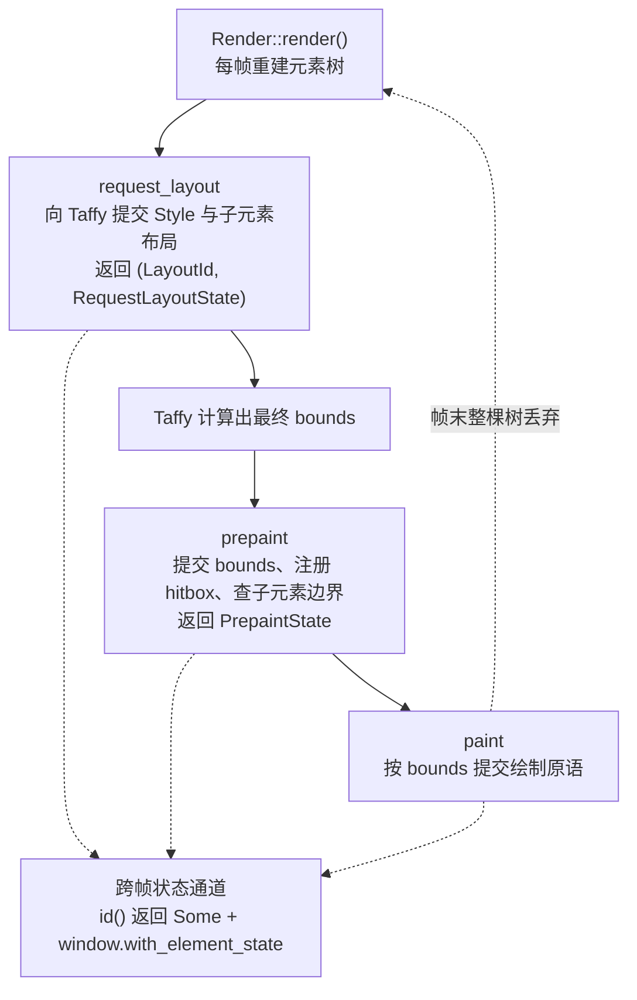

import { Meta } from '@storybook/addon-docs/blocks';

<Meta id="custom-elements" title="架构核心/自定义 Element" name="Docs" />

# 自定义 Element

`div` 加上样式、事件和子元素，能搭出绝大多数界面；想在界面上"画点东西"，`canvas` 闭包也够了。什么时候才需要手写一个 `Element`？官方源码模块文档把话说得很直白：Element 是 GPUI 的"低层命令式 API"（low level, imperative API），大多数时候应该用 `RenderOnce` trait 加 `#[derive(IntoElement)]` 组合现成元素构造组件，**只有需要手动接管布局与绘制过程时才实现 Element，比如自定义布局算法、渲染代码编辑器**。本课讲清这个底层协议：`Element` trait 的三段方法各自做什么、返回什么，状态如何在三段之间流动，跨帧状态存在哪，以及什么情况下 `canvas` 就够。签名一律核对自 docs.rs 的 gpui 0.2.2；官方示例与源码参照 main 分支。路径绘制的 API 细节归 5.2 课，无障碍方法（仅 main 分支已有）归 6.2 课。

先看生命周期：`render` 每帧重建整棵元素树，树上每个元素按 `request_layout` → `prepaint` → `paint` 三段接力走完一帧，帧末整棵树连同注册的回调一起丢弃，下一帧重来。



三段协议速查：

| 阶段 | 这一刻知道什么 | 典型工作 | 返回 |
| --- | --- | --- | --- |
| `request_layout` | 只有自身数据，还不知道位置和大小 | 构造 `Style`；对子元素递归调 `request_layout` 拿 `LayoutId`，交给 `window.request_layout` | `(LayoutId, Self::RequestLayoutState)` |
| `prepaint` | `bounds: Bounds<Pixels>` 已确定 | `window.insert_hitbox` 注册命中区；`window.layout_bounds` 查子元素边界 | `Self::PrepaintState` |
| `paint` | `bounds` 加两段状态都在手上 | 向窗口提交绘制原语：`paint_quad`、`paint_path` 等 | `()` |

## Element trait

`Element` 是实现自定义元素要落的 trait，定义很短，先看 0.2.2 的真身：

```rust
// gpui 0.2.2 源码（src/element.rs）
pub trait Element: 'static + IntoElement {
    // 第一段的产出：prepaint 与 paint 以 &mut 接力使用
    type RequestLayoutState: 'static;
    // 第二段的产出：paint 以 &mut 接力使用
    type PrepaintState: 'static;

    // 有唯一标识就返回 Some：框架会把 GlobalElementId 递进三段方法，
    // 这个 id 同时是 with_element_state 跨帧状态的存取钥匙
    fn id(&self) -> Option<ElementId>;

    // 构造位置，供 inspector 定位源码；自定义元素通常返回 None
    fn source_location(&self) -> Option<&'static std::panic::Location<'static>>;

    fn request_layout(
        &mut self,
        id: Option<&GlobalElementId>,
        inspector_id: Option<&InspectorElementId>,
        window: &mut Window,
        cx: &mut App,
    ) -> (LayoutId, Self::RequestLayoutState);

    fn prepaint(
        &mut self,
        id: Option<&GlobalElementId>,
        inspector_id: Option<&InspectorElementId>,
        bounds: Bounds<Pixels>,
        request_layout: &mut Self::RequestLayoutState,
        window: &mut Window,
        cx: &mut App,
    ) -> Self::PrepaintState;

    fn paint(
        &mut self,
        id: Option<&GlobalElementId>,
        inspector_id: Option<&InspectorElementId>,
        bounds: Bounds<Pixels>,
        request_layout: &mut Self::RequestLayoutState,
        prepaint: &mut Self::PrepaintState,
        window: &mut Window,
        cx: &mut App,
    );

    // 已提供的方法：装箱成动态元素，方便存进集合
    fn into_any(self) -> AnyElement { /* ... */ }
}
```

三个读法要点：

- **超 trait 是 `IntoElement`。** 实现 `Element` 的前提是先实现 `IntoElement`（`type Element = Self; fn into_element(self) -> Self { self }` 三行），这样元素才能被 `.child()` 接受。框架没有为所有 `Element` 提供到 `IntoElement` 的 blanket impl——官方 `Div`、`Canvas` 都是各自手动实现的。
- **两个关联类型是三段之间的帧内状态管道。** 官方注释的原文：`RequestLayoutState` 由 `request_layout` 产出，之后以可变引用递给 `prepaint` 和 `paint`；`PrepaintState` 由 `prepaint` 产出，递给 `paint`。模块文档解释了为什么需要它：有些状态（比如"hover 是否已开始"）太简单又太多，不值得存进每个 view，就放这里随帧重建。
- **`Element` 不是 dyn 兼容的。** 需要动态组合时用 `into_any()` 装进 `AnyElement`。

`id()` 的返回值值得单独回查。`ElementId` 是个多变体枚举（0.2.2）：

| 变体 | 含义 |
| --- | --- |
| `View(EntityId)` | 视图元素的 id |
| `Integer(u64)` / `NamedInteger(SharedString, u64)` | 整数 id / 带名的整数 id（列表项常用） |
| `Name(SharedString)` | 字符串 id |
| `Uuid(Uuid)` / `FocusHandle(FocusId)` / `Path(..)` / `CodeLocation(..)` / `NamedChild(..)` | UUID / 绑定焦点 / 路径 / 代码位置 / 带名子元素 |

唯一性规则官方注释写明：**id 必须在"第一个带 id 的祖先元素"之下、兄弟之间唯一**——不是全窗口唯一。

版本口径：main 分支的 `Element` 在此基础上新增了 `a11y_role`、`write_a11y_info`、`a11y_synthetic_children` 三个无障碍方法（有默认实现，返回 `None` 即不入无障碍树），0.2.2 尚无这些方法，本文按 0.2.2 展开。

最后把周边 trait 的分工理清，避免"组件该写哪个 trait"的困惑：

| trait | 核心签名 | 角色 |
| --- | --- | --- |
| `IntoElement` | `type Element: Element;` `fn into_element(self) -> Self::Element;` | 进入元素树的入场券，`child()` 只收 `IntoElement` |
| `Element` | 三段协议 | 接管布局与绘制的低层协议（本课主角） |
| `RenderOnce` | `fn render(self, window: &mut Window, cx: &mut App) -> impl IntoElement;` | 组件配方：`#[derive(IntoElement)]` 后被包成 `Component<C>` 元素，其 `request_layout` 里调用你的 `render` |
| `ParentElement` | `fn extend(&mut self, elements: impl IntoIterator<Item = AnyElement>);` 加已提供的 `child` / `children` | 容器装子元素的统一接口 |
| `Render` | `fn render(&mut self, window: &mut Window, cx: &mut Context<Self>) -> impl IntoElement;` | 视图的根：`Entity` 实现它才能上窗口（见 1.2 课） |

## 三段协议

三个方法按固定顺序、每帧各调一次，共享同一套参数形态：开头都是 `id: Option<&GlobalElementId>` 与 `inspector_id: Option<&InspectorElementId>`——`id()` 返回 `None` 时两者就是 `None`，返回 `Some` 时 `GlobalElementId` 才会递进来；结尾都是 `window: &mut Window, cx: &mut App`。三段的区别在中间：`request_layout` 还没有 `bounds`，`prepaint` 拿到 `bounds` 并产出第二份状态，`paint` 两份状态齐备、只提交绘制指令。下面逐段展开。

### request_layout：申请布局

官方注释一句话定性："Before an element can be painted, we need to know where it's going to be and how big it is."——画之前总得知道位置和大小，`request_layout` 就是"报尺寸"的环节：向 Taffy 提交本元素的 `Style` 和子元素，拿到一个 `LayoutId`。此刻 `bounds` 还不存在，谁想在这里画东西都会被断言拦下。

核心 API 是 `Window::request_layout`（docs.rs 0.2.2）：

```rust
pub fn request_layout(
    &mut self,
    style: Style,
    children: impl IntoIterator<Item = LayoutId>,
    cx: &mut App,
) -> LayoutId
```

没有子元素时 `children` 传 `[]`；有子元素时，先对每个子元素调 `element.request_layout(window, cx)` 拿到它们各自的 `LayoutId`，再作为 `children` 传入——`div` 就是这么把整棵子树的布局请求串到 Taffy 上的。最短的参照是官方 `Canvas` 的实现（源码 `crates/gpui/src/elements/canvas.rs`，0.2.2 与 main 一致）：

```rust
// 官方 Canvas：第一段只做两件事——合并样式细化、申请布局
type RequestLayoutState = Style;

fn request_layout(/* 略去 id 与 inspector 参数 */) -> (LayoutId, Self::RequestLayoutState) {
    let mut style = Style::default();
    style.refine(&self.style); // 把 Styled 积累的样式细化并入默认 Style
    let layout_id = window.request_layout(style.clone(), [], cx); // canvas 没有子元素
    (layout_id, style) // Style 存进状态，第三段画背景边框时还要用
}
```

返回的 `RequestLayoutState` 放什么由你定：`Canvas` 放 `Style`（第三段要用它画背景边框）；`Div` 放子元素的 `LayoutId` 列表（第二段查边界时要遍历）。

Taffy 的 web 式布局规则不敷使用时，还有一个自定义测量的入口（docs.rs 0.2.2）：

```rust
// 自定义布局算法的落点：measure 闭包自己算尺寸
pub fn request_measured_layout<F>(&mut self, style: Style, measure: F) -> LayoutId
where
    F: FnMut(Size<Option<Pixels>>, Size<AvailableSpace>, &mut Window, &mut App) -> Size<Pixels>
        + 'static,
```

`measure` 收到"调用方建议的尺寸"与"可用空间"两种信息，返回你算出的 `Size<Pixels>`——文本测量、表格列宽这类 Taffy 表达不出来的布局逻辑就走这里。

### prepaint：提交边界与命中区

官方注释："After laying out an element, we need to commit its bounds to the current frame for hitbox purposes."——Taffy 算完，`bounds: Bounds<Pixels>` 递进来了，这一段把边界"落账"到当前帧。三件典型事：

- **注册命中区**：`window.insert_hitbox(bounds, behavior) -> Hitbox`（docs.rs 0.2.2）。元素要接鼠标交互就必须做这一步，返回的 `Hitbox` 存进 `PrepaintState` 带给第三段。`HitboxBehavior` 三个变体：`Normal`（不影响别人）、`BlockMouse`（遮挡后面的命中区，即 `occlude()` 的效果）、`BlockMouseExceptScroll`（遮挡但放行滚轮）。
- **查子元素边界**：`window.layout_bounds(child_layout_id) -> Bounds<Pixels>`。`div` 的 `prepaint` 就靠它遍历第一段存下的子 `LayoutId`，收集子树边界喂给滚动句柄。
- **准备第三段要用的东西**：`Canvas` 在这里调用用户的 `prepaint` 闭包，把返回值 `T` 装进 `Option<T>` 存入 `PrepaintState`。

纯绘制、无交互的元素返回 `()` 即可——下面的对角线徽章就是这么做的。

### paint：提交绘制原语

官方注释："Once layout has been completed, this method will be called to paint the element to the screen."——这一段才真正把像素指令写进窗口场景。所有 `Window::paint_*` 方法内部都有 `debug_assert_paint` 守卫，只能在 `paint` 阶段调用。0.2.2 的全量原语清单：

| 方法 | 用途 |
| --- | --- |
| `paint_quad(quad: PaintQuad)` | 画矩形：背景、边框、分隔线 |
| `paint_path(path, color)` | 画任意路径：对角线、圆、多边形（API 细节归 5.2 课） |
| `paint_shadows(bounds, corner_radii, shadows)` | 画阴影 |
| `paint_underline` / `paint_strikethrough` | 文本下划线 / 删除线 |
| `paint_glyph` / `paint_emoji` | 单个字形 / emoji |
| `paint_svg(bounds, path, transformation, color, cx)` | 画已注册资产的 SVG |
| `paint_image(bounds, corner_radii, data, frame_index, grayscale)` | 画已解码的 `RenderImage` |
| `paint_surface(bounds, image_buffer)` | 画平台视频帧（macOS 的 `CVPixelBuffer`） |

矩形原语 `PaintQuad` 的完整字段与构造（docs.rs 0.2.2）：

```rust
pub struct PaintQuad {
    pub bounds: Bounds<Pixels>,
    pub corner_radii: Corners<Pixels>,
    pub background: Background,
    pub border_widths: Edges<Pixels>,
    pub border_color: Hsla,
    pub border_style: BorderStyle,
}

// 自由函数 quad() 按位置参数构造，再用 builder 方法微调
pub fn quad(
    bounds: Bounds<Pixels>,
    corner_radii: impl Into<Corners<Pixels>>,
    background: impl Into<Background>,
    border_widths: impl Into<Edges<Pixels>>,
    border_color: impl Into<Hsla>,
    border_style: BorderStyle,
) -> PaintQuad

// builder 方法（都消费 self 返回 Self）：
// .background(...) .corner_radii(...) .border_widths(...) .border_color(...)
```

自定义元素通常不想手搓背景和边框，那就把第一段存下的 `Style` 用起来：`Style::paint(bounds, window, cx, continuation)`（docs.rs 0.2.2）先按样式画背景、边框、圆角，再在 `continuation` 闭包里叠加你的自定义内容——`Canvas` 的 `paint` 就是这个写法。

两个进阶出口，知道存在即可：`window.with_content_mask(Some(ContentMask(bounds)), |window| ...)` 把后续绘制裁剪进指定区域（官方模块文档点名它是 overlay、popup"画到父元素边界之外"的通道）；`window.paint_layer(bounds, |window| ...)` 把一组绘制指令分层提交。注意所有原语都用**窗口坐标**：`bounds` 到了手上，路径和矩形的坐标要由 `bounds.origin` 换算得出。

## 最小示例：对角线徽章

把三段协议拼成一个完整可复制的元素：一个支持 `Styled` 细化的方块，`Style` 负责背景边框圆角，自己只画一条左上到右下的对角线。

```rust
use gpui::{
    App, Bounds, Element, ElementId, GlobalElementId, Hsla, InspectorElementId, IntoElement,
    LayoutId, PathBuilder, Pixels, Style, StyleRefinement, Styled, Window, px,
};

/// 对角线徽章：在自身区域内画背景和一条左上到右下的对角线。
/// 输入：线色 + 任意 Styled 细化（尺寸、背景、圆角）；
/// 用法：放进任意 div 的 child；
/// 预期：按样式布局的方块，中间一条对角线。
struct DiagonalBadge {
    line_color: Hsla,
    style: StyleRefinement,
}

impl DiagonalBadge {
    fn new(line_color: impl Into<Hsla>) -> Self {
        Self {
            line_color: line_color.into(),
            style: StyleRefinement::default(),
        }
    }
}

// Element 的超 trait：没有 blanket impl，手动实现后 .child() 才接受这个类型
impl IntoElement for DiagonalBadge {
    type Element = Self;

    fn into_element(self) -> Self::Element {
        self
    }
}

// 支持 .w() .h() .bg() .rounded() 等 fluent 样式，细化累积进 StyleRefinement
impl Styled for DiagonalBadge {
    fn style(&mut self) -> &mut StyleRefinement {
        &mut self.style
    }
}

impl Element for DiagonalBadge {
    // 第一段产出 Style，第二、三段接力使用；第二段无状态可带，返回 ()
    type RequestLayoutState = Style;
    type PrepaintState = ();

    fn id(&self) -> Option<ElementId> {
        None // 无跨帧状态，不需要 id
    }

    fn source_location(&self) -> Option<&'static std::panic::Location<'static>> {
        None
    }

    fn request_layout(
        &mut self,
        _id: Option<&GlobalElementId>,
        _inspector_id: Option<&InspectorElementId>,
        window: &mut Window,
        cx: &mut App,
    ) -> (LayoutId, Self::RequestLayoutState) {
        // 把调用方用 .w() .h() 写下的细化并入默认 Style，交给 Taffy
        let mut style = Style::default();
        style.refine(&self.style);
        let layout_id = window.request_layout(style.clone(), [], cx);
        (layout_id, style)
    }

    fn prepaint(
        &mut self,
        _id: Option<&GlobalElementId>,
        _inspector_id: Option<&InspectorElementId>,
        _bounds: Bounds<Pixels>,
        _request_layout: &mut Self::RequestLayoutState,
        _window: &mut Window,
        _cx: &mut App,
    ) -> Self::PrepaintState {
        // 纯绘制元素：不注册 hitbox，也没有要查的子元素边界
    }

    fn paint(
        &mut self,
        _id: Option<&GlobalElementId>,
        _inspector_id: Option<&InspectorElementId>,
        bounds: Bounds<Pixels>,
        style: &mut Self::RequestLayoutState,
        _prepaint: &mut Self::PrepaintState,
        window: &mut Window,
        cx: &mut App,
    ) {
        // 先让 Style 画背景、边框、圆角，再在 continuation 里叠加对角线
        style.paint(bounds, window, cx, |window, _cx| {
            // 绘制原语用窗口坐标：两端由 bounds 换算得出
            let mut builder = PathBuilder::stroke(px(2.));
            builder.move_to(bounds.origin);
            builder.line_to(bounds.bottom_right());
            if let Ok(path) = builder.build() {
                window.paint_path(path, self.line_color);
            }
        });
    }
}
```

放进视图的方式与普通元素无异（入口与窗口搭建见 1.1、1.2 课）：

```rust
impl Render for BadgeDemo {
    fn render(&mut self, _: &mut Window, _: &mut Context<Self>) -> impl IntoElement {
        div()
            .flex()
            .gap_3()
            .p_4()
            // 元素没给默认尺寸时按样式细化约束布局，示例显式给出 w/h
            .child(DiagonalBadge::new(rgb(0x0000FF)).w(px(32.)).h(px(32.)))
            .child(
                DiagonalBadge::new(gpui::red())
                    .w(px(64.))
                    .h(px(32.))
                    .bg(rgb(0xFACC15))
                    .rounded(px(6.)),
            )
    }
}
```

逐段回看这个例子的信息流：调用方写下的 `.w()` `.bg()` 落进 `StyleRefinement`；`request_layout` 把它并入 `Style`、交给 Taffy，并把 `Style` 塞进 `RequestLayoutState`；`prepaint` 什么都不带；`paint` 用接力来的 `Style` 画背景，再在 `continuation` 里用刚到手的 `bounds` 换算出对角线两端。三段各司其职，没有一段越界。

## 跨帧状态：with_element_state

元素树每帧重建，结构体的字段自然每帧归零。帧内三段之间靠关联类型传递（上一节），跨帧就得走另一条通道：`id()` 返回 `Some`，然后用 `window.with_element_state` 按 id 存取（docs.rs 0.2.2）：

```rust
pub fn with_element_state<S, R>(
    &mut self,
    global_id: &GlobalElementId,
    f: impl FnOnce(Option<S>, &mut Self) -> (R, S),
) -> R
where
    S: 'static,
```

闭包收到上一帧存下的状态（首帧是 `None`），返回一个二元组——第一个元素是本次的返回值，第二个元素是存回去的新状态。使用模式：

```rust
struct FrameCounter {
    /* ... */
}

impl Element for FrameCounter {
    fn id(&self) -> Option<ElementId> {
        // 没有这个 Some，三段方法里的 id 参数是 None，状态无从存取
        Some(ElementId::Name("frame-counter".into()))
    }

    fn paint(
        &mut self,
        id: Option<&GlobalElementId>, // id() 返回 Some 时框架必定递进来
        /* 其余参数略 */
    ) {
        window.with_element_state::<u64, _>(id.unwrap(), |state, _window| {
            let count = state.unwrap_or(0) + 1; // 首帧 None，从 0 起算
            ((), count) // (返回值, 存回下一帧的状态)
        });
        /* ... */
    }
}
```

存取的钥匙是"元素 id 路径 + 状态类型"二者合一，所以 `id()` 返回 `None`、id 在兄弟之间撞名，状态都会错位或丢失。`div` 的交互状态正是这么存的：hover、点击、待处理的 `mouse down`、滚动偏移等字段集中在 `InteractiveElementState` 里，经 `with_optional_element_state` 在 `prepaint` 与 `paint` 之间接力——官方在 trait 文档里也把这类状态描述为"太简单又太多，不值得塞进每个 view"。

状态放哪一层的判断标准：属于业务的（计数、文档内容）放 `Entity`（见 4.2 课）；属于"这个元素实例"的小而多的状态（hover、展开、动画进度）放 `with_element_state`；只在同一次布局到绘制之间流通的放关联类型。

## 何时用 canvas 就够

`canvas` 是官方提供的"三段协议闭包化"：把两个 `FnOnce` 闭包包成一个元素（docs.rs 0.2.2，与 main 源码一致）：

```rust
pub fn canvas<T>(
    prepaint: impl 'static + FnOnce(Bounds<Pixels>, &mut Window, &mut App) -> T,
    paint: impl 'static + FnOnce(Bounds<Pixels>, T, &mut Window, &mut App),
) -> Canvas<T>
```

对照三段协议看它的结构一目了然：第一段完全交给样式系统（`Canvas` 的 `RequestLayoutState` 就是 `Style`），你的 `prepaint` 闭包扮演第二段、返回值 `T` 装进 `PrepaintState`（即 `Option<T>`）传给 `paint` 闭包扮演的第三段。源码 `crates/gpui/src/elements/canvas.rs` 不足百行，是学写自定义 Element 的最佳模板。官方示例 `painting.rs` 全程用 `canvas` 加 `paint_quad` / `paint_path` 画路径、方块、渐变，没有定义任何自定义 Element——"短期自绘"的天花板比想象的高。

选择标准：

| 需求 | 选择 |
| --- | --- |
| 布局走普通样式，画点东西就撤 | `canvas` 两个闭包 |
| 路径绘制本身（描边、虚线、贝塞尔） | 归 5.2 课，载体用 `canvas` 即可 |
| 要自定义布局算法 | 实现 `Element`，用 `request_measured_layout` |
| 要接鼠标事件、注册 hitbox | 实现 `Element`（`prepaint` 建 hitbox）；或外层包 `div` 挂事件 |
| 要做成多处复用、带子元素的组件 | 先考虑 `RenderOnce` 加 `#[derive(IntoElement)]` 组合 `div` 树；确需接管绘制才实现 `Element` |

## 最佳实践

- **组件优先组合，不到万不得已不实现 `Element`。** 官方模块文档把 `Element` 定位为低层命令式 API，推荐的默认路径是 `RenderOnce` 加 `#[derive(IntoElement)]`；手写 `Element` 留给自定义布局算法和完全接管绘制的场景。
- **布局优先交给 Taffy。** `request_layout` 返回的 `LayoutId` 让 Taffy 统一求解，天然获得 flex/grid 全套规则；`request_measured_layout` 是表达不了时的最后手段，别用它重新发明 flexbox。
- **状态按寿命分层。** 业务状态进 `Entity`，元素实例的跨帧状态进 `with_element_state`（前提是 `id()` 返回 `Some` 且兄弟唯一），单帧内三段之间的传递用关联类型。寿命错层是最常见的混乱来源：把 hover 状态塞进 view，或把业务计数塞进 `with_element_state`。
- **`paint` 只画，不算。** 布局决策留在第一段，依赖最终位置的换算（子元素边界、内容尺寸）在 `prepaint` 用 `layout_bounds` 算好存进 `PrepaintState`；`paint` 里只做坐标换算和提交原语。

## 常见问题

- 自绘的线画到了窗口左上角，而不是元素所在的位置
  绘制原语用窗口坐标，而 `bounds` 到 `prepaint` 才确定。处理：`move_to` / `quad` 的坐标一律由 `bounds.origin` 加元素内相对偏移换算；只在 `paint` 阶段提交原语（`paint_*` 内部有 `debug_assert_paint` 守卫，别处调用会触发断言）。
- `with_element_state` 取出来的状态每帧都是 `None`，或兄弟元素之间状态互相串
  存取钥匙是"元素 id 路径 + 状态类型"，`id()` 返回 `None` 时没有钥匙，兄弟 id 撞名时钥匙串门。处理：让 `id()` 返回稳定且兄弟唯一的 `ElementId`（如 `ElementId::Name`），列表场景用 `ElementId::NamedInteger` 区分各子项。
- 元素画出来了，但 hover 与 click 毫无反应
  只 `paint` 不产生交互：鼠标判定按 hitbox 进行，`prepaint` 里没调 `insert_hitbox`，后续也没有把 `Hitbox` 交给监听逻辑。处理：`prepaint` 注册 hitbox 并存进 `PrepaintState`，`paint` 时用它包裹事件监听；或者干脆外层包 `div` 挂 `on_click` / `hover`。
- `.child(DiagonalBadge::new(..))` 编译不通过，提示类型不满足约束
  `.child()` 只收 `IntoElement`，而框架没有为自定义类型自动补齐这个 trait。处理：手动实现 `IntoElement`（`type Element = Self` 三行）；或者改用 `#[derive(IntoElement)]` 的 `RenderOnce` 组件。

## 总结回顾

摘要：

`div` 和 `canvas` 覆盖绝大多数需求，手写 `Element` 是留给自定义布局算法与完全接管绘制的低层出口。`Element` trait 以 `IntoElement` 为超 trait，用两个关联类型 `RequestLayoutState` 与 `PrepaintState` 在三段方法之间接力帧内状态：`request_layout` 向 Taffy 提交 `Style` 与子元素的 `LayoutId`（自定义测量走 `request_measured_layout`），`prepaint` 拿到最终 `bounds`、注册 hitbox、查子元素边界，`paint` 按窗口坐标提交 `paint_quad`、`paint_path` 等绘制原语，必要时借 `Style::paint` 让样式系统先画背景边框。跨帧状态靠 `id()` 返回 `Some` 加 `window.with_element_state` 存取，钥匙是元素 id 路径加状态类型。`canvas` 把这套协议压缩成两个闭包，布局走普通样式、画完即走的自绘优先用它。

一句话：

> `Element` 是"布局怎么算、像素怎么画"的完全接管协议——三段接力、状态按寿命分层，能组合或用 `canvas` 解决的就不要手写。

知识要点：

- 三段方法各自的输入、返回值与典型工作，帧开始与帧末各发生什么
- `RequestLayoutState` 与 `PrepaintState` 如何在三段之间传递，各放什么合适
- `window.request_layout` 与 `request_measured_layout` 的分工，`LayoutId` 在子元素布局中怎么串
- `prepaint` 为什么要 `insert_hitbox` 与 `layout_bounds`，`HitboxBehavior` 三个变体的差别
- `Window::paint_*` 原语清单、`PaintQuad` 的字段与 `quad()` 构造、`Style::paint` 的组合用法
- 跨帧状态的存取条件、钥匙构成与状态三层的归属判断
- `canvas` 的闭包结构与三段协议的对应关系，何时它就够、何时必须实现 `Element`

## 参考资料

- [Element trait - docs.rs/gpui 0.2.2](https://docs.rs/gpui/0.2.2/gpui/trait.Element.html)
- [Window（request_layout、paint_\*、with_element_state、insert_hitbox）- docs.rs/gpui 0.2.2](https://docs.rs/gpui/0.2.2/gpui/struct.Window.html)
- [PaintQuad - docs.rs/gpui 0.2.2](https://docs.rs/gpui/0.2.2/gpui/struct.PaintQuad.html)
- [PathBuilder - docs.rs/gpui 0.2.2](https://docs.rs/gpui/0.2.2/gpui/struct.PathBuilder.html)
- [HitboxBehavior - docs.rs/gpui 0.2.2](https://docs.rs/gpui/0.2.2/gpui/enum.HitboxBehavior.html)
- [gpui 0.2.2 源码 element.rs（trait 定义、模块文档、IntoElement/RenderOnce/ParentElement）](https://docs.rs/crate/gpui/0.2.2/source/src/element.rs)
- [element.rs（main 分支：仅 main 已有的 a11y 方法）](https://github.com/zed-industries/zed/blob/main/crates/gpui/src/element.rs)
- [canvas.rs（main 分支：Canvas 的三段实现，0.2.2 与之一致）](https://github.com/zed-industries/zed/blob/main/crates/gpui/src/elements/canvas.rs)
- [div.rs（main 分支：Div 的三段实现与 InteractiveElementState）](https://github.com/zed-industries/zed/blob/main/crates/gpui/src/elements/div.rs)
- [官方示例 painting.rs（canvas 加 paint_quad/paint_path 自绘）](https://github.com/zed-industries/zed/blob/main/crates/gpui/examples/painting.rs)
