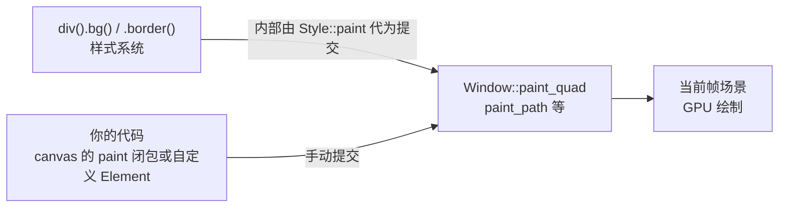

import { Meta } from '@storybook/addon-docs/blocks';

<Meta id="custom-painting" title="实战能力/自定义绘制" name="Docs" />

# 自定义绘制

`div` 与样式系统覆盖常规盒子视觉，但分隔线、饼图、波形、图表这类"画出来"的形状，要落到 GPUI 的底层绘制 API。本课讲清三件事：绘制原语的层次——`quad` 最轻、`Path` 表达任意矢量轮廓、`canvas` 把它们接进元素树；`PathBuilder` 的完整命令集（直线、多边形、二次/三次贝塞尔、圆弧、虚线、变换）；以及坐标系与裁剪规则。签名一律核对自 docs.rs 的 gpui 0.2.2，官方示例与源码参照 main 分支——两者绘制 API 一致；main 分支示例入口已改为 `gpui_platform` 的 `application()`（尚未发布到 crates.io），0.2.2 入口仍是 `Application::new().run(...)`，口径见 1.1 课。原语只能在 Element 的 `paint` 阶段提交，三段协议本身归 4.3 课，本课只管"往窗口提交什么"。

先看调用关系：样式系统和你的手写代码最终都汇入同一批 `Window::paint_*` 提交，`div` 的背景边框底层就是 `paint_quad`——手写原语等于把这一步拿到底层来做：



绘制原语家族速查：

| 家族成员 | 入口 | 形状能力 | 什么时候用 |
| --- | --- | --- | --- |
| 样式系统 | `.bg()` / `.border()` / 阴影 | 矩形（可圆角、渐变） | 有布局语义的常规视觉，底层由 `Style::paint` 提交 `paint_quad` |
| quad | `window.paint_quad(quad(...))` | 矩形：纯色/渐变背景、圆角、边框 | `paint` 阶段手画色块、分隔线、圆形、描边盒 |
| path | `window.paint_path(path, color)` | 任意轮廓：多边形、圆、曲线、折线 | `quad` 表达不了的形状：图标、图表、波形 |
| canvas | `canvas(prepaint, paint)` | 容器元素：闭包里自由调用上述原语 | 把自绘接进布局树，不需要手写 `Element` |
| 其他 `paint_*` | `paint_svg` / `paint_image` / `paint_glyph` 等 | 专项内容 | 全量清单见 4.3 课；图片与 SVG 归 5.4 课 |

## quad：矩形原语

`quad` 是最轻的手写原语：一个矩形，附带圆角、背景与边框，一次调用提交。0.2.2 的自由函数构造（docs.rs）：

```rust
pub fn quad(
    bounds: Bounds<Pixels>,                    // 窗口坐标下的位置与大小
    corner_radii: impl Into<Corners<Pixels>>,  // 四角半径，传 px 值即四角统一
    background: impl Into<Background>,         // 背景：纯色、渐变、图案都可以
    border_widths: impl Into<Edges<Pixels>>,   // 四边边框宽度
    border_color: impl Into<Hsla>,             // 边框颜色（注意是 Into<Hsla> 不是 Into<Background>）
    border_style: BorderStyle,                 // BorderStyle::Solid（默认）或 BorderStyle::Dashed
) -> PaintQuad
```

提交入口只有一个：`window.paint_quad(quad)`。六个参数全是位置参数，惯用写法两种：全位置传参（官方 painting.rs 的背景方块），或先位置构造、再用 `PaintQuad` 的 builder 方法微调——`.background()` / `.corner_radii()` / `.border_widths()` / `.border_color()` 都消费 `self` 返回 `Self`，注意没有 `border_style` 的 builder，虚线边框只能在 `quad()` 位置参数里给。

关键变体一次看全：

```rust
// 1. 纯色矩形：官方 painting.rs 的背景方块写法
let bounds = Bounds {
    origin: point(px(70.), px(70.)),
    size: size(px(40.), px(40.)),
};
window.paint_quad(quad(
    bounds,
    px(0.),                    // 直角
    rgb(0x1374e9),             // 纯色背景
    px(0.),                    // 无边框
    gpui::transparent_black(), // 边框色在宽度为 0 时不可见
    BorderStyle::Solid,
));

// 2. 圆形：corner_radii 给到边长一半
let radius = bounds.size.width / 2.;
window.paint_quad(quad(bounds, radius, rgb(0xe13527), px(0.), gpui::transparent_black(), BorderStyle::Solid));

// 3. 分隔线：高度 1px 的纯色细条
let divider = Bounds { origin: point(px(0.), px(50.)), size: size(px(200.), px(1.)) };
window.paint_quad(quad(divider, px(0.), hsla(0., 0., 0., 0.15), px(0.), gpui::transparent_black(), BorderStyle::Solid));

// 4. 虚线描边盒：背景透明，边框承担全部视觉，圆角同样作用于边框
window.paint_quad(quad(
    bounds,
    px(4.),
    gpui::transparent_black(), // 不填背景
    px(1.),                    // 边框宽度 1px
    rgb(0x666666),
    BorderStyle::Dashed,
));

// 5. builder 微调：位置构造后再把背景换成渐变
window.paint_quad(quad(bounds, px(8.), gpui::transparent_black(), px(0.), gpui::transparent_black(), BorderStyle::Solid)
    .background(linear_gradient(
        180.,
        linear_color_stop(gpui::blue(), 0.4),
        linear_color_stop(gpui::red(), 1.),
    )));
```

两个类型细节：`background` 收 `impl Into<Background>`，`border_color` 收 `impl Into<Hsla>`，两处不对称，传错编译器会拦；`BorderStyle` 只有两个变体 `Solid`（0 号，`Default`）与 `Dashed`。

## 路径：Path 与 PathBuilder

`Path<P>` 是"可提交给窗口的路径"，泛型参数是坐标单位：`Path<Pixels>` 直接可画，`Path<ScaledPixels>` 由缩放换算产生。它的字段私有、三角形装配繁琐，正常入口是 `PathBuilder`：按命令序列描述轮廓，`build()` 时经 lyon 三角化成 GPU 可画的顶点缓冲。builder 的画笔模式由公开字段 `style: PathStyle` 决定：

| 构造方式 | 模式 | 说明 |
| --- | --- | --- |
| `PathBuilder::fill()` | 填充 | 轮廓内部着色；也是 `Default` 的行为 |
| `PathBuilder::stroke(width)` | 描边 | 沿轮廓画线，等价于默认 `StrokeOptions` 加线宽 `width` |
| `PathBuilder::default()` | 填充 | 同 `fill()`，之后可 `with_style(PathStyle)` 换装配选项 |

画完提交：`window.paint_path(path, color)`，第二参收 `impl Into<Background>`（填色见下文专节）。

### 构造与基本命令

命令序列的骨架：`move_to` 落笔、`line_to` 连线、`close` 闭合回起点。成块的直线轮廓用 `add_polygon(&[Point<Pixels>], closed)` 一步到位（官方 painting.rs 同款）：

```rust
// 五角星：落笔后逐顶点连线
let mut builder = PathBuilder::fill();
builder.move_to(point(px(350.), px(200.)));
builder.line_to(point(px(370.), px(260.)));
builder.line_to(point(px(430.), px(260.)));
// ……其余顶点依次 line_to，回到起点附近
let star = builder.build().unwrap();
window.paint_path(star, rgb(0xFACC15));

// 闪电：add_polygon 直接吃点数组，false 表示轮廓不闭合
let mut builder = PathBuilder::fill();
builder.add_polygon(
    &[
        point(px(150.), px(300.)),
        point(px(200.), px(225.)),
        point(px(200.), px(275.)),
        point(px(250.), px(200.)),
    ],
    false,
);
let bolt = builder.build().unwrap();
window.paint_path(bolt, rgb(0x1d4ed8));
```

`close()` 与 `add_polygon` 的 `closed = true` 都会把最后一点连回 `move_to` 的起点；开放轮廓（折线、波形）不闭合，通常配描边模式使用。

### 贝塞尔与圆弧

0.2.2 的曲线命令一共四个，签名核对自 docs.rs：

| 命令 | 参数 | 曲线 |
| --- | --- | --- |
| `curve_to` | `(to, ctrl)` | 二次贝塞尔：终点加一个控制点 |
| `cubic_bezier_to` | `(to, control_a, control_b)` | 三次贝塞尔：终点加两个控制点 |
| `arc_to` | `(radii, x_rotation, large_arc, sweep, to)` | 椭圆弧，SVG arc 语义 |
| `relative_arc_to` | 同 `arc_to`，`to` 为相对坐标 | 同上 |

容易找错 API 的一点：`PathBuilder` 没有 `quadratic_to` 这个名字，二次贝塞尔就是 `curve_to`——`to` 是终点，`ctrl` 是唯一的控制点，把曲线从两点弦线上"拉弯"（官方 painting.rs 的渐变波形面）：

```rust
builder.move_to(square_bounds.bottom_left());
builder.curve_to(
    square_bounds.origin + point(horizontal_offset, vertical_offset), // 终点
    square_bounds.origin + point(px(0.0), vertical_offset),           // 控制点
);
```

`arc_to` 的五个参数照 SVG 椭圆弧理解：`radii` 是椭圆两半径、`x_rotation` 是横轴旋转、`large_arc` 选优弧或劣弧、`sweep` 选方向、`to` 是终点。画整圆的惯用法是两段半圆弧相接（官方 painting.rs 的重叠圆测试）：

```rust
let center = point(px(530.), px(85.));
let radius = px(30.);
let mut builder = PathBuilder::fill();
builder.move_to(point(center.x + radius, center.y)); // 从圆最右侧起笔
// 上半圆：radii 为 (radius, radius) 的圆弧，走到左侧
builder.arc_to(point(radius, radius), px(0.), false, false, point(center.x - radius, center.y));
// 下半圆：走回起点
builder.arc_to(point(radius, radius), px(0.), false, false, point(center.x + radius, center.y));
builder.close();
let circle = builder.build().unwrap();
window.paint_path(circle, rgb(0xFF0000).alpha(0.5)); // 半透明，两圆重叠处颜色更深
```

### 填充与描边样式

`PathStyle` 是两个变体的枚举，决定 `build()` 走哪套装配选项：

```rust
pub enum PathStyle {
    Fill(FillOptions),      // 填充装配选项
    Stroke(StrokeOptions),  // 描边装配选项
}
```

`FillOptions`、`FillRule`、`StrokeOptions` 由 gpui 从 lyon 转再导出，`gpui::StrokeOptions` 直接可用；更细的枚举值如 `LineJoin` 要从 `lyon` crate 引入（官方示例工程直接依赖 lyon）。两种典型用法：

```rust
// 官方 painting.rs 的波形：细线描边 + Bevel 拐角
let options = StrokeOptions::default()
    .with_line_width(1.)
    .with_line_join(lyon::path::LineJoin::Bevel);
let mut builder = PathBuilder::stroke(px(1.)).with_style(PathStyle::Stroke(options));
builder.move_to(point(px(40.), px(420.)));
for i in 1..50 {
    builder.line_to(point(
        px(40.0 + i as f32 * 10.0),
        px(420.0 + (i as f32 * 10.0).sin() * 40.0), // 正弦取点连成波形
    ));
}
let wave = builder.build().unwrap();
window.paint_path(wave, gpui::green());

// 虚线：dash_array 给"划线长、空隙长"交替序列（语义同 SVG stroke-dasharray）
let mut builder = PathBuilder::stroke(px(1.));
builder = builder.dash_array(&[px(4.), px(2.)]);
```

`PathBuilder::stroke(width)` 只是"默认 `StrokeOptions` + 线宽"的快捷方式；要调拐角等细节就 `with_style(PathStyle::Stroke(...))` 换上自定义选项。`dash_array` 消费 `self`，写法是 `builder = builder.dash_array(...)`。

### 变换与 build

平移、缩放、旋转都是 builder 上的方法，作用于 `build()` 产出的整体轮廓（官方 painting.rs 用它安放 Rust logo）：

```rust
// PathBuilder 实现了 From<lyon::path::path::Builder> 等 From 转换，
// 可以从 lyon 的 SVG 构建器接入更丰富的命令集
let mut builder: PathBuilder = lyon::path::Path::svg_builder().into();
lyon::extra::rust_logo::build_logo_path(&mut builder);
builder.translate(point(px(10.), px(200.))); // 平移
builder.scale(0.9);                          // 等比缩放
let logo = builder.build().unwrap();
window.paint_path(logo, gpui::black());
```

- `translate(point)` 平移、`scale(f32)` 等比缩放、`rotate(f32)` 旋转（角度制，0.0 到 360.0）、`transform(Transform)` 上完整的 2D 变换矩阵（`Transform` 也由 gpui 转再导出）。
- `build(self) -> Result<Path<Pixels>, anyhow::Error>`：消费 builder，装配失败返回 `Err`，最常见原因是空轮廓——只 `move_to` 没画任何线段。官方代码统一 `if let Ok(path) = builder.build()` 静默跳过失败；调试期可临时改成 `unwrap` 让错误现形。
- `Path` 自身还有低层出口：`Path::new(start)` 加 `move_to` / `line_to` / `curve_to` / `push_triangle`，逐三角形手工装配时才用，常规绘制一律走 `PathBuilder`。

## 填色：Background 进原语

`paint_path` 的第二参与 `quad` 的 `background` 都收 `impl Into<Background>`，所以 2.4 课讲的三种填充直接通用：

| 填充 | 构造 | 用在路径上 |
| --- | --- | --- |
| 纯色 | `rgb(0xFACC15)` / `hsla(...)` | `paint_path(path, rgb(...))` |
| 渐变 | `linear_gradient(角度, 起, 止)` | `paint_path(path, linear_gradient(...))`，`color_space(ColorSpace::Oklab)` 照常可挂 |
| 图案 | `pattern_slash(color, width, interval)` | 斜纹图案，`width` 与 `interval` 是 `f32` 逻辑像素 |

```rust
// 渐变五角星：Background 直接作为 paint_path 的颜色参数（官方 painting.rs）
window.paint_path(
    star,
    linear_gradient(
        180.,
        linear_color_stop(rgb(0xFACC15), 0.7),
        linear_color_stop(rgb(0xD56D0C), 1.),
    )
    .color_space(ColorSpace::Oklab),
);

// 斜纹图案：官方 pattern.rs 用它做条纹视觉，同高元素给同一组值即可对齐条纹
div().w(px(54.)).h(px(18.)).bg(pattern_slash(gpui::red(), 18.0 / 4.0, 18.0 / 4.0))
```

`pattern_slash(color: Hsla, width: f32, interval: f32) -> Background` 的后两个参数是斜线宽度与间隔的裸数值（`f32`，不是 `px()`）；它同样可以传给 `paint_path` 或 `quad(...).background()`，不限于 `.bg()`。

## canvas：闭包式自绘元素

原语只能在 `paint` 阶段提交，入口有两个：手写 `Element`（4.3 课），或官方提供的闭包版——`canvas`。0.2.2 签名：

```rust
pub fn canvas<T>(
    prepaint: impl 'static + FnOnce(Bounds<Pixels>, &mut Window, &mut App) -> T,
    paint: impl 'static + FnOnce(Bounds<Pixels>, T, &mut Window, &mut App),
) -> Canvas<T>
```

两个闭包对应三段协议的后两段，第一段布局完全交给样式系统：`prepaint` 收到本元素的 `bounds`，可做测量等准备工作，返回值 `T` 原样传给 `paint`；`paint` 收到同一 `bounds` 与 `T`，在这里调用 `window.paint_*`。`Canvas<T>` 实现了 `Styled`，`.size_full()`、`.flex_1()` 照常用——它在布局树里就是一个普通盒子。

官方 painting.rs 的组织模式值得照抄：不变的路径在构造时 `build` 一次存进 `Entity`，`render` 克隆后交给 canvas 闭包消费：

```rust
struct PaintingViewer {
    // 装配一次：Path 与颜色的配对存进状态
    default_lines: Vec<(Path<Pixels>, Background)>,
    background_quads: Vec<(Bounds<Pixels>, Background)>,
    /* ……手绘线等其他字段 */
}

impl Render for PaintingViewer {
    fn render(&mut self, _: &mut Window, cx: &mut Context<Self>) -> impl IntoElement {
        let default_lines = self.default_lines.clone(); // 每帧克隆进闭包
        let background_quads = self.background_quads.clone();
        div().size_full().child(
            canvas(
                move |_, _, _| {}, // prepaint：无需准备，返回 ()
                move |_, _, window, _| {
                    // 先提交的先画：顺序即叠加层级
                    for (bounds, color) in background_quads {
                        window.paint_quad(quad(
                            bounds, px(0.), color, px(0.),
                            gpui::transparent_black(), Default::default(),
                        ));
                    }
                    for (path, color) in default_lines {
                        window.paint_path(path, color);
                    }
                },
            )
            .size_full(),
        )
    }
}
```

两个读法要点：同一闭包里先 `paint_quad` 后 `paint_path`，后提交者盖在上面——原语没有独立的 z 轴，提交顺序就是层级；闭包是 `FnOnce` 且每帧随 `render` 重建，`move` 进来的数据用完即弃，不跨帧持有。每帧要变的路径（跟随鼠标的手绘线）则在 `paint` 闭包里现装配：点序列来自状态，`PathBuilder` 每帧重走一遍，`build` 成功才提交。静态与动态路径的区别只在"何时 build"，提交方式完全一致。

## 坐标系与裁剪

所有原语用**窗口像素坐标**：`quad` 的 `bounds`、`PathBuilder` 各命令的点，一律相对窗口左上角，与元素在布局树中的位置无关。canvas 闭包收到的 `bounds` 是元素在窗口中的实际位置——想把图形画在元素内部，用 `bounds.origin` 换算：

```rust
// 相对元素画一个内缩 20px 的描边框：窗口坐标 = bounds.origin + 元素内偏移
move |bounds, _, window, _| {
    let inner = Bounds {
        origin: bounds.origin + point(px(20.), px(20.)),
        size: size(bounds.size.width - px(40.), bounds.size.height - px(40.)),
    };
    window.paint_quad(quad(inner, px(0.), gpui::transparent_black(), px(1.), rgb(0x666666), BorderStyle::Solid));
}
```

裁剪不会自动发生：`Canvas` 的默认样式 `overflow` 是 `Visible`，画出元素边界的照常显示。两条裁剪通道：

```rust
// 通道一：手动 content mask，只约束闭包内的提交
window.with_content_mask(Some(ContentMask { bounds }), |window| {
    window.paint_path(path, color);
});
```

- `with_content_mask(Some(ContentMask { bounds }), f)` 与当前 mask 求交集后压栈，闭包结束弹出；mask 本体 `ContentMask` 只有一个公有字段 `bounds`，目前只支持矩形。
- 通道二是容器层 `overflow_hidden()`：`div` 的 paint 会按样式生成 `overflow_mask` 并套 `with_content_mask`（div.rs 源码），子孙元素的所有原语——包括 canvas 里画的——都被裁进容器。滚动容器能裁住自绘内容，用的就是这条通道。
- 另有 `window.paint_layer(bounds, f)` 把一组提交分成独立图层，透明度叠加等场景使用（4.3 课点名过）。

## 最佳实践

- **原语逐层下沉，别跳级。** 有布局语义的视觉用样式系统（`.bg()` / `.border()`，内部同样是 `paint_quad`）；`paint` 阶段的手画矩形用 `quad()`；`quad` 拼不出的轮廓才上 `PathBuilder`；把它们接进界面用 `canvas`；需要自定义布局算法或 hitbox 时才手写 `Element`（4.3 课）。
- **静态路径装配一次，动态路径每帧装配。** `build()` 里的三角化是路径绘制的主要成本：五角星、logo 这类不变图形在构造时 build 好存进 `Entity`，`render` 只 clone；随输入变化的（手绘、波形）才在每帧重建。吞吐量级参考：官方 paths_bench.rs 每帧装配并提交 2000 个渐变五角星，配合 `window.request_animation_frame()` 连续重绘，可当作路径绘制的压力基准。
- **重活放 prepaint，paint 只提交。** canvas 的 `prepaint` 返回值 `T` 就是干这个的——测量、坐标预计算在 prepaint 做完传下去，`paint` 闭包里只做换算与 `paint_*` 调用，与 4.3 课"paint 只画，不算"的结论一致。

## 常见问题

- 路径没画出来，也没有任何报错
  `build()` 返回 `Result`，官方惯用的 `if let Ok(path)` 会把 `Err` 静默跳过。处理：调试期临时改成 `unwrap` 让错误现形；最常见的失败是空轮廓——只 `move_to` 没有后续线段，或点数不足（painting.rs 对单点路径直接 `continue`）。
- 想要描边效果，画出来的却是一块实心填充
  用了 `PathBuilder::fill()`——它同时是 `Default` 的行为。处理：改用 `PathBuilder::stroke(px(2.))` 构造，线宽是参数；要调拐角等细节再 `with_style(PathStyle::Stroke(StrokeOptions::default().with_line_width(px(2.))))`。
- canvas 里画的内容超出元素边界，溢出盖到了旁边的内容上
  canvas 不做任何裁剪，原语按窗口坐标全量提交。处理：闭包内用 `window.with_content_mask(Some(ContentMask { bounds }), ..)` 包住提交，或给外层容器加 `overflow_hidden()`。
- 状态明明改了，画面却不变
  原语只在重渲染后的帧重新提交。处理：状态变化后调 `cx.notify()` 驱动重渲染（1.3 课）；需要连续动画时在 `render` 里调 `window.request_animation_frame()`（动画系统归 5.3 课）。

## 总结回顾

摘要：

GPUI 的自定义绘制是一条从轻到重的原语阶梯。`quad` 画矩形——六位置参数加四个 builder 方法，覆盖色块、圆形（圆角拉满）、分隔线与描边盒，样式系统的 `.bg()` 底层同样是它。`PathBuilder` 描述任意轮廓：`fill()` 与 `stroke(width)` 两种画笔模式，`move_to` / `line_to` / `add_polygon` / `close` 拼直线形状，`curve_to`（二次）与 `cubic_bezier_to`（三次）画曲线，`arc_to` 按 SVG 弧语义画圆，`dash_array` 与 `PathStyle`（lyon 的 `FillOptions` / `StrokeOptions`）控制描边细节，`translate` / `scale` / `rotate` 做变换，`build()` 三角化并返回 `Result`。填色统一走 `Background`：纯色、`linear_gradient`、`pattern_slash` 都能进 `paint_path` 与 `quad`。`canvas` 用两个闭包把这一切接进元素树，`prepaint` 的返回值 `T` 传给 `paint`。所有原语用窗口像素坐标，相对元素画图靠 `bounds.origin` 换算；裁剪不自动发生，靠 `with_content_mask` 或容器的 `overflow_hidden()`。

一句话：

> 自定义绘制只有三层——`quad` 画矩形、`Path` 画任意轮廓、`canvas` 把它们接进元素树；全部按窗口像素坐标提交，顺序即层级，裁剪靠 content mask。

知识要点：

- `quad()` 的六个位置参数与 `PaintQuad` 的 builder 方法，圆形、分隔线、虚线描边盒分别怎么写
- `PathBuilder::fill()` 与 `stroke(width)` 的分工，`move_to` / `line_to` / `add_polygon` / `close` 的命令序列
- `curve_to` 与 `cubic_bezier_to` 的参数差异、`arc_to` 五参数的 SVG 弧语义、两段弧拼整圆的写法
- `PathStyle` 两个变体与 lyon 转再导出的 `StrokeOptions` / `FillOptions`，`dash_array` 的消费式写法
- `build()` 返回 `Result` 的失败场景、官方 `if let Ok` 模式与变换方法的生效对象
- `Background` 三种填充如何进 `paint_path` 与 `quad`，`pattern_slash` 的参数类型
- `canvas` 两个闭包的分工、`T` 的传递、静态与动态路径各自的装配时机
- 窗口坐标系与 `bounds.origin` 换算，`with_content_mask` 与 `overflow_hidden` 两条裁剪通道

## 参考资料

- [quad - docs.rs/gpui 0.2.2](https://docs.rs/gpui/0.2.2/gpui/fn.quad.html)
- [PaintQuad - docs.rs/gpui 0.2.2](https://docs.rs/gpui/0.2.2/gpui/struct.PaintQuad.html)
- [PathBuilder - docs.rs/gpui 0.2.2](https://docs.rs/gpui/0.2.2/gpui/struct.PathBuilder.html)
- [Path - docs.rs/gpui 0.2.2](https://docs.rs/gpui/0.2.2/gpui/struct.Path.html)
- [PathStyle - docs.rs/gpui 0.2.2](https://docs.rs/gpui/0.2.2/gpui/enum.PathStyle.html)
- [BorderStyle - docs.rs/gpui 0.2.2](https://docs.rs/gpui/0.2.2/gpui/enum.BorderStyle.html)
- [canvas - docs.rs/gpui 0.2.2](https://docs.rs/gpui/0.2.2/gpui/fn.canvas.html)
- [ContentMask - docs.rs/gpui 0.2.2](https://docs.rs/gpui/0.2.2/gpui/struct.ContentMask.html)
- [Window（paint_path、paint_quad、with_content_mask、paint_layer、request_animation_frame）- docs.rs/gpui 0.2.2](https://docs.rs/gpui/0.2.2/gpui/struct.Window.html)
- [pattern_slash - docs.rs/gpui 0.2.2](https://docs.rs/gpui/0.2.2/gpui/fn.pattern_slash.html)
- [linear_gradient - docs.rs/gpui 0.2.2](https://docs.rs/gpui/0.2.2/gpui/fn.linear_gradient.html)
- [官方示例 painting.rs（quad、路径、圆弧、虚线、canvas 综合演示）](https://github.com/zed-industries/zed/blob/main/crates/gpui/examples/painting.rs)
- [官方示例 paths_bench.rs（每帧 2000 条路径的吞吐基准）](https://github.com/zed-industries/zed/blob/main/crates/gpui/examples/paths_bench.rs)
- [官方示例 pattern.rs（pattern_slash 图案背景）](https://github.com/zed-industries/zed/blob/main/crates/gpui/examples/pattern.rs)
- [path_builder.rs（main 分支：PathBuilder 源码与 lyon 转再导出，0.2.2 API 与之一致）](https://github.com/zed-industries/zed/blob/main/crates/gpui/src/path_builder.rs)
- [canvas.rs（main 分支：Canvas 的三段协议实现）](https://github.com/zed-industries/zed/blob/main/crates/gpui/src/elements/canvas.rs)
- [div.rs（main 分支：overflow_mask 套 with_content_mask 的裁剪依据）](https://github.com/zed-industries/zed/blob/main/crates/gpui/src/elements/div.rs)
- [style.rs（main 分支：Style::paint 内部以 paint_quad 提交背景）](https://github.com/zed-industries/zed/blob/main/crates/gpui/src/style.rs)
