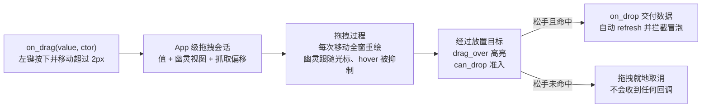

import { Meta } from '@storybook/addon-docs/blocks';

<Meta id="drag-and-drop" title="交互/拖放" name="Docs" />

# 拖放

GPUI 的拖放没有独立的协议层：拖拽携带的**数据类型本身就是协议**。`on_drag` 把一个值交给框架，框架在窗口（App 级）维护一个拖拽会话；拖拽经过哪里、能否放置、松手交给谁，全部按这个值的类型（`TypeId`）匹配。放置目标用 `drag_over` 做"可以放"的高亮、`on_drop` 接收数据，两者的判断都可读到被拖的值。读完你能预测：一个拖拽会落在哪个元素上、高亮为什么没出现、松手在空白处时数据去了哪里。鼠标事件的命中与分发基础（hitbox、Capture / Bubble、`cx.listener`）见 3.1 课，本课直接使用。

一次拖放从发起到交付的完整链路：



拖放 API 家族回查表（各成员的详细语义见后文小节）：

| 成员 | 挂载位置 | 职责 |
| --- | --- | --- |
| `on_drag(value, ctor)` | 需先 `.id()` | 发起拖拽：携带值，`ctor` 构造拖拽幽灵视图 |
| `on_drop(f)` | 任意元素 | 松手命中且类型匹配时接收 `&T` |
| `drag_over(f)` | 任意元素 | 匹配类型的拖拽悬于其上时应用样式，闭包可读 `&S` |
| `group_drag_over(name, f)` | 任意元素 | 组级高亮：按组命中，静态样式、不读数据 |
| `can_drop(pred)` | 任意元素 | 数据级准入：同时门控 `drag_over` 高亮与 `on_drop` 交付 |
| `on_drag_move(f)` | 任意元素 | 匹配类型拖拽进行中每次移动都触发（不分元素内外） |
| `DragMoveEvent<T>` | `on_drag_move` 的事件 | `event` / `bounds` 字段，`drag(cx)` 取 `&T` |

本课 API 均为 gpui 0.2.2 已发布版本；main 分支新增 `external_drag_payload`（把窗口内拖拽升级为系统原生拖拽），只在「跨窗口与平台文件」一节出现并标注。入口沿用官方示例的 git 口径 `application().run(...)`，0.2.x 发布版换成 `Application::new().run(...)`，见 1.1 课。

## 发起拖拽：on_drag

`on_drag` 的完整签名（取自 docs.rs 0.2.2）：

```rust
fn on_drag<T, W>(
    self,
    value: T,
    constructor: impl Fn(&T, Point<Pixels>, &mut Window, &mut App) -> Entity<W> + 'static,
) -> Self
where
    T: 'static,
    W: 'static + Render,
```

两个类型参数就是整条协议的约束：`T` 是拖拽携带的数据，只要求 `'static`——不需要 `Clone`、不需要序列化；`W` 是拖拽幽灵视图的类型，必须实现 `Render`。注意 `on_drag` 定义在 `StatefulInteractiveElement` 上，元素必须先 `.id()`（原因同 3.1 课的 `on_click`）。

值在 `render` 构建元素的那一刻被打包进 `Arc` 存起来，所以携带的是**最近一帧的快照**；真正发起拖拽要等两个条件同时满足：左键按下（框架在该元素上记录了按下位置）、移动超过 2px 阈值（框架用它区分点击与拖拽）。此刻框架才调用 `constructor`——它相当于 "drag start" 回调，收到 `&T` 和抓取点相对元素原点的偏移，返回的 `Entity` 就是随光标移动的幽灵。

完整发起端（模式取自官方 `drag_drop.rs` 示例，样式精简）：

```rust
// 拖拽数据类型：普通结构体即可，约束只有 'static
#[derive(Clone, Copy)]
struct DragInfo {
    ix: usize,
    color: Hsla,
    position: Point<Pixels>, // 幽灵自己的状态：抓取点偏移
}

impl Render for DragInfo {
    fn render(&mut self, _: &mut Window, _: &mut Context<Self>) -> impl IntoElement {
        // 幽灵视图：一个半透明色块。让卡片中心对准光标：
        // 用抓取点偏移做内边距，正好抵消窗口的放置偏移
        let card = size(px(120.), px(50.));
        div()
            .pl(self.position.x - card.width.half())
            .pt(self.position.y - card.height.half())
            .child(
                div()
                    .w(card.width)
                    .h(card.height)
                    .flex()
                    .justify_center()
                    .items_center()
                    .bg(self.color.opacity(0.5))
                    .shadow_md()
                    .child(format!("Item {}", self.ix)),
            )
    }
}

// 源元素：id + on_drag
div()
    .id(("item", ix)) // on_drag 在有状态元素上，先 .id()
    .size_32()
    .border_2()
    .border_color(color)
    .cursor_move() // 拖拽期间全窗口的光标由它接管，见后文
    .child(format!("Item ({})", ix))
    .on_drag(drag_info, |info: &DragInfo, position, _window, cx| {
        // 越过 2px 阈值后才调用；position 是抓取点相对元素原点的偏移
        // cx.new 创建幽灵实体，幽灵与源视图从此互不相干
        cx.new(|_| info.position(position))
    })
```

幽灵的绘制由框架代管：每个绘制帧里，窗口把幽灵视图画在 `鼠标位置 - 抓取偏移` 处、压在所有元素之上。它是一个独立实体——发起之后源视图怎么重渲染都不会改变它（这是"幽灵内容不更新"问题的根源，见常见问题）。`DragInfo` 同时实现 `Render` 不是必需的约束，只是官方示例复用它作为幽灵视图的省事写法。

## 接收放置：on_drop

`on_drop<T: 'static>(f)` 的回调签名是 `Fn(&T, &mut Window, &mut App)`——**没有事件包装类型**（框架里不存在 `DropEvent`），回调直接拿到被拖的值。它定义在 `InteractiveElement` 上，不要求 `.id()`。交付发生在松手（`MouseUpEvent`）的 Bubble 阶段，要同时过三关：

- 松手位置命中该元素的 hitbox（`is_hovered`，遮挡语义见 3.1 课）；
- 活动拖拽的值类型与 `T` 的 `TypeId` **严格相等**——泛型参数不同就是不同类型；
- 该元素的 `can_drop` 谓词（如果挂了）放行。

全部通过则调用回调，随后框架自动刷新窗口并 `cx.stop_propagation()`——嵌套的放置目标中，最内层命中者先收到（Bubble 反序），交付后外层不再有机会。放置端（与上面的发起端同属官方示例）：

```rust
div()
    .w_128()
    .h_32()
    .flex()
    .justify_center()
    .items_center()
    .border_3()
    // 用状态染色：放进去之后边框变成被拖项的颜色
    .border_color(self.drop_on.map(|info| info.color).unwrap_or(gpui::black()))
    .on_drop(cx.listener(|this, info: &DragInfo, _window, _cx| {
        // 只会收到 DragInfo 类型的拖拽，info 就是发起时捕获的那个快照
        this.drop_on = Some(*info);
        // 框架在交付后已代为刷新窗口，这里可以不写 cx.notify()
    }))
    .child("Drop items here")
```

一个元素可以同时接收多种类型——每种类型各挂一个 `on_drop`，按类型分发：

```rust
div()
    // DragInfo 的拖拽走第一个回调，TabInfo 的走第二个
    .on_drop(cx.listener(|this, item: &DragInfo, _window, cx| this.accept_item(*item, cx)))
    .on_drop(cx.listener(|this, tab: &TabInfo, _window, cx| this.accept_tab(tab, cx)))
```

但同一元素对**同一类型**只挂一个 `on_drop`：框架按类型注册放置监听，交付语义以单监听为前提。三关之外的所有情况——类型不匹配、没落在任何目标上——都是同一结果：松手后框架统一清空拖拽会话，`on_drop` 不触发，也没有"拖拽结束"回调（见常见问题）。

## 拖经高亮：drag_over 与 can_drop

官方示例的高亮只在放下后出现（`on_drop` 改状态）；要"拖到上面就高亮"，用 `drag_over`。它的签名在 0.2.2 与 main 一致：

```rust
fn drag_over<S: 'static>(
    self,
    f: impl 'static + Fn(StyleRefinement, &S, &mut Window, &mut App) -> StyleRefinement,
) -> Self
```

类型 `S` 匹配的拖拽悬于该元素之上（hitbox 命中）时，框架把闭包返回的样式合并进元素。闭包第二参数就是被拖的值，高亮可以按数据定制：

```rust
div()
    .id("drop-zone")
    .drag_over::<DragInfo>(|style, info, _window, _cx| {
        // 用被拖项自己的颜色描边：拖蓝色块来就亮蓝边
        style.border_color(info.color).bg(info.color.opacity(0.15))
    })
    .on_drop(cx.listener(Self::drop_item))
    .child("Drop here")
```

组版本 `group_drag_over::<S>(组名, f)` 与 3.1 课的 `group_hover` 同构：按组 hitbox 命中、样式是静态的 `FnOnce`，拿不到被拖的值——适合"拖进列表区域，整个列表亮起来"这类整体反馈。

一个必须知道的边界：**拖拽进行中，`hover()` 样式与 `on_hover` 回调被框架整体抑制**（框架在每次计算样式时都检查"是否有活动拖拽"）。所以放置目标的高亮只能用 `drag_over`，用 `hover` 在拖拽时永远不生效——这不是 bug，是框架避免拖拽路上误亮沿途元素的刻意设计。

`can_drop(pred)` 是数据级准入：谓词收到被拖值的 `&dyn Any`，返回 `false` 时该元素**拒绝这个拖拽**——`drag_over` 高亮不出现，松手也不交付（拖拽照样结束）。它同时门控"看起来能不能放"和"实际上能不能放"，两者不会脱节：

```rust
let current_ix = self.current_ix; // 谓词是 'static，不能借用 self，先复制出来
div()
    .id("drop-zone")
    .drag_over::<DragInfo>(|style, _info, _window, _cx| style.bg(gpui::green().opacity(0.2)))
    // 准入：不允许把条目拖回它自己所在的槽位
    .can_drop(move |value: &dyn Any, _window, _cx| {
        value.downcast_ref::<DragInfo>().is_some_and(|info| info.ix != current_ix)
    })
    .on_drop(cx.listener(Self::drop_item))
    .child("Drop here")
```

## 拖拽过程：on_drag_move 与光标

`on_drag_move<T>` 在**类型匹配的拖拽进行期间**的每一次移动都触发——不管光标在不在本元素上、不管拖拽是不是从本元素发起，元素内外都触发。它是"拖拽会话的过程事件"，不是"悬停事件"：

| 需求 | 用哪个 |
| --- | --- |
| 拖到这个元素上就高亮（自动命中判断） | `drag_over` |
| 拖拽全程做逻辑：源侧跟踪、自动滚动、拖拽 resizing | `on_drag_move` |
| `on_drag_move` 里判断"光标是否在元素上" | 自己比对 `event.bounds` 与 `event.event.position` |

```rust
div()
    .on_drag_move(cx.listener(|this, event: &DragMoveEvent<DragInfo>, _window, cx| {
        // bounds 是注册了本回调的元素的边界
        let over_me = event.bounds.contains(&event.event.position);
        // drag(cx) 取回拖拽携带的 &DragInfo
        let info = event.drag(cx);
        this.hover_item = over_me.then_some(*info);
        cx.notify();
    }))
```

`DragMoveEvent<T>` 的公开面：字段 `event: MouseMoveEvent`（含 `position` 等完整移动信息）与 `bounds: Bounds<Pixels>`；方法 `drag(&App) -> &T` 与 `dragged_item() -> &dyn Any`。

拖拽期间的视觉由框架接管两处：**光标**——发起元素声明了 cursor 样式（如 `.cursor_move()`），它就成为整个拖拽期间全窗口的光标，沿途元素自己的 cursor 声明被覆盖；未声明则拖拽期间光标回到默认。**幽灵**——前文已述。过程控制还有三个 App 级方法（0.2.2 即有）：

```rust
cx.has_active_drag(); // 是否有拖拽会话进行中
cx.set_active_drag_cursor_style(CursorStyle::DragCopy, window); // 中途改光标，返回是否生效
cx.stop_active_drag(window); // 程序化取消当前拖拽（如绑个 Esc 动作），返回是否取消了
```

## 跨窗口与平台文件

操作系统把文件拖进窗口时，框架把平台事件翻译成内部拖拽会话（0.2.2 即有此行为）：`FileDropEvent::Entered` 携带的 `ExternalPaths` 被打包成拖拽值，随后的移动与松手被翻译成普通的移动与抬起事件。于是**接收文件与接收窗口内拖拽是同一套 API**，类型换成 `ExternalPaths` 即可：

```rust
div()
    .drag_over::<ExternalPaths>(|style, _paths, _window, _cx| {
        style.border_color(gpui::blue())
    })
    .on_drop(cx.listener(|this, paths: &ExternalPaths, _window, cx| {
        for path in paths.paths() {
            this.open_path(path.clone(), cx);
        }
    }))
    .child("拖入文件打开")
```

反方向——把窗口内拖拽拖出窗口——是 main 分支的新能力，0.2.2 没有。在 `on_drag` 之后对同一元素、同一类型调用 `external_drag_payload`，提供数据离开窗口时的载体：

```rust
// 仅 main 分支：拖出窗口时升级为系统原生拖拽
.on_drag(item, |item: &Item, position, _window, cx| { /* 同前 */ })
.external_drag_payload(|item: &Item, _window, _cx| {
    // 目前唯一的载体形态是文件路径
    Some(ExternalDragPayload::Files(FileDragPaths::new([(
        item.path.clone(),
        item.is_dir,
    )])))
})
```

拖出窗口边界后，拖拽交给操作系统接管，其他应用（或本应用的其他窗口）按"文件拖入"的路径接收它；拖回源窗口时框架还能恢复原来的类型化会话，`on_drop::<Item>` 照常工作。目前 `ExternalDragPayload` 只有 `Files` 一个变体——**跨窗口传输的数据形态是文件路径**，纯内存数据仍限于单窗口会话（多窗口的窗口管理本身见 4.5 课）。main 分支另有 `on_file_drop_exit`（平台文件拖拽离开窗口时触发）与 `FileDropEvent::Ended` 变体，同样仅 main。

## 最佳实践

- **携带快照还是句柄。** 拖 `Copy` 结构体（官方示例的 `DragInfo`）是快照语义：放下的就是发起那一帧的数据，简单、无生命周期问题。拖 `Entity<T>` 句柄同样合法（`T: 'static` 即可）：`on_drop` 拿到句柄后 `update` 读到的是**最新状态**，适合"拖的是那个东西本身而不是它的拷贝"；句柄是强引用，被拖实体在放置前一定存活。
- **高亮与准入用同一份判断。** `drag_over` 与 `can_drop` 都能读到被拖值，让它们引用同一字段（如上文的 `ix` 比对），避免"亮着却放不进"或"能放进却不亮"的割裂体验。
- **放置目标挂在哪一层。** 交付永远归最内层命中且类型匹配的元素（框架交付后即拦截冒泡）。要"整块区域统一接收"就把 `on_drop` 挂在容器上，子项只做 `drag_over` / `group_drag_over` 的视觉；各子项需要不同处理时才逐个挂 `on_drop`。

## 常见问题

- 拖到目标上松手，`on_drop` 没触发？
  按序排查三处：源元素是否 `.id()`——`on_drag` 在 `StatefulInteractiveElement` 上，没 `id` 拖拽根本不会发起；类型是否严格一致——匹配按 `TypeId`，泛型参数不同就是不同类型，`on_drag` 携带 `Vec<u8>` 时 `on_drop::<MyType>` 永远收不到；目标是否被遮挡——`occlude()` / `block_mouse_except_scroll()` 区域以及叠在其上的弹层都会让 hitbox 不命中。
- 想感知"拖拽被取消"（松手没落在任何目标上）？
  框架没有取消事件：松手分发结束后统一清空拖拽会话，仅此而已。不要让界面状态依赖"取消回调"——拖拽中的视觉交给 `drag_over`（随会话自动出现与消失），业务标记只在 `on_drop` 成功路径清除；确需兜底判断，在任意回调里查 `cx.has_active_drag()`。
- 在 `on_drag` 的构造闭包里改不了源视图的状态？
  闭包拿到的是 `&mut App`，不是源视图的 `Context`。捕获 `cx.weak_entity()`，在闭包里 `weak.update(cx, |this, cx| { ...; cx.notify(); })`（返回 `Result`，源视图已释放时静默失败即可）。
- 拖拽幽灵的内容不随源数据变化？
  幽灵是发起那一刻 `cx.new` 出来的独立实体，之后与源视图无关。要动态内容，让幽灵自己持有数据并 `observe`，或改成拖 `Entity` 句柄、在幽灵的 `render` 里实时读。

## 总结回顾

摘要：

GPUI 的拖放围绕一个 App 级拖拽会话展开：`on_drag` 在左键按下并移动超过 2px 后发起，把一个 `'static` 值与幽灵视图构造闭包交给框架；拖拽进行中窗口持续重绘，幽灵跟随光标、`hover` 被整体抑制、光标由发起元素接管。放置端三件套各司其职——`drag_over` 做"经过即高亮"、`can_drop` 做数据级准入、`on_drop` 按类型接收数据；交付只发生在松手时命中且类型严格匹配的元素上，类型不符、`can_drop` 拒绝、没落在目标上都是拖拽就地取消、无回调。`on_drag_move` 提供不问位置的全过程移动事件，命中与否由 `DragMoveEvent` 的 `bounds` 自查。操作系统拖文件进窗口被翻译成 `ExternalPaths` 值的拖拽会话，复用同一套 API；main 分支的 `external_drag_payload` 进一步允许窗口内拖拽升级为系统原生拖拽，跨窗口以文件路径为载体。

一句话：

> 拖放协议就是数据类型本身：`on_drag` 交出一个 `'static` 值，命中且类型匹配的 `on_drop` 收回它，`drag_over` 与 `can_drop` 分别决定"看起来能不能放"与"实际上能不能放"。

知识要点：

- 一次拖放从 `on_drag` 到 `on_drop` 经历哪些环节；幽灵视图何时创建、画在哪里、是否随源视图更新
- 拖拽数据类型的约束是什么，放置时的类型匹配按什么规则进行
- `drag_over` / `group_drag_over` / `can_drop` 各自的门控条件与闭包能拿到什么；拖拽期间 `hover` 为什么不生效
- `on_drag_move` 在什么范围内触发，`DragMoveEvent` 提供哪些信息，"光标是否在元素上"由谁判断
- 松手没落在目标上、类型不匹配、`can_drop` 拒绝时各发生什么
- 操作系统文件拖入为什么能复用同一套 API；跨窗口拖拽在 main 分支是什么形态

## 参考资料

- [官方示例 drag_drop.rs（本课主线范例）](https://github.com/zed-industries/zed/blob/main/crates/gpui/examples/drag_drop.rs)
- [StatefulInteractiveElement（on_drag 签名）- docs.rs/gpui 0.2.2](https://docs.rs/gpui/0.2.2/gpui/trait.StatefulInteractiveElement.html)
- [InteractiveElement（on_drop、drag_over、group_drag_over、can_drop、on_drag_move）- docs.rs/gpui 0.2.2](https://docs.rs/gpui/0.2.2/gpui/trait.InteractiveElement.html)
- [DragMoveEvent - docs.rs/gpui 0.2.2](https://docs.rs/gpui/0.2.2/gpui/struct.DragMoveEvent.html)
- [FileDropEvent - docs.rs/gpui 0.2.2](https://docs.rs/gpui/0.2.2/gpui/enum.FileDropEvent.html)
- [gpui 0.2.2 源码 elements/div.rs（拖拽发起阈值、drop 分发、drag_over 样式与 hover 抑制的实现）](https://docs.rs/crate/gpui/0.2.2/source/src/elements/div.rs)
- [gpui 0.2.2 源码 window.rs（幽灵绘制位置、松手统一取消、文件拖入翻译）](https://docs.rs/crate/gpui/0.2.2/source/src/window.rs)
- [gpui 0.2.2 源码 interactive.rs（ExternalPaths 与 FileDropEvent 的定义）](https://docs.rs/crate/gpui/0.2.2/source/src/interactive.rs)
- [main 分支 elements/div.rs（external_drag_payload 与各方法的当前签名）](https://github.com/zed-industries/zed/blob/main/crates/gpui/src/elements/div.rs)
- [main 分支 interactive.rs（ExternalDragPayload 与 FileDragPaths 的定义）](https://github.com/zed-industries/zed/blob/main/crates/gpui/src/interactive.rs)
- [main 分支 app.rs（AnyDrag 结构与平台交接 hand/restore_platform_drag）](https://github.com/zed-industries/zed/blob/main/crates/gpui/src/app.rs)
