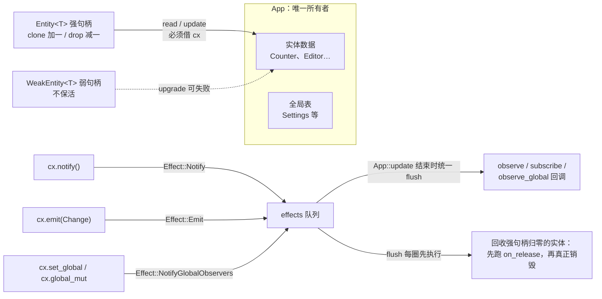

import { Meta } from '@storybook/addon-docs/blocks';

<Meta id="entities-and-data-flow" title="架构核心/Entity 与数据流" name="Docs" />

# Entity 与数据流

1.3 课建立了单实体的最小闭环：`cx.new` 创建、`cx.notify()` 驱动重渲染。本课回答更进一层的问题：**实体之间怎么协作，实体什么时候生、什么时候死**。GPUI 的答案建立在一条所有权规则上——所有实体数据由唯一的 `App` 顶层对象持有，你的代码之间流动的不是数据，而是句柄：强句柄 `Entity<T>` 用引用计数保活实体，弱句柄 `WeakEntity<T>` 只观察不保活。实体协作不靠互调方法，靠三条通知通道：`observe` 跟随"状态变了"（`notify`）、`subscribe` 接收"发生了什么"（`emit` 类型化事件）、`observe_global` 跟随全局单例变更。所有通知都不立即执行回调，而是进 effects 队列，在当前这轮 update 结束时统一处理。读完本课，你应该能回答：两个实体联动选哪条通道；手里该存强句柄还是弱句柄；最后一个句柄 drop 之后实体何时真正销毁；订阅回调何时执行。

本课 API 与签名一律核对自 crates.io 发布版 gpui 0.2.2；官方所有权博客已于 2025-12-12 更新到现行 API，与本课核对的语义一致（入口写法除外，见示例注释）。Context 各类型的能力划分归 4.1 课。



核心类型与机制一览（回查入口，各小节展开）：

| 条目 | 定位 | 回查要点 |
| --- | --- | --- |
| `Entity<T>` | 强句柄：类型化引用 App 托管的数据 | 克隆计数加一、drop 减一；归零后实体在本轮 flush 时回收 |
| `WeakEntity<T>` | 弱句柄：不阻止实体释放 | `upgrade()` 返回 `Option`；`update` 返回 `Result`，错误为 "entity released" |
| `cx.notify()` | 声明"本实体变了" | 驱动 `observe` 回调与窗口重绘；同一轮内对同一实体去重 |
| `cx.emit(event)` | 发类型化事件 | 要求 `T: EventEmitter<Evt>`；只投递订阅者，不触发重绘 |
| `cx.observe` | 观察某实体的 notify | 回调拿被观察者句柄，自己 `read` 新值；返回 `Subscription` |
| `cx.subscribe` | 订阅某实体的事件 | 回调直接拿 `&Evt`；要求对方实现 `EventEmitter` |
| `Global` + `cx.set_global` | 按类型注册全局单例 | `global` / `global_mut` 读写；`set_global` 与 `global_mut` 都会广播 |
| `observe_global` | 观察全局变更 | 注册后，任何 `set_global` / `global_mut` 都会触发 |
| `Subscription` | 订阅句柄 | drop 即取消订阅；`detach()` 后保活到实体释放 |

## 所有权模型：App 独占，句柄共享

官方 crate 文档的第一句话就是模型本身："every model or view in the application is actually owned by a single top-level object called the `App`"。`cx.new` 把你的结构体所有权移交给 App，换回来的是一个句柄。0.2.2 源码对 `Entity<T>` 的定义是"A strong, well-typed reference to a struct which is managed by GPUI"——它内部只是一个惰性标识（`EntityId`）加编译期类型标签，外加一条指向实体表的引用计数指针。

句柄的计数语义与 `Rc` 相同，权限语义不同：

- **相同**：`clone()` 计数加一，`drop` 时减一；多个句柄共享同一份数据，克隆廉价（只复制标识，不复制状态）。
- **不同**：`Rc<T>` 允许随时解引用拿数据；`Entity<T>` 不给这个权限——句柄解引用目标是类型擦除的 `AnyEntity`（所以 `counter.count` 编不过，1.3 课已讲），碰数据必须带着 `cx` 走 `read` / `update`。数据真正的主人始终是 App。

```rust
let counter: Entity<Counter> = cx.new(|_cx| Counter { count: 0 });

let alias = counter.clone(); // 引用计数 +1，数据不复制
drop(alias);                 // 计数 -1，数据还活着
drop(counter);               // 最后一个强句柄消失 → 计数归零
// 此刻数据尚未销毁：实体进入待释放名单，
// 要等本轮 update 结束的 effects flush（见下一节）
```

句柄之间按 `EntityId` 判等与排序（`PartialEq` / `Eq` / `Ord` 都基于 id），所以 `Entity<T>` 可以直接做 `HashMap` 的键、放进 `BTreeMap`；同一实体的两个句柄判等结果为真。`entity_id()` 随时取回这个标识。

## 通知的时序：effects 队列

`cx.notify()` 和 `cx.emit(...)` 都**不直接调用任何回调**。它们只是把一条 effect 推进队列：`Effect::Notify`（某实体变了）、`Effect::Emit`（某实体发了事件）、`Effect::NotifyGlobalObservers`（某全局类型变了）等。每轮 `App::update` 结束时，框架执行 `flush_effects`：循环弹出 effect 逐个处理，回调里又可以推进新 effect，循环持续到队列清空——官方博客称之为 run-to-completion：一个更新周期内做完所有连锁反应，期间没有重入。嵌套的 `entity.update` 共用同一轮 flush，只有最外层那次真正清队列（0.2.2 源码 `finish_update` 里的 `pending_updates` 计数）。

两条去重规则在同一轮 flush 内生效：`notify` 对同一实体只保留一条 `Effect::Notify`（连调十次也只触发一次观察回调）；`emit` 不去重，每次调用都投递一个事件。

**实体释放时机**就在这个 flush 循环里，分三步（0.2.2 源码 `Drop for AnyEntity` 与 `release_dropped_entities`）：

1. 最后一个强句柄 drop，引用计数归零，实体 id 排入待释放名单；弱句柄从此升级失败（`upgrade` 返回 `None`），但数据仍完整地躺在实体表里。
2. 本轮 update 结束，flush 每圈开头执行 `release_dropped_entities`：把数据从实体表取出，移除挂在该实体上的全部观察者与事件订阅，依次调用 release 回调（`on_release` / `observe_release`，官方文档："after the entity has no more strong references but before it has been dropped"）。
3. 取出的数据在循环收尾被 drop，`T` 真正销毁。

```rust
let counter = cx.new(|_cx| Counter { count: 0 });
let weak = counter.downgrade();

counter.update(cx, |c, _cx| c.count = 1); // 某一轮 update
drop(counter); // 最后一个强句柄消失：计数归零

weak.is_upgradable() // 已经是 false：弱句柄升级立即失败
// 但数据此刻还完整躺在实体表里，要等本轮 update 结束：
// flush_effects 先跑 on_release（回调里还能拿到 &mut T），然后才真正销毁
```

推演时注意两个时刻：**弱句柄失效**发生在计数归零的瞬间；**数据销毁**发生在当前这轮 update 的结尾。在一个 update 闭包内部 drop 句柄后立刻 `upgrade`，多半还能成功——这不是 bug，是 flush 还没跑到。

## observe：跟随状态变化

`observe` 解决的问题是："每当那个实体 `notify`，我要跟着做点什么"。回调被调用时拿到两样东西：自己的 `&mut T`（在 `Context<T>` 上注册时）和被观察者的句柄。通知本身**不带任何数据**——语义只是"变了"，要看新值得自己 `read`。

```rust
// Context<T> 版（docs.rs 0.2.2）：在"我"的上下文里注册，回调先拿自己
pub fn observe<W>(
    &mut self,
    entity: &Entity<W>,
    on_notify: impl FnMut(&mut T, Entity<W>, &mut Context<T>) + 'static,
) -> Subscription

// App 版：没有"我"的背景，回调只有被观察者
pub fn observe<W>(
    &mut self,
    entity: &Entity<W>,
    on_notify: impl FnMut(Entity<W>, &mut App) + 'static,
) -> Subscription
```

标准用法是在**观察者的构造闭包里**注册——官方 crate 文档特意强调"we can set up the callback before the Counter is even created"，订阅建立早于观察者自身构造完成是合法且常见的。派生联动：被观察者加一，观察者永远保持两倍：

```rust
let counter: Entity<Counter> = cx.new(|_cx| Counter { count: 0 });

// follower 的构造闭包里注册：回调第一个参数就是 &mut Counter（follower 自己）
let follower = cx.new(|cx: &mut Context<Counter>| {
    cx.observe(&counter, |follower, observed: Entity<Counter>, cx| {
        // 通知不带数据：要看新值，自己 read
        follower.count = observed.read(cx).count * 2;
    })
    .detach(); // 保活：两个实体存活期间一直生效
    Counter { count: 0 }
});

counter.update(cx, |c, cx| {
    c.count += 1;
    cx.notify();
});
assert_eq!(follower.read(cx).count, 2); // 联动发生在本轮 update 结束的 flush 中
```

`observe` 返回 `Subscription`——它是 `#[must_use]` 的订阅句柄：**drop 即退订，`detach()` 则保活**（官方文档："until the entities it has been subscribed to are dropped"）。跟实体同寿命的订阅在注册后立刻 `detach`；需要中途退订的存进结构体字段。多个订阅可用 `Subscription::join` 拴成一条。

| 变体（0.2.2） | 注册处 | 回调收到 |
| --- | --- | --- |
| `cx.observe(&e, f)` | `&mut Context<T>` | `&mut T`、`Entity<W>`、`&mut Context<T>` |
| `cx.observe_self(f)` | `&mut Context<T>` | `&mut T`、`&mut Context<T>`（盯自己的 notify） |
| `cx.observe_in(&e, &window, f)` | `&mut Context<T>` | 上者多一个 `&mut Window`（回调要做窗口操作时） |
| `cx.observe(&e, f)`（App 版） | `&mut App` | `Entity<W>`、`&mut App`（启动装配等无实体背景处） |

一个省心的设计：**订阅不保活任何一方**。GPUI 注册观察回调时对观察者与被观察者都只捕获弱句柄，任一方已释放，回调直接返回失败并从注册表移除；实体回收时也会显式清掉挂在它身上的观察与订阅。所以不会出现"回调里摸到已销毁实体"的悬空，也不会因为注册了观察而把对方钉在内存里。

## subscribe：传递类型化事件

`observe` 只能表达"变了"，信息量不够时用 `emit` / `subscribe`：实体主动发出**带数据、带语义**的事件，订阅方按类型接收。启用这套机制只需给实体实现 `EventEmitter`——0.2.2 里它是个空标记 trait（"A trait for tying together the types of a GPUI entity and the events it can emit"）：

```rust
struct Change {
    increment: usize, // 事件载荷：发生了什么、幅度多少
}

// 空实现即声明：Counter 可以发出 Change 类型的事件
// 一个实体想发多种事件，就 impl 多个 EventEmitter<...>
impl EventEmitter<Change> for Counter {}
```

`cx.emit(event)` 要求 `T: EventEmitter<Evt>`，内部只是把事件装箱推入 `Effect::Emit`；`cx.subscribe` 的回调则**直接拿到事件值**：

```rust
// Context<T> 版（docs.rs 0.2.2）
pub fn subscribe<T2, Evt>(
    &mut self,
    entity: &Entity<T2>,
    on_event: impl FnMut(&mut T, Entity<T2>, &Evt, &mut Context<T>) + 'static,
) -> Subscription
where
    T2: EventEmitter<Evt>,
```

官方博客配套示例 `ownership_post.rs` 就是这套机制的精读素材（入口按 0.2.2 发布版 `Application::new().run` 书写；main 分支为 `application().run`，其余逐行对应）：

```rust
use gpui::{App, Context, Entity, EventEmitter, Application, prelude::*};

struct Counter {
    count: usize,
}

struct Change {
    increment: usize,
}

impl EventEmitter<Change> for Counter {}

fn main() {
    Application::new().run(|cx: &mut App| {
        let counter: Entity<Counter> = cx.new(|_cx| Counter { count: 0 });

        // 在 subscriber 的构造闭包里注册订阅，随后 detach
        let subscriber = cx.new(|cx: &mut Context<Counter>| {
            cx.subscribe(&counter, |subscriber, _emitter, event, _cx| {
                // 语义就在事件里：不需要去 read 对方，直接用增量
                subscriber.count += event.increment * 2;
            })
            .detach();

            // 初始值同样可以从被订阅者派生
            Counter {
                count: counter.read(cx).count * 2,
            }
        });

        counter.update(cx, |counter, cx| {
            counter.count += 2;
            cx.notify();                    // 驱动观察者与窗口重绘
            cx.emit(Change { increment: 2 }); // 通知订阅者：发生了什么
        });

        // 订阅回调在本轮 update 结束的 flush 中已同步执行完毕
        assert_eq!(subscriber.read(cx).count, 4);
    });
}
```

注意官方示例同时调用了 `cx.notify()` 和 `cx.emit(...)`——这不是冗余，而是两条通道的分工：**`emit` 只投递给订阅者，既不通知观察者，也不触发任何窗口重绘**。改了状态想要界面更新，仍然要 `notify`（1.3 课的规则原样成立）；想让别人知道"发生了什么"，才轮到 `emit`。

| 变体（0.2.2） | 回调收到 |
| --- | --- |
| `cx.subscribe(&e, f)` | `&mut T`、`Entity<T2>`、`&Evt`、`&mut Context<T>` |
| `cx.subscribe_self(f)` | `&mut T`、`&Evt`、`&mut Context<T>`（订阅自己发出的事件） |
| `cx.subscribe_in(&e, &window, f)` | 上者多一个 `&mut Window` |
| `cx.subscribe(&e, f)`（App 版） | `Entity<T>`、`&Evt`、`&mut App` |

事件类型的自由度很大：普通结构体携带增量（`Change { increment }`），枚举区分多种语义（`enum EditorEvent { Edited, Saved }`），一个实体 `impl` 多个 `EventEmitter<...>` 即可发出多类事件，订阅方按类型分别 `subscribe`。

## observe 还是 subscribe

两条通道的签名差异就是判断依据：`observe` 回调拿到的是句柄，信息量只有"变了"；`subscribe` 回调直接拿到 `&Evt`，信息量是事件携带的任意数据与类型区分。

| 场景 | 选择 |
| --- | --- |
| 对方状态变了，我要刷新派生值 / 跟着重算 | `observe`：回调里 `read` 对方即可 |
| 我需要知道"发生了什么"（增量、种类、业务语义） | `subscribe`：语义写进事件类型 |
| 一对多广播一个动作或结果 | `subscribe`：多个订阅者各收一次 |
| 让界面重绘 | 两条都不管用——那是 `notify` 的窗口失效路径（1.3 课） |

经验法则：**状态同步用 `observe`，事件通知用 `subscribe`**。判断句是"回调需要数据吗"——不需要，`observe` 更简单；需要，别用 `observe` 加事后 `read` 硬凑，把数据放进事件类型，`subscribe` 一步到位。两者常在同一处连用：`notify` 负责"我变了"（重绘 + 观察者），`emit` 负责"发生了什么"（订阅者）。

## WeakEntity：不保活的句柄

`Entity::downgrade()` 把强句柄降级为 `WeakEntity<T>`——"non-retaining weak pointer"（官方注释）：不增加引用计数，实体可以照常回收。0.2.2 的接口把"对方可能已消失"编码在返回类型里：

```rust
pub fn downgrade(&self) -> WeakEntity<T>;          // Entity 上的降级
pub fn upgrade(&self) -> Option<Entity<T>>;        // 升级：已回收则 None
pub fn is_upgradable(&self) -> bool;               // 探测

// WeakEntity 上的操作：全部可能失败
pub fn update<C: AppContext, R>(&self, cx: &mut C, f: ...) -> Result<R>;   // Err: "entity released"
pub fn read_with<C: AppContext, R>(&self, cx: &C, f: ...) -> Result<R>;
```

三类典型用途：

**子实体回指父实体**——不打破环，双方都永不释放：

```rust
struct Parent {
    children: Vec<Entity<Child>>,
}

struct Child {
    // 写成 Entity<Parent> 会形成强句柄环：
    // 父持子、子持父，计数永不归零，两个实体一起泄漏
    parent: WeakEntity<Parent>,
}

impl Child {
    fn report_to_parent(&self, cx: &mut App) {
        // 升级失败说明父的强句柄已全部消失：静默返回即可，这是正常分支不是错误
        if let Some(parent) = self.parent.upgrade() {
            parent.update(cx, |parent, cx| parent.on_child_report(cx));
        }
    }
}
```

**异步任务与长命结构**：4.1 课讲过 `cx.spawn` 递给 async 块的就是 `WeakEntity<T>`——强句柄会在任务存活期间把引用计数钉在非零，实体回收时机被推迟到不可预测；弱句柄让"任务还在、实体没了"成为类型系统里的正常路径（任务与执行器归 4.4 课）。

**观察与订阅的内部实现**：上一节说过，`observe` / `subscribe` 注册的回调对双方都只捕获弱句柄——框架自己在示范这个姿势。

处理 `None` / `Err` 的口径与 4.1 课一致：对方已释放通常是窗口关闭、应用退出的正常终态，记日志返回，不要 `unwrap`。

## Global：按类型注册的单例

跨实体共享配置、主题、服务连接这类真正全局的东西，GPUI 用类型即键的全局表解决。`Global` 是空标记 trait，把"这个类型可以充当全局单例"写进类型系统（0.2.2 没有为此提供 derive 宏，官方源码都是手写空实现）：

```rust
#[derive(Default)]
struct Settings {
    theme: String,
}

// 空实现即声明：Settings 可以存入全局表
impl Global for Settings {}
```

注册与访问方法族（都在 `App` 上；`Context<T>` 经 `Deref` 同样可用，见 4.1 课）：

| 方法（0.2.2） | 行为 |
| --- | --- |
| `cx.set_global(value)` | 注册并覆盖该类型的全局；会广播变更 |
| `cx.global::<G>()` | 读；未注册时 panic |
| `cx.global_mut::<G>()` | 可变读；同样会广播变更 |
| `cx.try_global::<G>()` | 读，返回 `Option<&G>`；未注册不 panic |
| `cx.default_global::<G>()` | 可变读，未注册时用 `Default` 兜底（要求 `G: Default`） |
| `cx.has_global::<G>()` | 是否已注册 |
| `cx.remove_global::<G>()` | 取走并移除；未注册时 panic |

`set_global` 是覆盖语义（内部就是 `insert`），再次注册不报错、直接换值。**`set_global` 和 `global_mut` 都会推入 `Effect::NotifyGlobalObservers`**——也就是说不只是"整体替换"算变更，通过 `global_mut` 就地改字段同样会广播；同一轮内对同一类型去重。

```rust
// 启动时注册
cx.set_global(Settings { theme: "dark".into() });

// 任意能拿到 cx 的地方读（未注册会 panic，探测用 try_global）
let theme = cx.global::<Settings>().theme.clone();

// 任意实体观察该类型的变更：主题一变就重载
impl SettingsView {
    fn new(cx: &mut Context<Self>) -> Self {
        cx.observe_global::<Settings>(|this, cx| this.reload(cx))
            .detach();
        Self { /* ... */ }
    }
}
```

`observe_global` 同样有两版：App 版回调拿 `&mut App`（签名 `f: impl FnMut(&mut App)`），`Context<T>` 版回调先拿 `&mut Self`；另有绑定窗口的 `observe_global_in`，回调多拿 `&mut Window`。改全局且要同时用 `cx` 时，用 prelude 里的 `UpdateGlobal::update_global(cx, |settings, cx| ...)`，闭包同时拿到 `&mut G` 和上下文。

边界：全局表的粒度是**整个类型**——任何一处 `global_mut` 都会惊动该类型全部的 `observe_global`。高频、细粒度的领域状态不要塞进 `Global`，它应该是一个普通实体加句柄（可观察、可释放）；`Global` 适合低频变更的配置与服务。官方文档还提示了访问控制技巧：把全局类型设为私有，用 newtype 包一层、只暴露受限的访问器方法，即可限制谁能读写它。

## 最佳实践

- **字段存句柄先问寿命。** 与实体同寿命的短期引用用强句柄（克隆廉价）；异步任务、缓存、回指父级等寿命不可控的场景一律 `WeakEntity`。强句柄滞留在长命结构里是最常见的"实体迟迟不释放"。
- **状态同步默认 `observe`，语义事件默认 `subscribe`。** 判断句是"回调需要数据吗"：不需要就 `observe` 加 `read`；需要就把数据放进事件类型，不要 `observe` 之后再 `read` 硬凑——读到的可能已经不是触发时那一刻的值。
- **`emit` 与 `notify` 各管各的，改状态处常连用。** `emit` 不触发重绘、不通知观察者；`notify` 不携带数据。既要界面更新又要广播事件，就在同一个 `update` 闭包里两个都调（官方示例即如此）。
- **订阅生命周期显式化。** 跟实体同寿命的订阅：构造闭包里注册 + 立刻 `detach()`；需要可控退订的：把 `Subscription` 存进字段，drop 即退订；成组的订阅用 `join` 拴成一条管理。
- **观察链避免成环。** A `notify` → B 的 `observe` 回调里改 A 并再 `notify` → A 的观察者又触发 B……effects 队列永远清不空，flush 循环不退出，界面直接卡死。环状依赖改成单向事件（`emit`）或经 `WeakEntity` 弱化回边。
- **`Global` 放低频配置与服务，不放高频领域状态。** `global_mut` 每次调用都按类型广播，细粒度状态放实体才能享受实体级的 notify 粒度。

## 常见问题

- `cx.observe(...)` / `cx.subscribe(...)` 写完了，回调一次都不触发？
  返回的 `Subscription` 是 `#[must_use]` 的句柄：既没 `detach()` 也没保存，语句结束即 drop，订阅当场取消。处理：跟实体同寿命的订阅在注册后 `.detach()`；需要中途退订的存进字段。判断依据：0.2.2 源码中 `Subscription::drop` 立即执行退订闭包。
- `weak.update(...)` 返回 `Err("entity released")`，或 `upgrade()` 拿到 `None`？
  强句柄已全部消失——计数归零的瞬间弱句柄就升级失败，数据本体随本轮（或上一次）flush 被回收。处理：把失败当正常分支（窗口已关、任务比实体活得久），记日志返回，不要 `unwrap`。判断依据：只有强句柄计数保活实体，`WeakEntity` 与观察注册都不保活。
- `cx.emit()` 了，界面没更新？
  设计如此：`emit` 只把事件投递给订阅者，不标记视图失效。处理：在改状态的同一处补 `cx.notify()`；重绘由 `notify` 负责（1.3 课），事件由 `emit` 负责，两者常连用。
- 实体迟迟不释放、内存持续增长？
  两个方向排查：强句柄环（父子互持 `Entity<T>`，计数永不归零）；句柄缓存在长命结构（全局表、任务、静态注册表）里。处理：回指一律改 `WeakEntity`，缓存改存 `EntityId` 加弱句柄。进一步定位可开启 0.2.2 的 `leak-detection` feature，泄漏的句柄会打印分配时的 backtrace。

## 总结回顾

摘要：

GPUI 的实体协作围绕一条所有权规则展开：所有实体数据由 `App` 独占持有，代码之间流动的只是句柄。`Entity<T>` 是带引用计数的强句柄，克隆加一、drop 减一，但句柄不赋予权限——碰数据必须借 `cx` 走 `read` / `update`。最后一个强句柄归零后，实体并不立刻销毁，而是等本轮 update 结束的 effects flush：先清掉挂在它身上的观察与订阅、跑完 `on_release` 回调，才真正 drop。联动有两条主动通道：`observe` 跟随 `notify` 的"状态变了"（回调拿句柄自己 `read`，不带数据），`subscribe` 接收 `emit` 的类型化事件（要求 `EventEmitter`，回调直接拿数据）；`emit` 不触发重绘，与 `notify` 职责不同、常连用。所有通知都进 effects 队列在 update 尾部统一执行——无重入，`notify` 去重，`emit` 不去重。`WeakEntity` 不保活，`upgrade` / `update` 用 `Option` / `Result` 承接"对方已消失"，用于打破环、异步任务与长命字段。全局单例用 `Global` 按类型注册：`set_global` 与 `global_mut` 读写并广播，`observe_global` 在实体或 App 层接收变更。

一句话：

> 实体数据归 `App` 独占，句柄只计引用不赋权限；实体协作走 `observe`（传"变了"）与 `subscribe`（传"发生了什么"），所有通知进 effects 队列、update 尾部统一 flush。

知识要点：

- `Entity<T>` 与 `Rc` 的相同点（克隆/drop 的引用计数）与关键差异（访问必须经 `cx`，句柄解引用不到 `T`）
- 最后一个强句柄 drop 之后、实体真正销毁之前发生什么：等 flush，先跑 `on_release`，再 drop 数据
- `observe` 与 `subscribe` 的回调签名差异、信息量差异，以及"回调需要数据吗"的选择判断
- `emit` 为什么不触发重绘，`notify` 与 `emit` 为什么常在同一个 update 里连用
- `notify` 与 `emit` 的回调何时执行：effects 队列，本轮 update 结束统一 flush；`notify` 去重、`emit` 不去重
- `WeakEntity` 的三个用途（打破环、异步任务、长命字段）与 `upgrade` / `update` 的失败形态
- `Global` 方法族中哪些操作会触发 `observe_global`（`set_global` 与 `global_mut` 都会），`Global` 适合放什么、不适合放什么
- `Subscription` 的生命周期规则：drop 取消、`detach` 保活、`join` 合并

## 参考资料

- [Ownership and data flow in GPUI（官方博客，2025-12-12 更新至现行 API）](https://zed.dev/blog/gpui-ownership)
- [官方示例 ownership_post.rs（博客配套的 observe/subscribe 示例）](https://github.com/zed-industries/zed/blob/main/crates/gpui/examples/ownership_post.rs)
- [Ownership and data flow（gpui 0.2.2 crate 根文档模块）](https://docs.rs/gpui/0.2.2/gpui/)
- [Entity（read、update、downgrade）- docs.rs/gpui 0.2.2](https://docs.rs/gpui/0.2.2/gpui/struct.Entity.html)
- [WeakEntity（upgrade、update、read_with）- docs.rs/gpui 0.2.2](https://docs.rs/gpui/0.2.2/gpui/struct.WeakEntity.html)
- [Context（observe、subscribe、emit、observe_global 全家族）- docs.rs/gpui 0.2.2](https://docs.rs/gpui/0.2.2/gpui/struct.Context.html)
- [App（observe、subscribe、全局状态方法族）- docs.rs/gpui 0.2.2](https://docs.rs/gpui/0.2.2/gpui/struct.App.html)
- [EventEmitter trait - docs.rs/gpui 0.2.2](https://docs.rs/gpui/0.2.2/gpui/trait.EventEmitter.html)
- [Global trait - docs.rs/gpui 0.2.2](https://docs.rs/gpui/0.2.2/gpui/trait.Global.html)
- [Subscription（drop 取消、detach、join）- docs.rs/gpui 0.2.2](https://docs.rs/gpui/0.2.2/gpui/struct.Subscription.html)
- [gpui 0.2.2 源码 app.rs（flush_effects、release_dropped_entities、全局状态与去重）](https://docs.rs/crate/gpui/0.2.2/source/src/app.rs)
- [gpui 0.2.2 源码 app/entity_map.rs（句柄引用计数、Drop 与释放名单）](https://docs.rs/crate/gpui/0.2.2/source/src/app/entity_map.rs)
- [官方文档 contexts.md（Entity 定义与 observe 概述）](https://github.com/zed-industries/zed/blob/main/crates/gpui/docs/contexts.md)
