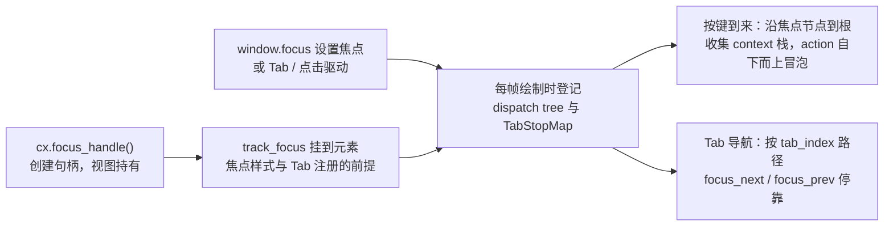

import { Meta } from '@storybook/addon-docs/blocks';

<Meta id="focus" title="交互/焦点管理" name="Docs" />

# 焦点管理

键盘输入永远需要一个答案："这个键此刻该交给谁？"GPUI 用显式句柄回答这个问题：视图创建 `FocusHandle` 并持有，元素用 `track_focus` 挂接句柄，`window.focus` 设置当前焦点。窗口里同一时刻只有一个焦点，它同时决定三件事——焦点样式（`focus` / `in_focus` / `focus_visible`）、按键上下文的激活链（3.2 课的 `key_context` 绑定只有焦点落在其子树内才生效）、Tab 导航的停靠顺序（`tab_index` / `tab_stop`）。读完你能预测：两个面板各持一个句柄时，焦点切到哪边、哪个面板的快捷键被激活、按 Tab 会停到谁身上。

焦点从创建到生效的完整路径：



焦点 API 家族回查表（详细语义见后文小节）：

| 成员 | 挂载位置 | 作用与回查要点 |
| --- | --- | --- |
| `cx.focus_handle()` | `App`（`Context` 也可用） | 创建 `FocusHandle`，存进视图结构体长期持有 |
| `.tab_index(n)` / `.tab_stop(b)` | `FocusHandle` 链式调用 | Tab 序位置与是否停靠；默认 0 / false |
| `track_focus(&handle)` | `InteractiveElement` | 把焦点状态挂到元素；焦点样式、Tab 注册的前提 |
| `focus(f)` / `in_focus(f)` | `InteractiveElement` | 元素被聚焦 / 处在焦点子树内时的样式 |
| `focus_visible(f)` | `InteractiveElement` | 仅键盘导航聚焦时的样式（仅 main） |
| `tab_index(n)` / `tab_stop(b)` / `tab_group()` | `InteractiveElement` | 元素级 Tab 序控制，自动生成隐式句柄（需 `.id()`） |
| `handle.focus(window)` | `FocusHandle` | 程序化聚焦；main 为 `handle.focus(window, cx)` |
| `window.focused(cx)` | `Window` | 当前焦点，返回 `Option<FocusHandle>` |
| `window.focus_next(cx)` / `focus_prev(cx)` | `Window` | Tab 序前进 / 后退，循环；0.2.2 不带 `cx` 参数 |
| `window.blur(cx)` / `disable_focus(cx)` | `Window` | 清空焦点 / 清空并禁止再聚焦；0.2.2 不带 `cx` 参数 |
| `cx.on_focus` / `on_focus_in` / `on_focus_out` / `on_focus_lost` | `Context` | 焦点事件订阅，见焦点事件小节 |
| `window.on_focus_in` / `on_focus_out` | `Window` | 同上，不带视图状态的版本 |
| `key_context("Pane")` | `InteractiveElement` | 声明按键上下文名；是否激活由焦点决定 |

版本口径：除 `focus_visible` 外，上表均为 gpui 0.2.2 已发布的 API。焦点 API 在 0.2.2 到 main 之间有一次签名演进：main 给 `window.focus` / `blur` / `focus_next` / `focus_prev` 和 `FocusHandle::focus` 都加了 `cx: &mut App` 参数。本课片段默认 0.2.2 写法，差异处在注释里标注 main 写法；`focus_visible` 样式与官方 `focus_visible.rs` 示例目前仅 main 可用。不属于本课的近邻成员：按键分发全链路（keystroke 解析、`KeyBinding`、action 冒泡细节）归 3.2 课，文本输入框归 3.5 课。

## FocusHandle：焦点的句柄

`FocusHandle` 是焦点的一等公民：它不是元素的隐式状态，而是一个可以放进结构体、克隆、比较、查询的值。0.2.2 的定义（`src/window.rs`）：

```rust
// gpui 0.2.2 的 FocusHandle 定义
pub struct FocusHandle {
    pub(crate) id: FocusId,
    handles: Arc<FocusMap>,
    pub tab_index: isize, // 该元素在 Tab 序中的位置，默认 0
    pub tab_stop: bool,   // 能否被 Tab 导航停靠，默认 false
}
```

创建与持有：

```rust
struct Panel {
    focus_handle: FocusHandle, // 存进视图结构体：句柄是长期持有的值
}

impl Panel {
    fn new(_window: &mut Window, cx: &mut Context<Self>) -> Self {
        // focus_handle() 定义在 App 上，Context 转发后视图构造里直接可用
        Self { focus_handle: cx.focus_handle() }
    }
}
```

句柄是引用计数的：`clone()` 递增计数、`drop` 递减，最后一份被丢弃后句柄失效（再从窗口查询它只会得到 `None`）。所以"谁可聚焦，谁持有句柄"——需要从外部聚焦某个视图时，让它实现 `Focusable`：

```rust
// 视图对外暴露焦点句柄的标准方式
pub trait Focusable: 'static {
    fn focus_handle(&self, cx: &App) -> FocusHandle;
}
// Entity<V> 也实现了 Focusable：任何地方都能 entity.focus_handle(cx) 拿到句柄；
// cx.focus_view(&entity, window) 聚焦整个视图，内部就是取句柄再调 window.focus
```

模态、弹层类视图通常再实现 `ManagedView`（`Focusable` + `EventEmitter<DismissEvent>` + `Render` 的空接口约定），关闭弹层时把焦点还给触发者的通用逻辑就建立在这个约定上。

句柄上的查询与操作方法（0.2.2 签名）：

| 方法 | 含义 |
| --- | --- |
| `is_focused(&window) -> bool` | 句柄正是当前焦点 |
| `contains_focused(&window, cx) -> bool` | 焦点在句柄子树内（含句柄自身） |
| `within_focused(&window, cx) -> bool` | 句柄处在焦点元素的子树内（含自身） |
| `contains(&other, &window) -> bool` | 句柄间祖先判断，基于最近一帧的绘制结果 |
| `dispatch_action(&action, window, cx)` | 对渲染出该句柄的元素派发一个动作 |
| `downgrade() -> WeakFocusHandle` | 弱引用，`upgrade()` 还原，不阻止句柄释放 |

`tab_index` / `tab_stop` 两个公开字段可直接读取，修改用链式方法 `handle.tab_index(1).tab_stop(true)`——它们会同步更新窗口里的焦点登记表，排序语义见 Tab 导航小节。

## 把焦点挂到元素：track_focus

`track_focus(&handle)` 是元素与句柄之间的桥：它把元素标记为可聚焦，并记录"这个元素代表哪个句柄"。挂接之后三件事才生效——焦点样式、Tab 序注册、按键上下文链上的节点（后两件事每帧绘制时自动完成）。

焦点样式三件套都接一个 `StyleRefinement` 闭包，判定条件各不相同：

| 样式方法 | 应用条件 |
| --- | --- |
| `focus(f)` | 该元素挂接的句柄正是当前焦点 |
| `in_focus(f)` | 该元素自身是焦点，或处在焦点元素的子树内 |
| `focus_visible(f)` | `focus` 的条件 + 窗口最后一次输入来自键盘（仅 main） |

```rust
impl Render for Panel {
    fn render(&mut self, _window: &mut Window, _cx: &mut Context<Self>) -> impl IntoElement {
        div()
            .track_focus(&self.focus_handle) // 焦点样式的前提
            .focus(|style| style.border_4().border_color(rgb(0xfbbf24))) // 聚焦时黄框
            .child("等待聚焦")
    }
}
```

`in_focus` 的典型用法是层次化高亮：容器与内部成员挂接同一个句柄，外层写 `focus`、内层写 `in_focus`，焦点打进来时整个活动区域一起变化。三个方法都要求先 `track_focus`——没有挂接句柄的元素，样式闭包写了也不会应用。

另一个入口是元素级 Tab API：`div().id("btn").tab_index(1)`。这种写法不需要自己创建句柄——元素被标记为可聚焦但没有 `track_focus` 时，GPUI 会自动创建一个隐式 `FocusHandle` 存进元素状态，跨帧稳定，并把元素级 `tab_index` / `tab_stop` 应用到它上面。注意两个前提：元素必须有 `.id()`（隐式句柄要存在元素状态里，无状态元素没有这个存储位置）；元素级 `tab_index` 会自动把元素设为 tab stop，与句柄级行为不同（见 Tab 导航小节）。

## 键盘焦点环：focus_visible

`focus()` 样式有个交互问题：鼠标点击聚焦也会亮框。Web 平台用 CSS 伪类 `:focus-visible` 区分"键盘来的焦点"，GPUI 在 main 分支引入了同名机制：`focus_visible(f)` 只在元素被聚焦**且**窗口最后一次输入来自键盘时应用——鼠标点击聚焦不应用，Tab 导航聚焦才应用。这就是官方 `focus_visible.rs` 示例演示的"键盘焦点环"：三个按钮把三种写法放在一起对比。

```rust
// 仅 main：0.2.2 没有 focus_visible 方法
// button_base 是官方示例里共用的基础样式辅助函数（id + 底色 + 圆角），此处省略
// 按钮 1：focus —— 鼠标点击、Tab 上来都亮黄框
button_base("b1", "点我 / Tab 到我都亮黄框")
    .track_focus(&self.items[0].0)
    .focus(|style| style.border_4().border_color(rgb(0xfbbf24)))

// 按钮 2：focus_visible —— 鼠标点击无框，键盘上来才亮绿框
button_base("b2", "点我没框，Tab 上来亮绿框")
    .track_focus(&self.items[1].0)
    .focus_visible(|style| style.border_4().border_color(rgb(0x10b981)))

// 按钮 3：叠加 —— 点击亮黄框，Tab 上来绿框
button_base("b3", "点击黄框，Tab 绿框")
    .track_focus(&self.items[2].0)
    .focus(|style| style.border_4().border_color(rgb(0xfbbf24)))
    .focus_visible(|style| style.border_4().border_color(rgb(0x10b981)))
```

运行该示例的观察点：鼠标依次点击三个按钮，按钮 1 和 3 亮黄框、按钮 2 无框；改用 Tab 键在按钮间移动（示例把 `tab` / `shift-tab` 绑定成自定义动作，回调里调 `window.focus_next(cx)` / `focus_prev(cx)`），三个按钮都亮框，按钮 2 和 3 是绿框。叠加写法里 `focus_visible` 在 `focus` 之后合并样式，同为边框色时后者覆盖——所以鼠标点击是黄框、键盘上来变绿框，两种来源一眼可辨。

示例的判定源头在元素样式的计算阶段：`focus_visible` 的样式要求挂接句柄处于聚焦状态，且 `window.last_input_was_keyboard()` 为真——键盘按下后该标记置位，直到下一次鼠标事件。0.2.2 没有这个方法，也没有公开的输入来源查询，焦点环只能用 `focus()`（不区分来源）。

## 程序化聚焦与焦点事件

聚焦、查询、清除三个基本操作都在窗口与句柄上：

```rust
// 0.2.2 写法；main 的等价调用都多一个 cx 参数
window.focus(&self.left);        // 聚焦：等价于 self.left.focus(window)
self.left.is_focused(window);    // 查询：是不是当前焦点
window.focused(cx);              // 查询：当前焦点 Option<FocusHandle>
window.blur();                   // 清空焦点
window.disable_focus();          // 清空并禁止本窗口再聚焦
```

`window.focus` 设置后框架立即安排重绘，下一帧焦点样式、按键上下文链、Tab 位置全部随新焦点变化。`focus_next` / `focus_prev` 也走同一入口，归入 Tab 导航小节。

焦点变化的事件订阅有四个粒度（`Context` 上的版本，0.2.2 与 main 一致）：

| 订阅方法 | 触发时机 |
| --- | --- |
| `on_focus(&handle, window, f)` | 句柄本身获得焦点；句柄后代获得不触发 |
| `on_focus_in(&handle, window, f)` | 句柄或其后代获得焦点；焦点本就在该子树内转移时不触发 |
| `on_focus_out(&handle, window, f)` | 句柄或其后代失去焦点；回调收到 `FocusOutEvent`，其 `blurred` 字段是失去焦点的 `WeakFocusHandle` |
| `on_focus_lost(window, f)` | 窗口里不再有任何焦点，典型场景是焦点元素被移除 |

`Window` 上另有 `on_focus_in` / `on_focus_out`，回调签名是 `FnMut(&mut Window, &mut App)`，适合不依赖某个视图的订阅。焦点事件返回 `Subscription`，持有期间有效，drop 即退订（与 4.2 课的订阅语义一致）。

把这些拼起来，就是"两个输入区切换焦点"的完整最小例（0.2.2 写法）：

```rust
actions!(demo, [Toggle]);

struct TwoPanes {
    left: FocusHandle,
    right: FocusHandle,
}

impl TwoPanes {
    fn new(window: &mut Window, cx: &mut Context<Self>) -> Self {
        let left = cx.focus_handle();
        let right = cx.focus_handle();
        window.focus(&left); // 初始聚焦左区；main：window.focus(&left, cx)
        Self { left, right }
    }

    // 切换动作：焦点在两个输入区之间来回
    fn toggle(&mut self, _: &Toggle, window: &mut Window, cx: &mut Context<Self>) {
        if self.left.is_focused(window) {
            self.right.focus(window); // main：self.right.focus(window, cx)
        } else {
            self.left.focus(window);
        }
        cx.notify();
    }
}

// 两块面板共用外观；句柄与焦点样式在调用处按需挂接
fn pane(id: &'static str, label: &'static str) -> Stateful<Div> {
    div()
        .id(id)
        .flex_1()
        .h_32()
        .p_3()
        .bg(rgb(0x313244))
        .text_color(gpui::white())
        .rounded_md()
        .child(label)
}

impl Render for TwoPanes {
    fn render(&mut self, _window: &mut Window, cx: &mut Context<Self>) -> impl IntoElement {
        div()
            .size_full()
            .flex()
            .gap_4()
            .on_action(cx.listener(Self::toggle))
            .child(
                pane("left", "左输入区")
                    .track_focus(&self.left)
                    .focus(|style| style.border_4().border_color(rgb(0xfbbf24)))
                    .on_mouse_down(MouseButton::Left, cx.listener(|this, _, window, cx| {
                        this.left.focus(window); // 点击聚焦；main 加 cx 参数
                        cx.notify()
                    })),
            )
            .child(
                pane("right", "右输入区")
                    .track_focus(&self.right)
                    .focus(|style| style.border_4().border_color(rgb(0xfbbf24)))
                    .on_mouse_down(MouseButton::Left, cx.listener(|this, _, window, cx| {
                        this.right.focus(window);
                        cx.notify()
                    })),
            )
    }
}

// 让 toggle 真正可达还差按键绑定（总链路见 3.2 课）
cx.bind_keys([KeyBinding::new("ctrl-t", Toggle, None)]);
```

运行后初始左区亮黄框；执行 `ctrl-t` 焦点跳到右区；鼠标点击任一区也会把焦点带过去——三种驱动方式（程序、按键、鼠标）写法各一处，落点都是同一个 `window.focus`。

## 焦点决定按键上下文

3.2 课讲过：动作绑定在 `key_context` 声明的上下文里。这里补上另一半——**哪些上下文生效，由焦点决定**。按键到来时，GPUI 沿绘制树从当前焦点节点走到根，收集沿途所有 `key_context` 组成上下文栈（可用 `window.context_stack()` 查看），`KeyBinding` 的 context 前缀按这条栈匹配，action 再从焦点节点沿祖先链自下而上冒泡，内层优先。

```rust
impl Editor {
    fn render(&mut self, _window: &mut Window, cx: &mut Context<Self>) -> impl IntoElement {
        div()
            .track_focus(&self.focus_handle) // 焦点链上的节点，key_context 激活的前提
            .key_context("Editor")           // 声明上下文名
            .on_action(cx.listener(Self::undo))
            .child("……")
    }
}

// cmd-z 只在焦点落在 Editor（或其后代）上时才触发 Editor::undo
cx.bind_keys([KeyBinding::new("cmd-z", Undo, Some("Editor"))]);
```

两个直接后果：

- 同一个键在不同焦点下触发不同动作：焦点在 `"Editor"` 里 `cmd-z` 是撤销，焦点切到 `"List"` 的子树里就是列表自己的绑定——3.2 课的 context 匹配机制，真正"哪条 context 参与匹配"由焦点给出。
- `on_action` 不必挂在焦点元素自己身上：挂在焦点链上的任何祖先都能收到。官方 `focus_visible.rs` 就把 `on_action(Tab)` 挂在根容器上，焦点无论落在哪个按钮上，Tab 动作都冒泡到根。
- 窗口没有任何焦点时，绘制路径回退到根节点：无 context 约束的绑定（`KeyBinding::new("tab", Tab, None)`）仍然可用，带 context 的绑定不匹配。

按键解析、多键序列、binding 冲突消解这些分发环节本身归 3.2 课，本课不重复。

## Tab 导航顺序

Tab 导航的顺序不是声明顺序，而是每帧绘制时现算的：`track_focus` 的元素和元素级 `tab_index` 的元素把自己的句柄登记进窗口的 Tab 停靠表，`tab_group()` 再为子树开出一条嵌套路径。排序规则随之确定：**每个句柄的路径是它从根到自身途经的各级 tab_index 序列，路径按字典序排序，同一 tab_index 按绘制（注册）顺序排先后**；`focus_next` / `focus_prev` 沿排序结果循环滚动，末尾回到开头。

先看最容易踩的默认值：句柄的 `tab_stop` 默认是 **false**——只创建句柄、不调 `.tab_stop(true)`，Tab 永远不会停在它上面，但它仍在序列里，可以程序化聚焦；若焦点恰好停在非停靠句柄上，按 Tab 会从它继续向后找下一个停靠点。

```rust
// 官方 tab_stop.rs 的前半段：五个句柄的 Tab 序是 1 → 2 → 2′ → 3，循环
let items = vec![
    cx.focus_handle().tab_index(1).tab_stop(true),
    cx.focus_handle().tab_index(2).tab_stop(true),
    cx.focus_handle().tab_index(3).tab_stop(true),
    cx.focus_handle(), // 默认 tab_index 0、tab_stop false：Tab 跳过，仍可程序化聚焦
    cx.focus_handle().tab_index(2).tab_stop(true), // 与第 2 个并列，注册更晚排其后
];
```

另一个默认值差异要分清：**句柄级 `tab_index(n)` 不会自动设 `tab_stop`，元素级 `tab_index(n)` 会**（同时把元素标记为可聚焦）。简单控件直接用元素级写法最省事：

```rust
// 元素级 tab_index：不需要自己创建 FocusHandle，隐式句柄存进元素状态
fn btn(id: &'static str, index: isize) -> Stateful<Div> {
    div()
        .id(id) // 元素级 API 要求有状态元素
        .tab_index(index) // 自动：可聚焦 + tab stop
        .h_10()
        .flex_1()
        .child(format!("tab_index {}", index))
}
```

Tab 顺序重排靠 `tab_group`：组在 Tab 序里占一个位置（组自己的 `tab_index`），组内成员的 `tab_index` 从 0 重新计——整组前后挪动只需改组的一个数字，不必给全应用重编号：

```rust
// 官方 tab_stop.rs 的分组段：两个组分别占第 6、7 位，组内各自从 1 重计
div()
    .id("group-1")
    .tab_index(6) // 组整体在 Tab 序中的位置
    .tab_group() // 声明为 tab 组：组内成员的 tab_index 从 0 重计
    .tab_stop(false) // 组容器自己不是停靠点：Tab 直接落到组内第一个成员
    .child(btn("g1-a", 1)) // 实际 Tab 路径 [6, 1]
    .child(btn("g1-b", 2)) // [6, 2]
    .child(btn("g1-c", 3)) // [6, 3]
// 想让第二组先被 Tab 到？把它的 tab_index 改成比 6 小即可，组内三个数字都不用动
```

容器上的 `tab_stop(false)` 与 `tab_index` 搭配是官方注释推荐的模式：容器在序列里占位、可程序化聚焦，但 Tab 不可达——聚焦容器后调 `window.focus_next`，焦点落到组内第一个成员上。

最后一点：**Tab 键不是内建行为**。GPUI 不替你决定 Tab 该做什么，官方两个示例都自己定义动作、绑定按键、在回调里调 `focus_next` / `focus_prev`：

```rust
actions!(demo, [Tab, TabPrev]);

cx.bind_keys([
    KeyBinding::new("tab", Tab, None),      // 无 context 约束：任何焦点下都触发
    KeyBinding::new("shift-tab", TabPrev, None),
]);

// 动作处理（0.2.2 写法；main 的 focus_next / focus_prev 多一个 cx 参数）
fn on_tab(&mut self, _: &Tab, window: &mut Window, cx: &mut Context<Self>) {
    window.focus_next();
    cx.notify();
}
```

## 最佳实践

- **句柄放在最合适的持有者手里。** 自己可聚焦的视图直接存字段；需要被外部（父视图、命令面板、弹层管理器）聚焦的视图实现 `Focusable`，调用方用 `entity.focus_handle(cx)` 拿句柄、`cx.focus_view(&entity, window)` 一行聚焦。跨视图传句柄时优先传 `WeakFocusHandle`，避免延长句柄生命周期。
- **可键盘操作的控件成套配置。** 一个"键盘可达的按钮"是几件事的和：`.id()` + `track_focus` + `.focus_visible(...)`（main；0.2.2 用 `focus`）+ `.on_click`（聚焦后 `enter` / `space` 触发 `ClickEvent::Keyboard`，见 3.1 课）+ 应用层绑定 Tab 导航。只配其中一两件，键盘用户就会在某一步卡住。
- **提前安排焦点恢复。** 焦点元素被移除（弹层关闭、列表项删除）后窗口进入无焦点状态，带 context 的快捷键全部失灵。订阅 `on_focus_lost` 把焦点挪回合理位置；main 分支还提供 `window.focus_lost_restore_target(cx)`，在失去焦点的回调里直接给出最近的存活祖先作为恢复目标。
- **大区块用 tab_group 组织 Tab 序。** 组内成员从 0 重计，整组重排只动组的一个数字；容器 `tab_stop(false)` 让"程序化聚焦容器 + focus_next 进组"成为固定搭配，避免容器自己截住 Tab。

## 常见问题

- 按 Tab 没有任何反应？
  GPUI 不内建 Tab 导航。先确认应用层已按官方模式绑定：`actions!` 定义动作、`cx.bind_keys` 绑 `tab` / `shift-tab`、回调里调 `window.focus_next()` / `focus_prev()`；再确认目标句柄调过 `.tab_stop(true)`——默认值是 false，只设 `tab_index` 的句柄不会被停靠。
- `.focus(...)` 样式写了但不生效？
  焦点样式三件套都以 `track_focus(&handle)` 为前提，且要求挂接的正是当前焦点的句柄。检查两点：元素上有没有 `track_focus`；传进去的句柄和你调用 `window.focus` 聚焦的是不是同一个（句柄按 `FocusId` 比较，重新 `cx.focus_handle()` 创建的是新句柄）。
- 句柄调了 `.tab_index(1)`，Tab 还是跳过它？
  句柄级 `tab_index` 只改排序、不改变 `tab_stop` 默认值 false，链上补 `.tab_stop(true)`。元素级 `tab_index(n)` 才会自动设为停靠点——两者的不对称是有意设计，写的时候注意区分。
- 弹窗关闭 / 列表项删除后快捷键全失灵了？
  焦点元素被移除后窗口无焦点，带 context 的绑定不匹配。在 `on_focus_lost` 回调里把焦点恢复到合理位置（例如容器句柄或下一个列表项）；main 可用 `window.focus_lost_restore_target(cx)` 自动找存活祖先。
- 鼠标点击按钮也出现了焦点环，想让环只在键盘导航时出现？
  这是 `focus()` 的语义：不分输入来源。main 分支改用 `focus_visible()`；0.2.2 没有对应 API，只能用 `focus()` 或自行记录输入来源做条件样式。

## 总结回顾

摘要：

GPUI 的焦点是显式句柄：视图用 `cx.focus_handle()` 创建 `FocusHandle` 并持有（引用计数，`Focusable` trait 是对外暴露句柄的标准方式），元素用 `track_focus` 挂接后获得焦点样式、Tab 注册与按键上下文节点三重身份。样式三件套按条件递进——`focus` 是被聚焦、`in_focus` 是处在焦点子树内、`focus_visible` 只在键盘导航聚焦时应用（仅 main）。`window.focus` / `focused` / `blur` 提供程序化控制，`on_focus` / `on_focus_in` / `on_focus_out` / `on_focus_lost` 覆盖四种焦点变化。按键上下文由焦点决定：context 栈是焦点节点到根的路径，3.2 课的绑定沿这条栈匹配、action 自下而上冒泡。Tab 导航按 tab_index 路径字典序停靠，`tab_stop` 默认 false、句柄级与元素级的自动行为不对称，`tab_group` 让整组重排只改一个数字，Tab 键本身由应用自己绑定。

一句话：

> 焦点是显式句柄而不是隐式状态：谁持有 `FocusHandle`，谁就能查询、设置和样式化键盘归属；按键上下文与 Tab 停靠都从"当前焦点是谁"推导。

知识要点：

- `FocusHandle` 怎么创建、为什么存进视图结构体，引用计数与失效意味着什么，`Focusable` 与 `focus_view` 各用在何时
- `track_focus` 挂接后元素获得了什么；`focus` / `in_focus` / `focus_visible` 三者的判定条件与版本边界
- 程序化聚焦、查询、清空分别用哪些方法；`on_focus` / `on_focus_in` / `on_focus_out` / `on_focus_lost` 分别何时触发
- `key_context` 的激活为什么由焦点决定；无焦点时上下文栈回退到哪里
- Tab 序由什么决定；`tab_stop` 默认值与句柄级 / 元素级 `tab_index` 的差异；`tab_group` 如何整组重排；Tab 键为什么需要应用自己绑定

## 参考资料

- [FocusHandle（结构体与全部方法）- docs.rs/gpui 0.2.2](https://docs.rs/gpui/0.2.2/gpui/struct.FocusHandle.html)
- [Focusable（trait 与 Entity 实现）- docs.rs/gpui 0.2.2](https://docs.rs/gpui/0.2.2/gpui/trait.Focusable.html)
- [InteractiveElement（track_focus、tab_index、tab_stop、tab_group、key_context、focus、in_focus）- docs.rs/gpui 0.2.2](https://docs.rs/gpui/0.2.2/gpui/trait.InteractiveElement.html)
- [Window（focus、focused、blur、focus_next、focus_prev、on_focus_in、on_focus_out、context_stack）- docs.rs/gpui 0.2.2](https://docs.rs/gpui/0.2.2/gpui/struct.Window.html)
- [gpui 0.2.2 源码 window.rs（FocusHandle 定义、焦点事件与 focus_lost 触发条件）](https://docs.rs/crate/gpui/0.2.2/source/src/window.rs)
- [官方示例 tab_stop.rs（Tab 停靠、tab_group、非停靠句柄）](https://github.com/zed-industries/zed/blob/main/crates/gpui/examples/tab_stop.rs)
- [官方示例 focus_visible.rs（仅 main；键盘焦点环三态对比）](https://github.com/zed-industries/zed/blob/main/crates/gpui/examples/focus_visible.rs)
- [key_dispatch.md（key_context 声明与按键绑定写法）](https://github.com/zed-industries/zed/blob/main/crates/gpui/docs/key_dispatch.md)
- [main 分支 key_dispatch.rs 模块文档（焦点与 action 冒泡、context 激活链）](https://github.com/zed-industries/zed/blob/main/crates/gpui/src/key_dispatch.rs)
- [main 分支 div.rs（focus_visible / in_focus 样式判定、元素级 tab_index 与隐式句柄）](https://github.com/zed-industries/zed/blob/main/crates/gpui/src/elements/div.rs)
