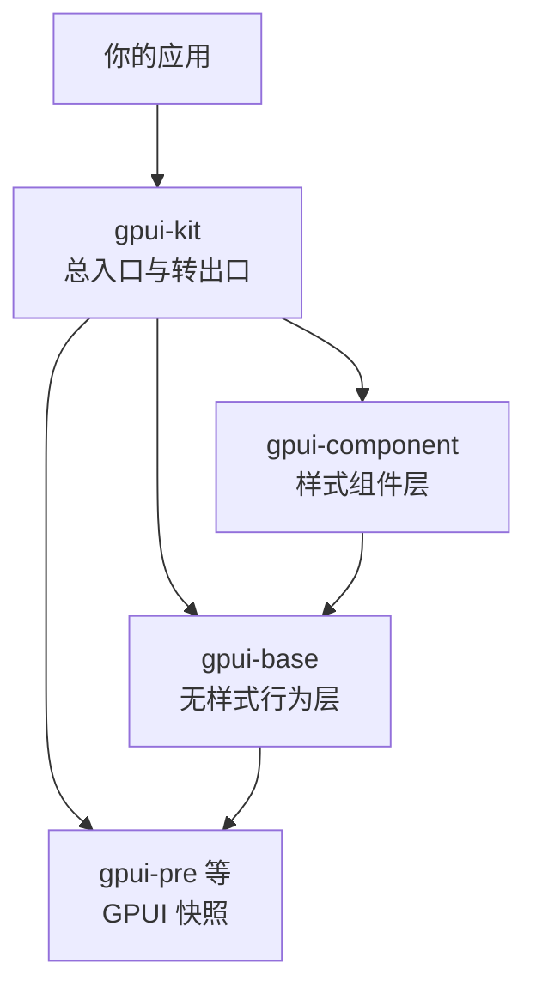

import { Meta } from '@storybook/addon-docs/blocks';

<Meta id="gpui-kit-intro" title="生态实践/gpui-kit 入门" name="Docs" />

# gpui-kit 入门

官方 gpui 只提供渲染、布局与交互的地基，没有官方组件层——按钮、表格、停靠面板都得自己搭。gpui-kit（原名 gpui-component，Longbridge 开源）填补这一层：一套生产级桌面组件框架，从商业应用 Longbridge Pro 中生长出来，自带 75+ 组件与基础件、AccessKit 无障碍、UI 集成测试与 WebAssembly 支持。仓库地址 longbridge/gpui-kit，文档站 gpui-kit.com。

本课是第 7 阶段的地基，处理三件事：crate 怎么分层（`gpui-kit` 总入口、`gpui-component` 样式组件层、`gpui-base` 无样式行为层）、怎么安装、主题系统怎么用。最小闭环是初始化主题后渲染一个会响应点击的按钮，后续 7.x 各课都跑在同一工程口径上。

动手前先说清一个版本事实：gpui-kit 不使用 crates.io 上官方的 `gpui` 0.2.2，而是绑定 Longbridge 自行发布的 GPUI 快照（`gpui-pre` 家族）。因此从本课起，范例工程的依赖口径从「官方 gpui 0.2.2」切换为「单依赖 `gpui-kit`」，机制与应对见「版本绑定」一节。

| 回查项 | 当前状态（2026-10-06 核对） |
| --- | --- |
| `gpui-kit` | crates.io 最新 `0.7.1`（2026-10-05 发布），应用的唯一依赖 |
| `gpui-component` | `0.7.1`，带样式的完整组件层，feature `component`（默认开） |
| `gpui-base` | `0.7.1`，无样式的行为与基础设施层，始终引入 |
| `gpui-kit-assets` | `0.7.1`，Lucide 图标集，feature `assets`（默认开） |
| GPUI 来源 | `gpui-pre` 快照家族，精确固定 `=0.3.8` |
| 与本手册 0.2.2 基线 | 不同发布线，不能同工程混用 |
| 默认主题 | Light，`init(cx)` 时自动装载 |
| 默认外观 | `.SystemUIFont` 16px；等宽 macOS `Menlo` 13px；圆角 `radius` 6px |
| 组件画廊 | gpui-kit.com/docs/components；仓库检出后 `cargo run` 跑 story 画廊 |
| 其他 feature | `gpui-fast`（替代渲染后端）、`test-support`、`inspector`、`decimal`、`speech`、`tree-sitter-*` |

## 安装与第一个按钮

新建工程，`Cargo.toml` 只列一个依赖：

```sh
cargo new gpui-kit-hello
cd gpui-kit-hello
```

```toml
[dependencies]
gpui-kit = "0.7"
```

这一个依赖同时带入 GPUI（快照版）、`gpui-base`、`gpui-component` 与默认图标资产，并且全部从 `gpui-kit` 转出口。不要再往工程里加官方 `gpui` 依赖，原因见「版本绑定」。

`src/main.rs` 完整内容：

```rust
use gpui_kit::component::button::{Button, ButtonVariants};
use gpui_kit::*;

// 最小视图：居中一段文字，下面一个主色按钮
struct HelloWorld;

impl Render for HelloWorld {
    fn render(&mut self, _: &mut Window, _: &mut Context<Self>) -> impl IntoElement {
        div()
            .flex()
            .flex_col()
            .size_full()
            .items_center()
            .justify_center()
            .gap_2()
            .child("Hello, World!")
            .child(
                // 第一个参数是元素 id（ElementId），不是按钮文字；文字用 label 给
                Button::new("hello")
                    .primary()
                    .label("点我")
                    .on_click(|_, _, _| println!("Clicked!")),
            )
    }
}

fn main() {
    // application() 创建桌面应用（平台层经 gpui-kit 转出口）；
    // with_assets 注册内置 Lucide 图标资产
    application()
        .with_assets(assets::Assets)
        .run(|cx| {
            // 一次性初始化所有已启用层，主题在这里自动装载（默认 Light）
            init(cx);

            // 打开窗口；内部会把你的视图包进 base 层的 Root
            open_window(WindowOptions::default(), cx, |_, cx| {
                cx.new(|_| HelloWorld)
            })
            .expect("failed to open window");
        });
}
```

`cargo run` 后逐项核对：

- 窗口居中显示文字与蓝色主按钮——组件层与主题就绪；
- 点击按钮，终端打印 `Clicked!`——事件回调工作；
- 文字字形清晰——macOS 的 `font-kit` 已随默认依赖开启。

启动序列固定三步，后续每课都长这个样子：

1. `application()`——创建应用并可挂资产来源；`.run` 的闭包拿到 `&mut App`。
2. `init(cx)`——初始化所有启用层。`component` feature 默认开启时内部执行 `gpui_component::init`，它做的第一件事就是装载主题，并顺带初始化 `gpui-base`。必须在开窗口前调用一次。
3. `open_window(...)`——创建窗口并包一层 `Root`：`Root` 拥有 dialog、sheet、notification 等弹层层，闭包返回你的内容视图，不要再返回 `Root`。

## crate 分层



`gpui-kit` 是唯一面向应用入口的 crate：它固定 GPUI 快照、re-export 全部下层，应用因此只列一个依赖。代码里的取用路径：

| 转出口路径 | 实际 crate | 启用条件 |
| --- | --- | --- |
| `gpui_kit::*` | GPUI（`gpui-pre`，库名仍为 `gpui`） | 始终可用 |
| `gpui_kit::platform` | `gpui-pre-platform` | 桌面与网页目标 |
| `gpui_kit::base` | `gpui-base` | 始终可用 |
| `gpui_kit::component` | `gpui-component` | feature `component`（默认开） |
| `gpui_kit::assets` | `gpui-kit-assets` | feature `assets`（默认开） |

```rust
use gpui_kit::*;                                          // GPUI 本体：div、Context、Entity、Render…
use gpui_kit::component::button::{Button, ButtonVariants}; // 样式组件按模块取
use gpui_kit::component::ActiveTheme;                      // 主题读取
```

两层怎么选，仓库的架构文档给了清楚的分界：

- 直接做应用——用 `gpui-component`。它提供完整的视觉与交互系统：生产级默认值、语义主题、多尺寸、75+ 组件，是 7.x 各课的主战场。
- 自建设计系统——在 `gpui-base` 上自建。它拥有无样式的行为与基建：Button、Checkbox 等语义元素的事件规范化与键盘激活、文本编辑、虚拟列表、日历、停靠面板、滚动条、动画与 plot 图表原语。写法是关掉默认 feature 只留基座：`gpui-kit = { version = "0.7", default-features = false }`。
- `gpui-shell`（JavaScript 扩展运行时）与 `gpui-component-shell` 是独立 crate，面向「发货后可被脚本扩展」的场景，入门阶段不涉及。

「无样式」不等于空壳：键盘导航、弹出定位、虚拟化这些难写的复杂行为都由 `gpui-base` 实现并持有内部状态，品牌色、字体、密度、圆角等产品视觉决策留给上层。依赖方向单向向下，`gpui-base` 不依赖 `gpui-component`。这套分层与 shadcn 生态同构：GPUI 对应 HTML 加 Tailwind，`gpui-base` 对应 Base UI，`gpui-component` 对应 shadcn 的样式组件层。

## 主题系统

### Theme 与初始化

`Theme` 是挂在 `App` 上的 `Global` 全局单例，初始化在 `init(cx)` 内自动完成：`gpui_component::init` 第一步执行 `theme::init`——注册默认主题，装载 Light 模式，再按系统习惯设定滚动条行为。所以应用代码里没有「手动初始化主题」这一步，`init` 之后主题即可用。

读取主题靠 `ActiveTheme` trait，它给 `App` 加了 `theme()` 方法，视图渲染里直接用：

```rust
use gpui_kit::component::ActiveTheme;

impl Render for ThemedCard {
    fn render(&mut self, _: &mut Window, cx: &mut Context<Self>) -> impl IntoElement {
        let theme = cx.theme();
        div()
            .bg(theme.background)           // 当前主题底色
            .text_color(theme.foreground)   // 当前主题文字色
            .border_1()
            .border_color(theme.border)
            .rounded(theme.radius)          // 主题统一圆角
            .child("颜色全部来自当前主题")
    }
}
```

不看 trait 也可以直接走全局：`Theme::global(cx)` 返回只读引用。主题对象上除颜色外的常用字段：`mode`（当前明暗）、`font_family` / `font_size`（默认 `.SystemUIFont` 16px）、`mono_font_family` / `mono_font_size`（macOS 默认 `Menlo` 13px）、`radius` / `radius_lg`（6px / 8px）、`shadow`、`focus_ring`、`scrollbar_mode`，以及 `light_theme` / `dark_theme` 两个当前登记的主题配置。

### 语义色

`ThemeColor` 是 shadcn 风格的语义色板，组件全部按语义取色。核心成员：

| 语义色 | 用途 |
| --- | --- |
| `background` / `foreground` | 窗口底色 / 默认文字 |
| `primary` / `primary_foreground` | 主色（主按钮等）/ 其上文字 |
| `secondary` / `secondary_foreground` | 次级底色 / 其上文字 |
| `muted` / `muted_foreground` | 弱化背景 / 弱化文字 |
| `accent` / `accent_foreground` | 强调（菜单项、列表项的 hover 底色等） |
| `danger` / `danger_foreground` | 危险操作 / 其上文字 |
| `border` / `input` / `ring` | 通用边框 / 输入框边框 / 焦点环 |
| `selection` | 选中 |
| `sidebar` / `scrollbar` / `caret` | 侧栏 / 滚动条 / 输入光标 |

完整的还有按「变体 × 状态」展开的 `button_primary` / `button_primary_hover` 一族、`chart_1` 到 `chart_5` 等，全量见 docs.rs 的 `ThemeColor` 页。`Theme` 对 `ThemeColor` 做了 `Deref`，所以 `theme.primary` 与 `theme.colors.primary` 等价，正文中两种写法通用。

### 明暗切换

```rust
// 一行切换，全部窗口立即刷新
Theme::change(ThemeMode::Dark, None, cx);

// 或跟随系统外观（macOS 深色模式等）
Theme::sync_system_appearance(None, cx);
```

`ThemeMode` 只有两个成员 `Light` / `Dark`，并实现了 `From<WindowAppearance>`，系统外观直接映射。`change` 即使模式没变也会重载该模式登记的主题——所以先替换 `theme.dark_theme` 再 `change`，就能换上一套自定义暗色。运行中判断用 `theme.is_dark()`，取当前主题名用 `theme.theme_name()`。

程序内改主题（换品牌色、调圆角、换色板）走统一写入路径 `Theme::update`：

```rust
use gpui_kit::px;

Theme::update(cx, |theme| {
    theme.radius = px(8.);                       // 圆角全局调大
    theme.colors.primary = rgb(0x4f46e5).into(); // 换品牌色
});
```

`update` 之所以存在，是因为主题同一份颜色存了三处：`colors` 里的纯色、`tokens` 里可带渐变的渲染 token、base 层为滚动条与缩放手柄持有的投影。闭包结束后 `update` 负责三处对齐并刷新所有窗口；直接 `Theme::global_mut(cx)` 改字段只碰到你摸到的那一份，滚动条可能仍是旧样式——除非再手动调 `Theme::sync_base(cx)` 加 `cx.refresh_windows()`。常规修改一律走 `update`。

### 自定义主题

仓库 `themes/` 目录内置 20 多套主题 JSON（ayu、catppuccin、gruvbox、tokyonight、solarized 等），由 `ThemeRegistry` 装载。官方文档给的典型接法——装载并监听目录，文件变动即热切换：

```rust
use std::path::PathBuf;
use gpui_kit::component::{Theme, ThemeRegistry};

let theme_name = SharedString::from("Ayu Light");
// 装载并监听 ./themes 目录，主题文件变动时回调
ThemeRegistry::watch_dir(PathBuf::from("./themes"), cx, move |cx| {
    if let Some(theme) = ThemeRegistry::global(cx).themes().get(&theme_name).cloned() {
        // apply_config 会按文件声明的 mode 一并切换明暗
        Theme::update(cx, |current| current.apply_config(&theme));
    }
});
```

主题文件形状是 `ThemeConfig`：顶层 `name`、`mode`，颜色放在 `colors` 键下（如 `primary`、`button.primary.background`）。背景 token 支持 CSS 风格的两段线性渐变，例如 `"linear-gradient(135deg, #4F46E5, #06B6D4)"`；纯色写法 `#4F46E5` 与 Tailwind 色名（`red-500`）都认。只想在代码里换内置明暗色板时不必写文件：`Theme::update(cx, |t| t.colors = *ThemeColor::dark())`，`ThemeColor::light()` / `ThemeColor::dark()` 就是内置两套。

## 版本绑定与 0.2.2 基线

gpui-kit 的 GPUI 依赖不是 crates.io 的官方 `gpui`，而是 Longbridge 发布的 `gpui-pre` 快照家族：`gpui-pre`（框架本体，库名 `gpui`）、`gpui-pre-platform`（平台装配）、`gpui-pre-web`、`gpui-pre-macros` 等，是 Zed 源码的快照、按 Zed 原许可发布，整族一起移动。gpui-kit 0.7.1 精确固定 `=0.3.8`——用 `=` 而不是 caret 约束是踩过坑的：曾放宽到 caret，上游周更快照一升级，就把已发布应用推到组件层编译不过的快照上（仓库记录的 issue #3156），此后所有快照依赖精确固定，并有 CI 脚本把关。

与本手册 0.2.2 基线的关系，如实交代：

- 前六课代码基于官方 `gpui` 0.2.2（入口 `Application::new()`）；gpui-kit 工程的 GPUI 是 `gpui-pre` 0.3.8 快照（入口 `application()`）。两条发布线出自同一上游，但快照与 0.2.2 不保证逐字一致，同名类型的签名可能有别。
- 应对：gpui-kit 工程只列 `gpui-kit` 一个依赖，GPUI 类型一律经 `use gpui_kit::*` 使用；不要在同工程再加官方 `gpui = "0.2"`——那会同时编译两份 GPUI，`Entity`、`Window` 等同名不同型，组件 API 调不通，编译时间还翻倍。
- 前六课的框架概念（`Entity`、`Context`、`Render`、`div` 样式体系）完全迁移；个别签名以 gpui-kit 绑定的快照为准，查 API 用 docs.rs/gpui-kit（re-export 的 GPUI 与各层都在它的文档里）。
- 升级 gpui-kit 大版本时，读仓库的 release-notes 对齐快照与破坏性变更。

## 最佳实践

- **改主题一律走 `Theme::update`。** 它是唯一能把 `colors`、`tokens` 与 base 投影三份拷贝对齐并刷新全窗口的入口；`global_mut` 只留给「绝不能触发同步」的特殊场景，且用后手动补 `sync_base` 与 `refresh_windows`。
- **跟随系统明暗用 `Theme::sync_system_appearance`，不要自己读 `window_appearance` 再调 `change`。** 官方封装处理了 Linux 上窗口外观读取的兼容问题（仓库 issue #104），自己拼反而容易踩回。
- **依赖收敛，feature 按需开。** 应用默认单依赖 `gpui-kit` 即可；要自建设计系统用 `default-features = false` 砍到 gpui 加 base；`gpui-fast`（替代渲染后端）、`tree-sitter-*`（编辑器高亮）、`test-support`（UI 集成测试）在对应需求出现时再开。

## 常见问题

- 直接维护 GPUI 依赖的工程在 macOS 上窗口正常打开，但文字不渲染，只见空白排版占位
  这是 `NoopTextSystem` 的典型现象（布局占位存在、笔画不画）：`gpui-pre-platform` 默认不开 `font-kit`。走本课的单依赖写法则 `gpui-kit` 已默认开启，无须配置；若维护的是直接依赖 `gpui-pre` 加 `gpui-pre-platform` 的工程，给 `gpui-pre-platform` 显式加 `features = ["font-kit"]`——feature 属于平台 crate，加到 `gpui` 或 `gpui-kit` 上无效。

- 用 `Theme::global_mut(cx)` 改了颜色，部分界面（比如滚动条）没跟着变
  改用 `Theme::update(cx, ...)`。主题有 `colors`、`tokens`、base 投影三份拷贝，`global_mut` 只改你摸到的那一份，滚动条、缩放手柄按旧投影继续画；`update` 负责全量对齐加刷新窗口。

- `Button::new("ok")` 渲染出的按钮没有文字
  `Button::new` 的参数是 `ElementId`，用于状态记录与调试定位，不是标签。文字用 `.label("OK")` 或 `.child("OK")` 给。

- 想让 gpui-kit 与官方 `gpui` 0.2.2 在同一工程里共存
  不支持，也不需要：`gpui-pre` 与官方 `gpui` 是两个不同的包，编译出的 `Entity`、`Window` 等类型同名不兼容，混用只会得到一堆类型不匹配。gpui-kit 工程里的 GPUI 一律来自它固定的快照，经 `use gpui_kit::*` 使用。

## 总结回顾

摘要：

gpui-kit（原 gpui-component）填补官方 gpui 之上缺失的组件层，分层为 `gpui-kit` 总入口、`gpui-component` 样式组件层、`gpui-base` 无样式行为层，外加可选的资产与 shell crate。应用只列 `gpui-kit = "0.7"` 一个依赖，GPUI 类型经 `use gpui_kit::*` 取用。启动序列固定三步：`application()` 建应用、`init(cx)` 初始化各层并自动装载 Light 主题、`open_window` 把视图包进 `Root`。主题系统以 `Global` 单例 `Theme` 为核心：`ActiveTheme` 的 `cx.theme()` 读语义色，`Theme::change` 切明暗，`sync_system_appearance` 跟系统，`ThemeRegistry` 加载 JSON 自定义主题，一切修改走 `Theme::update` 以保证三份内部拷贝一致。版本上，gpui-kit 0.7.1 精确固定 GPUI 快照 `gpui-pre =0.3.8`，与官方 `gpui` 0.2.2 是两条发布线，不能同工程混用。

一句话：

> gpui-kit 用一个依赖把 GPUI 快照、无样式行为层与样式组件层一起交给你——主题 `init` 即就位，读用 `cx.theme()`，切换用 `Theme::change`，修改一律 `Theme::update`。

知识要点：

- `gpui-kit`、`gpui-component`、`gpui-base` 三层各自承担什么，应用默认依赖哪一个
- `use gpui_kit::*`、`gpui_kit::component`、`gpui_kit::base` 各能取到什么
- 最小程序的三步启动序列，主题在哪一步自动装载
- 视图里读语义色的写法，以及 `background`、`primary`、`danger`、`border`、`ring` 等核心语义色的分工
- 明暗切换、跟随系统外观、程序内改主题各用哪个 API，为什么修改要走 `Theme::update`
- 自定义主题 JSON 的装载路径（`ThemeRegistry` 配合 `apply_config`），以及渐变背景的写法
- gpui-kit 0.7.1 绑定哪条 GPUI 发布线，为什么不能与官方 `gpui` 0.2.2 同工程混用，应对做法是什么

## 参考资料

- [longbridge/gpui-kit README（main 分支）](https://github.com/longbridge/gpui-kit/blob/main/README.md)
- [GPUI Kit 文档站：Getting Started](https://gpui-kit.com/docs/getting-started/)
- [GPUI Kit 组件目录（在线画廊）](https://gpui-kit.com/docs/components/)
- [Theme 使用文档（gpui-kit.com）](https://gpui-kit.com/docs/components/theme/)
- [gpui-kit 架构文档 docs/ARCHITECTURE.md](https://github.com/longbridge/gpui-kit/blob/main/docs/ARCHITECTURE.md)
- [gpui-kit API 文档（docs.rs）](https://docs.rs/gpui-kit)
- [gpui-kit 版本记录（crates.io）](https://crates.io/crates/gpui-kit)
- [内置主题 JSON（仓库 themes/ 目录）](https://github.com/longbridge/gpui-kit/tree/main/themes)
