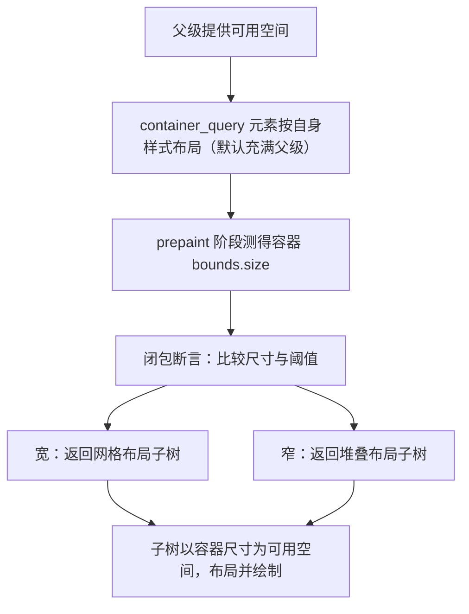

import { Meta } from '@storybook/addon-docs/blocks';

<Meta id="grid-and-container-queries" title="布局与样式/网格与容器查询" name="Docs" />

# 网格与容器查询

Flex 在一条轴上排子项，遇到"行列要同时约束"的二维规则布局就得层层嵌套。`grid` 把行列一次说清：声明几条轨道，子项按占位或网格线落进格子。容器查询解决的是另一个问题——同一个组件放进宽区域用网格、放进窄区域自动切堆叠，断点跟着**容器**被分配的实际尺寸走，而不是跟着窗口走。两者经常配合出现：宽时网格、窄时堆叠，正是官方 `grid_layout` 示例演示的完整行为。

版本口径先说清，本课内容分两截：

- **网格一族方法**（`grid_cols`、`col_span`、`col_start` 等）在发布版 gpui 0.2.2 全量可用，本课以 0.2.2 源码及其自带的 `grid_layout` 示例核对。
- **`container_query` 目前只在 main 分支**，docs.rs 的 0.2.2 文档里查无此 API。容器查询部分按 main 分支源码讲解并逐点标注，与发布版的差异和替代做法见正文。

| 成员 | 作用 | 可用版本 |
| --- | --- | --- |
| `grid()` | 把 display 设为网格 | 0.2.2 |
| `grid_cols(u16)` / `grid_rows(u16)` | 声明 n 条等分列 / 行轨道 | 0.2.2 |
| `col_span(u16)` / `row_span(u16)` | 子项横跨 n 列 / n 行 | 0.2.2 |
| `col_span_full()` / `row_span_full()` | 跨全部列 / 全部行 | 0.2.2 |
| `col_start(i16)` / `col_end(i16)` | 按网格线定位子项列起止 | 0.2.2 |
| `row_start(i16)` / `row_end(i16)` | 按网格线定位子项行起止 | 0.2.2 |
| `col_start_auto()` 等 4 个 `*_auto` | 对应起止恢复自动放置 | 0.2.2 |
| `grid_cols_min_content(u16)` 等 4 个变体 | 轨道最小尺寸改用 min-content / max-content | 仅 main |
| `container_query(闭包)` | 先测容器尺寸，再由闭包返回子树 | 仅 main |

## 网格布局

网格布局 = 三个声明：`grid()` 打开网格显示，`grid_cols(n)` 和 `grid_rows(m)` 声明轨道。0.2.2 中 `grid_cols(5)` 映射到 Taffy 的 `repeat(5, minmax(0, 1fr))`——5 条**等分**轨道，每条最小 0、按剩余空间均分；`gap_*` 同时充当行列轨道间距。轨道声明只在 `grid()` 下生效。子项默认**自动放置**：按声明顺序、行优先扫描，落进第一个能容纳自己的空位。

官方 `grid_layout` 示例（0.2.2 自带版）就是这套声明的完整示范，圣杯布局五个区块没有写任何行列号：

```rust
// 官方 grid_layout 示例（0.2.2 自带版）核心片段，block 为构造色块的局部闭包
// 5x5 等分网格：五个子块只声明"跨几格"，具体落位交给自动放置
div()
    .grid()
    .grid_cols(5) // 5 条等宽列轨道：repeat(5, minmax(0, 1fr))
    .grid_rows(5) // 5 条等高行轨道
    .gap_1()      // gap 同时作用于行、列轨道间距
    .child(block(gpui::white()).row_span(1).col_span_full().child("Header"))
    .child(block(gpui::red()).col_span(1).child("Table of contents"))
    .child(block(gpui::green()).col_span(3).row_span(3).child("Content"))
    .child(block(gpui::blue()).col_span(1).row_span(3).child("AD :("))
    .child(block(gpui::black()).row_span(1).col_span_full().child("Footer"))
```

可观察行为：示例开一个 500x500 窗口，Header、Footer 各占一整行（第 1 行、第 5 行），目录占第 2 行第 1 列，正文占第 2~4 行的第 2~4 列，广告占第 2~4 行的第 5 列。全程没有 `col_start` / `row_start`——自动放置按声明顺序完成了全部落位。完整可运行代码见参考资料中的 0.2.2 自带示例，入口是 `Application::new().run(...)`（见 1.1 课）。

### 占位：col_span、row_span 与自动放置

`col_span(n)` 表示"我横跨 n 条列轨道"，`row_span(n)` 同理作用于行。不写位置的子项从左上角开始、按声明顺序行优先放置；跨越项放不进当前行剩余空间时会顺延到下一个能容纳它的起点。`col_span_full()` 是"跨满"的快捷方式，源码实现为从第 1 条列线跨到最后一条列线（`GridPlacement::Line(1)..GridPlacement::Line(-1)`），所以它跨的是**当前网格的全部列**。

```rust
// 跨越与自动放置配合：声明顺序决定落位次序
div()
    .grid()
    .grid_cols(4)
    .child(a.col_span_full()) // 第 1 行：4 列全占
    .child(b.col_span(2))     // 第 2 行左半：第 1~2 列
    .child(c.col_span(2))     // 紧接着：第 3~4 列
```

绝大多数规则布局用 span 加自动放置就够；需要精确控制"从哪条线到哪条线"时才用线定位。

### 网格线定位：col_start、col_end

网格线是格与格之间的边界线，编号从 1 开始，负数从末尾反向编号（-1 是最后一条线）。`col_start(2)` 表示从第 2 条列线开始，`col_end(5)` 表示到第 5 条列线结束——结束线**不计入**子项，所以 `col_start(2).col_end(5)` 恰好占 3 列。四个 `*_auto` 方法把对应起止恢复为自动放置。

```rust
// 线定位：表达"从哪到哪"，span 表达"跨多少"
content.col_start(2).col_end(5)  // 占第 2~4 列，共 3 列
sidebar.row_start(2).row_end(-1) // 从第 2 行一直铺到最后一行
toc.col_start_auto()             // 清除列定位，交回自动放置
```

### 内容感知轨道：grid_cols_min_content 等变体（仅 main 分支）

0.2.2 的轨道只有一个"数量"参数，列宽永远等分。main 分支把轨道升级为 `GridTemplate`（重复数加最小尺寸），新增四个方法：`grid_cols_min_content(n)` / `grid_rows_min_content(n)` 保证轨道不小于内容的 min-content 尺寸——官方注释明确说它解决 `grid_cols` 在 MinContent 约束下会缩到 0 的问题；`grid_cols_max_content(n)` / `grid_rows_max_content(n)` 则按内容最大宽度分列。发布版没有这四个方法。

```rust
// main 分支：轨道以内容最小宽度为下限，长内容列不会被压成 0 宽
div().grid().grid_cols_min_content(3)
```

## 容器查询

`container_query` 不是 `div` 的样式方法，而是一个独立元素：它先按自身样式完成布局，测出被分配的尺寸，再把尺寸交给闭包，由闭包返回真正的子树。函数签名（main 分支源码）：

```rust
// 容器查询：闭包拿到容器被分配的尺寸，返回任意 IntoElement 的子树
pub fn container_query<E>(
    render: impl 'static + FnOnce(Size<Pixels>, &mut Window, &mut App) -> E,
) -> ContainerQuery
where
    E: IntoElement,
```

一帧内的完整流程：



官方 `grid_layout` 示例（main 分支版）把上一节的圣杯网格升级成了自适应版本，窄容器切堆叠：

```rust
// 官方 grid_layout 示例（main 分支版）核心片段
// 容器宽于 400px 用 5 列网格；窄于 400px 整体切为纵向堆叠
container_query(|container_size, _window, _cx| {
    // container_size 是本帧布局分配给容器的实际尺寸
    let container = div().gap_1().bg(rgb(0x505050)).shadow_lg().size_full();

    if container_size.width < px(400.) {
        // 窄布局：纵向堆叠，正文用 flex_1 吃掉剩余高度
        container
            .flex()
            .flex_col()
            .child(header.h_12().flex_none())
            .child(table_of_contents.h_20().flex_none())
            .child(content.flex_1())
            .child(ad.h_20().flex_none())
            .child(footer.h_12().flex_none())
    } else {
        // 宽布局：5x5 网格的圣杯布局
        container
            .grid()
            .grid_cols(5)
            .grid_rows(5)
            .child(header.row_span(1).col_span_full())
            .child(table_of_contents.col_span(1).h_56())
            .child(content.col_span(3).row_span(3))
            .child(ad.col_span(1).row_span(3))
            .child(footer.row_span(1).col_span_full())
    }
})
```

可观察行为：示例窗口初始 500x500，显示五列圣杯网格；把窗口宽度拖到 400px 以下，五个区块瞬间切换为从上到下的纵向堆叠（Header、目录、正文、广告、Footer），再拉宽又切回网格。Header 的文字里实时显示 `container_size.width`，拖动时数值随宽度连续变化。全程没有监听任何窗口事件——切换完全由容器本帧被分配的宽度驱动。

注意版本：该示例来自 main 分支，入口是 `gpui_platform::application()`；发布版 0.2.2 没有 `container_query`，这段代码在 0.2.2 编译不过，发布版下的等价思路见下面"与窗口尺寸响应的区别"。

### 断言语法与触发时机

断言就是普通 Rust 比较：闭包第一个参数是 `Size<Pixels>`，最常见的是拿宽度跟 `px(400.)` 这类阈值比较，也可以比高度或组合多个条件，返回值是任意的 `IntoElement`。

触发时机与四条边界，都来自源码行为：

- **每帧 prepaint 执行一次。** 窗口每绘制一帧都重建元素树、重跑布局，闭包在该帧的 prepaint 阶段执行，拿到的是本帧布局分配给容器的尺寸。窗口缩放、分栏拖动、兄弟元素展开收起——任何改变容器尺寸的布局变化，下一帧断言就用新值重新分支。
- **内容无法反向影响容器。** 子树在容器布局完成之后才被创建，容器的尺寸只由自身样式和父级空间决定，因此不存在"内容变大、容器变大、再触发断言"的循环。
- **默认充满父级。** `container_query` 的初始样式就是宽高各 100%（等价 `size_full`），它实现了 `Styled`，可以用 `.w()`、`.flex_1()` 等方法改尺寸。
- **子树以容器为基准。** 闭包返回的子树以容器尺寸作为确定的可用空间布局，子树里的 `size_full()`、百分比都相对容器解析——示例中 `container` 的 `.size_full()` 就是铺满容器。

### 与窗口尺寸响应的区别

窗口级响应不需要新 API：在 `render` 里读 `window.viewport_size()`（0.2.2 即有），窗口缩放触发重绘时自然拿到新内容区尺寸，按它分支即可。容器级响应测的是**这个元素自己被分配的盒子**，两者的差别在三个场景里最明显：

| 场景 | 读 `viewport_size()` | `container_query` |
| --- | --- | --- |
| 组件被放进侧栏、分栏、弹窗 | 窗口没变、容器变窄，断言失灵 | 正确按容器宽度分支 |
| 同一窗口多个组件各自切换布局 | 要手工把窗口尺寸传进每个组件 | 各自断言，互不干扰 |
| 触发源 | 只有窗口 resize | 任何影响容器尺寸的布局变化 |

发布版现实：0.2.2 没有 `container_query`，`viewport_size` 是当前唯一开箱即用的响应手段；要写容器级断言需跟进 main 分支。反过来，容器查询也覆盖不了窗口级需求——它拿不到窗口尺寸，边界语义正好互补。

## 最佳实践

- **按维度选布局工具：** 一维排列用 flex（见 2.1 课）；行列要同时约束、区块间有跨行跨列关系时用网格；布局本身要随可用宽度换形态时，把两套布局都写好，交给容器查询切换。
- **断点写在组件内部，跟容器走：** 断言放进组件自己的 `container_query`，组件放进侧栏、分栏、弹窗都自动适配；窗口断点只对根视图级别的整体切换有意义。
- **span 优先，线定位兜底：** 规则布局用 `col_span` / `row_span` 加自动放置，让框架排格子；`col_start` / `col_end` 留给必须精确对齐线位的不规则布局，避免手工维护一串行列号。

## 常见问题

- 发布版编译报错，找不到 `container_query` 或 `ContainerQuery`
  这是 main 分支 API，0.2.2 尚未包含（docs.rs 0.2.2 上无此函数）。要继续用发布版，就在 `render` 里读 `window.viewport_size()` 按窗口尺寸分支；要容器级断言，需切换到 main 分支版本。
- 等分网格里长内容的列被压得接近 0 宽
  `grid_cols(n)` 的轨道是 `repeat(n, minmax(0, 1fr))`：每条轨道最小 0、只按剩余空间均分，内容宽度不参与分轨。需要内容参与分轨时，用 main 分支的 `grid_cols_min_content` / `grid_cols_max_content`，或改用 flex 让内容自然撑开。
- 担心容器查询"内容变大、容器跟着变大、再触发断言"死循环
  不会。闭包返回的子树在容器布局完成之后才创建，无法反向影响容器尺寸；容器尺寸只由自身样式与父级空间决定。代价是容器高度不会为内容自动撑高，需要内容决定高度时不要把容器写成固定高度再往里塞超长内容。

## 总结回顾

摘要：

网格用 `grid()` 加 `grid_cols` / `grid_rows` 声明等分轨道，子项靠 `col_span` / `row_span` 占位、靠 `col_start` / `col_end` 线定位，默认自动放置按声明顺序落格；官方圣杯布局示例中五个区块零行列号就完成了 5x5 落位。容器查询 `container_query` 是独立元素：先按自身样式布局并测出被分配的尺寸，再在每帧的 prepaint 阶段执行闭包做断言，由闭包返回宽布局或窄布局的子树，断点因此跟着容器走而不是跟着窗口走。版本上，网格一族在发布版 0.2.2 全量可用；`container_query` 与内容感知轨道变体目前仅存在于 main 分支，发布版的窗口级响应靠 `window.viewport_size()`。

一句话：

> 网格把二维规则布局一次声明清楚，容器查询让组件按自己被分配的宽度切换布局——断点跟着容器走，而不是跟着窗口走。

知识要点：

- 什么时候选 `grid()` 而不是 flex？
- `grid_cols(5)` 生成什么样的轨道？子项不写位置时怎么落格？
- `col_span` / `col_start` 各适合什么场景？`col_span_full()` 等价于什么？
- `container_query` 的闭包在什么时机执行、拿到什么值、返回什么？
- 容器级断言与读 `window.viewport_size()` 的窗口级响应差别在哪？
- 本课哪些成员在发布版 0.2.2 里还没有？

## 参考资料

- [官方示例 grid_layout.rs（main 分支，容器查询版圣杯布局）](https://raw.githubusercontent.com/zed-industries/zed/main/crates/gpui/examples/grid_layout.rs)
- [官方示例 grid_layout.rs（gpui 0.2.2 发布版自带，纯网格）](https://docs.rs/crate/gpui/0.2.2/source/examples/grid_layout.rs)
- [container_query.rs 源码（main 分支）](https://raw.githubusercontent.com/zed-industries/zed/main/crates/gpui/src/elements/container_query.rs)
- [styled.rs 源码（main 分支，网格方法定义）](https://raw.githubusercontent.com/zed-industries/zed/main/crates/gpui/src/styled.rs)
- [docs.rs：gpui 0.2.2 Styled trait](https://docs.rs/gpui/0.2.2/gpui/trait.Styled.html)
