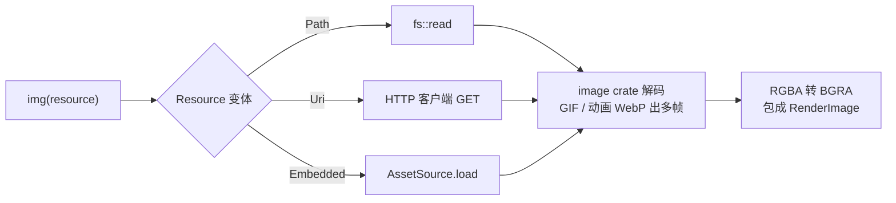

import { Meta } from '@storybook/addon-docs/blocks';

<Meta id="images-and-assets" title="实战能力/图片与资源" name="Docs" />

# 图片与资源

GPUI 显示一张图片分三层：资产从哪来——`AssetSource` 是应用级资源清单，`Resource` 描述一张图的三种位置（网络 URI、文件路径、嵌入资产）；图片怎么进元素树——`img()` 元素消费 `ImageSource`，异步加载、自动缓存、GIF 与动画 WebP 自动逐帧播放；图标怎么画——`svg()` 元素把 SVG 当单色模板，颜色跟随 `text_color()`。本课示例代码与 API 签名核对自 crates.io 发布版 gpui 0.2.2（与 docs.rs 一致），官方示例与机制源码参照 main 分支：main 已把入口改为 `gpui_platform` 的 `application()`（未发布到 crates.io），`ImageCacheItem` 与 `Svg` 另有少量 API 演进，正文按"仅 main"口径标注，入口口径见 1.1 课。

图片与资产 API 家族速查：

| 家族成员 | 入口 | 职责 | 回查要点 |
| --- | --- | --- | --- |
| `AssetSource` | `Application::new().with_assets(...)` | 应用资源清单：资产名到字节 | `load` / `list` 两个方法；默认 `()` 永远返回空 |
| `Resource` | `Uri` / `Path` / `Embedded` | 图片位置的统一描述 | 字符串自动判 URI 或资产名，判定规则见下文 |
| `ImageSource` | `img(source)` 的参数 | 图片元素的内容来源 | 四变体：`Resource`、`Render`、`Image`、`Custom` |
| `img` / `Img` | `img(...)` | 位图元素（含动图） | 默认 `object_fit` 是 Contain；异步状态与动图要 `.id()` |
| `svg` / `Svg` | `svg().path(...)` | 单色矢量图标 | 不设 `text_color()` 就完全不绘制 |
| `Asset` / `AssetLogger` | `trait Asset` | 异步资产加载协议 | 缓存键是「类型 + source 哈希」 |
| `ImageAssetLoader` | `gpui::ImageAssetLoader` | `img` 的默认加载器 | 解码主流位图格式与 SVG 成 `RenderImage` |
| `RenderImage` / `Image` | `Arc<RenderImage>` / `Arc<Image>` | 解码后的帧 / 带格式的原始字节 | 多帧 `RenderImage` 即动图 |
| `ImageCache` 家族 | `image_cache()` / `retain_all(id)` | 缓存与内存管理 | 大图列表配 LRU，释放靠 `cx.drop_image` |

## 资产系统：AssetSource 与 Resource

`AssetSource` 回答"应用的资源从哪读"：给定一个资产名（如 `icons/arrow.svg`），返回字节。`svg()` 元素与 `Resource::Embedded` 的图片都从它取数据；直接读文件与走网络的图片不经过它。注册入口就是 1.1 课启动代码上多加一步：

```rust
use gpui::{Application, AssetSource, SharedString};
use std::borrow::Cow;

struct Assets;

impl AssetSource for Assets {
    // 返回 None 表示资产不存在；读取失败走 Err
    fn load(&self, path: &str) -> anyhow::Result<Option<Cow<'static, [u8]>>> {
        std::fs::read(path).map(Some).map_err(Into::into)
    }

    // 枚举某路径下的资产，供批量加载（如字体）使用
    fn list(&self, path: &str) -> anyhow::Result<Vec<SharedString>> {
        Ok(std::fs::read_dir(path)?
            .filter_map(|entry| {
                entry.ok().map(|e| SharedString::from(e.path().to_string_lossy().into_owned()))
            })
            .collect())
    }
}

fn main() {
    Application::new()
        .with_assets(Assets) // 注册资源清单
        .run(|cx: &mut App| {
            // ...
        });
}
```

trait 签名核对自 0.2.2 的 `src/assets.rs`：`load` 返回 `Option<Cow<'static, [u8]>>`，借用的静态字节（`include_bytes!`）与堆字节（`Cow::Owned`）都能放；不调用 `with_assets` 时默认实现是单元类型 `()`，`load` 永远 `None`。

生产环境两种实现取向：

```rust
// 方式一：开发期直接读仓库目录（官方 svg.rs、image.rs 示例的模式）
struct Assets {
    base: PathBuf, // 例如 CARGO_MANIFEST_DIR 下的 examples 目录
}

impl AssetSource for Assets {
    fn load(&self, path: &str) -> anyhow::Result<Option<Cow<'static, [u8]>>> {
        fs::read(self.base.join(path))
            .map(|data| Some(Cow::Owned(data)))
            .map_err(|e| e.into())
    }
    // list 同理读目录
    fn list(&self, _path: &str) -> anyhow::Result<Vec<SharedString>> {
        Ok(vec![])
    }
}

// 方式二：编译期打包，字节直接进二进制
struct EmbeddedAssets;

impl AssetSource for EmbeddedAssets {
    fn load(&self, path: &str) -> anyhow::Result<Option<Cow<'static, [u8]>>> {
        match path {
            "icons/arrow_circle.svg" => Ok(Some(Cow::Borrowed(include_bytes!(
                "../assets/icons/arrow_circle.svg"
            )))),
            _ => Ok(None),
        }
    }
    fn list(&self, _path: &str) -> anyhow::Result<Vec<SharedString>> {
        Ok(vec!["icons/arrow_circle.svg".into()])
    }
}
```

资产多了之后，方式二通常交给构建脚本批量生成（Zed 自己的 `assets` crate 用 `util::fs_embed!` 宏：release 构建把资产嵌进二进制，开发构建直接读检出目录，改资源不用重编译）。

### Resource：图片位置的三种描述

`Resource` 是 img 加载体系里的"位置"统一描述，三个变体对应三条取数路径：

| 变体 | 含义 | 取数方式 | 是否经过 `AssetSource` |
| --- | --- | --- | --- |
| `Resource::Uri(SharedUri)` | http/https 地址 | `cx.http_client()` 发 GET | 否 |
| `Resource::Path(Arc<Path>)` | 文件系统路径 | 直接 `fs::read` | 否 |
| `Resource::Embedded(SharedString)` | 嵌入资产名 | `cx.asset_source().load()` | 是 |

任何 `impl Into<ImageSource>` 的来源最终都归到这三个变体或内存数据（见下节）。最容易踩的是字符串的隐式判定规则：`img()` 收到 `&str` / `String` / `SharedString` 时，先尝试按 URI 解析，解析成功走 `Uri`，否则一律当**资产名**走 `Embedded`——字符串永远不会被当成文件路径：

| 你写的值 | 实际变成 | 从哪读 |
| --- | --- | --- |
| `img("https://picsum.photos/400")` | `Resource::Uri` | HTTP 客户端 |
| `img("image/color.svg")` | `Resource::Embedded` | `AssetSource` |
| `img(PathBuf::from("assets/logo.png"))` | `Resource::Path` | `fs::read` |
| `img(SharedUri::from("https://..."))` | `Resource::Uri` | HTTP 客户端 |

## img：图片元素

`img` 是消费图片内容的元素，签名就一行（0.2.2 docs.rs）：

```rust
pub fn img(source: impl Into<ImageSource>) -> Img
```

`Img` 实现 `Styled`、`InteractiveElement` 与 `StatefulInteractiveElement`：`.size_20()`、`.rounded_md()`、`.hover(...)` 这些样式照常用；`.on_click` 等状态交互要先 `.id("...")` 转成 `Stateful`。

### 来源：`Into<ImageSource>`

`ImageSource` 四个变体覆盖四类内容，`img()` 靠 `Into` 转换隐式收纳：

| 变体 | 传入什么 | 什么时候用 |
| --- | --- | --- |
| `Resource(Resource)` | 字符串、`SharedUri`、`PathBuf` 等 | 常规来源，走异步加载与缓存 |
| `Render(Arc<RenderImage>)` | 已解码的帧数据 | 自己解码/程序生成的图片，同步直出 |
| `Image(Arc<Image>)` | 带格式的原始字节 | 内存里现成的 PNG/JPEG 字节（如剪贴板、内嵌数据） |
| `Custom(闭包)` | `Fn(&mut Window, &mut App) -> Option<Result<Arc<RenderImage>, ImageCacheError>>` | 参数化加载、组合自定义 `Asset` |

关键变体一次看全：

```rust
// 1. 网络图：走 HTTP 客户端异步加载（需先装客户端，见下文）
img("https://picsum.photos/800/400").h(px(180.))

// 2. 本地文件：PathBuf 触发 Resource::Path，直接读磁盘
img(manifest_dir.join("examples/image/app-icon.png")).size(px(256.0))

// 3. 嵌入资产：字符串判为非 URI 后走 AssetSource
img("image/color.svg").size(px(256.0))

// 4. 已解码数据：Arc<RenderImage> 同步直出，不再走加载器
img(arc_of_render_image).object_fit(ObjectFit::Contain)

// 5. 带格式原始字节：Arc<Image> 交给 ImageDecoder 资产管线解码
img(arc_of_image)

// 6. 自定义闭包：每帧渲染时调用，接进 use_asset 缓存（见异步加载一节）
img(move |window: &mut Window, cx: &mut App| window.use_asset::<MyAsset>(&params, cx))
```

单个元素还能用 `Img::image_cache(&Entity<I>)` 指定缓存，不改缓存时默认行为见图片缓存一节。

### 尺寸与布局

`img` 的布局由样式和解码结果共同决定，行为对齐网页 `` 的直觉：

- 图片解码成功后，GPUI 把图片的宽高比写进样式的 `aspect_ratio`；
- 宽高都没设：按图片自然尺寸（CSS 像素）显示；
- 只设一边：另一边按宽高比自动推导——官方 image.rs 示例用 `.h(px(180.))` 做 Auto Width、`.w(px(180.))` 做 Auto Height；
- 两边都设：盒子固定，图片如何填进盒子由 `object_fit` 决定；
- 容器限宽场景配 `.max_w_full()`，防止大图撑破父容器。

### object_fit 与视觉样式

图片专属样式来自 `StyledImage` trait（0.2.2 docs.rs）：

```rust
pub trait StyledImage: Sized {
    fn grayscale(self, grayscale: bool) -> Self;                              // 灰度滤镜
    fn object_fit(self, object_fit: ObjectFit) -> Self;                       // 填充方式
    fn with_fallback(self, fallback: impl Fn() -> AnyElement + 'static) -> Self;   // 加载失败的替身
    fn with_loading(self, loading: impl Fn() -> AnyElement + 'static) -> Self;     // 加载中的占位
}
```

`ObjectFit` 五个变体（默认 Contain）：

| 变体 | 行为 |
| --- | --- |
| `ObjectFit::Fill` | 拉伸填满元素 bounds，可能变形 |
| `ObjectFit::Contain` | 等比缩放到完全放进 bounds，居中（默认） |
| `ObjectFit::Cover` | 等比缩放到盖满 bounds，超出部分居中裁剪 |
| `ObjectFit::ScaleDown` | 原尺寸显示，超出 bounds 时按 Contain 缩小 |
| `ObjectFit::None` | 保持图片原始尺寸，不缩放 |

其余视觉照盒子体系来：`.rounded_lg()` 的圆角在绘制图片时同样生效（源码把 corner radii 按图片实际绘制区收敛后随 `paint_image` 提交），`.border_1()`、阴影、`overflow_hidden()` 都可用。支持的格式清单由 `Img::extensions()` 给出：avif、jpg、jpeg、png、gif、webp、tif、tiff、tga、dds、bmp、ico、hdr、exr、pbm、pam、ppm、pgm、ff、farbfeld、qoi、svg——`image` crate 认识的格式外加 svg。

### 动图：GIF 与动画 WebP

GIF 与动画 WebP 会被解码成多帧 `RenderImage`（其余格式都是单帧）。渲染时 GPUI 按当前帧的 `delay` 推进 `frame_index`，并调用 `window.request_animation_frame()` 驱动连续重绘，帧间隔完全由动图数据决定。帧推进状态存在元素状态里，所以**动图必须 `.id()` 才会播放**。最小示例（官方 gif_viewer.rs）：

```rust
impl Render for GifViewer {
    fn render(&mut self, _window: &mut Window, _cx: &mut Context<Self>) -> impl IntoElement {
        div().size_full().child(
            img(self.gif_path.clone()) // PathBuf：本地 gif 文件
                .size_full()
                .object_fit(gpui::ObjectFit::Contain)
                .id("gif"), // 没有它帧不会推进
        )
    }
}
```

## 异步加载与加载状态

`Resource` 来源的加载完全异步，管线如下：



驱动机制核对自 0.2.2 的 `window.rs` 与 `app.rs`：

- `img` 渲染时对 `Resource` 来源调用 `window.use_asset::<ImgResourceLoader>(&resource, cx)`，`ImgResourceLoader` 就是默认加载器 `AssetLogger<ImageAssetLoader>` 的别名；
- `use_asset` 的缓存键是 `(TypeId::<A>, hash(source))`——同一来源整个应用只会发起一次加载任务，后续帧直接取结果；
- 任务未完成时返回 `None`，本帧不画图（可显示 loading 占位）；任务完成后 `use_asset` 自动 notify 发起时的 view，下一帧图片自动补上——不需要手写任何"加载完成后改状态"的代码；
- `Window::get_asset` 查同一份缓存但不触发自动重绘，适合在事件回调里顺手取一下；
- 出错产生 `ImageCacheError`，变体有 `Io`（读文件）、`BadStatus`（HTTP 状态非 2xx）、`Asset`（资产不存在）、`Image`（解码失败）、`Usvg`（SVG 解析失败）等。

### with_loading 与 with_fallback

两个替身元素的时机由 `LOADING_DELAY`（0.2.2 中为 200ms）分隔：

- 开始加载后 200ms 内不显示 loading 占位——快网速下图片直接出现，不闪占位；
- 超过 200ms 仍在加载，本帧起替换为 `with_loading` 提供的元素；
- 加载返回 `Err`，替换为 `with_fallback` 提供的元素。

```rust
img("https://picsum.photos/400/200")
    .id("photo") // loading 占位依赖元素状态，必须有 id
    .size_20()
    .with_loading(|| div()
        .size_full()
        .rounded_md()
        .bg(rgb(0xE9E9E9))
        .into_any_element())
    .with_fallback(|| div()
        .size_full()
        .flex()
        .items_center()
        .justify_center()
        .child("?")
        .into_any_element())
```

### URL 加载前提：HTTP 客户端

`Application::new()` 默认装的是 `NullHttpClient`，任何请求都直接失败（错误信息 `No HttpClient available`）——这就是 `img("https://...")` 什么都不显示的原因。启动时换上真客户端：

```rust
use reqwest_client::ReqwestClient; // 官方示例使用的 HTTP 客户端 crate

fn main() {
    let http_client = ReqwestClient::user_agent("my-app").unwrap();
    Application::new()
        .with_http_client(Arc::new(http_client)) // 或运行中 cx.set_http_client(...)
        .run(|cx: &mut App| {
            // ...
        });
}
```

### 自定义 Asset：参数化加载

`Asset` trait 把"异步加载一份可缓存的数据"抽象成三个关联项（0.2.2 `src/asset_cache.rs`）：

```rust
pub trait Asset: 'static {
    type Source: Clone + Hash + Send; // 加载参数，作缓存键
    type Output: Clone + Send;        // 加载结果
    fn load(
        source: Self::Source,
        cx: &mut App,
    ) -> impl Future<Output = Self::Output> + Send + 'static;
}
```

官方 image_loading.rs 的模式：自定义参数类型当 `Source`，内部复用官方加载器取数解码，再叠加自己的行为（延迟、失败注入）：

```rust
#[derive(Copy, Clone, Hash)]
struct LoadImageParameters {
    timeout: Duration, // 人为延迟，模拟慢网络
    fail: bool,        // 人为失败，测试 fallback
}

struct LoadImageWithParameters;

impl Asset for LoadImageWithParameters {
    type Source = LoadImageParameters;
    type Output = Result<Arc<RenderImage>, ImageCacheError>;

    fn load(
        parameters: Self::Source,
        cx: &mut App,
    ) -> impl Future<Output = Self::Output> + Send + 'static {
        let timer = cx.background_executor().timer(parameters.timeout);
        // 复用官方加载器：给一个 Resource，返回解码后的 RenderImage
        let data = AssetLogger::<ImageAssetLoader>::load(
            Resource::Path(Path::new(IMAGE).to_path_buf().into()),
            cx,
        );
        async move {
            timer.await;
            if parameters.fail {
                Err(anyhow::anyhow!("Failed to load image").into())
            } else {
                data.await
            }
        }
    }
}
```

配合 `ImageSource::Custom` 闭包使用——闭包在每帧渲染时被调用，内部的 `use_asset` 把它接进同一套缓存与自动重绘：

```rust
let params = LoadImageParameters { timeout: Duration::from_secs(2), fail: false };

img(move |window: &mut Window, cx: &mut App| {
    window.use_asset::<LoadImageWithParameters>(&params, cx)
})
.id("image-2")
.with_fallback(|| fallback_element().into_any_element())
.with_loading(|| loading_element().into_any_element())
```

要强制重载同一份参数的图片，清掉缓存再 notify 即可：`cx.remove_asset::<LoadImageWithParameters>(&params)`（官方示例把它挂在 `on_click` 里）。

## 图片缓存

图片缓存的默认与进阶是三层递进关系：

1. **全局 asset 缓存（默认）**：`Resource` 来源走 `use_asset`，按「加载器类型 + 来源哈希」缓存任务，任务与结果常驻、只进不出，直到 `cx.remove_asset`；
2. **`image_cache(provider)` 元素**：包裹一片子树，其中所有 `img` 的 `Resource` 加载改走同一个 `ImageCache`，批量管理；
3. **`Img::image_cache(&Entity<I>)`**：给单个元素指定缓存。

缓存协议是 `ImageCache` trait（0.2.2 docs.rs）：

```rust
pub trait ImageCache: 'static {
    // 返回 None 表示仍在加载，Some 是结果（含 Err）
    fn load(
        &mut self,
        resource: &Resource,
        window: &mut Window,
        cx: &mut App,
    ) -> Option<Result<Arc<RenderImage>, ImageCacheError>>;
}

pub trait ImageCacheProvider: 'static {
    fn provide(&mut self, window: &mut Window, cx: &mut App) -> AnyImageCache;
}
// Entity<T: ImageCache> 自动实现 ImageCacheProvider，可直接传给 image_cache()
```

### RetainAllImageCache 与 retain_all

GPUI 内置的全保留缓存是 `RetainAllImageCache`：

- `RetainAllImageCache::new(cx) -> Entity<Self>`：`load` 自动发起后台加载并缓存；`clear` 与 `remove` 会顺手 `cx.drop_image` 释放纹理；entity 释放时也自动清理；
- `image_cache(retain_all("gallery"))`：`retain_all(id)` 返回一个 provider，用元素状态按 id 存一份 RetainAll，适合内联包裹图片列表。

两种接法（手动管理取自官方 image_gallery.rs，它在"自动管理"一栏换成了自己的 LRU provider）：

```rust
struct ImageGallery {
    image_cache: Entity<RetainAllImageCache>, // 手动管理的一份缓存
    /* ... */
}

// 手动管理：子树的图片都走这份缓存，刷新按钮里 clear 强制重新加载
div()
    .image_cache(self.image_cache.clone())
    .child(/* 图片列表 */)

// 自动管理：内联一份按 id 存活的 RetainAll 缓存（retain_all 是 gpui 内置 provider）
image_cache(retain_all("gallery")).child(/* 图片列表 */)
```

### 自定义 LRU 与内存释放

全保留缓存撑不住长列表时，照官方 image_gallery.rs 的 `SimpleLruCache` 实现自己的 `ImageCache`。核心骨架（0.2.2 写法）：

```rust
use gpui::{hash, AssetLogger, ImageAssetLoader, ImageCache, ImageCacheItem};

struct LruImageCache {
    max_items: usize,
    usages: Vec<u64>,                    // 最近使用序，头部最新
    cache: HashMap<u64, ImageCacheItem>, // hash(resource) -> 加载项
}

impl ImageCache for LruImageCache {
    fn load(
        &mut self,
        resource: &Resource,
        window: &mut Window,
        cx: &mut App,
    ) -> Option<Result<Arc<RenderImage>, ImageCacheError>> {
        let hash = hash(resource);

        // 命中：移到最新，get() 顺带把 Loading 收敛成 Loaded
        if let Some(item) = self.cache.get_mut(&hash) {
            /* 更新 usages 顺序（略） */
            return item.get();
        }

        // 已满：淘汰最旧一项，从窗口的精灵图集里释放纹理
        if self.usages.len() == self.max_items {
            let oldest = self.usages.pop().unwrap();
            if let Some(mut item) = self.cache.remove(&oldest)
                && let Some(Ok(image)) = item.get()
            {
                cx.drop_image(image, Some(window));
            }
        }

        // 未命中：发起后台加载，挂起共享任务
        let fut = AssetLogger::<ImageAssetLoader>::load(resource.clone(), cx);
        let task = cx.background_executor().spawn(fut).shared();
        self.cache.insert(hash, ImageCacheItem::Loading(task.clone()));
        self.usages.insert(0, hash);

        // 关键：加载完成后主动 notify，界面才知道要重画
        let entity = window.current_view();
        window
            .spawn(cx, async move |cx| {
                _ = task.await;
                cx.on_next_frame(move |_, cx| cx.notify(entity));
            })
            .detach();

        None // 本帧先不画
    }
}
```

`ImageCacheItem` 在 0.2.2 是两变体枚举：

```rust
pub enum ImageCacheItem {
    Loading(ImageLoadingTask), // Shared<Task<Result<Arc<RenderImage>, ImageCacheError>>>
    Loaded(Result<Arc<RenderImage>, ImageCacheError>),
}
```

仅 main：main 分支已把 `ImageCacheItem` 改成结构体（`ImageCacheItem::new(source, cx)` 构造、`get(&self)` 取值、`use_image(&self, window)` 取值并登记重绘通知），上面的枚举写法升级后不能照抄，以当时源码为准。

内存释放两条规则：自定义缓存驱逐图片必须 `cx.drop_image(image, Some(window))`——它把纹理从所有窗口的精灵图集移除，漏掉这步纹理常驻显存；全局 asset 缓存的失效用 `cx.remove_asset::<ImgResourceLoader>(&resource.into())`。

## svg：矢量图标

`svg()` 是图标专用元素，三个必备件：资产路径、尺寸、颜色：

```rust
use gpui::{radians, rgb, size, svg, Transformation};

svg()
    .path("svg/dragon.svg")    // 资产名，走 AssetSource
    .size_8()                  // 布局尺寸即渲染尺寸
    .text_color(rgb(0xff0000)) // 模板色
```

着色机制核对自 0.2.2 的 `elements/svg.rs`：绘制条件是 `path` 与样式的 `text.color` **同时存在**——

- 忘记 `.text_color(...)` 时元素完全不绘制、也不报错，"图标一片空白"多半是它；
- 着色的实现是把 SVG 栅格化成 alpha 模板再用 text color 填充，多色 SVG 会被拍成单色——它面向"随主题换色"的图标体系，不面向彩色插图；
- `Svg` 实现 `Styled` 与 `InteractiveElement`：尺寸来自布局样式，hover、点击、焦点等交互照常；`path` 加载同样走 `AssetSource`，资产不存在时静默不画。

变换用 `with_transformation(Transformation)`，只影响渲染、不影响布局与命中区域：

```rust
svg()
    .path("svg/dragon.svg")
    .size_8()
    .text_color(rgb(0x00ff00))
    .with_transformation(
        Transformation::rotate(radians(0.5)) // 旋转，另有 ::scale(Size<f32>) 与 ::translate(Point<Pixels>)
            .with_scaling(size(1.2, 1.2)),
    )
```

### img 也能加载 SVG，但语义不同

`ImageAssetLoader` 遇到非位图字节会交给 SVG 渲染器按位图处理（以 2 倍 `SMOOTH_SVG_SCALE_FACTOR` 超采样，`scale_factor` 记进 `RenderImage`，显示仍按 CSS 像素），保留 SVG 原始颜色。两条路怎么选：

| | `svg()` 元素 | `img("icon.svg")` |
| --- | --- | --- |
| 来源 | 资产名（`AssetSource`） | 同 `img` 全家：URI / 文件 / 资产 |
| 颜色 | 单色模板，随 `text_color()` 变 | 保留 SVG 原色，焊死在位图里 |
| 栅格化 | 按元素 bounds 尺寸出 alpha 模板 | 按 SVG 原始尺寸 2 倍超采样出位图 |
| 适用 | 主题图标、hover 换色的交互图标 | 插图、logo、一次性彩色图形 |

仅 main：`Svg` 新增 `.data(&[u8])`（直接喂 SVG 字节，按内容哈希生成缓存键）与 `.external_path()`（读文件系统路径，经 asset 系统异步加载），0.2.2 只有 `.path()` 资产名一种来源。

## 最佳实践

- **发布前把资产嵌进二进制。** 读目录实现适合开发期改资源即时生效；正式分发用 `include_bytes!` 或构建脚本嵌入（Zed 的 `util::fs_embed!` 是参照系：release 嵌入、dev 读目录），否则用户机器上没有你的 `assets/` 目录，`svg()` 与嵌入图全部静默消失。
- **图片列表必须配显式缓存。** 全局 asset 缓存与 `RetainAllImageCache` 都只进不出，长列表滚一路缓存一路；学 image_gallery.rs 换 LRU，并在驱逐时 `cx.drop_image` 才真正释放显存。
- **图标一律 `svg()`，不走 `img()`。** `svg()` 的单色模板随 `text_color()`（主题色、hover 态）换色；`img()` 里的 SVG 是位图，颜色与尺寸都固定。
- **传给 `img` 的值先想清语义。** 字符串只会变成 `Uri` 或 `Embedded` 两者之一——`img("./logo.png")` 里的 `./logo.png` 是资产名不是文件路径；读本地文件必须传 `PathBuf` / `&Path`。

## 常见问题

- `img("https://...")` 不显示，日志出现 `No HttpClient available`
  默认 HTTP 客户端是 `NullHttpClient`，所有请求直接失败。处理：启动时 `Application::new().with_http_client(...)` 或 `cx.set_http_client(...)` 装上真客户端（官方示例用 `reqwest_client::ReqwestClient`）。
- `svg()` 图标一片空白，也没有任何报错
  绘制要求 `path` 与 `text_color` 同时存在。处理：补上 `.text_color(...)`；仍空白再核对资产名能否被 `AssetSource::load` 取到（取不到同样静默不画）。
- `img("./logo.png")` 读不到本地文件
  字符串来源永远不会按文件路径处理：能解析成 URI 走网络，否则按资产名走 `AssetSource`。处理：本地文件改传 `PathBuf` 或 `&Path`，让它变成 `Resource::Path` 直接读磁盘。
- 图片列表滚动越久内存越高
  默认全局 asset 缓存与 `RetainAllImageCache` 都不淘汰。处理：滚动列表挂 LRU 自定义缓存，驱逐项必须 `cx.drop_image(image, Some(window))`，否则纹理仍驻留精灵图集。
- 点击"换一批"图片不更新
  同一来源的加载结果被全局 asset 缓存复用，`hash` 相同就不会重新加载。处理：回调里先 `cx.remove_asset::<ImgResourceLoader>(&resource.into())`（自定义 Asset 则 `remove_asset::<YourAsset>(&params)`），再 `cx.notify()`；走显式缓存的就调缓存的 `clear` / `remove`。
- loading 占位闪一下才出图，或怎么都不出现
  `LOADING_DELAY` 为 200ms：200ms 内的加载刻意不显示占位，属正常防闪烁设计；超过 200ms 才出现 `with_loading` 元素，且该占位依赖元素状态，需要 `.id(...)`。想稳定看到 loading 与 fallback，按官方 image_loading.rs 用自定义 Asset 注入延迟或失败。

## 总结回顾

摘要：

GPUI 的图片与资源体系围绕三层展开。`AssetSource` 是应用级资源清单（`load` / `list` 两个方法，`with_assets` 注册，默认 `()` 为空），`Resource` 用 `Uri` / `Path` / `Embedded` 三变体描述图片位置——字符串来源按 URI 优先判定，判不上就当资产名，文件路径必须传 `PathBuf` / `&Path`。`img()` 消费 `Into<ImageSource>` 的四类来源（Resource、`RenderImage`、`Image`、自定义闭包），布局自动携带图片宽高比、单边尺寸自动推导，`StyledImage` 提供 `object_fit`（默认 Contain）、`grayscale`、`with_loading` 与 `with_fallback`；GIF 与动画 WebP 解码为多帧自动逐帧播放，但帧推进与 loading 占位都依赖 `.id()` 建立的元素状态。异步加载由 `Asset` trait 与 `use_asset` 驱动：按「类型 + 来源哈希」缓存任务，完成后自动 notify 重绘，URL 来源需要先装 HTTP 客户端。缓存默认全局只进不出，进阶用 `image_cache()` 元素、`RetainAllImageCache` / `retain_all(id)` 或自定义 LRU，释放纹理靠 `cx.drop_image`，清缓存靠 `cx.remove_asset`。`svg()` 是单色图标元素：资产名走 `AssetSource`，着色取自 `text_color()`——不设就不绘制——变换用 `with_transformation`；要保留彩色就用 `img()` 加载 SVG（2 倍超采样位图）。

一句话：

> 图片先分清三种位置（URI、文件、资产名），`img()` 管异步位图、`svg()` 管单色图标，缓存只进不出——显存释放必须自己调 `cx.drop_image`。

知识要点：

- `AssetSource` 的两个方法、`with_assets` 注册方式，以及读目录与 `include_bytes!` 嵌入两种实现取向
- `Resource` 三变体各自的取数路径，字符串 / `PathBuf` / `SharedUri` 的隐式判定规则
- `ImageSource` 四变体分别对应什么输入，`Custom` 闭包的签名与用途
- `img` 的布局行为（宽高比、单边自动推导）与 `ObjectFit` 五变体、默认值
- 动图播放与 loading 占位为什么需要 `.id()`，`LOADING_DELAY` 的防闪烁时机
- `use_asset` 的缓存键与自动重绘机制，`get_asset` 与它的差别
- 默认 HTTP 客户端为什么让 URL 图片失败，如何装上真客户端
- 自定义 `Asset` 的三要素与官方参数化加载模式，`remove_asset` 如何强制重载
- `ImageCache` / `ImageCacheProvider` 协议、`RetainAllImageCache` 与 `retain_all(id)` 的用法、LRU 驱逐时 `cx.drop_image` 的必要性
- `svg()` 的着色与不绘制条件、`with_transformation` 的作用范围，以及它与 `img()` 加载 SVG 的取舍

## 参考资料

- [img - docs.rs/gpui 0.2.2](https://docs.rs/gpui/0.2.2/gpui/fn.img.html)
- [Img 与 StyledImage - docs.rs/gpui 0.2.2](https://docs.rs/gpui/0.2.2/gpui/struct.Img.html)
- [ImageSource - docs.rs/gpui 0.2.2](https://docs.rs/gpui/0.2.2/gpui/enum.ImageSource.html)
- [AssetSource - docs.rs/gpui 0.2.2](https://docs.rs/gpui/0.2.2/gpui/trait.AssetSource.html)
- [Resource - docs.rs/gpui 0.2.2](https://docs.rs/gpui/0.2.2/gpui/enum.Resource.html)
- [Asset - docs.rs/gpui 0.2.2](https://docs.rs/gpui/0.2.2/gpui/trait.Asset.html)
- [ImageAssetLoader - docs.rs/gpui 0.2.2](https://docs.rs/gpui/0.2.2/gpui/enum.ImageAssetLoader.html)
- [RenderImage - docs.rs/gpui 0.2.2](https://docs.rs/gpui/0.2.2/gpui/struct.RenderImage.html)
- [Image - docs.rs/gpui 0.2.2](https://docs.rs/gpui/0.2.2/gpui/struct.Image.html)
- [ObjectFit - docs.rs/gpui 0.2.2](https://docs.rs/gpui/0.2.2/gpui/enum.ObjectFit.html)
- [svg - docs.rs/gpui 0.2.2](https://docs.rs/gpui/0.2.2/gpui/fn.svg.html)
- [Svg - docs.rs/gpui 0.2.2](https://docs.rs/gpui/0.2.2/gpui/struct.Svg.html)
- [ImageCache 与 ImageCacheProvider - docs.rs/gpui 0.2.2](https://docs.rs/gpui/0.2.2/gpui/trait.ImageCache.html)
- [ImageCacheItem - docs.rs/gpui 0.2.2](https://docs.rs/gpui/0.2.2/gpui/enum.ImageCacheItem.html)
- [RetainAllImageCache - docs.rs/gpui 0.2.2](https://docs.rs/gpui/0.2.2/gpui/struct.RetainAllImageCache.html)
- [ImageCacheError - docs.rs/gpui 0.2.2](https://docs.rs/gpui/0.2.2/gpui/enum.ImageCacheError.html)
- [官方示例 image_loading.rs（use_asset、with_loading / with_fallback、自定义 Asset）](https://github.com/zed-industries/zed/blob/main/crates/gpui/examples/image_loading.rs)
- [官方示例 image_gallery.rs（手动与自动图片缓存、LRU 实现范式）](https://github.com/zed-industries/zed/blob/main/crates/gpui/examples/image_gallery.rs)
- [官方示例 gif_viewer.rs（本地 GIF 与 object_fit）](https://github.com/zed-industries/zed/blob/main/crates/gpui/examples/gif_viewer.rs)
- [官方示例 image/image.rs（本地文件、URL、资产三种来源与自动宽高）](https://github.com/zed-industries/zed/blob/main/crates/gpui/examples/image/image.rs)
- [官方示例 svg/svg.rs（svg 元素与 text_color 着色）](https://github.com/zed-industries/zed/blob/main/crates/gpui/examples/svg/svg.rs)
- [img.rs（main 分支：ImageSource、加载管线与 ImageAssetLoader 源码）](https://github.com/zed-industries/zed/blob/main/crates/gpui/src/elements/img.rs)
- [svg.rs（main 分支：着色条件与 data / external_path 新 API）](https://github.com/zed-industries/zed/blob/main/crates/gpui/src/elements/svg.rs)
- [image_cache.rs（main 分支：ImageCache 家族与 RetainAllImageCache 实现）](https://github.com/zed-industries/zed/blob/main/crates/gpui/src/elements/image_cache.rs)
- [asset_cache.rs（main 分支：Asset trait 与缓存键机制）](https://github.com/zed-industries/zed/blob/main/crates/gpui/src/asset_cache.rs)
- [assets.rs（main 分支：AssetSource 与 RenderImage 定义）](https://github.com/zed-industries/zed/blob/main/crates/gpui/src/assets.rs)
- [svg_renderer.rs（main 分支：SVG 栅格化与 SMOOTH_SVG_SCALE_FACTOR）](https://github.com/zed-industries/zed/blob/main/crates/gpui/src/svg_renderer.rs)
- [Zed assets crate（util::fs_embed! 打包资产的真实用例）](https://github.com/zed-industries/zed/blob/main/crates/assets/src/assets.rs)
