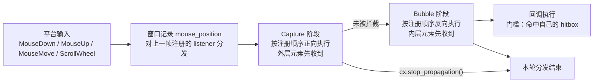

import { Meta } from '@storybook/addon-docs/blocks';

<Meta id="mouse-events" title="交互/鼠标事件" name="Docs" />

# 鼠标事件

GPUI 里没有独立的"控件点击回调"：鼠标交互都挂在 `div` 这类元素上——把 listener 交给元素，框架在每帧绘制时为它生成一块命中区（hitbox），鼠标事件到来时按 Capture → Bubble 两个阶段流经这批 listener。命中谁的 hitbox、处在哪个阶段，决定谁的回调执行。本课覆盖单击（`on_click`）、自定义按下与抬起（`on_mouse_down` / `on_mouse_up`）、悬停样式与回调（`hover` / `on_hover`）、按下态样式（`active`）、光标（`cursor`）与滚轮（`on_scroll_wheel`）。读完你能预测：一次点击落在嵌套元素上时哪一层先响应、怎么拦截它，以及"hover 变色"为什么不需要手动触发重渲染。

一次鼠标事件从平台到回调的完整路径：



鼠标事件方法家族回查表（各方法的详细语义见后文小节）：

| 方法 | 挂载位置 | 触发时机 |
| --- | --- | --- |
| `on_click(f)` | `.id()` 之后 | 按下与抬起都落在元素上；聚焦时按 `enter` / `space` |
| `on_mouse_down(button, f)` | 任意元素 | 按下且鼠标在元素上（Bubble 阶段） |
| `on_mouse_up(button, f)` | 任意元素 | 抬起且鼠标在元素上（Bubble 阶段） |
| `on_mouse_up_out(button, f)` | 任意元素 | 抬起时鼠标在元素外（Capture 阶段） |
| `on_mouse_down_out(f)` | 任意元素 | 按下时鼠标在元素外（Capture 阶段） |
| `on_any_mouse_down(f)` | 任意元素 | 任意键按下（Bubble 阶段） |
| `capture_any_mouse_down(f)` / `capture_any_mouse_up(f)` | 任意元素 | 任意键按下 / 抬起（Capture 阶段，先于内层元素） |
| `on_mouse_move(f)` | 任意元素 | 鼠标在元素上移动（Bubble 阶段） |
| `on_scroll_wheel(f)` | 任意元素 | 滚轮滚动且该元素应当处理（Bubble 阶段） |
| `hover(f)` / `group_hover(name, f)` | 任意元素 | 悬停时的样式覆盖 |
| `active(f)` | `.id()` 之后 | 按下未松开时的样式覆盖 |
| `on_hover(f)` | `.id()` 之后 | 悬停开始 / 结束，回调收到 `&bool` |
| `cursor(style)` / `cursor_pointer()` 等 | 任意元素（`Styled`） | 鼠标命中时系统光标的形状 |

以上均为 gpui 0.2.2 已发布的 API。main 分支另有 `on_aux_click`（右键 / 中键单击）、`on_mouse_pressure`（macOS 力触板重压）、`on_mouse_exit`（鼠标离开窗口）、`on_pinch`（捏合手势）等，本课在涉及处标注"仅 main"。不属于本课的近邻成员：`on_drag` / `on_drag_move` 归拖放课（3.4），`on_key_down` / `on_action` 归动作与快捷键课（3.2）。

## 事件如何分发：hitbox、Capture 与 Bubble

hitbox 是理解一切鼠标行为的钥匙。元素在绘制（paint）阶段把自己的 listener 注册到窗口，每个 listener 随身捕获本帧生成的 hitbox（元素的边界 + 遮挡行为）；父元素先于子元素注册。事件到来时窗口做一轮两阶段分发：

- **Capture 阶段**：按注册顺序正向执行——外层元素先收到。用于"内层处理之前"的全局预处理。
- **Bubble 阶段**：按注册顺序反向执行——内层元素先收到。绝大多数回调工作在这一阶段，普通方法（`on_mouse_down`、`on_mouse_move` 等）都注册在 Bubble。
- 任一回调调用 `cx.stop_propagation()` 后，本轮分发立即中断，后续 listener 不再执行。
- `on_mouse_down` / `on_mouse_up` / `on_mouse_move` 的回调只在 `hitbox.is_hovered(window)` 为真时执行：鼠标命中该元素，且没有被更前方的遮挡元素挡住（遮挡语义见常见问题）。

所以"悬停"语义贯穿所有鼠标方法——不是只有 `hover` 才看命中，任何鼠标回调的触发都以命中自己的 hitbox 为前提。`cx.listener` 包装后的回调签名是 `Fn(&E, &mut Window, &mut Context<Self>)`，与 1.3 课一致，本课不再展开。

Capture 阶段最典型的用途是"点击元素外部就关闭"——`on_mouse_down_out` 在 Capture 阶段、鼠标位于元素外时触发：

```rust
// 菜单容器：点击元素外部时关闭
div()
    .on_mouse_down_out(cx.listener(|this, _event: &MouseDownEvent, _window, cx| {
        this.menu_open = false;
        // 拦下这次点击：内层元素不再收到，避免关掉菜单的同时又点选了下面的东西
        cx.stop_propagation();
        cx.notify();
    }))
    .child(/* 菜单本体 */)
```

## 单击：on_click

`on_click` 是合成事件：按下与抬起都命中同一元素才触发。框架在按下时记下这次 `MouseDownEvent`，抬起时若鼠标仍在元素上，就把两个事件合成 `ClickEvent` 交给回调。另一个触发来源是键盘：元素聚焦时按 `enter` 或 `space`（无修饰键）同样触发 `on_click`，事件为 `ClickEvent::Keyboard`——这就是"按钮可以用键盘激活"的机制，焦点管理本身归 3.3 课。

`on_click` 定义在 `StatefulInteractiveElement` 上，必须先 `.id(...)` 再挂回调（1.3 课已讲原因）。完整按钮（模式取自官方 `testing` 示例）：

```rust
impl Counter {
    // 回调本体：cx.listener 包装后第一个参数是 &mut Self
    fn increment(&mut self, _event: &ClickEvent, _window: &mut Window, cx: &mut Context<Self>) {
        self.count += 1;
        cx.notify();
    }
}

div()
    .id("increment") // on_click 只能挂在有状态的元素上：先 .id() 再挂回调
    .px_4()
    .py_2()
    .bg(rgb(0x313244))
    .rounded_md()
    .cursor_pointer() // 悬停时手型光标，见后文光标一节
    .on_click(cx.listener(Self::increment))
    .child("+1")
```

运行后每点一次数字加一；连点很快时 `click_count()` 会累加，双击检测就靠它。`ClickEvent` 在 0.2.2 有两个变体（main 分支另有 `Touch`，触屏点击）：

```rust
// gpui 0.2.2 的 ClickEvent 定义
pub enum ClickEvent {
    // 鼠标点击：down 与 up 分别保存按下、抬起时的完整事件
    Mouse(MouseClickEvent),
    // 键盘点击：聚焦的元素上按 enter 或 space 触发
    Keyboard(KeyboardClickEvent),
}
```

回调里最常用的是它的辅助方法：

| 方法 | 说明 |
| --- | --- |
| `position()` | 点击位置：鼠标点击取抬起位置，键盘点击取元素左下角 |
| `modifiers()` | 抬起时按住的修饰键 |
| `click_count()` | 连击计数：1 单击、2 双击，以此类推 |
| `is_right_click()` | 按下与抬起都是右键 |
| `standard_click()` | 标准主键点击：左键，或键盘激活 |
| `first_focus()` | 这次点击只是激活窗口（对应 `MouseDownEvent` 的 `first_mouse`） |
| `is_keyboard()` | 是否来自键盘激活 |

两个高频组合，直接可复制：

```rust
// 双击打开、右键出菜单：0.2.2 的 on_click 对所有鼠标键触发，用辅助方法区分
.on_click(cx.listener(|this, event, _window, cx| {
    if event.click_count() >= 2 {
        this.open(cx);
    } else if event.is_right_click() {
        this.show_menu(event.position(), cx);
    }
}))
```

```rust
// 需要区分来源时匹配变体：click.button 是 KeyboardButton::Enter 或 Space
.on_click(cx.listener(|this, event, _window, cx| match event {
    ClickEvent::Mouse(click) => this.commit(click.up.position, cx),
    ClickEvent::Keyboard(_click) => this.commit_default(cx),
}))
```

一个容易误判的点：右键点击也会触发 `on_click`，且回调执行后点击继续向父元素冒泡（处理方式见常见问题）。main 分支新增了 `on_aux_click` 专门接右键 / 中键，0.2.2 尚无此方法。

## 按下与抬起：on_mouse_down / on_mouse_up

`on_click` 只在"完整点击"结束时触发；需要**按下立即生效**（选择文本、拖动起点、按住预览）时，把 down 和 up 拆开监听。三个事件的字段（签名取自 docs.rs 0.2.2）：

| 事件 | 字段 | 说明 |
| --- | --- | --- |
| `MouseDownEvent` | `button` / `position` / `modifiers` / `click_count` / `first_mouse` | 按下时的按键、窗口坐标、修饰键、连击计数；`first_mouse` 标记这是激活窗口的第一次点击 |
| `MouseUpEvent` | `button` / `position` / `modifiers` / `click_count` | 抬起时同上（无 `first_mouse`） |
| `MouseMoveEvent` | `position` / `pressed_button` / `modifiers` | 移动时坐标、仍按住的按键、修饰键；`dragging()` 等价于判断左键按住 |

典型模式——按下取值、拖动更新、抬起结束（简化自官方 `input` 示例的文本选择）：

```rust
struct Slider {
    dragging: bool,
    value: Pixels,
}

impl Slider {
    // 按下立即生效
    fn on_press(&mut self, event: &MouseDownEvent, _window: &mut Window, cx: &mut Context<Self>) {
        self.dragging = true;
        self.value = event.position.x; // event.position 是窗口坐标
        cx.notify();
    }

    // 元素内、元素外各接一个抬起：移出元素后松开，on_mouse_up 收不到
    fn on_release(&mut self, _event: &MouseUpEvent, _window: &mut Window, cx: &mut Context<Self>) {
        self.dragging = false;
        cx.notify();
    }
}

div()
    .w_full()
    .h_2()
    .bg(rgb(0x45475a))
    .on_mouse_down(MouseButton::Left, cx.listener(Self::on_press))
    .on_mouse_up(MouseButton::Left, cx.listener(Self::on_release))
    .on_mouse_up_out(MouseButton::Left, cx.listener(Self::on_release))
    .on_mouse_move(cx.listener(|this, event, _window, cx| {
        // 双重保险：自己的按下状态 + dragging() 判断左键仍按住
        if this.dragging && event.dragging() {
            this.value = event.position.x;
            cx.notify();
        }
    }))
```

运行后按住拖动，值跟随更新；把鼠标拖出元素再松开，`on_mouse_up_out` 兜底把 `dragging` 复位。两点边界：

- `on_mouse_move` 只在鼠标位于元素上时触发——拖出元素后更新会暂停。要全程跟踪拖动，用 `on_drag` 配合 `on_drag_move`（归 3.4 课）。
- `MouseButton` 除 `Left` / `Right` / `Middle` 外还有 `Navigate(direction)`（鼠标侧键的前进 / 后退）。

不关心具体按键时用 any / capture 变体：`on_any_mouse_down`（任意键、Bubble）、`capture_any_mouse_down` / `capture_any_mouse_up`（任意键、Capture，先于内层元素的普通回调执行）。官方 `input` 示例的 Reset 按钮则展示了更朴素的模拟点击：只挂 `.on_mouse_up(MouseButton::Left, ...)`——但注意它的语义是"抬起时鼠标恰好落在按钮上"，不含"按下也在"的约束，需要严格点击语义时用 `on_click`。

## 悬停：hover 样式与 on_hover

悬停有两条路：改样式用 `hover()`，做逻辑用 `on_hover()`。

`hover()` 接一个样式闭包，悬停时框架把这段样式合并进元素样式。它不需要你写任何通知逻辑：元素绘制时框架额外注册了一个 `MouseMoveEvent` 监听，命中状态变化的那一帧自动 `cx.notify()` 当前视图，下一帧重绘时新样式自然生效。这是"hover 变色零样板"的原因——也是它与 1.3 课"改状态必须手动 notify"的唯一例外边界：自动化只覆盖样式，不覆盖你自己的状态。

```rust
div()
    .id("row")
    .group("row") // 声明一个悬停组，名字任意
    .px_3()
    .py_2()
    .hover(|style| style.bg(rgb(0x313244)))  // 悬停变色
    .active(|style| style.bg(rgb(0x45475a))) // 按下未松开时更深一档，见下一节
    .child("settings.json")
    .child(
        // 组内任意成员被悬停时，这列操作按钮才显示
        div()
            .invisible()
            .group_hover("row", |style| style.visible())
            .child("⋯"),
    )
```

运行后鼠标移入该行，背景变色、行尾按钮浮现；移出即还原。`group(name)` + `group_hover(name, ...)` 解决的是"悬停父容器时高亮其中一项"——`hover()` 只看元素自己的 hitbox，组样式看的是整组成员的命中情况。三个边界：

- `hover()` 在同一元素上只能调用一次，重复调用在 debug 构建会触发断言；需要叠加样式时写进同一个闭包。
- 触摸输入下不应用悬停样式；有活动拖拽（active drag）经过时同样不应用。
- `group_hover` 不要求元素有 `id`，但组内成员有命中区（生成 hitbox）是前提。

`on_hover()` 是回调版：悬停开始时收到 `&true`，结束时收到 `&false`。布局变化导致鼠标下方元素改变时它同样会触发（鼠标没动也会收到事件）：

```rust
div()
    .id("preview") // on_hover 也定义在有状态元素上
    .on_hover(cx.listener(|this, hovered, _window, cx| {
        this.previewing = *hovered;
        cx.notify(); // 回调里改状态照旧要 notify；自动重渲染只覆盖 hover() 样式
    }))
```

默认行为下，键盘输入会抑制悬停（避免方向键导航时下方元素莫名高亮），直到下一次鼠标移动或按下；main 分支可用 `hover_listener_mode` 调整此行为，0.2.2 无此方法。

## 按下态样式：active

`active()` 与 `hover()` 同构：按下发生在元素上、尚未抬起的那段时间里应用样式。它同样由框架代管（内部通过元素状态记录"按下了还没抬起"），不需要你监听 `on_mouse_down` 来切换。`active` 与 `on_click` 一样定义在有状态元素上，先 `.id()`。上文的行组件已经演示：悬停 `0x313244`，按下加深为 `0x45475a`，松开还原——标准的按钮反馈三态。

分工判断：只改外观用 `active()`；按下瞬间要做逻辑（开始拖动、播放音效）才用 `on_mouse_down`。组版本 `group_active(name, ...)` 与 `group_hover` 同理：组内任意成员被按下时应用样式。

## 光标

光标是样式的一部分：`cursor(CursorStyle)` 声明"鼠标命中该元素时系统光标变成什么形状"，框架在绘制时调用 `window.set_cursor_style(style, hitbox)`，只对这块 hitbox 覆盖的范围生效。`Styled` trait 为每个常用变体提供了同名便捷方法：

```rust
div()
    .cursor(CursorStyle::IBeam)  // 文本区：I 形光标
    // .cursor_pointer() 等价于 .cursor(CursorStyle::PointingHand)
```

常用便捷方法与变体的对应（不必背，拿不准时直接写 `cursor(CursorStyle::...)`）：

| 便捷方法 | 对应变体 | 典型场景 |
| --- | --- | --- |
| `cursor_default()` | `Arrow` | 默认箭头 |
| `cursor_pointer()` | `PointingHand` | 按钮、链接 |
| `cursor_text()` | `IBeam` | 文本 |
| `cursor_move()` | `ClosedHand` | 可拖动的块 |
| `cursor_grab()` / `cursor_grabbing()` | `OpenHand` / `ClosedHand` | 抓取 / 抓取中 |

0.2.2 的 `CursorStyle` 全部 22 个变体：`Arrow`、`IBeam`、`Crosshair`、`ClosedHand`、`OpenHand`、`PointingHand`、`ResizeLeft`、`ResizeRight`、`ResizeLeftRight`、`ResizeUp`、`ResizeDown`、`ResizeUpDown`、`ResizeUpLeftDownRight`、`ResizeUpRightDownLeft`、`ResizeColumn`、`ResizeRow`、`IBeamCursorForVerticalLayout`、`OperationNotAllowed`、`DragLink`、`DragCopy`、`ContextualMenu`、`None`。

两个组合技巧：

```rust
// 只在悬停时变手型：cursor 是普通样式，可以写进 hover 闭包
div()
    .id("card")
    .hover(|style| style.cursor_pointer())
    .on_click(cx.listener(|this, _event, _window, cx| this.open(cx)))

// 自绘光标两步走：系统光标换成 None 隐藏，再自己画。
// 官方 input 示例是完整参照：输入区 .cursor(CursorStyle::IBeam)，
// 插入符本身是元素 paint 阶段画出的一个 2px 矩形：
// window.paint_quad(fill(cursor_bounds, gpui::blue()));
```

自绘插入符属于自定义绘制的范畴（元素 paint 阶段的 `paint_quad` / `fill`），实现入口在 4.3 与 5.2 课；命令式的 `window.set_cursor_style(style, &hitbox)` 也需要拿到 hitbox，同样留到自定义 Element 课。

## 滚轮：on_scroll_wheel

`on_scroll_wheel` 在滚轮滚动且该元素应当处理时触发（Bubble 阶段）。事件里的 `delta` 是 `ScrollDelta`：精确触摸板给 `Pixels`（像素），普通滚轮给 `Lines`（行），用 `pixel_delta(line_height)` 统一换算成像素再消费：

```rust
struct Canvas {
    offset: Point<Pixels>,
}

div()
    .size_full()
    .on_scroll_wheel(cx.listener(|this, event, window, cx| {
        // 行数按当前行高换算成像素；触摸板给出的本来就是像素
        let delta = event.delta.pixel_delta(window.line_height());
        this.offset.y = this.offset.y - delta.y;
        cx.notify();
    }))
```

"应当处理"由 hitbox 的 `should_handle_scroll` 判定：滚动归属于鼠标位置所在的最外层滚动容器，被 `occlude` 遮挡的区域同样收不到。可滚动的容器与列表虚拟化归 5.1 课。

## 常见问题

- `.on_click(...)` 编译报错说方法不存在？
  在链式调用里补上 `.id("...")`。`on_click`、`on_hover`、`active` 定义在 `StatefulInteractiveElement` 上，只有 `.id()` 之后的元素才有这些方法；`on_mouse_down`、`on_mouse_move` 等不要求 `id`。
- 点击子元素时，父元素的 `on_click` 也跟着触发了？
  这是 Bubble 阶段的设计行为：内层先执行、外层后执行，且 `on_click` 回调执行后不会自动拦截。想只响应最内层，在子元素回调末尾调用 `cx.stop_propagation()`；反过来说，事件不改状态就让它继续冒泡。
- 鼠标移出元素后松开，`on_mouse_up` 没触发？
  `on_mouse_up` 只在抬起时鼠标仍命中该元素才执行。给同一个按键再挂一个 `on_mouse_up_out` 做兜底（见滑块示例），二者恰好互补：抬起位置在元素内走前者，在元素外走后者。
- 弹层盖住的地方，下层元素照样 hover 变色、照样收到点击？
  在弹层（或遮罩）元素上加 `occlude()`。它把该元素的 hitbox 标记为遮挡：鼠标位置上更靠近用户的遮挡 hitbox 会让下方元素的 `is_hovered` 返回 false，悬停样式和鼠标回调一并失效。只想挡鼠标不挡滚轮（悬浮面板下仍可滚动）用 `block_mouse_except_scroll()`。
- 在 `on_hover` / `on_mouse_move` 回调里改了状态，界面没更新？
  自动重渲染只覆盖 `hover()` / `active()` 的样式合并；这些回调里改自己的状态，照 1.3 课的规则手动 `cx.notify()`。经 `cx.listener` 包装的回调已经拿到 `&mut Context<Self>`，直接调用即可。

## 总结回顾

摘要：

鼠标交互挂在元素上，围绕 hitbox 展开：绘制时各元素注册 listener 并捕获自己的命中区，事件按 Capture（正向，外层先）与 Bubble（反向，内层先）两阶段分发，`cx.stop_propagation()` 中断本轮，命中与否决定一切鼠标回调的触发。单击用 `on_click`（需先 `.id()`），它把"按下且抬起都在元素上"合成 `ClickEvent::Mouse`，聚焦元素的 `enter` / `space` 合成 `ClickEvent::Keyboard`；需要按下立即生效时拆成 `on_mouse_down` / `on_mouse_up`，并以 `on_mouse_up_out` 接住元素外的抬起。悬停与按下态是框架代管的样式：`hover()` / `active()` 自动跟踪命中并触发重渲染，`group` + `group_hover` 把命中判断提升到组级，`on_hover` 则以 `&bool` 回调提供逻辑入口。光标用 `cursor(CursorStyle)` 声明，滚轮用 `on_scroll_wheel` 接收并把 `ScrollDelta` 换算成像素。

一句话：

> 鼠标事件的一切判断都落在 hitbox 上：命中决定回调是否执行，Capture 先于 Bubble，`on_click` 只是"按下与抬起都命中"的合成事件。

知识要点：

- 一次点击从平台到回调经过哪些环节，Capture 与 Bubble 的执行顺序差在哪里，怎么拦截一次点击
- `on_click` 为什么必须先 `.id()`，`ClickEvent::Mouse` 与 `ClickEvent::Keyboard` 分别如何产生，双击和右键怎么区分
- `on_mouse_down` / `on_mouse_up` 与 `on_click` 的语义差；鼠标移出元素后的抬起用哪个方法接住
- `hover()` 样式为什么不需要手动 `cx.notify()`；`on_hover` 回调的参数含义是什么
- `occlude()` 对被遮挡元素的悬停样式和鼠标回调意味着什么
- 声明式光标怎么写；`on_drag` / `on_key_down` / `on_action` 各归哪一课

## 参考资料

- [InteractiveElement（鼠标事件监听方法）- docs.rs/gpui 0.2.2](https://docs.rs/gpui/0.2.2/gpui/trait.InteractiveElement.html)
- [StatefulInteractiveElement（on_click、on_hover、active）- docs.rs/gpui 0.2.2](https://docs.rs/gpui/0.2.2/gpui/trait.StatefulInteractiveElement.html)
- [Styled（cursor 系列光标方法）- docs.rs/gpui 0.2.2](https://docs.rs/gpui/0.2.2/gpui/trait.Styled.html)
- [ClickEvent - docs.rs/gpui 0.2.2](https://docs.rs/gpui/0.2.2/gpui/enum.ClickEvent.html)
- [MouseDownEvent（MouseUpEvent、MouseMoveEvent、ScrollWheelEvent 同模块）- docs.rs/gpui 0.2.2](https://docs.rs/gpui/0.2.2/gpui/struct.MouseDownEvent.html)
- [Hitbox（is_hovered 与遮挡语义）- docs.rs/gpui 0.2.2](https://docs.rs/gpui/0.2.2/gpui/struct.Hitbox.html)
- [gpui 0.2.2 源码 window.rs（dispatch_mouse_event 的 Capture / Bubble 两阶段循环）](https://docs.rs/crate/gpui/0.2.2/source/src/window.rs)
- [官方示例 input.rs（down / up / move 拆分的文本选择、IBeam 光标与自绘插入符）](https://github.com/zed-industries/zed/blob/main/crates/gpui/examples/input.rs)
- [官方示例 testing.rs（按钮模式：id + hover + cursor_pointer + on_click）](https://github.com/zed-industries/zed/blob/main/crates/gpui/examples/testing.rs)
- [main 分支 div.rs（点击合成的两阶段实现、hover 样式注册与 notify 机制）](https://github.com/zed-industries/zed/blob/main/crates/gpui/src/elements/div.rs)
