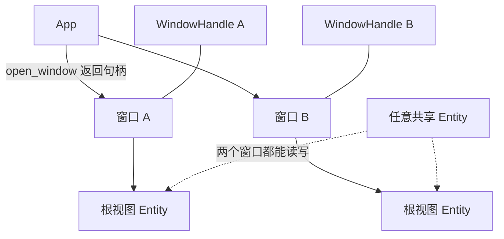

import { Meta } from '@storybook/addon-docs/blocks';

<Meta id="multi-window" title="架构核心/多窗口" name="Docs" />

# 多窗口

GPUI 的应用可以同时拥有任意多个窗口，窗口管理的核心只有三件事：用 `App::open_window` 打开窗口并保存返回的 `WindowHandle`；用 `update` 进入某个窗口更新它的根视图；用 `remove_window`、`on_window_should_close`、`on_window_closed` 三个 API 决定窗口怎么关、应用什么时候退出。窗口之间没有隔离墙——`Entity` 登记在应用级实体表上而不属于任何窗口，所以一个视图可以从一个窗口"搬"进另一个窗口，状态原样延续。本课沿官方三个示例（`window_positioning`、`move_entity_between_windows`、`on_window_close_quit`）讲清这条链路；窗口的静态外观配置（`WindowOptions` 全部字段）归第 1.2 课，本课只管窗口的生命周期与窗口间关系。



先看窗口管理 API 家族全表，后文按问题展开。签名核对自 crates.io 发布的 gpui 0.2.2 源码包（与 docs.rs 0.2.2 页面对应）；官方 main 分支的接口差异在正文以"仅 main"标注：

| API | 作用与回查要点 |
| --- | --- |
| `App::open_window(options, build_root_view)` | 打开新窗口；闭包返回根视图 `Entity<V>`；返回 `Result<WindowHandle<V>>` |
| `App::windows()` | 返回 `Vec<AnyWindowHandle>`，当前全部窗口 |
| `App::on_window_closed(回调)` | 任一窗口关闭后触发，返回 `Subscription`；0.2.2 回调收 `&mut App`，仅 main 增加 `WindowId` 参数 |
| `App::quit()` | 退出应用 |
| `WindowHandle::update(cx, 闭包)` | 进入窗口更新根视图；窗口已关闭时返回 `Err` |
| `WindowHandle::root` / `read` / `read_with` / `entity` | 读取根视图的 `Entity` 或其内容 |
| `WindowHandle::is_active(cx)` | 窗口是否处于激活状态，返回 `Option<bool>` |
| `AnyWindowHandle::downcast::<T>()` | 还原成强类型 `WindowHandle<T>`，类型不符返回 `None` |
| `AnyWindowHandle::window_id()` | 取 `WindowId`，`as_u64()` 得到数值 |
| `AnyWindowHandle::update(cx, 闭包)` | 不关心根视图具体类型时更新窗口 |
| `Window::remove_window()` | 在窗口更新内请求关闭本窗口 |
| `Window::on_window_should_close(cx, 回调)` | 拦截用户关闭操作，回调返回 `bool` 决定是否放行 |
| `Window::window_handle()` | 在窗口内部拿到自己的 `AnyWindowHandle` |

## 打开多个窗口

每调用一次 `open_window` 就多一个独立窗口，互不干扰。下面的完整程序开了两个窗口，根视图是同一个类型 `Counter` 的两个实例，界面上各自显示自己的窗口编号：

```rust
use gpui::{App, Application, Context, Render, Window, WindowOptions, div, prelude::*, rgb};

struct Counter {
    count: u32,
}

impl Render for Counter {
    fn render(&mut self, window: &mut Window, _cx: &mut Context<Self>) -> impl IntoElement {
        // 在窗口内部拿到自己的句柄和编号
        let window_id = window.window_handle().window_id().as_u64();
        div()
            .flex()
            .size_full()
            .justify_center()
            .items_center()
            .text_xl()
            .text_color(rgb(0xffffff))
            .bg(rgb(0x505050))
            .child(format!("窗口 {window_id}：count = {}", self.count))
    }
}

fn main() {
    Application::new().run(|cx: &mut App| {
        // 连开两个窗口，各自持有独立的 Counter 实例
        for i in 0..2 {
            cx.open_window(WindowOptions::default(), |_, cx| {
                cx.new(|_| Counter { count: i })
            })
            .unwrap();
        }
        cx.activate(true);
    });
}
```

`cargo run` 后两个窗口叠在默认位置，各自显示不同的窗口编号和计数。两个窗口的根视图也完全可以是不同类型——`open_window` 按 `V: 'static + Render` 泛型分发，句柄类型随之不同：

```rust
struct AppWindows {
    main: WindowHandle<Counter>,       // 主窗口
    settings: WindowHandle<Settings>,  // 设置窗口，另一个 Render 类型
}
```

`WindowHandle<V>` 是 `Copy + Clone + PartialEq + Eq + Hash` 的轻量值，就是"窗口 id + 根视图类型"的组合，放进结构体、`Vec`、`HashMap` 长期保存都没有负担。要知道"现在还有哪些窗口"时用 `cx.windows()`，后面的退出判断会用到它。

### 批量开窗：遍历显示器

官方 `window_positioning` 示例展示了"一次开一批窗口"的标准姿势：`cx.displays()` 拿到全部显示器，逐块屏幕构造 `Bounds`，把 `display_id` 写进 `WindowOptions`，循环里反复 `open_window`：

```rust
// 精简自官方 window_positioning 示例（main 分支）
for screen in cx.displays() {
    let bounds = Bounds {
        origin: point(px(150.), px(150.)),
        size: size(px(350.), px(75.)),
    };
    cx.open_window(
        WindowOptions {
            window_bounds: Some(WindowBounds::Windowed(bounds)),
            display_id: Some(screen.id()), // 指定在哪块屏幕上打开
            ..Default::default()
        },
        |_, cx| cx.new(|_| WindowContent { /* ... */ }),
    )
    .unwrap();
}
```

该示例给每块屏幕的四角与四边中点各摆一扇小窗，位置由 `screen.bounds()` 的角点做算术得出，并同时演示了 `focus: false`（不抢焦点）、`WindowKind::PopUp` 等配置项——定位算法与字段细节归第 1.2 课，这里记住"批量开窗就是循环调用 `open_window`"。

## WindowHandle：保存并更新窗口

`open_window` 返回的 `WindowHandle<V>` 不是窗口本身，而是一张可以长期保存的"门票"：窗口开着，句柄就能用；窗口被关掉，句柄还在手里但操作会失败。它要求 `V: 'static + Render`，即句柄始终知道自己窗口的根视图类型。

### update 模式

修改窗口内容只有一条路：`update`。签名（0.2.2）：

```rust
pub fn update<C, R>(
    &self,
    cx: &mut C,
    update: impl FnOnce(&mut V, &mut Window, &mut Context<V>) -> R,
) -> Result<R>
where
    C: AppContext,
```

闭包同时拿到根视图、窗口和该视图的 `Context`，从任何持有 `App` 的地方都能调用：

```rust
// 更新之前保存的窗口：改状态并触发该窗口重渲染
main_window.update(cx, |counter, _window, cx| {
    counter.count += 1;
    cx.notify();
})?;
```

返回 `Result` 是 update 模式的关键：窗口随时可能被用户关掉，句柄还捏在手里但窗口已经没了，这时 `update` 返回 `Err`。长期保存的句柄每次使用都要面对"窗口可能已经不在"的现实（处理策略见常见问题）。

### 读取根视图

不改窗口、只想读内容或拿实体时，`WindowHandle` 提供四个只读入口（0.2.2）：

| 方法 | 签名要点 | 用途 |
| --- | --- | --- |
| `root(cx)` | 收 `&mut C`，返回 `Result<Entity<V>>` | 拿根视图 `Entity`，可再 clone、observe |
| `entity(cx)` | 收 `&C`，返回 `Result<Entity<V>>` | 同样返回根视图 `Entity`，只需要共享句柄时用 |
| `read(cx)` | 返回 `Result<&V>` | 直接借出根视图的数据 |
| `read_with(cx, 闭包)` | 闭包收 `(&V, &App)`，返回 `Result<R>` | 借着读一点数据，不持有引用 |

另有 `is_active(cx)` 返回 `Option<bool>` 判断窗口是否处于激活状态——窗口已经不存在时，答案就是 `None`。

### AnyWindowHandle：类型擦除句柄

`WindowHandle<V>` 携带根视图类型，而 `cx.windows()` 返回的是 `AnyWindowHandle`——不知道也不关心根视图是什么类型的句柄。标准库式的 `From` 转换可以由 `WindowHandle<V>` 得到 `AnyWindowHandle`，反过来用 `downcast::<T>()` 还原：

```rust
// 遍历全部窗口，只处理根视图为 Counter 的那些
for handle in cx.windows() {
    if let Some(counter_window) = handle.downcast::<Counter>() {
        counter_window
            .update(cx, |counter, _, cx| {
                counter.count = 0;
                cx.notify();
            })
            .ok();
    }
}
```

类型不匹配时也可以直接用 `AnyWindowHandle::update`，闭包拿到的是 `AnyView`，适合对所有窗口做统一操作（比如全部刷新）。每个窗口还有稳定的 `WindowId`：`window_id()` 取出，`as_u64()` 得到数值，适合做日志输出或映射表的 key。

## 跨窗口移动 Entity

GPUI 没有"把视图搬去另一个窗口"的专门 API——所谓移动，就是两步的组合：用同一个 `Entity` 当新窗口的根视图，再关掉旧窗口。这能成立是因为 `Entity` 登记在应用级实体表里而不属于任何窗口；`open_window` 的构建闭包本来就返回 `Entity<V>`，返回一个"旧"实体完全合法。

官方 `move_entity_between_windows` 示例演示了完整流程：实体收到事件后，把自己 re-host 进新窗口：

```rust
// 精简自官方 move_entity_between_windows 示例（仅 main，入口为 gpui_platform::application）
cx.subscribe_in::<_, MoveToNewWindow>(
    &self_entity,
    window,
    move |this, _emitter, _event, window, cx| {
        this.move_count += 1;
        cx.notify();

        let entity = cx.entity();                // 自己这个 Entity
        let old_window = window.window_handle(); // 当前所在窗口的句柄

        cx.defer(move |cx| {
            // 第一步：新窗口的构建闭包直接返回已有 Entity——"搬进去"
            cx.open_window(WindowOptions::default(), move |_, _| entity)
                .expect("failed to open new window");

            // 第二步：关掉旧窗口
            old_window
                .update(cx, |_, window, _| window.remove_window())
                .ok();
        });
    },
);
```

三个要点：

- `move |_, _| entity`：构建闭包把已有实体原样交出去。搬移后实体还是同一个，示例里实体的 `tick_count`、`move_count` 全部延续，界面显示的窗口编号变成新窗口——状态没有经历任何复制或重建。
- `cx.defer`：把"开新窗 + 关旧窗"推迟到本轮更新结束之后执行。事件回调正处于一次窗口更新中，defer 是官方示例选择的排队方式，避免在更新中途变更窗口集合。
- `_in` API 家族（`subscribe_in` / `spawn_in` / `update_in` / `observe_in`，0.2.2 已可用）：注册时绑定一个窗口，派发时回调收到的 `window` 却指向实体**当前**的宿主窗口。示例的定时任务（`spawn_in` + `update_in`）在搬移后继续运行，打印的窗口 id 变成了新窗口——这正是"实体被 re-host"的直接可观察证据。

## 窗口关闭与退出

### 主动关闭：remove_window

窗口在更新中调用 `window.remove_window()` 请求关闭自己。0.2.2 的实现只做一件事——把窗口标记为 `removed`，真正的拆除发生在本轮更新结束之后，所以"关窗"总是安全的，不会拆掉一个正在更新的窗口：

```rust
window.remove_window(); // 标记关闭，本轮更新结束后生效
```

要关别的窗口，用它的句柄进入再关：

```rust
other_window
    .update(cx, |_, window, _| window.remove_window())
    .ok();
```

### 关闭前拦截：on_window_should_close

用户点红绿灯（或平台等效操作）时，`Window::on_window_should_close` 给你一次否决机会，回调返回 `true` 才放行关闭。签名（0.2.2）：

```rust
pub fn on_window_should_close(
    &self,
    cx: &App,
    f: impl Fn(&mut Window, &mut App) -> bool + 'static,
)
```

典型用法是在该窗口的一次 `update` 里注册（`Context` 可解引用为 `&App` 直接传入）：

```rust
main_window
    .update(cx, |_, window, cx| {
        window.on_window_should_close(cx, |_window, _cx| {
            true // 返回 false 可以取消本次关闭，比如先弹"未保存"确认
        });
    })
    .ok();
```

### 关闭后收尾：on_window_closed

窗口真正关掉后，`App::on_window_closed` 注册的回调被触发，返回的 `Subscription` 不需要就 `.detach()`。官方 `on_window_close_quit` 示例用它实现"关掉最后一个窗口就退出"：

```rust
// 精简自官方 on_window_close_quit 示例
// 0.2.2 签名：回调只收 &mut App
cx.on_window_closed(|cx| {
    if cx.windows().is_empty() {
        cx.quit();
    }
})
.detach();

// 仅 main：签名多一个 WindowId 参数，可区分刚关闭的是哪个窗口
// cx.on_window_closed(|cx, _window_id| { ... })
```

该示例还演示了同屏双窗口的排布技巧——第二个窗口的位置直接在第一个基础上平移一个宽度：

```rust
let mut bounds = Bounds::centered(None, size(px(500.), px(500.0)), cx);
// ...用这个 bounds 打开第一个窗口...
bounds.origin.x += bounds.size.width; // 紧挨着往右摆
// ...再用它打开第二个窗口...
```

示例窗口内的 cmd-w 动作最终也调用 `window.remove_window()`，于是"按快捷键关窗"与"点红绿灯关窗"汇入同一条关闭链路，由同一个 `on_window_closed` 判断退出；动作与快捷键机制见第 3.2 课。

## 窗口间通信

窗口不是通信屏障——GPUI 的实体表和全局表都是应用级的。三个惯用方式：

- **共享 Entity（首选）。** `Entity<T>` 句柄是 `Copy` 的，clone 一份存进另一个窗口的视图字段，两个窗口就看到了同一份数据；任何一侧 `entity.update(cx, ...)` 加 `cx.notify()`，两侧界面都会刷新。跨窗口的 `observe` / `subscribe` 用法与单窗口完全一致，见第 4.2 课。
- **Global。** `cx.set_global` / `cx.try_global` 读写应用级单例状态，适合"所有窗口都读的全局配置"，机制见第 4.2 课。
- **直接更新另一个窗口。** 保存目标窗口的 `WindowHandle`，在源窗口的事件回调里 `handle.update(cx, ...)`。注意闭包里拿到的是目标窗口的 `Window` 与目标视图的 `Context<V>`，`cx.notify()` 通知的也是目标窗口。

跨窗口共享的实体若注册了窗口相关回调（`spawn_in` / `subscribe_in`），回调收到的 `window` 会跟随实体的当前宿主窗口——上一节的搬移示例正是靠这个性质在搬移后继续正常工作。

## 最佳实践

- **开窗、关窗放进 `cx.defer`。** 在事件回调或实体更新中途变更窗口集合时，官方示例用 defer 把操作排队到本轮更新之后，避免在窗口更新过程中拆建窗口。
- **句柄随便存，`update` 永远防失效。** `WindowHandle` 是轻量 Copy 值，放结构体或集合里都行；但每次 `update` 都可能因窗口已关闭而得到 `Err`，用 `.ok()`、`if let Ok(..)` 消化，或在 `on_window_closed` 里清理失效句柄。
- **异构窗口集合存 `AnyWindowHandle`，用时 `downcast`。** 混存不同根视图类型的窗口（主窗口加各种面板）时统一存 `AnyWindowHandle`，操作前 `downcast::<T>()` 还原成强类型句柄。
- **退出行为显式声明。** 需要"最后一个窗口关闭就退出"时，用 `on_window_closed` 加 `cx.windows().is_empty()` 加 `cx.quit()` 明确实现（官方 `on_window_close_quit` 示例的做法），不依赖平台默认行为。

## 常见问题

- 想订阅 `WindowEvent`（Closed / Moved / Resized 之类）响应窗口事件，但找不到这个类型。
  GPUI 目前没有名为 `WindowEvent` 的公开枚举（0.2.2 全部源码与 main 分支 `window.rs` 均已核实）。窗口生命周期事件拆在几个 API 里：关闭前 `Window::on_window_should_close`，关闭后 `App::on_window_closed`；窗口位置与尺寸没有事件可订，`render` 每帧都执行，需要跟随变化就在渲染时读 `window.bounds()`（`window_positioning` 示例的做法）。
- 保存的 `WindowHandle` 调 `update` 返回 `Err`。
  窗口已经被关闭。句柄不会自动失效，但操作会失败；长期保存句柄的地方要么每次接受 `Result`，要么在 `on_window_closed` 回调里把失效句柄从集合中清掉。
- 照抄官方示例写 `use gpui_platform::application;` 编译失败，找不到这个 crate。
  `gpui_platform` 尚未发布到 crates.io，main 分支示例已切换到该入口；crates.io 的 gpui 0.2.2 用 `Application::new().run(...)`。两个入口下 `open_window`、`WindowHandle` 等窗口 API 用法一致，工程配置见第 1.1 课。
- `on_window_closed` 的回调参数和某些文档对不上。
  这是版本演进：0.2.2 是 `FnMut(&mut App)`，main 分支改成 `FnMut(&mut App, WindowId)`，多出的参数用于区分刚关闭的窗口。按你依赖的版本选择写法。

## 总结回顾

摘要：

本课覆盖窗口的动态生命周期。`App::open_window` 每次调用打开一个窗口并返回 `WindowHandle<V>`，句柄是轻量 Copy 值，可长期保存、可放进集合；`WindowHandle::update` 是更新窗口内容的唯一入口，返回 `Result` 以面对"窗口随时可能被用户关掉"的现实，另有 `root` / `read` / `read_with` / `entity` 读取根视图。`cx.windows()` 返回 `Vec<AnyWindowHandle>`，配合 `downcast` 管理异构窗口集合。窗口之间没有隔离：`Entity` 登记在应用级实体表，把同一个 `Entity` 当作新窗口的根视图再关掉旧窗口（官方 `move_entity_between_windows` 示例），就完成了跨窗口移动视图，状态原样延续；`_in` API 家族保证回调派发到实体的当前宿主窗口。窗口关闭分三个环节：主动 `Window::remove_window`、关闭前拦截 `on_window_should_close`、关闭后收尾 `App::on_window_closed`（0.2.2 收 `&mut App`，仅 main 增加 `WindowId`），"最后一个窗口关闭即退出"用 `on_window_closed` 加 `cx.quit()` 显式实现。跨窗口通信首选共享 `Entity`，其次是 Global 与直接 `update` 目标窗口句柄。

一句话：

> 窗口是 Entity 的临时宿主：句柄管更新，实体表管共享，"移动视图"就是换个窗口 re-host 同一个 Entity。

知识要点：

- 打开多个窗口需要什么？`WindowHandle<V>` 为什么可以长期保存在自己的结构体里？
- `WindowHandle::update` 的闭包能拿到什么，为什么返回 `Result`？
- `cx.windows()` 返回什么类型，怎么把它还原成强类型句柄再更新？
- "把一个视图移到另一个窗口"由哪两步组成，为什么实体状态不会丢？
- `_in` API 家族（`subscribe_in` / `spawn_in` / `update_in`）在注册时与派发时拿到的窗口有什么不同？
- 代码里怎么关窗口？用户关闭怎么拦截？最后一个窗口关闭后怎么触发应用退出？
- `remove_window`、`on_window_should_close`、`on_window_closed` 分别发生在关闭流程的哪一步？
- 两个窗口之间共享状态的推荐方式是什么？

## 参考资料

- [官方示例 move_entity_between_windows.rs](https://github.com/zed-industries/zed/blob/main/crates/gpui/examples/move_entity_between_windows.rs)（跨窗口移动 Entity 与 `_in` API 家族的完整演示）
- [官方示例 on_window_close_quit.rs](https://github.com/zed-industries/zed/blob/main/crates/gpui/examples/on_window_close_quit.rs)（双窗口排布与"最后一个窗口关闭即退出"）
- [官方示例 window_positioning.rs](https://github.com/zed-industries/zed/blob/main/crates/gpui/examples/window_positioning.rs)（遍历显示器批量开窗）
- [docs.rs 0.2.2：App](https://docs.rs/gpui/0.2.2/gpui/struct.App.html)（`open_window`、`windows`、`on_window_closed`、`quit` 的 0.2.2 签名）
- [docs.rs 0.2.2：WindowHandle](https://docs.rs/gpui/0.2.2/gpui/struct.WindowHandle.html)（`update`、`root`、`read`、`entity`、`is_active`）
- [docs.rs 0.2.2：AnyWindowHandle](https://docs.rs/gpui/0.2.2/gpui/struct.AnyWindowHandle.html)（`downcast`、`window_id` 与类型擦除的 `update`）
- [docs.rs 0.2.2：Window](https://docs.rs/gpui/0.2.2/gpui/struct.Window.html)（`remove_window`、`on_window_should_close`、`window_handle`）
- [gpui 0.2.2（crates.io）](https://crates.io/crates/gpui/0.2.2)（本课 API 口径对应的发布版本与源码包）
- [main 分支 app.rs](https://github.com/zed-industries/zed/blob/main/crates/gpui/src/app.rs)（`on_window_closed` 增加 `WindowId` 参数的演进）
