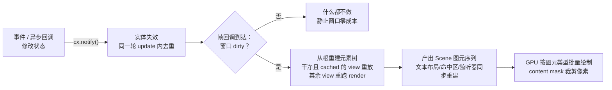

import { Meta } from '@storybook/addon-docs/blocks';

<Meta id="performance" title="工程化/性能实践" name="Docs" />

# 性能实践

GPUI 的性能特征由它的渲染模型决定：**帧是失效驱动的**——没有任何实体被 `cx.notify()` 时，窗口不产生新帧，静止界面零渲染成本；而一旦失效，一帧会把元素树从根重建、产出一份场景（`Scene`）图元序列，交给 GPU 按图元类型批量绘制。所以性能问题永远落在三层之一：**帧太多**（失效调度）、**单帧太贵**（重建与重绘范围）、**不该在帧里做的事进了帧**（重计算、解码、spawn）。本课建立这个三层模型，给出每层的机制、API 与坏到好的改法。

口径：本课机制与签名一律核对自 crates.io 发布版 gpui 0.2.2 的源码；main 分支新增或不同的行为（`profiler` feature、`Entity::cached`、失焦限帧等）单独标注。`notify` 最小闭环归 1.3 课，`Entity` 拆分与观察者归 4.2 课，后台执行器归 4.4 课，列表虚拟化归 5.1 课，`canvas` 归 5.2 课，图片缓存归 5.4 课。

一帧从失效到上屏的完整生命周期：



常见症状的判断与处理（回查入口，各小节展开机制）：

| 症状 | 判断 | 处理 |
| --- | --- | --- |
| 界面静止时 CPU 仍高 | 有代码在持续产生帧 | 给逐帧循环加停止条件；摘掉不可见的动画元素（main 分支可 `with_max_fps` 限频） |
| 一次小改动整窗重画 | 失效粒度过粗，或没用 view 缓存 | 拆分 `Entity`；稳定子树加 `.cached(...)` |
| 输入、滚动时掉帧 | 单帧太贵：`render` 里有重计算或每帧分配 | 计算挪到数据更新时，重活进后台线程 |
| 长列表滚动掉帧 | 没有虚拟化 | 换 `uniform_list`，只渲染可见行 |
| 图片列表内存持续上涨 | 图片缓存只进不出 | 配 `ImageCache` / LRU，大图用 `cx.drop_image` 释放 |
| 弹层被后面的内容盖住 | 绘制顺序随元素树 | 用 `deferred(...)` 延迟绘制 |
| 说不清慢在哪 | 没有测量 | 0.2.2 手动计时 + Instruments；main 分支开 `profiler` feature |

## 帧调度

帧的生命周期只有一条主线：失效（notify 或 refresh）把窗口标脏并请求一帧；平台的帧回调到达时，窗口只有处于 dirty 状态才真正执行 `Window::draw`——0.2.2 源码里的判断是 `invalidator.is_dirty() || force_render`。没有失效就没有帧，这是 GPUI 与"每帧必跑"的游戏主循环的区别：它像游戏一样整帧重画，但只在需要时开帧。失效有几个入口，效果不同：

| 调用 | 效果 |
| --- | --- |
| `cx.notify()` | 当前实体失效；同一轮 update 内多次调用自动去重 |
| `window.refresh()` | 整个窗口失效，并且本帧绕过所有 view 缓存 |
| `cx.refresh_windows()` | 对应用所有窗口执行 refresh |
| `window.request_animation_frame()` | 下一帧 notify 当前视图；不在视图内调用则刷新整窗 |
| `window.on_next_frame(f)` | 当前帧渲染完成后执行回调 f |

### notify 去重：一帧合并多次修改

`cx.notify()` 不直接重画，而是投递一个 `Effect::Notify` 效果（1.3 课的闭环）。框架在两个层面去重：`App::push_effect` 用 `pending_notifications` 集合过滤重复的 notify；窗口侧的 `dirty_views` 是一个 `FxHashSet`，同一实体反复失效只占一个位。效果队列在当前这轮 update 结束时统一 flush（4.2 课），flush 完成才为 dirty 的窗口调度一帧——所以同一轮里的观察者链式 notify 也全部合并：

```rust
impl Counter {
    fn bump(&mut self, cx: &mut Context<Self>) {
        self.count += 1;
        cx.notify(); // 第一次：进入待通知集合
        self.label = self.label_text();
        cx.notify(); // 第二次：集合里已存在，直接丢弃
        // 无论 notify 多少次，本轮 update 只产生一帧
    }
}
```

边界：去重的范围是"同一轮 effects flush"。跨轮不合并——`spawn` 的任务在不同时刻完成并各自 notify，就是多帧；这正确地反映数据变化次数，不该人为凑批。

### request_animation_frame 与连续帧

`Window::request_animation_frame()` 无参数：它记下当前视图，安排"下一帧 notify 这个视图"。源码文档的语义是——在视图内调用，下一帧重跑该视图的 `render`；不在视图内调用，则刷新整个窗口。连续动画的本质就是每帧重新请求，请求停止，帧就停止：

```rust
impl Render for Spinner {
    fn render(&mut self, window: &mut Window, cx: &mut Context<Self>) -> impl IntoElement {
        if self.spinning {
            // 每帧请求下一帧：spinning 变 false 后循环自然终止，帧也停止
            window.request_animation_frame();
        }
        // ……用当前角度画一个旋转指示器
    }
}
```

装饰性动画优先用 `with_animation`（3 动画课），播完自动停止请求。手动循环必须自带停止条件，否则界面"静止"了帧却不停（见常见问题）。main 分支还有两个框架级行为：窗口失焦或系统热压时会限帧（源码内部的 `FrameRateLimit::Inactive` / `Thermal`，无公开开关）；`Animation` 家族新增 `with_max_fps` 限频并自动尊重系统"减弱动态效果"。

## notify 粒度与 Entity 拆分

`notify` 的单位是 `Entity`。一个关键事实决定粒度的意义：**没有 view 缓存时，一次失效会让窗口里所有 view 的 `render` 全部重跑**——draw 从根 view 开始重建整棵元素树，沿途每个 view 都重新调用 `render`。所以粒度不改变"谁重跑"（那是缓存的事，下一节），它决定的是：

- 哪些观察者被触发：notify 大实体，观察它的所有联动无差别执行（4.2 课的 observe/subscribe 链）；
- 配合缓存时哪些缓存失效：实体边界就是缓存失效边界；
- 多窗口下波及谁：notify 只触达渲染过该实体的窗口（main 分支进一步收窄到当前正在显示它的窗口）。

典型反模式是"巨型根实体"：

```rust
// 坏：一个实体承载整个工作区，改一条状态栏消息也 notify 整个工作区
struct Workspace {
    tree: Vec<FileNode>,  // 上千节点
    text: String,         // 编辑器大文本
    status: String,       // 一条状态栏消息
}

impl Render for Workspace {
    fn render(&mut self, _window: &mut Window, cx: &mut Context<Self>) -> impl IntoElement {
        // 状态栏变了：树、编辑器的观察者链全部跟着触发
        // 若子树配了缓存，也因整个实体失效而全部重画
        div().child(self.render_tree()).child(self.render_editor())
    }
}
```

```rust
// 好：状态分组拆实体，谁是变化源就 notify 谁
struct Workspace {
    tree: Entity<FileTree>,
    editor: Entity<Editor>,
    status: Entity<StatusBar>,
}

impl Render for Workspace {
    fn render(&mut self, _window: &mut Window, _cx: &mut Context<Self>) -> impl IntoElement {
        div()
            .child(self.tree.clone())   // 拆分后 notify 只触达对应子实体
            .child(self.editor.clone())
            .child(self.status.clone())
    }
}

impl StatusBar {
    fn set_message(&mut self, msg: SharedString, cx: &mut Context<Self>) {
        self.msg = msg;
        cx.notify(); // 只有 StatusBar 失效；配合缓存时其余子树整帧重放
    }
}
```

拆分本身不减少 `render` 调用（无缓存时每帧全跑），它的收益要靠两件事兑现：观察者链只走相关分支，以及下一节的 view 缓存只失效相关子树。

## 重绘范围

心智模型来自官方博客的说法：Zed 像渲染视频游戏一样渲染界面——每帧清除重来，120Hz 下只有 8.33ms 预算；GPU 侧没有通用 2D 引擎，每种图元（矩形、阴影、字形、图标、图片）一个专用着色器，用实例化绘制批量画。它与 Web 的关键区别是：**没有保留的 DOM 树，也没有局部 reflow**——一次失效就是从根重建整棵元素树再整体绘制，别把 Web 的"重排"概念搬过来。

但"整帧重画"不等于"全部重算"。框架内有四层跨帧缓存，理解它们才知道钱花在哪：

| 缓存 | 覆盖 | 失效条件 |
| --- | --- | --- |
| 字形形状缓存 + 位图图集 | 文本、图标 | 键（文本 + 字体 + 样式）变化；成本只落在相对上一帧变化的文本上 |
| 行布局 `LineLayoutCache` | 换行、断行结果 | 双代缓存（previous/current），帧末交换；cached view 重放时整段复用 |
| view 级 scene 区间 | 整个子树 | 本实体被 notify、bounds / content_mask / text_style 变化、窗口 refresh |
| 图片纹理 sprite atlas | 已解码图片 | 常驻显存，`cx.drop_image` 显式释放（5.4 课） |

### view 缓存：cached

这是唯一把"重绘范围"从窗口缩到子树的开关。0.2.2 提供 `AnyView::cached(style)`，源码文档的语义：**只要渲染之后没有对它调用 `notify`，视图上一帧的布局与绘制就会被回收复用；例外是 `Window::refresh`，此时缓存被忽略**。main 分支把同一能力加到了 `Entity::cached(style)`。命中重放的条件（源码）：`bounds`、`content_mask`、`text_style` 都没变，本实体不在 `dirty_views` 里，窗口也不在 refresh 状态。

```rust
use gpui::{StyleRefinement, relative};

impl Render for Container {
    fn render(&mut self, _window: &mut Window, _cx: &mut Context<Self>) -> impl IntoElement {
        // 0.2.2 写法：AnyView::from(view).cached(style)
        let sidebar = AnyView::from(self.sidebar.clone()).cached(
            StyleRefinement::default().w(relative(0.3)),
        );
        // main 分支可写：self.sidebar.clone().cached(StyleRefinement::default().w(relative(0.3)))
        div().flex().size_full().child(sidebar).child(self.main.clone())
    }
}
```

命中时子树跳过 `render` / 布局 / 绘制，直接重放上一帧记录的 scene 区间，连其中的鼠标监听、输入处理器、文本布局一并搬运。三个使用边界：

- **必须有确定尺寸**：cached 视图用 `style` 布局，不按内容测量，样式给不出尺寸就布局不出来。
- **数据要自洽**：缓存失效只认"本实体被 notify"。cached 子树的 `render` 若读了其他实体的数据，那些实体变了只会让窗口重画，子树照旧重放旧内容——跨实体变化要转成对本实体的 `notify`，或让该子树只读自己的字段。
- **refresh 是兜底**：`window.refresh()` 整窗失效并绕过全部缓存，用来处理"缓存不知道的变化"（如设备恢复后的强制重画），不要当日常 `notify` 用。

### 裁剪：content mask

`Window::with_content_mask(Some(ContentMask { bounds }), f)` 把闭包内的绘制限制在给定矩形内，超界像素不写入。日常几乎不用手写：`div().overflow_hidden()` 就是框架在 paint 时替你套上了这个 mask（0.2.2 div 源码中 `style.overflow_mask` 的路径）。边界要清楚：裁剪缩小的是**像素写入范围**，元素树还是全量构建——被裁掉的子元素的 `render` 照跑。想让"看不见就不参与"得靠虚拟化：

```rust
// 滚动容器：overflow_hidden 让滚出视口的内容不产生像素写入，
// 但它们的元素仍在树里（见下一小节的 uniform_list）
div()
    .size_full()
    .overflow_hidden()
    .child(self.items.clone())
```

### deferred：延迟绘制

`deferred(child)` 让子元素**布局参与本帧排布，绘制推迟到所有祖先元素画完之后**（0.2.2 即有，`elements/deferred.rs`）。`.with_priority(n)` 控制多个 deferred 之间的层叠，数值大的画在上面。浮层类 UI——popover、tooltip、拖拽中的影子——都靠它避免被文档流中靠后的兄弟盖住：

```rust
use gpui::deferred;

div()
    .relative()
    .child(self.trigger.clone())
    .child(
        // 弹层布局算在触发器旁边，但最后才画，保证盖在兄弟内容之上
        deferred(
            div()
                .absolute()
                .top_8()
                .child("popover 内容"),
        )
        .with_priority(0),
    )
```

### 列表虚拟化与 canvas 的重跑语义

`uniform_list` 每帧只为**可见范围**（源码里的 `visible_range`）调用条目渲染闭包，一万条数据每帧可能只 `render` 十几条——长列表的树规模解法就是它（用法归 5.1 课）。`canvas(prepaint, paint)` 则相反：它的两个闭包在所属 view **每次重渲染时都重跑**，闭包里做重活等于每帧做，只放"用现成数据画几个图元"的活（5.2 课）。

## 把重活挪出帧

前两节管"多少帧、画多少"，这一节管"帧里别干活"。原则只有一句：`render` 应该是"读现成字段、拼元素"的纯廉价函数，一切计算、解码、spawn 都发生在数据更新时或帧外。

### render 里的重计算：坏到好

```rust
// 坏：每帧对上千条数据过滤、排序、格式化
impl Render for EntryList {
    fn render(&mut self, _window: &mut Window, _cx: &mut Context<Self>) -> impl IntoElement {
        let mut rows: Vec<&Entry> = self.entries.iter().filter(|e| e.active).collect();
        rows.sort_by(|a, b| b.score.total_cmp(&a.score));
        div().children(rows.into_iter().map(|e| div().child(format!("{} - {}", e.name, e.score))))
    }
}
```

```rust
// 好：数据变化时算一次，render 只读结果
impl EntryList {
    // 只在 entries 变化的入口调用（update / 事件回调），算完 notify
    fn rebuild_rows(&mut self) {
        let mut rows: Vec<Row> = self
            .entries
            .iter()
            .filter(|e| e.active)
            .map(|e| Row { label: format!("{} - {}", e.name, e.score), score: e.score })
            .collect();
        rows.sort_by(|a, b| b.score.total_cmp(&a.score));
        self.rows = rows;
    }
}

impl Render for EntryList {
    fn render(&mut self, _window: &mut Window, _cx: &mut Context<Self>) -> impl IntoElement {
        div().children(self.rows.iter().map(|r| div().child(r.label.clone())))
    }
}
```

判断方法很简单：`render` 里出现的 `sort` / `filter` / `format!` / 集合分配，每次失效都会重付一遍。

### 别在 paint 里 spawn

`Element::paint`（以及 div 的交互回调链）随失效反复执行，在里面 `spawn` 意味着每帧都可能发起新任务，失效几次就是一组重复请求。`spawn` 的正确位置是事件回调或 `update` 闭包——触发一次，执行一次（`Task` 的持有与取消规则归 4.4 课）。

### 后台线程接力

CPU 密集的活（大文件解析、全文检索、批量格式化）放进后台线程池，算完回前台改状态并 `notify`，全程只有"提交"和"收尾"两下碰 UI 线程：

```rust
impl SearchPanel {
    fn reload(&mut self, cx: &mut Context<Self>) {
        cx.spawn(async move |this, cx| {
            // 帧外：后台线程跑重活，不占 UI 线程的帧预算
            let rows = cx.background_spawn(async move { heavy_scan() }).await;
            this.update(cx, |this, cx| {
                this.rows = rows;
                cx.notify(); // 数据就绪才产生一帧
            })
            .ok();
        })
        .detach();
    }
}
```

### 图片：解码与缓存留在帧外

图片的性能坑是解码与显存：`img()` 配合 `use_asset` 异步加载，加载与解码不阻塞帧，结果按"加载器 + 来源哈希"缓存，后续帧直接取（5.4 课）；大图列表给整片子树配 `ImageCache`（如 `RetainAllImageCache` 或自实现 LRU）控制驻留；确认不再显示的大图用 `cx.drop_image` 从 sprite atlas 释放显存。图片本身进 atlas 后跨帧常驻，重画一帧并不重新上传纹理。

## 测量与观测

三层模型对号入座之前先测量。0.2.2 没有内置性能面板，可用手段：

- **手动计时**：在怀疑贵的 `render` 里用 `std::time::Instant` 打点记日志。务必用 release 构建测——debug 构建的差数量级会指错方向。
- **系统工具**：Xcode Instruments 的 Time Profiler 看 UI 线程帧内热点（顺带能看到是否在持续 draw，验证"帧是否该停"）。
- **埋点接口**：gpui 的 draw 关键路径源码里埋有 `#[profiling::function]` 观测点（`profiling` crate 门面，默认空操作）；最终应用启用对应后端 feature 后，这些区间会出现在 profiler 里。

main 分支内置了帧分析（全部仅 main）：Cargo feature 加 `profiler` 后，`Window::cycle_debug_frame_overlay_mode()` 可在窗口内循环开启帧耗时悬浮层（隐藏、只显示帧时长、详细三档），`frame_duration_snapshot()` 与 `input_latency_snapshot()` 返回帧时长与输入延迟的直方图快照，`reset_debug_frame_overlay_stats()` 清零统计。判断口径用博客里的预算：60Hz 一帧 16.67ms、120Hz 一帧 8.33ms；Zed 优化后的帧时长稳定在 4ms 以内——量出来的单帧成本离预算越近，越要先减帧而不是再优化。

## 最佳实践

- **先测量再动手。** 用观测手段确认症状落在三层（帧太多 / 单帧太贵 / 重活进帧）中的哪一层，再套对应小节的改法；不量就改常会把"单帧太贵"误修成"少 notify"。
- **实体边界就是失效与缓存边界。** 状态按"谁跟谁一起变"分组拆 `Entity`；拆出的稳定子树加 `.cached(...)`，并保证子树只依赖本实体字段，或把外部变化转成本实体的 `notify`。
- **render 保持纯粹便宜。** 只读字段拼元素；排序、过滤、格式化挪到数据更新的入口。逐帧动画的推进归 3 动画课的两种模式——优先 `with_animation`，手动场景按官方模式在 render 内推进并请求下一帧，但推进逻辑本身要便宜。
- **长列表必虚拟化，图片必有缓存策略。** `uniform_list` 管树规模，`ImageCache` / LRU 管内存，`drop_image` 管显存。
- **动画优先 `with_animation`。** 播完自动停止请求；手动 `request_animation_frame` 循环必须有停止条件，且不可见的动画元素用条件渲染摘掉（main 分支可加 `with_max_fps` 限频）。
- **`refresh` 是兜底不是日常。** 它整窗失效并绕过全部 view 缓存，仅用于缓存无法感知的变化；日常状态更新永远走 `notify`。

## 常见问题

- 界面看起来完全静止，CPU 占用却居高不下
  找还在被产生的帧：通常是 `request_animation_frame` 循环没有停止条件，或动画元素滚出视口后仍在挂载。处理：给逐帧循环加结束条件或按状态条件请求；动画元素改条件渲染摘掉；循环动画可用 main 分支的 `with_max_fps` 限频。用 Instruments 确认 draw 是否仍在被调用，可定位是哪处请求。
- 子树加了 `cached` 后内容"冻住"不再更新
  缓存失效只认"本实体被 notify"（外加 bounds、content_mask、text_style 变化或窗口 refresh）。子树 `render` 里读到的其他实体的变化不会让缓存失效，只会让窗口重画并原样重放旧内容。处理：把外部数据变化转成对该实体的 `notify`（observe 转发或 `update` 内 notify），或取消该子树的 `cached`。
- popover / tooltip / 拖拽影子被后面的兄弟内容盖住
  绘制顺序跟随元素树，普通子元素先画的在下面。处理：用 `deferred(...)` 包裹浮层，让它的绘制推迟到所有祖先之后；多个浮层之间用 `.with_priority(n)` 控制层叠，数值大的在上。
- 长列表一滚动就掉帧，行数越多越明显
  多半没有虚拟化：所有行的元素每帧都在树里参与布局与绘制。处理：换 `uniform_list` 只渲染可见行；若已虚拟化仍卡，检查行 `render` 里是否有重计算（回到"render 里的重计算"一节）。
- 一次交互 notify 了很多次，担心触发多次重画
  这是设计行为，不需要修：同一轮 update 内 notify 按实体去重（`pending_notifications` 集合），效果队列 flush 完才为 dirty 窗口调度一帧，多次修改合并为一帧。只有跨轮（如多个 `spawn` 任务先后完成）才会是多帧。

## 总结回顾

摘要：

GPUI 的性能工作可以压缩成一条主线：帧是失效驱动的，`notify` 去重保证同一轮修改合并为一帧，窗口不脏就不开帧；一帧从根重建整棵元素树、产出 `Scene` 图元序列交给 GPU 批量绘制，没有 Web 式的局部 reflow，但字形图集、行布局双代缓存、view 级 scene 重放（`cached`）与图片纹理图集四层缓存让"重画"不必"重算"。在这条主线上，性能优化的动作各归其位：`Entity` 拆分与 `cached` 划定失效与重放边界，`overflow_hidden`（content mask）与 `uniform_list` 控制像素与树的规模，`deferred` 解决浮层层叠；重计算、图片解码、`spawn` 一律挪出帧——挪到数据更新时或后台线程，算完 `notify`。测量先行：0.2.2 用手动计时与 Instruments，main 分支有 `profiler` feature 的帧时长悬浮层与直方图，对照 16.67ms / 8.33ms 预算判断优化方向。

一句话：

> GPUI 每次失效都整树重建、整帧重画，性能优化的全部内容是：少产生帧（notify 粒度与去重）、让重画不必重算（`cached` 与四层缓存）、别把帧外的活塞进帧里。

知识要点：

- 为什么界面静止时 GPUI 不消耗渲染成本，什么情况下会重新产生帧
- 多次 `cx.notify()` 为什么只产生一帧，去重发生在哪两个层面
- 一次失效后哪些代码会重跑（所有 view 的 `render`），`AnyView::cached` / `Entity::cached` 的重放条件与失效键是什么
- `cached` 子树读其他实体的数据为什么会"冻住"，正确的数据自洽做法是什么
- `overflow_hidden` 裁剪了什么、没裁剪什么；`uniform_list` 与它在树规模上的分工
- `deferred` 解决什么问题，`with_priority` 控制什么
- 哪些操作不该出现在 `render` / `paint` 里，重活的标准去处与回前台方式
- 0.2.2 与 main 分支各自的性能观测手段，单帧成本的判断预算是多少

## 参考资料

- [Leveraging Rust and the GPU to render user interfaces at 120 FPS（视频游戏渲染模型、图元着色器、字形图集与文本缓存）](https://zed.dev/blog/videogame)
- [Optimizing the Metal pipeline to maintain 120 FPS in GPUI（三重缓冲、帧调度与呈现管线、帧预算口径）](https://zed.dev/blog/120fps)
- [Window（refresh、request_animation_frame、on_next_frame、with_content_mask、drop_image）- docs.rs/gpui 0.2.2](https://docs.rs/gpui/0.2.2/gpui/struct.Window.html)
- [App（refresh_windows、background_spawn、notify 去重说明）- docs.rs/gpui 0.2.2](https://docs.rs/gpui/0.2.2/gpui/struct.App.html)
- [AnyView（cached 与视图缓存语义）- docs.rs/gpui 0.2.2](https://docs.rs/gpui/0.2.2/gpui/struct.AnyView.html)
- [deferred - docs.rs/gpui 0.2.2](https://docs.rs/gpui/0.2.2/gpui/fn.deferred.html)
- [ContentMask - docs.rs/gpui 0.2.2](https://docs.rs/gpui/0.2.2/gpui/struct.ContentMask.html)
- [gpui 0.2.2 源码 src/window.rs（帧门控 is_dirty、notify 失效与去重、reuse_paint、refresh 绕过缓存）](https://docs.rs/crate/gpui/0.2.2/source/src/window.rs)
- [gpui 0.2.2 源码 src/view.rs（AnyView 缓存键 bounds / content_mask / text_style 与重放判定）](https://docs.rs/crate/gpui/0.2.2/source/src/view.rs)
- [gpui 0.2.2 源码 src/elements/deferred.rs（延迟绘制与 priority 实现）](https://docs.rs/crate/gpui/0.2.2/source/src/elements/deferred.rs)
- [gpui 0.2.2 源码 src/elements/uniform_list.rs（visible_range 虚拟化）](https://docs.rs/crate/gpui/0.2.2/source/src/elements/uniform_list.rs)
- [gpui 0.2.2 源码 src/text_system/line_layout.rs（LineLayoutCache 双代缓存与 reuse_layouts）](https://docs.rs/crate/gpui/0.2.2/source/src/text_system/line_layout.rs)
- [zed 仓库 main 分支 crates/gpui/src/window.rs（profiler feature、帧耗时悬浮层、失焦与热压限帧）](https://github.com/zed-industries/zed/blob/main/crates/gpui/src/window.rs)
- [zed 仓库 main 分支 crates/gpui/src/view.rs（Entity::cached 与访问实体追踪）](https://github.com/zed-industries/zed/blob/main/crates/gpui/src/view.rs)
