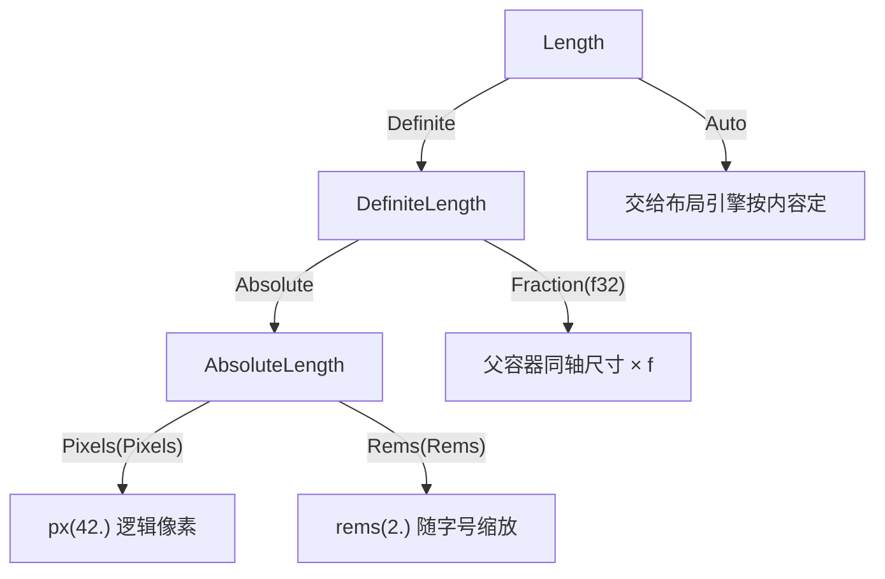

import { Meta } from '@storybook/addon-docs/blocks';

<Meta id="sizing" title="布局与样式/尺寸体系" name="Docs" />

# 尺寸体系

GPUI 里任何一个"多宽、多高"都是同一个类型树上取的值：绝对尺寸（`Pixels`、`Rems`）自己就是确定的，相对尺寸（`relative`，内部叫 `Fraction`）要等布局时乘上父容器同轴尺寸才落地，`auto` 则交给布局引擎按内容算。写样式时你几乎不直接碰这些枚举——用 `px()` / `rems()` / `relative()` 构造，或走 `w_*` / `h_*` 这套 Tailwind 风格方法。本课基于 gpui 0.2.2（2025-10-22 发布）核对 API，读完你能预测：窗口缩放、`rem` 字号变化时，一个 `div` 的宽高各会怎么变。

先记住类型树，后面所有方法名都是往这棵树上塞值：



日常选用入口（回查表，各小节展开细节）：

| 尺寸说法 | 实际类型 | 构造 / 写法 | 适用场景 | 回查要点 |
| --- | --- | --- | --- | --- |
| px | `Pixels` | `px(240.)` / `.w(px(240.))` | 边框、分隔线、按设计稿固定的部件 | 逻辑像素；渲染时自动乘 scale_factor |
| rems | `Rems` | `rems(1.5)` / `.w_6()` | 间距、圆角、要跟随字号缩放的尺寸 | 默认 1rem = 16px；`window.set_rem_size()` 全局改 |
| relative | `DefiniteLength::Fraction(f32)` | `relative(0.5)` / `.w_1_2()` | 按父容器比例分配空间 | 解析为父容器同轴尺寸的百分比 |
| percentage | 同 relative，只是叫法 | `relative(0.25)` = 25% | 同上 | 长度体系里没有独立的 percentage 类型 |
| fraction | 同 relative | `relative(1./3.)` | 三等分这类分数分配 | `relative` 是函数名、`Fraction` 是变体名；0.2.2 没有独立的 `fraction()` 函数 |
| full | `relative(1.)` 的糖 | `.w_full()` / `.size_full()` | 撑满父容器 | 就是 100%；`Size::full()` 是另一回事，见下文 |
| auto | `Length::Auto` | `.w_auto()` / `auto()` | 不指定，按内容或 flex 规则定 | `size` / `min_size` / `max_size` 的默认值 |

## 类型层级

三层枚举，全部定义在 `geometry.rs`（0.2.2 源码）：

```rust
pub enum Length {
    Definite(DefiniteLength), // 有确定值的长度
    Auto,                     // 交给布局引擎
}

pub enum DefiniteLength {
    Absolute(AbsoluteLength), // 绝对值：px 或 rem
    Fraction(f32),            // 父容器同轴尺寸的百分比，0.0 到 1.0
}

pub enum AbsoluteLength {
    Pixels(Pixels), // 逻辑像素
    Rems(Rems),     // 1rem = 窗口 rem_size，默认 16px
}
```

配套的构造函数只有四个，签名照抄自 0.2.2：

```rust
pub const fn px(pixels: f32) -> Pixels;                  // 逻辑像素
pub fn rems(rems: f32) -> Rems;                          // rem 单位
pub const fn relative(fraction: f32) -> DefiniteLength;  // 父容器百分比
pub fn auto() -> Length;                                 // Length::Auto
```

各层之间都有 `From` 实现，构成一条自动提升链：`Pixels` → `AbsoluteLength` → `DefiniteLength` → `Length`。这就是为什么 `.w()` 能直接吃 `px(240.)`、`rems(1.5)`、`relative(0.5)`——参数类型是 `impl Into<Length>`，编译器沿链自动包装：

```rust
// 三种写法分别落在类型树的不同分支，都不需要手动 enum 包装
div().w(px(240.));      // Length::Definite(Absolute(Pixels(240.)))
div().w(rems(1.5));     // Length::Definite(Absolute(Rems(1.5)))
div().w(relative(0.5)); // Length::Definite(Fraction(0.5))
div().w_auto();         // Length::Auto
```

这些类型还实现了 `Display` 与 `TryFrom<&str>`：`Length` 显示为 `"auto"`，`DefiniteLength::Fraction(0.5)` 显示为 `"50%"`，`"42px"`、`"2rem"`、`"50%"`、`"auto"` 字符串也能解析回来。做日志、inspector 检查或序列化配置时会用到。

三个容易误判的边界，一次说清：

- **没有 `fraction()` 和 `full()` 自由函数。** 相对长度的唯一构造入口是 `relative(fraction)`；`full()` 是 `Size<Length>` 上的构造器（宽高同时 `relative(1.)`），服务于需要 `Size<Length>` 值的场合，元素上的"撑满"写法是 `.w_full()` / `.size_full()`。
- **`Fraction` 不是结构体。** 它只是 `DefiniteLength` 的一个变体（内含裸 `f32`）。`RelativeLength` 这样的枚举在 0.2.2 和 main 分支都不存在。
- **`Percentage` 与元素尺寸无关。** `geometry.rs` 里确实有 `pub struct Percentage(pub f32)` 和 `percentage()`，但它在 crate 内用于角度换算（`From<Percentage> for Radians`），不要拿它设置宽高。

## 绝对尺寸：px 与 rems

### px：逻辑像素

`Pixels` 是 `pub struct Pixels(pub(crate) f32)`——内部字段不公开，只能经 `px()` 或 `From`（`f32` / `f64` / `u32` / `usize` 都支持）构造，不能写 `Pixels(5.0)`。它参与完整算术（`+` `-` `*` `/`），常用于运行时计算尺寸。

关键事实：**`px()` 是逻辑像素**。进入 taffy 布局前统一乘 scale_factor（0.2.2 `taffy.rs`：`LengthPercentage::length(pixels * scale_factor)`），所以在 macOS Retina 屏上 `px(1.)` 对应 1pt 物理上的 2 个像素点，界面在高分屏上不会变小。

典型场景：边框宽度、分隔线、与画布/图标精确对齐的固定部件。官方 `pattern.rs` 示例全程用显式像素：

```rust
// 来自官方示例 pattern.rs：图案瓦片需要精确的像素尺寸
div().w(px(54.0)).h(px(18.0)).bg(pattern_slash(/* ... */))
```

边界：`px` 不随字号缩放、也不随窗口缩放。一个部件希望跟随用户的字号设置（无障碍场景）时，用 rems。

### rems：跟字号走

`Rems` 是 `pub struct Rems(pub f32)`，字段公开，`Rems(2.0)` 能编译，但惯例仍走 `rems(2.)`。换算入口：

```rust
impl Rems {
    // 2.0 rems 在默认设置下 = 32px
    pub fn to_pixels(self, rem_size: Pixels) -> Pixels { self * rem_size }
}
```

`rem_size` 是窗口级状态，**默认 `px(16.)`**（0.2.2 `window.rs`），`window.set_rem_size(px(20.))` 一处修改，全部 rems 尺寸跟着变。GPUI 自身的文字预设也建立在 rems 上：`text_3xl()` 内部就是 `rems(1.875)`，`text_size()` 接受 `Into<AbsoluteLength>`。所以"间距用 rems、文字用 rems"能让整个界面随字号等比缩放——这是 Zed 支持界面缩放的机制基础。

`styled` 方法里的**数字档后缀（`_0` 到 `_128`）几乎全部是 rem 换算**（唯一例外是 `_px` = 1px；`gpui-macros` 的 `styles.rs` 生成，摘录常用档）：

| 后缀 | rems | 默认像素（1rem = 16px） |
| --- | --- | --- |
| `_px` | — | 1px |
| `_0` | 0 | 0 |
| `_0p5` | 0.125rem | 2px |
| `_1` | 0.25rem | 4px |
| `_2` | 0.5rem | 8px |
| `_3` | 0.75rem | 12px |
| `_4` | 1rem | 16px |
| `_6` | 1.5rem | 24px |
| `_8` | 2rem | 32px |
| `_12` | 3rem | 48px |
| `_16` | 4rem | 64px |
| `_24` | 6rem | 96px |
| `_32` | 8rem | 128px |
| `_64` | 16rem | 256px |
| `_128` | 32rem | 512px |

档位比表里全得多：0.5 到 4 之间是半数步进（`_1p5` 这类），4 到 12 是整数步进，再往上到 128 按 4 / 8 跳，共三十个数字档，精确清单回查 `gpui-macros` 源码的 `box_style_suffixes()`。

## 相对尺寸：relative、fraction 与 full

### relative 与 fraction 是同一个东西

这是本课最容易纠结、结论却最简单的一点：`relative` 是**构造函数名**，`Fraction` 是**变体名**，二者指向同一个值，不存在第二套语义：

```rust
pub const fn relative(fraction: f32) -> DefiniteLength {
    DefiniteLength::Fraction(fraction)
}
```

解析规则在布局时确定：`Fraction(f)` 变成 taffy 的 `percent(f)`，即**父容器同轴尺寸 × f**——宽度比例看父容器宽，高度比例看父容器高。手动换算入口是 `DefiniteLength::to_pixels(base_size, rem_size)`：

```rust
// 父容器宽 800px 时，relative(0.25) = 200px
let width = relative(0.25).to_pixels(AbsoluteLength::Pixels(px(800.)), px(16.));
```

注意 `relative()` 不做范围检查：0.0 到 1.0 只是文档约定，源码自带的 `phi()`（黄金比例）就是 `relative(1.618_034)`。写 `relative(1.5)` 编译通过、运行时按 150% 解析并溢出父容器，没有任何警告。

### full 就是 100%

`w_full()` 等方法生成的正是 `relative(1.)`（`gpui-macros` 源码：`suffix: "full", length_tokens: relative(1.)`），和百分比没有类型上的区别——GPUI 的百分比就是写小数：`relative(0.5)` 是 50%，`w_1_2()` 也是 50%。

常用分数后缀（`w` / `h` / `min_w` / `max_h` 等所有前缀通用）：

| 后缀 | 含义 | 后缀 | 含义 |
| --- | --- | --- | --- |
| `_full` | 100% | `_1_4` | 25% |
| `_1_2` | 50% | `_3_4` | 75% |
| `_1_3` | 33% | `_1_5` | 20% |
| `_2_3` | 66% | `_2_5` | 40% |
| `_1_6` | 16% | `_3_5` | 60% |
| `_5_6` | 80% | `_4_5` | 80% |
| `_1_12` | 8% | `_2_4` | 50%（同 `_1_2`） |

使用百分比的前提是**父容器同轴尺寸可确定**。父容器自己都是内容撑起来的（尺寸不定）时，百分比没有可靠基准，表现退化为内容尺寸。所以惯用顺序是：先把根容器定死（`.size_full()` 撑满窗口，或固定值），子层才放百分比。`Size<Length>::full()` / `Size::<Length>::auto()` 只在你手动构造 `Size<Length>` 值（比如直接组装 `Style`）时才碰得到，别和元素方法 `w_full()` / `size_full()` 混淆。

## 尺寸方法家族：w、h、size 与 min、max

`Styled` trait 上与尺寸相关的前缀有七个，全部由 `gpui_macros::style_helpers!` 宏生成：`w`、`h`、`size`（宽高一起设）、`min_w`、`min_h`、`max_w`、`max_h`。每个前缀都长这样：

```rust
// 自定义值：任何能 Into<Length> 的都行
fn w(mut self, length: impl Clone + Into<Length>) -> Self;

// 预设值：后缀拼在前面，三十个数字档 + auto/full/分数/负数档
fn w_full(mut self) -> Self;   // style.size.width = relative(1.)
fn h_1_2(mut self) -> Self;    // style.size.height = relative(0.5)
fn min_w_0(mut self) -> Self;  // style.min_size.width = px(0.)
```

它们分别写入 `StyleRefinement` 的 `size` / `min_size` / `max_size` 三个字段（类型都是 `Size<Length>`）。`min_*` / `max_*` 与 `w` / `h` 共用同一套后缀，所以 `min_w_full`（至少撑满父容器）、`max_h_96`（最高 24rem）都是合法方法。`Style` 的默认值里 `size`、`min_size`、`max_size` 全是 `auto`——不设置就是"按内容、按 flex 规则来"。

组合使用的主线是：`w` / `h` 定期望值，`min_*` 给下限兜底，`max_*` 封顶。一个常见的弹性三件套：

```rust
div()
    .w_full()        // 期望：撑满父容器宽度
    .min_w_0()       // 下限：允许被 flex 压缩到 0，防止长内容撑破布局
    .max_w(px(640.)) // 上限：宽屏上也别超过 640 逻辑像素
```

还有两个家族边缘成员，知道即可：

- **负数档**：除 `auto` 外每个后缀都有 `_neg_` 变体（如 `m_neg_4` = -1rem），主要为 margin 准备；`w` / `h` 上也能调用但很少有意义。
- **宽高比**：`Style` / `StyleRefinement` 上有 `pub aspect_ratio: Option<f32>` 字段，语义是宽 ÷ 高。注意版本差异：0.2.2 **没有** `aspect_ratio()` / `aspect_square()` 便捷方法（main 分支已加入），0.2.2 下要么升级依赖，要么通过 style 精修设置该字段。

## 综合示例：固定侧栏 + 弹性主区 + 百分比内容卡

一段把本课所有单位用上的 `render`。工程骨架沿用安装课，以下只列视图部分：

```rust
use gpui::{px, prelude::*, rems, relative, App, Render, Window, Context};

struct AppShell;

impl Render for AppShell {
    fn render(&mut self, _window: &mut Window, _cx: &mut Context<Self>) -> impl IntoElement {
        div()
            // 根容器：撑满窗口内容区。百分比布局的前提——先把父尺寸定死
            .size_full()          // w_full + h_full，都是 relative(1.)
            .flex()               // 布局方向与对齐是 2.1 课的主题
            .flex_row()
            // 固定侧栏：绝对尺寸，窗口再宽也不变
            .child(
                div()
                    .w(px(240.))  // 固定 240 逻辑像素（Retina 上 = 240pt）
                    .h_full()     // 高度跟父容器 100%
                    .p_4()        // 1rem 内边距，随字号缩放
                    .child("sidebar"),
            )
            // 弹性主区：占据剩余宽度（flex_1 属于 2.1 课，这里只借来撑满）
            .child(
                div()
                    .flex_1()
                    .min_w_0()    // 允许被压缩，防止内容撑破
                    .h_full()
                    .p_4()
                    // 内容卡：宽度撑满、高度吃父容器一半，并加绝对尺寸兜底
                    .child(
                        div()
                            .w_full()         // 100% 主区宽度
                            .h_1_2()          // relative(0.5)：主区高度的 50%
                            .min_h(px(120.))  // 窗口太矮时至少 120px
                            .max_h(rems(20.)) // 字号很大时最多 20rem，防止无限拉伸
                            .child("card"),
                    ),
            )
    }
}
```

逐项的判断依据：侧栏是"与设计稿对齐的固定部件"，用 `px`；`p_4` 是间距，跟文字节奏走，用默认 rem 档；主区是"剩余空间"，交给 flex；内容卡是"比例 + 上下限"，百分比定基准、绝对尺寸封边。运行后拖动窗口宽度：只有主区在变，侧栏恒定 240px；调大 `set_rem_size`，`p_4` 与 `max_h` 变、`px(240.)` 与 `px(120.)` 不变——这就是两套单位的分界线。

## 最佳实践

- **按"变不变"选单位。** 跟随窗口变的用 `relative` / `full`，跟随字号变的用 rem 档（`w_4` 而非 `px(16.)`），都不该跟的用 `px`。先问这个尺寸该响应什么，再选写法。
- **尺寸优先走数字档。** `w_4` 比手写 `rems(1.)` 短，且和 Zed、gpui-kit 的代码风格一致；档位覆盖不到的值才手写 `px()` / `rems()` / `relative()`。
- **给百分比和弹性内容加上下限。** `min_w_0()` 防长内容撑破 flex，`max_h` / `min_h` 用绝对尺寸封边；纯比例布局在极端窗口尺寸下没有保护。
- **用 `set_rem_size` 做 rems 回归。** 改一次 `window.set_rem_size(px(20.))`，本应缩放的间距/文字没变就是误用了 `px`——这是验证"单位选对了没"最快的手段。

## 常见问题

- `w_1` 不是 1 像素？
  数字档是 rem 换算：`w_1` = 0.25rem = 默认 4px。1px 是 `w_px()`，任意值用 `.w(px(1.))`。回查上面的数字档表。
- 百分比或 `w_full` 没生效，元素只有内容那么大？
  父容器同轴尺寸不可确定，百分比没有基准。处理动作：给父容器设置确定尺寸——根上 `.size_full()`，中间层固定值或 `flex_1()`，再让百分比出现在确定尺寸的容器内。
- `aspect_square()` 编译报错说方法不存在？
  0.2.2 没有这个方法，它是 main 分支新增的（同批还有 `aspect_ratio(f32)`）。用 0.2.2 时改走 `StyleRefinement` 的 `aspect_ratio` 字段，或升级依赖到包含该方法的版本。
- `relative(1.5)` 超过父容器也没人报错？
  `relative()` 无范围检查，超界值按比例解析并溢出（源码自带的 `phi()` 就是大于 1 的用法）。需要裁剪或滚动是布局与滚动课的职责，尺寸体系本身不做拦截。

## 总结回顾

摘要：

GPUI 的尺寸值都落在同一棵三层类型树上：`Length` 分 `Definite` 与 `Auto`，`DefiniteLength` 分 `Absolute`（`Pixels` 或 `Rems`）与 `Fraction(f32)`，层层 `From` 让 `px()` / `rems()` / `relative()` 的返回值能直接传给 `w()` 等方法。`px` 是逻辑像素、渲染时乘 scale_factor；rem 默认 16px、经 `set_rem_size` 全局缩放，数字档后缀全是 rem 换算。相对尺寸只有 `relative()` 一个构造入口（`fraction` 是变体名、`percentage` 只是小数叫法），布局时解析为父容器同轴尺寸的百分比，`full` 就是 `relative(1.)`。七个尺寸前缀（`w` / `h` / `size` / `min_*` / `max_*`）共享同一套后缀，`min` / `max` 负责兜底与封顶。相对尺寸要求父容器同轴尺寸可确定，这是百分比布局的第一前提。

一句话：

> 先定父容器尺寸，再按"跟窗口、跟字号、都不跟"选 relative、rems、px——full、percentage、fraction 全是 relative 的一种叫法。

知识要点：

- 三层类型树长什么样，`px(240.)` 经 `From` 链落到哪个分支
- `relative`、`fraction`、`percentage`、`full` 四个说法分别对应什么类型和值
- 数字档后缀（`w_4` 等）换算成 rem 和 px 的规则，1px 该用哪个后缀
- `px` 与 `rems` 各自跟随什么变化，`set_rem_size` 影响哪些尺寸
- 百分比生效的前提，"撑满没效果"的第一排查方向
- `Size::full()` 与 `w_full()` 的区别；`aspect_*` 方法在 0.2.2 与 main 分支的差异

## 参考资料

- [Length - docs.rs/gpui 0.2.2](https://docs.rs/gpui/latest/gpui/enum.Length.html)
- [DefiniteLength - docs.rs/gpui 0.2.2](https://docs.rs/gpui/latest/gpui/enum.DefiniteLength.html)
- [AbsoluteLength - docs.rs/gpui 0.2.2](https://docs.rs/gpui/latest/gpui/enum.AbsoluteLength.html)
- [px() - docs.rs/gpui 0.2.2](https://docs.rs/gpui/latest/gpui/fn.px.html)
- [rems() - docs.rs/gpui 0.2.2](https://docs.rs/gpui/latest/gpui/fn.rems.html)
- [relative() - docs.rs/gpui 0.2.2](https://docs.rs/gpui/latest/gpui/fn.relative.html)
- [Styled trait - docs.rs/gpui 0.2.2](https://docs.rs/gpui/latest/gpui/trait.Styled.html)
- [StyleRefinement - docs.rs/gpui 0.2.2](https://docs.rs/gpui/latest/gpui/struct.StyleRefinement.html)
- [gpui 0.2.2 geometry.rs 源码（类型树、构造函数、换算实现）](https://docs.rs/crate/gpui/0.2.2/source/src/geometry.rs)
- [gpui 0.2.2 源码包（crates.io 下载，window.rs、taffy.rs、styled.rs 核对用）](https://crates.io/crates/gpui/0.2.2/download)
- [geometry.rs（main 分支，类型层级与 0.2.2 一致性对照）](https://github.com/zed-industries/zed/blob/main/crates/gpui/src/geometry.rs)
- [gpui-macros styles.rs（w_/h_/size_ 后缀生成真源）](https://github.com/zed-industries/zed/blob/main/crates/gpui_macros/src/styles.rs)
- [styled.rs（main 分支，Styled trait 与 aspect_ratio/aspect_square 方法）](https://github.com/zed-industries/zed/blob/main/crates/gpui/src/styled.rs)
- [官方示例 pattern.rs（px 固定尺寸用法）](https://github.com/zed-industries/zed/blob/main/crates/gpui/examples/pattern.rs)
