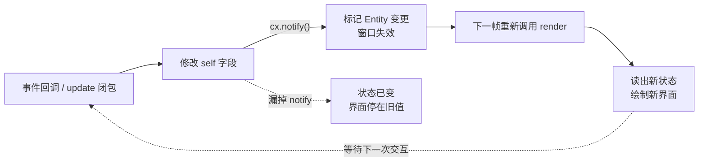

import { Meta } from '@storybook/addon-docs/blocks';

<Meta id="state-and-rerender" title="上手/状态与重渲染" name="Docs" />

# 状态与重渲染

GPUI 是声明式界面：`render` 根据当前状态画一帧画面，但改状态不会自动重画——必须调用 `cx.notify()` 告诉框架"这个实体变了"，窗口才会在下一帧重新执行 `render`。本课建立这条最小闭环：用 `Entity<T>` 持有状态、在事件里改状态并 `notify`、界面读出新状态。读完你能预测：改了字段却没调 `cx.notify()` 时，界面和数据会处于什么状态。

状态流转的完整循环只有一条主线：



日常任务与对应写法（回查入口，各小节展开细节）：

| 任务 | 写法 | 要点 |
| --- | --- | --- |
| 创建状态 | `cx.new(\|cx\| Counter::new(cx))` | 返回 `Entity<Counter>`；`Entity` 没有公开的 `new` |
| 视图内读状态 | `self.count` | `render` 每次重画都拿到最新字段值 |
| 事件内改状态 | `self.count += 1; cx.notify();` | `notify` 必须显式调用 |
| 外部读状态 | `entity.read(cx)` / `entity.read_with(cx, \|c, cx\| ...)` | 句柄不能直接点出字段 |
| 外部改状态 | `entity.update(cx, \|c, cx\| { ...; cx.notify(); })` | 闭包里同样要 `notify` |
| 整体替换值 | `entity.write(cx, value)` | 内部自动 `notify`，唯一例外 |

## 快速上手：最小计数器

三步闭环：`cx.new` 创建实体 → 事件回调里改字段并 `cx.notify()` → `render` 读字段绘制。完整程序（工程骨架沿用安装课，样式精简自官方 `testing` 示例）：

```rust
use gpui::{
    App, Bounds, Context, Render, Window, WindowBounds, WindowOptions,
    div, prelude::*, px, rgb, size,
};
use gpui_platform::application;

// 状态就是普通 Rust 结构体，本身不知道 GPUI 的存在
struct Counter {
    count: i32,
}

impl Counter {
    // 修改状态的入口：改完字段，紧接着调用 cx.notify()
    fn increment(&mut self, cx: &mut Context<Self>) {
        self.count += 1;
        cx.notify();
    }
}

impl Render for Counter {
    fn render(&mut self, _window: &mut Window, cx: &mut Context<Self>) -> impl IntoElement {
        div()
            .size_full()
            .flex()
            .flex_col()
            .justify_center()
            .items_center()
            .gap_4()
            .bg(rgb(0x1e1e2e))
            // 界面直接读 self 的字段：每次重画都拿到当前值
            .child(
                div()
                    .text_3xl()
                    .text_color(rgb(0xcdd6f4))
                    .child(format!("count = {}", self.count)),
            )
            .child(
                div()
                    .id("increment") // 有 id 才能挂 on_click
                    .px_4()
                    .py_2()
                    .bg(rgb(0x313244))
                    .rounded_md()
                    .cursor_pointer()
                    .text_color(rgb(0xcdd6f4))
                    .on_click(cx.listener(|this, _event, _window, cx| {
                        // 事件里拿到 &mut Self，改状态并 notify
                        this.increment(cx);
                    }))
                    .child("+1"),
            )
    }
}

fn main() {
    application().run(|cx: &mut App| {
        let bounds = Bounds::centered(None, size(px(300.), px(200.)), cx);
        cx.open_window(
            WindowOptions {
                window_bounds: Some(WindowBounds::Windowed(bounds)),
                ..Default::default()
            },
            |_window, cx| {
                // cx.new 把结构体交给 GPUI 托管，返回 Entity<Counter>
                // 根视图必须是实现了 Render 的实体
                cx.new(|_cx| Counter { count: 0 })
            },
        )
        .unwrap();
    });
}
```

运行后每点一次 `+1`，数字立即加一。把这行删掉再试：`increment` 里的 `cx.notify();`——按钮照常可点，数字却停在旧值。这就是本课的核心判断，下一节解释为什么。

## Entity：状态的容器

`Entity<T>` 是"指向 GPUI 托管数据的强类型句柄"。注意两个事实：

- 数据不在你的栈上，而是由 `App` 统一持有；`Entity<T>` 只是句柄，`Clone` 一个句柄只是复制引用，不复制数据。
- 当 `T` 实现了 `Render`，这个实体常被称为视图（view）——它是能被画到窗口里的实体。根视图由 `cx.open_window` 的闭包返回。

创建实体的唯一入口是 `cx.new`（`AppContext` trait 的方法，`&mut App` 和 `&mut Context<T>` 上都能调用），传入返回初始值的闭包：

```rust
// 闭包拿到 &mut Context<Counter>，返回 Counter
let counter: Entity<Counter> = cx.new(|cx| Counter { count: 0 });
```

`Entity` 没有公开的 `new`——不允许绕过框架自己构造，`cx.new` 在创建时会登记实体、建立引用计数。docs.rs（0.2.2）上 `Entity` 的方法列表只有 `read`、`read_with`、`update`、`update_in`、`write`、`downgrade`、`entity_id` 等，没有 `new`。

句柄语义还有一个易踩的点：`Entity<T>` 的 `Deref` 目标是 `AnyEntity`，不是 `T`，所以 `counter.count` 无法编译。要碰数据，必须走 `read` / `read_with`（读）或 `update` / `write`（改），见后文。

## cx.notify() 与重渲染循环

`Context<T>::notify` 的文档只有一句：告诉 GPUI 这个实体已经变化，观察者应当收到通知。它的实际效果分两路：

1. **重绘路径**：窗口渲染时会记录"这个窗口正在显示哪些实体"。`cx.notify()` 顺着这条记录找到正在显示当前实体的窗口，把对应视图标记为失效；下一帧重绘窗口时，GPUI 重新调用这些视图的 `render`，于是读到新字段值。
2. **观察者路径**：作为 effect 在本轮 `App::update` 结束时统一执行，用于跨实体联动——这属于 4.2 课的内容，本课只需知道入口存在。

两个直接推论，都是高频判断依据：

- **不 `notify`，数据也真的变了。** `read(cx)` 能读到新值，只是没人安排重画，界面停在旧帧。补上任意一次别的 `notify`（比如点了旁边的按钮），旧变更会一起被画出来。
- **重复 `notify` 无害。** 同一实体同一帧内的多次 `notify` 会合并成一次失效，不会重复重绘；把 `notify` 紧跟在变更语句后面写即可。

最直观的证据是对照实验——给计数器加一个不 `notify` 的变体：

```rust
impl Counter {
    // 正常版：状态变更 + notify，界面立即更新
    fn increment(&mut self, cx: &mut Context<Self>) {
        self.count += 1;
        cx.notify();
    }

    // 静默版：状态真的变了，但界面不动
    fn increment_silently(&mut self, _cx: &mut Context<Self>) {
        self.count += 1;
        // 漏掉 cx.notify()：GPUI 不知道这个实体变了
    }
}
```

把两个方法分别绑到两个按钮上运行：点正常版数字加一；点静默版数字纹丝不动，但此时从外部 `read(cx)` 读出的 `count` 已经是加过的新值——"数据新、界面旧"正是漏 `notify` 的指纹。

`notify` 的位置也有讲究：它是"修改逻辑"的一部分，要放在改状态的地方（事件回调、`update` 闭包），不要放进 `render`。`render` 拿到的同样是 `&mut Context<Self>`，在里面调 `cx.notify()` 能编译、也不报错，但每次重画又把自己标记为失效，窗口被迫每帧重画，CPU 占用持续偏高。

## 事件回调里改状态：cx.listener

按钮的 `on_click` 回调原始签名拿不到视图状态——它只收到事件、窗口和 `&mut App`。`cx.listener` 负责把当前实体借给闭包，是事件里改状态的标准写法：

```rust
// Context<T>::listener 的签名（docs.rs 0.2.2）
pub fn listener<E: ?Sized>(
    &self,
    listener: impl Fn(&mut T, &E, &mut Window, &mut Context<T>) + 'static,
) -> impl Fn(&E, &mut Window, &mut App) + 'static
```

闭包第一个参数 `this` 就是 `&mut Self`，后面照常是事件、窗口和当前实体的 `Context`。绑定分两半：

```rust
div()
    .id("increment") // 交互元素必须有 id，on_click 挂在有状态的 div 上
    .on_click(cx.listener(|this, _event, _window, cx| {
        this.count += 1;
        cx.notify();
    }))
    .child("+1")
```

两点值得记住：`on_click` 定义在 `StatefulInteractiveElement` 上，所以先 `.id(...)` 再 `.on_click(...)`；闭包里的 `cx` 已经是 `&mut Context<Self>`，改完状态直接 `cx.notify()`，不需要再包一层。官方 `testing` 示例的按钮、以及通过 `on_action` 触发的方法（`increment`、`decrement`）都是同一模式。

## 外部读写 Entity：read、update、write

视图自己内部用 `self` 就够了；当另一个视图、模块或测试拿着 `Entity<T>` 句柄时，用这四个入口（签名取自 docs.rs 0.2.2）：

```rust
// 读：拿一个 &T 引用，要求 &App
pub fn read<'a>(&self, cx: &'a App) -> &'a T;

// 读：任何上下文可用，闭包里取值立即返回
pub fn read_with<R, C: AppContext>(&self, cx: &C, f: impl FnOnce(&T, &App) -> R) -> C::Result<R>;

// 改：闭包里拿到 &mut T 和 &mut Context<T>
pub fn update<R, C: AppContext>(
    &self,
    cx: &mut C,
    update: impl FnOnce(&mut T, &mut Context<'_, T>) -> R,
) -> C::Result<R>;

// 改：整体替换值
pub fn write<C: AppContext>(&self, cx: &mut C, value: T) -> C::Result<()>;
```

读侧优先 `read_with`：取个值就结束，不留悬着的应用内引用；官方示例的测试部分也注释了部分测试上下文只支持 `read_with`。改侧的标准写法是在 `update` 闭包里改字段并 `notify`：

```rust
counter.update(cx, |counter, cx| {
    counter.count = 42;
    cx.notify(); // 外部修改同样要显式 notify
});

let current = counter.read_with(cx, |counter, _cx| counter.count);
assert_eq!(current, 42);
```

`write` 是唯一的例外——它内部就是"update + 自动 `cx.notify()`"：

```rust
// 等价于 counter.update(cx, |c, cx| { *c = value; cx.notify(); })
counter.write(cx, Counter { count: 0 });
```

所以记住一条规则就够：**除 `write` 外，所有修改入口都要自己调 `cx.notify()`**。在异步任务里通过 `update` 改状态也是同一条规则（异步细节见 4.4 课）。

## 常见问题

- 状态改了，界面没更新？
  在变更语句附近找 `cx.notify()`——这是第一排查动作，且几乎总是答案。`Entity::update`、事件回调、异步任务里的修改默认都不触发重画，只有 `write` 自动 `notify`。判断依据：从外部 `read(cx)` 能读到新值而界面不动，就是漏了 `notify`。
- `counter.count` 编译报错，说 `Entity<Counter>` 没有 `count` 字段？
  句柄不是数据。`Entity<T>` 解引用到 `AnyEntity`，先 `read` / `read_with` 拿引用，或 `update` 拿 `&mut T` 再碰字段。
- 界面不操作也在持续重绘、CPU 占用偏高？
  检查 `render` 里是否调用了 `cx.notify()`。重画自己触发下一次重画，形成空转循环；把 `notify` 移回修改状态的事件回调或 `update` 闭包。

## 总结回顾

摘要：

状态放在普通 Rust 结构体里，经 `cx.new` 交给 GPUI 托管后拿到 `Entity<T>` 句柄——数据由 `App` 持有，句柄克隆廉价但不能直接点出字段。改状态的路径有三条：视图方法里改 `self` 后调 `cx.notify()`，事件回调经 `cx.listener` 拿到 `&mut Self` 走同一条路，外部则用 `entity.update`（闭包里同样 `notify`），只有 `entity.write` 自动 `notify`。`cx.notify()` 标记实体变更，让正在显示它的窗口失效，下一帧重跑 `render` 读出新状态——不调用它，数据照变、界面停在旧值。

一句话：

> 修改状态不会让界面更新；只有 `cx.notify()` 把变更报告给 GPUI，窗口才会在下一帧重新执行 `render` 读出新状态。

知识要点：

- `Entity<T>` 是什么，为什么创建实体的唯一入口是 `cx.new` 而没有公开的 `Entity::new`
- 事件回调里为什么需要 `cx.listener`，`.id(...)` 和 `.on_click(...)` 的先后关系
- `read`、`read_with`、`update`、`write` 各自的用途，哪个自动 `notify`
- "状态变了界面没更新"的第一排查动作是什么
- 为什么不能在 `render` 里调用 `cx.notify()`
- 哪些内容不在本课：`observe` / `subscribe` / `WeakEntity` / `Global` 在 4.2 课，异步任务更新在 4.4 课

## 参考资料

- [Entity - docs.rs/gpui 0.2.2](https://docs.rs/gpui/latest/gpui/struct.Entity.html)
- [Context（含 notify、listener）- docs.rs/gpui 0.2.2](https://docs.rs/gpui/latest/gpui/struct.Context.html)
- [Render trait - docs.rs/gpui 0.2.2](https://docs.rs/gpui/latest/gpui/trait.Render.html)
- [官方示例 testing.rs（计数器：状态、点击、notify 完整模式）](https://github.com/zed-industries/zed/blob/main/crates/gpui/examples/testing.rs)
- [官方示例 ownership_post.rs（cx.new、read、update 的用法）](https://github.com/zed-industries/zed/blob/main/crates/gpui/examples/ownership_post.rs)
- [官方文档 contexts.md（Entity 数据由 App 持有、view 的定义）](https://github.com/zed-industries/zed/blob/main/crates/gpui/docs/contexts.md)
