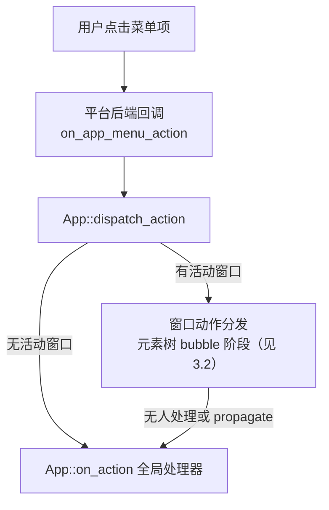

import { Meta } from '@storybook/addon-docs/blocks';

<Meta id="system-integration" title="工程化/系统集成" name="Docs" />

# 系统集成

桌面应用不能只活在 GPUI 画出来的窗口里：用户期待应用有系统菜单栏、能在通知中心弹通知、窗口镶边和亮暗主题跟系统走。GPUI 把这些"与操作系统打交道"的能力收敛成四组 API：应用菜单（`App::set_menus` 一族）、系统通知（`SystemNotification` 一族）、窗口外观（`TitlebarOptions` 与 `WindowAppearance` 一族），以及承载这一切差异的平台后端。读完本课你能预测：挂一个菜单需要 `Menu` + `MenuItem` + Action 三件套；发一条通知需要身份、发送、响应回调三步；窗口标题栏和主题各有"声明一次"与"持续观察"两种用法。

版本口径（2026-10 核实）：本课以 zed 仓库 main 分支为讲解基线，与 crates.io 发布版 gpui 0.2.2（2025-10-22，当前仍为最新）的差异在开场表和正文逐处标注"仅 main"。入口写法沿用第 1.2 课口径：main 分支用 `gpui_platform::application().run(...)`（`gpui_platform` 未发布到 crates.io），0.2.2 写 `Application::new().run(...)`，本课正文代码按 main 写法。系统通知、强制主题、层壳等新能力只在 main 分支存在；应用菜单与窗口外观的多数 API 在 0.2.2 就已发布。

开场参考表：系统集成 API 家族与平台可用性。✓ 表示平台实现了真实行为，"—"表示该平台没有这项能力或调用是空操作。

| 能力 | 核心 API | 0.2.2 | macOS | Windows | Linux |
| --- | --- | --- | --- | --- | --- |
| 应用菜单栏 | `App::set_menus` + `Menu`/`MenuItem` | ✓ | 原生菜单栏 | 仅存储，自绘 | 仅存储，自绘 |
| Dock / 任务栏菜单 | `App::set_dock_menu` | ✓ | Dock 菜单 | Jump List | — |
| 菜单项动作处理 | `App::on_action` | ✓ | ✓ | ✓ | ✓ |
| 应用身份 | `App::set_app_identity` | 仅 main | —（身份来自 bundle） | AUMID | 通知应用名 |
| 发送 / 替换通知 | `App::show_system_notification` | 仅 main | ✓ 需 bundle | ✓ toast | ✓ D-Bus |
| 撤回通知 | `App::dismiss_system_notification` | 仅 main | ✓ | ✓ | ✗ 自动过期 |
| 通知点击回调 | `App::on_system_notification_response` | 仅 main | ✓ | ✓ | ✓ |
| 读取主题外观 | `App::window_appearance` / `Window::appearance` | ✓ | ✓ 四值 | ✓ 仅 Light/Dark | ✓ 仅 Light/Dark |
| 观察 / 强制主题 | `Context::observe_window_appearance` / `App::set_window_appearance` | ✓ / 仅 main | ✓ / ✓ | ✓ / — | ✓ / — |
| 自定义标题栏 | `TitlebarOptions`（`appears_transparent` 等） | ✓ | ✓ | ✓ | — 用 CSD |
| 窗口按钮布局 | `traffic_light_position` / `App::button_layout` | ✓ / 仅 main | ✓ | — | ✓ |
| 可移动开关 | `WindowOptions.is_movable` | ✓ | ✓ | ✓ | Linux 忽略 |
| 客户端装饰 | `window_decorations` 家族 | ✓ | — | — | ✓ Wayland/X11 |
| Wayland 层壳 | `WindowKind::LayerShell` | 仅 main | — | — | ✓ 需 wayland |
| 合成器查询 | `App::compositor_name` | ✓ | — | — | ✓ |

## 应用菜单

菜单栏是应用级的，不是窗口级的：`App::set_menus` 声明的是一份"菜单数据"，交给平台后端决定怎么呈现。macOS 后端把它构建成原生 `NSMenu` 挂到菜单栏；Windows 与 Linux 后端只把数据存起来（`App::get_menus` 可读回），菜单 UI 需要应用自己绘制。菜单项分两类：绑定 Action 的项（点击后进入与键盘快捷键相同的动作分发链路），以及系统托管的项（如 macOS 的 Services 子菜单）。`set_menus` 是整体替换语义，重复调用以最后一次为准。

### 声明菜单：Menu 与 MenuItem

`Menu` 是一个菜单（主菜单或子菜单）：`Menu::new(name).items([...])`，可加 `.disabled(true)` 整体禁用。`MenuItem` 是菜单项，全部通过关联函数构造：

```rust
use gpui::{
    actions, App, Context, Menu, MenuItem, OsAction, SystemMenuType, Window, WindowOptions, div,
    prelude::*,
};
use gpui_platform::application; // 0.2.2 无此 crate：入口改用 Application::new()

struct Demo;

impl Render for Demo {
    fn render(&mut self, _: &mut Window, _: &mut Context<Self>) -> impl IntoElement {
        div().size_full().child("菜单示例")
    }
}

// 菜单项要触发的动作，与快捷键共用同一套 Action（见 3.2 课）
actions!(demo, [Quit, About, Redo]);

fn main() {
    application().run(|cx: &mut App| {
        // 应用级动作处理器：菜单点击最终会汇到这里
        cx.on_action(|_: &Quit, cx| cx.quit());
        cx.on_action(|_: &About, _cx| {
            // 打开"关于"窗口
        });

        // 声明整个菜单栏，整体替换
        cx.set_menus([Menu::new("Demo").items([
            MenuItem::action("关于 Demo", About),
            MenuItem::separator(),
            MenuItem::submenu(Menu::new("文件").items([
                MenuItem::action("退出", Quit),
                // 动作仍走自己的 Redo 处理器，OS 侧按标准重做语义处理
                MenuItem::os_action("重做", Redo, OsAction::Redo),
            ])),
            MenuItem::action("灰色的项", About).disabled(true),
            MenuItem::action("带勾选态的项", About).checked(true),
            // 系统托管的子菜单：目前只有 macOS 应用菜单的 Services
            MenuItem::os_submenu("Services", SystemMenuType::Services),
        ])]);

        cx.open_window(WindowOptions::default(), |_, cx| cx.new(|_| Demo))
            .unwrap();
        // 把应用带到前台，菜单栏才可见
        cx.activate(true);
    });
}
```

`MenuItem` 的构造方法一览：

| 构造方法 | 用途 |
| --- | --- |
| `MenuItem::action(name, action)` | 点击后触发给定 Action 的普通菜单项 |
| `MenuItem::os_action(name, action, os_action)` | 同上，并告知 OS 对应的标准编辑语义 |
| `MenuItem::separator()` | 分隔线 |
| `MenuItem::submenu(menu)` | 嵌套子菜单 |
| `MenuItem::os_submenu(name, menu_type)` | 系统托管的子菜单，`SystemMenuType` 目前只有 `Services`（macOS 应用菜单的服务项） |

三个可追加的修饰：`.checked(bool)` 设勾选态（只对 Action 项生效）、`.disabled(bool)` 禁用（Action 项和子菜单都支持）。`OsAction` 有六个值：`Cut`、`Copy`、`Paste`、`SelectAll`、`Undo`、`Redo`——菜单项仍触发你自己的 Action，OS 侧按标准语义处理（例如 macOS 给它配标准快捷键与编辑菜单行为）。

### 菜单项触发 Action

菜单项里存的只是一个 `Box<dyn Action>`。点击后的完整链路：



`App::on_action` 注册的处理器在动作分发的 bubble 阶段末尾执行：窗口内的 `on_action` 处理器（挂在 `div` 上，见 3.2 课）先有机会消费动作，只有没人处理或它们显式 `cx.propagate()` 时才轮到全局处理器。所以菜单与快捷键天然共享同一套语义：给 Action 绑了 `KeyBinding`，按键触发和菜单点击走的是同一条管道。

两个经常要用到的细节：

- **动态更新菜单。** `checked` / `disabled` 是声明那一刻的快照，状态变化后必须重新调用 `set_menus` 整体重建。官方 `set_menus.rs` 示例的模式是：状态放 `Global`，动作处理器里改完状态再重建菜单。

```rust
// 状态变化后重建菜单：菜单是数据，整体替换即可
fn toggle_check(_: &ToggleCheck, cx: &mut App) {
    let state = cx.global_mut::<AppState>();
    state.view_mode.toggle();
    set_app_menus(cx); // 内部再次调用 cx.set_menus(...)
}
```

- **快捷键显示。** macOS 后端构建菜单时会拿菜单项的 Action 去 `Keymap` 里查绑定（`bindings_for_action`），把第一条匹配的按键序列显示为加速键。没绑 `KeyBinding` 的菜单项就没有快捷键显示——想让菜单出现 `⌘Q` 这类标记，去 3.2 课的 `KeyBinding` 里绑定即可。

## 系统通知

系统通知是"发出去就不管"的数据加上一个全局响应回调，整个家族是 main 分支新增（0.2.2 完全没有这组 API）。用法是三步：启动早期设置应用身份，注册响应回调，然后随时发送。`SystemNotification` 的 `tag` 是它的钥匙：同 `tag` 重发会替换上一条（平台支持时），点击响应也靠 `tag` 送回来。

```rust
// 类型均来自 gpui：SystemNotification / SystemNotificationAction / SystemNotificationResponse

// 1. 启动早期设置身份：identifier 在 Windows 上成为 AppUserModelID（AUMID），
//    在 Linux 上作为通知的应用名；macOS 不需要（身份来自 app bundle）
cx.set_app_identity("com.example.myapp", "My App");

// 2. 注册响应回调：点通知正文或按钮都会回到这里。
//    后注册的会替换先注册的，全局只有一个分发点
cx.on_system_notification_response(|response, _cx| {
    let SystemNotificationResponse { tag, action_id } = response;
    match action_id {
        Some(id) => { /* 用户点了 id 对应的按钮 */ }
        None => { /* 用户点了通知正文 */ }
    }
});

// 3. 发送：tag 相同即替换上一条
cx.show_system_notification(SystemNotification {
    tag: "download-finished".into(),
    title: "下载完成".into(),
    body: "gpui-0.2.2.tar.gz 已就绪".into(),
    actions: vec![
        SystemNotificationAction { id: "open".into(), label: "打开".into() },
        SystemNotificationAction { id: "snooze".into(), label: "稍后提醒".into() },
    ],
});

// 撤回指定 tag 的通知（尽力而为）
cx.dismiss_system_notification("download-finished");
```

数据结构很薄：`SystemNotification` 由 `tag`、`title`、`body` 和 `actions`（`Vec<SystemNotificationAction>`，每项是 `id` + `label`）组成；响应 `SystemNotificationResponse` 只带回 `tag` 和 `action_id: Option<SharedString>`——`None` 表示用户点的是通知正文，`Some(id)` 对应按钮的 `id`。无法显示按钮的平台会把通知不带按钮地发出去。

三个平台背后是三套完全不同的机制，行为差异直接来自机制差异：

| 平台 | 实现 | 关键差异 |
| --- | --- | --- |
| macOS | `UNUserNotificationCenter` | 必须以 app bundle 运行，否则不投递；初始化是惰性的，第一次发送或注册回调才触发系统授权弹窗 |
| Windows | WinRT toast 通知 | 依赖 AUMID：有包身份的进程系统自动授予，未打包进程必须先 `set_app_identity` |
| Linux | XDG notifications D-Bus（`notify-rust` 实现） | 正文点击即"默认"响应；`dismiss_system_notification` 不生效——协议只能经活跃句柄关闭，已投递的通知等它自动过期；需要桌面通知服务在运行 |

## 窗口外观

窗口外观要回答三个问题：标题栏归谁画、窗口按钮放哪、亮暗主题怎么跟系统走。macOS 和 Windows 用 `TitlebarOptions` 控制原生标题栏；Linux（Wayland/X11）多了一条客户端装饰（CSD）路线。`WindowOptions` 里与外观相关的字段默认值：`titlebar` 默认 `Some(TitlebarOptions::default())`（有原生标题栏），`is_movable`、`is_resizable`、`is_minimizable` 默认全是 `true`。

### 标题栏：原生与自绘

`TitlebarOptions` 有三个字段：

| 字段 | 含义 | 平台 |
| --- | --- | --- |
| `title` | 初始窗口标题 | 全平台 |
| `appears_transparent` | 隐藏系统标题栏条，把空间让给自绘内容 | 仅 macOS / Windows；Linux 走 `window_decorations` |
| `traffic_light_position` | macOS 红绿灯按钮位置 | 仅 macOS |

`appears_transparent: true` 之后，标题栏区域的拖动仍由系统接管（macOS 上是 AppKit 处理）。想完全自己管拖动的窗口（比如自绘工具条的悬浮窗）再加一个开关：`app_owns_titlebar_drag: true`（仅 main 分支字段，仅 macOS 生效）——它把整个内容视图标记为"应用拥有的标题栏内容"，AppKit 既不再替你拖窗口，也不再为区分双击而延迟标题栏点击；它与 `is_movable` 相互独立，窗口仍可通过自己的拖动逻辑移动。

```rust
use gpui::{TitlebarOptions, WindowOptions, prelude::*};

cx.open_window(
    WindowOptions {
        titlebar: Some(TitlebarOptions {
            title: Some("自绘标题栏".into()),
            appears_transparent: true, // 隐藏系统标题栏条
            ..Default::default()
        }),
        ..Default::default()
    },
    |_, cx| cx.new(|_| CustomTitlebar),
)
.unwrap();
```

两个配套能力：

- **可移动开关。** `WindowOptions.is_movable: false` 时用户不能拖动窗口（macOS 上对应 `NSWindow.isMovable`，同时禁用 Window 菜单里的平铺项），但程序化移动不受影响。注意 Linux 后端当前不消费这个字段。官方 `window_movable.rs` 示例开了四个窗口对照"原生 / 自绘标题栏 × 可移动 / 不可移动"。
- **窗口控制热区。** 自绘标题栏上的关闭、最小化、最大化、拖拽区域，可以在 paint 阶段用 `window.insert_window_control_hitbox(area, hitbox)` 注册成系统感知的控制区，`WindowControlArea` 有 `Drag`、`Close`、`Max`、`Min` 四个值。

### 主题跟随：WindowAppearance

`WindowAppearance` 有四个值：`Light`、`VibrantLight`、`Dark`、`VibrantDark`（默认 `Light`）。带 Vibrancy 的两个值只在 macOS 有实义——它们对应 `NSAppearance` 的 `NSAppearanceNameVibrantLight` / `NSAppearanceNameVibrantDark`；Linux 的主题源只区分亮暗，映射到 `Light` / `Dark`。

读取与观察：

```rust
use gpui::{Context, Window, WindowAppearance};

// 应用级读取（cx 为 &mut App，例如 run 回调里）
let appearance = cx.window_appearance();
// 窗口级读取（能拿到 &Window 的任何地方）
let appearance = window.appearance();

// 在视图构建时挂观察者（cx 为 &mut Context<Self>）：
// 系统切主题时收到回调，返回 Subscription
cx.observe_window_appearance(window, |_, window, cx| {
    match window.appearance() {
        WindowAppearance::Dark | WindowAppearance::VibrantDark => { /* 换深色主题色 */ }
        _ => { /* 换浅色主题色 */ }
    }
    cx.notify(); // 让视图用新主题色重绘
})
.detach();
```

`Context::observe_window_appearance` 的回调签名是 `FnMut(&mut T, &mut Window, &mut Context<T>)`，视图销毁后观察自动停止；`Window::observe_window_appearance` 提供不绑定视图的版本，回调签名是 `FnMut(&mut Window, &mut App)`。官方 `window_shadow.rs` 示例在回调里调用 `window.refresh()` 强制重绘，就是这个观察者的标准用法。

强制主题是 main 分支新增：`cx.set_window_appearance(Some(WindowAppearance::Dark))`。它在 macOS 上设置 `NSApplication.appearance`，改变每个窗口的原生镶边（边框与标题栏）——典型场景是应用主题是深色而系统处于浅色模式时，让窗口边缘不违和。强制期间窗口不再跟随系统亮暗变化，传 `None` 恢复跟随；其他平台该方法是无操作。

各平台的主题来源：macOS 直读 `NSAppearance`；Windows 读取系统深色模式设置；Linux 经 XDG desktop portal 的 `color-scheme` 设置（`PreferDark` 映射为 `Dark`，其余为 `Light`），运行时切换会推送变化。

### Linux 客户端装饰

Wayland 和 X11 上，窗口装饰（边框、标题栏、阴影）可以归合成器（server-side）也可以归应用（client-side）。创建窗口时用 `WindowOptions.window_decorations: Option<WindowDecorations>` 发出请求——文档明确平台可能忽略满足不了的请求。运行时用 `window.window_decorations()` 判定实际结果：

```rust
use gpui::{Context, Decorations, Window, px};

fn render(&mut self, window: &mut Window, _cx: &mut Context<Self>) -> impl IntoElement {
    let decorations = window.window_decorations();
    let shadow_size = px(10.0);
    window.set_client_inset(shadow_size); // 声明边缘装饰区的宽度

    match decorations {
        // 合成器已画好边框：直接铺内容
        Decorations::Server => self.render_content(),
        // 应用自己负责：边框、圆角、阴影、拖拽、缩放全要自己处理
        Decorations::Client { tiling } => self.render_client_decorations(tiling),
    }
}
```

`Client` 模式的工具箱，每个都是"把一件事交还合成器"：

| API | 用途 |
| --- | --- |
| `window.set_client_inset(inset)` | 声明窗口边缘透明装饰区（阴影、缩放热区）的宽度 |
| `window.start_window_resize(edge)` | 在边缘热区按下时发起合成器托管的缩放，`ResizeEdge` 有八个方向 |
| `window.start_window_move()` | 把窗口拖动交给合成器；Wayland 上拖动期间可能收不到事件 |
| `window.show_window_menu(position)` | 右键标题栏时弹出原生窗口菜单（最小化 / 最大化等） |

官方 `window_shadow.rs` 示例是完整的 CSD 教科书：`Decorations::Client` 时用 canvas 做鼠标命中测试算出八个 `ResizeEdge` 方向并设置对应光标，`BoxShadow` 自绘窗口阴影，`on_mouse_down` 里按位置分派 `start_window_resize` 或 `start_window_move`，右键调 `show_window_menu`。写 CSD 前先把它的 `resize_edge` 函数抄走。

## 平台差异

开场表给了可用性矩阵，这里按平台说清每项能力背后是什么机制、有什么平台独有能力。跨平台代码的判断依据只有一个：能力差异源于平台后端实现差异，而不是 API 缺失——同一份 `set_menus` 调用在三个平台都合法，效果不同。

### macOS

菜单与 Dock 菜单都是原生的（`NSMenu`），菜单项加速键自动从 `Keymap` 查询显示。通知走 `UNUserNotificationCenter`，必须以 app bundle 运行。主题可读取可强制（`set_window_appearance`），Vibrancy 两值只有这里有效。独有能力：`traffic_light_position` 定制红绿灯位置、`tabbing_identifier` 让同标识窗口合并为原生标签页、`App::on_reopen` 响应 Dock 图标点击、`cx.activate(true)` 把应用带到前台。

### Windows

菜单同样只存储、应用自绘；`set_dock_menu` 映射为任务栏 Jump List，main 分支还有 `update_jump_list` 管理最近文件。通知是 WinRT toast，未打包进程必须先 `set_app_identity` 拿到 AUMID 才能可靠投递。`appears_transparent` 有效；`button_layout`、`traffic_light_position` 均无——窗口按钮布局由系统固定。

### Linux（Wayland 与 X11）

桌面后端由 feature 决定：`wayland` 与 `x11` 至少启用一个（`gpui` 与 `gpui_platform` 的默认 features 都带全两个）。菜单只存储自绘；通知走 XDG notifications D-Bus，需要桌面通知服务在运行；主题经 XDG desktop portal 读取，只有亮暗两态。本课的客户端装饰全家桶（`window_decorations`、`set_client_inset`、`start_window_move` / `start_window_resize`、`show_window_menu`）都是这一平台的日常。其他要点：`app_id` 供桌面环境分组窗口、`icon` 字段仅 X11 生效、`App::compositor_name()` 查询当前合成器名、`is_movable` 当前被忽略。

### Wayland 层壳：WindowKind::LayerShell

层壳（layer shell）是 Wayland 的 `zwlr_layer_shell_v1` 协议能力，用于 dock、通知条、壁纸这类"贴在屏幕层上"的窗口，普通应用窗口用不到。仅 main 分支可用，且编译门控是 `all(target_os = "linux", feature = "wayland")`——0.2.2 的 `WindowKind` 没有这个变体。合成器不支持该协议时创建会失败（`LayerShellNotSupportedError`）。

```rust
// 仅 main 分支、Linux + wayland feature 下可用（gpui::layer_shell::* 引入 Anchor 等）
use gpui::{
    layer_shell::*, Bounds, Size, WindowBackgroundAppearance, WindowBounds, WindowKind,
    WindowOptions, point, px,
};

cx.open_window(
    WindowOptions {
        titlebar: None, // 层壳窗口没有标题栏
        window_background: WindowBackgroundAppearance::Transparent,
        app_id: Some("gpui-layer-shell-example".into()),
        window_bounds: Some(WindowBounds::Windowed(Bounds {
            origin: point(px(0.), px(0.)),
            size: Size::new(px(500.), px(200.)),
        })),
        kind: WindowKind::LayerShell(LayerShellOptions {
            namespace: "gpui".into(), // 合成器按它匹配规则，创建后不可改
            anchor: Anchor::LEFT | Anchor::RIGHT | Anchor::BOTTOM, // 底部横向铺开
            margin: Some((px(0.), px(0.), px(40.), px(0.))), // 上、右、下、左
            keyboard_interactivity: KeyboardInteractivity::None, // 不抢键盘焦点
            ..Default::default()
        }),
        ..Default::default()
    },
    |_, cx| cx.new(|_| Clock),
)
.unwrap();
```

`LayerShellOptions` 字段：`namespace` 给合成器匹配规则用；`layer` 选渲染层（`Background` / `Bottom` / `Top` / `Overlay`，默认 `Overlay`）；`anchor` 是 bitflags，可组合，`Anchor::LEFT | Anchor::RIGHT` 即横向拉伸；`exclusive_zone` / `exclusive_edge` 请求合成器为这块区域避让其他窗口；`margin` 按 CSS 顺序（上、右、下、左）；`keyboard_interactivity` 选 `None` / `Exclusive` / `OnDemand`。官方 `layer_shell.rs` 示例用它做了一个透明底的桌面时钟。

## 最佳实践

- **菜单与快捷键共用 Action，不要造两套语义。** 菜单项存的就是 `Box<dyn Action>`，点击后进同一条分发管道；给 Action 绑好 `KeyBinding`，macOS 菜单的加速键显示是免费的。
- **把菜单当快照，不做增量更新。** `checked` / `disabled` 在声明时定格；状态放 `Global`，变化后整体重建 `set_menus`（官方 `set_menus.rs` 的 toggle 模式）。这也是唯一能改菜单的方式。
- **通知 `tag` 当业务 id 设计。** "同 tag 替换"正好实现"进度类通知只保留最新一条"；响应回调全局唯一、后注册覆盖先注册，所以做一个集中分发点按 `tag` 路由，而不是在多处注册。
- **自绘标题栏按平台拆三条路径。** macOS 用 `appears_transparent`（需要自己管拖动再加 `app_owns_titlebar_drag`），Windows 用 `appears_transparent`，Linux 请求 `window_decorations` 走 CSD；运行时用 `window.window_decorations()` 分支，别在编译期硬编码假设。
- **主题色不进缓存。** 在 `observe_window_appearance` 回调里重读 `window.appearance()` 再 `cx.notify()`，让颜色集中在"按 appearance 派生"的一个函数里；把解析好的颜色存进 Entity 字段是深浅切换失灵的常见根源。
- **平台专属 API 用 feature 和 `cfg!` 门控。** 层壳这类按 feature 编译的 API，用 `#[cfg(all(target_os = "linux", feature = "wayland"))]` 隔离代码；跨平台工程以"非 Linux 构建不引入该模块"为底线。

## 常见问题

- macOS 上通知发不出来，也没有授权弹窗
  先确认运行方式：必须从 app bundle 启动，直接 `cargo run` 出来的裸二进制不会投递（官方 `system_notifications.rs` 在界面上标注了这一点）。授权弹窗是惰性的：第一次 `show_system_notification` 或注册响应回调时才触发。
- Windows / Linux 上调用 `set_menus` 后屏幕上没有菜单栏
  不是 bug：这两个平台后端只存储菜单数据（`App::get_menus` 可读回），不渲染系统菜单栏，菜单 UI 需要应用自绘。只有 macOS 有原生菜单栏。
- 菜单项没显示快捷键（macOS）
  加速键来自 `Keymap` 里按 Action 查到的绑定；没绑 `KeyBinding` 的菜单项就没有快捷键显示。回 3.2 课给该 Action 绑定按键。
- `set_window_appearance` 调了没反应
  两个前提：API 仅 main 分支（0.2.2 没有），且只对 macOS 生效、其他平台是无操作。另外强制期间系统主题变化不再推送，恢复跟随要传 `None`。
- Linux 上 `appears_transparent: true` 没有效果
  该字段文档明确只对 macOS / Windows 有意义。Linux 的标题栏自绘走 `WindowOptions.window_decorations` 请求客户端装饰，再用 `window_decorations()` 判定结果。
- Wayland 上 `is_movable: false` 的窗口还是被拖走了
  Linux 后端当前不消费这个字段（源码里该参数标注为 dead code），窗口可移动性由合成器管理。这个开关目前只在 macOS / Windows 可靠。
- `WindowKind::LayerShell` 编译不过
  检查三点：依赖是否来自 main 分支语境（0.2.2 的 `WindowKind` 没有该变体）、是否启用了 `wayland` feature、目标系统是否为 Linux。
- CSD 窗口拖不动、边缘缩放没反应
  `Decorations::Client` 模式下系统不会替你处理任何装饰交互：在自己的标题栏区域调 `start_window_move`，在边缘热区按方向调 `start_window_resize(ResizeEdge)`，右键调 `show_window_menu`。参照 `window_shadow.rs` 的命中测试写法。

## 总结回顾

摘要：

系统集成 API 把桌面应用的"系统接缝"收敛成三组声明式数据加一组平台后端。应用菜单用 `App::set_menus` 声明 `Menu` / `MenuItem` 树，菜单项携带 `Box<dyn Action>`，点击后经 `App::dispatch_action` 进入与键盘快捷键相同的动作分发管道（活动窗口 bubble 优先，无人处理落到 `App::on_action` 全局处理器）；菜单是快照，勾选态与禁用态变化后整体重建，macOS 之外的平台只存数据、菜单 UI 自绘。系统通知（仅 main）按"身份 - 发送 - 响应"三步走：`set_app_identity`、`show_system_notification`（同 tag 替换）、`on_system_notification_response` 收 `SystemNotificationResponse`，三平台分别是 `UNUserNotificationCenter`（需 bundle）、WinRT toast（需 AUMID）、XDG D-Bus（不可撤回）。窗口外观分两条线：标题栏用 `TitlebarOptions`（`appears_transparent` 仅 macOS / Windows，Linux 走 `window_decorations` 客户端装饰，配套 `set_client_inset`、`start_window_move` / `start_window_resize`、`show_window_menu`）；主题用 `WindowAppearance` 四值加 `observe_window_appearance` 观察，main 分支另可在 macOS 强制主题。Wayland 层壳是 Linux + wayland feature 下的特殊窗口类型，用于 dock 与覆盖层。

一句话：

> 系统集成的 API 都是"声明数据、平台解释"——菜单、通知、外观各声明一次，差异全部由平台后端消化，跨平台代码只需要在能力缺失处分支。

知识要点：

- 应用菜单怎么挂？`Menu` / `MenuItem` 有哪些构造方法与修饰，`set_menus` 的替换语义是什么？
- 菜单点击的完整分发链路是什么？`App::on_action` 与窗口内动作处理器的先后关系？
- 菜单项的勾选态、禁用态如何更新？macOS 菜单的快捷键显示从哪来？
- 发送一条系统通知需要哪三步？`tag` 在替换与响应中各起什么作用？
- 三个平台的通知机制各是什么？哪些平台场景会导致通知发不出来？
- `TitlebarOptions` 三个字段各自的平台限制？`is_movable` 与 `app_owns_titlebar_drag` 的区别？
- `WindowAppearance` 四个值的平台实义？读取、观察、强制主题分别用哪个 API？
- Linux 客户端装饰的判定与工具箱：`Decorations`、`set_client_inset`、`start_window_move` / `start_window_resize`、`show_window_menu` 各解决什么问题？
- 本课哪些 API 仅 main 分支可用？层壳窗口的编译门控条件是什么？

## 参考资料

- [官方示例 `examples/set_menus.rs`](https://github.com/zed-industries/zed/blob/main/crates/gpui/examples/set_menus.rs)（菜单声明、动作注册、动态重建的完整对照）
- [官方示例 `examples/system_notifications.rs`](https://github.com/zed-industries/zed/blob/main/crates/gpui/examples/system_notifications.rs)（通知发送、替换、撤回、响应回调）
- [官方示例 `examples/window_movable.rs`](https://github.com/zed-industries/zed/blob/main/crates/gpui/examples/window_movable.rs)（`is_movable` 与自绘标题栏组合对照）
- [官方示例 `examples/window_shadow.rs`](https://github.com/zed-industries/zed/blob/main/crates/gpui/examples/window_shadow.rs)（客户端装饰完整实现与外观观察者）
- [官方示例 `examples/layer_shell.rs`](https://github.com/zed-industries/zed/blob/main/crates/gpui/examples/layer_shell.rs)（Wayland 层壳窗口）
- [`crates/gpui/src/platform.rs`](https://github.com/zed-industries/zed/blob/main/crates/gpui/src/platform.rs)（`SystemNotification` 家族、`WindowOptions`、`TitlebarOptions`、`WindowAppearance`、`Platform` trait 契约与 `layer_shell` 模块的 feature 门控）
- [`crates/gpui/src/platform/app_menu.rs`](https://github.com/zed-industries/zed/blob/main/crates/gpui/src/platform/app_menu.rs)（`Menu` / `MenuItem` / `OsAction` / `SystemMenuType` 定义与菜单动作桥接）
- [`crates/gpui/src/platform/layer_shell.rs`](https://github.com/zed-industries/zed/blob/main/crates/gpui/src/platform/layer_shell.rs)（`LayerShellOptions` / `Layer` / `Anchor` / `KeyboardInteractivity`）
- [`crates/gpui/src/app.rs`](https://github.com/zed-industries/zed/blob/main/crates/gpui/src/app.rs)（`App::set_menus` / `on_action` / 通知与外观方法 / `dispatch_action`）
- [`crates/gpui/src/window.rs`](https://github.com/zed-industries/zed/blob/main/crates/gpui/src/window.rs)（`Window` 外观与 CSD 方法、`WindowControlArea`）
- [`crates/gpui/src/app/context.rs`](https://github.com/zed-industries/zed/blob/main/crates/gpui/src/app/context.rs)（`Context::observe_window_appearance`）
- [`crates/gpui/README.md`](https://github.com/zed-industries/zed/blob/main/crates/gpui/README.md)（`gpui_platform` 入口与平台 feature 说明）
- [`crates/gpui/Cargo.toml`](https://github.com/zed-industries/zed/blob/main/crates/gpui/Cargo.toml)（gpui 自身 feature 定义，`wayland` 门控 `layer_shell`）
- [`crates/gpui_platform/src/gpui_platform.rs`](https://github.com/zed-industries/zed/blob/main/crates/gpui_platform/src/gpui_platform.rs)（`application()` 入口实现）
- [`crates/gpui_platform/Cargo.toml`](https://github.com/zed-industries/zed/blob/main/crates/gpui_platform/Cargo.toml)（`font-kit` / `wayland` / `x11` feature 到平台后端 crate 的转发）
- [`crates/gpui_macos/src/system_notifications.rs`](https://github.com/zed-industries/zed/blob/main/crates/gpui_macos/src/system_notifications.rs)（macOS `UNUserNotificationCenter` 实现，惰性授权与 bundle 要求）
- [`crates/gpui_windows/src/system_notifications.rs`](https://github.com/zed-industries/zed/blob/main/crates/gpui_windows/src/system_notifications.rs)（Windows toast 实现）
- [`crates/gpui_linux/src/linux/system_notifications.rs`](https://github.com/zed-industries/zed/blob/main/crates/gpui_linux/src/linux/system_notifications.rs)（Linux XDG notifications D-Bus 实现，`dismiss` 限制）
- [`crates/gpui_linux/src/linux/xdg_desktop_portal.rs`](https://github.com/zed-industries/zed/blob/main/crates/gpui_linux/src/linux/xdg_desktop_portal.rs)（Linux 主题来源：portal `color-scheme`）
- [gpui 0.2.2 API 文档：`App`](https://docs.rs/gpui/0.2.2/gpui/struct.App.html) 与 [`Window`](https://docs.rs/gpui/0.2.2/gpui/struct.Window.html)（发布版 API 边界核对：菜单与外观已有、通知与强制主题缺失）
- [crates.io 上的 gpui 版本记录](https://crates.io/crates/gpui)（0.2.2 发布于 2025-10-22，当前最新）
