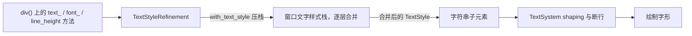

import { Meta } from '@storybook/addon-docs/blocks';

<Meta id="text-and-fonts" title="布局与样式/文本与字体" name="Docs" />

# 文本与字体

GPUI 里写文本不需要专门的 `Text` 组件：字符串本身就是元素，挂在 `div` 下就能排版绘制；字号、字体、颜色这些方法写在 `div` 上，汇入 `TextStyle` 并沿元素树级联给子孙。文本的全部行为由三层决定——**样式**（`TextStyle`，本课主线）、**排版**（`TextSystem` 在布局期 shaping 与断行）、**测量**（行框与字形位置，做交互文本时才需要）。本课 API 按 gpui 0.2.2（2025-10-22，crates.io 最新发布版）源码核对，main 分支（未发布）的差异标注"仅 main"。读完你能预测：一段文本会继承哪些样式、在给定容器里怎么断行、怎么省略，以及如何拿到字形级度量。

样式从方法调用到字形绘制的流水线：



文本样式方法家族与默认值回查表（默认值均出自 0.2.2 `TextStyle::default()`）：

| 家族 | 方法入口 | 写入 `TextStyle` 字段 | 默认值 |
| --- | --- | --- | --- |
| 字号 | `text_size(len)`、预设 `text_xs`…`text_3xl` | `font_size` | `rems(1.)`，即默认 16px |
| 行高 | `line_height(len)` | `line_height` | `phi()`，约 1.618 倍字号 |
| 字族 | `font_family(name)`、`font(f)` | `font_family` | `".SystemUIFont"` |
| 字重 | `font_weight(weight)` | `font_weight` | `FontWeight::NORMAL`（400） |
| 字形 | `italic()` / `not_italic()` | `font_style` | `FontStyle::Normal` |
| 颜色 | `text_color(c)`、`text_bg(c)` | `color` / `background_color` | `black()` / `None` |
| 装饰 | `underline()`、`line_through()`、`text_decoration_*` | `underline` / `strikethrough` | `None` |
| 对齐 | `text_align(a)`、`text_left/center/right` | `text_align` | `TextAlign::Left` |
| 换行 | `whitespace_normal()` / `whitespace_nowrap()` | `white_space` | `WhiteSpace::Normal` |
| 溢出 | `text_ellipsis()`、`text_overflow(o)`、`truncate()`、`line_clamp(n)` | `text_overflow` / `line_clamp` | `None` |

## 文本元素与样式级联

GPUI 没有独立的"文本组件"：`&'static str`、`String`、`SharedString` 都直接实现了 `Element`，作为子节点挂进 `div` 就是一段文本。元素内部持有一个 `TextLayout`，负责测量（布局期）与绘制（绘制期）。最小表达：

```rust
// 字符串本身就是元素：直接作为子节点排版与绘制
div()
    .text_size(px(16.))        // 本元素及子孙的默认字号
    .text_color(rgb(0x333333)) // 本元素及子孙的默认文字颜色
    .child("GPUI 里最普通的文本")
    .child(div().child("子元素没有写字号，直接继承 16px 与颜色"))
```

所有文字样式方法的落点是 `TextStyle`（0.2.2 `style.rs`，字段与默认值照抄源码）：

```rust
pub struct TextStyle {
    pub color: Hsla,                               // 默认 black()
    pub font_family: SharedString,                 // 默认 ".SystemUIFont"
    pub font_features: FontFeatures,               // 默认空
    pub font_fallbacks: Option<FontFallbacks>,     // 默认 None
    pub font_size: AbsoluteLength,                 // 默认 rems(1.)，即 1rem
    pub line_height: DefiniteLength,               // 默认 phi()，约 1.618 倍字号
    pub font_weight: FontWeight,                   // 默认 FontWeight::NORMAL
    pub font_style: FontStyle,                     // 默认 FontStyle::Normal
    pub background_color: Option<Hsla>,            // 默认 None
    pub underline: Option<UnderlineStyle>,         // 默认 None
    pub strikethrough: Option<StrikethroughStyle>, // 默认 None
    pub white_space: WhiteSpace,                   // 默认 WhiteSpace::Normal
    pub text_overflow: Option<TextOverflow>,       // 默认 None
    pub text_align: TextAlign,                     // 默认 TextAlign::Left
    pub line_clamp: Option<usize>,                 // 默认 None
}
```

级联机制：`text_*` / `font_*` 方法把值写进元素的 `TextStyleRefinement`（只记录"设置过的字段"）；`div` 布局时经 `window.with_text_style()` 把精修值压入**窗口文字样式栈**，子孙元素的文本按"栈上逐层合并"的结果排版。所以文字样式是**继承语义**——影响本元素及全部子孙，不影响父级与兄弟；这和 `bg()`、`border_*` 这类只作用于自身盒子的样式不同。

```rust
// 读取当前合并后的文字样式（比如在 render 里给测量函数构造 TextRun）
let style = window.text_style(); // 返回合并后的 TextStyle
let size = style.font_size.to_pixels(window.rem_size()); // 默认 16px
```

官方示例 text.rs 的整个字体排印页就是这个模型：根容器设一次 `text_size(px(font_size))` 与 `line_height(relative(line_height))`，几十个子级样张不写任何文字样式，全部随根缩放。

## 文本样式

### 字号：text_size 与预设档

`text_size` 接受任何能转成 `AbsoluteLength` 的值，`px()` 与 `rems()` 都行；该值**级联给子孙**。预设档是 `rems` 换算（0.2.2 `styled.rs`）：

| 方法 | rems | 默认像素（1rem = 16px） |
| --- | --- | --- |
| `text_xs()` | 0.75 | 12px |
| `text_sm()` | 0.875 | 14px |
| `text_base()` | 1.0 | 16px |
| `text_lg()` | 1.125 | 18px |
| `text_xl()` | 1.25 | 20px |
| `text_2xl()` | 1.5 | 24px |
| `text_3xl()` | 1.875 | 30px |

```rust
div()
    .text_sm()                  // 0.875rem，默认 14px
    .line_height(relative(1.4)) // 行高见下一小节
```

选 `rems` 档还是 `px()` 的判断与 2.2 课一致：希望跟随界面字号缩放（无障碍、整体缩放）就用预设档或 `rems()`，按设计稿钉死的例外值才用 `px()`。

### 行高：倍数乘的是字号

`line_height` 接受 `impl Into<DefiniteLength>`，三种写法语义不同：

- `relative(1.3)`：**1.3 倍字号**。`Fraction` 在行高里乘的是 `font_size`，不是父容器高度——与布局课的百分比语义不同，这是最容易误判的一点。
- `px(20.)`：行高钉死 20 逻辑像素，字号变了行高不变。
- `rems(1.5)`：1.5 倍窗口 `rem_size`，与字号解耦。

换算真源在 `TextStyle::line_height_in_pixels`：`line_height.to_pixels(self.font_size, rem_size).round()`——`Fraction` 的基准是字号自身。

```rust
// 16px 字号 + relative(1.3) → 行高 16 × 1.3 ≈ 21px
div().text_size(px(16.)).line_height(relative(1.3)).child("正常阅读行距")
```

默认行高是 `phi()`（黄金比例，约 1.618 倍字号），比常见 CSS 预设（1.5）略大——觉得"行距莫名偏大"时先想到这个默认值。官方示例 text.rs 的全局 `TextContext` 用的是 `font_size: 16.0, line_height: 1.3`，即 `relative(1.3)`。

### 对齐、颜色与装饰

对齐写入 `text_align`，作用域是文本在元素宽度内的水平位置：

```rust
div().w_full().text_center().child("居中") // TextAlign::Center
div().w_full().text_right().child("右对齐") // TextAlign::Right
// TextAlign 只有 Left / Center / Right 三个变体，没有两端对齐（justify）
```

颜色两件套：`text_color(c)` 设文字颜色，`text_bg(c)` 设文字背景色块（高亮选中感的底色）。装饰走 `underline` / `strikethrough` 两个 `Option` 字段：

```rust
div()
    .underline()                        // 下划线，默认粗细 1px
    .text_decoration_color(gpui::red()) // 下划线颜色
    .text_decoration_wavy()             // 波浪线（默认 solid 直线）
    .child("带红色波浪下划线")

div().line_through().child("删除线") // 写入 strikethrough
```

粗细档 `text_decoration_0/1/2/4/8` 写入下划线的 `thickness`（像素值），取消用 `text_decoration_none()`。官方示例 text_layout.rs 演示了 `text_center` / `text_right` 与 `text_decoration_1()`、`line_through()` 的组合。

## 字体选择

### font_family 与特殊字族名

`font_family(name)` 按名字选字体，名字匹配的是**字体文件内部的家族名**：

```rust
div().font_family("Menlo").child("macOS 自带的等宽字体")
```

两个字族名有特殊地位：

- `".SystemUIFont"`：系统 UI 字体的特殊名，跨平台解析为当前系统的界面字体（macOS 上即苹方一类）。这是 `TextStyle` 的默认字族——不写 `font_family` 时整个界面就是它。
- 点前缀名 `".ZedMono"` / `".ZedSans"`：Zed 应用启动时内嵌注册的自有字体的家族名，**不是系统字体**。脱离 Zed 的程序里引用它们，要先自己注册同名字体，否则会被回退栈替换（见下）。

字族名没有命中时的真实行为（0.2.2 `TextSystem::resolve_font`）：先精确匹配，失败后沿默认回退栈（`.ZedMono`、`.ZedSans`、`Helvetica`、`Segoe UI`、`Arial` 等）逐个尝试，**命中哪个用哪个**——所以写错名字往往不是报错，而是字体被静默替换；整条回退栈都失败才 panic（`failed to resolve font '...' or any of the fallbacks`）。排查入口是 `cx.text_system().all_font_names()`，它列出系统字体加回退栈的全集。

macOS 上真实字形的加载由 gpui_platform 的 font-kit feature 提供（工程配置见 1.1「安装与运行」），字体选择本身与本节 API 无关。

### 字重、斜体与 font()

字重类型 `FontWeight` 是 `f32` 新类型，常量覆盖 CSS 标准九档，默认 `NORMAL`：

| 常量 | 值 | 常量 | 值 |
| --- | --- | --- | --- |
| `FontWeight::THIN` | 100 | `FontWeight::MEDIUM` | 500 |
| `FontWeight::EXTRA_LIGHT` | 200 | `FontWeight::SEMIBOLD` | 600 |
| `FontWeight::LIGHT` | 300 | `FontWeight::BOLD` | 700 |
| `FontWeight::NORMAL` | 400 | `FontWeight::EXTRA_BOLD` | 800 |
| | | `FontWeight::BLACK` | 900 |

```rust
div().font_weight(FontWeight::SEMIBOLD).child("半粗标题")
// FontWeight(f32) 字段公开，非标准字重直接给数值：FontWeight(350.0)
```

斜体的入口是 `italic()` / `not_italic()`——`Styled` 上**没有** `font_style()` 方法（易错点）。底层枚举 `FontStyle` 有 `Normal` / `Italic` / `Oblique` 三个变体，`Oblique` 没有 Styled 便捷方法，要走 `font()`。官方示例 text_layout.rs 用 `StyledText` 混排了 `FontWeight::EXTRA_BOLD` 与 `FontStyle::Italic`。

一次设齐字族、字重、字形、特性、回退，用 `font()` 构造 `Font`：

```rust
// font(family) 构造默认 Font，链式加粗、斜体
div().font(font("Menlo").bold().italic()).child("Menlo Bold Italic")
```

`font()` 会同时覆写精修里的 `font_family`、`font_features`、`font_weight`、`font_style`、`font_fallbacks` 五个字段——想整体切换一棵子树的字体时它比逐个方法调用更不容易漏。

### 自定义字体注册与 font_features

自带字体用 `add_fonts` 注册，之后按字体文件内部家族名引用（官方示例 text.rs 内嵌 Lilex 的写法）：

```rust
// 入口处注册：Cow<'static, [u8]> 装字体文件字节
let fonts = [include_bytes!("../assets/fonts/lilex/Lilex-Regular.ttf")]
    .iter()
    .map(|b| std::borrow::Cow::Borrowed(&b[..]))
    .collect();
_ = cx.text_system().add_fonts(fonts);

// 之后任意元素按家族名使用
div().font_family("Lilex")
```

连字等 OpenType 特性在 `FontFeatures` 上，构造入口只有两个：`FontFeatures::disable_ligatures()`，或直接组装字段（元组字段公开，装 `("ss01", 1)` 这类 tag-value 对）。注意 `Styled` 上没有 `font_features()` 方法，设置通道是 `font(font("Lilex"))` 拿到 `Font` 后改 `features` 字段，或直接精修 `TextStyle`。缺字回退链用 `FontFallbacks` 配置——主字体覆盖不到的字符（常见于中文）按回退链顺序补。

## 换行、溢出与省略

### 换行：WhiteSpace

`white_space` 只有两个变体（0.2.2 `style.rs`）：默认 `WhiteSpace::Normal`，文本在容器可用宽度处按断行规则自动换行（词边界、CJK 逐字均可断）；`whitespace_nowrap()` 禁止换行，长文本直接溢出容器盒子，通常配 `overflow_hidden()` 裁剪。`whitespace_normal()` 用于恢复默认。官方示例 text_wrapper.rs 里 `NOWRAP` 行与默认段落（中、英、日混排）的对照就是这两个档位。没有 CSS `pre`（保留空白与换行符）的对应用法，空白序列的保留不是本档位职责。

```rust
div().w(px(200.)).child("很长的一段中英文混排文本会自动断行")
div().w(px(200.)).whitespace_nowrap().overflow_hidden().child("这一行永远不换行，超出部分被裁掉")
```

### 单行省略：truncate 与 text_ellipsis

省略由 `text_overflow` 字段驱动，只有一个枚举变体（0.2.2）：

```rust
pub enum TextOverflow {
    /// 放不下时截断文本，用提供的字符串表示截断（如 "very long te…"）
    Truncate(SharedString),
}
```

`text_ellipsis()` 就是 `TextOverflow::Truncate("…")`（源码里的 `ELLIPSIS` 常量）；想换省略串用 `text_overflow(TextOverflow::Truncate("……".into()))`。惯用入口是三合一的 `truncate()`，源码实现为 `overflow_hidden() + whitespace_nowrap() + text_ellipsis()`：

```rust
// 单行省略：超宽以 … 结尾（内部 = overflow_hidden + whitespace_nowrap + text_ellipsis）
div().w_full().truncate().child(very_long_text)
// 多行截断见下一小节
div().w_full().line_clamp(2).child(very_long_text)
```

省略生效的**前提是容器有确定的可用宽度**：普通 `div` 默认按内容收缩，宽度等于文本宽，没有"放不下"这回事——要给 `w_full()` 或定宽；flex 子项受收缩规则约束，可以省略但可能需要 `min_w_0()` 放手压缩（见 2.1 课）。官方示例 text_wrapper.rs 第一行的三个盒子专门演示这个前提。

仅 main：`TextOverflow` 新增 `TruncateStart`（保留尾部，适合文件路径）与 `TruncateMiddle`（保留首尾，适合带扩展名的文件名），配套 `text_ellipsis_start()` / `text_ellipsis_middle()` 两个方法；0.2.2 只有尾部截断。

### 多行截断：line_clamp

`line_clamp(n)` 显示 n 行后在第 n 行末尾截断，源码实现里自动附带 `overflow_hidden()`：

```rust
// 卡片摘要：最多两行，超出部分以 … 结尾
div().w_full().line_clamp(2).text_sm().child(summary)
```

官方示例 text_wrapper.rs 用同一段长文本对照了 `truncate()`（1 行）、`line_clamp(2)`、`line_clamp(3)` 与 `TextOverflow::Truncate("".into())` 空省略串（静默截断不留记号）的差别。

## 文本布局与度量

### 混排高亮与交互文本

一段文本内按区间混排样式，用 `StyledText` 元素——`with_highlights` 接受（字节区间，`HighlightStyle`）序列，区间按 UTF-8 字节偏移计：

```rust
// 官方示例 text_layout.rs：0..1 加粗、2..3 斜体
StyledText::new("ABCD").with_highlights([
    (0..1, FontWeight::EXTRA_BOLD.into()), // HighlightStyle 可从 FontWeight 转换
    (2..3, FontStyle::Italic.into()),      // 也可从 FontStyle / Hsla / Rgba 转换
])
```

`HighlightStyle` 是轻量版 `TextStyle`（颜色、字重、字形、下划线等 `Option` 字段）；需要整段统一控制时走 `with_runs(Vec<TextRun>)`，`TextStyle::to_run(len)` 能把当前样式直接变成一个 run。做链接、术语提示这类按字符命中需要的交互，用 `InteractiveText` 包住 `StyledText`：`on_click` 回调给出点击位置的**字符索引**（`usize`），`on_hover` 给出悬停索引或 `None`，还能挂 `tooltip`。

仅 main：新增 `pub struct Text` 元素（带 `with_id`），以及 `StyledText::with_font_family_overrides`（同一段内按区间换字族）。

### 行框与字形度量

需要"这行文本多宽、每个字形在哪"时，直接问 `TextSystem`（`cx.text_system()` 拿到）：

```rust
// 排一行文本，拿行框与字形信息
let line = cx.text_system().shape_line(
    "Hello GPUI".into(),                // 文本
    px(16.),                            // 字号
    &[window.text_style().to_run(10)],  // 样式 run，len 按 UTF-8 字节数
    None,                               // 不强制宽度
);
let line_width = line.width;  // 整行宽度：行框的宽
let ascent = line.ascent;     // 上伸：基线到行框顶部
let descent = line.descent;   // 下伸：基线到行框底部
// 行框高 ≈ ascent + descent；line.runs[].glyphs[] 里是字形
for run in &line.runs {
    for glyph in &run.glyphs {
        // glyph.position：字形在行内的位置；glyph.index：原文 UTF-8 字节索引
        // glyph.id：字形 ID；glyph.is_emoji：emoji 走彩色位图路径
    }
}
```

`ShapedLine` 解引用到 `LineLayout`，公开字段就是行框度量：`font_size`、`width`、`ascent`、`descent`、`runs`、`len`。不要强制单行时用 `layout_line`，得到 `Arc<LineLayout>`。断行后的多行度量在 `WrappedLineLayout` 上：`wrap_boundaries()` 给出每行的折断字节位置（`WrapBoundary`），`size(line_height)`、`ascent()`、`descent()` 给出整块文本的包围盒。要自己实现折行或截断（编辑器、自绘元素）用 `line_wrapper`：

```rust
// 取一个按字体+字号池化的折行器，产出不超过给定宽度的断点序列
let mut wrapper = cx.text_system().line_wrapper(font("Menlo"), px(12.));
let boundaries = wrapper.wrap_line(&[LineFragment::text("一段要手动折行的文本")], px(120.));
// truncate_line(line, width, suffix, runs) 则按宽度截断并追加省略串
```

说明一点：官方示例 text_layout.rs 演示的是对齐、装饰与 `StyledText` 混排高亮，并没有演示度量信息的现成例子；本节的度量 API（`LineLayout`、`ShapedGlyph`、`WrappedLineLayout`、`LineWrapper`）按 0.2.2 源码核对。

## 最佳实践

- **样式上提，差异下沉。** 字族、基准字号、行高放在根容器设一次，子孙自动继承；子级只写与基准不同的那一两项。散落在每个 `div` 上的 `text_size` 会让"全局调字号"变成全文件搜索。
- **字号与行高跟 rem 走。** 字号用预设档或 `rems()`、行高用 `relative(倍数)`，界面就能随 `set_rem_size` 整体缩放（2.2 课机制）；钉死 `px()` 的字号和行高会在这套机制里变成不协调的例外。
- **省略按信息保留策略选。** 常规单行 `truncate()`；多行摘要 `line_clamp(n)`；不想露出 `…` 用 `TextOverflow::Truncate("".into())`；文件路径这类"尾部更重要"的文本，0.2.2 只能尾部截断，需要头/中截断就升级到含 `TruncateStart` / `TruncateMiddle` 的版本，或用 `LineWrapper::truncate_line` 自己拼。
- **自定义字体先注册、名字要精确。** `add_fonts` 之后按字体文件内部家族名引用；不确定名字时先 `all_font_names()` 查一遍，避免被回退栈静默替换成 Helvetica。

## 常见问题

- `text_ellipsis()` 写了但文本没被省略？
  容器宽度跟着内容走，没有"放不下"的前提。处理动作：给容器确定宽度——普通 `div` 加 `w_full()` 或定宽并配 `overflow_hidden()`，flex 子项必要时加 `min_w_0()`；或者直接用三合一的 `truncate()`。
- `italic()` 之外想设 `font_style`，编译器说方法不存在？
  `Styled` 上没有 `font_style()` 方法，斜体只有 `italic()` / `not_italic()`；`FontStyle::Oblique` 走 `font(font("Family"))` 后改 `Font` 的 `style` 字段。
- `font_family("Zed Mono")` 写了但界面字体没变？
  名字必须与注册的家族名精确一致（含点前缀与大小写）；未命中时 `resolve_font` 沿回退栈静默替换（macOS 上常落到 `Helvetica`），不是保持原样。处理动作：`cx.text_system().all_font_names()` 核对名字；自带字体先 `add_fonts`。
- 一段长文本把容器撑破、溢出了？
  检查元素链上是否被 `whitespace_nowrap()` 覆盖（继承语义下子孙都不断行），以及 flex 容器是否给子项留了收缩空间；恢复断行用 `whitespace_normal()`。
- 没设行高但行距比设计稿大？
  默认行高是 `phi()`（约 1.618 倍字号），不是 1.5。显式 `line_height(relative(1.5))`（或设计稿倍数）即可；同理确认没有从祖先继承到一个偏大的显式行高。
- `line_clamp(3)` 没有截到三行？
  它按**渲染行数**计，不是按段落或字符数；若同时存在更高的 `line_clamp` 从祖先继承，近处的设置才会生效。确认容器宽度正常（宽度异常大时三行装下了全部文本，看不到截断）。

## 总结回顾

摘要：

GPUI 的文本模型围绕三件事：字符串子元素本身就是文本元素（内部是 `TextLayout`）；`div` 上的 `text_*` / `font_*` / `line_height` 方法写入 `TextStyleRefinement`，经窗口文字样式栈级联给本元素及全部子孙；`TextSystem` 在布局期完成 shaping 与断行。字号预设档是 `rems` 换算，行高的 `relative` 倍数乘的是字号而非父容器尺寸，默认行高 `phi()`。字体按家族名选择，默认 `".SystemUIFont"`，名字未命中会沿回退栈静默替换，自带字体要 `add_fonts` 注册；字重走 `FontWeight` 九档常量，斜体只有 `italic()`，整包切换用 `font()`。换行由 `WhiteSpace` 控制，单行省略 `truncate()`（等价 `overflow_hidden` + `whitespace_nowrap` + `text_ellipsis`），多行 `line_clamp(n)`，省略的前提是容器有确定宽度。区间混排与字符级交互用 `StyledText` 与 `InteractiveText`，行框宽度、ascent/descent 与字形位置经 `shape_line` 拿到 `LineLayout` / `ShapedGlyph`，手动折行用 `line_wrapper`。

一句话：

> 文本样式是继承语义——在合适的祖先节点上设一次 `TextStyle` 级的值，让断行与省略发生在有确定宽度的容器里。

知识要点：

- 字符串如何成为文本元素，`text_*` 方法的值写入哪里、影响谁
- 文本样式方法家族对应的 `TextStyle` 字段与各自默认值
- `line_height` 三种写法各乘什么基准，默认值是什么
- 字族名的匹配规则、回退栈的替换行为、自定义字体的注册通道
- `WhiteSpace` 两个档位的行为，`truncate()` 等价于哪三个方法
- `text_ellipsis` / `line_clamp` 生效的宽度前提
- 按字节区间混排样式与按字符索引交互的元素分别是什么
- 从 `TextSystem` 拿行框度量与字形位置的入口

## 参考资料

- [Styled trait（text_*/font_*/line_height 方法）- docs.rs/gpui 0.2.2](https://docs.rs/gpui/latest/gpui/trait.Styled.html)
- [TextStyle - docs.rs/gpui 0.2.2](https://docs.rs/gpui/latest/gpui/struct.TextStyle.html)
- [Font - docs.rs/gpui 0.2.2](https://docs.rs/gpui/latest/gpui/struct.Font.html)
- [FontWeight - docs.rs/gpui 0.2.2](https://docs.rs/gpui/latest/gpui/struct.FontWeight.html)
- [FontStyle - docs.rs/gpui 0.2.2](https://docs.rs/gpui/latest/gpui/enum.FontStyle.html)
- [FontFeatures - docs.rs/gpui 0.2.2](https://docs.rs/gpui/latest/gpui/struct.FontFeatures.html)
- [FontFallbacks - docs.rs/gpui 0.2.2](https://docs.rs/gpui/latest/gpui/struct.FontFallbacks.html)
- [WhiteSpace - docs.rs/gpui 0.2.2](https://docs.rs/gpui/latest/gpui/enum.WhiteSpace.html)
- [TextOverflow - docs.rs/gpui 0.2.2](https://docs.rs/gpui/latest/gpui/enum.TextOverflow.html)
- [TextAlign - docs.rs/gpui 0.2.2](https://docs.rs/gpui/latest/gpui/enum.TextAlign.html)
- [StyledText - docs.rs/gpui 0.2.2](https://docs.rs/gpui/latest/gpui/struct.StyledText.html)
- [InteractiveText - docs.rs/gpui 0.2.2](https://docs.rs/gpui/latest/gpui/struct.InteractiveText.html)
- [TextSystem（shape_line / line_wrapper / add_fonts）- docs.rs/gpui 0.2.2](https://docs.rs/gpui/latest/gpui/struct.TextSystem.html)
- [LineLayout - docs.rs/gpui 0.2.2](https://docs.rs/gpui/latest/gpui/struct.LineLayout.html)
- [ShapedGlyph - docs.rs/gpui 0.2.2](https://docs.rs/gpui/latest/gpui/struct.ShapedGlyph.html)
- [WrappedLineLayout - docs.rs/gpui 0.2.2](https://docs.rs/gpui/latest/gpui/struct.WrappedLineLayout.html)
- [gpui 0.2.2 源码包（styled.rs、style.rs、elements/text.rs、text_system/ 核对用）](https://crates.io/crates/gpui/0.2.2/download)
- [官方示例 text.rs（字体排印样张、font_family 切换、add_fonts）](https://github.com/zed-industries/zed/blob/main/crates/gpui/examples/text.rs)
- [官方示例 text_layout.rs（对齐、装饰、StyledText 混排）](https://github.com/zed-industries/zed/blob/main/crates/gpui/examples/text_layout.rs)
- [官方示例 text_wrapper.rs（换行、省略、line_clamp 对照）](https://github.com/zed-industries/zed/blob/main/crates/gpui/examples/text_wrapper.rs)
- [styled.rs（main 分支，text_ellipsis_start/middle 与 truncate 差异）](https://github.com/zed-industries/zed/blob/main/crates/gpui/src/styled.rs)
- [style.rs（main 分支，TextOverflow::TruncateStart/TruncateMiddle）](https://github.com/zed-industries/zed/blob/main/crates/gpui/src/style.rs)
- [elements/text.rs（main 分支，Text 元素与 TextLayout 度量方法）](https://github.com/zed-industries/zed/blob/main/crates/gpui/src/elements/text.rs)
