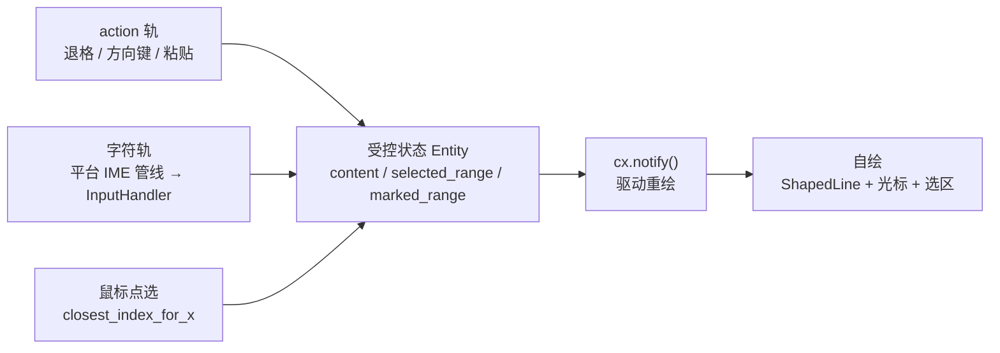
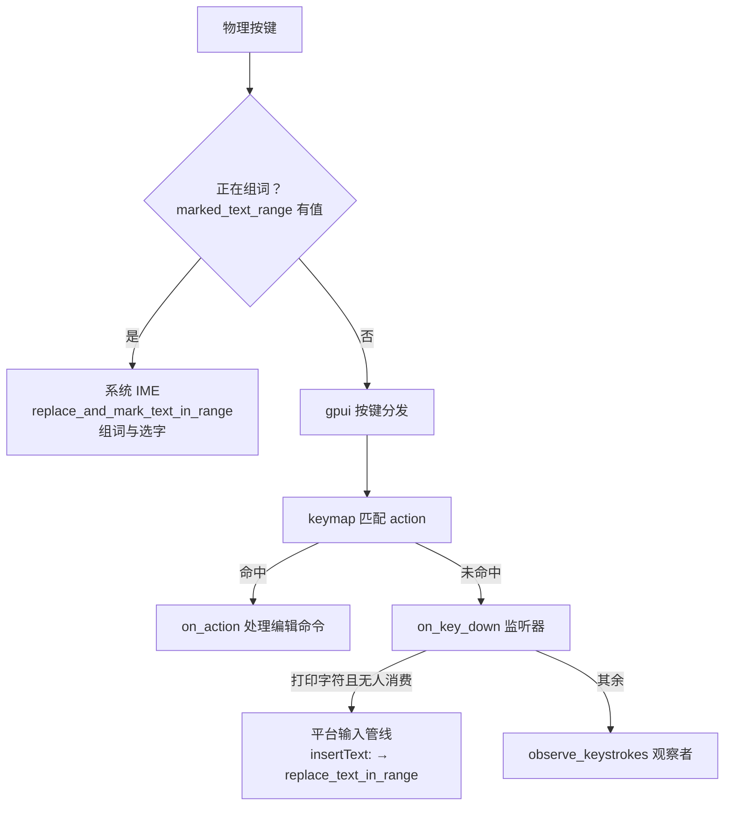

import { Meta } from '@storybook/addon-docs/blocks';

<Meta id="text-input" title="交互/文本输入" name="Docs" />

# 文本输入

GPUI 是一个"没有输入框"的框架：`gpui::elements` 里没有 `Input`，本体只提供积木——按键事件、IME 桥（`EntityInputHandler`）、焦点与文本排版。官方示例 `examples/input.rs` 演示了用这些积木组装单行输入框的完整做法，是本课的一手参照。组装公式：`Entity` 持有受控状态（文本、选区、组词区），按键沿两条轨道进入——编辑命令走 action（退格、方向键、粘贴），字符与中文输入法走平台 IME 管线（`InputHandler`），而文本、光标、选区、组词下划线全部自绘。读完你能预测：按下一个键它会走哪条轨、拼音组词时状态如何变化、点击文本时光标为什么落在那个位置。

输入框的组成全景：



输入相关 API 家族回查表（语义见后文各小节）：

| 家族 | 成员 | 回查要点 |
| --- | --- | --- |
| 按键事件 | `KeyDownEvent` / `KeyUpEvent` / `on_key_down` | `keystroke.key_char` 有值才是可输入字符；键分发分 capture → bubble 两阶段，`on_key_down` 在 bubble 触发 |
| 按键元数据 | `Keystroke` / `Modifiers` | `key` 是键帽名，`key_char` 是可输入字符；`is_ime_in_progress()` 判断 IME 半途键 |
| 全局观察 | `cx.observe_keystrokes` / `KeystrokeEvent` | 只旁观不拦截，事件里带匹配到的 action |
| 动作绑定 | `actions!` / `KeyBinding` / `on_action` | 编辑命令的正规轨，细节见 3.2 课 |
| IME 桥 | `EntityInputHandler` / `ElementInputHandler` / `Window::handle_input` | 字符输入与中文输入法的唯一通道；paint 时注册，仅聚焦时生效 |
| 选区表示 | `UTF16Selection` | 对外用 UTF-16 范围 + `reversed` 方向位 |
| 文本测量 | `shape_line` / `ShapedLine` | 索引与坐标互查三方法：`x_for_index` / `closest_index_for_x` / `index_for_x` |
| 分段样式 | `TextRun` / `UnderlineStyle` | 组词下划线靠分段实现；`len` 按 UTF-8 字节计 |

版本口径：本课以 gpui 0.2.2（crates.io 最新发布版）核对，片段默认 0.2.2 写法，仅 main 可用的 API 显式标注。与输入直接相关的已知差异：入口 `Application::new().run(...)`（main 示例改用 `gpui_platform::application()`）；`window.focus(&handle)`（main 多一个 `cx` 参数）；`ShapedLine::paint`（main 增加 `TextAlign` 与 `align_width` 两个参数）；`window.play_system_bell()` 与 `KeyDownEvent` 的 `prefer_character_input` 字段仅 main。`EntityInputHandler`、`ElementInputHandler`、`handle_input`、`Keystroke`、`observe_keystrokes` 在两版一致。要现成的输入框组件，gpui-kit 提供开箱即用的表单组件（第 7 阶段）；想看多行、语法高亮的生产级实现，Zed 的 `crates/editor` 是进阶源码入口，本课只讲 gpui 本体的积木。

## 快速上手

用 `on_key_down` 收字符是理解"受控输入"的最短路径：状态存文本，按键更新状态，render 显示状态。约 40 行得到一个能输入英文和数字的单行框：

```rust
use gpui::{div, prelude::*, px, Context, FocusHandle, KeyDownEvent, Render, Window, SharedString};

struct TinyInput {
    content: SharedString,     // 受控文本：唯一真源
    focus_handle: FocusHandle, // 挂接焦点，按键才沿这条子树分发；构造时用 cx.focus_handle() 创建
}

impl TinyInput {
    fn on_key_down(&mut self, event: &KeyDownEvent, _window: &mut Window, cx: &mut Context<Self>) {
        // key_char 是"这一下能打出的字符"：字母、数字、符号有值；回车、方向键等命令键为 None
        if let Some(text) = event.keystroke.key_char.as_ref() {
            self.content = format!("{}{}", self.content, text).into();
            cx.notify(); // 改完状态必须 notify，否则不重绘
            cx.stop_propagation(); // 消费掉这次按键，不再往下传
        }
    }
}

impl Render for TinyInput {
    fn render(&mut self, _window: &mut Window, cx: &mut Context<Self>) -> impl IntoElement {
        div()
            .track_focus(&self.focus_handle)
            .on_key_down(cx.listener(Self::on_key_down))
            .border_1()
            .px_2()
            .line_height(px(30.))
            .child(self.content.clone())
    }
}
```

打开窗口后把焦点交给输入框，按键才能送达（0.2.2 的 `window.focus` 只带句柄）：

```rust
window.update(cx, |view, window, _cx| {
    window.focus(&view.focus_handle);
});
```

这个最小版有两个天然缺陷，恰好对应后面两个主题小节：一是退格、方向键、粘贴全都不工作——它们的 `key_char` 为 `None`，必须走 action 轨；二是中文输入法打不出字——拼音按键在组词阶段就被系统 IME 拦下，根本到不了 `on_key_down`。正式的输入框要靠 `EntityInputHandler` 接入平台字符管线。

## 按键双轨：action 与字符

一条按键从物理按下到产生效果，gpui 0.2.2 的顺序是固定的（`window.rs` 的 `dispatch_key_event`）：

1. keystroke 拦截器先行（`dispatch_keystroke_interceptors`）；
2. 沿焦点路径匹配 keymap（多段绑定会等待 1 秒凑下一击）；
3. 命中的 action 依次派发，被消费即终止；
4. 未被任何 action 消费 → `on_key_down` 监听器（键监听器分 capture、bubble 两阶段运行，`on_key_down` 注册在 bubble 阶段）；
5. 仍未消费 → `ModifiersChangedEvent` 监听器与 `observe_keystrokes` 观察者。

macOS 平台层（0.2.2 `platform/mac/window.rs` 的 `handle_key_event`）在这套分发之外还有三条前置规则：

- 正在组词（`marked_text_range` 有值）→ 按键直接交给系统 IME，gpui 不参与；
- 未组词时，`key_char` 为 `None` 且未按 ctrl/fn（方向键、回车、Escape）→ 先问 IME 要不要（`do_command_by_selector` 会转回 gpui 的正常分发），IME 不响应才继续；
- 普通打印字符 → 先走上面的 gpui 分发；没人消费 → 交给系统输入上下文，最终以 `insertText:` 回调进入 `replace_text_in_range`。



两条轨各司其职：action 轨处理"命令"（删除、移动、全选），字符轨处理"内容"（往文本里加字）。测试或重放按键时，`window.dispatch_keystroke`（0.2.2 可用）走同一条链路——先匹配 action，未命中且有 `key_char` 就送进 InputHandler。

## 受控输入的状态模型

官方示例的输入状态一个不少，每个字段都有明确职责：

```rust
struct TextInput {
    focus_handle: FocusHandle,          // 焦点句柄：决定按键归谁
    content: SharedString,              // 受控文本，唯一真源
    placeholder: SharedString,          // 空内容时的占位文本
    selected_range: Range<usize>,       // 选区，UTF-8 字节偏移；空区间即光标位置
    selection_reversed: bool,           // 选区头部在起点还是终点（shift 反向扩选）
    marked_range: Option<Range<usize>>, // IME 组词区，内部同样按字节存
    last_layout: Option<ShapedLine>,    // 上一帧的排版结果：坐标换算全靠它
    last_bounds: Option<Bounds<Pixels>>, // 元素在窗口中的矩形
    is_selecting: bool,                 // 鼠标拖选中
}
```

两个关键约定贯穿全程。第一，选区就是 `Range<usize>`，空区间表示光标；光标永远位于选区的"活动端"：

```rust
fn move_to(&mut self, offset: usize, cx: &mut Context<Self>) {
    self.selected_range = offset..offset; // 空区间 = 光标定位
    cx.notify()
}

fn cursor_offset(&self) -> usize {
    // 正向选择光标在末端，反向选择光标在起点
    if self.selection_reversed { self.selected_range.start } else { self.selected_range.end }
}

fn select_to(&mut self, offset: usize, cx: &mut Context<Self>) {
    if self.selection_reversed {
        self.selected_range.start = offset
    } else {
        self.selected_range.end = offset
    };
    // 越过另一端时翻转方向，保证 start <= end
    if self.selected_range.end < self.selected_range.start {
        self.selection_reversed = !self.selection_reversed;
        self.selected_range = self.selected_range.end..self.selected_range.start;
    }
    cx.notify()
}
```

第二，内部一律用 UTF-8 字节偏移（与 `String` 切片一致），只在 `EntityInputHandler` 的边界换成 UTF-16（见下一节）。`move_to` / `select_to` 改完状态都要 `cx.notify()`，重渲染后 render 读到的就是新状态——这就是受控输入的闭环。

## 编辑命令：action 轨

退格、方向键、Home/End、剪贴板这些"命令"，正规做法是声明 action、绑定按键、在 render 里注册处理器（`actions!` 与 `KeyBinding` 的完整语法见 3.2 课）：

```rust
actions!(
    text_input,
    [Backspace, Delete, Left, Right, SelectLeft, SelectRight, SelectAll,
     Home, End, ShowCharacterPalette, Paste, Cut, Copy]
);

// 应用启动时绑定（0.2.2：Application::new().run(|cx: &mut App| ...)）
cx.bind_keys([
    KeyBinding::new("backspace", Backspace, None),
    KeyBinding::new("delete", Delete, None),
    KeyBinding::new("left", Left, None),
    KeyBinding::new("shift-left", SelectLeft, None),
    KeyBinding::new("cmd-a", SelectAll, None),
    KeyBinding::new("cmd-v", Paste, None),
    KeyBinding::new("cmd-c", Copy, None),
    KeyBinding::new("cmd-x", Cut, None),
    KeyBinding::new("home", Home, None),
    KeyBinding::new("end", End, None),
    KeyBinding::new("ctrl-cmd-space", ShowCharacterPalette, None),
    // ... 其余同理
]);
```

```rust
div()
    .key_context("TextInput")            // 声明按键上下文名
    .track_focus(&self.focus_handle(cx)) // 焦点落在子树内，上下文才激活
    .cursor(CursorStyle::IBeam)          // 文本光标形状
    .on_action(cx.listener(Self::backspace))
    .on_action(cx.listener(Self::delete))
    .on_action(cx.listener(Self::left))
    // ... 其余动作同理
```

`key_context` 与 `track_focus` 缺一不可：绑定的匹配沿焦点路径收集 context 栈，焦点不在输入框子树内，`"TextInput"` 上下文就不激活（机制见 3.3 课）。命令的实现高度复用两个原语——"移动/扩选"用 `move_to` / `select_to`，"删除/替换"统一收口到 `replace_text_in_range`：

```rust
fn backspace(&mut self, _: &Backspace, window: &mut Window, cx: &mut Context<Self>) {
    if self.selected_range.is_empty() {
        // 没有选区：先选中光标前一个字素，再走统一的删除入口
        let prev = self.previous_boundary(self.cursor_offset());
        self.select_to(prev, cx);
    }
    self.replace_text_in_range(None, "", window, cx)
}
```

`previous_boundary` / `next_boundary` 按字素簇（grapheme）找边界，而不是按字节或 `char`：

```rust
fn previous_boundary(&self, offset: usize) -> usize {
    self.content
        .grapheme_indices(true) // 字素簇 = 用户眼中的"一个字"，emoji、组合字符不会被拆开
        .rev()
        .find_map(|(idx, _)| (idx < offset).then_some(idx))
        .unwrap_or(0)
}
```

`grapheme_indices` 来自 `unicode-segmentation` crate 的扩展 trait，官方示例即用它处理 emoji 与组合字符。剩余命令的套路一致：`left` 是无选区时移动一个字素、有选区时收拢到起点；`paste` 读剪贴板后调 `replace_text_in_range`；`copy` / `cut` 取 `selected_range` 切片写剪贴板；`show_character_palette` 调 `window.show_character_palette()` 打开系统字符面板。main 分支在退格/删除到边界时多调一个 `window.play_system_bell()` 提示（仅 main；0.2.2 没有这个 API）。

## 字符输入与 IME

字符轨的核心只有一步注册：在自定义元素的 `paint` 阶段（此时 `bounds` 已确定）调用 `window.handle_input`，把"这个元素负责文本输入"登记给平台：

```rust
let focus_handle = self.input.read(cx).focus_handle.clone();
// 仅当焦点在本句柄上时才真正生效；这就是 IME 找到"该服务谁"的依据
window.handle_input(
    &focus_handle,
    ElementInputHandler::new(bounds, self.input.clone()),
    cx,
);
```

`ElementInputHandler::new(bounds, entity)` 是个适配器：它把平台调用转发给 `entity` 上的 `EntityInputHandler` 实现。视图要实现 8 个方法，全部围绕"平台问、输入框答"展开（0.2.2 与 main 签名一致；范围参数均为 UTF-16 单位）：

| 方法 | 平台何时调 | 输入框里做什么 |
| --- | --- | --- |
| `selected_text_range` | IME 想知道光标/选区在哪 | 返回 `UTF16Selection`（范围 + `reversed`） |
| `marked_text_range` | IME 轮询组词区 | 返回 `marked_range` 的 UTF-16 范围 |
| `text_for_range` | IME 要读一段文本做变换 | 按范围取子串，回填实际范围 |
| `replace_text_in_range` | 提交文本：打字、选字上屏、模拟输入 | 唯一的"改文本"入口 |
| `replace_and_mark_text_in_range` | 组词中更新标记文本 | 写入并记录 `marked_range` |
| `unmark_text` | 选字完成或取消 | 清空 `marked_range` |
| `bounds_for_range` | 摆放候选词窗口 | 用 `last_layout` 换算屏幕矩形 |
| `character_index_for_point` | 坐标反查字符位置 | `index_for_x` 换算后返回 |

平台只认 UTF-16（沿袭 macOS `NSTextInputClient` 的约定，`InputHandler` 平台 trait 与其选择器一一对应），所以边界处需要两个换算助手：

```rust
// UTF-16 偏移 → UTF-8 字节偏移：每个字符的 len_utf16 与 len_utf8 各自累计
fn offset_from_utf16(&self, offset: usize) -> usize {
    let mut utf8_offset = 0;
    let mut utf16_count = 0;
    for ch in self.content.chars() {
        if utf16_count >= offset { break; }
        utf16_count += ch.len_utf16();
        utf8_offset += ch.len_utf8();
    }
    utf8_offset
}
// offset_to_utf16 / range_from_utf16 / range_to_utf16 同理成对实现
```

所有文本变更的落点是 `replace_text_in_range`。注意目标区间的三层兜底顺序：显式指定优先，其次组词区，最后当前选区：

```rust
fn replace_text_in_range(
    &mut self,
    range_utf16: Option<Range<usize>>,
    new_text: &str,
    _: &mut Window,
    cx: &mut Context<Self>,
) {
    // 平台不给范围时，替换目标依次退到组词区、当前选区
    let range = range_utf16
        .as_ref()
        .map(|r| self.range_from_utf16(r))
        .or(self.marked_range.clone())
        .unwrap_or(self.selected_range.clone());

    self.content = (self.content[0..range.start].to_owned() + new_text
        + &self.content[range.end..])
        .into();
    // 插入后光标停在新文本末尾
    self.selected_range = range.start + new_text.len()..range.start + new_text.len();
    self.marked_range.take();
    cx.notify();
}
```

上一节的 `backspace` / `paste` 复用这个方法、`window.dispatch_keystroke` 的模拟输入走 `dispatch_input`（内部同样调它）、macOS 的 `insertText:` 回调也调它——一处实现，全轨受益。

## 中文输入法与标记文本

拼音组词期间，文本处于"临时态"：字母先进入正文显示并加下划线，确认后被整段替换成候选词。这就是标记文本（marked text），由三个方法协作：

```rust
fn replace_and_mark_text_in_range(
    &mut self,
    range_utf16: Option<Range<usize>>,
    new_text: &str,
    new_selected_range_utf16: Option<Range<usize>>,
    _window: &mut Window,
    cx: &mut Context<Self>,
) {
    let range = range_utf16
        .as_ref()
        .map(|r| self.range_from_utf16(r))
        .or(self.marked_range.clone())
        .unwrap_or(self.selected_range.clone());

    // 拼音字母先进正文，但记入组词区：确认前的内容随时会被整体替换
    self.content = (self.content[0..range.start].to_owned() + new_text
        + &self.content[range.end..])
        .into();
    self.marked_range = if new_text.is_empty() {
        None
    } else {
        Some(range.start..range.start + new_text.len())
    };
    // IME 会同时指定组词文本内的选区位置
    self.selected_range = new_selected_range_utf16
        .as_ref()
        .map(|r| self.range_from_utf16(r))
        .map(|new_range| new_range.start + range.start..new_range.end + range.end)
        .unwrap_or_else(|| range.start + new_text.len()..range.start + new_text.len());
    cx.notify();
}

fn marked_text_range(&self, _window: &mut Window, _cx: &mut Context<Self>) -> Option<Range<usize>> {
    // 平台轮询：现在有组词区吗？返回 UTF-16 范围
    self.marked_range.as_ref().map(|r| self.range_to_utf16(r))
}

fn unmark_text(&mut self, _window: &mut Window, _cx: &mut Context<Self>) {
    self.marked_range = None; // 选字完成或取消：清掉组词状态
}
```

确认选字时，平台对同一区间调 `replace_text_in_range`，实现里 `marked_range` 兜底替换——拼音整段换成候选词，不会重复插入。组词区的视觉反馈是下划线：渲染时按 `marked_range` 把文本切成三段 `TextRun`，只给中间段加下划线：

```rust
let run = TextRun {
    len: display_text.len(), // len 按 UTF-8 字节计
    font: style.font(),
    color: text_color,
    background_color: None,
    underline: None,
    strikethrough: None,
};
let runs: Vec<TextRun> = if let Some(marked_range) = input.marked_range.as_ref() {
    vec![
        TextRun { len: marked_range.start, ..run.clone() }, // 组词前
        TextRun {                                            // 组词中：加下划线
            len: marked_range.end - marked_range.start,
            underline: Some(UnderlineStyle {
                color: Some(run.color),
                thickness: px(1.0),
                wavy: false,
            }),
            ..run.clone()
        },
        TextRun { len: display_text.len() - marked_range.end, ..run }, // 组词后
    ]
    .into_iter()
    .filter(|run| run.len > 0)
    .collect()
} else {
    vec![run]
};
```

候选词窗口要钉在光标附近，靠的是 `bounds_for_range`——用上一帧布局把字符索引换成屏幕坐标：

```rust
fn bounds_for_range(
    &mut self,
    range_utf16: Range<usize>,
    element_bounds: Bounds<Pixels>, // 元素矩形，由 ElementInputHandler 在 paint 时带入
    _window: &mut Window,
    _cx: &mut Context<Self>,
) -> Option<Bounds<Pixels>> {
    let last_layout = self.last_layout.as_ref()?;
    let range = self.range_from_utf16(&range_utf16);
    // x_for_index 把字符索引换成 x 坐标，候选窗就钉在这个矩形上
    Some(Bounds::from_corners(
        point(
            element_bounds.left() + last_layout.x_for_index(range.start),
            element_bounds.top(),
        ),
        point(
            element_bounds.left() + last_layout.x_for_index(range.end),
            element_bounds.bottom(),
        ),
    ))
}
```

调试输入问题时，`Keystroke::is_ime_in_progress()` 可以判断"这一下是不是 IME 半途的键"：`key_char` 为 `None`、按键本身可打印或为空、且没有 cmd/ctrl/fn/alt 修饰。

## 文本与光标绘制

文本不是 `div().child("字符串")` 的富文本排版，而是一块自绘区域：官方示例定义了 `TextElement` 实现 `Element` trait（协议全貌见「自定义元素」一课，这里只看输入框用到的三步）：

```rust
struct TextElement {
    input: Entity<TextInput>, // 持有输入状态，元素本身无状态
}

struct PrepaintState {
    line: Option<ShapedLine>,     // 排好的一行文本
    cursor: Option<PaintQuad>,    // 光标矩形
    selection: Option<PaintQuad>, // 选区高亮
}
```

`request_layout` 只申报"宽度撑满、高度一行"：

```rust
let mut style = Style::default();
style.size.width = relative(1.).into();          // 撑满父容器
style.size.height = window.line_height().into(); // 单行高度
(window.request_layout(style, [], cx), ())
```

`prepaint` 承担排版与测量：空内容换占位文本，`shape_line` 把一行文本排成 `ShapedLine`——它是后续一切坐标换算的依据：

```rust
let (display_text, text_color) = if input.content.is_empty() {
    (input.placeholder.clone(), hsla(0., 0., 0., 0.2)) // 占位文本淡色显示
} else {
    (input.content.clone(), window.text_style().color)
};
let font_size = window.text_style().font_size.to_pixels(window.rem_size());
let line = window.text_system().shape_line(display_text, font_size, &runs, None);
```

光标与选区互斥：选区为空画一根 2px 竖线，有选区画半透明高亮块，坐标全部来自 `ShapedLine` 的索引换算：

```rust
let (selection, cursor) = if selected_range.is_empty() {
    (
        None,
        Some(fill(
            Bounds::new(
                point(bounds.left() + line.x_for_index(cursor), bounds.top()),
                size(px(2.), bounds.bottom() - bounds.top()),
            ),
            gpui::blue(),
        )),
    )
} else {
    (
        Some(fill(
            Bounds::from_corners(
                point(bounds.left() + line.x_for_index(selected_range.start), bounds.top()),
                point(bounds.left() + line.x_for_index(selected_range.end), bounds.bottom()),
            ),
            rgba(0x3311ff30),
        )),
        None,
    )
};
```

`paint` 按序做四件事——注册 InputHandler、画选区、画文本、画光标，最后回存本帧布局：

```rust
// 1. 登记 InputHandler（本节开头已给出完整调用）
// 2. 选区在下层
if let Some(selection) = prepaint.selection.take() {
    window.paint_quad(selection);
}
// 3. 文本主体（0.2.2 签名；main 增加 align: TextAlign 与 align_width: Option<Pixels> 两参，
//    官方 main 示例传 TextAlign::Left, None）
let line = prepaint.line.take().unwrap();
line.paint(bounds.origin, window.line_height(), window, cx).unwrap();
// 4. 光标只在聚焦时显示
if focus_handle.is_focused(window)
    && let Some(cursor) = prepaint.cursor.take()
{
    window.paint_quad(cursor);
}
// 回存本帧布局：鼠标定位与 IME 候选窗都读这两个字段
self.input.update(cx, |input, _cx| {
    input.last_layout = Some(line);
    input.last_bounds = Some(bounds);
});
```

`ShapedLine` 通过 `Deref` 转发 `LineLayout` 的三个查询方法，构成索引与坐标的双向换算：

| 方法 | 返回 | 用途 |
| --- | --- | --- |
| `x_for_index(index)` | `Pixels` | 字符索引 → x 坐标（光标、选区、候选窗） |
| `closest_index_for_x(x)` | `usize` | x 坐标 → 最近字符索引（鼠标点击） |
| `index_for_x(x)` | `Option<usize>` | 同上，但点在行宽之外返回 `None` |

## 鼠标点选与拖选

点击定位、拖选、shift 扩选共用一个换算入口 `index_for_mouse_position`，把鼠标坐标翻译成字符偏移：

```rust
fn index_for_mouse_position(&self, position: Point<Pixels>) -> usize {
    if self.content.is_empty() {
        return 0;
    }
    let (Some(bounds), Some(line)) = (self.last_bounds.as_ref(), self.last_layout.as_ref()) else {
        return 0; // 第一帧还没画：没有布局可查
    };
    if position.y < bounds.top() {
        return 0;
    }
    if position.y > bounds.bottom() {
        return self.content.len();
    }
    // 行内：x 坐标反查最近的字素边界
    line.closest_index_for_x(position.x - bounds.left())
}
```

三个鼠标事件各自只做一件小事（监听方法见 3.1 课）：

```rust
fn on_mouse_down(&mut self, event: &MouseDownEvent, _window: &mut Window, cx: &mut Context<Self>) {
    self.is_selecting = true;
    if event.modifiers.shift {
        // shift 点击：从当前光标扩选到点击处
        self.select_to(self.index_for_mouse_position(event.position), cx);
    } else {
        self.move_to(self.index_for_mouse_position(event.position), cx);
    }
}

fn on_mouse_up(&mut self, _: &MouseUpEvent, _window: &mut Window, _: &mut Context<Self>) {
    self.is_selecting = false;
}

fn on_mouse_move(&mut self, event: &MouseMoveEvent, _: &mut Window, cx: &mut Context<Self>) {
    if self.is_selecting {
        self.select_to(self.index_for_mouse_position(event.position), cx);
    }
}
```

render 里的注册注意 `on_mouse_up_out`：鼠标移出输入框再松开也要结束拖选，否则 `is_selecting` 卡在 true：

```rust
.on_mouse_down(MouseButton::Left, cx.listener(Self::on_mouse_down))
.on_mouse_up(MouseButton::Left, cx.listener(Self::on_mouse_up))
.on_mouse_up_out(MouseButton::Left, cx.listener(Self::on_mouse_up))
.on_mouse_move(cx.listener(Self::on_mouse_move))
// 挂载自绘元素：cx.entity() 克隆自身 Entity 交给 TextElement
.child(TextElement { input: cx.entity() })
```

## 实用变体

**单行输入回车提交。** 回车的 `key_char` 为 `None`，不走字符轨——正确位置是 action：

```rust
actions!(text_input, [Submit]);

cx.bind_keys([KeyBinding::new("enter", Submit, None)]);

// render 中注册
.on_action(cx.listener(Self::submit))

fn submit(&mut self, _: &Submit, _window: &mut Window, cx: &mut Context<Self>) {
    let text = self.content.to_string();
    // 拿到整行文本交给上层：发送消息、追加条目、回调 on_submit……
    self.content = "".into(); // 提交后清空并复位光标
    self.selected_range = 0..0;
    cx.notify();
}
```

**过滤非法字符。** 数字输入框、禁用字符这类需求，过滤逻辑只有一个正确挂点——`replace_text_in_range`，因为打字、IME 上屏、粘贴、模拟输入最终都从这一个方法改文本：

```rust
fn replace_text_in_range(
    &mut self,
    range_utf16: Option<Range<usize>>,
    new_text: &str,
    window: &mut Window,
    cx: &mut Context<Self>,
) {
    // 所有来源的插入都在这里过筛，只放行 ASCII 数字
    let sanitized: String = new_text.chars().filter(|c| c.is_ascii_digit()).collect();
    // ……之后与通用实现相同，用 sanitized 替换 new_text
}
```

注意分寸：过滤只放 `replace_text_in_range`，不要动 `replace_and_mark_text_in_range`——组词中的拼音字母（如 `nihao`）是临时内容，在这里过滤会让中文根本没法组词；等选字上屏进入 `replace_text_in_range` 时再筛，两边都干净。

## 最佳实践

- **文本变更收口一个入口。** action（删除、粘贴）、IME（组词上屏）、模拟输入全部落到 `replace_text_in_range`；字数上限、字符过滤、自动格式化只在这一处写，不可能被绕过。
- **双单位偏移，边界换算。** 内部全程 UTF-8 字节（与 `String` 切片一致），只在 `EntityInputHandler` 的方法边界转 UTF-16；`offset_from_utf16` / `offset_to_utf16` 成对实现，正文逻辑不掺两套单位。
- **移动按字素，切片按边界。** 光标移动、退格删除都用字素簇边界（`unicode-segmentation`），否则 emoji、组合字符被拆开，字节索引落在字符中间会直接 panic。
- **`last_layout` / `last_bounds` 是输入框的传感器。** 每帧 `paint` 结束时回存；不回存，鼠标点击退化为"点哪都回行首"，候选词窗口失去定位依据。
- **简化方案认清边界。** `on_key_down` 收 `key_char` 只适合无 IME、无命令键的玩具场景；正式输入框必须实现 `EntityInputHandler` 并在 paint 时 `handle_input`，中文输入法与粘贴才有入口。

## 常见问题

- **中文完全打不进来，拼音字母按了没反应或直接变英文。**
  检查 paint 里是否调用了 `window.handle_input`，且焦点确实在输入框句柄上。平台靠这次注册找到 IME 的服务对象；没注册时系统把按键当普通键派发，组词管线根本不启动。
- **候选词窗口位置不对，总在窗口左上角。**
  `bounds_for_range` 返回了 `None`——最常见原因是 `last_layout` 还是 `None`（第一帧没画或 paint 里忘了回存布局），修好布局回存即可。
- **按退格程序崩溃，报 slice index 相关 panic。**
  用字节 `Range` 直接切 `String`，切口落在了多字节字符中间。移动与删除走 `previous_boundary` / `next_boundary` 的字素边界；任何切片前确保索引落在 `char_boundary` 上。
- **字母能输入，方向键、回车没反应。**
  它们的 `key_char` 为 `None`，永远不会走字符轨；必须走 action 轨——`KeyBinding::new("left", Left, None)` 加 `.on_action`，回车见「实用变体」的 `Submit`。
- **照抄官方 main 分支示例，在 0.2.2 下编译失败。**
  四处已知差异：入口用 `Application::new().run(...)`（main 用未发布的 `gpui_platform::application()`）；`window.focus(&handle)` 不带 `cx`；`line.paint` 是四参版本（main 六参）；`window.play_system_bell()` 在 0.2.2 不存在，删掉即可。
- **组词的拼音会不会确认后被插两遍？**
  不会。确认选字时平台对组词区间调 `replace_text_in_range`，实现用 `marked_range` 兜底替换——拼音整段换成候选词，随后 `unmark_text` 清状态；只要实现里保留了这层兜底，就不会重复。

## 总结回顾

摘要：

gpui 没有内置输入框，一个文本输入框是"受控状态 + 双轨输入 + 自绘"的组合体。`Entity` 持有 `content`、`selected_range`（UTF-8 字节）、`marked_range` 与上一帧布局；编辑命令沿 action 轨（`actions!` + `KeyBinding` + `on_action`，依赖焦点与 `key_context`）；字符与中文 IME 沿平台管线（`EntityInputHandler` 八个方法 + `ElementInputHandler` + `window.handle_input`），所有文本变更收口到 `replace_text_in_range`；自定义 `Element` 在 prepaint 排版（`shape_line`）、画光标与选区，paint 里注册 InputHandler 并回存布局；鼠标点击用 `closest_index_for_x` 反查光标位置。回车提交挂在 action 轨，字符过滤挂在 `replace_text_in_range` 唯一入口。

一句话：

> 输入框不是组件而是模式——状态是真源，action 管命令，InputHandler 管字符与 IME，光标、选区、下划线全部自绘。

知识要点：

- gpui 为什么没有内置输入框，自己组装时必须备齐哪几块？
- `Keystroke` 的 `key` 与 `key_char` 有何区别，各服务于哪条输入轨？
- 一条按键从物理按下到进入输入框，依次经过哪些环节？
- `EntityInputHandler` 的 8 个方法分别在什么时机被平台调用？
- 为什么内部选区用 UTF-8 字节、与平台交互要转 UTF-16？换算助手怎么写？
- 中文组词的标记文本在状态、渲染、提交三个环节分别怎么处理？
- 光标、选区、组词下划线分别怎么画？鼠标点击如何反查光标位置？
- 回车提交与字符过滤各自应该挂在哪条轨道上？

## 参考资料

- [官方示例 input.rs（单行输入框的完整参考实现）](https://github.com/zed-industries/zed/blob/main/crates/gpui/examples/input.rs)
- [EntityInputHandler（视图侧 IME trait，8 方法签名）- docs.rs/gpui 0.2.2](https://docs.rs/gpui/0.2.2/gpui/trait.EntityInputHandler.html)
- [InputHandler（平台侧 trait，与 NSTextInputClient 一一对应）- docs.rs/gpui 0.2.2](https://docs.rs/gpui/0.2.2/gpui/trait.InputHandler.html)
- [ElementInputHandler（handle_input 的适配器）- docs.rs/gpui 0.2.2](https://docs.rs/gpui/0.2.2/gpui/struct.ElementInputHandler.html)
- [UTF16Selection（UTF-16 范围 + reversed）- docs.rs/gpui 0.2.2](https://docs.rs/gpui/0.2.2/gpui/struct.UTF16Selection.html)
- [Keystroke（key / key_char 字段与 is_ime_in_progress、parse、unparse）- docs.rs/gpui 0.2.2](https://docs.rs/gpui/0.2.2/gpui/struct.Keystroke.html)
- [KeyDownEvent（on_key_down 的事件）- docs.rs/gpui 0.2.2](https://docs.rs/gpui/0.2.2/gpui/struct.KeyDownEvent.html)
- [KeystrokeEvent（observe_keystrokes 的事件）- docs.rs/gpui 0.2.2](https://docs.rs/gpui/0.2.2/gpui/struct.KeystrokeEvent.html)
- [ShapedLine（x_for_index / closest_index_for_x / index_for_x）- docs.rs/gpui 0.2.2](https://docs.rs/gpui/0.2.2/gpui/struct.ShapedLine.html)
- [TextRun（len 按 UTF-8 字节计的分段样式）- docs.rs/gpui 0.2.2](https://docs.rs/gpui/0.2.2/gpui/struct.TextRun.html)
- [gpui 0.2.2 源码 input.rs（EntityInputHandler 与 ElementInputHandler 定义）](https://docs.rs/crate/gpui/0.2.2/source/src/input.rs)
- [gpui 0.2.2 源码 window.rs（dispatch_key_event 分发顺序、handle_input、dispatch_keystroke）](https://docs.rs/crate/gpui/0.2.2/source/src/window.rs)
- [gpui 0.2.2 源码 platform/mac/window.rs（handle_key_event 的 IME 集成与 insert_text / set_marked_text 回调）](https://docs.rs/crate/gpui/0.2.2/source/src/platform/mac/window.rs)
