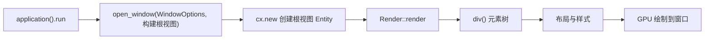

import { Meta } from '@storybook/addon-docs/blocks';

<Meta id="window-and-view" title="上手/窗口与首个界面" name="Docs" />

# 窗口与首个界面

GPUI 的一个界面由两层东西组成：**窗口**是操作系统层面的容器，它的位置、大小、标题栏和行为开关在创建时由 `WindowOptions` 一次性配置；**视图**是窗口里的内容，它是一个实现了 `Render` trait 的普通 Rust 结构体，`render` 方法返回一棵 `div` 元素树，GPUI 负责布局、样式并交给 GPU 绘制。本课沿官方 `hello_world` 示例讲清这条最小链路：写一个视图、开一个窗口，并把 `WindowOptions` 的全部字段与默认值核对清楚。



`WindowOptions` 共 14 个字段，全部有默认值，默认行为就是"一个可拖动、可缩放、可最小化的普通窗口"。先看全表，后文按问题分组展开；默认值核对自 gpui 0.2.2 的 `impl Default for WindowOptions`（docs.rs）。

| 字段 | 类型 | 默认值 | 作用 |
| --- | --- | --- | --- |
| `window_bounds` | `Option<WindowBounds>` | `None`（沿用平台给定的位置大小） | 窗口初始位置、大小与状态（普通/最大化/全屏） |
| `titlebar` | `Option<TitlebarOptions>` | `Some(TitlebarOptions::default())` | 标题栏：标题文字、自绘标题栏、macOS 红绿灯位置 |
| `focus` | `bool` | `true` | 创建时是否抢焦点 |
| `show` | `bool` | `true` | 创建时是否立即显示 |
| `kind` | `WindowKind` | `WindowKind::Normal` | 窗口类型：普通 / 弹出 / 浮动 |
| `is_movable` | `bool` | `true` | 是否允许用户拖动窗口 |
| `is_resizable` | `bool` | `true` | 是否允许用户调整大小 |
| `is_minimizable` | `bool` | `true` | 是否允许用户最小化 |
| `display_id` | `Option<DisplayId>` | `None`（主显示器） | 在哪块屏幕上打开 |
| `window_background` | `WindowBackgroundAppearance` | `Opaque` | 窗口底色形态：不透明 / 透明 / 模糊 |
| `app_id` | `Option<String>` | `None` | 桌面环境用来分组应用的标识 |
| `window_min_size` | `Option<Size<Pixels>>` | `None` | 窗口最小尺寸 |
| `window_decorations` | `Option<WindowDecorations>` | `None` | 客户端或服务端窗口装饰（仅 Wayland） |
| `tabbing_identifier` | `Option<String>` | `None` | macOS 原生标签页分组名 |

## 快速上手

一个 struct 实现 `Render`，加上 `open_window` 一次调用，就是一个完整的 GPUI 应用。以下代码精简自官方 `hello_world` 示例，可直接复制进 `src/main.rs` 运行：

```rust
use gpui::{
    App, Bounds, Context, SharedString, Window, WindowBounds, WindowOptions, div, prelude::*, px,
    rgb, size,
};
use gpui_platform::application;

// 界面 = 一个实现 Render 的普通 Rust 结构体
struct HelloWorld {
    text: SharedString,
}

impl Render for HelloWorld {
    fn render(&mut self, _window: &mut Window, _cx: &mut Context<Self>) -> impl IntoElement {
        div()
            .flex()                    // 启用 flex 布局
            .flex_col()                // 主轴改为纵向
            .size_full()               // 铺满整个窗口
            .justify_center()          // 主轴居中
            .items_center()            // 交叉轴居中
            .gap_3()                   // 子节点之间的间距
            .bg(rgb(0x505050))         // 背景色
            .text_xl()                 // 字号
            .text_color(rgb(0xffffff)) // 文字颜色
            // child() 挂子节点，字符串也能直接当元素
            .child(format!("Hello, {}!", self.text))
            .child(
                // div 可任意嵌套，构成元素树
                div()
                    .flex()
                    .gap_2()
                    .child(div().size_8().bg(rgb(0xff0000)))
                    .child(div().size_8().bg(rgb(0x00ff00)))
                    .child(div().size_8().bg(rgb(0x0000ff))),
            )
    }
}

fn main() {
    application().run(|cx: &mut App| {
        // 500x500 的窗口，在主显示器上居中
        let bounds = Bounds::centered(None, size(px(500.), px(500.)), cx);
        cx.open_window(
            WindowOptions {
                window_bounds: Some(WindowBounds::Windowed(bounds)),
                ..Default::default() // 其余字段全部用默认值
            },
            // 构建根视图：闭包返回根视图的 Entity
            |_, cx| cx.new(|_| HelloWorld { text: "World".into() }),
        )
        .unwrap();
        // 把应用带到前台并获得焦点
        cx.activate(true);
    });
}
```

`cargo run` 后会看到一个居中的 500x500 深灰色窗口，中间是白色文字 `Hello, World!` 和一行红绿蓝色块。

依赖配置按第 1.1 课的工程为准；macOS 上 `gpui_platform` 至少需要 `font-kit` feature 才有真实字形：

```toml
gpui = "*"
gpui_platform = { version = "*", features = ["font-kit"] }
```

版本注意：`gpui_platform::application()` 是官方仓库 main 分支 README 的入口写法（`application()` 负责为当前操作系统挑选窗口与文字后端）。如果你用的是 crates.io 上已发布的 gpui 0.2.x，入口是 gpui 自带的 `Application`，写作 `Application::new().run(...)`，官网与 0.2.2 的示例均如此。详见常见问题。

## Render：视图如何变成界面

### render 方法与 impl IntoElement

`Render` 是 GPUI 区分"视图"与普通数据的关键 trait——实现了它的 `Entity` 才能被画到屏幕上。它只有一个必须实现的方法（gpui 0.2.2 签名）：

```rust
pub trait Render: 'static + Sized {
    /// 把这个视图渲染成元素树
    fn render(&mut self, window: &mut Window, cx: &mut Context<Self>) -> impl IntoElement;
}
```

三个参数各管一件事：

- `&mut self`：渲染前可以读取自己的字段，界面永远反映最新数据；
- `window: &mut Window`：窗口运行期状态的入口，比如读窗口尺寸（`window.bounds()`）、管理焦点；
- `cx: &mut Context<Self>`：当前视图的上下文，用于访问状态、发起重渲染——重渲染循环是第 1.3 课的主题。

返回值 `impl IntoElement` 是"任何能变成元素的类型"。`IntoElement` 只要求一个关联类型和一个转换方法：

```rust
pub trait IntoElement: Sized {
    type Element: Element;
    fn into_element(self) -> Self::Element;
    // into_any_element(self) -> AnyElement 为提供方法
}
```

docs.rs 列出的常用实现者就能解释快速上手里的几个现象：`Div`（`div()` 的返回值）、`&'static str` 与 `String`/`SharedString`（所以 `.child("文字")`、`.child(format!(...))` 都能编译）、`Entity<V>`（`V: Render`，视图可以像元素一样被嵌入，后续课程会用到）、`AnyElement`（动态元素容器）。

理解 GPUI 声明式模型的关键：`render` 不"执行界面修改"，而是"描述当前这一帧应该长什么样"。官方 README 的说法是——每一帧开始时，GPUI 会对窗口的根视图调用 `render`，视图构建一棵元素树、用 Tailwind 风格的 API 布局和造型，然后交给 GPUI 变成像素。状态变化后重新调用 `render` 生成新树，这个循环由 `cx.notify()` 驱动，第 1.3 课展开。

### div：容器、子节点与链式样式

`div()` 返回 `Div`，官方文档称它为"the all-in-one element"——构造复杂 UI 的万能元素，绝大多数界面由它组成。`Div` 同时实现了几个关键 trait，每个 trait 带来一组方法：

| trait | 带来的能力 | 本课用到 |
| --- | --- | --- |
| `ParentElement` | `child()` 挂单个子节点、`children()` 批量挂 | 组成元素树 |
| `Styled` | Tailwind 风格的样式方法：`.flex()`、`.bg()`、`.gap_3()` 等 | 链式造型 |
| `InteractiveElement` | 事件处理与交互状态 | 第 3 阶段课程 |

子节点参数是 `impl IntoElement`，所以任何元素都能嵌套，形成树状结构：

```rust
div()
    .flex()
    .gap_2()
    .child("第一行文字") // 字符串是叶子节点
    .child(
        div() // div 套 div，继续向下长
            .flex()
            .flex_col()
            .child(div().size_8().bg(rgb(0xff0000)))
            .child(div().size_8().bg(rgb(0x00ff00))),
    )
    .children((0..3).map(|i| div().size_8().bg(rgb(i as u32 * 0x101010)))) // 迭代器批量挂
```

样式方法全部支持链式调用，写法和 Tailwind 类名高度对应：`.flex()` 对应 `flex`，`.gap_3()` 对应 `gap: 0.75rem`，`.size_8()`、`.rounded_md()`、`.shadow_lg()` 同理。本课只把链式样式当入门演示——主轴与交叉轴、尺寸单位、颜色与文本样式是第 2 阶段（布局与样式）各课的内容，这里先建立"样式是往元素上链式追加的约束"这一个判断就够。

## WindowOptions：配置窗口

`App::open_window` 的第一个参数就是 `WindowOptions`，结构体文档的原话是"创建新窗口时可以配置的全部变量"。它的完整签名（gpui 0.2.2）：

```rust
pub fn open_window<V: 'static + Render>(
    &mut self,
    options: WindowOptions,
    build_root_view: impl FnOnce(&mut Window, &mut App) -> Entity<V>,
) -> anyhow::Result<WindowHandle<V>>
```

第二个参数是构建根视图的闭包：拿到 `&mut Window` 和 `&mut App`，返回根视图 `Entity<V>`；返回值是 `Result<WindowHandle<V>>`，窗口创建失败时得到 `Err`。开场参考表已列全 14 个字段与默认值，下面按常见问题分组展开常用成员。

### 位置与大小：window_bounds

`window_bounds` 是 `Option<WindowBounds>`：`None` 表示沿用平台给定的位置大小；`Some` 时由 `WindowBounds` 三个变体决定窗口的初始状态。`Windowed` 的 `Bounds` 就是窗口本身的位置和大小；`Maximized` 与 `Fullscreen` 的 `Bounds` 则是"还原尺寸"——用户退出最大化或全屏后回到的大小：

```rust
enum WindowBounds {
    Windowed(Bounds<Pixels>),  // 普通窗口，bounds 就是窗口的位置和大小
    Maximized(Bounds<Pixels>), // 最大化打开，bounds 是还原尺寸
    Fullscreen(Bounds<Pixels>), // 全屏打开，bounds 是还原尺寸
}
```

居中开窗不用手算屏幕尺寸，`Bounds::centered` 内部会查指定显示器的边界来居中，第一个参数传 `None` 表示主显示器：

```rust
let bounds = Bounds::centered(None, size(px(500.), px(500.)), cx);
WindowOptions {
    window_bounds: Some(WindowBounds::Windowed(bounds)),
    ..Default::default()
}
```

要精确控制位置就手动构造 `Bounds`——屏幕坐标系原点在左上角。官方 `window_positioning` 示例就是用这种写法把小窗口摆到每块屏幕的四角与各边中点：

```rust
let bounds = Bounds {
    origin: point(px(100.), px(100.)),
    size: size(px(350.), px(75.)),
};
```

同属尺寸控制的还有 `window_min_size`，限制用户能把窗口缩到多小：`window_min_size: Some(size(px(400.), px(300.)))`。

### 标题栏：titlebar

`titlebar` 是 `Option<TitlebarOptions>`，默认值 `Some(TitlebarOptions::default())` 就是标准系统标题栏，其中 `title` 默认为 `None`——所以默认窗口**没有标题文字**。`TitlebarOptions` 的三个字段：

- `title: Option<SharedString>`：窗口的初始标题；
- `appears_transparent: bool`：隐藏系统标题栏外观、留出自绘空间（macOS 与 Windows；Linux 上对应 `window_decorations`）；
- `traffic_light_position: Option<Point<Pixels>>`：macOS 红绿灯按钮的位置。

显示标题文字：

```rust
WindowOptions {
    titlebar: Some(TitlebarOptions {
        title: Some("我的应用".into()),
        ..Default::default()
    }),
    ..Default::default()
}
```

自绘标题栏：官方 `window` 示例的 "Custom Titlebar" 按钮直接传 `titlebar: None`，然后在界面顶部自己画一条 `div` 当标题栏。macOS 平台层对 `None` 与 `appears_transparent: true` 采用同样的透明标题栏处理，区别在于 `None` 连标题文字、红绿灯位置配置也一并放弃——要保留这两项配置就用 `Some(TitlebarOptions { appears_transparent: true, .. })` 的写法。

### 行为开关：is_resizable、is_movable、is_minimizable

三个 `bool` 开关分别控制用户能否缩放、拖动、最小化窗口，默认全是 `true`。官方 `window` 示例给每个开关做了一个按钮，点开后肉眼可验证：`is_resizable: false` 的窗口边缘不可拖拽；`is_minimizable: false` 后最小化不可用；`is_movable: false` 的窗口无法拖动。

```rust
WindowOptions {
    is_resizable: false, // 禁止用户调整大小
    ..Default::default()
}
```

一个常见搭配藏在官方示例里：`is_movable: false` 与 `titlebar: None` 同时设置——没有系统标题栏就没有可拖拽的区域，两个开关要一起考虑。

### 窗口类型与出现方式：kind、show、focus

`kind` 决定窗口在系统里的层级形态，`WindowKind` 三个变体：

| 变体 | 行为 |
| --- | --- |
| `WindowKind::Normal`（默认） | 普通应用窗口 |
| `WindowKind::PopUp` | 浮于所有窗口之上；官方文档提醒 "use sparingly!"（慎用） |
| `WindowKind::Floating` | 浮于它的父窗口之上 |

`show: false` 让窗口创建成功但不显示——官方 `window` 示例的 "Invisible" 按钮即此项，点击后程序在运行但看不到窗口。`focus: false` 让窗口创建时不抢焦点，适合后台开窗；官方 `window_positioning` 示例同时开了 `show: true` 与 `focus: false`，一次在每块屏幕铺一圈不抢焦点的小窗：

```rust
WindowOptions {
    kind: WindowKind::PopUp,
    focus: false, // 创建时不抢焦点
    ..Default::default()
}
```

### 显示器与窗口背景：display_id、window_background

`display_id: Some(id)` 指定窗口在哪块屏幕打开，`None`（默认）即主显示器；显示器列表可从 `cx.displays()` 拿到，`window_positioning` 示例就是遍历它给每块屏幕摆窗口。多显示器的坐标系细节不在本课展开。

`window_background` 描述"窗口本身"的底色形态，三个变体：

- `Opaque`（默认）：不透明，窗口管理器可以因此跳过绘制窗口后面的内容；
- `Transparent`：普通 alpha 透明；
- `Blurred`：透明且背后内容被模糊，文档明确说"Not always supported"（不一定被平台支持）。

注意它控制的是窗口底、而不是界面内容的颜色——内容颜色仍由 `div` 的 `.bg()` 决定。

### 平台专属字段：app_id、window_decorations、tabbing_identifier

三个字段只在特定平台有意义，创建通用应用时保持默认 `None` 即可：

- `app_id: Option<String>`：窗口的应用标识，供桌面环境分组应用（Linux）；
- `window_decorations: Option<WindowDecorations>`：选择客户端还是服务端窗口装饰，仅 Wayland 有效，且文档注明可能被忽略；
- `tabbing_identifier: Option<String>`：相同的标识会让窗口以 macOS 10.12+ 原生标签页的形式归为一组。

## 最佳实践

- **用 `..Default::default()` 只写要改的字段。** 全部官方示例都是这个写法：`WindowOptions { 你关心的字段, ..Default::default() }`。它让代码只表达"和默认行为的差异"，框架新增字段时你的代码也不用跟着改。
- **定位交给 `Bounds::centered` 与 `WindowBounds` 变体，不要手算。** 居中、最大化、全屏都有现成表达；只有"贴边、固定位置"这类需求才手动构造 `Bounds { origin, size }`，并记住原点在屏幕左上角。
- **标题栏按需三选一。** 默认（系统标题栏、无文字）够用时不动它；要标题文字就配 `title`；要做自定义工具栏式标题栏，用 `titlebar: None` 或 `appears_transparent: true` 自绘——后者保留标题与红绿灯位置配置，通常更好。
- **`PopUp` 与 `Floating` 是特权层级，默认用 `Normal`。** 官方文档对 `PopUp` 的提醒是 "use sparingly!"；层级需求不明确时先保持默认，交互窗口（对话框、浮层）的完整实践在交互与多窗口课程。

## 常见问题

- 编译报错找不到 `gpui_platform` crate，或者反过来找不到 `Application`。
  先确认依赖来源再选入口写法：跟官方仓库 main 分支文档走时，依赖是 `gpui` + `gpui_platform` 两个 crate，入口写 `gpui_platform::application().run(...)`；跟 crates.io 发布的 0.2.x（截至本课编写最新 0.2.2，`gpui_platform` 尚未发布到 crates.io）走时，入口在 gpui 自带类型上，写 `Application::new().run(...)`。两种写法下 `open_window`、`WindowOptions`、`Render` 的用法完全一致，工程配置以第 1.1 课为准。
- 窗口开出来了，但没有标题。
  标题不是独立字段，默认 `TitlebarOptions` 里 `title` 就是 `None`。显式配置：`titlebar: Some(TitlebarOptions { title: Some("标题".into()), ..Default::default() })`。
- 给 `div` 设了透明背景，窗口看起来还是一块不透明的灰色。
  窗口底色形态由 `window_background` 控制，默认 `Opaque`，要先设 `window_background: WindowBackgroundAppearance::Transparent`，界面内容再配合透明背景；`Blurred` 在部分平台不受支持，失效时先怀疑平台能力而不是写法。

## 总结回顾

摘要：

本课建立了 GPUI 界面的最小单元：`application().run` 启动应用后，用 `App::open_window(WindowOptions, build_root_view)` 创建窗口，闭包里用 `cx.new` 构建一个实现了 `Render` 的根视图。视图的 `render(&mut self, window, cx)` 每一帧返回一棵元素树——通常是 `div()` 套 `child()`/`children()` 组成的树，样式用 Tailwind 风格的方法链式追加；返回类型 `impl IntoElement` 意味着 `div`、字符串、嵌套视图都能出现在树里。窗口本身的位置大小（`window_bounds` + `WindowBounds` 三变体）、标题栏（`titlebar`）、行为开关（`is_resizable` 等三个 bool）、类型与出现方式（`kind`、`show`、`focus`）、目标屏幕与底色（`display_id`、`window_background`）以及平台专属字段，全部在 `WindowOptions` 创建时一次性配置，默认值就是"普通可交互窗口"。

一句话：

> GPUI 的界面是声明式的：`open_window` 交给窗口一个实现 `Render` 的根视图，每一帧界面都由 `render` 返回的 `div` 树描述，而窗口自身的外观与行为由 `WindowOptions` 在创建时一次性决定。

知识要点：

- 一个最小的 GPUI 界面由哪几块组成，`application().run`、`open_window`、`cx.new`、`render` 各自发生在链路的哪一步？
- `Render::render` 的完整签名是什么，返回类型 `impl IntoElement` 允许哪些东西出现在元素树上？
- `div()` 返回什么，`child`/`children` 与链式样式方法分别来自哪个 trait？
- 窗口的初始位置、大小、最大化、全屏分别在 `WindowOptions` 的哪个字段、哪些变体里配置？
- 窗口标题怎么设置？默认的标题栏行为是什么，自绘标题栏有哪两种配法、差别在哪？
- `kind`、`show`、`focus` 三个字段分别控制什么，默认值是什么？
- 哪些 `WindowOptions` 字段是平台专属的，分别作用于哪个平台？

## 参考资料

- [官方示例 hello_world.rs](https://github.com/zed-industries/zed/blob/main/crates/gpui/examples/hello_world.rs)
- [官方示例 window.rs](https://github.com/zed-industries/zed/blob/main/crates/gpui/examples/window.rs)（`WindowKind`、`titlebar: None`、行为开关、`show: false` 的对照演示）
- [官方示例 window_positioning.rs](https://github.com/zed-industries/zed/blob/main/crates/gpui/examples/window_positioning.rs)（多显示器定位与 `WindowOptions` 全字段的完整列表）
- [gpui crate README（main 分支）](https://github.com/zed-industries/zed/blob/main/crates/gpui/README.md)（`gpui_platform` 入口与平台 feature 说明）
- [GPUI 官方站点](https://gpui.rs/)（发布版入口写法 `Application::new().run` 的来源）
- [docs.rs：WindowOptions](https://docs.rs/gpui/latest/gpui/struct.WindowOptions.html)
- [docs.rs：App（含 `open_window` 签名）](https://docs.rs/gpui/latest/gpui/struct.App.html)
- [docs.rs：Render trait](https://docs.rs/gpui/latest/gpui/trait.Render.html)
- [docs.rs：IntoElement trait](https://docs.rs/gpui/latest/gpui/trait.IntoElement.html)
- [docs.rs：div 函数与 Div](https://docs.rs/gpui/latest/gpui/fn.div.html)
- [docs.rs：WindowBounds](https://docs.rs/gpui/latest/gpui/enum.WindowBounds.html)
- [docs.rs：WindowKind](https://docs.rs/gpui/latest/gpui/enum.WindowKind.html)
- [docs.rs：TitlebarOptions](https://docs.rs/gpui/latest/gpui/struct.TitlebarOptions.html)
- [docs.rs：WindowBackgroundAppearance](https://docs.rs/gpui/latest/gpui/enum.WindowBackgroundAppearance.html)
