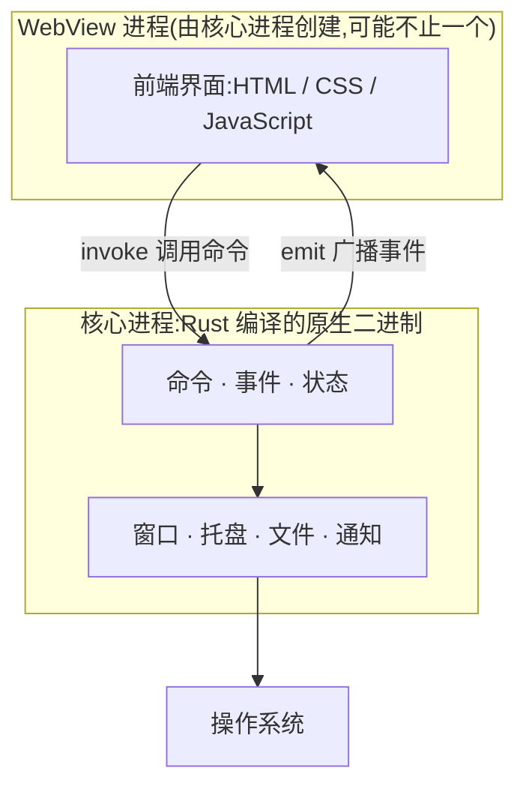

import { Canvas, Controls, Meta } from '@storybook/addon-docs/blocks';
import * as AboutTauri from './about-tauri.stories';

<Meta of={AboutTauri} name="Docs" />

# 认识 Tauri

Tauri 是一个用 Rust 构建跨平台应用的框架:界面用任意 Web 前端技术编写,运行在一个复用操作系统自带 WebView 的窗口里;窗口、文件、托盘等系统能力由一个编译为原生二进制的 Rust 核心进程承担,两侧通过 IPC 通信。本课是整套手册的入口,不安装任何工具,只把三件事讲清:一个 Tauri 应用由哪些部分组成、它和 Electron 的差异到底在哪、什么样的需求适合选它。

读完本课,你应该能预测后续课程里每个操作发生在哪一侧:改样式、调布局属于 WebView 侧,加托盘、读文件属于核心进程侧,而两者的每次对话都要经过 IPC 这条桥。下面这张图是全课的底图,先记住它,再往下看。



| 术语 | 它是什么 | 回查要点 |
| --- | --- | --- |
| Tauri | 用 Rust 构建、以系统 WebView 渲染 Web 前端的应用框架 | 本手册以 Tauri 2.x 为准 |
| 核心进程 | 应用入口,Rust 编译的原生二进制 | 唯一拥有完整操作系统权限的组件;所有 IPC 消息都经它路由 |
| WebView 进程 | 由核心进程创建的"类浏览器"环境,渲染前端界面 | 传统 Web 技术栈和工具链几乎全部可用 |
| 系统 WebView | 操作系统自带的网页引擎 | 不随应用打包,运行时动态链接——这是体积小的根源 |
| WRY | Tauri 对接各平台 WebView 的 Rust 渲染抽象层 | 决定用哪个 WebView 以及如何与它交互 |
| TAO | Tauri 的跨平台窗口创建库(winit 的 fork) | 负责窗口、菜单栏、系统托盘 |
| IPC | WebView 与核心进程之间的消息通道 | `invoke` 命令调用和事件收发都走这条通道 |

## 架构模型

把底图压缩成一句话:一个 Tauri 应用 = 交给 WebView 加载的静态前端资源 + 一个 Rust 编译的核心进程。开发时的每个动作都能落进这个模型——前端改动走 Web 工具链,Rust 改动走 cargo,系统能力只从核心进程伸出。下面按模型的三个构件依次展开。

### Rust 核心

Rust 核心是 `src-tauri/` 里的 Rust 工程,编译产物就是应用主程序,运行起来即核心进程。它的职责有四类:创建和管理窗口、托盘、通知;管理设置、数据库连接等全局状态;路由并检查所有 IPC 消息;以最小权限原则把前端与操作系统隔开。核心进程的入口就是一段普通的 Rust 代码,启动 `tauri::Builder` 运行时(2.x 模板把它放在 `src-tauri/src/lib.rs`,由 `main.rs` 调用,以便同时支持桌面与移动端):

```rust
// 简化自 create-tauri-app 默认模板:入口启动 tauri::Builder,即核心进程
#[cfg_attr(mobile, tauri::mobile_entry_point)]
pub fn run() {
    tauri::Builder::default()
        .run(tauri::generate_context!())
        .expect("error while running tauri application");
}
```

官方选择 Rust 的理由是所有权机制在保证内存安全的同时保持性能。桌面端核心进程就是 Rust;移动端后端还可以用 Swift/Kotlin 写绑定,本手册把移动端放在最后阶段展开。工程目录与 `tauri.conf.json` 如何组织,见「工程结构」一课。

### 系统 WebView

WebView 是界面真正渲染的地方。Tauri 不自带浏览器,而是通过 WRY 复用操作系统自带的网页引擎,各平台对应关系固定:

| 平台 | 系统 WebView |
| --- | --- |
| macOS | WKWebView |
| Windows | Microsoft Edge WebView2 |
| Linux | WebKitGTK |

这套对应关系可以在下方「与 Electron 的对比」实例里直接观察:切换「目标平台」,读数中的浏览器引擎会随之变化。注意两点边界:WebView 库不进入最终可执行文件,而是在运行时动态链接;`tauri dev` 打开的窗口用的同样是系统 WebView,所以开发时看到的就是目标平台真实引擎(前提是在该平台上开发)。

### IPC 桥接

IPC 是 WebView 与核心进程之间唯一的常规通道。所有消息都经核心进程集中路由,便于在一个位置拦截、过滤和做权限检查。两侧各写一行就能连起来——前端调用命令:

```ts
// 前端:调用核心进程暴露的命令
import { invoke } from '@tauri-apps/api/core';

const greeting = await invoke<string>('greet', { name: 'Tauri' });
```

Rust 侧把一个函数声明为命令:

```rust
// Rust 侧:把一个函数声明为命令
#[tauri::command]
fn greet(name: &str) -> String {
    format!("Hello, {name}!")
}
```

还差一步注册:命令要挂到 `tauri::Builder` 的 `generate_handler` 上才能被前端调用。参数、返回值与异步命令的完整写法在「命令」一课展开;哪些命令允许哪个窗口调用由 Capabilities 权限声明决定,见「权限与能力」一课。

## 与 Electron 的对比

两者是同一思路的两种实现:都用 Web 技术写界面,都靠原生外壳提供系统能力,也都采用多进程架构。根本差异只有一句话:Electron 把完整的 Chromium 浏览器和 Node.js 运行时打包进每一个应用;Tauri 复用操作系统自带的 WebView,把"后端"换成编译为原生二进制的 Rust 核心。

下面的实例画出两种方案"随应用分发"的组件。切换「框架」观察:Electron 的安装包里始终有 Chromium 与 Node.js 两块;切到 Tauri 后它们消失,取而代之的是虚线框里由操作系统提供的系统 WebView,以及 Rust 核心与 WebView 之间的 IPC 桥接。

<Canvas of={AboutTauri.Interactive} />
<Controls of={AboutTauri.Interactive} />

| 读者操作 | 可观察证据 |
| --- | --- |
| 把「框架」从 Tauri 切到 Electron | 安装包内多出「Node.js 运行时」「Chromium」两块,虚线框内变为"不使用系统 WebView",三项读数同步变化 |
| 切换「目标平台」 | 只有 Tauri 生效:虚线框里的系统 WebView 与「浏览器引擎」读数在 WKWebView / Edge WebView2 / WebKitGTK 之间切换;切回 Electron 再试,画面与读数纹丝不动 |
| 打开 Show code | 看到该 Canvas 实际执行的 `example.ts` |

"引擎随应用走"与"引擎随系统走"这一条根差异,派生出下表的全部次级差异:

| 维度 | Electron | Tauri |
| --- | --- | --- |
| 浏览器引擎 | 随应用打包 Chromium,全平台同一引擎 | 复用系统 WebView,平台之间存在差异 |
| 后端运行时 | Node.js(随应用打包) | Rust 核心,编译为原生二进制 |
| 安装包体积 | 因自带浏览器与运行时显著更大 | 官方文档称最小的 Tauri 应用可小于 600KB |
| 渲染一致性 | 各平台行为高度一致 | 跟随系统 WebView 版本,需在目标平台验证 |
| 语言栈 | 前后端都是 JavaScript/TypeScript | 前端任意,核心进程需要 Rust |
| 生态 | 成熟,第三方方案丰富 | 较新,官方插件体系持续扩展 |

## 适用场景

架构差异直接决定选型。下面两组信号都来自上面的组成差异,判断时按"是否需要自带引擎 → 能否接受 Rust 核心"的顺序过一遍。

选 Tauri 的信号:

- 在意安装包体积、内存占用和启动速度——工具类、常驻托盘类应用收益最明显
- 需要系统能力:窗口控制、托盘、菜单、文件、通知(手册后续课程逐一覆盖)
- 团队有 Web 前端基础,愿意用"够用即讲"的 Rust 换取体积与内存安全
- 已有 Web 工程想渐进迁移到桌面(见「集成已有前端」一课)

需要再权衡的信号:

- 要求所有平台渲染行为完全一致——Electron 自带同一引擎,跨平台一致性更省心
- 后端深度依赖 Node.js 生态——核心进程逻辑要迁到 Rust
- 界面重度依赖最新 Chromium 特性——系统 WebView 的版本由用户操作系统决定,不受你控制
- 主要目标是移动端——Tauri 2 支持 iOS/Android,但本手册把移动端放在最后阶段,先从桌面入手

## 最佳实践

- 遇到"这个功能在哪一侧实现"的问题,先按架构模型定位:DOM、样式、浏览器语义的网络请求属于 WebView 侧;窗口、托盘、文件、跨窗口共享状态属于核心进程侧。先定位侧别,再去对应课程找 API。
- 把业务敏感逻辑放核心进程:WebView 中的代码运行在类浏览器环境,机密信息不要放在前端处理;官方也建议尽量把业务逻辑放进核心进程,以缩小攻击面。
- 跨平台发布前在真实目标平台验证界面:开发机的系统 WebView 只代表当前平台,macOS 上开发的界面到 Windows(WebView2)、Linux(WebKitGTK)上可能表现不同,用虚拟机或 CI 补验证。

## 常见问题

- 「Tauri 也是把浏览器打进应用包里吧?不然拿什么渲染界面?」
  不是。WebView 库不进入最终可执行文件,而是在运行时动态链接操作系统自带的 WebView。想自行验证,跑一次 `tauri build` 看安装包体积,再与 Electron 同等应用对比。
- 「界面在我的 Chrome 里好好的,到应用窗口里布局或 API 行为就不对了。」
  以目标平台的系统 WebView 为基准排查,不要以你安装的 Chrome 为基准:macOS 是 WKWebView、Windows 是 Edge WebView2、Linux 是 WebKitGTK,版本随操作系统走。用 `tauri dev` 窗口里的 WebView 开发者工具检查,而不是外部浏览器。
- 「前端改一行样式,也要等 Rust 重新编译吗?」
  不用。`tauri dev` 下前端改动走前端构建工具的热更新,只有 `src-tauri/` 里的 Rust 代码变化才触发重新编译。这正对应架构模型:前端是 WebView 加载的静态资源,Rust 二进制并没有变。

## 总结回顾

摘要:

Tauri 应用的骨架是两个进程:Rust 编译的核心进程负责窗口、状态和一切系统能力,并集中路由所有 IPC;WebView 进程加载静态前端资源,负责界面渲染。WebView 来自操作系统——macOS 用 WKWebView、Windows 用 WebView2、Linux 用 WebKitGTK——不随应用打包。这与 Electron 把 Chromium 和 Node.js 打进每个应用构成根本差异,并派生出体积、渲染一致性、语言栈与生态上的取舍。选型时先看"是否需要自带浏览器引擎、能否接受 Rust 核心"这两条主线,再看具体需求信号。

一句话:

> Tauri 把浏览器交给操作系统,把系统能力和业务核心交给 Rust,前端只是被 WebView 加载的界面层。

知识要点:

- 一个 Tauri 应用由哪两个进程组成?哪个拥有完整的操作系统权限?
- 三大桌面平台的系统 WebView 分别是什么引擎?它们为什么不占安装包体积?
- Electron 与 Tauri 的根本差异是什么?它派生了哪些次级差异?
- `invoke` 与 `#[tauri::command]` 分别写在哪一侧?消息由谁路由?
- 哪些信号说明适合选 Tauri?哪些信号说明要再权衡?

## 参考资料

- [What is Tauri? — Tauri 官方文档](https://tauri.app/start/)
- [Tauri Architecture — Tauri 官方文档](https://tauri.app/concept/architecture/)
- [Process Model — Tauri 官方文档](https://tauri.app/concept/process-model/)
