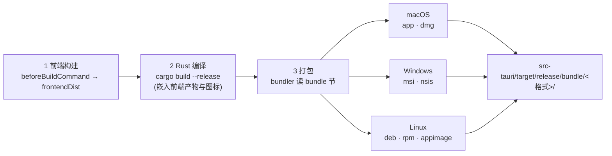

import { Canvas, Controls, Meta } from '@storybook/addon-docs/blocks';
import * as Bundling from './bundling.stories';

<Meta of={Bundling} name="Docs" />

# 打包

`tauri build` 的最后一段是打包:cargo 编译出裸二进制之后,bundler 读取 `tauri.conf.json` 的 `bundle` 节,把二进制连同图标、元数据和随包资源包成目标平台的安装包——macOS 的 .app / DMG、Windows 的 MSI / NSIS、Linux 的 deb / rpm / AppImage,统一落在 `src-tauri/target/release/bundle/<格式>/` 下。本课建立的核心直觉:**产物清单 = 目标平台 × targets 配置**。同一份 `"targets": "all"`,在三个平台上产出的是三份完全不同的清单;而某个格式能不能在这台机器上打出来,还叠着一层构建环境边界(WiX 只能跑在 Windows 上,DMG 要在 macOS 上构建)。下面这张流水线图回答「一条 build 命令内部发生了什么」,也是后文判断「改了什么、重跑哪一步」的依据。



最常回查的一张表——七种格式的产物与安装方式(示例取 `productName` 为 `Notes`、`version` 为 `0.1.0`;文件名的分段规则来自 tauri-bundler 的命名逻辑,arch 段随构建平台变化,正文与实例展开):

| 格式 | 平台 | 产物(相对 `target/release/`) | 用户怎么装 |
| --- | --- | --- | --- |
| `app` | macOS | `bundle/macos/Notes.app` | 拖进 Applications 直接使用 |
| `dmg` | macOS | `bundle/dmg/Notes_0.1.0_aarch64.dmg` | 打开磁盘镜像拖拽安装;App Store 外分发最常用 |
| `msi` | Windows | `bundle/msi/Notes_0.1.0_x64_en-US.msi` | Windows Installer;常用于企业部署 |
| `nsis` | Windows | `bundle/nsis/Notes_0.1.0_x64-setup.exe` | 向导式安装;默认只装当前用户、免管理员 |
| `deb` | Linux | `bundle/deb/Notes_0.1.0_amd64.deb` | Debian / Ubuntu 系包管理器 |
| `rpm` | Linux | `bundle/rpm/Notes-0.1.0-1.x86_64.rpm` | Fedora / RHEL 系包管理器 |
| `appimage` | Linux | `bundle/appimage/Notes_0.1.0_amd64.AppImage` | `chmod a+x` 后直接运行,免安装 |

## 快速上手

前提:沿用[第一个应用](?path=/docs/first-app--docs)生成的工程。以下命令在 macOS(Apple Silicon)上直接成立;在 Windows / Linux 上跑,产物按开场总表对应到各自格式。

```bash
# 1. 完整构建:前端 → Rust → 打包(首次构建耗时较长)
npm run tauri build

# 2. 观察安装包:macOS 上 targets "all" 产出 app 与 dmg 两个子目录
ls src-tauri/target/release/bundle/
# dmg    macos

# 3. 对比:跳过打包,只有裸二进制
npm run tauri build -- --no-bundle
ls src-tauri/target/release/   # 可执行文件 Notes(无扩展名)

# 4. 二进制不变,只调整打包:限定格式,或对已有二进制补跑打包
npm run tauri build -- --bundles dmg
npm run tauri bundle
```

`tauri dev` 不涉及打包——本课所有内容都只发生在 `tauri build` / `tauri bundle` 时。

## 构建流水线

一条 `tauri build` 依次执行三个阶段,每个阶段读取的配置不同:

1. **前端构建** —— 执行 `build.beforeBuildCommand`(模板为 `npm run build`),把前端产物输出到 `build.frontendDist` 指向的目录。前端接线见[配置](?path=/docs/configuration--docs)一课。
2. **Rust 编译** —— 执行 `cargo build --release`(`--debug` 则走 debug 档);前端产物、图标等资源在编译期嵌入二进制,体积账目见[性能与体积](?path=/docs/performance--docs)一课。
3. **打包** —— bundler 读 `bundle` 节:`active` 为 `true` 才执行(schema 默认值是 `false`,脚手架模板为 `true`),按 `targets` 决定产出哪些格式,再把图标、元数据、随包资源一起包进安装包。

常用命令变体(`npm` 跑 CLI 时,额外参数跟在 `--` 之后):

| 命令 | 作用 |
| --- | --- |
| `npm run tauri build` | 完整流水线,按 `bundle.targets` 打包 |
| `npm run tauri build -- --no-bundle` | 跳过打包步骤(即使 `bundle.active` 为 `true`),只要裸二进制 |
| `npm run tauri build -- --bundles dmg` | 打包格式限定为参数列表,覆盖配置里的 `targets` |
| `npm run tauri bundle` | 只执行打包阶段,复用 `target/release/` 下已有二进制,不重新编译 |
| `npm run tauri build -- --debug` | 以 debug 档构建(产物体积大,用于排查) |

由此得到一条重跑判断:`bundle` 节的调整大多只影响第三阶段——先 `--no-bundle` 拿到裸二进制,再用 `tauri bundle` 反复迭代打包配置,不必每次全量编译。

## bundle 配置

`bundle` 节只在打包阶段被读取。全部字段一张表(默认值来自配置参考;平台子节 `macOS` / `windows` / `linux` 见「平台产物」一节,移动端子节由移动端课程覆盖):

| 字段 | 作用 | 默认值与要点 |
| --- | --- | --- |
| `active` | 是否执行打包 | `false`;脚手架模板设为 `true` |
| `targets` | 打包格式 | `"all"`(按平台映射);可写 `deb`、`rpm`、`appimage`、`nsis`、`msi`、`app`、`dmg` 或列表 |
| `icon` | 图标文件数组 | `[]`;模板自带 `icons/` 下五项,生成方式见下文「图标」 |
| `category` | 应用分类 | `null`;取 `Business`、`DeveloperTool`、`Education` 等枚举值,完整清单见配置参考 |
| `shortDescription` | 单行简述 | `null`;进入安装包元数据 |
| `longDescription` | 多行长描述 | `null` |
| `publisher` | 发布者 | `null`;默认取 `identifier` 的第二段;映射到 MSI 的 Manufacturer 与 deb 的 Maintainer |
| `homepage` | 主页 URL | `null`;回退 `Cargo.toml` 的 `homepage`;适用于 deb / rpm / nsis / msi |
| `copyright` | 版权信息 | `null` |
| `license` | 许可证标识符 | 取 `Cargo.toml` 的 `license` |
| `licenseFile` | 随包携带的许可证文件 | `null` |
| `resources` | 随包分发的资源文件 | 支持 glob 或「源 → 目标」映射;打包后位于 `$RESOURCES/` 并保留目录结构 |
| `externalBin` | 随包分发的外部二进制(sidecar) | `[]`;命名规则见下文 |
| `fileAssociations` | 应用关联打开的文件类型 | 特殊场景;按扩展名 / MIME 声明,见配置参考 |
| `createUpdaterArtifacts` | 是否生成自动更新所需产物 | 更新发布流程依赖它,见[自动更新](?path=/docs/updater--docs)一课 |

### targets 与产物格式

`targets: "all"` 是最容易误读的默认值——它不是「在所有平台都打所有包」,而是 bundler 按当前构建平台做映射:

| 构建平台 | `"all"` 实际产出 |
| --- | --- |
| macOS | `app` + `dmg` |
| Windows | `msi` + `nsis` |
| Linux | `deb` + `rpm` + `appimage` |

命令行 `--bundles` 在单次构建中覆盖 `targets`,格式列表直接点名:`npm run tauri build -- --bundles nsis`。下方的打包模拟器把两个关键输入放在一起:切换目标平台看 `"all"` 的映射变化,切换命令看流水线哪些阶段被执行、产物落在哪里——也包括「换个平台,同一条命令直接失败」的边界:

<Canvas of={Bundling.Interactive} />
<Controls of={Bundling.Interactive} />

| 读者操作 | 可观察证据 |
| --- | --- |
| 平台从 macOS 切到 Windows / Linux | 流水线三步不变,`"all"` 的产物清单整体切换,路径与文件名随平台变化 |
| 命令切到 `--bundles dmg`,平台留在 Windows / Linux | 打包阶段标红报错——DMG 只能在 macOS 上构建;切回 macOS 后产出 `bundle/dmg/` 下的 DMG |
| 命令切到 `--no-bundle` | 第三步跳过,产物清单为空,右下角给出裸二进制位置 |
| 命令切到 `tauri bundle` | 前两步跳过,只执行打包,产物与 `"all"` 一致 |
| 打开 Show code | 看到该 Canvas 实际执行的 `example.ts` |

模拟器的文件名是按 bundler 命名规则拼接的定性示意(产品名 `Notes`、版本 `0.1.0`、arch 取各平台典型值);真实产物以本机构建为准,核对步骤见课程目录的 `bundling-verification.md`。

### 图标

图标不手工逐个做,用 `tauri icon` 从一张源图生成全套:

```bash
npm run tauri icon /path/to/app-icon.png
```

- **输入要求:** 带透明度的正方形 PNG 或 SVG;不传参数时默认读取 `./app-icon.png`。
- **输出位置:** `tauri.conf.json` 旁的 `icons/` 目录(即 `src-tauri/icons/`),桌面图标会自动进入构建的应用。

| 生成文件 | 用途 |
| --- | --- |
| `icon.icns` | macOS(进入 .app 的 Resources) |
| `icon.ico` | Windows |
| `32x32.png`、`128x128.png`、`128x128@2x.png`、`icon.png` 等 | Linux 及各平台通用 |
| `Square*Logo.png`、`StoreLogo.png` | 预留应用商店目标,当前未使用 |

`bundle.icon` 数组引用这些文件(模板已写好五个入口);官方建议即使只发布部分平台,也保留全部生成文件——部分图标类型会被跨平台复用。确需手工制作时记住关键约束:`.ico` 要含 16 / 24 / 32 / 48 / 64 / 256 像素各层且 32px 放第一层;`.png` 要 `width == height`、RGBA、每像素 32bit。

### 元数据与描述

`bundle` 节的描述与署名字段大多有默认回退,回查时按「去向」定位:

| 字段 | 默认回退 | 主要去向 |
| --- | --- | --- |
| `publisher` | `identifier` 的第二段(如 `com.example.notes` → `example`) | MSI 的 Manufacturer、deb 的 Maintainer(当 `Cargo.toml` 无 authors) |
| `homepage` | `Cargo.toml` 的 `homepage` | deb / rpm / nsis / msi 的包元数据 |
| `license` | `Cargo.toml` 的 `license` | 安装包许可证元数据 |
| `licenseFile` | 无 | 随包携带的许可证文件 |
| `category` | 无 | 应用分类(安装包元数据) |
| `shortDescription` / `longDescription` | 无 | 单行简述与多行描述,进入安装包元数据 |

`publisher` 是其中最值得显式设置的一个:默认值只是 `identifier` 的中段,作为安装器里的「发布者」显示并不体面。

### 随包资源与外部二进制

**`resources`** 把文件随安装包分发:接受 glob 或「源 → 目标」映射,打包后位于 `$RESOURCES/` 下并保留目录结构:

```json
{
  "bundle": {
    "resources": ["assets/fonts/*", "extra/data.json"]
  }
}
```

运行时如何访问这些文件(路径解析与 asset 协议)属于打包之外的机制,见[自定义协议](?path=/docs/custom-protocol--docs)一课。

**`externalBin`**(sidecar)把独立编译好的二进制随包分发并保持可执行。关键在文件命名:bundler 按模式 `binary-name{-target-triple}{.system-extension}` 查找,即配置里写基础名,磁盘上的实际文件必须带目标三元组后缀:

```json
{
  "bundle": {
    "externalBin": ["binaries/my-sidecar"]
  }
}
```

打包时 bundler 在 `binaries/` 下挑中 `my-sidecar-aarch64-apple-darwin`、`my-sidecar-x86_64-pc-windows-msvc.exe` 这类与当前构建目标匹配的文件打进安装包——**每个目标平台都要提供对应二进制**,缺了就打不出来。

## 平台产物

每种格式都有两件事要回答:用户怎么装(开场总表)和在哪构建。第二件事是本节的共同模型——工具链边界决定了「谁能在哪台机器上打包」:

| 格式 | 构建环境要求 | 打包工具链 |
| --- | --- | --- |
| `app` / `dmg` | 在 macOS 上运行 CLI | bundler 内置 |
| `msi` | 仅 Windows | CLI 按需自动下载 WiX v3 并缓存;WiX 只能运行在 Windows 上 |
| `nsis` | 三平台均可 | CLI 按需自动下载 NSIS;也可用系统包安装(如 `brew install nsis`) |
| `deb` / `rpm` | 相应的 Linux 环境 | bundler 内置逻辑,依赖系统工具 |
| `appimage` | Linux 环境 | CLI 自动准备 linuxdeploy;不支持交叉构建 ARM |

官方对 Linux 产出的建议是:用 Docker 容器或 GitHub Actions 构建,基线选打算支持的最老系统(Ubuntu 22.04 或 Debian 12);CI 矩阵的完整做法见[CI/CD](?path=/docs/ci-cd--docs)一课。

### macOS:app 与 DMG

`app` 是应用本体——一个包含运行所需一切的目录:`<productName>.app/Contents/` 下有 `Info.plist`、`MacOS/` 里的可执行文件、`Resources/` 里的 `icon.icns` 与随包资源;产物在 `bundle/macos/`。需要自定义系统弹窗文案等键值时,在 `src-tauri/Info.plist` 里补充,CLI 会与生成的值合并(覆盖默认键可能引入意外行为)。

`dmg` 是最常用的分发包装:打开后是一个「把应用拖到 Applications」的安装窗口。窗口与图标布局由 `bundle.macOS.dmg` 控制,默认值:

| 项 | 默认值 |
| --- | --- |
| `windowSize` | 660 × 400 |
| `appPosition` | 180, 170 |
| `applicationFolderPosition` | 480, 170 |
| `background` | 可自定义背景图 |

注意:在 CI/CD 平台上创建 DMG 时,图标尺寸与位置不会应用(已知问题 tauri#1731),这类配置要在本地构建核对。

其余要点:`bundle.macOS.minimumSystemVersion` 控制最低系统版本(默认支持 macOS 10.13 及以上);要出同时含 Apple Silicon 与 Intel 的通用二进制,用 `--target universal-apple-darwin`(需先安装两个 Rust target),产物文件名的 arch 段变为 `universal`;未签名应用分发给用户会被 Gatekeeper 拦下,签名与公证见[代码签名](?path=/docs/code-signing--docs)一课。

### Windows:MSI 与 NSIS

Windows 上 `"all"` 产出双格式,分工不同:

- **MSI**(WiX v3 构建):面向企业部署场景;文件名的语言段来自 `bundle.windows.wix.language`,默认 `en-US`。WiX 只能运行在 Windows 上,所以 MSI 只能在 Windows 构建。
- **NSIS**(单文件 `-setup.exe`):多语言向导式安装器,三平台都能构建。

用户侧的两个关键行为都由配置决定:

| 配置 | 默认 | 可选值与影响 |
| --- | --- | --- |
| `windows.nsis.installMode` | `currentUser` | 只装当前用户,落 `%LOCALAPPDATA%`,免管理员;`perMachine` 系统级安装、`both` 让用户选,均需管理员权限 |
| `windows.webviewInstallMode` | `downloadBootstrapper` | 联网下载 WebView2 引导器,体积最小;`embedBootstrapper` 约 1.8 MB、`offlineInstaller` 约 127 MB、`fixedRuntime` 约 180 MB、`skip` 不推荐 |

在 macOS / Linux 上给 Windows 出包:NSIS 可以(装上 NSIS 工具即可),MSI 不行;基于 cargo-xwin 的交叉编译属最后手段,且签名需要外部工具(见[代码签名](?path=/docs/code-signing--docs)一课)。

### Linux:deb、rpm 与 AppImage

Linux 侧先分两类:**deb / rpm 走系统包管理器**,依赖系统安装的 WebKitGTK,包小、集成好;**AppImage 自包含**,把 WebKitGTK 等依赖全部打进单个文件,免安装、`chmod a+x` 直接运行,代价是体积从几 MB 涨到 70 MB 以上。

- **deb:** bundler 自动声明 `libwebkit2gtk-4.1-0` 与 `libgtk-3-0`(配置了系统托盘再加 `libappindicator3-1`);应用自身的额外系统依赖写进 `bundle.linux.deb.depends`。包元数据的 `Package` 字段取 `productName` 的 kebab-case,而文件名用 `productName` 原样拼接。
- **rpm:** 依赖与脚本通过 `bundle.linux.rpm` 的 `depends` / `provides` / `epoch` / `release`(默认 `"1"`)等配置;用 `rpm -qp --requires <包>.rpm` 查看打出的包声明了哪些依赖。
- **files 映射(deb / rpm / appimage 各自有):** 键为包内路径(必须以 `/usr/` 开头),值为相对 `tauri.conf.json` 的源路径:

```json
{
  "bundle": {
    "linux": {
      "deb": {
        "files": { "/usr/share/README.md": "../README.md" }
      }
    }
  }
}
```

- **AppImage 的音视频应用:** 设 `bundle.linux.appimage.bundleMediaFramework` 附加 GStreamer 文件(构建系统需装齐运行时插件,注意相关许可)。
- **glibc 边界:** 在过新的系统上构建会抬高 glibc 要求,旧发行版运行时报 `GLIBC_2.xx not found`——按最老支持系统构建(见本节开头的基线建议)。

## 最佳实践

- **在目标平台上构建对应格式。** macOS 出 app / dmg,Windows 出 msi / nsis,Linux 出 deb / rpm / appimage 且用最老基线容器或 CI 构建;交叉编译是最后手段,不是常规流程。
- **产物集合要精确时,用显式列表而不是 `"all"`。** `"all"` 的映射随平台变化是特性;CI 与本地必须产出一致清单时,`targets` 直接写列表(如 `["nsis"]`)。
- **图标与元数据在发布前填齐。** `tauri icon` 全套生成、保留全部文件;`publisher` 显式设置,别让 `identifier` 的第二段充当发布者。
- **打包配置的迭代不必全量编译。** 先 `--no-bundle` 拿裸二进制冒烟,`tauri bundle` 反复调打包;图标等编译期嵌入项有改动时再整条重跑 `tauri build`。
- **平台相关的窗口与布局配置本地核对。** DMG 的图标位置在 CI 上不生效是已知问题;发版前在本机构建看一眼真实产物。

## 常见问题

- `--bundles dmg` 在 Windows / Linux 上直接失败
  DMG 需要在 macOS 上构建,MSI 的 WiX 同理只能跑在 Windows——这是工具链边界,不是配置错误。按平台分工构建,或用 CI 矩阵分别产出(见[CI/CD](?path=/docs/ci-cd--docs)一课);NSIS 是三平台都能构建的例外。
- AppImage 在用户的旧发行版上报 `GLIBC_2.xx not found`
  在过新的系统上构建抬高了 glibc 要求。改在打算支持的最老系统(如 Ubuntu 22.04 / Debian 12)或其容器镜像中构建,再分发。
- Windows 用户反映安装要管理员权限,或应用装进了 Program Files
  这是 NSIS `installMode` 的行为:默认 `currentUser` 免管理员、装到 `%LOCALAPPDATA%`;`perMachine` 与 `both` 面向系统级安装、需要管理员。按目标用户选择模式,发布前实测安装流程。
- 用户安装 deb 时报缺依赖
  bundler 只自动声明 WebKitGTK / GTK3(托盘再加 appindicator);应用自身依赖的系统库要写进 `bundle.linux.deb.depends`(rpm 用 `depends`)。排查时看包声明:`dpkg -I <包>.deb`、`rpm -qp --requires <包>.rpm`。

## 总结回顾

摘要:

`tauri build` 依次执行前端构建、Rust 编译、打包三个阶段;`bundle` 节只在第三阶段被读取,`active` 的 schema 默认是 `false`,漏掉它就只有裸二进制。产物清单等于平台与 `targets` 的组合:`"all"` 在 macOS 产出 app 与 dmg、在 Windows 产出 msi 与 nsis、在 Linux 产出 deb、rpm 与 appimage,`--bundles` 在命令行覆盖,`tauri bundle` 复用已有二进制只跑打包。七种格式的产物统一落在 `target/release/bundle/<格式>/`,文件名由 productName、version、arch(及 MSI 的语言段)按 bundler 规则拼成。图标用 `tauri icon` 从一张透明方形源图全套生成;`publisher`、`homepage`、`license` 等元数据各有默认回退并进入安装包元数据;`resources` 落到 `$RESOURCES/`(访问机制见自定义协议一课),`externalBin` 要求带 target 三元组后缀的二进制。工具链边界决定「在哪构建」:DMG 与 app 要 macOS、MSI 要 Windows、NSIS 三平台通用、AppImage 用 linuxdeploy 不支持交叉 ARM;deb / rpm 依赖系统 WebKitGTK 并自动声明依赖,AppImage 自包含但要盯住 glibc 基线;NSIS 默认 `currentUser` 免管理员安装,WebView2 引导策略默认 `downloadBootstrapper`。签名、更新与 CI 分别由后续课程承接。

一句话:

> 打包永远先答两个问题:产出什么(平台 × targets)、在哪构建(工具链边界)——答完再调配置。

知识要点:

- `tauri build` 的三个阶段各做什么?哪条命令跳过打包、哪条只跑打包?
- `targets: "all"` 在三个平台各产出什么?`--bundles` 与它是什么关系?
- 七种格式的产物文件名由哪些段组成?分别落在 `bundle/` 的哪个子目录?
- `tauri icon` 需要什么输入、生成哪些文件?`bundle.icon` 如何引用?
- `publisher`、`homepage`、`license` 的默认回退与去向是什么?
- `externalBin` 的文件命名规则是什么?`resources` 打包后落在哪里、运行时访问在哪一课?
- NSIS 默认安装模式与 `webviewInstallMode` 默认值是什么?MSI、DMG、AppImage 各需要什么构建环境?

## 参考资料

- [Distribute - Tauri 官方文档](https://tauri.app/distribute/)
  分发入口页;`--no-bundle` 与 `tauri bundle` 的说明来源。
- [Windows Installer - Tauri 官方文档](https://tauri.app/distribute/windows-installer/)
  MSI(WiX)与 NSIS 的工具链与构建平台限制、`installMode`、`webviewInstallMode` 各选项、交叉编译注记的来源。
- [DMG - Tauri 官方文档](https://tauri.app/distribute/dmg/)
  DMG 流程、`bundle.macOS.dmg` 配置项与 CI 上图标位置不生效的已知问题(tauri#1731)的来源。
- [macOS Application Bundle - Tauri 官方文档](https://tauri.app/distribute/macos-application-bundle/)
  .app 的 Contents 结构、`minimumSystemVersion` 默认 10.13、Info.plist 合并与 macOS 上构建的说明来源。
- [Debian packages - Tauri 官方文档](https://tauri.app/distribute/debian/)
  deb 自动依赖(`libwebkit2gtk-4.1-0` 等)、`deb.files` 映射的来源。
- [RPM packages - Tauri 官方文档](https://tauri.app/distribute/rpm/)
  rpm 配置项、`rpm -qp --requires` 与产物输出目录 `src-tauri/target/release/bundle/rpm` 的来源。
- [AppImage - Tauri 官方文档](https://tauri.app/distribute/appimage/)
  自包含特性与体积代价、linuxdeploy 工具、`bundleMediaFramework`、构建基线与 glibc 问题的来源。
- [App Icons - Tauri 官方文档](https://tauri.app/develop/icons/)
  `tauri icon` 的输入要求、生成文件清单与手动制作格式约束的来源。
- [配置参考 - Tauri 官方文档](https://tauri.app/reference/config/)
  `bundle` 节全部字段的默认值、`publisher` / `homepage` / `license` 的回退规则、`externalBin` 命名模式的来源。
- [CLI 参考 - Tauri 官方文档](https://tauri.app/reference/cli/)
  `tauri build` / `bundle` / `icon` 的选项(`--bundles`、`--no-bundle`、`--target`、`--debug`)的来源。
- [tauri-bundler 源码](https://github.com/tauri-apps/tauri/tree/dev/crates/tauri-bundler)
  各格式产物文件名的生成逻辑与 `targets "all"` 的平台映射(package types)的核对来源。
