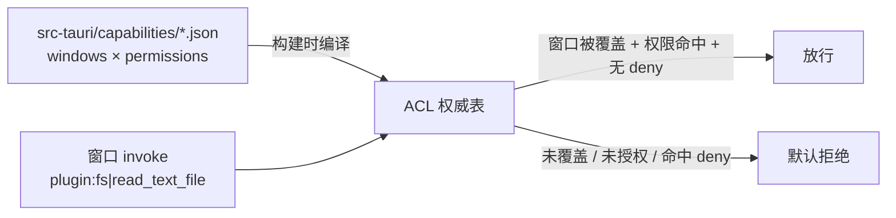

import { Canvas, Controls, Meta } from '@storybook/addon-docs/blocks';
import * as Capabilities from './capabilities.stories';

<Meta of={Capabilities} name="Docs" />

# 权限与能力

Tauri 2 把「前端能调什么」变成一份显式清单:任何插件命令与 core 命令**默认一律拒绝**,只有被 capability 明确授权的窗口才能调用——这套默认拒绝的授权体系就是 ACL(访问控制列表),声明写在 `src-tauri/capabilities/*.json`。3.1 课里 `tauri add dialog` 自动写入的 `dialog:default`,就是这个体系的一部分。本课讲清四件事:capability 文件怎么写、权限从哪里来、窗口如何被匹配、调用被拒时怎么排查。读完你能对任意「窗口 × 命令」组合预判放行与否,并说出拒绝发生在哪一层;下方的实例把这套判定做成可调的模拟——勾掉一个权限、换一个窗口,读数立刻给出允许/拒绝与命中依据。

本课只讲 ACL 模型本身,fs、dialog 等插件只作为权限声明的例子出现:插件的安装注册见[插件体系](?path=/docs/plugin-system--docs),自定义插件的权限定义归[自定义插件](?path=/docs/custom-plugin--docs)一课。

判定回路长这样——capability 文件在构建时编译成 ACL 权威表,窗口的每次 invoke 都过它:



capability 文件字段速查(排查与回查的入口):

| 字段 | 类型 | 默认 | 作用 |
| --- | --- | --- | --- |
| `identifier` | string(必填) | — | capability 的唯一标识 |
| `description` | string | `""` | 给人看的用途说明 |
| `windows` | `string[]`(glob) | `[]` | 覆盖的窗口标签:`["main"]`、`["admin-*"]`、`["*"]` |
| `webviews` | `string[]`(glob) | `[]` | 多 webview 窗口内按 webview 标签覆盖 |
| `permissions` | `string[]` 或对象数组 | `[]` | 权限引用(如 `fs:default`)或带 scope 的对象 |
| `local` | boolean | `true` | 是否对本地页面生效 |
| `remote` | `{ urls: string[] }` | 不启用 | 允许调用这些权限的远程 URL(URLPattern 语法) |
| `platforms` | `string[]` | 全部平台 | 限定 `macOS` / `windows` / `linux` / `iOS` / `android` |

文件头习惯带 `"$schema": "../gen/schemas/desktop-schema.json"`,IDE 据此对权限名自动补全——权限名拼错的排查成本,靠这一行省掉大半。

## 快速上手

前提:已有[第一个应用](?path=/docs/first-app--docs)生成的工程,按[多窗口](?path=/docs/multi-window--docs)一课建好 label 为 `settings` 的窗口,fs 插件已安装(`npm run tauri add fs`,四件套见[插件体系](?path=/docs/plugin-system--docs))。最小闭环:让 settings 窗口能读文件——授权、生效、再看一次拒绝。

1. settings 窗口的前端调用(fs 的用法细节归[文件与持久化](?path=/docs/persistence--docs)一课):

```tsx
import { BaseDirectory } from '@tauri-apps/api/path';
import { readTextFile } from '@tauri-apps/plugin-fs';

// 读取应用数据目录下的 config.json
const text = await readTextFile('config.json', {
  baseDir: BaseDirectory.AppData,
});
```

2. 编辑 `src-tauri/capabilities/default.json`:把 `settings` 加进 `windows`,`fs:default` 确认在 `permissions`(`tauri add fs` 已自动写入):

```json
{
  "$schema": "../gen/schemas/desktop-schema.json",
  "identifier": "default",
  "windows": ["main", "settings"],
  "permissions": ["core:default", "fs:default"]
}
```

3. 保存。capabilities 在构建时编译进应用,dev 下保存会自动触发重编译(终端看得到;没动静就重启 `npm run tauri dev`),调用返回文件内容。

4. 反向验证:把 `fs:default` 从 `permissions` 删掉,等重编译后再调,前端控制台收到拒绝——dev 构建下报错形如 `fs.read_text_file not allowed. Permissions associated with this command: …`,列出能放行这条命令的权限名;release 构建只有统一一句 `Command plugin:fs|read_text_file not allowed by ACL`。

这条闭环就是 ACL 的日常:授权 = 把权限写进覆盖该窗口的 capability;拒绝 = 默认态,排查就是找缺失的那一层。

## capability 文件

`src-tauri/capabilities/` 下的每个 `.json`(或 `.toml`)文件就是一个 capability,**全部自动启用**;文件名随意,`identifier` 必须唯一。`tauri.conf.json` 里的 `app.security.capabilities` 可以显式列出要启用的 capability(也可直接在这里内联定义,与文件混用)——一旦列了,只有列出的生效。

create-tauri-app 生成的默认文件:

```json
{
  "$schema": "../gen/schemas/desktop-schema.json",
  "identifier": "default",
  "description": "Capability for the main window",
  "windows": ["main"],
  "permissions": ["core:default"]
}
```

窗口和能力多了以后按职责拆文件,同一窗口被多个 capability 覆盖时权限**取并集**:

```json
// src-tauri/capabilities/settings.json —— settings 窗口专属
{
  "$schema": "../gen/schemas/desktop-schema.json",
  "identifier": "settings",
  "windows": ["settings"],
  "permissions": ["core:default", "fs:default"]
}
```

两条规则决定了大多数排查结论:

- **并集:** 命中同一窗口的所有 capability 一起生效,`platforms` 不匹配当前平台的文件不参与。
- **零覆盖 = 零授权:** 窗口(按标签)没被任何 capability 覆盖时,它没有任何 IPC 授权——不止插件命令,连 `listen`、窗口操作这类 core 命令也会被拒。新建窗口后所有调用失败,第一嫌疑就是这里。

## 权限来源

`permissions` 数组里的每一项引用一个**权限**(permission)或**权限集**(set),名字有统一规律:

| 形态 | 例子 | 含义 |
| --- | --- | --- |
| `core:<命名空间>:<权限>` | `core:window:allow-set-title` | core 内置插件(window、event、path…)的命令权限 |
| `<插件短名>:<权限>` | `fs:allow-read-text-file` | 插件命令权限,前缀是插件短名 |
| `<前缀>:default` | `core:default`、`dialog:default` | 官方维护的**权限集**,安全基线 |
| 对象形式 | `{"identifier": "fs:allow-read-text-file", "allow": […]}` | 权限引用 + 自定义 scope |

### default 权限集

default 集是官方划定的「默认安全基线」,`tauri add` 会自动写入。两个最常用的:

- **`core:default`** = 九个 core 命名空间 default 集的聚合:core:app、core:event、core:image、core:menu、core:path、core:resources、core:tray、core:webview、core:window。模板窗口里 `listen` / `emit` 这些 core 调用能工作,靠的就是它(core:event:default 含 allow-listen、allow-emit 等)。
- **`dialog:default`** 含 allow-open / allow-save / allow-message(3.1 课见过)。

每条命令都有成对的 `allow-<命令>` 与 `deny-<命令>` 权限:`fs:allow-read-text-file` 放行单条命令,`fs:deny-read-text-file` 显式拒绝它。**deny 优先于 allow**——同一命令同时被两者覆盖时,结果一定是拒绝,所以 deny 只当「例外收口」用,不当常规写法。

### scope:给权限再收一层范围

权限放行的是**命令**,不自动等于**可及的资源范围**。以 fs 为例,官方明确:启用 `fs:allow-exists` 这类权限本身不开放任何路径——路径要靠对象形式里的 `allow` / `deny` 字段(scope)声明:

```json
{
  "identifier": "fs:allow-read-text-file",
  "allow": [{ "path": "$APPDATA/**" }]
}
```

`$APPDATA`、`$DOCUMENT`、`$DOWNLOAD` 等是 Tauri 预置的路径变量。`fs:default` 内置了应用专属目录($APPDATA、$APPCONFIG 等)的读权限,所以快速上手里只写 `fs:default` 就能读 `config.json`。scope 变量清单与写法见 fs 插件文档;自定义插件如何定义自己的权限与 scope,归[自定义插件](?path=/docs/custom-plugin--docs)一课。

## 窗口与来源匹配

capability 用两个维度圈定授权对象:**哪个前端页面**(windows / webviews / local / remote)和**哪个平台**(platforms)。

- **windows 按标签 glob 匹配。** 标签是创建窗口时给的稳定标识(`tauri.conf.json` 的 `app.windows[].label`、`WebviewWindow::new` 的第一个参数),不是窗口标题;模板应用的首个窗口默认标签 `main`,多窗口的创建与标签见[多窗口](?path=/docs/multi-window--docs)一课。`"settings-*"`、`"*"` 都是合法 glob。
- **webviews 细分到窗口内。** 桌面端一个窗口可以挂多个 webview,`webviews` 按 webview 标签匹配;窗口命中时其所有 webview 跟随生效。单 webview 窗口写 `windows` 就够。
- **local / remote 切分页面来源。** capability 默认只对本地页面生效(`local: true`)。要让远程页面调用,显式给 `remote.urls`:

```json
{
  "identifier": "remote-api",
  "windows": ["*"],
  "remote": { "urls": ["https://*.tauri.app"] },
  "permissions": ["core:default"]
}
```

远程授权是高危动作:URL 收到具体子域或路径,权限只给必需命令;另外 Linux 与 Android 上 Tauri 无法区分 iframe 与页面本身的请求,嵌入第三方内容前先想清楚。

- **platforms 限定平台。** `global-shortcut` 只在桌面、`nfc` 只在移动端这类差异,用 `"platforms": ["macOS", "windows", "linux"]` 圈住,不适用的平台构建自动忽略。

## 授权判定与排查

一次 invoke 是否放行,按固定顺序判四层:

1. **应用命令先行:** 应用自己注册的命令(`generate_handler!` 里的 `greet` 等)默认不经 ACL,所有本地窗口都能调;要纳入管控,在 `src-tauri/build.rs` 用 `tauri_build::AppManifest::new().commands(&["greet"])` 显式声明。
2. **找覆盖窗口的 capability:** 按 `windows` / `webviews` 的 glob 匹配,再按 `platforms`、`local` / `remote` 核对来源。没有命中的 capability → 拒绝。
3. **汇总权限:** 命中的所有 capability 取并集;命令命中任何 `deny-` 条目 → 拒绝(deny 优先)。
4. **allow 判定:** 命令被某条权限覆盖(default 集展开后含对应 `allow-<命令>`)→ 放行;否则默认拒绝。

下面的实例把这套判定做成可调的模拟:左半是 `capabilities/default.json` 的当前内容,右半模拟某窗口 invoke 一条命令。调整 `windows`、勾选 `permissions`、切换调用方与命令,读数给出允许/拒绝与命中依据:

<Canvas of={Capabilities.Interactive} />
<Controls of={Capabilities.Interactive} />

| 读者操作 | 可观察证据 |
| --- | --- |
| 勾掉 `fs:default` 再调 `plugin:fs\|read_text_file` | 判定变「默认拒绝」,依据指出缺的是权限层 |
| 把 `windows` 换成 `["main"]` 后让 `settings` 发起调用 | 判定变「窗口未覆盖」,JSON 里 windows 一行标红 |
| 勾上 `fs:deny-read-text-file` | 即使 `fs:default` 已授权也判定拒绝(显式拒绝) |
| 选 `greet` | 恒为允许——应用命令在 ACL 之外 |
| 打开 Show code | 看到该 Canvas 实际执行的 `example.ts` |

被拒时,dev 构建的报错能直接指向原因(三类文案,来自 ACL 判定器):

| 拒绝层 | dev 下报错形如 |
| --- | --- |
| 窗口未覆盖 | `fs.read_text_file not allowed on window "settings", webview "settings", …`(后跟该命令已授权的窗口列表) |
| 无授权 | `fs.read_text_file not allowed. Permissions associated with this command: …`(列出可放行的权限名) |
| 显式 deny | `fs.read_text_file explicitly denied on origin …` |

release 构建只回统一一句 `Command plugin:fs|read_text_file not allowed by ACL`,不暴露细节——**排查一律在 dev 做**。动作三步:复制报错对号入座 → 核对 `windows` 与窗口标签(glob 拼写、标签不等于标题)→ 核对权限名(插件短名要拼全,`clipboard-manager:` 不是 `clipboard:`;拿不准靠 schema 自动补全)。改完等重编译再验证。真实运行时的逐步核对见本目录 `runtime-verification.md`。

## 最佳实践

- **从 default 集起步,按需换成单项。** default 集是官方安全基线,内容随插件版本演进;对外发布的应用把关键插件收紧为显式 `allow-<命令>` + scope,行为更可预测,升级插件时不被动。
- **按职责拆 capability 文件。** main 的基础授权留在 `default.json`,新窗口、新能力开新文件(如 `settings.json`);并集规则下互不干扰,回滚删文件即可。
- **remote 授权逐条最小化。** URL 精确到子域或路径,权限只给必需命令,默认 `local: true` 不动。
- **把应用命令当授权面的一部分。** 默认不经 ACL 的 `greet` 们,是收紧时最容易漏的暴露面;对外发布前用 `AppManifest` 把敏感命令纳入管控(整体收紧原则见[安全加固](?path=/docs/security--docs)一课)。

## 常见问题

- 调用被拒,报错含 not allowed / not allowed by ACL
  按三步排查:dev 下读完整报错对号入座(窗口未覆盖 / 无授权 / 显式 deny)→ 核对 capability 的 `windows` 是否覆盖该窗口的标签 → 核对 `permissions` 是否有覆盖该命令的权限。改完等重编译再调;三类报错与判定层的对应见「授权判定与排查」一节。
- 新建了一个窗口,所有命令(连 `listen`)都被拒
  新窗口的标签没进任何 capability——零覆盖等于零授权。把标签加进现有 capability 的 `windows`,或为它新建一个 capability 文件,等重编译。
- `fs:allow-read-text-file` 写了,调用还是报 path not allowed
  命令权限不等于路径授权:fs 的 allow-权限默认不带路径范围,要用对象形式配 scope(`"allow": [{ "path": "$APPDATA/**" }]`),或直接用内置了应用目录读权限的 `fs:default`。
- 改了 capabilities 文件,行为没变
  capabilities 是构建时编译进二进制的授权表,不是运行时读的配置。dev 下保存应自动触发重编译(终端看得到),没触发就重启 `tauri dev`;生产行为以重新构建的产物为准。

## 总结回顾

摘要:Tauri 2 用 ACL 体系替代 1.x 的 allowlist:插件与 core 命令默认拒绝,授权写在 `src-tauri/capabilities/*.json`——每个文件用 `windows`(标签 glob)+ `permissions`(权限引用或带 scope 的对象)声明「哪些窗口能用哪些能力」,全部文件自动启用、命中同一窗口时取并集,零覆盖的窗口没有任何 IPC 授权。权限名有统一命名空间(core 与插件各一套),default 集是官方安全基线,`allow-` / `deny-` 成对出现且 deny 优先,scope 把「命令放行」再收窄到具体资源范围。判定顺序:应用命令不经 ACL → 找覆盖窗口的 capability → 汇总并集、deny 优先 → allow 命中放行,否则拒绝。dev 构建的三类报错(窗口未覆盖 / 无授权 / explicitly denied)直接对应排查动作,release 只有一句统一的 not allowed by ACL。

一句话:

> capability 是「哪些窗口能用哪些权限」的显式声明,没有声明就是拒绝;排查只看三层——窗口覆盖、权限命中、显式 deny。

知识要点:

- capability 文件放在哪、有哪些字段、默认值各是什么?怎么被加载与合并?
- 窗口怎样被 capability 覆盖?零覆盖的窗口是什么状态?
- 权限名的命名空间规律是什么?`core:default` 聚合了哪些内容?
- default 集、单项 `allow-` / `deny-` 权限、scope 对象各管什么?deny 与 allow 冲突时谁赢?
- 应用自建命令受 ACL 管控吗?怎么把它纳入?
- dev 构建下三类拒绝报错分别指向哪个原因?
- fs 的命令权限与路径 scope 是什么关系?

## 参考资料

- [Capabilities - Tauri 官方文档](https://tauri.app/security/capabilities/)
  capability 文件位置与自动启用、字段定义、windows glob 与 remote 匹配、多 capability 合并、应用命令默认放行与 build.rs 纳入、安全边界说明的来源。
- [Core Permissions Reference - Tauri 官方文档](https://tauri.app/reference/acl/core-permissions/)
  `core:default` 的九个组成部分、`core:<命名空间>:<权限>` 命名与 allow-/deny- 配对说明的来源。
- [File System 插件 - Tauri 官方文档](https://tauri.app/plugin/file-system/)
  `fs:default` 内容、scope 对象形式与 `$` 路径变量、「allow 权限本身不开放路径」「deny 优先于 allow」的来源。
- [Dialog 插件 - Tauri 官方文档](https://tauri.app/plugin/dialog/)
  `dialog:default` 含 allow-open / allow-save / allow-message 的来源。
- [tauri 源码:webview/mod.rs](https://github.com/tauri-apps/tauri/blob/dev/crates/tauri/src/webview/mod.rs)
  拒绝错误的产生点:release 的 `Command … not allowed by ACL` 与 dev 详细报错的调用位置。
- [tauri 源码:ipc/authority.rs](https://github.com/tauri-apps/tauri/blob/dev/crates/tauri/src/ipc/authority.rs)
  dev 构建下三类拒绝文案(窗口未覆盖 / 无授权 / explicitly denied)的模板来源。
