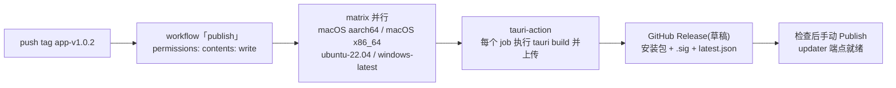

import { Canvas, Controls, Meta } from '@storybook/addon-docs/blocks';
import * as CiCd from './ci-cd.stories';

<Meta of={CiCd} name="Docs" />

# CI/CD

前三课的发布动作——打包三平台安装包、准备签名凭据、给更新工件签名——本课把它们串成一条自动化流水线:仓库里放一个 workflow,推送一个 `app-v*` 格式的 tag,GitHub 的 macOS / Windows / Ubuntu runner 就会**并行构建**各平台产物,官方的 `tauri-apps/tauri-action` 收尾把安装包、`.sig` 签名和 `latest.json` 汇总到一个 GitHub Release。CI 发布没有引入新命令:它让矩阵替你执行 5.2 节的同一套命令,变的是凭据从终端环境变量换成 GitHub secrets,产出从本机目录变成 Release 资产。

边界:本课只讲「怎么串」。安装包与产物配置见[打包](?path=/docs/bundling--docs),Apple 公证与 Windows 证书本身的准备见[代码签名](?path=/docs/code-signing--docs),更新密钥生成与清单格式见[自动更新](?path=/docs/updater--docs);本课负责把这些接进流水线。



本课最常回查的一张表——workflow 的组成与关键取值:

| 组成 | 关键项 | 值与要求 |
| --- | --- | --- |
| 触发 | `on.push.tags` | 如 `'app-v*'`;workflow 文件必须存在于 tag 指向的 commit |
| 权限 | `permissions.contents` | `write`,缺失时报 Resource not accessible by integration |
| 矩阵 | `strategy.matrix` | `fail-fast: false`;macOS 双 target + `ubuntu-22.04` + `windows-latest` |
| 收尾 | `tauri-apps/tauri-action@v1` | `env.GITHUB_TOKEN` 必挂;`tagName` 支持 `__VERSION__` 占位符 |
| secrets | `TAURI_SIGNING_PRIVATE_KEY` | 配了 updater 就必须注入,缺失时构建失败 |
| 缓存 | `swatinem/rust-cache@v2` | `workspaces: './src-tauri -> target'` 匹配 Tauri 布局 |
| 产物 | Release 资产 | 各平台安装包 + `.sig` + 自动生成的 `latest.json` |

## 快速上手

前提:沿用[第一个应用](?path=/docs/first-app--docs)生成的 React 工程,仓库已推送到 GitHub;工程配置过 updater 的,确认[自动更新](?path=/docs/updater--docs)的密钥对仍然可用。最小闭环:放 workflow → 配 secrets → 推 tag → 检查草稿 Release。

1. 新建 `.github/workflows/publish.yml`(骨架来自官方发布指南,触发换成 tag):

```yaml
name: 'publish'

on:
  push:
    tags:
      - 'app-v*'
  workflow_dispatch:

jobs:
  publish-tauri:
    permissions:
      contents: write # 创建 Release 并上传资产
    strategy:
      fail-fast: false # 一个平台失败不取消其他平台
      matrix:
        include:
          - platform: 'macos-latest'
            args: '--target aarch64-apple-darwin' # Apple Silicon
          - platform: 'macos-latest'
            args: '--target x86_64-apple-darwin' # Intel
          - platform: 'ubuntu-22.04'
            args: ''
          # 公共仓库可免费加 ARM runner:ubuntu-22.04-arm / ubuntu-24.04-arm
          - platform: 'windows-latest'
            args: ''

    runs-on: ${{ matrix.platform }}
    steps:
      - uses: actions/checkout@v7

      - name: install dependencies (ubuntu only)
        if: matrix.platform == 'ubuntu-22.04'
        run: |
          sudo apt-get update
          sudo apt-get install -y libwebkit2gtk-4.1-dev libappindicator3-dev librsvg2-dev patchelf xdg-utils

      - name: setup node
        uses: actions/setup-node@v6
        with:
          node-version: 'lts/*'
          cache: 'npm'

      - name: install Rust stable
        uses: dtolnay/rust-toolchain@stable
        with:
          targets: ${{ matrix.platform == 'macos-latest' && 'aarch64-apple-darwin,x86_64-apple-darwin' || '' }}

      - name: Rust cache
        uses: swatinem/rust-cache@v2
        with:
          workspaces: './src-tauri -> target'

      - name: install frontend dependencies
        run: npm install

      - uses: tauri-apps/tauri-action@v1
        env:
          GITHUB_TOKEN: ${{ secrets.GITHUB_TOKEN }}
          # 配置过 updater 就必须注入,否则构建在签名更新工件一步失败:
          # TAURI_SIGNING_PRIVATE_KEY: ${{ secrets.TAURI_SIGNING_PRIVATE_KEY }}
          # TAURI_SIGNING_PRIVATE_KEY_PASSWORD: ${{ secrets.TAURI_SIGNING_PRIVATE_KEY_PASSWORD }}
        with:
          tagName: app-v__VERSION__ # __VERSION__ 替换为应用版本
          releaseName: 'App v__VERSION__'
          releaseBody: 'See the assets to download this version and install.'
          releaseDraft: true # 先出草稿,检查后再 Publish
          prerelease: false
          args: ${{ matrix.args }}
```

2. 配置仓库 secrets(Settings → Secrets and variables → Actions)。最小集只有一项:启用过 updater 的工程加 `TAURI_SIGNING_PRIVATE_KEY`(值为密钥文件内容);需要签名与公证的,按「secrets:把凭据接进流水线」一节补 Apple / Windows 凭据。

3. 提交 workflow,确认 `src-tauri/tauri.conf.json` 的 `version` 已递增,然后在**包含 workflow 的 commit** 上打 tag 并推送:

```bash
git add .github/workflows/publish.yml
git commit -m "ci: add publish workflow"
git push origin main
git tag app-v1.0.2
git push origin app-v1.0.2
```

4. 观察:Actions 页出现 4 个并行 job;全部变绿后,Releases 页出现草稿 `App v1.0.2`,资产里是各平台安装包、`.sig` 签名与 `latest.json`;检查无误后手动 Publish,updater 客户端即可从该 Release 拉取更新。

## 流水线全貌:从 tag 到 Release

一个 publish workflow 只有三个部件:**触发器**决定什么时候跑,**矩阵**决定在哪些 runner 上跑,**步骤**里真正干活的是 `tauri-action`。读懂别人的 Tauri workflow、排查自己的 CI,都是在回答这三个问题。下面的实例把一次 tag 推送做成可拨动的模拟:顶部是触发与 workflow 元信息,中部四个 job 并行推进各自的步骤条,底部面板展示 Release 与资产;左下读数给出矩阵、产物、Release 与更新清单四个结论:

<Canvas of={CiCd.Flow} />
<Controls of={CiCd.Flow} />

| 读者操作 | 可观察证据 |
| --- | --- |
| 保持默认输入(私钥已注入、contents: write、草稿) | 四个 job 并行走完 checkout → 系统依赖(Ubuntu 专属)→ 工具链 → rust-cache → 前端依赖 → tauri build → 上传;Release 面板出现草稿徽标与全部资产,latest.json 读数为「Publish 后 updater 可拉取」 |
| 「更新签名私钥」切到「缺失(演示)」 | 四个 job 各自标红止于 tauri build——`fail-fast: false` 下互不连坐;Release 与 latest.json 读数为「—」 |
| 「GITHUB_TOKEN 权限」切到「只读(演示)」 | 构建全部成功,Release 创建报 Resource not accessible by integration |
| 「releaseDraft」切到「直接正式发布」 | Release 徽标变绿「已发布」,latest.json 读数变为「updater 端点就绪」 |
| 「Rust 缓存」切到「冷缓存(首次)」 | rust-cache 与 tauri build 两段明显变长——缓存省的就是重复编译 |
| 打开 Show code | 看到该 Canvas 实际执行的 `publish-flow.ts` |

模拟的时序为示意,真实构建以分钟计;产物用扩展名示意,不代表默认命名模板。

### 触发:tag 推送与手动 dispatch

tag 触发是发布主路径:`on.push.tags: ['app-v*']`。tag 指向的 commit 固定了代码版本,Release 与之天然对应。两条规则:

- **workflow 文件必须在 tag 指向的 commit 里。** 刚写好 workflow 就去推一个旧 tag 不会触发——GitHub 按 tag 所指 commit 里的 workflow 定义执行。
- **tag 名要匹配 `on.push.tags` 的模式。** workflow 监听 `app-v*` 而推 `v1.0.2`,不会运行。

`workflow_dispatch` 是手动开关:补传产物、重试失败的矩阵时,在 Actions 页对任意分支手动触发。官方指南的示例还演示了 push 到 `release` 分支触发(合并即出构建),本课统一用 tag 触发。

`__VERSION__` 占位符:`tauri-action` 读取应用版本(`tauri.conf.json` 顶层的 `version`)替换 `tagName` 与 `releaseName` 里的 `__VERSION__`。决定版本的是配置文件而不是 tag 名——但两者保持一致(如 `app-v1.0.2` ↔ `1.0.2`)能省掉一切困惑。

### 权限:GITHUB_TOKEN 要能写 contents

`permissions: contents: write` 挂在 job 上。`GITHUB_TOKEN` 由 GitHub 为每次运行自动颁发,不用自建;但默认只读——不声明写权限,构建照常成功,`tauri-action` 在创建 Release 一步报 `Resource not accessible by integration`。两个修复入口:

- workflow 的 job 上加 `permissions: contents: write`(推荐,跟随仓库走);
- 仓库 Settings → Actions → General → Workflow permissions 勾选 Read and write permissions(全局放开,粒度更粗)。

跨仓库发布(`owner` / `repo` inputs 指向另一个仓库)时,`GITHUB_TOKEN` 不够用,需要 PAT 或 GitHub App token——低频场景,知道入口即可。

### runner 矩阵:平台与架构

矩阵把「每个平台一次构建」展开成并行 job。三条配置要点:

- **`fail-fast: false` 是发布场景的默认选择。** 单平台失败时不取消其他平台——你还需要其他平台的产物来区分「平台特定问题」还是「全局的签名/权限问题」。
- **macOS 双架构跑在同一 runner 上。** `macos-latest` 是 Apple Silicon 机器,Intel 包靠 `--target x86_64-apple-darwin` 交叉编译;所以 Rust 工具链步骤要给 macOS job 加 `targets`,矩阵 `args` 里带上对应 `--target`。
- **Ubuntu 要装系统依赖。** `libwebkit2gtk-4.1-dev` 等是 Linux WebView 的编译前提,`if: matrix.platform == 'ubuntu-22.04'` 让这一步只在 Linux job 执行——实例里非 Ubuntu 通道上那一段灰色跳过块就是它。

矩阵展开后每个 job 的产出:

| matrix 条目 | runner | 产物 |
| --- | --- | --- |
| `--target aarch64-apple-darwin` | `macos-latest` | `.app.tar.gz` + `.sig`、`.dmg` |
| `--target x86_64-apple-darwin` | `macos-latest` | 同上(Intel 架构) |
| 空 | `ubuntu-22.04` | `.AppImage` + `.sig`、`.deb`、`.rpm` |
| 空 | `windows-latest` | NSIS `.exe` + `.sig`、`.msi` + `.sig` |

ARM Linux:`ubuntu-22.04-arm` / `ubuntu-24.04-arm` runner 对公共仓库免费可用;私有仓库的替代方案是 ARM 模拟构建——官方提醒它非常慢(全新项目约 1 小时)且计费,谨慎使用。计费意识:私有仓库中 macOS runner 按 10 倍分钟计费、Windows 按 2 倍,公共仓库免费。

### tauri-action:矩阵里的收尾步骤

`tauri-apps/tauri-action@v1` 在每个 job 里执行 `tauri build`,再按 `tagName` 查找(不存在则创建)Release 并上传本平台的资产——并发 job 的创建冲突由 action 内部处理,失败可用 `retryAttempts` 重试。`env.GITHUB_TOKEN` 必挂。核心五个输入:

| input | 作用 | 官方示例取值 |
| --- | --- | --- |
| `tagName` | Release 标签;`__VERSION__` 替换为应用版本 | `app-v__VERSION__` |
| `releaseName` | Release 名称;创建新 Release 时必填 | `'App v__VERSION__'` |
| `releaseBody` | Release 正文 | 简短下载提示 |
| `releaseDraft` | 是否先出草稿(默认 `false`) | `true` |
| `prerelease` | 预发布标记(默认 `false`) | `false` |

其余输入按需查阅,多数保持默认:

| input | 默认 | 用途 |
| --- | --- | --- |
| `releaseId` | — | 上传到已有 Release;设置后忽略 `tagName` / `releaseName` |
| `projectPath` | `./` | Tauri 工程不在仓库根时指定相对路径 |
| `args` | `""` | 透传 `tauri build`;矩阵里接 `matrix.args` |
| `uploadUpdaterJson` | `true` | 生成并上传 updater 的 `latest.json`(需配置过 updater) |
| `updaterJsonPreferNsis` | `false` | 两种 Windows 安装包并存时,`latest.json` 优先用 NSIS |
| `uploadUpdaterSignatures` | `true` | 是否上传 `.sig` 文件(不影响 `latest.json` 生成) |
| `uploadWorkflowArtifacts` | `false` | 额外上传为 workflow artifacts(独立于 Release) |
| `releaseCommitish` | 当前 SHA | 指定 tag 建在哪个 commit 或分支 |
| `generateReleaseNotes` | `false` | 用 GitHub API 自动生成发布说明 |
| `retryAttempts` | `0` | 构建、获取/创建 Release 或上传失败的重试次数 |
| `tauriScript` | 自动探测 | 自定义 CLI 调用脚本(pnpm/yarn/bun 会自动识别) |
| `mobile` | — | 实验性;`android` / `ios` 构建,不覆盖商店上架 |

## secrets:把凭据接进流水线

入口在仓库 Settings → Secrets and variables → Actions → Repository secrets;workflow 里用 `secrets.XXX` 引用,以 `env` 挂到对应步骤。挂载原则一句话:**凭据挂在真正消费它的那个 step 上,名字拼错或挂错 job 等同于没配**——这类缺失多数只警告不报错,是 CI 里最容易悄悄漏掉的失败。

### 更新签名私钥

`tauri.conf.json` 配置了 updater(`createUpdaterArtifacts: true`)的工程,构建时要给更新工件签名,私钥必须进构建进程:

```yaml
      - uses: tauri-apps/tauri-action@v1
        env:
          GITHUB_TOKEN: ${{ secrets.GITHUB_TOKEN }}
          TAURI_SIGNING_PRIVATE_KEY: ${{ secrets.TAURI_SIGNING_PRIVATE_KEY }}
          TAURI_SIGNING_PRIVATE_KEY_PASSWORD: ${{ secrets.TAURI_SIGNING_PRIVATE_KEY_PASSWORD }} # 生成密钥时设过密码才需要
```

实例里「缺失(演示)」就是这条没接上的结果:矩阵所有 job 在 `tauri build` 一步失败。私钥值直接粘贴密钥文件内容即可(与本地构建一样,路径或内容均可);密钥对的生成与保管见[自动更新](?path=/docs/updater--docs)。

### macOS:证书与公证凭据

CI runner 没有你的本机钥匙串,证书与公证凭据全部走环境变量:

```yaml
        env:
          APPLE_CERTIFICATE: ${{ secrets.APPLE_CERTIFICATE }} # base64 编码的 .p12
          APPLE_CERTIFICATE_PASSWORD: ${{ secrets.APPLE_CERTIFICATE_PASSWORD }}
          APPLE_SIGNING_IDENTITY: ${{ secrets.APPLE_SIGNING_IDENTITY }}
          # 公证凭据二选一:API key 三件套
          APPLE_API_ISSUER: ${{ secrets.APPLE_API_ISSUER }}
          APPLE_API_KEY: ${{ secrets.APPLE_API_KEY }}
          APPLE_API_KEY_PATH: ${{ secrets.APPLE_API_KEY_PATH }}
          # 或 Apple ID 三件套:APPLE_ID / APPLE_PASSWORD / APPLE_TEAM_ID
```

CLI 会把 `APPLE_CERTIFICATE` 导入临时钥匙串再签名,与 `APPLE_SIGNING_IDENTITY` 必须指向同一张证书。两个 CI 特有的提醒:完全没有证书时显式配置 ad-hoc 身份(`APPLE_SIGNING_IDENTITY: '-'`),否则从 Release 下载的 Apple Silicon 构建可能被系统标记为「已损坏」;公证凭据缺失只警告跳过,产物悄悄少了公证。证书类型、免费账号边界等准备事项见[代码签名](?path=/docs/code-signing--docs)。

### Windows:证书进商店,或 signCommand

`certificateThumbprint` 路线的前提是证书已在 runner 的用户证书商店里——本机导入过一次就长期有效,CI 每次都是新机器。常见做法:secret 存 base64 的 `.pfx`,加一个 PowerShell 步骤解码导入,再跑构建:

```yaml
      - name: import Windows certificate
        run: |
          $pfx = [Convert]::FromBase64String("$env:WINDOWS_PFX_BASE64")
          $path = "$env:RUNNER_TEMP\cert.pfx"
          [IO.File]::WriteAllBytes($path, $pfx)
          Import-PfxCertificate -FilePath $path -CertStoreLocation Cert:\CurrentUser\My `
            -Password (ConvertTo-SecureString -String "$env:WINDOWS_PFX_PASSWORD" -Force -AsPlainText)
        env:
          WINDOWS_PFX_BASE64: ${{ secrets.WINDOWS_PFX_BASE64 }}
          WINDOWS_PFX_PASSWORD: ${{ secrets.WINDOWS_PFX_PASSWORD }}
```

不想维护导入步骤,或证书在 Azure 等托管服务里:改用 `signCommand` 路线,CLI 对每个待签文件调用你指定的命令。两条路线的取舍见[代码签名](?path=/docs/code-signing--docs)。

## 缓存:让矩阵快起来

慢的根源有两个:Rust 从零编译,以及矩阵把编译次数乘以平台数。缓存对应两层:

- **Node 依赖:** `actions/setup-node` 的 `cache: 'npm'`,缓存全局 npm 缓存目录(需仓库里有 lock 文件)。
- **Rust 产物:** `swatinem/rust-cache@v2`,缓存 Cargo 注册表、索引与 workspace 的 `target` 目录;`workspaces: './src-tauri -> target'` 就是告诉它 Tauri 的 workspace 在 `src-tauri`。实例里「冷缓存(首次)」与「命中」的差距示意了这个省法——真实差距更大。

两条边界:缓存的保存与恢复发生在**该 job 自己**的维度上,macOS / Linux / Windows 的编译产物互不通用,矩阵天然各自独立;首次构建(或依赖变更后)仍是冷缓存,缓存命中是第二次起才有的待遇。调试期可在 rust-cache 步骤加 `cache-on-failure: true`,失败也保存缓存——官方的 ARM 示例就是这么配的。

## 最佳实践

- **tag 即版本,配置才是真源。** `tagName` 里的 `__VERSION__` 取自 `tauri.conf.json`;打 tag 前确认版本已递增,tag 名与版本保持一致,Release、资产与 updater 清单才对得上。
- **草稿先行,检查后 Publish。** `releaseDraft: true` 让 Release 先以草稿存在:确认四个平台的安装包、`.sig`、`latest.json` 都齐了再手动 Publish。Publish 前资产不对外公开,正好挡住「发一半被 updater 下到」。
- **凭据最小化、只进 secrets。** updater 私钥、Apple 证书与公证、Windows `.pfx` 各自独立命名、不复用;泄露后立即轮换对应凭据。
- **矩阵保留 `fail-fast: false`。** 连坐取消只会让排查更盲——你需要其他平台的日志来区分平台特定问题与全局问题。
- **缓存必配,并对计费有数。** 矩阵把 Rust 编译乘以平台数,`rust-cache` 是最便宜的一档提速;私有仓库 macOS 按 10 倍分钟计费,公共仓库免费。
- **CI 失败先本地复现。** CI 只是把 5.2.1–5.2.3 的命令搬到干净机器上;本地用同参数(`--target`、同环境变量)跑一遍 `tauri build`,多数「CI 问题」会现出原形。

## 常见问题

- 推了 tag,Actions 里没有任何运行
  按两处核对:tag 名是否匹配 `on.push.tags` 的模式(监听 `app-v*` 而推 `v1.0.2` 不触发);tag 指向的 commit 里是否存在这个 workflow 文件(在含 workflow 的 commit 上重新打 tag)。
- 构建成功,Release 却报 `Resource not accessible by integration`
  `GITHUB_TOKEN` 默认只读,创建 Release 需要 `contents: write`。在 job 上加 `permissions: contents: write`;改不了 workflow 时,到仓库 Settings → Actions → General → Workflow permissions 勾选 Read and write permissions。
- 矩阵所有 job 在 `tauri build` 一步失败,日志提示缺更新签名私钥
  配置启用了 updater 就必须注入 `TAURI_SIGNING_PRIVATE_KEY`。检查 secret 是否已创建、`env` 是否挂在 tauri-action 步骤上、名字是否拼对——挂错 job 或拼错名等同于缺失(实例「缺失(演示)」即此场景)。
- Release 已创建,updater 客户端却拉不到更新
  Release 还在草稿状态:草稿资产不对外公开,`latest.json` 里的下载地址会 404。检查产物后手动 Publish,客户端才能访问。
- Release 里只有部分平台的产物
  去 Actions 页看哪个 matrix job 失败了——`fail-fast: false` 下其他平台照常上传。修好失败平台后,删掉草稿 Release 与旧 tag,重推 tag 整体重跑;不要往半成品 Release 里手动补文件。
- macOS 产物没签名,或用户下载后报「已损坏」
  CI runner 没有本机钥匙串:需要 `APPLE_CERTIFICATE`(+密码)注入证书、`APPLE_SIGNING_IDENTITY` 指定身份;两者都不配时显式设 ad-hoc(`-`),否则 Apple Silicon 构建可能被 Gatekeeper 标记。公证另需 `APPLE_API_*` 或 `APPLE_ID*` 三件套(凭据准备见[代码签名](?path=/docs/code-signing--docs))。
- Windows 产物没有签名
  `certificateThumbprint` 路线要求证书已在 runner 的证书商店里——CI 上需要先解码 `.pfx` 再 `Import-PfxCertificate` 的步骤,或改用 `signCommand` 路线(见[代码签名](?path=/docs/code-signing--docs))。

## 总结回顾

摘要:

CI 发布把 5.2 节的手动流程搬进一条 GitHub Actions 流水线:workflow 由触发器(`on.push.tags` 加 `workflow_dispatch`)、权限(`contents: write`)、runner 矩阵(`fail-fast: false`,macOS 双 target + `ubuntu-22.04` + `windows-latest`,Ubuntu 多一步系统依赖)和 `tauri-apps/tauri-action` 收尾构成——action 在每个 job 里执行 `tauri build`,按 `tagName`(`__VERSION__` 替换为配置版本)汇总安装包、`.sig` 与自动生成的 `latest.json` 到一个 Release。凭据从终端环境变量换成 secrets:`TAURI_SIGNING_PRIVATE_KEY` 缺失会让矩阵全红,Apple 证书与公证走 `APPLE_CERTIFICATE` / `APPLE_API_*` 等环境变量,Windows 在「证书导入步骤」与 `signCommand` 之间二选一。缓存(`rust-cache` + `setup-node`)决定第二次构建要不要重复编译,草稿发布(`releaseDraft: true`)让发布动作停在「检查后手动 Publish」这一步。

一句话:

> CI 发布不是新命令,是让 runner 矩阵替你执行 5.2 节的同一套流程——流水线停在哪一步,取决于凭据与权限有没有接对。

知识要点:

- publish workflow 的三个部件是什么?tag 触发有哪两条规则?
- `contents: write` 为什么必需?两种修复入口在哪?
- 矩阵怎么展开三平台四目标?为什么 macOS job 要加 `targets` 与 `--target`?Ubuntu 多哪一步?
- `__VERSION__` 从哪取值?写在哪两个输入里?
- `releaseDraft` 的默认值与官方示例值分别是什么?草稿对 updater 意味着什么?
- 三组 secrets(更新私钥、Apple、Windows)分别怎么接?缺失时流水线各停在哪一步?
- `swatinem/rust-cache` 缓存什么?`workspaces` 为什么指向 `./src-tauri -> target`?
- `latest.json` 是谁生成的?为什么说草稿状态是发布顺序的一部分?

## 参考资料

- [Distribute → Pipelines → GitHub - Tauri 官方文档](https://tauri.app/distribute/pipelines/github/)
  官方 publish workflow 示例(触发、矩阵、runner、步骤与 tauri-action 输入)、Ubuntu 系统依赖、ARM runner 方案、ad-hoc 签名提醒与计费提醒的来源。
- [tauri-apps/tauri-action - GitHub](https://github.com/tauri-apps/tauri-action)
  全部 inputs 与默认值、`__VERSION__` 占位符、`latest.json` 生成与 `updaterJsonPreferNsis`、permissions 要求的来源。
- [macOS Code Signing - Tauri 官方文档](https://tauri.app/distribute/sign/macos/)
  `APPLE_CERTIFICATE` 等 CI 环境变量、临时钥匙串导入与 ad-hoc 身份的说明。
- [Windows Code Signing - Tauri 官方文档](https://tauri.app/distribute/sign/windows/)
  `certificateThumbprint` 与 `signCommand` 两条路线在 CI 上的取舍。
- [Updater 插件 - Tauri 官方文档](https://tauri.app/plugin/updater/)
  `latest.json` 清单格式、`TAURI_SIGNING_PRIVATE_KEY` 与 GitHub Releases 作为更新端点的衔接说明。
