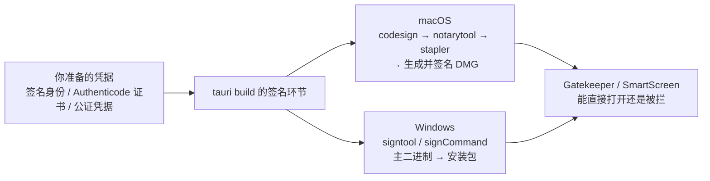

import { Canvas, Controls, Meta } from '@storybook/addon-docs/blocks';
import * as CodeSigning from './code-signing.stories';

<Meta of={CodeSigning} name="Docs" />

# 代码签名

安装包做得再漂亮,交给用户时都要先过操作系统这道门:macOS 对没有公证的应用,从浏览器下载后会直接提示「已损坏,无法打开」;Windows 对未签名的安装包会竖起 SmartScreen 拦一道。本课讲清这道门的通关配置——每个平台需要你准备什么凭据、`tauri build` 自动替你执行哪些签名环节、以及凭据缺失或错误时构建会发生什么。

Tauri 在签名里的角色一句话就能概括:**它不生产信任,只搬运凭据**。`codesign`、`notarytool`、`signtool` 这些平台官方工具由 CLI 在打包过程中自动调用,你只负责把签名身份、证书和公证凭据准备好——配什么签什么,缺什么跳过并警告,错什么当场中断。

边界提醒:本课的代码签名面向操作系统信任,与 updater 插件校验更新包所用的签名密钥是两回事(后者见[自动更新](?path=/docs/updater--docs));iOS/Android 的移动端签名另有一套体系,见[移动端发布](?path=/docs/mobile-release--docs);DMG/NSIS 等产物形态与 `targets` 配置见[打包](?path=/docs/bundling--docs)。



| 平台 | 配置入口 | 需要准备 | 什么都不配的后果 |
| --- | --- | --- | --- |
| macOS | `bundle.macOS.signingIdentity` 或环境变量 `APPLE_SIGNING_IDENTITY`;公证凭据走环境变量 | Developer ID Application 证书;公证还需付费开发者账号的凭据 | 构建成功、产物未签名:本机能跑,下载后「已损坏,无法打开」 |
| Windows | `bundle.windows.certificateThumbprint` 或 `bundle.windows.signCommand` | CA 颁发的 Authenticode 证书(.pfx 导入证书商店) | 构建成功、产物未签名:SmartScreen 拦截 |

## 快速上手

前提:macOS 本机钥匙串里已有可用的签名证书(还没有就到 developer.apple.com 创建 Developer ID Application 证书;只有免费账号时,先用下文 ad-hoc 伪身份走通流程)。

1. 找到本机的签名身份,输出里 `Developer ID Application:` 开头的那行就是身份名:

```bash
security find-identity -v -p codesigning
```

2. 把身份交给 Tauri,配置文件或环境变量二选一:

```json
"bundle": { "macOS": { "signingIdentity": "Developer ID Application: Example Ltd (ABCDE12345)" } }
```

```bash
export APPLE_SIGNING_IDENTITY="Developer ID Application: Example Ltd (ABCDE12345)"
```

3. 构建并检查签名:

```bash
npm run tauri build
codesign -dv src-tauri/target/release/bundle/macos/*.app
```

输出出现 `Authority=Developer ID Application: ...` 即签名生效。

4. 想顺带公证,再补一组公证凭据后重新 build(Apple ID 路线,三件套缺一不可):

```bash
export APPLE_ID="you@example.com"
export APPLE_PASSWORD="abcd-efgh-ijkl-mnop"  # App 专用密码
export APPLE_TEAM_ID="ABCDE12345"
npm run tauri build
```

构建日志会出现公证与钉票据环节,此后分发的应用不再触发 Gatekeeper 拦截。Windows 读者的最小闭环在「证书与 certificateThumbprint」一节。

## 签名流水线

`tauri build` 的签名环节是对平台官方工具的自动编排,先建立一个能预测结果的模型:

- **macOS:** 生成 .app → `codesign` 由内向外签名(先 frameworks、sidecar,后主 bundle)→ `notarytool` 公证 → `stapler` 钉票据 → 生成 DMG → 给 DMG 也签一次名。
- **Windows:** 先签主二进制(`signtool` 或你指定的命令)→ 打包 NSIS/MSI → 安装包连同包内 DLL、资源、卸载器逐个签名。

三条判断覆盖所有结果:

- **配什么签什么。** 凭据只来自配置字段与环境变量,CLI 不猜。
- **缺什么跳过并警告。** 签名身份缺失 → 整个签名环节跳过;公证凭据缺失 → 警告 `skipping app notarization` 后继续,构建不失败,但产物悄悄少了公证。
- **错什么当场中断。** 凭据组合自相矛盾(如 Apple ID 路线缺 `APPLE_TEAM_ID`)时构建直接失败。

交互实例把两个平台的流水线摆在一起:切换「凭据场景」,流水线显示每个环节执行、跳过还是中断,以及一行原因;读数同步给出产物信任状态与用户侧结果。

<Canvas of={CodeSigning.Interactive} />
<Controls of={CodeSigning.Interactive} />

| 读者操作 | 可观察证据 |
| --- | --- |
| 从「macOS · 仅签名身份」切到「macOS · 签名身份 + 公证凭据」 | 公证、钉票据环节由跳过变为执行,读数的用户侧结果从「无法验证开发者」变为「可直接打开」 |
| 切到「macOS · Apple ID 缺 APPLE_TEAM_ID」 | 公证环节标红中断,后续环节全部未执行 |
| 切到「Windows · 跨编译 + certificateThumbprint」 | 签名环节显示「仅支持 Windows 主机」的跳过警告 |
| 打开 Show code | 看到该 Canvas 实际执行的 `example.ts` |

## macOS:签名与公证

Gatekeeper 打开一个应用时问三个问题:签名身份(谁发布的)、是否公证(Apple 扫描过没有)、票据(结论有没有随包携带)。三步都由 CLI 在 build 里自动完成,你要准备的是身份与凭据。

### 签名身份

证书类型按分发渠道选:直接分发(官网、下载站)用 `Developer ID Application`;上架 Mac App Store 才用 `Apple Distribution`——Developer ID 渠道用错证书类型无法走公证。证书在 developer.apple.com 的 Certificates 页创建,下载后导入钥匙串;本机可用身份用 `security find-identity -v -p codesigning` 查看(见快速上手)。

身份名就是证书在钥匙串里的条目名,交给 Tauri 有两个入口:

```json
"bundle": { "macOS": { "signingIdentity": "Developer ID Application: Example Ltd (ABCDE12345)" } }
```

```bash
export APPLE_SIGNING_IDENTITY="Developer ID Application: Example Ltd (ABCDE12345)"
```

三个边界:

- **免费账号可签不可公证。** 免费计划的 Apple 开发者账号能签名,但只能用于本地测试,装到别人机器上仍显示未验证;公证需要付费会员(99 美元/年)。
- **ad-hoc 签名是显式选项。** 把身份设为伪身份 `"-"`,不携带发布者身份,但满足 Apple Silicon「可执行文件必须有签名」的硬性要求,适合本机调试或 CI 内部产物;分发后用户仍需在「隐私与安全性」里手动放行,且 DMG 会跳过 ad-hoc 自签。
- **CI 里没有钥匙串证书时,用环境变量导入。** `APPLE_CERTIFICATE` 放 base64 编码的 .p12,`APPLE_CERTIFICATE_PASSWORD` 是它的导出密码,CLI 会把证书装进临时钥匙串再签名;两者必须与 `APPLE_SIGNING_IDENTITY` 指向同一张证书。

### 公证与票据

公证 = 把产物提交 Apple 做恶意软件扫描,通常几分钟出结果;`stapler` 再把通过的凭证(票据)钉进 .app,离线也能验证。凭据两条路线任选其一:

| 路线 | 环境变量 | 说明 |
| --- | --- | --- |
| App Store Connect API key | `APPLE_API_ISSUER`、`APPLE_API_KEY`、`APPLE_API_KEY_PATH` | issuer ID、Key ID、下载的 .p8 私钥路径;.p8 只能下载一次;不设路径时 CLI 会在 `./private_keys`、`~/private_keys`、`~/.private_keys`、`~/.appstoreconnect/private_keys` 里找 `AuthKey_<KeyID>.p8` |
| Apple ID | `APPLE_ID`、`APPLE_PASSWORD`、`APPLE_TEAM_ID` | Apple ID、App 专用密码、Team ID,三者缺一不可;缺 `APPLE_TEAM_ID` 会在公证环节报 `MissingTeamId` 中断构建 |

失败行为不对称,直接决定排查方向:

- 凭据**缺失** → CLI 警告后跳过公证,构建照常出产物(没公证的那种)。
- 凭据**组合错误** → 构建在公证环节失败,修好重跑。

CI 里需要跳过钉票据时加 `--skip-stapling`(公证仍会提交,只是不把票据钉进包内):

```bash
npm run tauri build -- --skip-stapling
```

### 从 .app 到 DMG 的顺序

顺序本身是排查「改了产物为什么签名失效」的依据:

1. .app 生成后先清理扩展属性(`xattr -crs`),多余属性会让 codesign 失败;
2. **由内向外**签名:frameworks、sidecar 二进制在前,主 bundle 最后;
3. `notarytool` 公证 .app,`stapler` 钉票据;
4. **之后**才生成 DMG,DMG 再用真实身份签一次名(伪身份 `"-"` 跳过这一步);
5. DMG **不单独公证**——公证结论钉在 .app 上,随 DMG 一起分发。

推论:任何对 .app 内容的事后改动(换图标、改二进制)都会让签名与公证失效,只能重新 build,不存在「补一下」。

## Windows:Authenticode 签名

Windows 的信任体系叫 Authenticode:CA 颁发代码签名证书,签名后安装包带上发布者信息;SmartScreen 在签名之外还看文件信誉,所以新证书签名的应用仍可能提示一次,但不再是「未知发布者」。注意 2024 年起 EV 证书不再带来即时的 SmartScreen 信誉,不再值得为此专门升级 EV。

### 证书与 certificateThumbprint

证书放进当前用户证书商店,构建时 `signtool` 直接取用,不需要密码:

```powershell
# CA 签发的证书与私钥合成 .pfx(测试时可用 PowerShell 的 New-SelfSignedCertificate 自签)
openssl pkcs12 -export -in cert.cer -inkey private-key.key -out certificate.pfx

# 导入当前用户商店
Import-PfxCertificate -FilePath certificate.pfx -CertStoreLocation Cert:\CurrentUser\My `
  -Password (ConvertTo-SecureString -String $WINDOWS_PFX_PASSWORD -Force -AsPlainText)
```

指纹(Thumbprint)在 certmgr.msc →「个人 → 证书」→ 详细信息页查看,写进配置:

```json
"bundle": {
  "windows": {
    "certificateThumbprint": "<证书指纹>",
    "digestAlgorithm": "sha256",
    "timestampUrl": "http://timestamp.comodoca.com"
  }
}
```

| 字段 | 作用 |
| --- | --- |
| `certificateThumbprint` | 证书指纹,定位证书商店里的那张证书 |
| `digestAlgorithm` | 签名摘要算法,通常 `sha256` |
| `timestampUrl` | 时间戳服务器;没有时间戳,证书过期后签名即失效 |
| `tsp` | 时间戳服务器是否为 RFC 3161(TSP)协议,默认 `false` |

配置好后 `tauri build` 在 Windows 主机上自动完成签名。**默认实现只在 Windows 主机工作**——在 Linux/macOS 上跨编译只会得到一条警告,产物不签名;跨编译场景需要换 signCommand 路线(见下)。

### signCommand 自定义签名

配置里给出一条命令,CLI 对**每个待签文件**调用一次,`%1` 替换为文件路径——主二进制、安装包、包内 DLL、资源、卸载器都会经过它:

```json
"bundle": {
  "windows": {
    "signCommand": "relic sign --file %1 --key azure --config relic.conf"
  }
}
```

适用场景:

- **跨编译**:在 Linux/macOS 上产出 Windows 安装包时,必须用 signCommand。
- **证书进不了商店**:Azure Key Vault(配 relic)、Azure Artifact Signing(前称 Azure Trusted Signing,配 artifact-signing-cli)、私钥在硬件 token 里的 EV 证书。
- 命令可以是字符串,也可以写成 `{ "cmd": "...", "args": [...] }` 对象。

## 最佳实践

- **凭据只进环境变量与 CI secret。** 进版本库的只有非敏感配置(身份名、thumbprint、算法、时间戳 URL);.p8、.p12 一旦泄露要立刻吊销重建。
- **分发渠道决定证书类型。** 直接分发用 Developer ID Application;只有上架 App Store 才用 Apple Distribution。
- **本机调试用 ad-hoc。** 没有付费账号时 `signingIdentity: "-"` 保证 Apple Silicon 本机运行无碍,但别拿它当分发方案。
- **时间戳必须加。** `digestAlgorithm` 与 `timestampUrl` 成对配置,否则证书过期或吊销后,所有已分发安装包的签名一起失效。
- **Windows CI 直接上 signCommand。** thumbprint 路线绑定 Windows 主机与本地证书商店;跨平台 CI 一开始就用 signCommand,少走弯路。
- **分清两套签名。** 本课的代码签名换不来更新包的自动校验;updater 的签名密钥体系见[自动更新](?path=/docs/updater--docs)。

## 常见问题

- 用户下载后提示「已损坏,无法打开」,而不是「无法验证开发者」
  前者说明产物没有有效签名(或签名已失效),后者只是缺公证。先确认 `APPLE_SIGNING_IDENTITY` / `signingIdentity` 确实生效(`codesign -dv` 看 `Authority`),再补公证凭据重新构建。本机临时绕过可用 `xattr -cr /Applications/你的应用.app` 删掉 quarantine 属性,但只对自己机器有效。
- 构建在公证环节报 `MissingTeamId`
  Apple ID 公证路线要求 `APPLE_ID`、`APPLE_PASSWORD`、`APPLE_TEAM_ID` 同时存在;补上 Team ID(App Store Connect 账户信息页)或换 API key 三件套。
- 构建成功但没有公证,日志里只有 `skipping app notarization`
  公证凭据没进到构建进程的环境:本机检查变量是否在同一终端会话 export;CI 检查 secret 名与 `APPLE_API_*` / `APPLE_ID*` 一致、并挂到了构建步骤上。凭据缺失只警告不报错,是最容易悄悄漏掉的失败。
- CI 里导入了 `APPLE_CERTIFICATE`,却报证书与身份不匹配
  `APPLE_CERTIFICATE`(base64 的 .p12)导入的证书必须与 `APPLE_SIGNING_IDENTITY` 指向同一张证书,身份名要完整匹配钥匙串条目(含 `Developer ID Application: ` 前缀)。
- Linux/macOS 跨编译的 Windows 包没有签名,日志提示签名仅支持 Windows 主机
  默认 signtool 路线只认 Windows 主机;改用 `signCommand`(relic、artifact-signing-cli 或自选工具)。
- `signtool` 报找不到证书,或 thumbprint 对不上
  指纹从 certmgr.msc 的详细信息页复制——手工输入常混入空格与不可见字符;同时确认证书导入的是当前用户商店(`Cert:\CurrentUser\My`),而不是本机存储或别的账户。
- ad-hoc(`"-"`)签名的应用为什么还要用户手动放行
  ad-hoc 只满足 Apple Silicon「必须有签名」的硬性要求,不携带发布者身份,公证也无从谈起;分发给用户请老实用 Developer ID + 公证。

## 总结回顾

摘要:

代码签名解决的是操作系统对发布者的信任:macOS 没签名/没公证的应用下载后「已损坏」,Windows 没签名被 SmartScreen 拦截。Tauri 在 `tauri build` 里自动编排平台工具——macOS 侧由内向外 `codesign`、`notarytool` 公证、`stapler` 钉票据,之后才生成并签名 DMG(DMG 不单独公证);Windows 侧先签主二进制再打安装包,`certificateThumbprint` 路线绑定 Windows 主机,跨编译走 `signCommand`。凭据缺失是警告跳过,组合错误当场中断;免费账号可签不可公证;时间戳决定证书过期后签名是否还有效。

一句话:

> Tauri 不生产信任,只搬运凭据——配什么签什么,缺什么跳过并警告,错什么当场中断。

知识要点:

- 未签名、已签名未公证、已公证的 macOS 应用在用户侧分别是什么表现?
- 签名身份如何查看与配置?ad-hoc `-` 能用在哪一步、不能用在哪一步?
- 公证凭据两条路线各需要哪些环境变量?哪种缺失会中断构建,哪种只警告跳过?
- macOS 流水线中公证发生在 DMG 生成之前还是之后?DMG 是否单独公证?
- Windows 的 `certificateThumbprint` 与 `signCommand` 各适合什么场景?为什么跨编译必须用后者?
- `timestampUrl` 的作用是什么?不加时间戳的长期后果是什么?
- 更新签名密钥(如 `TAURI_SIGNING_PRIVATE_KEY`)与代码签名的区别是什么?

## 参考资料

- [macOS Code Signing - Tauri 官方文档](https://tauri.app/distribute/sign/macos/)
  签名身份、免费账号边界、ad-hoc、公证凭据环境变量、CI 示例与 `--skip-stapling`。
- [Windows Code Signing - Tauri 官方文档](https://tauri.app/distribute/sign/windows/)
  证书导入与指纹、`certificateThumbprint` / `digestAlgorithm` / `timestampUrl`、`signCommand` 与 Azure 路线。
- [配置参考 - Tauri 官方文档](https://tauri.app/reference/config/)
  `bundle.macOS.signingIdentity` 与 `bundle.windows.certificateThumbprint` 等字段的定义与默认值。
