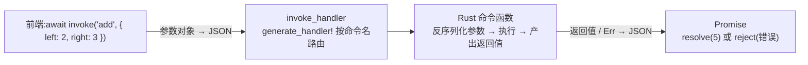

import { Canvas, Controls, Meta } from '@storybook/addon-docs/blocks';
import * as Commands from './commands.stories';

<Meta of={Commands} name="Docs" />

# 命令

命令(command)是前端主动调用 Rust 的官方通道:前端用 `invoke('命令名', 参数)` 发起调用,IPC 把参数序列化成 JSON 送到 Rust 侧,由 `#[tauri::command]` 标注的函数处理,返回值(或错误)再序列化回来——因此 `invoke` 在前端表现为一个 Promise。本课的核心直觉:**命令就是一次跨语言的函数调用**——Rust 侧写普通函数,前端拿到的是异步调用;两端靠「命令名 + 参数键名」对齐,靠 serde 序列化传值。建立这个直觉后,你应该能预测:改参数键名会发生什么、哪些活该放进 `async fn`、`Err` 到了前端长什么样。

下面的图就是这条调用链,也是本课各小节的共同骨架:



关键环节与默认行为:

| 环节 | 默认行为 | 回查要点 |
| --- | --- | --- |
| 参数命名 | 前端 camelCase ↔ Rust snake_case 自动转换 | `userName` 匹配 `user_name`;`rename_all = "snake_case"` 可改约定 |
| 参数类型 | 实现 `serde::Deserialize` 即可 | 命名转换只作用于最外层参数键 |
| 返回值 | 实现 `serde::Serialize`,经 JSON 回前端 | `invoke<T>` 泛型只标注 TS 类型 |
| 错误 | `Err` 序列化后作为 Promise reject 原因 | 错误类型同样必须 `Serialize` |
| 执行线程 | 无 async 的命令在主线程执行 | `async fn` 或 `#[tauri::command(async)]` 改为异步任务执行 |
| 注册 | `invoke_handler(generate_handler![...])` | 命令名全局唯一;未注册的调用直接 reject |

## 快速上手

前提:已有[第一个应用](?path=/docs/first-app--docs)生成的 react-ts 工程。模板自带一条 `greet` 命令(定义在 `src-tauri/src/lib.rs`),就是这条链路的现成示例。新增一条命令共三步,以 `add` 为例:

1. Rust 侧定义——命令就是被属性标注的普通函数:

```rust
#[tauri::command]
fn add(left: i32, right: i32) -> i32 {
    left + right
}
```

2. 注册到 Builder 的路由表(模板的 `greet` 也在这一处):

```rust
.invoke_handler(tauri::generate_handler![greet, add])
```

3. 前端调用:

```ts
import { invoke } from '@tauri-apps/api/core';

const sum = await invoke<number>('add', { left: 2, right: 3 }); // 5
```

验证:把模板 `App.tsx` 中 greet 处理函数里的 `invoke("greet", { name })` 换成第 3 步的调用,提交表单后界面显示 5;在模板自带的 greet 表单里输入名字,走的也是同一条链路。`tauri dev` 运行中保存 Rust 代码会自动重编译。三步缺一不可——漏掉第 2 步,`invoke('add')` 会以「命令未找到」之类的错误 reject。

## 命令链路

一条命令由三个部分组成,缺一不可:

1. **定义:** `#[tauri::command]` 把普通 Rust 函数变成命令,宏会生成参数反序列化、返回值序列化和路由所需的胶水代码。参数类型需实现 `serde::Deserialize`,返回类型需实现 `serde::Serialize`。
2. **注册:** `generate_handler![...]` 收集命令生成路由表,交给 Builder 的 `.invoke_handler(...)`。硬规则:
   - 命令名全局唯一,前端按这个名字调用。
   - `invoke_handler` 只能调用一次,所有命令列进同一个 `generate_handler![...]`——多次调用只有最后一次生效,之前的命令全部失效。
   - 命令写在 `lib.rs` 里不能加 `pub`(宏生成的包装函数会重名冲突);拆到独立模块时函数要 `pub`,`generate_handler!` 里写全路径如 `commands::add`,前端仍调用裸名 `invoke('add')`——调用名不含模块前缀。
   - 想改前端可见的命令名用 `#[tauri::command(rename = "greetUser")]`,Rust 函数名保持不变。
3. **调用:** 前端 `import { invoke } from '@tauri-apps/api/core'` 后调用 `invoke('命令名', 参数对象?)`,参数对象可省略;返回 Promise。`invoke<T>` 的泛型只标注 TypeScript 返回类型,真正传值的是 JSON 序列化。无构建步骤的页面可改用 `window.__TAURI__.core.invoke`(需开启 `withGlobalTauri`,见[配置](?path=/docs/configuration--docs)一课)。

下面的实例把一次 invoke 往返拆成五段:前端调用 → IPC 参数(JSON)→ Rust 命令 → IPC 响应(JSON)→ Promise。顶部是注册后的路由表,当前命令高亮;切换「演示命令」观察每段的形态:

<Canvas of={Commands.Interactive} />
<Controls of={Commands.Interactive} />

| 读者操作 | 可观察证据 |
| --- | --- |
| 切换「演示命令」 | 五段代码与四条读数同步变化;`fib` 先 pending 约 0.9 秒再兑现 |
| 打开 Show code | 看到该 Canvas 实际执行的 `example.ts` |

读数里「执行位置」直接回答「命令跑在哪个线程」——同步命令在主线程,`fib` 在 `async_runtime` 独立任务;「Promise 状态」与「结果 / 拒绝原因」展示 resolve 与 reject 两种归宿。后续小节都可回到这套实例核对:参数命名看 `greet` / `read_config`,异步看 `fib`,错误看 `divide` / `read_note`。

## 参数

参数是一个 JSON 对象,按「键名 → 形参名」匹配后反序列化;类型只要实现 `serde::Deserialize` 都能收,数组、对象会映射到 `Vec`、`struct`:

```ts
await invoke('create_task', { task: { title: '写周报', done: false } });
```

```rust
#[derive(Deserialize)]
struct Task {
    title: String,
    done: bool,
}

#[tauri::command]
fn create_task(task: Task) -> Task {
    // task 已由 JSON 反序列化得到,处理逻辑与普通 Rust 函数相同
}
```

### 参数命名:camelCase 与 snake_case

Tauri 默认在前端 camelCase 与 Rust snake_case 之间自动转换:Rust 形参 `user_name` 对应前端键 `userName`。命名风格没对上是「参数收不到」的头号原因;`#[tauri::command(rename_all = "snake_case")]` 可以把约定改成两端都写 snake_case:

| 写法 | 前端键 | Rust 形参 |
| --- | --- | --- |
| 默认(camelCase) | `userName` | `user_name` |
| `rename_all = "snake_case"` | `user_name` | `user_name` |

实例中把「演示命令」切到 `greet` 与 `read_config`,对比两种约定下键名与形参的对应关系。

边界:这套转换只作用于**最外层参数键**。嵌套结构体(如上面的 `Task`)的字段由 serde 直接反序列化,默认区分大小写——Rust 字段 `user_name` 要接前端的 `userName`,得在结构体上加 `#[serde(rename_all = "camelCase")]`,这与命令属性的 `rename_all` 是两套机制。

### 特殊参数:Tauri 注入,不从前端传

有些参数写在 Rust 签名里,但不出现在 invoke 参数对象中,由 Tauri 按类型注入:

| 形参类型 | 注入内容 | 典型用途 |
| --- | --- | --- |
| `tauri::State<'_, T>` | `.manage(T)` 注册的应用状态 | 命令间共享数据,深入见[状态](?path=/docs/state--docs)一课 |
| `tauri::AppHandle` | 应用句柄 | 路径解析、全局事件、退出等应用级操作 |
| `tauri::WebviewWindow` | 发起调用的窗口 | 在命令里操作当前窗口,见[窗口](?path=/docs/window--docs)一课 |
| `tauri::ipc::Request` | 原始请求体与 header | 读取前端直接发来的二进制或自定义 header |
| `tauri::ipc::Channel` | 回传通道 | 向前端流式推送进度、分块数据 |

## 返回值

返回类型实现 `serde::Serialize` 即可,结构体同样适用:

```rust
#[derive(Serialize)]
struct TaskStats {
    total: u32,
    done: u32,
}

#[tauri::command]
fn task_stats() -> TaskStats {
    TaskStats { total: 12, done: 5 }
}
```

```ts
const stats = await invoke<{ total: number; done: number }>('task_stats');
// { total: 12, done: 5 }
```

要点:

- 序列化就是 serde 的 JSON 输出:Rust 字段名默认**原样**出现在前端对象里。想要 camelCase 字段,在结构体上加 `#[serde(rename_all = "camelCase")]`——参数键的自动转换不适用于返回值。
- 返回 `()` 的命令 resolve 为 `null`;没有有意义的返回值时显式写返回类型,前端类型更好标。
- 大块二进制(读文件、下载)不要走 JSON 序列化:返回 `tauri::ipc::Response::new(bytes)` 走优化通道,前端拿到不经 JSON 打包的二进制数据。

## 异步命令

判断点:命令里的活会不会让 UI 卡住。官方规则:

| 命令形态 | 执行位置 |
| --- | --- |
| `fn`(无 async) | 主线程执行,重活会冻结界面 |
| `#[tauri::command(async)]` + `fn` | 同步函数也放到异步任务执行 |
| `async fn` | 经 `async_runtime::spawn` 在独立异步任务执行 |

文件 IO、网络、耗时计算这类重活一律写成 `async fn`;前端调用方式完全不变,仍然是一个 Promise。实例中切到 `fib`:Promise 先 pending 再兑现,读数「执行位置」显示 async_runtime 独立任务,其余同步命令都显示主线程。

```rust
#[tauri::command]
async fn count_lines(path: String) -> Result<u32, String> {
    // 文件读取是典型重活:写成 async 命令,由 async_runtime 调度,不占主线程
    let text = std::fs::read_to_string(path).map_err(|e| e.to_string())?;
    Ok(text.lines().count() as u32)
}
```

关键陷阱:借用类型(`&str`、`State<'_, T>`)不能直接出现在 `async fn` 命令的签名里。两种处理:改用 owned 类型(如 `String`),或把返回值包进 `Result`(对所有借用类型通用,返回时用 `Ok(...)` 包住):

```rust
// Counter 是托管的应用状态,定义与注册见状态一课
#[tauri::command]
async fn bump(state: tauri::State<'_, Counter>) -> Result<i32, ()> {
    let mut count = state.0.lock().unwrap();
    *count += 1;
    Ok(*count)
}
```

## 错误处理

命令失败的标准形态是返回 `Result<T, E>`:`Ok(v)` → Promise resolve `v`;`Err(e)` → Promise **reject**,拒绝原因是 `e` 序列化后的 JSON。因此错误类型也必须实现 `serde::Serialize`。

最省事的形态是 `String` 当错误,配合 `map_err` 转换(多数 std 错误类型没实现 `Serialize`):

```rust
#[tauri::command]
fn divide(dividend: f64, divisor: f64) -> Result<f64, String> {
    if divisor == 0.0 {
        return Err("除数不能为 0".into());
    }
    Ok(dividend / divisor)
}
```

```ts
try {
  const result = await invoke<number>('divide', { dividend: 10, divisor: 0 });
} catch (e) {
  console.error(e); // "除数不能为 0"
}
```

前端需要按错误类型分支处理时,升级为自定义错误枚举:thiserror 提供 `Display`,serde 决定序列化形态。`#[serde(tag = "kind", content = "message")]` 让前端收到 `{ kind, message }` 对象:

```rust
#[derive(Debug, thiserror::Error, serde::Serialize)]
#[serde(tag = "kind", content = "message")]
enum ReadNoteError {
    #[error("读取文件失败")]
    Io(String),
    #[error("内容不是有效的 UTF-8")]
    Utf8(String),
}

#[tauri::command]
fn read_note(path: String) -> Result<String, ReadNoteError> {
    // 变体携带的字符串(通常是 e.to_string())序列化进 message 字段
    let bytes = std::fs::read(path).map_err(|e| ReadNoteError::Io(e.to_string()))?;
    String::from_utf8(bytes).map_err(|e| ReadNoteError::Utf8(e.to_string()))
}
```

```ts
try {
  const content = await invoke<string>('read_note', { path: 'notes/todo.txt' });
} catch (e) {
  const err = e as { kind: 'io' | 'utf8'; message: string };
  if (err.kind === 'io') {
    // 文件类失败:提示换路径或重试
  }
}
```

实例核对:切到 `divide`,IPC 响应一行就是被序列化的 `Err`,Promise 行变为 rejected;切到 `read_note`,看到结构化错误的 `{ kind, message }` 形态。

## 最佳实践

- **按「活多重」选命令形态。** 会阻塞主线程的重活(文件、网络、压缩、大量计算)一律 `async fn`;`#[tauri::command(async)]` 用于签名是同步、但不想占主线程的函数。轻量操作保持同步命令,不为小事引入异步。
- **错误先 String 后结构化。** 错误只需展示给用户时,`Result<T, String>` + `map_err(|e| e.to_string())` 最短;前端要按类型分支(区分「文件不存在」和「解析失败」)时才升级为枚举——两端的分支逻辑要一起维护,成本更高。
- **两端命名纪律。** 参数沿用默认约定:前端 camelCase、Rust snake_case;返回结构体加 `#[serde(rename_all = "camelCase")]` 对齐前端风格。不要一端迁就另一端改 `rename_all`,约定分散后每个新参数都得查。
- **把 invoke 收进类型化封装层。** 命令名是运行时字符串,拼错只能在运行时发现。集中到一个模块(或 React 自定义 hook)里封装调用,命令名与返回类型只标一次:

```ts
// src/lib/commands.ts
import { invoke } from '@tauri-apps/api/core';

export const add = (left: number, right: number) =>
  invoke<number>('add', { left, right });
```

- **命令是 IPC 边界,粒度对齐「前端动作」。** 一条命令对应前端的一个业务动作;把内部细粒度函数逐个暴露成命令,会让 IPC 面无谓膨胀。

## 常见问题

- 调用 reject,报错指向命令未找到/未注册
  检查 `generate_handler![...]` 是否漏了这条命令,前端命令名与函数名是否一致(含大小写)。另外 `invoke_handler` 只能调用一次,第二次调用会整体覆盖前一次,只有最后一次注册的命令可用。
- 前端传了参数,Promise 却 reject,报错带 missing field 字样
  参数键与形参名没对上。核对默认的 camelCase↔snake_case 转换(见参数命名小节),或统一加 `rename_all = "snake_case"`;嵌套结构体字段则要加 `#[serde(rename_all = "camelCase")]`。
- 返回的结构体字段到了前端是 snake_case
  serde 按原样输出 Rust 字段名,参数键的自动转换不适用于返回值。给结构体加 `#[serde(rename_all = "camelCase")]`。
- `async fn` 命令带 `&str` 或 `State` 编译不过
  借用类型不能直接放进 async 命令签名。改用 owned 类型(如 `String`),或把返回值包进 `Result`(返回时用 `Ok(...)` 包住)。
- 命令返回 `io::Error` 时编译报错,提示未实现 Serialize
  std 错误类型多数没实现 `serde::Serialize`。用 `map_err(|e| e.to_string())` 转成 `String`,或定义自己的错误枚举(见错误处理一节)。
- 界面卡死/拖不动,恰好发生在点了某个按钮之后
  该命令是无 async 的同步命令,正在主线程执行重活。改成 `async fn` 或加 `#[tauri::command(async)]`;用实例读数「执行位置」一栏即可判断命令当前跑在哪个线程。
- 自己定义的命令需要 capabilities 授权吗?
  不需要:应用注册的命令默认对全部窗口和 webview 可用。capabilities 管的是核心与插件命令(见[权限与能力](?path=/docs/capabilities--docs)一课);想把自定义命令纳入 ACL,需在 `build.rs` 用 `AppManifest::commands` 登记后再配置权限。

## 总结回顾

摘要:

一条命令由定义(`#[tauri::command]`)、注册(`invoke_handler(generate_handler![...])`)、调用(前端 `invoke`)三部分组成,命令名全局唯一、注册只此一处。参数按 JSON 对象传递,键名默认在前端 camelCase 与 Rust snake_case 之间自动转换,`rename_all` 可改约定,嵌套结构体字段由 serde 决定;`AppHandle`、`WebviewWindow`、`State` 等特殊参数由 Tauri 注入、不占 invoke 参数。返回值与错误都必须实现 `Serialize`:正常返回 resolve 成 Promise,`Err` 序列化后作为 reject 原因——`String` + `map_err` 是最小形态,`#[serde(tag = "kind", content = "message")]` 的枚举提供结构化错误。线程上,无 async 的命令在主线程执行,重活写成 `async fn` 由 `async_runtime` 调度;async 命令签名中的借用类型(`&str`、`State<'_, T>`)要改 owned 或把返回值包进 `Result`。

一句话:

> 命令是一次跨语言的函数调用:命令名与参数键把两端对齐,serde 负责 JSON 序列化,`Err` 序列化后就是 Promise 的 reject 原因。

知识要点:

- 一条命令由哪三部分组成?注册环节有哪些硬规则(唯一命令名、单次 invoke_handler、模块路径与 pub)?
- 参数键的默认命名约定是什么?`rename_all` 改的是什么、作用到哪一层?
- 哪些参数由 Tauri 注入、不出现在 invoke 参数对象里?
- 返回值与错误各要满足什么条件?`Err` 到前端是什么形态?
- 同步命令与 async 命令分别跑在哪个线程?async 命令签名里的借用类型怎么处理?
- `invoke<T>` 泛型与返回值序列化是什么关系?

## 参考资料

- [Calling Rust from the Frontend - Tauri 官方文档](https://tauri.app/develop/calling-rust/)
  命令定义与注册规则、参数命名与 `rename_all`、返回值与 `ipc::Response`、异步命令线程行为与借用类型限制、错误序列化、注入参数的权威来源。
- [`#[tauri::command]` - docs.rs](https://docs.rs/tauri/latest/tauri/attr.command.html)
  `rename_all`、`rename`、`async` 属性选项的准确定义。
- [Capabilities - Tauri 官方文档](https://tauri.app/security/capabilities/)
  应用命令默认对全部窗口可用、`AppManifest::commands` 纳入 ACL 的方式。
