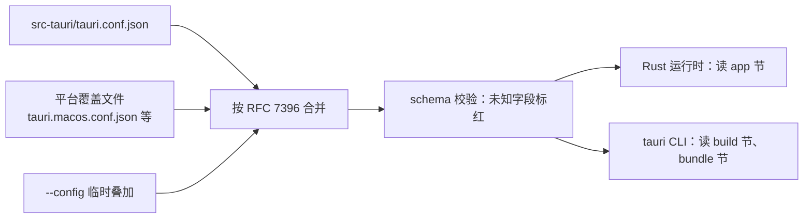

import { Canvas, Controls, Meta } from '@storybook/addon-docs/blocks';
import * as Configuration from './configuration.stories';

<Meta of={Configuration} name="Docs" />

# 配置

`src-tauri/tauri.conf.json` 是 Tauri 2 唯一的声明式配置文件：CLI 用它编排 dev / build，打包器用它产出安装包，Rust 运行时用它创建窗口、托盘并接入安全策略。本课建立的核心直觉：**每个字段各管一面**——改 `productName` 变的是菜单栏、Dock 和安装包文件名，改 `app.windows[].title` 变的只是窗口标题栏；写错字段名不会被静默忽略，`$schema` 接入的校验会当场标红。下面这张图回答「这份文件被谁、在什么时机读取」，这也是判断「改了为什么没生效」的依据。



顶层字段参考表：

| 字段 | 作用 | 默认值与要点 |
| --- | --- | --- |
| `$schema` | 指向配置 schema，编辑器据此补全、标错 | `https://schema.tauri.app/config/2` |
| `productName` | 用户看到的应用名：菜单栏、Dock、安装路径、产物文件名 | 模板取项目名；不能含 `/ \ : * ? " < > \|` |
| `version` | 应用版本，写入安装包元数据与产物文件名 | 模板为 `"0.1.0"`；未设置时读 `src-tauri/Cargo.toml` |
| `identifier` | 应用唯一 ID（反向域名），数据目录与打包元数据的键 | 必填；占位值 `com.tauri.dev` 会被 `tauri build` 拒绝 |
| `app` | 运行时行为：窗口、安全、托盘 | `windows: []`、`withGlobalTauri: false` |
| `build` | 与前端工程接线的字段 | 见下文 build 节 |
| `bundle` | 打包产物配置 | `active: false`、`targets: "all"`（脚手架模板改为 `true`） |
| `plugins` | 插件专属配置键 | `{}`；各插件的键见[插件体系](?path=/docs/plugin-system--docs)一课 |
| `mainBinaryName` | 覆盖主二进制文件名 | 少用 |

## 快速上手

前提：已有[第一个应用](?path=/docs/first-app--docs)生成的工程，配置文件在 `src-tauri/tauri.conf.json`。

1. 确认文件第一行有 `$schema`（模板自带，没有就补上）：

```json
"$schema": "https://schema.tauri.app/config/2"
```

2. 改两个字段——应用名和窗口标题是两处不同的配置（节选，其余字段保持模板值）：

```json
{
  "productName": "Notes",
  "app": {
    "windows": [{ "title": "我的便签", "width": 800, "height": 600 }]
  }
}
```

3. 运行 `npm run tauri dev`：菜单栏和 Dock 显示 **Notes**，窗口标题栏是 **我的便签**。

`tauri dev` 运行中保存配置文件会自动触发重编译并重启窗口；没在 dev 时改的配置，下次启动生效。

## 配置结构

2.x 的顶层就是开场表里的内容：三个元数据标量（`productName`、`version`、`identifier`）加三个大节（`build`、`app`、`bundle`），外加 `plugins`。react-ts 模板生成的配置原文（占位符已代入）：

```json
{
  "$schema": "https://schema.tauri.app/config/2",
  "productName": "tauri-app",
  "version": "0.1.0",
  "identifier": "com.tauri-app.app",
  "build": {
    "beforeDevCommand": "npm run dev",
    "devUrl": "http://localhost:1420",
    "beforeBuildCommand": "npm run build",
    "frontendDist": "../dist"
  },
  "app": {
    "windows": [{ "title": "tauri-app", "width": 800, "height": 600 }],
    "security": { "csp": null }
  },
  "bundle": {
    "active": true,
    "targets": "all",
    "icon": [
      "icons/32x32.png",
      "icons/128x128.png",
      "icons/128x128@2x.png",
      "icons/icon.icns",
      "icons/icon.ico"
    ]
  }
}
```

三个大节的分工：`build` 节给 CLI（编排 dev / build 流程），`app` 节给 Rust 运行时（决定应用行为），`bundle` 节给打包器（只在打包时读取）。交互实例演示这份分工——切换「本次修改的字段」，左侧配置对应行高亮，右侧被点亮的生效面就是该字段管辖的范围：

<Canvas of={Configuration.Interactive} />
<Controls of={Configuration.Interactive} />

| 读者操作 | 可观察证据 |
| --- | --- |
| 切换「本次修改的字段」 | 左侧配置改动行变化，右侧被点亮的生效面随之切换 |
| 打开 Show code | 看到该 Canvas 实际执行的 `example.ts` |

读数里「生效方式」一栏同时回答了一个常见疑问：配置改动不是热重载，`tauri dev` 检测到变更会重编译并重启窗口，而 `bundle` 节干脆只在 `tauri build` 时读取。

从 Tauri 1.x 迁移的读者注意：2.x 对配置做了重组，1.x 列摘自一份真实的 1.x 工程配置：

| Tauri 1.x | Tauri 2.x |
| --- | --- |
| `package.productName`、`package.version` | 顶层 `productName`、`version` |
| `tauri.bundle.identifier` | 顶层必填 `identifier` |
| `tauri.windows` | `app.windows` |
| `tauri.security` | `app.security` |
| `tauri.bundle` | `bundle` |
| `build.devPath`、`build.distDir` | `build.devUrl`、`build.frontendDist` |
| `tauri.allowlist` | 移除，改由 capabilities 权限体系接管（见[权限与能力](?path=/docs/capabilities--docs)） |

### identifier、productName 与 version

**identifier** 是应用在系统里的唯一身份：macOS 的应用数据目录 `~/Library/Application Support/<identifier>/`、各平台的打包元数据都以它为键。写法是反向域名（如 `com.example.notes`），只允许字母、数字、连字符和点，且必须全局唯一；模板占位值 `com.tauri.dev` 会被 `tauri build` 直接拒绝。它是三个字段里最不该拖到发布前才改的——上线后更换 identifier，等于让用户已有的本地数据目录作废。

**productName** 是用户看到的应用名：菜单栏、Dock、安装路径和安装包文件名都来自它。取值不能包含 `/ \ : * ? " < > |`。注意它不等于窗口标题——窗口标题是 `app.windows[].title`，两者互不影响（深入见[窗口](?path=/docs/window--docs)一课）。

**version** 接受 semver 字符串，或指向一个含 `version` 字段的 package.json 的路径（相对 `src-tauri/` 解析，如 `"../package.json"`）；都没有时回退读 `Cargo.toml` 的 `package.version`。官方建议直接在 Tauri 配置里管理版本——安装包文件名与更新元数据都取自这里。

### build 节：连接前端工程

build 节只被 `tauri dev` / `tauri build` 读取，运行时不看它：

| 字段 | 作用 | 模板值 |
| --- | --- | --- |
| `beforeDevCommand` | `tauri dev` 启动前执行，通常用来起前端 dev server | `npm run dev` |
| `devUrl` | 开发窗口加载的地址 | `http://localhost:1420` |
| `beforeBuildCommand` | `tauri build` 启动前执行，产出前端静态文件 | `npm run build` |
| `frontendDist` | 前端产物位置：目录、URL 或文件清单 | `../dist` |
| `runner` | 替代 cargo 的构建命令 | 少用 |

判断点：`devUrl` 的端口必须与 Vite 的 `server.port` 一致——模板的 Vite 配置开了 `strictPort`，两处只改一处就会白屏或启动失败（处理见[第一个应用](?path=/docs/first-app--docs)的常见问题）。`frontendDist` 相对 `src-tauri/` 解析。把已有前端工程接入的完整步骤见[集成已有前端](?path=/docs/integrate-frontend--docs)一课。

### app 节：运行时行为

app 节在编译时嵌入二进制，由 Rust 运行时读取：

- `app.windows`：启动时创建的窗口数组，每项一个窗口；不写 `label` 时默认叫 `main`。尺寸、装饰、居中等属性的深入配置见[窗口](?path=/docs/window--docs)一课，这里只需记住入口。
- `app.security`：`csp` 模板默认 `null`（不注入内容安全策略，发布前应收紧，见[安全加固](?path=/docs/security--docs)一课）；`capabilities` 不设置时默认读取 `src-tauri/capabilities/` 目录下的全部能力文件（见[权限与能力](?path=/docs/capabilities--docs)一课）。
- `app.withGlobalTauri`：默认 `false`。设为 `true` 后 Tauri API 注入到 `window.__TAURI__`，不装 `@tauri-apps/api` 也能调用，适合无构建步骤的页面或快速调试。
- `app.trayIcon`：声明初始托盘图标，深入见[系统托盘](?path=/docs/system-tray--docs)一课。
- `app.macOSPrivateApi`：默认 `false`，需要 macOS 私有 API（例如窗口透明）时才打开。

### bundle 节：打包入口

bundle 节只在 `tauri build` 打包时被读取：

- `bundle.active`：schema 默认值是 `false`——手写配置时漏掉它，`tauri build` 就只有裸二进制。脚手架模板已设为 `true`。
- `bundle.targets`：`"all"` 或指定格式列表；可选值 `app`、`dmg`（macOS）、`nsis`、`msi`（Windows）、`deb`、`rpm`、`appimage`（Linux）。
- `bundle.icon`：图标文件数组；打包需要各平台格式——macOS 用 `.icns`，Windows 用 `.ico`，Linux 用 `.png`，`tauri icon` 命令可一键生成全套。
- `bundle.resources`：随包分发的资源文件，支持 glob，路径相对 `tauri.conf.json` 解析。

bundler 的完整字段（签名、DMG / NSIS 细节、更新产物）见[打包](?path=/docs/bundling--docs)一课。

## schema 校验

`$schema` 字段指向官方 JSON Schema：

```json
"$schema": "https://schema.tauri.app/config/2"
```

URL 固定指向最新的 Tauri 2.x 版本，不需要跟随小版本更换。它带来两层校验：

- **编辑器内：** VSCode 等编辑器按 `$schema` 自动关联后，输入时给出字段补全、悬停显示字段说明；schema 禁止额外字段，拼错的字段名和用错的取值会即时标红。
- **CLI 内：** `tauri dev` / `tauri build` 解析配置同样严格，遇到不合法的值会直接报错退出，不会静默忽略。

结论：字段清单以补全列表和 schema 为准，不要手抄旧博客——尤其 2.x 与 1.x 字段名差异很大（见上文对照表）。

## 平台覆盖配置

同一份配置想按平台区分时，不用条件判断，直接在 `src-tauri/` 下放平台覆盖文件，tauri 命令按当前平台读取并叠加：

| 文件 | 生效平台 |
| --- | --- |
| `tauri.macos.conf.json` | macOS |
| `tauri.windows.conf.json` | Windows |
| `tauri.linux.conf.json` | Linux |
| `tauri.android.conf.json` | Android |
| `tauri.ios.conf.json` | iOS |

合并遵循 JSON Merge Patch（RFC 7396）：**对象逐键合并，数组整体替换**。对象合并意味着覆盖文件只需写差异键；数组替换意味着 `app.windows`、`bundle.icon` 这类数组会被整个换掉，不是按元素合并。

算例——只想让 macOS 的窗口标题不同，覆盖文件却不能只写标题：

```json
{
  "app": {
    "windows": [{ "title": "Notes（macOS）", "width": 800, "height": 600 }]
  }
}
```

macOS 上生效的是这个数组整体：基础配置的 `windows` 数组被整个替换，所以想保留的窗口属性必须写全——只写 `title` 的话，窗口尺寸会落回 schema 默认值，而不是基础配置里的 800×600。

需要构建变体（beta 版改个名字）或 CI 里临时试配置时，用 `--config` 再叠一层，参数可以是 JSON 字符串或文件路径，`dev` / `build` / `bundle` 等命令都支持：

```bash
npm run tauri build -- --config src-tauri/tauri.beta.conf.json
```

## 最佳实践

- **identifier 第一天就定稿。** 数据目录、打包元数据都绑定它；发布后更换等于丢弃用户本地数据，迁移成本极高。
- **版本以 tauri.conf.json 为准。** 官方建议在此管理版本；需要与前端共享时用 `"version": "../package.json"` 指回前端，避免两处数字漂移。
- **把配置当编译期输入，不当热重载。** `src-tauri/` 内任何变更（含配置文件）都会触发重编译重启，批量调配置时攒一批再保存；前端可变的参数不要塞进 Tauri 配置。
- **平台差异用覆盖文件，一次性变体用 --config。** 前者进版本库供团队长期共享；后者留在命令行或 CI 脚本里，只为单次构建服务。
- **默认值不等于模板值。** `bundle.active` 的 schema 默认是 `false`、模板是 `true`；判断「应该是什么」时查 schema，判断「现在是什么」时看自己的文件。

## 常见问题

- 改了 `productName`，Dock 名字变了但窗口标题没变（或反之）
  这是两个不同字段：应用名在顶层 `productName`，窗口标题在 `app.windows[].title`。两处都改才会一起变。
- `tauri build` 只产出裸二进制，没有安装包
  检查 `bundle.active`——schema 默认值是 `false`，脚手架模板帮你设成了 `true`，手写配置容易漏。设为 `true` 后重新构建，产物在 `src-tauri/target/release/bundle/`。
- `tauri build` 报错，提示 identifier 无效或被拒绝
  占位值 `com.tauri.dev` 被官方硬编码拒绝。换成自己的反向域名（如 `com.example.notes`），且只允许字母、数字、连字符和点。
- 平台覆盖文件里的窗口「丢了」尺寸等字段
  `app.windows` 是数组，按 RFC 7396 整体替换而不是逐字段合并；覆盖文件里要写全想保留的窗口属性，只写差异键的部分会落回 schema 默认值。
- 编辑器对 `tauri.conf.json` 没有补全也不报错
  文件缺 `$schema` 字段。补上 `"$schema": "https://schema.tauri.app/config/2"`，编辑器按 URL 关联 schema 后即可补全、悬停说明和错误提示。
- 想在配置里写注释
  默认 JSON 不支持。在 `src-tauri/Cargo.toml` 给 `tauri` 和 `tauri-build` 同时加 `config-json5` feature 换用 JSON5 格式，或加 `config-toml` 换用 `Tauri.toml`（TOML 还支持 `before-dev-command` 这类 kebab-case 键名）。

## 总结回顾

摘要：

`src-tauri/tauri.conf.json` 由三类消费者在三个时机读取：CLI 在 dev / build 时读 `build` 节编排前端命令，打包器在打包时读 `bundle` 节，Rust 运行时读 `app` 节决定窗口、安全与托盘。顶层另有三个元数据标量：`identifier`（系统级唯一身份，第一天就定稿）、`productName`（用户看到的应用名，不等于窗口标题）、`version`（安装包命名与元数据）。`$schema` 让编辑器补全并拦下写错的字段；平台差异通过 `tauri.macos.conf.json` 等覆盖文件按 RFC 7396 叠加——对象逐键合并、数组整体替换，一次性变体走 `--config`。从 1.x 迁移记住三件事：identifier 提升为顶层必填、`tauri.*` 节重组为 `app.*` 与 `bundle`、allowlist 被 capabilities 取代。

一句话：

> tauri.conf.json 的每个字段各管一面，改之前先问：它由谁读、在什么时机生效。

知识要点：

- 配置文件被哪三类消费者读取？分别读哪个节、在什么时机？
- `identifier`、`productName`、`version` 各自影响什么？`identifier` 有哪些硬性规则？
- build 节四个字段分别接前端的哪个环节？端口不一致时会发生什么？
- `app` 节里 `withGlobalTauri`、`capabilities` 默认行为是什么？
- 平台覆盖文件的合并规则是什么？为什么数组必须写全？
- `bundle.active` 的 schema 默认值与模板值分别是什么？没有安装包时先查什么？
- 从 1.x 迁移到 2.x，配置结构有哪些标志性变化？

## 参考资料

- [配置文件 - Tauri 官方文档](https://tauri.app/develop/configuration-files/)
  文件格式与 feature 开关、平台覆盖文件清单、RFC 7396 合并规则、`--config` 用法。
- [配置参考 - Tauri 官方文档](https://tauri.app/reference/config/)
  顶层字段定义、默认值、`identifier` 与 `productName` 的约束。
- [Tauri 配置 Schema](https://schema.tauri.app/config/2)
  `$schema` 指向的校验文件，字段清单与默认值的权威来源。
- [Develop - Tauri 官方文档](https://tauri.app/develop/)
  `tauri dev` 对 `src-tauri/`（含配置文件）的监听与自动重编译重启行为。
